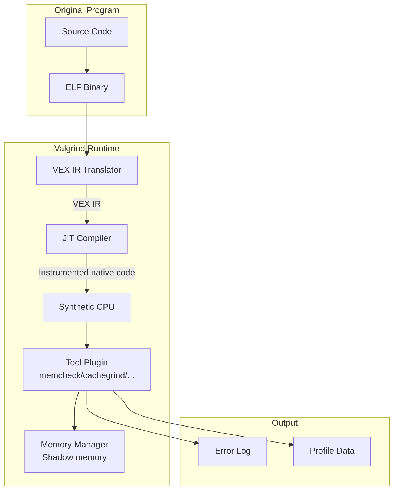
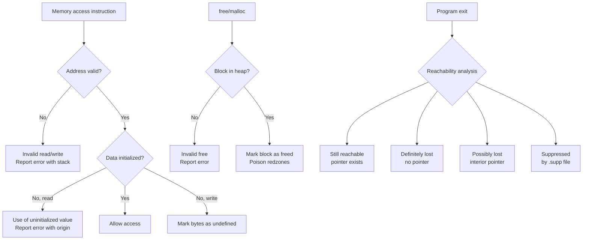

# Chapter 232: Valgrind — memcheck, cachegrind, callgrind, helgrind, drd, massif

## 1. Intuition

Valgrind is a suite of dynamic analysis tools that instrument your program at runtime to detect bugs that compilers and static analyzers miss. Unlike tools like GDB that observe your program's behavior from the outside, Valgrind *replaces* your program's execution with an instrumented version running on a synthetic CPU. This gives Valgrind complete visibility into every memory access, every function call, every thread synchronization operation.

The key insight behind Valgrind is that most serious bugs — memory leaks, use-after-free, data races, cache inefficiency — are fundamentally *dynamic* properties. They depend on the specific path through the code, the input data, and the runtime state. No amount of static analysis can catch them all. Valgrind catches them by watching what actually happens.

Think of Valgrind as running your program under a microscope. Every memory read and write is checked, every allocation is tracked, every lock acquisition is recorded. The tradeoff is speed: Valgrind typically makes programs 10-50x slower. But for debugging, that's a price worth paying — you find bugs that would take days to track down with traditional debuggers.

## 2. Architecture

### 2.1 Valgrind Core Architecture

```
┌─────────────────────────────────────────────────────────────┐
│                    Valgrind Core                             │
│                                                             │
│  ┌──────────────┐  ┌──────────────┐  ┌──────────────────┐  │
│  │ Synthetic CPU│  │ Memory       │  │ Tool Plugin      │  │
│  │ (VEX IR)     │  │ Manager      │  │ Interface        │  │
│  └──────┬───────┘  └──────┬───────┘  └────────┬─────────┘  │
│         │                 │                    │             │
│  ┌──────┴─────────────────┴────────────────────┴──────────┐ │
│  │              JIT Compiler (VEX → native)                │ │
│  └──────────────────────────┬──────────────────────────────┘ │
│                              │                               │
├──────────────────────────────┼───────────────────────────────┤
│                              ▼                               │
│  ┌───────────┐  ┌───────────┐  ┌───────────┐  ┌───────────┐ │
│  │ Memcheck  │  │Cachegrind │  │ Helgrind  │  │  Massif   │ │
│  │           │  │Callgrind  │  │ DRD       │  │           │ │
│  └───────────┘  └───────────┘  └───────────┘  └───────────┘ │
└─────────────────────────────────────────────────────────────┘
                              │
                              ▼
                     Original Program
                     (runs on synthetic CPU)
```

### 2.2 The VEX Intermediate Representation

Valgrind translates every basic block of your program into VEX IR (Valgrind's intermediate representation), instruments it, then JIT-compiles it back to native code:

```
Original x86:
    mov eax, [rbx+8]     ; load from memory
    add eax, ecx          ; arithmetic
    mov [rdx], eax        ; store to memory

VEX IR:
    t1 = LDle:I32(rbx + 8)    ; load (instrumented — checked for validity)
    t2 = Add32(t1, ecx)
    STle(rdx, t2)              ; store (instrumented — checked for validity)

Instrumented (Memcheck):
    t1 = LDle:I32(rbx + 8)
    check_address_valid(rbx + 8, 4)   ; ← added by Memcheck
    check_not_uninitialized(t1, 4)    ; ← added by Memcheck
    t2 = Add32(t1, ecx)
    check_address_valid(rdx, 4)       ; ← added by Memcheck
    STle(rdx, t2)
```

### 2.3 Tool Overview

| Tool | Purpose | Overhead |
|------|---------|----------|
| **memcheck** | Memory errors (leaks, use-after-free, overflows) | 10-30x |
| **cachegrind** | CPU cache profiling | 5-20x |
| **callgrind** | Call graph profiling (extends cachegrind) | 5-25x |
| **helgrind** | Thread errors (data races, deadlocks) | 15-50x |
| **drd** | Thread errors (alternative to helgrind) | 10-30x |
| **massif** | Heap profiling | 5-10x |
| **sgcheck** | Stack and global array overflow detection | 10-20x |
| **lackey** | Instruction counting and system call tracing | 3-5x |
| **BBV** | Basic block vector generation | 5-10x |

## 3. Usage Examples

### 3.1 Memcheck — Memory Error Detection

```bash
# Basic memcheck run
valgrind --tool=memcheck ./myprogram

# Typical output:
# ==12345== Memcheck, a memory error detector
# ==12345== Invalid read of size 4
# ==12345==    at 0x401189: process_data (main.c:23)
# ==12345==    by 0x401234: main (main.c:45)
# ==12345==  Address 0x5204068 is 8 bytes inside a block of size 40 alloc'd
# ==12345==    at 0x4C2AB80: malloc (vg_replace_malloc.c:299)
# ==12345==    by 0x401165: process_data (main.c:20)
# ==12345==    by 0x401234: main (main.c:45)
#
# ==12345== HEAP SUMMARY:
# ==12345==     in use at exit: 1,234 bytes in 12 blocks
# ==12345==   total heap usage: 156 allocs, 144 frees, 45,678 bytes allocated
# ==12345==
# ==12345== 1,234 bytes in 12 blocks are definitely lost in loss record 1 of 3
# ==12345==    at 0x4C2AB80: malloc (vg_replace_malloc.c:299)
# ==12345==    by 0x401165: process_data (main.c:20)
```

#### Common Memcheck Errors

```c
// 1. Invalid read (use-after-free)
int *p = malloc(sizeof(int));
*p = 42;
free(p);
int x = *p;  // ← Valgrind: "Invalid read of size 4"

// 2. Invalid write (buffer overflow)
int *arr = malloc(10 * sizeof(int));
arr[10] = 99;  // ← Valgrind: "Invalid write of size 4"

// 3. Use of uninitialized value
int x;
if (x > 0)  // ← Valgrind: "Conditional jump depends on uninitialised value"
    printf("positive\n");

// 4. Memory leak
void leak() {
    int *p = malloc(100);
    // forgot to free(p)
}  // ← Valgrind: "definitely lost"

// 5. Overlapping memcpy
char buf[100];
memcpy(buf + 10, buf, 50);  // ← Valgrind: "Source and destination overlap"
```

#### Memcheck Advanced Options

```bash
# Track origins of uninitialized values (slower but more informative)
valgrind --tool=memcheck --track-origins=yes ./myprogram

# Show reachable and possibly-lost blocks
valgrind --tool=memcheck --leak-check=full --show-leak-kinds=all ./myprogram

# Generate suppression file for known/acceptable errors
valgrind --tool=memcheck --gen-suppressions=all ./myprogram 2> suppressions.supp

# Use suppression file
valgrind --tool=memcheck --suppressions=my.supp ./myprogram

# Child processes
valgrind --tool=memcheck --trace-children=yes ./myprogram

# Limit reported errors
valgrind --tool=memcheck --error-limit=no ./myprogram

# XML output for CI integration
valgrind --tool=memcheck --xml=yes --xml-file=valgrind.xml ./myprogram

# Custom malloc/free replacement
valgrind --tool=memcheck --soname-synonyms=somalloc=tcmalloc ./myprogram

# Redzone size (increase for better overflow detection)
valgrind --tool=memcheck --redzone-size=32 ./myprogram
```

#### Writing Suppressions

```bash
# Generate suppressions for specific errors
valgrind --tool=memcheck --gen-suppressions=all ./myprogram 2>&1 | \
    grep -A 20 "{" > known_errors.supp

# Example suppression file:
# {
#    known_libc_leak
#    Memcheck:Leak
#    match-leak-kinds: definite
#    fun:malloc
#    fun:_dl_init
#    ...
# }

# Use multiple suppression files
valgrind --suppressions=libc.supp --suppressions=gtk.supp ./myprogram

# Leak check levels
valgrind --leak-check=no ./myprogram        # No leak checking
valgrind --leak-check=summary ./myprogram   # Summary only
valgrind --leak-check=full ./myprogram      # Full with stacks
```

### 3.2 Cachegrind — CPU Cache Profiling

```bash
# Run cachegrind
valgrind --tool=cachegrind ./myprogram

# Output:
# ==12345== Cachegrind, a cache and branch-prediction profiler
# ==12345== I   refs:      123,456,789
# ==12345== I1  misses:      1,234
# ==12345== LLi misses:        567
# ==12345== I1  miss rate:     1.00%
# ==12345==
# ==12345== D   refs:       45,678,901  (30,123,456 rd   + 15,555,445 wr)
# ==12345== D1  misses:      2,345,678  ( 1,234,567 rd   +  1,111,111 wr)
# ==12345== LLd misses:        345,678  (   234,567 rd   +    111,111 wr)
# ==12345== D1  miss rate:      5.1%   (      4.1%       +        7.1%  )
# ==12345==
# ==12345== LL refs:         2,346,912  ( 1,235,801 rd   +  1,111,111 wr)
# ==12345== LL misses:         346,245  (   235,134 rd   +    111,111 wr)
# ==12345== LL miss rate:        0.5%   (      0.4%       +        0.7%  )

# Annotate source code
cg_annotate cachegrind.out.12345

# Annotate specific source file
cg_annotate cachegrind.out.12345 --auto=yes src/main.c

# Compare two runs
cg_diff cachegrind.out.before cachegrind.out.after

# Visualize with KCacheGrind
kcachegrind cachegrind.out.12345

# Simulate different cache configurations
valgrind --tool=cachegrind \
    --I1=65536,4,64 \
    --D1=65536,4,64 \
    --LL=2097152,16,64 \
    ./myprogram
```

### 3.3 Callgrind — Call Graph Profiling

```bash
# Run callgrind (extends cachegrind with call graph)
valgrind --tool=callgrind ./myprogram

# Generate call graph with cache simulation
valgrind --tool=callgrind --cache-sim=yes --branch-sim=yes ./myprogram

# Annotate call graph
callgrind_annotate callgrind.out.12345

# Visualize with KCacheGrind
kcachegrind callgrind.out.12345

# Control instrumentation
valgrind --tool=callgrind \
    --collect-atstart=no \
    --toggle-collect=my_function \
    ./myprogram

# Start/stop profiling programmatically
# #include <valgrind/callgrind.h>
# CALLGRIND_START_INSTRUMENTATION;
# ... code to profile ...
# CALLGRIND_STOP_INSTRUMENTATION;
# CALLGRIND_TOGGLE_COLLECT;
# CALLGRIND_DUMP_STATS;

# Profile specific function
valgrind --tool=callgrind --toggle-collect=process_data ./myprogram

# Multi-threaded profiling
valgrind --tool=callgrind --separate-threads=yes ./myprogram
```

### 3.4 Helgrind — Thread Error Detection

```bash
# Run helgrind
valgrind --tool=helgrind ./myprogram

# Output:
# ==12345== Possible data race during read of size 4 at 0x5204068 by thread #1
# ==12345== Locks held: none
# ==12345==    at 0x401189: worker_func (worker.c:23)
# ==12345==    by 0x4C32C27: mythread_wrapper (hg_intercepts.c:389)
# ==12345==    by 0x4E426DA: start_thread (pthread_create.c:463)
# ==12345==
# ==12345== This conflicts with a previous write of size 4 by thread #2
# ==12345== Locks held: none
# ==12345==    at 0x4011A5: worker_func (worker.c:25)
# ==12345==    by 0x4C32C27: mythread_wrapper (hg_intercepts.c:389)
# ==12345==    by 0x4E426DA: start_thread (pthread_create.c:463)

# Common data race patterns detected:
# - Unsynchronized reads/writes to shared variables
# - Lock ordering violations (potential deadlocks)
# - Missing happens-before relationships
# - POSIX thread API misuse

# Helgrind options
valgrind --tool=helgrind --history-level=full ./myprogram    # Full history
valgrind --tool=helgrind --delta-stacktrace=yes ./myprogram  # Better stacks
valgrind --tool=helgrind --conflict-cache-size=10000000 ./myprogram  # More conflicts tracked
```

### 3.5 DRD — Thread Error Detector (Alternative)

```bash
# DRD is often faster than helgrind
valgrind --tool=drd ./myprogram

# Output similar to helgrind but different detection algorithms

# DRD-specific options
valgrind --tool=drd --check-stack-var=yes ./myprogram     # Check stack variables
valgrind --tool=drd --first-race-only=yes ./myprogram     # First race per location
valgrind --tool=drd --var-info=yes ./myprogram            # Variable info

# Trace mutex operations
valgrind --tool=drd --trace-mutex=yes ./myprogram

# Segment merging (reduce false positives)
valgrind --tool=drd --segment-merging=yes ./myprogram
```

### 3.6 Massif — Heap Profiling

```bash
# Run massif
valgrind --tool=massif ./myprogram

# Generate human-readable report
ms_print massif.out.12345

# Output (ASCII heap chart):
#     MB
#  3.527^                                           #####
#       |                                          #     #
#  3.026^                                         #       #
#       |                                        #         #
#  2.525^                                       #           #
#       |                                      #             #
#  2.024^                                     #               ##
#       |                                    #                  ##
#  1.524^                                   ##                    #
#       |                                  #                       #
#  1.023^                                 #                         ##
#       |                               #                             #
#  0.523^                             ##                               ##
#       |               ###############                                 ##
#  0.000^--------------------------------------------------------------------->
#       0                                                                   time

# Massif options
valgrind --tool=massif --pages-as-heap=yes ./myprogram    # Include mmap allocations
valgrind --tool=massif --stacks=yes ./myprogram           # Include stack usage
valgrind --tool=massif --heap-admin=8 ./myprogram         # Per-alloc overhead
valgrind --tool=massif --threshold=1.0 ./myprogram        # Only show > 1% allocators
valgrind --tool=massif --time-unit=ms ./myprogram         # Time in milliseconds

# Visualize with massif-visualizer
massif-visualizer massif.out.12345

# Track specific allocation pools
valgrind --tool=massif --alloc-fn=my_malloc_wrapper ./myprogram
```

### 3.7 SGCheck — Stack and Global Array Overflow

```bash
# Check for overruns of stack arrays and global arrays
valgrind --tool=sgcheck ./myprogram

# Detects:
# - Stack buffer overflows (beyond alloca/local arrays)
# - Global array overflows
# - Heap block overflows (some cases memcheck misses)
```

### 3.8 Combining Valgrind Tools

```bash
# Run multiple tools sequentially
valgrind --tool=memcheck --leak-check=full ./myprogram 2> memcheck.log
valgrind --tool=cachegrind ./myprogram && cg_annotate cachegrind.out.* > cachegrind.log
valgrind --tool=callgrind ./myprogram && callgrind_annotate callgrind.out.* > callgrind.log
valgrind --tool=helgrind ./myprogram 2> helgrind.log
valgrind --tool=massif ./myprogram && ms_print massif.out.* > massif.log

# Valgrind annotations in source code
# #include <valgrind/memcheck.h>
# VALGRIND_MAKE_MEM_NOACCESS(ptr, size);    // Mark as inaccessible
# VALGRIND_MAKE_MEM_UNDEFINED(ptr, size);   // Mark as undefined
# VALGRIND_MAKE_MEM_DEFINED(ptr, size);     // Mark as defined
# VALGRIND_CHECK_MEM_IS_DEFINED(ptr, size); // Check if defined
# VALGRIND_CREATE_MEMPOOL(pool, rzB, is_zeroed);
# VALGRIND_MEMPOOL_ALLOC(pool, addr, size);
# VALGRIND_MEMPOOL_FREE(pool, addr);
```

### 3.9 Valgrind with Shared Libraries and Dynamic Loading

```bash
# Trace into child processes
valgrind --trace-children=yes ./myprogram

# Trace specific child only
valgrind --trace-children=yes --child-silent-after-fork=yes ./myprogram

# Attach to running process (limited support)
valgrind --tool=memcheck --pid=12345

# Debug shared library issues
valgrind --soname-synonyms=somalloc=tcmalloc ./myprogram  # Custom allocator
valgrind --soname-synonyms=somp=libjemalloc.so ./myprogram
```

### 3.10 CI/CD Integration

```bash
# Run memcheck in CI with strict settings
valgrind --tool=memcheck \
    --leak-check=full \
    --show-leak-kinds=all \
    --errors-for-leak-kinds=all \
    --error-exitcode=1 \
    --xml=yes \
    --xml-file=valgrind.xml \
    --suppressions=ci.supp \
    ./run_tests

# Parse XML output
# Tools: valgrind-merge, valgrind-ci, CodeQL, etc.

# GTest integration
valgrind --tool=memcheck --xml=yes --xml-file=valgrind-%p.xml ./gtest_runner

# Suppression generation for CI
valgrind --tool=memcheck --gen-suppressions=all ./myprogram 2>&1 | \
    python parse_suppressions.py > ci.supp
```

## 4. Source Code References

| Component | File | Description |
|-----------|------|-------------|
| Valgrind core | `coregrind/` | Synthetic CPU and runtime |
| VEX IR | `VEX/` | Intermediate representation and JIT |
| Memcheck | `memcheck/` | Memory error detection |
| Cachegrind | `cachegrind/` | Cache simulation |
| Callgrind | `callgrind/` | Call graph profiling |
| Helgrind | `helgrind/` | Thread error detection |
| DRD | `drd/` | Thread error detection |
| Massif | `massif/` | Heap profiling |
| Replace functions | `coregrind/m_replacemalloc.c` | malloc/free interception |
| Client requests | `include/valgrind/valgrind.h` | Programmatic Valgrind API |

## 5. Diagrams

### Valgrind Execution Model



### Memcheck Shadow Memory

```mermaid
graph LR
    subgraph "Application Memory"
        A1[byte 0: defined]
        A2[byte 1: defined]
        A3[byte 2: UNDEFINED]
        A4[byte 3: defined]
    end

    subgraph "Shadow Memory (1:1 mapping)"
        S1[2 bits per byte<br/>Valid/Invalid/Partial]
    end

    subgraph "Validity Tracking"
        V1[00 = address invalid]
        V2[01 = address partially valid]
        V3[10 = address valid, data undefined]
        V4[11 = address valid, data defined]
    end

    A1 --> S1
    A2 --> S1
    A3 --> S1
    A4 --> S1
    S1 --> V1
    S1 --> V2
    S1 --> V3
    S1 --> V4

    Note over A3: Reading byte 2 →<br/>"Conditional jump depends<br/>on uninitialised value"
```

### Memcheck Memory Error Detection Flow



## 6. Common Pitfalls

### 6.1 Valgrind Too Slow for Large Programs

**Problem:** Program takes hours to run under Valgrind.

**Solution:**
```bash
# Use debug build (smaller, faster to analyze)
gcc -g -O0 -o myapp myapp.c

# Disable expensive checks
valgrind --tool=memcheck --track-origins=no ./myprogram   # Faster
valgrind --tool=memcheck --leak-check=no ./myprogram      # Skip leak check

# Profile specific function only
valgrind --tool=callgrind --toggle-collect=my_function ./myprogram

# Use cachegrind instead of perf for cache analysis (more detailed)
valgrind --tool=cachegrind ./myprogram

# Reduce program runtime with smaller inputs
valgrind --tool=memcheck ./myprogram --test-small-input
```

### 6.2 False Positives from Optimized Code

**Problem:** Valgrind reports errors in compiler-generated code or optimized paths.

**Solution:**
```bash
# Always compile with -g (debug info) and -O0 (no optimization)
gcc -g -O0 -o debug_build source.c

# Install debug symbols for libraries
apt install libc6-dbg libstdc++6-10-dbg

# Use suppression files for known false positives
# Generate one:
valgrind --gen-suppressions=all ./myprogram 2>&1 | grep -A 20 "{" > known.supp

# Common suppressions:
# libc internal allocations
# libpthread initialization
# JIT-compiled code (Java, etc.)
```

### 6.3 Memcheck Doesn't Catch Stack Overflows

**Problem:** Stack buffer overflow is not detected.

**Cause:** Memcheck primarily tracks heap-allocated memory, not stack arrays.

**Solution:**
```bash
# Use AddressSanitizer instead (better for stack overflows)
gcc -fsanitize=address -g -o myapp myapp.c

# Or use SGCheck for stack arrays
valgrind --tool=sgcheck ./myprogram

# Compiler options that help
gcc -fstack-protector-strong -g -o myapp myapp.c  # Stack canaries
```

### 6.4 Helgrind False Positives on Lock-Free Code

**Problem:** Helgrind reports data races in lock-free algorithms (compare-and-swap, atomics).

**Solution:**
```bash
# Use proper atomic operations
int atomic_inc(int *ptr) {
    return __sync_fetch_and_add(ptr, 1);  // Valgrind understands GCC atomics
}

# Or use C11 atomics
#include <stdatomic.h>
atomic_int counter = ATOMIC_VAR_INIT(0);
atomic_fetch_add(&counter, 1);

# Helgrind options
valgrind --tool=helgrind --delta-stacktrace=yes ./myprogram
valgrind --tool=helgrind --ignore-thread-creation=yes ./myprogram

# Use DRD which may handle atomics better
valgrind --tool=drd ./myprogram
```

### 6.5 Massif Shows Flat Heap Profile

**Problem:** Massif shows almost no memory usage, but the program uses lots of memory.

**Cause:** Memory allocated via `mmap()` directly (not through malloc) is not tracked by default.

**Solution:**
```bash
# Include mmap allocations
valgrind --tool=massif --pages-as-heap=yes ./myprogram

# Include stack usage
valgrind --tool=massif --stacks=yes ./myprogram

# Check if custom allocator is used
valgrind --soname-synonyms=somalloc=tcmalloc ./myprogram
valgrind --soname-synonyms=somalloc=jemalloc ./myprogram
```

## 7. Best Practices

### 7.1 Comprehensive Testing with Valgrind

```bash
#!/bin/bash
# valgrind_test.sh - Run all Valgrind checks

set -e

BINARY="./myprogram"
ERRORS=0

echo "=== Memcheck ==="
valgrind --tool=memcheck --leak-check=full --error-exitcode=1 \
    --suppressions=known.supp $BINARY || ((ERRORS++))

echo "=== Cachegrind ==="
valgrind --tool=cachegrind --cache-sim=yes $BINARY
cg_annotate cachegrind.out.* > cachegrind_report.txt

echo "=== Helgrind ==="
valgrind --tool=helgrind --error-exitcode=1 $BINARY || ((ERRORS++))

echo "=== Massif ==="
valgrind --tool=massif --stacks=yes $BINARY
ms_print massif.out.* > massif_report.txt

echo "=== Errors found: $ERRORS ==="
exit $ERRORS
```

### 7.2 Suppression Management

```bash
# Generate suppressions automatically
valgrind --tool=memcheck --gen-suppressions=all ./myprogram 2>&1 | \
    python3 -c "
import sys, re
blocks = sys.stdin.read().split('{')
for block in blocks[1:]:
    name = re.search(r'(\w+)', block).group(1)
    print('{' + block.rstrip() + '}')
" > auto.supp

# Review and edit suppressions
# Only suppress known/acceptable issues
# Add comments explaining why each suppression exists
```

### 7.3 Memory Pool Awareness

```c
// Tell Valgrind about custom memory pools
#include <valgrind/memcheck.h>

void *pool_create(size_t size) {
    void *pool = mmap(NULL, size, PROT_READ|PROT_WRITE,
                      MAP_PRIVATE|MAP_ANONYMOUS, -1, 0);
    VALGRIND_CREATE_MEMPOOL(pool, 16, 0);  // 16-byte redzones
    return pool;
}

void *pool_alloc(void *pool, size_t size) {
    void *ptr = /* allocate from pool */;
    VALGRIND_MEMPOOL_ALLOC(pool, ptr, size);
    return ptr;
}

void pool_free(void *pool, void *ptr) {
    VALGRIND_MEMPOOL_FREE(pool, ptr);
    /* return to pool */
}

void pool_destroy(void *pool, size_t size) {
    VALGRIND_DESTROY_MEMPOOL(pool);
    munmap(pool, size);
}
```

## 8. Exercises

### Exercise 1: Memory Leak Detection
Write a program with intentional memory leaks (dangling pointers, leaked allocations, double-free). Run memcheck and:
1. Identify each leak type
2. Classify as definitely lost, indirectly lost, possibly lost, or still reachable
3. Fix all leaks and verify with Valgrind

### Exercise 2: Cache Optimization
Write a program that processes a large matrix in both row-major and column-major order. Use cachegrind to:
1. Measure L1/L2/LL cache miss rates for each access pattern
2. Use `cg_annotate` to identify the hot lines
3. Optimize the column-major case and measure improvement

### Exercise 3: Thread Safety Audit
Write a multi-threaded program with data races. Use helgrind and DRD to:
1. Identify all data races
2. Fix them with proper synchronization
3. Verify the fixes pass both tools
4. Compare helgrind vs DRD output (speed, accuracy)

### Exercise 4: Heap Profiling
Write a program that processes data with a complex allocation pattern. Use massif to:
1. Identify peak memory usage
2. Find which allocation sites contribute most to peak usage
3. Optimize memory usage and verify with massif

### Exercise 5: Callgrind Profiling
Write a program with a call-intensive workload. Use callgrind to:
1. Generate a call graph
2. Identify the hottest call paths
3. Use `kcachegrind` to visualize the profile
4. Optimize the hot path and verify improvement

## 9. References

1. **Valgrind Manual** — https://valgrind.org/docs/manual/manual.html — Official documentation
2. **Valgrind FAQ** — https://valgrind.org/docs/manual/faq.html — Common questions
3. **Memcheck User Guide** — https://valgrind.org/docs/manual/mc-manual.html — Detailed memcheck documentation
4. **Memcheck Errata** — https://valgrind.org/docs/manual/mc-manual.html#mc-manual.errataitems — Known false positives
5. **Helgrind Manual** — https://valgrind.org/docs/manual/hg-manual.html — Thread error detection
6. **Massif Manual** — https://valgrind.org/docs/manual/ms-manual.html — Heap profiling
7. **Cachegrind Manual** — https://valgrind.org/docs/manual/cg-manual.html — Cache profiling
8. **Valgrind Developer Manual** — https://valgrind.org/docs/manual/mc-design.html — Internal architecture
9. **VEX IR Documentation** — `VEX/pub/` — Intermediate representation
10. **Valgrind Suppression Files** — `/usr/share/valgrind/*.supp` — Default suppressions
