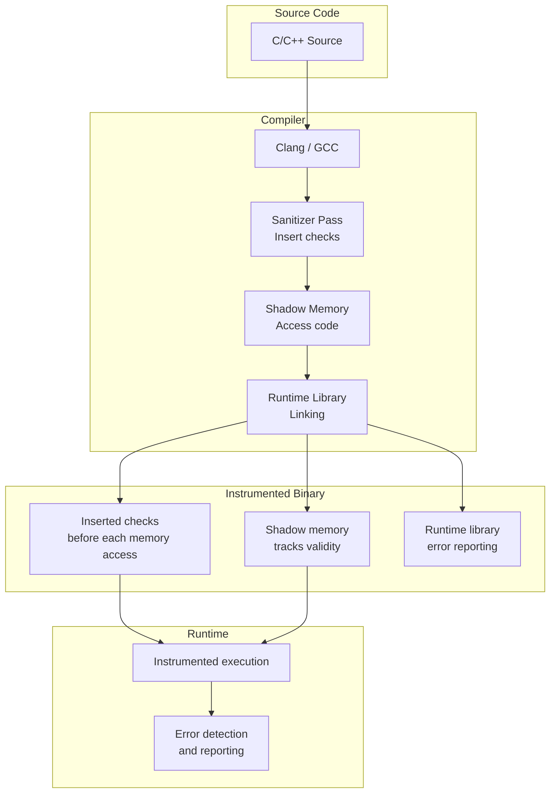
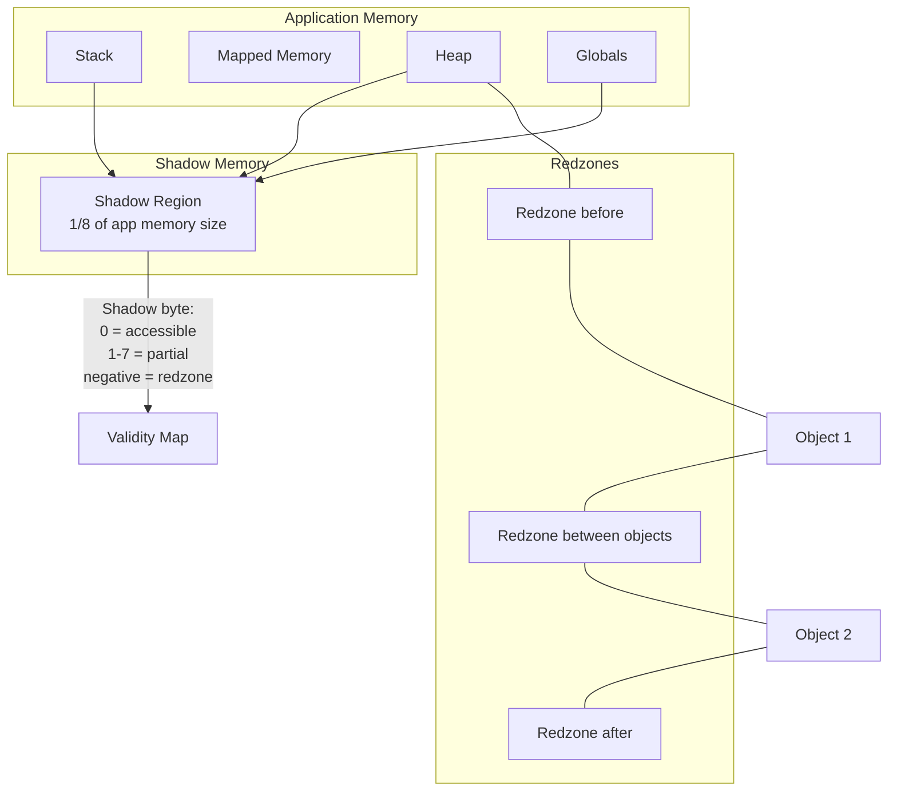
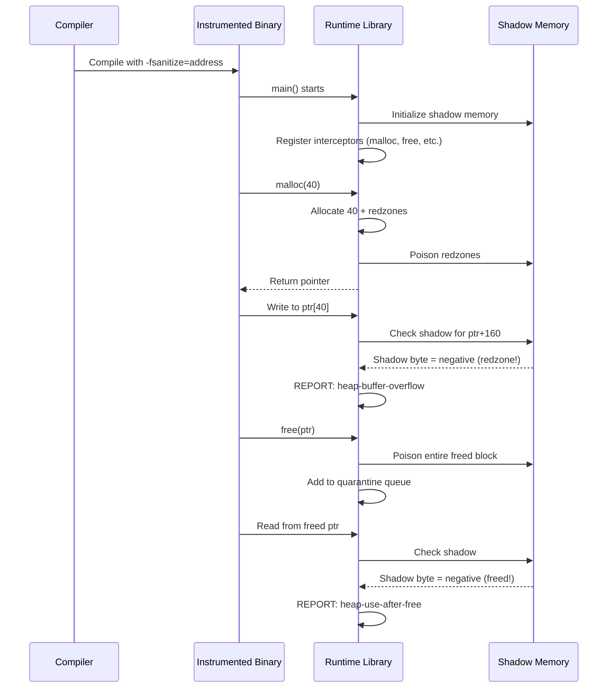

# Chapter 233: Sanitizers — AddressSanitizer, MemorySanitizer, ThreadSanitizer, UBSan

## 1. Intuition

Sanitizers are compiler-based instrumentation tools that detect bugs at runtime with significantly less overhead than Valgrind. Where Valgrind works by interpreting your program on a synthetic CPU (10-50x slowdown), sanitizers work by inserting checks directly into your compiled code (2-10x slowdown). This makes sanitizers practical for use in continuous integration, testing, and even production environments.

The fundamental difference is where the instrumentation happens. Valgrind operates at the *binary level* — it sees machine instructions. Sanitizers operate at the *compiler level* — they see source code semantics, types, and control flow. This gives sanitizers several advantages: they can instrument stack allocations (which Valgrind's memcheck cannot), they understand compiler optimizations, and they produce more precise error messages with source-level information.

Each sanitizer targets a specific class of bugs:

- **ASan (AddressSanitizer):** Memory errors — buffer overflows, use-after-free, double-free
- **MSan (MemorySanitizer):** Uninitialized memory reads
- **TSan (ThreadSanitizer):** Data races between threads
- **UBSan (UndefinedBehaviorSanitizer):** Undefined behavior — integer overflow, null pointer dereference, alignment violations

These tools are part of the compiler (GCC and Clang/LLVM), not separate programs. You enable them with a simple compiler flag, and the resulting binary contains all the detection logic.

## 2. Architecture

### 2.1 Compiler Instrumentation Model



### 2.2 Shadow Memory

Most sanitizers use "shadow memory" — a parallel memory region that tracks metadata about every byte of application memory:

```
Application memory:    [A1][A2][A3][A4][A5][A6][A7][A8]
                       ↓    ↓    ↓    ↓    ↓    ↓    ↓    ↓
Shadow memory:         [S1][S2][S3][S4][S5][S6][S7][S8]

For ASan:
- Shadow byte = 0 → all 8 bytes are accessible
- Shadow byte = k (1-7) → first k bytes are accessible
- Shadow byte = negative → entire region is redzone/freed

Mapping: shadow_addr = (app_addr >> 3) + SHADOW_OFFSET
```

### 2.3 Sanitizer Comparison

| Feature | ASan | MSan | TSan | UBSan |
|---------|------|------|------|-------|
| Slowdown | 2x | 3x | 5-15x | 1.5x |
| Memory overhead | 3x | 3x | 5-10x | minimal |
| Stack overflow | ✅ | ❌ | ❌ | ❌ |
| Heap overflow | ✅ | ❌ | ❌ | ❌ |
| Use-after-free | ✅ | ❌ | ❌ | ❌ |
| Uninitialized read | ❌ | ✅ | ❌ | ❌ |
| Data races | ❌ | ❌ | ✅ | ❌ |
| Integer overflow | ❌ | ❌ | ❌ | ✅ |
| Null deref | ❌ | ❌ | ❌ | ✅ |
| Use in production | Possible | No | No | Yes |
| Compiler support | GCC 4.8+, Clang 3.1+ | Clang 3.3+ | GCC 4.8+, Clang 3.2+ | GCC 4.9+, Clang 3.3+ |

## 3. Usage Examples

### 3.1 AddressSanitizer (ASan)

```bash
# Compile with ASan
gcc -fsanitize=address -g -O1 -fno-omit-frame-pointer -o myapp myapp.c
clang -fsanitize=address -g -O1 -fno-omit-frame-pointer -o myapp myapp.c

# Run
./myapp

# ASan will print detailed error reports:
# ==12345==ERROR: AddressSanitizer: heap-buffer-overflow on address 0x60200000eff4
# at pc 0x000000401189 bp 0x7ffd12345670 sp 0x7ffd12345668
# WRITE of size 4 at 0x60200000eff4 thread T0
#     #0 0x401189 in process_data main.c:23
#     #1 0x401234 in main main.c:45
#
# 0x60200000eff4 is located 4 bytes to the right of 40-byte region [0x60200000efc0,0x60200000eff0)
# allocated by thread T0 here:
#     #0 0x4c2ab80 in malloc (/usr/lib/asan/libasan.so+0x12ab80)
#     #1 0x401165 in process_data main.c:20
```

#### ASan Detects These Errors

```c
// 1. Heap buffer overflow
int *arr = malloc(10 * sizeof(int));
arr[10] = 42;  // ERROR: heap-buffer-overflow

// 2. Stack buffer overflow
void foo() {
    int buf[10];
    buf[10] = 42;  // ERROR: stack-buffer-overflow
}

// 3. Use-after-free
int *p = malloc(4);
free(p);
*p = 42;  // ERROR: heap-use-after-free

// 4. Double-free
int *p = malloc(4);
free(p);
free(p);  // ERROR: double-free

// 5. Stack-use-after-return (requires ASAN_OPTIONS=detect_stack_use_after_return=1)
int *escape() {
    int local = 42;
    return &local;  // ERROR: stack-use-after-return
}

// 6. Stack-use-after-scope
int *escape_scope() {
    int *p;
    {
        int local = 42;
        p = &local;
    }
    return p;  // ERROR: stack-use-after-scope (with -O1+)
}

// 7. Global buffer overflow
int global_array[10];
void foo() {
    global_array[10] = 42;  // ERROR: global-buffer-overflow
}
```

#### ASan Environment Options

```bash
# Detect stack use-after-return
ASAN_OPTIONS=detect_stack_use_after_return=1 ./myapp

# Detect use-after-scope
# Compile with: -fsanitize-address-use-after-scope

# More aggressive detection
ASAN_OPTIONS="detect_stack_use_after_return=1:detect_stack_use_after_scope=1:check_initialization_order=1:detect_odr_violation=2" ./myapp

# Symbolizer
ASAN_OPTIONS="symbolize=1:external_symbolizer_path=/usr/bin/llvm-symbolizer" ./myapp

# Suppress specific errors
LSAN_OPTIONS="suppressions=lsan.supp" ./myapp

# Print shadow memory on error
ASAN_OPTIONS="print_legend=1:print_summary=1" ./myapp

# Abort on error (default) vs continue
ASAN_OPTIONS="halt_on_error=0" ./myapp

# LeakSanitizer (LSan) — enabled by default with ASan
# Disable leak checking
LSAN_OPTIONS="detect_leaks=0" ./myapp

# Report only definite leaks
LSAN_OPTIONS="report_objects=1:max_leaks=10" ./myapp
```

#### ASan Suppressions

```bash
# Create suppression file: asan.supp
# LeakSanitizer suppressions
leak:libsome_legacy.so
leak:third_party_library

# AddressSanitizer suppressions
interceptor_via_fun:__interceptor_malloc

# Use with environment variable
LSAN_OPTIONS=suppressions=asan.supp ./myapp

# Or compile-time
# __attribute__((no_sanitize("address")))
```

### 3.2 MemorySanitizer (MSan)

```bash
# Compile with MSan (Clang only)
clang -fsanitize=memory -g -O1 -fno-omit-frame-pointer -o myapp myapp.c

# IMPORTANT: All linked libraries must also be compiled with MSan
# Use instrumented libc++ for C++ programs
clang -fsanitize=memory -g -O1 \
    -stdlib=libc++ \
    -L/path/to/msan/lib \
    -lc++abi \
    -o myapp myapp.c

# Run
./myapp

# MSan error output:
# ==12345==WARNING: MemorySanitizer: use-of-uninitialized-value
#     #0 0x401189 in process_data main.c:23
#     #1 0x401234 in main main.c:45
#   Uninitialized value was stored to memory at
#     #0 0x401156 in process_data main.c:21
#   Uninitialized value was created by a heap allocation
#     #0 0x4c2ab80 in malloc
#     #1 0x401140 in process_data main.c:20
```

#### MSan Detects These Errors

```c
// 1. Uninitialized heap memory
int *p = malloc(sizeof(int));
if (*p > 0)  // ERROR: use-of-uninitialized-value
    printf("positive\n");

// 2. Uninitialized stack memory
int x;
int y = x + 1;  // ERROR: use-of-uninitialized-value

// 3. Uninitialized struct fields
struct data {
    int a;
    int b;
};
struct data *d = malloc(sizeof(struct data));
d->a = 42;
printf("%d\n", d->b);  // ERROR: use-of-uninitialized-value (b not set)

// 4. Conditional on uninitialized value
int x;
if (x)      // ERROR: use-of-uninitialized-value
    foo();

// 5. Uninitialized memory passed to syscall
int x;
write(1, &x, sizeof(x));  // ERROR: use-of-uninitialized-value
```

#### MSan Options

```bash
# Track origins of uninitialized values (shows where value was created)
MSAN_OPTIONS=track_origins=2 ./myapp

# Poison heap on free (default)
MSAN_OPTIONS=poison_in_malloc=1 ./myapp

# Poison stack on function entry
MSAN_OPTIONS=poison_in_malloc=1:poison_stack_with_zeroes=0 ./myapp

# Keep going after first error
MSAN_OPTIONS=halt_on_error=0 ./myapp

# Symbolizer
MSAN_OPTIONS="symbolize=1:external_symbolizer_path=/usr/bin/llvm-symbolizer" ./myapp
```

### 3.3 ThreadSanitizer (TSan)

```bash
# Compile with TSan
clang -fsanitize=thread -g -O1 -o myapp myapp.c
gcc -fsanitize=thread -g -O1 -o myapp myapp.c

# Run
./myapp

# TSan error output:
# ==================
# WARNING: ThreadSanitizer: data race (pid=12345)
#   Read of size 4 at 0x7f1234567890 by thread T1:
#     #0 worker_func worker.c:23
#     #1 mythread_wrapper (libtsan.so+0x12345)
#
#   Previous write of size 4 at 0x7f1234567890 by thread T2:
#     #0 worker_func worker.c:25
#     #1 mythread_wrapper (libtsan.so+0x12345)
#
#   Location is global 'shared_counter' at 0x000000601030 (myapp+0x601030)
#
#   Thread T1 (tid=12346, running) created by main thread at:
#     #0 pthread_create (libtsan.so+0x12345)
#     #1 main main.c:40
#
#   Thread T2 (tid=12347, running) created by main thread at:
#     #0 pthread_create (libtsan.so+0x12345)
#     #1 main main.c:41
```

#### TSan Detects These Errors

```c
// 1. Data race — unsynchronized read/write
int shared = 0;

void *writer(void *arg) {
    shared = 42;  // Write
    return NULL;
}

void *reader(void *arg) {
    int x = shared;  // Read — DATA RACE
    return NULL;
}

// 2. Lock ordering violation (potential deadlock)
pthread_mutex_t mu1, mu2;

void *thread1(void *arg) {
    pthread_mutex_lock(&mu1);
    pthread_mutex_lock(&mu2);  // ORDER: mu1 → mu2
    // ...
    pthread_mutex_unlock(&mu2);
    pthread_mutex_unlock(&mu1);
    return NULL;
}

void *thread2(void *arg) {
    pthread_mutex_lock(&mu2);
    pthread_mutex_lock(&mu1);  // ORDER: mu2 → mu1 — RACE IN LOCK ORDER
    // ...
    pthread_mutex_unlock(&mu1);
    pthread_mutex_unlock(&mu2);
    return NULL;
}

// 3. Signal handler race
volatile int flag = 0;

void handler(int sig) {
    flag = 1;  // Write in signal handler — potential race
}

void main_loop() {
    while (!flag)  // Read in main thread — potential race
        sleep(1);
}
```

#### TSan Options

```bash
# Detect lock ordering violations
TSAN_OPTIONS="detect_deadlocks=1" ./myapp

# History size (more = better accuracy, more memory)
TSAN_OPTIONS="history_size=7" ./myapp

# Second deadlock detector
TSAN_OPTIONS="detect_deadlocks=1:second_deadlock_stack=1" ./myapp

# Suppress known races
TSAN_OPTIONS="suppressions=tsan.supp" ./myapp

# Report data races even if the program doesn't crash
TSAN_OPTIONS="report_bugs=1" ./myapp

# Strip file paths
TSAN_OPTIONS="strip_path_prefix=/home/user/" ./myapp

# Keep going after first error
TSAN_OPTIONS="halt_on_error=0" ./myapp
```

#### TSan Suppressions

```bash
# tsan.supp
race:third_party_lib_init
race:legacy_module_cleanup
deadlock:old_mutex_code
mutex:libpthread_internal

# Or annotate in source code
# #include <sanitizer/tsan_interface.h>
# void __tsan_acquire(void *addr);
# void __tsan_release(void *addr);
```

#### TSan Annotations in Source Code

```c
#include <sanitizer/tsan_interface.h>

// Annotate happens-before relationships
void publish_data(int *data, int value) {
    *data = value;
    __tsan_release(data);  // Release barrier
}

int read_data(int *data) {
    __tsan_acquire(data);  // Acquire barrier
    return *data;
}

// Annotate custom synchronization
void my_spinlock_lock(int *lock) {
    while (__sync_lock_test_and_set(lock, 1))
        ;  // spin
    __tsan_acquire(lock);
}

void my_spinlock_unlock(int *lock) {
    __tsan_release(lock);
    __sync_lock_release(lock);
}
```

### 3.4 UndefinedBehaviorSanitizer (UBSan)

```bash
# Compile with UBSan
clang -fsanitize=undefined -g -o myapp myapp.c
gcc -fsanitize=undefined -g -o myapp myapp.c

# Run
./myapp

# UBSan error output:
# main.c:15:5: runtime error: signed integer overflow: 2147483647 + 1 cannot be represented in type 'int'
# main.c:23:10: runtime error: load of null pointer of type 'int'
# main.c:31:5: runtime error: shift exponent 32 is too large for 32-bit type 'int'
```

#### UBSan Detects These Issues

```c
// 1. Signed integer overflow
int x = INT_MAX;
x = x + 1;  // ERROR: signed integer overflow

// 2. Unsigned integer wraparound (not UB, but can check)
unsigned int y = UINT_MAX;
y = y + 1;  // OK in C, but UBSan can flag with -fsanitize=unsigned-integer-overflow

// 3. Null pointer dereference
int *p = NULL;
*p = 42;  // ERROR: null pointer dereference

// 4. Misaligned pointer access
char buf[10];
int *p = (int *)(buf + 1);  // Misaligned
*p = 42;  // ERROR: misaligned address

// 5. Out-of-bounds array index (with -fsanitize=bounds)
int arr[10];
arr[10] = 42;  // ERROR: index 10 out of bounds

// 6. Shift by too-large amount
int x = 1 << 32;  // ERROR: shift exponent too large

// 7. Shift of negative value
int x = -1 << 2;  // ERROR: left shift of negative value

// 8. Division by zero
int x = 1 / 0;  // ERROR: division by zero

// 9. Invalid enum value
enum color { RED, GREEN, BLUE };
enum color c = (enum color)42;  // ERROR: not a valid enum value

// 10. VLA (variable-length array) with non-positive size
int n = -1;
int arr[n];  // ERROR: VLA with negative size

// 11. Bool value that's not 0 or 1
_Bool b = *(_Bool *)"\x02";  // ERROR: not a valid bool value

// 12. Object size mismatch
int *p = (int *)malloc(sizeof(short));
*p = 42;  // ERROR with -fsanitize=object-size
```

#### UBSan Sanitizer Groups

```bash
# Enable all UBSan checks
clang -fsanitize=undefined -g -o myapp myapp.c

# Enable specific checks
clang -fsanitize=signed-integer-overflow,null,alignment -g -o myapp myapp.c

# Additional checks (not part of "undefined" group)
clang -fsanitize=unsigned-integer-overflow -g -o myapp myapp.c
clang -fsanitize=integer -g -o myapp myapp.c  # All integer checks
clang -fsanitize=bounds -g -o myapp myapp.c    # Array bounds
clang -fsanitize=enum -g -o myapp myapp.c      # Enum range

# Combine sanitizers
clang -fsanitize=address,undefined -g -o myapp myapp.c  # ASan + UBSan

# UBSan with minimal runtime (production-safe)
clang -fsanitize=undefined -fsanitize-minimal-runtime -g -o myapp myapp.c

# UBSan trap mode (no runtime library needed, just traps on error)
clang -fsanitize=undefined -fsanitize-trap=all -g -o myapp myapp.c

# UBSan with recovery (don't abort, continue execution)
clang -fsanitize=undefined -fno-sanitize-recover=all -g -o myapp myapp.c
# Default: recover from some checks, abort on others
clang -fsanitize=undefined -fno-sanitize-recover=signed-integer-overflow,null -g -o myapp myapp.c
```

### 3.5 Combining Sanitizers

```bash
# ASan + UBSan (most common combination)
clang -fsanitize=address,undefined -g -O1 -fno-omit-frame-pointer -o myapp myapp.c

# MSan + UBSan (Clang only)
clang -fsanitize=memory,undefined -g -O1 -fno-omit-frame-pointer \
    -stdlib=libc++ -o myapp myapp.c

# TSan + UBSan (Clang only)
clang -fsanitize=thread,undefined -g -O1 -o myapp myapp.c

# NOTE: ASan and TSan cannot be combined (conflict)
# NOTE: ASan and MSan cannot be combined (conflict)
# NOTE: TSan and MSan cannot be combined (conflict)
```

### 3.6 Sanitizers in Testing

```bash
# Run test suite with sanitizers
CFLAGS="-fsanitize=address,undefined -g -O1 -fno-omit-frame-pointer"
LDFLAGS="-fsanitize=address,undefined"

# CMake
cmake -DCMAKE_C_FLAGS="$CFLAGS" -DCMAKE_CXX_FLAGS="$CFLAGS" \
      -DCMAKE_EXE_LINKER_FLAGS="$LDFLAGS" ..
make && make test

# Bazel
bazel test --copt=-fsanitize=address --linkopt=-fsanitize=address //...

# pytest (Python C extensions)
python -m pytest --valgrind  # Use pytest-valgrind plugin

# Go (built-in race detector)
go test -race ./...
```

### 3.7 Sanitizers in Production (UBSan only)

```bash
# UBSan with minimal runtime — safe for production
clang -fsanitize=undefined \
    -fsanitize-minimal-runtime \
    -fno-sanitize-recover=all \
    -g -O2 -o myapp myapp.c

# UBSan trap mode — zero overhead, just aborts on error
clang -fsanitize=undefined \
    -fsanitize-trap=all \
    -g -O2 -o myapp myapp.c

# ASan in production (with some overhead)
clang -fsanitize=address \
    -O2 -g \
    -fno-omit-frame-pointer \
    -fsanitize-address-use-after-scope \
    -o myapp myapp.c

# Production ASan options
ASAN_OPTIONS="detect_leaks=0:halt_on_error=1:log_path=/var/log/asan" ./myapp
```

### 3.8 Custom Sanitizer Wrappers

```c
// Custom memory allocator with ASan awareness
#include <sanitizer/asan_interface.h>

void *my_alloc(size_t size) {
    void *ptr = malloc(size + 16);  // Extra for redzone
    if (!ptr) return NULL;
    
    // Poison the redzone
    ASAN_POISON_MEMORY_REGION((char *)ptr + size, 16);
    
    return ptr;
}

void my_free(void *ptr, size_t size) {
    // Unpoison before freeing
    ASAN_UNPOISON_MEMORY_REGION((char *)ptr + size, 16);
    free(ptr);
}

// Check if memory is poisoned
bool is_valid(void *ptr, size_t size) {
    return __asan_address_is_poisoned(ptr) == 0;
}

// Mark memory as inaccessible
void quarantine(void *ptr, size_t size) {
    ASAN_POISON_MEMORY_REGION(ptr, size);
}

// Mark memory as accessible
void unquarantine(void *ptr, size_t size) {
    ASAN_UNPOISON_MEMORY_REGION(ptr, size);
}
```

### 3.9 Diagnostic Tools for Sanitizer Output

```bash
# Symbolize ASan output
./myapp 2>&1 | asan_symbolize.py

# Parse TSan output
./myapp 2>&1 | python3 -c "
import sys, re
for line in sys.stdin:
    m = re.match(r'WARNING: ThreadSanitizer: (\w+)', line)
    if m:
        print(f'Race type: {m.group(1)}')
"

# Generate HTML report from sanitizer output
./myapp 2>&1 | python3 sanitizer_report.py > report.html

# Integrate with CI (GitHub Actions, GitLab CI, etc.)
# - Run with each sanitizer
# - Parse output for errors
# - Fail build on sanitizer errors
```

## 4. Source Code References

| Component | File | Description |
|-----------|------|-------------|
| ASan runtime | `compiler-rt/lib/asan/` | ASan runtime library (Clang) |
| ASan GCC | `libsanitizer/asan/` | ASan runtime library (GCC) |
| MSan runtime | `compiler-rt/lib/msan/` | MSan runtime library |
| TSan runtime | `compiler-rt/lib/tsan/` | TSan runtime library |
| UBSan runtime | `compiler-rt/lib/ubsan/` | UBSan runtime library |
| ASan instrumentation | `llvm/lib/Transforms/Instrumentation/AddressSanitizer.cpp` | LLVM pass |
| Shadow memory layout | `compiler-rt/lib/asan/asan_mapping.h` | Memory mapping |
| LSan (leak sanitizer) | `compiler-rt/lib/lsan/` | Leak detection (bundled with ASan) |
| Sanitizer common | `compiler-rt/lib/sanitizer_common/` | Shared sanitizer utilities |

## 5. Diagrams

### ASan Memory Layout



### ASan Error Detection Flow

```mermaid
flowchart TD
    ACCESS[Memory Access: addr, size] --> CALC[Calculate shadow address<br/>shadow = (addr >> 3) + OFFSET]
    CALC --> READ_SHADOW[Read shadow byte]
    READ_SHADOW --> CHECK{Shadow == 0?}
    CHECK -->|Yes| OK[Access allowed]
    CHECK -->|No| CHECK2{Shadow > 0 &&<br/>last 3 bits + size <= shadow?}
    CHECK2 -->|Yes| OK2[Access allowed<br/>partial region]
    CHECK2 -->|No| ERROR[ACCESS VIOLATION]
    ERROR --> REPORT[Report error]
    REPORT --> STACK[Print stack trace]
    REPORT --> SHADOW_DUMP[Dump shadow memory]
    REPORT --> REGION[Describe allocation region]
    REPORT --> HINT[Suggest cause]
```

### Sanitizer Interaction with Program Lifecycle



## 6. Common Pitfalls

### 6.1 Missing Library Symbols with MSan

**Problem:** MSan reports false positives in system libraries.

**Cause:** System libraries not compiled with MSan.

**Solution:**
```bash
# MSan requires ALL libraries to be instrumented
# Use Clang's instrumented libc++ for C++ programs
clang -fsanitize=memory -stdlib=libc++ \
    -L/path/to/llvm/lib -lc++abi \
    -o myapp myapp.c

# For pure C, MSan usually works with standard glibc
# False positives in glibc internals can be suppressed
MSAN_OPTIONS="suppressions=msan.supp" ./myapp
```

### 6.2 TSan Doesn't Work with Certain Threading Models

**Problem:** TSan doesn't detect races in custom threading (e.g., fibers, coroutines).

**Solution:**
```bash
# Annotate custom synchronization
#include <sanitizer/tsan_interface.h>

void fiber_switch(fiber_t *from, fiber_t *to) {
    __tsan_release(from);
    __tsan_acquire(to);
    // actual context switch
}

# For Go's goroutines, TSan is built into the Go runtime
# For Rust, use ThreadSanitizer via -Z sanitizer=thread
```

### 6.3 ASan Interferes with Other Tools

**Problem:** ASan's custom malloc breaks Valgrind, gdb, profilers.

**Solution:**
```bash
# ASan uses its own malloc implementation
# When using GDB with ASan:
# - ASan interceptors may conflict with GDB's memory access
# - Use ASAN_OPTIONS="detect_odr_violation=0" if needed

# When profiling ASan builds:
# - perf may show ASan runtime functions as hotspots
# - Filter with: perf record --call-graph dwarf ./myapp
# - Use: perf report --exclude-other --include=.*

# Valgrind + ASan: don't use together (conflict)
```

### 6.4 Sanitizer Build Breaks with `-O2` or Higher

**Problem:** ASan/TSan reports errors that don't appear without optimization.

**Cause:** Optimizations may reorder code, eliminate variables, or inline functions.

**Solution:**
```bash
# Use -O1 for debugging (good balance of speed and accuracy)
clang -fsanitize=address -g -O1 -o myapp myapp.c

# For production testing with ASan
clang -fsanitize=address -g -O2 -fno-omit-frame-pointer -o myapp myapp.c

# If -O2 causes false positives, try -Og
clang -fsanitize=address -g -Og -o myapp myapp.c
```

### 6.5 Running Out of Shadow Memory

**Problem:** ASan/MSan/TSan fails with "ERROR: Shadow memory range is not large enough."

**Cause:** Program uses too much memory (common with 32-bit programs or very large heaps).

**Solution:**
```bash
# Increase shadow memory (ASan)
ASAN_OPTIONS="quarantine_size_mb=256:redzone=1024" ./myapp

# For 32-bit programs, consider building 64-bit
gcc -m64 -fsanitize=address -o myapp myapp.c

# Reduce memory usage with smaller redzones
ASAN_OPTIONS="redzone=16" ./myapp
```

## 7. Best Practices

### 7.1 CI/CD Integration Strategy

```bash
# Run different sanitizers on different test suites
# Test suite A: Memory-intensive → ASan + UBSan
CFLAGS="-fsanitize=address,undefined -g -O1" run_tests_a

# Test suite B: Concurrency-intensive → TSan + UBSan
CFLAGS="-fsanitize=thread,undefined -g -O1" run_tests_b

# Test suite C: Init-heavy code → MSan + UBSan (Clang only)
CFLAGS="-fsanitize=memory,undefined -g -O1" run_tests_c

# Quick validation: UBSan only (fastest)
CFLAGS="-fsanitize=undefined -g -O1" run_tests_all
```

### 7.2 Gradual Sanitizer Adoption

```bash
# Step 1: Start with UBSan (lowest overhead, catches UB)
clang -fsanitize=undefined -fsanitize-trap=all -g -O2 -o myapp myapp.c

# Step 2: Add ASan for memory testing
clang -fsanitize=address,undefined -g -O1 -o myapp_test myapp.c

# Step 3: Add TSan for concurrency testing
clang -fsanitize=thread,undefined -g -O1 -o myapp_thread_test myapp.c

# Step 4: Add MSan for initialization testing (requires all libs instrumented)
clang -fsanitize=memory,undefined -g -O1 -o myapp_msan_test myapp.c

# Step 5: Enable in CI
# Run each sanitizer on a subset of tests to manage runtime
```

### 7.3 Sanitizer-Aware Code

```c
// Good practices for sanitizer-friendly code:

// 1. Always initialize variables
int x = 0;  // Good: initialized
struct data d = {0};  // Good: zero-initialized

// 2. Use atomic operations for shared data
#include <stdatomic.h>
atomic_int counter = ATOMIC_VAR_INIT(0);
atomic_fetch_add(&counter, 1);

// 3. Check allocation results
int *p = malloc(n * sizeof(int));
if (!p) return -1;  // Good: check for NULL

// 4. Use bounds-checked functions
snprintf(buf, sizeof(buf), "%s", input);  // Good: bounds-checked
// vs
sprintf(buf, "%s", input);  // Bad: no bounds check

// 5. Annotate intentional UB
int safe_overflow_add(int a, int b) {
    // This is intentional — using wrapping arithmetic
    return (unsigned)a + (unsigned)b;  // Good: explicit unsigned wrap
}
```

## 8. Exercises

### Exercise 1: ASan Bug Hunt
Write a program with 5 different memory bugs (heap overflow, use-after-free, double-free, stack overflow, global overflow). Compile with ASan and:
1. Identify each bug from the ASan output
2. Understand the shadow memory representation for each
3. Fix all bugs and verify clean ASan run

### Exercise 2: MSan Initialization Tracking
Write a program that reads uninitialized memory through various paths (direct read, conditional, function argument, struct field). Compile with MSan and:
1. Trace each uninitialized value back to its source
2. Use `track_origins=2` for detailed origin information
3. Fix all initialization issues

### Exercise 3: TSan Race Detection
Write a multi-threaded program with data races in:
1. Simple shared variable access
2. Lock-free data structure
3. Double-checked locking pattern

Use TSan to identify and fix each race. Compare with helgrind results.

### Exercise 4: UBSan Undefined Behavior
Write a program exhibiting 10 different forms of undefined behavior. Compile with UBSan and:
1. Identify each UB instance
2. Understand why each is UB per the C/C++ standard
3. Rewrite to avoid UB while preserving intent

### Exercise 5: Multi-Sanitizer Testing
Write a comprehensive test suite and run it with different sanitizer combinations:
1. ASan + UBSan for memory-intensive tests
2. TSan + UBSan for concurrency tests
3. Measure and compare execution time with each combination
4. Create a CI script that runs the appropriate sanitizer for each test category

## 9. References

1. **AddressSanitizer** — https://github.com/google/sanitizers/wiki/AddressSanitizer — Official ASan documentation
2. **MemorySanitizer** — https://github.com/google/sanitizers/wiki/MemorySanitizer — Official MSan documentation
3. **ThreadSanitizer** — https://github.com/google/sanitizers/wiki/ThreadSanitizerCppManual — TSan documentation
4. **UBSan** — https://clang.llvm.org/docs/UndefinedBehaviorSanitizer.html — Clang UBSan docs
5. **Sanitizers Wiki** — https://github.com/google/sanitizers — All sanitizer projects
6. **compiler-rt** — https://compiler-rt.llvm.org/ — Runtime libraries for sanitizers
7. **ASan Paper** — "AddressSanitizer: A Fast Address Sanity Checker" (Serebryany et al., USENIX ATC 2012)
8. **TSan Paper** — "ThreadSanitizer – data race detection in practice" (Serebryany et al., WBIA 2009)
9. **LeakSanitizer** — https://github.com/google/sanitizers/wiki/AddressSanitizerLeakSanitizer — Leak detection
10. **Sanitizers in Chromium** — https://www.chromium.org/developers/testing/addresssanitizer — Real-world usage patterns
