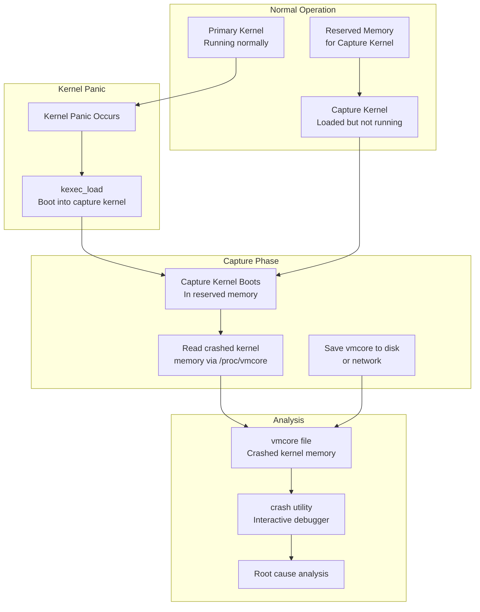
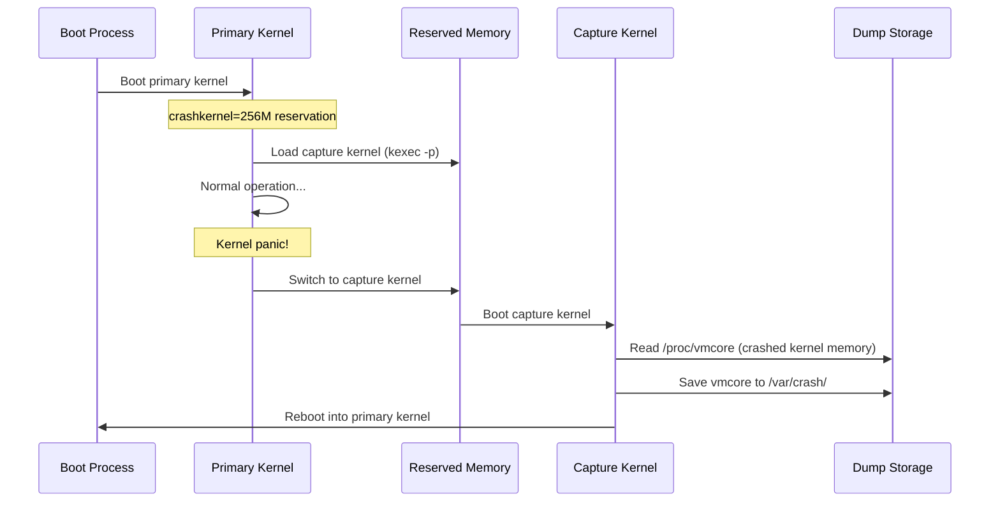
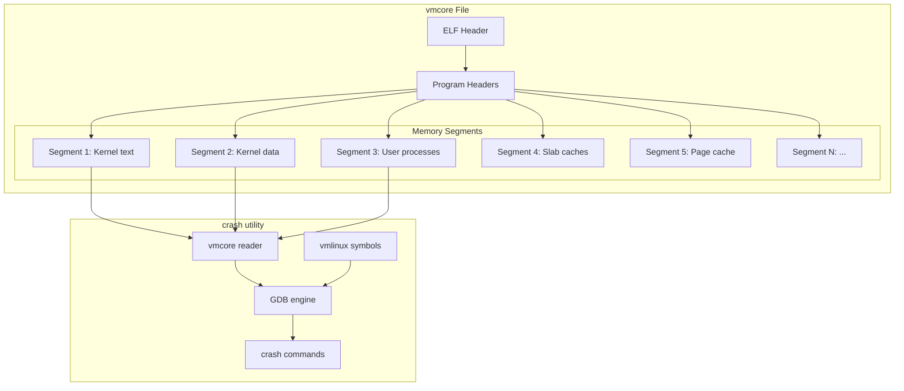
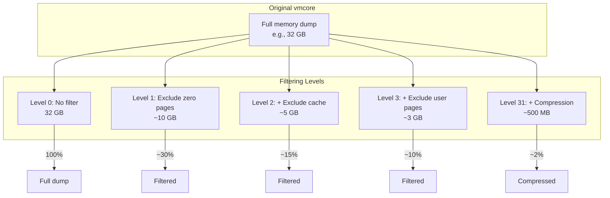

# Chapter 234: Crash Dumps and kdump — kdump Configuration, crash Utility, makedumpfile, vmcore Analysis

## 1. Intuition

When a Linux kernel panics, the system is dead. The kernel's internal data structures — process lists, memory maps, device states, lock contents — are frozen at the moment of failure. Unlike userspace crashes where you can attach a debugger or generate a core dump, a kernel panic means the operating system itself has failed. There's no higher-level entity to capture the state.

kdump solves this by running a *second kernel* alongside the primary one. This "capture kernel" sits in reserved memory, untouched by the primary kernel's operation. When the primary kernel panics, it boots into the capture kernel, which then dumps the crashed kernel's memory (the "vmcore") to disk. This vmcore is a snapshot of the entire system state at the moment of the panic — every process, every lock, every data structure.

The `crash` utility then reads this vmcore file offline, providing an interactive debugger (similar to GDB) that understands kernel data structures. You can examine process lists, trace the call stack that led to the panic, inspect memory allocations, check lock states, and analyze device driver behavior — all from the post-mortem dump.

Think of kdump as a flight recorder for your Linux kernel. Just as aircraft black boxes survive crashes and record the final moments of flight, kdump preserves the kernel's state through a crash and makes it available for analysis.

## 2. Architecture

### 2.1 kdump Architecture



### 2.2 Memory Layout

```
┌─────────────────────────────────────────┐
│             Physical Memory             │
│                                         │
│  ┌────────────────────────────────────┐ │
│  │     Primary Kernel Memory         │ │  ← Crashed kernel's memory
│  │     (captured as vmcore)          │ │
│  │                                   │ │
│  │  ┌─────────┐ ┌─────────┐         │ │
│  │  │ Process │ │ Kernel  │         │ │
│  │  │ Memory  │ │ Stacks  │         │ │
│  │  └─────────┘ └─────────┘         │ │
│  │  ┌─────────┐ ┌─────────┐         │ │
│  │  │ Slab    │ │ Page    │         │ │
│  │  │ Caches  │ │ Tables  │         │ │
│  │  └─────────┘ └─────────┘         │ │
│  └────────────────────────────────────┘ │
│                                         │
│  ┌────────────────────────────────────┐ │
│  │   Reserved Memory for Capture     │ │
│  │   (capture kernel runs here)      │ │
│  │                                   │ │
│  │  ┌──────────┐ ┌──────────┐       │ │
│  │  │ Capture  │ │ Initramfs│       │ │
│  │  │ Kernel   │ │          │       │ │
│  │  └──────────┘ └──────────┘       │ │
│  └────────────────────────────────────┘ │
└─────────────────────────────────────────┘
```

### 2.3 The crash Utility

```
┌─────────────────────────────────────────────┐
│                 crash utility                │
│                                             │
│  ┌──────────┐  ┌──────────┐  ┌───────────┐ │
│  │ vmcore   │  │ vmlinux  │  │ GDB       │ │
│  │ reader   │  │ symbols  │  │ engine    │ │
│  └──────────┘  └──────────┘  └───────────┘ │
│  ┌──────────┐  ┌──────────┐  ┌───────────┐ │
│  │ Kernel   │  │ Task     │  │ Memory    │ │
│  │ data     │  │ table    │  │ analyzer  │ │
│  │ parsers  │  │          │  │           │ │
│  └──────────┘  └──────────┘  └───────────┘ │
│  ┌──────────────────────────────────────┐   │
│  │        Interactive Command Shell     │   │
│  └──────────────────────────────────────┘   │
└─────────────────────────────────────────────┘
         │                    │
    ┌────┘                    └────┐
    ▼                              ▼
 vmcore                    vmlinux (with debug info)
```

### 2.4 makedumpfile

makedumpfile compresses and filters vmcore dumps:

| Dump Level | Description | Size Reduction |
|------------|-------------|----------------|
| 0 | No filtering (full dump) | None |
| 1 | Exclude zero pages | ~50-70% |
| 2 | Exclude zero + cache pages | ~70-85% |
| 3 | Exclude zero + cache + user data | ~80-90% |
| 4 | Exclude zero + cache + user + free | ~85-95% |
| 31 | Maximum compression | ~90-99% |

## 3. Usage Examples

### 3.1 kdump Configuration

#### Install kdump

```bash
# RHEL/CentOS/Fedora
yum install kexec-tools crash kernel-debuginfo

# Debian/Ubuntu
apt install linux-crashdump kdump-tools crash
# During installation, answer "Yes" to enable kdump

# openSUSE/SLES
yast2 kdump    # Or manually:
zypper install kdump kexec-tools crash
```

#### Configure kdump (RHEL/CentOS)

```bash
# Edit /etc/kdump.conf
cat > /etc/kdump.conf << 'EOF'
# Where to save the dump
path /var/crash
core_collector makedumpfile -l --message-level 1 -d 31

# Auto reboot after dump
reboot on

# Default action if dump fails
default reboot

# Compression
compress zlib

# SSH target (optional)
# ssh user@dumpserver
# sshkey /root/.ssh/kdump_id_rsa
# path /var/crash/remote

# NFS target (optional)
# nfsserver nfsserver.example.com
# path /exports/crash
EOF

# Set crashkernel reservation in GRUB
# For BIOS:
# Edit /etc/default/grub
GRUB_CMDLINE_LINUX="crashkernel=256M"
# Or auto-resize:
GRUB_CMDLINE_LINUX="crashkernel=auto"

# Update GRUB
grub2-mkconfig -o /boot/grub2/grub.cfg

# Enable and start kdump
systemctl enable kdump
systemctl start kdump
systemctl status kdump
```

#### Configure kdump (Debian/Ubuntu)

```bash
# Edit /etc/default/grub.d/kdump-tools.cfg
GRUB_CMDLINE_LINUX_DEFAULT="$GRUB_CMDLINE_LINUX_DEFAULT crashkernel=256M"

# Update GRUB
update-grub

# Edit /etc/default/kdump-tools
USE_KDUMP=1
KDUMP_SYSCTL="kernel.panic_on_oops=1"

# Set dump location
# /etc/kdump-tools.conf
# USE_KDUMP=1
# KDUMP_COREDIR="/var/crash"

# Enable kdump
systemctl enable kdump-tools
systemctl start kdump-tools
```

#### Configure kdump (openSUSE/SLES)

```bash
# YaST method
yast2 kdump

# Manual configuration
# /etc/sysconfig/kdump
KDUMP_KERNELVER=""
KDUMP_COMMANDLINE=""
KDUMP_COMMANDLINE_APPEND="panic=10 irqpoll nr_cpus=1"
KDUMP_CPUS="1"
KDUMP_IMMEDIATE_REBOOT="yes"
KDUMP_TRANSFER=""
KDUMP_SAVEDIR="/var/crash"
KDUMP_KEEP_OLD_DUMPS="5"
KDUMP_FREE_DISK_SIZE="64M"
KDUMP_VERBOSE="3"
KDUMP_DUMPLEVEL="31"
KDUMP_DUMPFORMAT="compressed"

# Enable
systemctl enable kdump
systemctl start kdump
```

### 3.2 Testing kdump

```bash
# Check kdump status
kdumpctl status      # RHEL
kdump-config status  # Debian

# Verify crashkernel reservation
cat /proc/cmdline | grep crashkernel
dmesg | grep -i crashkernel

# Test with sysrq trigger (CAUTION: crashes the system!)
echo c > /proc/sysrq-trigger

# Alternative: use kdumpctl test
kdumpctl propagate   # Set up SSH keys if needed
```

### 3.3 Analyzing vmcore with the crash Utility

```bash
# Start crash with vmcore
crash /usr/lib/debug/lib/modules/$(uname -r)/vmlinux \
      /var/crash/127.0.0.1-2024-01-15-10:30:00/vmcore

# If vmlinux is compressed (vmlinuz)
crash /boot/vmlinuz-$(uname -r) \
      /var/crash/127.0.0.1-2024-01-15-10:30:00/vmcore

# With debuginfo
crash --debuginfo=/usr/lib/debug/lib/modules/$(uname -r)/vmlinux \
      /var/crash/*/vmcore

# Output:
# crash 8.0.4
# ...
# SYSTEM MAP: /boot/System.map-5.4.0-42-generic
# DEBUG KERNEL: /usr/lib/debug/lib/modules/5.4.0-42-generic/vmlinux
# DUMPFILE: /var/crash/202401151030/vmcore
# CPUS: 8
# DATE: Mon Jan 15 10:30:00 2024
# UPTIME: 5 days, 2:30:45
# LOAD AVERAGE: 2.50, 1.80, 1.20
# TASKS: 567
# NODENAME: server1
# RELEASE: 5.4.0-42-generic
# VERSION: #46-Ubuntu SMP
# MACHINE: x86_64 (2400 Mhz)
# MEMORY: 32 GB
# PANIC: "BUG: unable to handle page fault for address: ffffffff82345678"
# PID: 1234
# COMMAND: "myapp"
# TASK: ffff880123456000 [THREAD_INFO: ffff880123456000]
```

### 3.4 crash Commands

```bash
# System information
crash> sys          # System summary
crash> sys -i       # With IRQ info

# Process information
crash> ps           # Process list
crash> ps -m        # With memory usage
crash> ps -l        # With last run CPU
crash> ps | grep myapp  # Filter

# Current task (at time of panic)
crash> task         # Current task struct
crash> set          # Current context

# Switch to a specific process
crash> set 1234     # Switch to PID 1234
crash> set -c 3     # Switch to CPU 3

# Backtrace
crash> bt           # Backtrace of current task
crash> bt -a        # Backtrace of all active tasks
crash> bt -l        # With line numbers
crash> bt -f        # Full frame data

# Example backtrace:
# PID: 1234  TASK: ffff880123456000  CPU: 2  COMMAND: "myapp"
#  #0 [ffff880123457a58] machine_kexec at ffffffff8105a1c3
#  #1 [ffff880123457ab8] __crash_kexec at ffffffff8110a2e6
#  #2 [ffff880123457b88] panic at ffffffff81078c4e
#  #3 [ffff880123457c08] die at ffffffff8102a1cb
#  #4 [ffff880123457c38] no_context at ffffffff81065e3c
#  #5 [ffff880123457c88] __bad_area_nosemaphore at ffffffff81066084
#  #6 [ffff880123457cd8] bad_area at ffffffff8106615e
#  #7 [ffff880123457d08] __do_page_fault at ffffffff8106647b
#  #8 [ffff880123457d78] do_page_fault at ffffffff8106678e
#  #9 [ffff880123457da8] page_fault at ffffffff81801a2e
#     [exception RIP: process_data+42]
#     RIP: ffffffff81234567  RSP: ffff880123457e58  RFLAGS: 00010246
#     RAX: 0000000000000000  RBX: ffff880134567890  RCX: 0000000000000001
#     RDX: ffffffff82345678  RSI: 0000000000000001  RDI: ffff880134567890
#     RBP: ffff880123457e68   R8: 0000000000000000   R9: 0000000000000000
#     R10: ffff880134567890  R11: 0000000000000001  R12: 0000000000000001
#     R13: ffff880134567890  R14: 0000000000000000  R15: ffff880134567890
#     ORIG_RAX: ffffffffffffffff  CS: 0010  SS: 0018

# Memory analysis
crash> kmem -s       # Slab cache summary
crash> kmem -i       # Memory info
crash> kmem -v       # VMalloc info
crash> kmem <addr>   # Info about specific address

# Examine memory
crash> rd ffffffff81234567 16    # Read 16 words at address
crash> rd -8 ffffffff81234567 32 # Read 32 bytes
crash> rd -s ffffffff81234567 16 # Read as signed

# Struct inspection
crash> struct task_struct ffff880123456000
crash> struct task_struct.pid ffff880123456000
crash> struct inode.i_ino ffff880198765432

# List walking
crash> list task_struct.tasks -H init_task.tasks -s task_struct.pid

# Filesystem analysis
crash> files 1234           # Open files for PID 1234
crash> mount               # Mounted filesystems
crash> vfsopen /path/to/file  # Open file info

# Network analysis
crash> net -s               # Socket summary
crash> net -a               # ARP table
crash> net -r               # Routing table
crash> tcp                  # TCP connections

# Log analysis
crash> log                 # Kernel log buffer
crash> log | grep -i error # Filter log

# Device/driver analysis
crash> pci                 # PCI devices
crash> irq                 # IRQ info
crash> mod                 # Loaded modules
crash> dev -d              # Block devices

# Search memory
crash> search -k ffffffff81234567   # Search kernel memory
crash> search -m 0xdeadbeef         # Search all memory
```

### 3.5 makedumpfile Usage

```bash
# Create filtered dump manually
makedumpfile -l --message-level 31 -d 31 /proc/vmcore /var/crash/vmcore.dump

# Options:
# -l              Use lzo compression
# -c              Use zlib compression
# -p              Use snappy compression
# -d 31           Maximum dump level (exclude zero, cache, user, free)
# --message-level 1  Minimal output

# Analyze dump
makedumpfile -i /var/crash/vmcore.dump    # Show dump info

# Generate header for crash utility
makedumpfile --dump-dmesg /proc/vmcore /var/crash/dmesg.txt

# Generate flattened format (for partial dumps)
makedumpfile -F -l -d 31 /proc/vmcore /var/crash/vmcore.flat

# Size estimation
makedumpfile -d 31 --size-estimate /proc/vmcore

# Split dump across multiple files
makedumpfile -l -d 31 --split /proc/vmcore /var/crash/vmcore

# Reassemble split dump
makedumpfile -F /var/crash/vmcore.0 /var/crash/vmcore.1 /var/crash/vmcore
```

### 3.6 Remote Dump Collection

```bash
# Dump over SSH
# In /etc/kdump.conf:
ssh user@dumpserver
sshkey /root/.ssh/kdump_id_rsa
path /var/crash

# Dump over NFS
nfsserver nfsserver.example.com
path /exports/crash

# Dump over iSCSI (for SAN environments)
iscsi user@target/iqn.2024-01.com.example:target1

# Dump over network (raw TCP)
net user@dumpserver

# Remote analysis
crash /usr/lib/debug/lib/modules/$(uname -r)/vmlinux \
      scp://user@dumpserver/var/crash/*/vmcore
```

### 3.7 Post-Mortem Analysis Workflow

```bash
# Step 1: Load the vmcore
crash /usr/lib/debug/lib/modules/$(uname -r)/vmlinux /var/crash/*/vmcore

# Step 2: Get system overview
crash> sys
crash> log | tail -50

# Step 3: Identify the panicked task
crash> set
crash> bt

# Step 4: Examine the panic message
crash> log | grep -i "panic\|bug\|oops\|fault"

# Step 5: Walk the stack
crash> bt -a    # All tasks
crash> bt -l    # With line numbers

# Step 6: Examine memory state
crash> kmem -i    # Memory usage
crash> kmem -s    # Slab allocation

# Step 7: Check for common issues
crash> ps | grep -i defunct    # Zombie processes
crash> ps | grep -i stuck      # Stuck processes

# Step 8: Analyze locks
crash> foreach bt               # All process backtraces
crash> struct mutex <addr>      # Check mutex state

# Step 9: Device/driver state
crash> mod                      # Loaded modules
crash> irq                      # IRQ state
crash> pci                      # PCI devices

# Step 10: Write report
crash> quit
```

### 3.8 crash Scripts and Automation

```bash
# Run crash commands from a script file
crash -i analyze.gdb /path/to/vmlinux /path/to/vmcore

# analyze.gdb:
# sys
# log | tail -100
# bt
# bt -a
# kmem -i
# ps | grep defunct
# quit

# Generate HTML report
crash --no-header -i report.crash /path/to/vmlinux /path/to/vmcore

# Batch analysis of multiple vmcores
for vmcore in /var/crash/*/vmcore; do
    echo "=== Analyzing $vmcore ==="
    crash -i batch.crash /path/to/vmlinux "$vmcore" > "${vmcore%.vmcore}.report"
done
```

### 3.9 kdump with Special Configurations

```bash
# kdump with early kdump (for very early boot panics)
# Enable in initramfs
# /etc/dracut.conf.d/kdump.conf
add_dracutmodules+=" kdump "

# kdump with UEFI Secure Boot
# May need to sign the capture kernel
sbsign --key /path/to/MOK.key --cert /path/to/MOK.crt \
    --output /boot/vmlinuz-kdump /boot/vmlinuz-$(uname -r)

# kdump with custom capture kernel
# /etc/kdump.conf
# extra_modules <module1> <module2>
# extra_bins /usr/bin/my_debug_tool

# kdump with kexec_file_load (newer API)
# /etc/sysconfig/kdump (RHEL)
# KEXEC_ARGS="--kexec-file-syscall"

# kdump on virtual machines
# VMware: ensure enough reserved memory
# KVM/QEMU: enable pvpanic device
# -device pvpanic
```

### 3.10 Memory Forensics with crash

```bash
# Extract specific process memory
crash> proc -m 1234    # Memory map of PID 1234

# Read process memory
crash> rd -u 7ffd12345000 256    # Read user-space memory

# Walk page tables
crash> vtop 7ffd12345000    # Virtual to physical translation
crash> pte ffffffff81234567  # Page table entry

# Analyze slab allocator
crash> kmem -s               # All slab caches
crash> kmem -S <slab_cache>  # Objects in specific cache

# Network forensics
crash> net -s                # Socket summary
crash> struct sock <addr>    # Inspect socket
crash> tcp                   # TCP connections
crash> arp                   # ARP table

# Lock analysis
crash> struct mutex <addr>   # Mutex state
crash> struct rw_semaphore <addr>  # RW semaphore
crash> struct spinlock <addr>      # Spinlock

# Check for kernel taint
crash> sys | grep -i taint
# TAINT: G (proprietary module), D (died recently)
```

## 4. Source Code References

| Component | File | Description |
|-----------|------|-------------|
| kexec system call | `kernel/kexec.c` | kexec_load/kexec_file_load |
| kexec_core | `kernel/kexec_core.c` | Core kexec functionality |
| crash kernel setup | `kernel/kexec_core.c` | Capture kernel boot |
| vmcore ELF | `fs/proc/vmcore.c` | /proc/vmcore implementation |
| crash dump headers | `include/linux/kexec.h` | Crash header definitions |
| crash utility | `github.com/crash-utility/crash` | Post-mortem analysis tool |
| makedumpfile | `github.com/makedumpfile/makedumpfile` | Dump compression/filtering |
| kdump init scripts | `scripts/kdump/` or `/etc/kdump-*` | Distribution-specific setup |

## 5. Diagrams

### kdump Lifecycle



### vmcore Structure



### makedumpfile Filtering Levels



## 6. Common Pitfalls

### 6.1 kdump Not Working — No vmcore Generated

**Problem:** System panics but no vmcore appears in `/var/crash/`.

**Solution:**
```bash
# Check kdump service status
systemctl status kdump

# Check crashkernel reservation
cat /proc/cmdline | grep crashkernel
# Should show: crashkernel=256M or crashkernel=auto

# Check if capture kernel is loaded
kdumpctl status    # RHEL
kdump-config show  # Debian

# Check if kexec is loaded
kexec -l    # Should show loaded kernel

# Check dmesg for kexec errors
dmesg | grep -i kexec

# Check if enough memory is reserved
# With 32GB RAM, 256M should be sufficient
# With 128GB+ RAM, may need more: crashkernel=512M

# Rebuild initramfs if needed
kdumpctl rebuild    # RHEL
update-initramfs -u  # Debian
```

### 6.2 vmcore Too Large for Disk

**Problem:** vmcore fills up the dump partition.

**Solution:**
```bash
# Use maximum compression
# /etc/kdump.conf
core_collector makedumpfile -l --message-level 1 -d 31

# Dump to NFS or SSH instead of local disk
# /etc/kdump.conf
ssh user@dumpserver
sshkey /root/.ssh/kdump_id_rsa
path /var/crash

# Or dump to NFS
nfsserver nfsserver.example.com
path /exports/crash

# Rotate old dumps
# /etc/kdump.conf
# keep_old_dumps 5
```

### 6.3 crash Can't Find Debug Symbols

**Problem:** crash reports "crash: cannot resolve symbol" or shows no symbolic information.

**Solution:**
```bash
# Install kernel debug symbols
apt install linux-image-$(uname -r)-dbg        # Debian/Ubuntu
debuginfo-install kernel-$(uname -r)            # RHEL/CentOS

# Verify debug symbols
file /usr/lib/debug/boot/vmlinux-$(uname -r)
# Should show: ELF 64-bit LSB executable, not stripped

# Use uncompressed vmlinux, not vmlinuz
crash /usr/lib/debug/boot/vmlinux-$(uname -r) /var/crash/*/vmcore

# Check debuginfo path
crash --debuginfo=/usr/lib/debug/lib/modules/$(uname -r)/vmlinux \
      /boot/vmlinuz-$(uname -r) /var/crash/*/vmcore
```

### 6.4 Capture Kernel Doesn't Boot

**Problem:** System reboots instead of dumping vmcore on panic.

**Cause:** Capture kernel fails to boot, or panic action is set to reboot.

**Solution:**
```bash
# Check panic setting
cat /proc/sys/kernel/panic
# Should be > 0 (seconds to wait before reboot)

# Set in kdump.conf
# /etc/kdump.conf
default reboot    # What to do if dump fails

# Try increasing crashkernel reservation
crashkernel=512M    # From 256M

# Check if hardware supports kexec boot
# Some systems don't support kexec in EFI mode
# Try: kexec --type=bzImage64
```

### 6.5 VM/Container kdump Issues

**Problem:** kdump doesn't work in virtual machines.

**Solution:**
```bash
# VMware: add to VM config
# monitor_control.enable_kexec = "TRUE"

# KVM/QEMU: enable pvpanic
# -device pvpanic

# Hyper-V: enable dmidecode
# May need special kernel config

# Docker/containers: kdump is host-level only
# Run kdump on the host, capture container crashes via host vmcore

# For cloud instances (AWS, GCP, Azure):
# May need specific crashkernel values
# AWS: crashkernel=256M
# GCP: check documentation for supported configurations
```

## 7. Best Practices

### 7.1 Production kdump Deployment

```bash
# 1. Always enable kdump on production servers
systemctl enable kdump

# 2. Use dump level 31 for minimal storage
# /etc/kdump.conf
core_collector makedumpfile -l --message-level 1 -d 31

# 3. Dump to remote storage (NFS/SSH)
# Prevents losing dumps if local disk is corrupt

# 4. Set up automatic analysis
# Cron job to check for new dumps
# /etc/cron.daily/kdump-analyze
#!/bin/bash
for vmcore in /var/crash/*/vmcore; do
    if [ -f "$vmcore" ] && [ ! -f "${vmcore}.analyzed" ]; then
        crash -i /opt/kdump/analyze.cmd \
            /usr/lib/debug/boot/vmlinux-$(uname -r) "$vmcore" \
            > "${vmcore}.report" 2>&1
        touch "${vmcore}.analyzed"
        mail -s "vmcore analysis: $(hostname)" admin@example.com < "${vmcore}.report"
    fi
done

# 5. Rotate old dumps
# Keep last 5 dumps
# /etc/kdump.conf
keep_old_dumps 5
```

### 7.2 Crash Analysis Checklist

```bash
# Step-by-step crash analysis
# 1. System info
crash> sys

# 2. Panic reason
crash> log | grep -A5 -B5 "panic\|BUG\|Oops"

# 3. Current task backtrace
crash> bt
crash> bt -l    # With source lines

# 4. All tasks backtrace (for deadlock detection)
crash> bt -a

# 5. Memory state
crash> kmem -i

# 6. Process state
crash> ps | grep -E "D|Z|T"    # Blocked, zombie, stopped

# 7. Lock contention
crash> foreach bt | grep -A2 "mutex_lock\|spin_lock"

# 8. Device state
crash> mod
crash> irq

# 9. Network state
crash> net -s
crash> tcp

# 10. Kernel log (last entries before panic)
crash> log | tail -30
```

## 8. Exercises

### Exercise 1: kdump Setup
Configure kdump on a test system:
1. Install kdump packages
2. Configure crashkernel reservation
3. Generate a test crash with `echo c > /proc/sysrq-trigger`
4. Verify vmcore is generated in `/var/crash/`
5. Load the vmcore with crash and examine it

### Exercise 2: Crash Analysis Basics
Using a provided vmcore file:
1. Determine the system configuration (CPU, memory, uptime)
2. Identify the panic reason from the kernel log
3. Trace the call stack of the panicked task
4. Examine the memory state at the time of panic
5. List all processes and identify any stuck/zombie processes

### Exercise 3: Memory Leak Investigation
Using crash to investigate a memory leak:
1. Examine slab cache statistics
2. Identify which slab cache is growing
3. Walk the objects in the suspicious cache
4. Trace back to the allocating function
5. Identify the root cause

### Exercise 4: Deadlock Detection
Using crash to find a deadlock:
1. Examine all process backtraces
2. Identify processes waiting on mutexes/semaphores
3. Trace the lock chain to find the cycle
4. Determine which processes are involved
5. Identify the root cause (lock ordering violation)

### Exercise 5: makedumpfile Optimization
Experiment with makedumpfile compression:
1. Generate dumps at different dump levels (0, 1, 2, 3, 31)
2. Compare file sizes and generation time
3. Verify each dump is readable by crash
4. Test different compression algorithms (zlib, lzo, snappy)
5. Recommend the optimal configuration for your use case

## 9. References

1. **kdump Documentation** — `Documentation/admin-guide/kdump/kdump.rst` — In-kernel documentation
2. **crash White Paper** — https://crash-utility.github.io/ — crash utility documentation
3. **makedumpfile** — https://github.com/makedumpfile/makedumpfile — Dump compression tool
4. **Red Hat kdump Guide** — https://access.redhat.com/documentation/en-us/red_hat_enterprise_linux/html/managing_systems_using_the_rhel8_web_console/assembly_working-with-kdump_managing-systems-using-the-rhel8-web-console
5. **crash Changelog** — https://github.com/crash-utility/crash/releases — Version history
6. **kexec man page** — `man 8 kexec` — kexec usage
7. **vmcore format** — `Documentation/admin-guide/kdump/vmcoreinfo.rst` — vmcore structure
8. **kdump.conf man page** — `man 5 kdump.conf` — Configuration reference
9. **crash Utility Extensions** — https://github.com/crash-utility/crash/tree/master/extensions — Extension modules
10. **Linux Kernel Crash Book** — Various resources on kernel crash analysis
