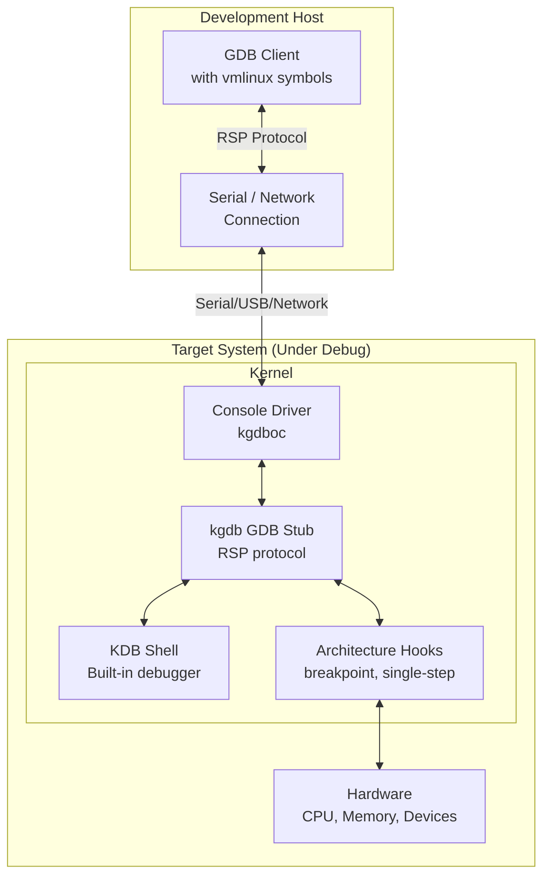
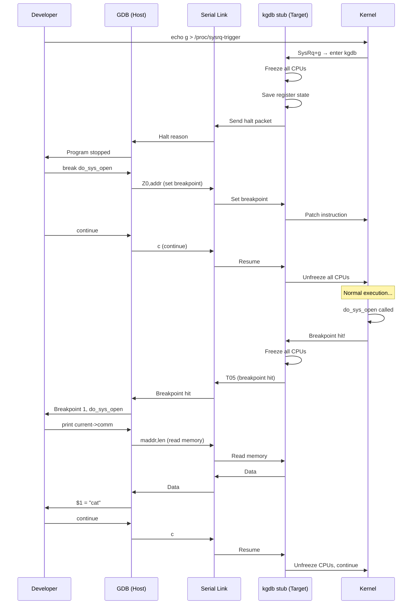
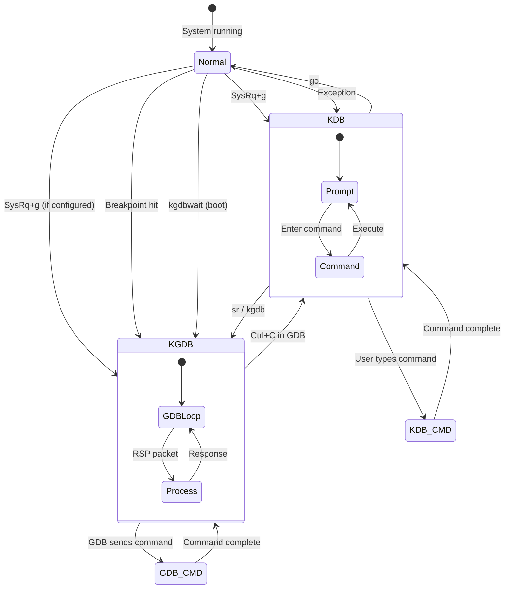
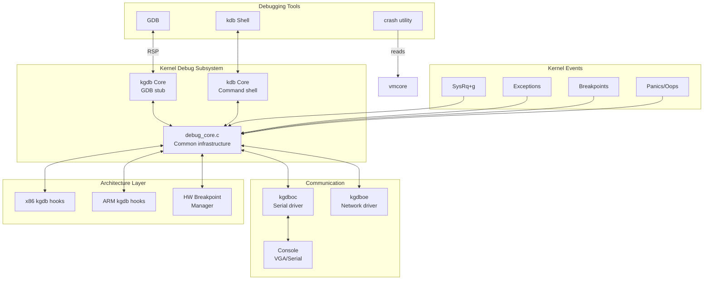

# Chapter 235: kgdb — Kernel Debugger: kgdboc, kdb, Serial Debugging, Breakpoints in Kernel

## 1. Intuition

kgdb is the Linux kernel's interactive debugger. While `crash` analyzes kernel state *after* a crash (post-mortem), kgdb lets you debug the kernel *while it's running* — setting breakpoints, single-stepping through kernel code, examining data structures in real time, and even fixing bugs on the fly.

Think of kgdb as GDB for the kernel. In fact, that's literally what it is — kgdb implements the GDB Remote Serial Protocol (RSP) on the kernel side, so you connect to it with a standard GDB client. The kernel-under-debug (the "target") communicates with the GDB host over a serial port, network connection, or virtual console. When a breakpoint hits or you interrupt the kernel, the target freezes and GDB takes control, just like debugging a userspace program.

There are two related but distinct interfaces:

- **kgdb:** The GDB stub. Communicates with a GDB client over serial/network. Full GDB functionality — breakpoints, watchpoints, single-stepping, expression evaluation.
- **kdb:** The kernel debugger built-in shell. Runs directly on the system console. Simpler than kgdb but doesn't require a separate GDB host. Useful for quick inspections.

The two can be used together: kdb for quick "what's going on" questions, kgdb for deep debugging sessions with breakpoints and stepping.

## 2. Architecture

### 2.1 kgdb Architecture



### 2.2 Debug Communication Channels

| Channel | Driver | Description |
|---------|--------|-------------|
| Serial port | `kgdboc` | Traditional RS-232 serial (most reliable) |
| USB serial | `kgdboc` | USB-to-serial adapter |
| Virtual console | `kgdboc` | KVM/QEMU virtual serial |
| Network | `kgdboe` | Ethernet-based debugging (less common) |
| VGA | `kgdboc` | VGA console (with limitations) |

### 2.3 kgdb vs. kdb

```
┌─────────────────────────────────────────────────────────────┐
│                    Kernel Debugging Modes                    │
├─────────────────────────┬───────────────────────────────────┤
│         kgdb            │              kdb                  │
├─────────────────────────┼───────────────────────────────────┤
│ GDB protocol (RSP)      │ Built-in command shell            │
│ Runs on development host│ Runs on target console            │
│ Full GDB features       │ Limited but quick                 │
│ Breakpoints             │ Breakpoints (limited)             │
│ Single-stepping         │ Single-stepping (basic)           │
│ Expression evaluation   │ Memory/register dump              │
│ Remote debugging        │ Local debugging                   │
│ Requires serial/network │ Uses existing console             │
│ Best for: deep debugging│ Best for: quick inspection        │
└─────────────────────────┴───────────────────────────────────┘

Switch between modes:
- kdb → kgdb: kgdb mode on (in kdb shell)
- kgdb → kdb: Ctrl+C in GDB → kdb shell appears
```

### 2.4 kgdb Internals

When kgdb is activated (breakpoint hit, `SysRq+g`, or exception), the kernel:

1. **Freezes all CPUs** — Sends an IPI (Inter-Processor Interrupt) to stop all other CPUs.
2. **Saves state** — Registers, stack, current task.
3. **Enters kgdb stub** — The architecture-specific `kgdb_arch_handle_exception()` function.
4. **Communicates with GDB** — Reads/writes RSP packets over the communication channel.
5. **Resumes** — When GDB says "continue," unfreezes all CPUs and returns to normal execution.

```
Normal kernel execution
        │
        ▼
    Breakpoint hit / SysRq+g / Exception
        │
        ▼
    ┌───────────────────────────────────┐
    │  Freeze all CPUs (IPI)           │
    │  Save registers                  │
    │  Enter kgdb stub                 │
    │  ┌───────────────────────────┐   │
    │  │  RSP Protocol Loop       │   │
    │  │  ← GDB sends command     │   │
    │  │  → kgdb executes command  │   │
    │  │  → kgdb sends response   │   │
    │  │  (repeat until "continue")│   │
    │  └───────────────────────────┘   │
    │  Resume all CPUs                 │
    └───────────────────────────────────┘
        │
        ▼
    Normal kernel execution continues
```

## 3. Usage Examples

### 3.1 Kernel Configuration for kgdb

```bash
# Required kernel config options
# CONFIG_KGDB=y                # Enable kgdb
# CONFIG_KGDB_SERIAL_CONSOLE=y # Serial console support
# CONFIG_KDB=y                 # Enable kdb
# CONFIG_KDB_KEYBOARD=y        # Keyboard support for kdb
# CONFIG_FRAME_POINTER=y       # Better stack traces
# CONFIG_DEBUG_INFO=y          # Debug symbols
# CONFIG_GDB_SCRIPTS=y         # GDB helper scripts

# Optional but recommended
# CONFIG_DEBUG_INFO_REDUCED=n   # Full debug info
# CONFIG_RANDOMIZE_BASE=n       # Disable KASLR for easier debugging
# CONFIG_DEBUG_RODATA=n         # Allow writing to read-only data

# Check current kernel config
zcat /proc/config.gz | grep -E "KGDB|KDB|DEBUG_INFO"
# Or
grep -E "KGDB|KDB|DEBUG_INFO" /boot/config-$(uname -r)

# Rebuild kernel with kgdb support
make menuconfig
# Kernel hacking → KGDB: kernel debugger → Enable
# Kernel hacking → KGDB: kernel debugger → KGDB: use serial console
make -j$(nproc)
make modules_install
make install
```

### 3.2 Setting Up kgdboc (Serial Console)

```bash
# Configure kgdboc on the target
# Method 1: Kernel command line (GRUB)
# Edit /etc/default/grub
GRUB_CMDLINE_LINUX="kgdboc=ttyS0,115200 kgdbcon"
# Or for USB serial:
GRUB_CMDLINE_LINUX="kgdboc=ttyUSB0,115200"

# Update GRUB
grub2-mkconfig -o /boot/grub2/grub.cfg

# Method 2: Runtime configuration
echo ttyS0 > /sys/module/kgdboc/parameters/kgdboc
# Or
echo "ttyS0,115200" > /sys/module/kgdboc/parameters/kgdboc

# Method 3: SysRq trigger to enter kgdb
echo g > /proc/sysrq-trigger

# Check if kgdboc is configured
cat /sys/module/kgdboc/parameters/kgdboc
```

### 3.3 Connecting GDB to kgdb

On the development host:

```bash
# Load the kernel with debug symbols
gdb /usr/lib/debug/boot/vmlinux-$(uname -r)

# Or if using uncompressed vmlinux
gdb /path/to/linux/vmlinux

# Connect to target via serial
(gdb) target remote /dev/ttyUSB0

# Connect via serial with baud rate
(gdb) target remote /dev/ttyS0

# Connect via network (if using kgdboe)
(gdb) target remote udp:192.168.1.100:6443

# Connect via QEMU virtual serial
(gdb) target remote :1234

# Connect via SSH tunnel
ssh -L 1234:localhost:1234 user@target
(gdb) target remote :1234
```

### 3.4 Basic kgdb Debugging

```bash
# Set a breakpoint in kernel function
(gdb) break do_sys_open
Breakpoint 1 at 0xffffffff81234567: file fs/open.c, line 1050.

# Continue execution (resume kernel)
(gdb) continue

# On the target, trigger the breakpoint
cat /etc/hostname

# GDB will stop:
# Breakpoint 1, do_sys_open (dfd=..., filename=..., flags=..., mode=...)
#     at fs/open.c:1050
# 1050    {

# Examine kernel data
(gdb) print current->comm
$1 = "cat\000\000\000\000\000\000\000\000\000\000\000\000"
(gdb) print current->pid
$2 = 1234

# Step through kernel code
(gdb) next
(gdb) step

# Single instruction
(gdb) stepi
(gdb) nexti

# Print kernel structures
(gdb) print *filp
(gdb) print *inode
(gdb) print *current

# Continue until function returns
(gdb) finish

# Continue execution
(gdb) continue
```

### 3.5 kdb — The Built-in Kernel Debugger

```bash
# Enter kdb via SysRq
# Press Alt+SysRq+g (or echo g > /proc/sysrq-trigger)

# kdb prompt appears:
# Entering kdb (current=0xffff880123456000, pid 1234) on processor 0
# due to Keyboard Entry
# [0]kdb>

# Basic kdb commands
kdb> bt              # Backtrace of current task
kdb> bt 1234         # Backtrace of PID 1234
kdb> btp 1234        # Backtrace of process

kdb> ps              # Process list
kdb> ps R            # Running processes
kdb> ps D            # Uninterruptible sleep

kdb> cpu             # CPU info
kdb> cpu 1           # Switch to CPU 1

kdb> md 0xffffffff81234567 16    # Memory dump (16 words)
kdb> mdr 0xffffffff81234567 64  # Raw memory dump (64 bytes)
kdb> mds 0xffffffff81234567 16  # Symbolic dump

kdb> rd              # Registers
kdb> rm eax 0x42     # Modify register

kdb> id 0xffffffff81234567    # Disassemble

kdb> go              # Continue execution
kdb> go 0xffffffff81234567    # Continue from specific address

kdb> sr              # Activate kgdb (switch to GDB mode)
kdb> kgdb            # Switch to kgdb

kdb> help            # List all commands
kdb> help bt         # Help for specific command

# kdb breakpoints (limited)
kdb> bp 0xffffffff81234567    # Set breakpoint at address
kdb> bp do_sys_open           # Set breakpoint at function
kdb> bl                       # List breakpoints
kdb> bc 1                     # Clear breakpoint 1
kdb> bd 1                     # Disable breakpoint 1
kdb> be 1                     # Enable breakpoint 1

# kdb with breakpoints
kdb> bp do_sys_open
kdb> go
# When breakpoint hits:
# Entering kdb (current=0xffff880123456000, pid 5678) on processor 2
# due to Breakpoint @ 0xffffffff81234567
# [2]kdb>
```

### 3.6 Debugging Kernel Modules

```bash
# Load module symbols into GDB
(gdb) add-symbol-file /path/to/module.ko 0xffffffffa0000000

# Or use the module's text address from /sys/module/<name>/sections/.text
(gdb) add-symbol-file /path/to/module.ko \
    $(cat /sys/module/my_module/sections/.text)

# Set breakpoint in module
(gdb) break my_module_function

# With modern GDB and debug info
(gdb) lx-symbols              # Load all module symbols (requires GDB scripts)

# Using GDB helper scripts (CONFIG_GDB_SCRIPTS=y)
(gdb) lx-dmesg                # Print kernel log
(gdb) lx-lsmod                # List loaded modules
(gdb) lx-symbols              # Load all module symbols
(gdb) lx-ps                   # List processes
(gdb) lx-cmdline              # Show kernel command line
(gdb) lx-cpus                 # CPU information
(gdb) lx-version              # Kernel version
(gdb) lx-dmesg                # Kernel messages
```

### 3.7 GDB Python Scripts for Kernel Debugging

```python
# kernel_debug.py — GDB Python extensions for kernel debugging

import gdb

class KernelTaskList(gdb.Command):
    """List all kernel tasks with their state."""

    def __init__(super().__init__("task-list", gdb.COMMAND_DATA)

    def invoke(self, arg, from_tty):
        init_task = gdb.parse_and_eval("init_task")
        tasks = init_task['tasks']['next']
        head = init_task['tasks'].address

        while tasks != head:
            task = gdb.parse_and_eval(
                f"(struct task_struct *){int(tasks) - gdb.parse_and_eval('&((struct task_struct *)0)->tasks')}"
            )
            pid = int(task['pid'])
            state = int(task['state'])
            comm = task['comm'].string()
            state_str = {0: 'R', 1: 'S', 2: 'D', 4: 'T', 8: 'Z'}.get(state, '?')
            print(f"[{state_str}] PID {pid}: {comm}")
            tasks = tasks['next']

KernelTaskList()

class KernelDmesg(gdb.Command):
    """Print kernel dmesg buffer."""

    def __init__(self):
        super().__init__("kern-dmesg", gdb.COMMAND_STATUS)

    def invoke(self, arg, from_tty):
        gdb.execute("p (char *)log_buf")
        gdb.execute(f"p (int)log_buf_len")

KernelDmesg()
```

### 3.8 Debugging Kernel Oops/Panic

```bash
# When kernel hits an oops, it can enter kdb automatically
# Configure via:
echo 1 > /proc/sys/kernel/panic_on_oops  # Panic on oops (enters kgdb)
echo 0 > /proc/sys/kernel/panic_on_oops  # Just oops, continue

# SysRq keys for debugging
# SysRq+b - Reboot immediately
# SysRq+c - Trigger a crash (for kdump)
# SysRq+d - Shows all locks that are held
# SysRq+g - Enter kgdb/kdb
# SysRq+l - Show backtrace of all CPUs
# SysRq+m - Show memory info
# SysRq+p - Show registers
# SysRq+s - Sync all filesystems
# SysRq+t - Show all tasks

# Enable SysRq
echo 1 > /proc/sys/kernel/sysrq

# Trigger specific SysRq
echo g > /proc/sysrq-trigger    # Enter kdb
echo l > /proc/sysrq-trigger    # Show all CPU backtraces
echo t > /proc/sysrq-trigger    # Show all tasks
echo d > /proc/sysrq-trigger    # Show held locks
```

### 3.9 QEMU + kgdb Setup

This is the most common and safest way to practice kernel debugging:

```bash
# On the host: build a kernel with kgdb support
cd /path/to/linux
make menuconfig  # Enable KGDB, KDB, DEBUG_INFO
make -j$(nproc)

# Create a minimal rootfs
# Using Buildroot or busybox

# Start QEMU with debug support
qemu-system-x86_64 \
    -kernel arch/x86/boot/bzImage \
    -append "root=/dev/sda rw console=ttyS0 kgdboc=ttyS1,115200 kgdbcon nokaslr" \
    -drive file=rootfs.img,format=raw \
    -net nic -net user \
    -serial stdio \
    -serial tcp::1234,server,nowait \
    -m 2G \
    -smp 2

# In another terminal, connect GDB
gdb vmlinux
(gdb) target remote :1234
(gdb) break start_kernel
(gdb) continue

# Or use QEMU's built-in GDB stub (-gdb option)
qemu-system-x86_64 \
    -kernel arch/x86/boot/bzImage \
    -append "root=/dev/sda rw console=ttyS0 nokaslr" \
    -drive file=rootfs.img,format=raw \
    -gdb tcp::1234 \
    -S    # Start paused (wait for GDB)

# Connect GDB
gdb vmlinux
(gdb) target remote :1234
(gdb) break start_kernel
(gdb) continue
```

### 3.10 Advanced kgdb Techniques

```bash
# Watchpoints in kernel code
(gdb) watch global_variable
(gdb) watch *(int *)0xffffffff81234567

# Conditional breakpoints
(gdb) break do_sys_open if flags & O_CREAT

# Break on kernel module load
(gdb) break load_module

# Break on system call entry
(gdb) break sys_open
(gdb) break __x64_sys_open

# Trace kernel exceptions
(gdb) break do_page_fault
(gdb) break do_trap

# Debug interrupt handlers
(gdb) break do_IRQ
(gdb) break handle_irq

# Debug scheduler
(gdb) break schedule
(gdb) break context_switch

# Debug memory allocation
(gdb) break __kmalloc
(gdb) break kfree

# Debug networking
(gdb) break tcp_sendmsg
(gdb) break tcp_recvmsg

# Print kernel data structures
(gdb) print *(struct task_struct *)0xffff880123456000
(gdb) print *(struct mm_struct *)current->mm
(gdb) print *(struct file *)filp

# Walk linked lists
(gdb) set $head = &init_task.tasks
(gdb) set $pos = (struct list_entry *)$head->next
(gdb) while $pos != $head
  > set $task = (struct task_struct *)((char *)$pos - 0x298)
  > printf "PID: %d, comm: %s\n", $task->pid, $task->comm
  > set $pos = (struct list_entry *)$pos->next
  > end
```

### 3.11 Debugging Real Hardware

```bash
# Setup: Two machines connected via serial cable
# Host (development): runs GDB
# Target (debuggee): runs kernel with kgdb

# Physical serial cable
# Host: /dev/ttyS0 or USB serial adapter
# Target: /dev/ttyS0 or USB serial adapter

# On target: configure kgdboc
echo "ttyS0,115200" > /sys/module/kgdboc/parameters/kgdboc

# On target: trigger debugging
echo g > /proc/sysrq-trigger

# On host: connect
gdb /usr/lib/debug/boot/vmlinux-$(uname -r)
(gdb) target remote /dev/ttyUSB0
(gdb) bt

# Debug kernel boot (add to kernel command line):
# kgdboc=ttyS0,115200 kgdbwait
# kgdbwait = wait for GDB connection at boot

# Debug with USB serial adapter
# Ensure adapter is recognized:
ls /dev/ttyUSB*
# Use the correct device in kgdboc and GDB
```

### 3.12 Network-based kgdb (kgdboe)

```bash
# Load kgdboe module (if available)
modprobe kgdboe

# Configure network debugging
# Method 1: Kernel parameter
# kgdboe=@LOCAL_IP/,LOCAL_PORT@REMOTE_IP/,REMOTE_PORT

# Method 2: Runtime configuration
echo "eth0,1234,192.168.1.100,1234,00:11:22:33:44:55" \
    > /sys/module/kgdboc/parameters/kgdboc

# Note: kgdboe is less commonly used and may not be available
# in all kernel versions. Serial is generally preferred for reliability.

# Alternative: Use QEMU's network-based GDB stub
# This doesn't require kgdboe and works reliably
```

## 4. Source Code References

| Component | File | Description |
|-----------|------|-------------|
| kgdb core | `kernel/debug/gdbstub.c` | GDB stub implementation |
| kgdb io | `kernel/debug/kgdb_io.c` | I/O abstraction layer |
| kgdboc | `drivers/tty/serial/kgdboc.c` | Serial console driver |
| kdb | `kernel/debug/kdb/` | kdb shell implementation |
| kdb main | `kernel/debug/kdb/kdb_main.c` | kdb command loop |
| kdb commands | `kernel/debug/kdb/kdb_bt.c` | Backtrace command |
| kdb breakpoints | `kernel/debug/kdb/kdb_bp.c` | Breakpoint management |
| Architecture hooks | `arch/x86/kernel/kgdb.c` | x86-specific kgdb code |
| GDB scripts | `scripts/gdb/` | Python GDB helper scripts |
| Debug info | `scripts/gdb/vmlinux-gdb.py` | GDB loader for kernel |

Key kernel interfaces:
- `/sys/module/kgdboc/parameters/kgdboc` — Serial console configuration
- `/proc/sysrq-trigger` — SysRq key to enter debugger
- `CONFIG_KGDB` — Kernel config for kgdb
- `CONFIG_KDB` — Kernel config for kdb

## 5. Diagrams

### kgdb Debugging Flow



### kgdb vs kdb Interaction



### Kernel Debug Infrastructure Overview



## 6. Common Pitfalls

### 6.1 kgdboc Not Working — No Connection

**Problem:** GDB can't connect to the target.

**Solution:**
```bash
# Check if kgdb is compiled in
zcat /proc/config.gz | grep KGDB
# CONFIG_KGDB=y and CONFIG_KGDB_SERIAL_CONSOLE=y must be set

# Check kgdboc configuration
cat /sys/module/kgdboc/parameters/kgdboc
# Should show "ttyS0,115200" (or appropriate device)

# Check serial device exists
ls /dev/ttyS*
ls /dev/ttyUSB*

# Test serial connection outside of kgdb
# On target:
echo "test" > /dev/ttyS0
# On host:
cat /dev/ttyS0

# Ensure baud rates match
stty -F /dev/ttyS0 115200

# Check if console is using the same serial port
# If console=ttyS0 and kgdboc=ttyS0, they conflict
# Use different ports or disable console on kgdb port
# kgdboc=ttyS1,115200 console=ttyS0
```

### 6.2 System Freezes When Entering kgdb

**Problem:** Target system freezes completely when triggering kgdb.

**Cause:** All CPUs are frozen — this is expected. But if GDB doesn't connect, the system appears hung.

**Solution:**
```bash
# Ensure GDB is already connected before triggering kgdb
# On host:
gdb vmlinux
(gdb) target remote /dev/ttyUSB0

# THEN on target:
echo g > /proc/sysrq-trigger

# If system is already frozen, you need to connect NOW
# The kernel waits for GDB connection

# Timeout: if GDB doesn't connect, kernel may eventually continue
# Check: /proc/sys/kernel/panic (panic timeout)
```

### 6.3 KASLR Breaks Symbol Resolution

**Problem:** GDB can't find kernel symbols; addresses don't match.

**Cause:** Kernel Address Space Layout Randomization (KASLR) randomizes the kernel load address.

**Solution:**
```bash
# Option 1: Disable KASLR (simplest)
# Add to kernel command line: nokaslr

# Option 2: Tell GDB the KASLR offset
# In GDB:
(gdb) add-symbol-file /usr/lib/debug/boot/vmlinux-$(uname -r) <offset>

# Option 3: Use GDB scripts to auto-detect offset
# CONFIG_GDB_SCRIPTS=y provides lx-dmesg and lx-symbols
# which can handle KASLR

# Check if KASLR is enabled
cat /proc/cmdline | grep nokaslr
# If not present, KASLR is likely enabled
```

### 6.4 Breakpoints Not Hitting in Modules

**Problem:** Breakpoints set in kernel modules don't trigger.

**Cause:** Module not loaded yet, or symbol addresses wrong.

**Solution:**
```bash
# Load module first, then set breakpoint
# In GDB:
(gdb) lx-symbols    # Load all module symbols
(gdb) break my_function

# Or manually load module symbols
(gdb) add-symbol-file /path/to/module.ko <text_addr>

# Get text address:
cat /sys/module/my_module/sections/.text

# Set pending breakpoint (breaks when module loads)
(gdb) set breakpoint pending on
(gdb) break my_module_function
# GDB: Make breakpoint pending on future shared library load? (y or n) y
```

### 6.5 kgdb Performance Impact

**Problem:** kgdb significantly slows down the kernel.

**Cause:** kgdb hooks in exception handlers add overhead.

**Solution:**
```bash
# Don't leave kgdb enabled in production
# Only enable when debugging

# Disable kgdboc after debugging session
echo "" > /sys/module/kgdboc/parameters/kgdboc

# Use kdb for quick inspections (less overhead)
# Only switch to full kgdb when needed

# For production debugging, use kdump instead
# kgdb is for development/debugging only
```

## 7. Best Practices

### 7.1 QEMU-Based Kernel Development Workflow

```bash
# 1. Build kernel with debug options
make menuconfig  # Enable KGDB, KDB, DEBUG_INFO, GDB_SCRIPTS
make -j$(nproc)

# 2. Start QEMU with kgdb
qemu-system-x86_64 \
    -kernel arch/x86/boot/bzImage \
    -append "root=/dev/sda rw console=ttyS0 nokaslr" \
    -drive file=rootfs.img,format=raw \
    -gdb tcp::1234 \
    -S \
    -m 2G -smp 2

# 3. Connect GDB
gdb vmlinux
(gdb) target remote :1234
(gdb) lx-symbols

# 4. Set breakpoints and debug
(gdb) break start_kernel
(gdb) continue
# ...

# 5. Iterate quickly
# Edit code → rebuild → restart QEMU → reconnect GDB
```

### 7.2 Debugging Checklist

```bash
# Before starting a kgdb session:
# 1. Ensure vmlinux has debug symbols
file /usr/lib/debug/boot/vmlinux-$(uname -r)

# 2. Note the kgdboc configuration
cat /sys/module/kgdboc/parameters/kgdboc

# 3. Have the GDB connection ready
# Connect before triggering kgdb

# 4. Know what you're looking for
# Have the source code ready
# Know the function names and file paths

# 5. Have a way to recover
# If kgdb locks up, you may need to hard reboot
# Serial console access via IPMI/iLO/iDRAC is helpful

# 6. Document your findings
# Keep notes on what you discovered
# Save GDB output: (gdb) set logging on
```

### 7.3 kgdb for Driver Development

```bash
# 1. Build module with debug info
# Makefile:
# ccflags-y := -g -DDEBUG
# obj-m := mydriver.o

# 2. Load module
insmod mydriver.ko

# 3. Load symbols in GDB
(gdb) lx-symbols

# 4. Set breakpoints in driver
(gdb) break mydriver_init
(gdb) break mydriver_probe
(gdb) break mydriver_interrupt

# 5. Trigger driver loading
echo mydriver > /sys/bus/pci/drivers/mydriver/bind

# 6. Debug step by step
# Examine hardware registers, DMA buffers, etc.
```

## 8. Exercises

### Exercise 1: QEMU + kgdb Setup
Set up a QEMU-based kernel debugging environment:
1. Build a kernel with kgdb support
2. Create a minimal rootfs with busybox
3. Start QEMU with kgdb support
4. Connect GDB and set a breakpoint at `start_kernel`
5. Step through early boot code

### Exercise 2: Kernel Module Debugging
Write a simple kernel module and debug it with kgdb:
1. Create a module with `init` and `exit` functions
2. Load the module and set breakpoints
3. Step through the init function
4. Examine module data structures
5. Debug a bug in the module

### Exercise 3: SysRq Debugging
Practice using SysRq keys for kernel debugging:
1. Enable SysRq
2. Use SysRq+g to enter kdb
3. Use kdb commands to examine the system
4. Switch from kdb to kgdb mode
5. Use GDB to examine the same state

### Exercise 4: Kernel Exception Debugging
Write a kernel module that triggers an exception (NULL pointer dereference) and debug it:
1. Load the module with the bug
2. Set up kgdb to catch the exception
3. When the oops occurs, examine the faulting code
4. Trace the call stack
5. Identify and fix the bug

### Exercise 5: Real Hardware Debugging
If you have access to two machines with serial ports:
1. Connect them with a serial cable
2. Configure kgdboc on the target
3. Connect GDB from the host
4. Set breakpoints and debug kernel code
5. Practice debugging a real kernel issue

## 9. References

1. **kgdb Documentation** — `Documentation/dev-tools/gdb-kernel-debugging.rst` — In-kernel documentation
2. **kdb Documentation** — `Documentation/dev-tools/kdb.rst` — kdb reference
3. **kgdb Howto** — https://www.kernel.org/doc/html/latest/dev-tools/gdb-kernel-debugging.html
4. **Kernel Debugging with GDB** — https://www.kernel.org/doc/html/latest/dev-tools/gdb-kernel-debugging.html
5. **GDB Remote Serial Protocol** — https://sourceware.org/gdb/current/onlinedocs/gdb.html/Remote-Protocol.html
6. **QEMU Documentation** — https://www.qemu.org/docs/master/ — QEMU usage
7. **Kernel Debugging Book** — "Linux Kernel Development" by Robert Love — Chapter on debugging
8. **kdb Commands** — `kernel/debug/kdb/kdb_main.c` — Command implementations
9. **GDB Python Scripts** — `scripts/gdb/` — In-tree GDB helper scripts
10. **SysRq Documentation** — `Documentation/admin-guide/sysrq.rst` — SysRq key reference
