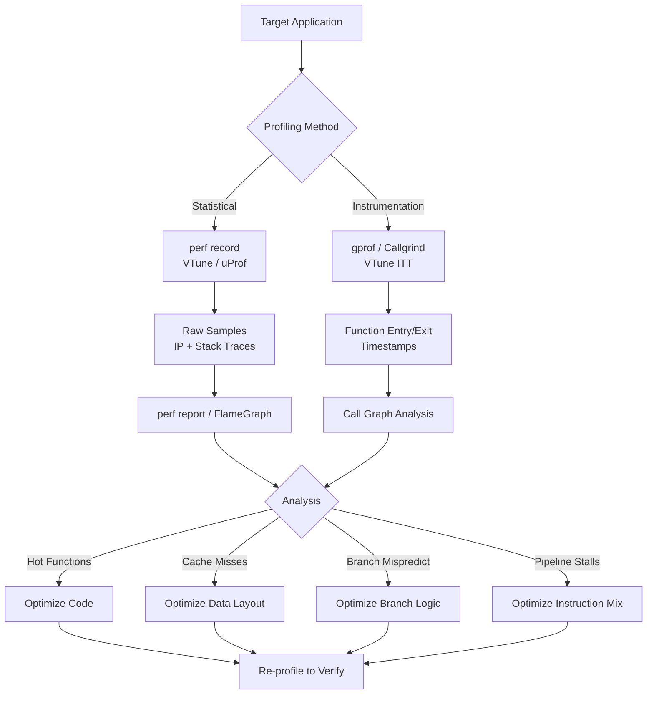
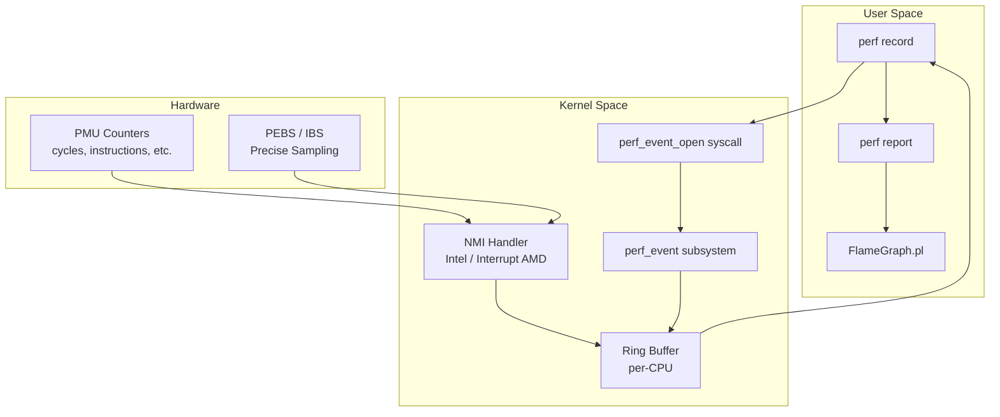
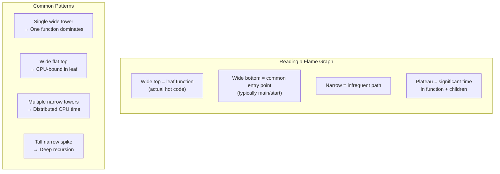

# Chapter 236: CPU Profiling — perf record/report, Flame Graphs, Intel VTune, AMD uProf

## 1. Intuition

CPU profiling is the practice of measuring where a program spends its processor time. The fundamental question it answers is deceptively simple: *what is my CPU doing?* Yet answering this question thoroughly is one of the most impactful things a systems engineer or developer can do to improve performance.

Imagine you have a program that takes 10 seconds to complete. You know the CPU is busy for most of those 10 seconds, but you don't know which functions consume the majority of that time. Without profiling, you might spend days optimizing a function that accounts for 2% of execution time, while ignoring the function responsible for 60%. CPU profiling eliminates this guesswork by providing empirical data about where cycles are actually spent.

There are two primary approaches to CPU profiling:

1. **Statistical (sampling) profiling**: The profiler interrupts the CPU at regular intervals (e.g., every 1ms) and records which instruction is executing. Over millions of samples, this builds a statistical picture of where time is spent. The `perf` tool uses this approach via hardware Performance Monitoring Counters (PMCs).

2. **Instrumentation-based profiling**: Every function entry and exit is recorded. This is precise but introduces overhead that can distort results. Valgrind's Callgrind and Intel VTune's instrumentation mode use this approach.

The key insight is that **statistical profiling with sufficient samples is remarkably accurate** while introducing negligible overhead (typically <1%). This makes it safe to use in production environments, unlike instrumentation-based approaches which can slow programs by 2-100×.

### Why CPU Profiling Matters

- **Performance optimization**: Identify hot functions and optimize the code that matters
- **Capacity planning**: Understand CPU utilization patterns to right-size infrastructure
- **Regression detection**: Compare profiles before and after code changes
- **Production debugging**: Investigate CPU spikes without reproducing in development
- **Compiler optimization feedback**: Feed profile data back to compilers for PGO (Profile-Guided Optimization)

### The Mental Model

Think of CPU profiling like a doctor's diagnostic. A patient (your program) isn't performing well. Instead of guessing, the doctor runs tests (profiling) to identify the root cause. A blood test (sampling profile) tells you which organs (functions) are under stress. An MRI (instrumentation profile) gives a detailed picture but is more expensive and disruptive.

The most important principle: **profile the workload that represents real usage**. A profile of your unit test suite tells you nothing about production performance.

## 2. Architecture

### Hardware Performance Monitoring Counters (PMCs)

Modern CPUs include dedicated hardware for performance monitoring. These are the foundation of low-overhead profiling:

```
┌─────────────────────────────────────────────┐
│              CPU Core                        │
│                                              │
│  ┌──────────────┐    ┌──────────────────┐   │
│  │  Execution   │    │  Performance     │   │
│  │  Pipeline    │───▶│  Monitoring      │   │
│  │              │    │  Counters (PMCs) │   │
│  └──────────────┘    └────────┬─────────┘   │
│                               │              │
│  ┌──────────────┐    ┌───────▼──────────┐   │
│  │  Interrupt   │◀───│  Counter         │   │
│  │  Controller  │    │  Overflow        │   │
│  └──────────────┘    │  Detection       │   │
│                      └──────────────────┘   │
└─────────────────────────────────────────────┘
```

**Key PMC events for CPU profiling:**

| Event | Description | Use Case |
|-------|-------------|----------|
| `cpu-cycles` | Clock cycles | General CPU time profiling |
| `instructions` | Instructions retired | IPC (Instructions Per Cycle) analysis |
| `cache-misses` | Last-level cache misses | Memory-bound analysis |
| `branch-misses` | Branch prediction misses | Branch misprediction analysis |
| `bus-cycles` | Front-side bus cycles | Memory bus contention |

**Intel-specific events:**
- `UOPS_EXECUTED.CORE`: Micro-ops executed
- `L2_RQSTS.MISS`: L2 cache misses
- `MEM_LOAD_RETIRED.L3_MISS`: L3 cache misses

**AMD-specific events:**
- `IBS_OPS_RETIRED`: IBS (Instruction-Based Sampling) operations
- `L2_CACHE_MISS`: L2 misses
- `DATA_CACHE_MISSES`: DC misses

### The perf_event Subsystem

Linux's `perf_event` subsystem is the kernel interface for accessing PMCs and software performance counters:

```
User Space
    │
    ▼
┌─────────────┐
│  perf tool  │
└──────┬──────┘
       │  perf_event_open() syscall
       ▼
┌──────────────────────────────────────┐
│  Kernel: perf_event subsystem        │
│                                      │
│  ┌────────────┐  ┌──────────────┐   │
│  │  Software  │  │  Hardware    │   │
│  │  Events    │  │  Events     │   │
│  │ (context   │  │ (PMCs via   │   │
│  │  switches, │  │  NMI)       │   │
│  │  page      │  │             │   │
│  │  faults)   │  │             │   │
│  └────────────┘  └──────────────┘   │
│                                      │
│  ┌────────────────────────────────┐  │
│  │  Ring Buffer (per-CPU)        │  │
│  │  perf_event_mmap_page         │  │
│  └────────────────────────────────┘  │
└──────────────────────────────────────┘
```

The `perf_event_open()` system call creates a performance monitoring event. When the counter overflows (hits a configured threshold), the kernel generates an NMI (Non-Maskable Interrupt) on Intel, or an interrupt on AMD, which samples the current instruction pointer and call stack.

### Flame Graph Architecture

Flame graphs are a visualization of stack profile data:

```
         ┌─────────────────────────────────────┐
         │              main()                 │  ← Width = total time
         ├─────────────────────────────────────┤
         │     process_request()               │
    ─────┤─────────────────────────────────────┤─────
         │  parse_input()  │  compute() │write │
         │                 │            │resp()│
         │   ┌─────┐      │ ┌────┐    │      │
         │   │json_│      │ │mat │    │      │
         │   │parse│      │ │mul │    │      │
         │   └─────┘      │ └────┘    │      │
         └─────────────────────────────────────┘

X-axis: Stack profile (alphabetical order within each level)
Y-axis: Stack depth (bottom = root, top = leaf)
Width: Proportional to number of samples
Color: Random (aesthetic only, unless color-coded by category)
```

**Reading a flame graph:**
- Each rectangle is a function in the call stack
- The **width** of a rectangle represents the percentage of total samples that included that function
- **Wide rectangles** = functions where significant CPU time is spent
- The **height** represents the call stack depth
- Look for "plateaus" — wide functions near the top that are the actual hot code

### Intel VTune Profiling Architecture

Intel VTune Profiler uses multiple data collection mechanisms:

```
┌──────────────────────────────────────────────┐
│  VTune Profiler                              │
│                                              │
│  ┌──────────────┐  ┌───────────────────┐    │
│  │  PMU Sampling │  │  ITT (Instrument  │    │
│  │  (hardware)   │  │  & Tracing        │    │
│  └──────────────┘  │  Technology)       │    │
│                     └───────────────────┘    │
│  ┌──────────────┐  ┌───────────────────┐    │
│  │  SPE (Stat.  │  │  Processor Trace  │    │
│  │  Profiling   │  │  (Intel PT)       │    │
│  │  Extension)  │  └───────────────────┘    │
│  └──────────────┘                           │
└──────────────────────────────────────────────┘
```

VTune's key analysis types:
- **Hotspots**: Identifies functions consuming the most CPU time
- **Microarchitecture Exploration**: Analyzes pipeline stalls, cache misses, branch mispredictions
- **Memory Access**: Identifies NUMA and memory bandwidth issues
- **Threading**: Analyzes thread synchronization, lock contention
- **Hotspots by Hardware Events**: Uses PEBS (Precise Event-Based Sampling) for accurate attribution

### AMD uProf Architecture

AMD μProf (Micro Profiler) provides similar capabilities for AMD processors:

```
┌──────────────────────────────────────────────┐
│  AMD uProf                                  │
│                                              │
│  ┌──────────────┐  ┌───────────────────┐    │
│  │  IBS (Instr. │  │  Core PMC         │    │
│  │  Based       │  │  Sampling         │    │
│  │  Sampling)   │  │                   │    │
│  └──────────────┘  └───────────────────┘    │
│  ┌──────────────┐  ┌───────────────────┐    │
│  │  Data Fabric │  │  Power/Thermal    │    │
│  │  Analysis    │  │  Monitoring       │    │
│  └──────────────┘  └───────────────────┘    │
└──────────────────────────────────────────────┘
```

AMD's IBS (Instruction-Based Sampling) is particularly notable — it randomly tags instructions and tracks them through the entire pipeline, providing unbiased sampling that's inherently immune to aliasing issues that affect counter-based approaches.

## 3. Tools & Techniques

### perf record and perf report

`perf` is the standard Linux profiling tool, part of the `linux-tools` package.

**Basic CPU profiling workflow:**

```bash
# Record CPU cycles for a specific command
perf record -g --call-graph dwarf -o perf.data ./my_program

# Record system-wide for 10 seconds
sudo perf record -a -g --call-graph dwarf -o perf.data -- sleep 10

# Record with specific event
perf record -e instructions -g -o perf.data ./my_program

# Record with frequency (samples per second)
perf record -F 99 -g -o perf.data ./my_program

# Report from recorded data
perf report -i perf.data

# Interactive report with source annotation
perf report -i perf.data --stdio --sort comm,dso,symbol
```

**Key perf record options:**

| Option | Description |
|--------|-------------|
| `-g` | Record call graphs (stack traces) |
| `--call-graph dwarf` | Use DWARF debug info for stack unwinding (most reliable) |
| `--call-graph fp` | Use frame pointer-based unwinding (faster, less reliable) |
| `--call-graph lbr` | Use Last Branch Records (Intel only, very low overhead) |
| `-F N` | Set sampling frequency to N Hz |
| `-c N` | Sample every N events (instead of frequency) |
| `-p PID` | Record specific process |
| `-a` | System-wide recording |
| `--cpu N` | Record on specific CPU(s) |
| `-e EVENT` | Specify PMU event |
| `--weight` | Record sample weight (latency) |

**Advanced perf record examples:**

```bash
# Record with PEBS (Precise Event-Based Sampling) on Intel
perf record -e cpu/mem-loads/ppp -g -d ./my_program

# Record multiple events
perf record -e cycles,instructions,cache-misses -g ./my_program

# Record with callchain lbr (Intel, very low overhead)
perf record --call-graph lbr -F 49 ./my_program

# Record with BPF-based stack unwinding
perf record -g --call-graph dwarf,8192 ./my_program

# Record kernel and user stacks
perf record -g -a -- sleep 5

# Record with timestamp
perf record -g --timestamp-clock monotonic ./my_program
```

### Generating Flame Graphs

Brendan Gregg's FlameGraph toolkit is the standard tool:

```bash
# Clone FlameGraph repository
git clone https://github.com/brendangregg/FlameGraph.git

# Generate folded stacks from perf data
perf script -i perf.data | ./FlameGraph/stackcollapse-perf.pl > out.folded

# Generate SVG flame graph
./FlameGraph/flamegraph.pl out.folded > flamegraph.svg

# One-liner
perf script | stackcollapse-perf.pl | flamegraph.pl > flamegraph.svg

# Differential flame graph (compare two profiles)
difffolded.pl before.folded after.folded | flamegraph.pl > diff.svg

# CPU flame graph with color coding by type
# (red = on-CPU, blue = off-CPU/waiting)
perf script | stackcollapse-perf.pl | flamegraph.pl --color=io > flamegraph.svg
```

**Flame graph variants:**

```bash
# Icicle graph (inverted, top = root)
flamegraph.pl --inverted out.folded > icicle.svg

# Flame graph with title
flamegraph.pl --title="CPU Profile" --subtitle="my_program" out.folded > fg.svg

# Differential flame graph showing growth
difffolded.pl --old before.folded --new after.folded | flamegraph.pl > diff.svg

# Off-CPU flame graph (requires BPF)
# Use bcc's offcputime tool
offcputime-bpfcc -df -p PID 30 | stackcollapse-bpf.pl | flamegraph.pl --color=io > offcpu.svg
```

### Intel VTune Profiler

```bash
# Install VTune (standalone or with oneAPI)
# Download from Intel's website or:
sudo apt install intel-oneapi-vtune

# Collect hotspots
vtune -collect hotspots -result-dir vtune_hotspots ./my_program

# Collect microarchitecture exploration
vtune -collect uarch-exploration -result-dir vtune_uarch ./my_program

# Collect memory access analysis
vtune -collect memory-access -result-dir vtune_mem ./my_program

# Collect threading analysis
vtune -collect threading -result-dir vtune_thread ./my_program

# Analyze results
vtune -report hotspots -r vtune_hotspots -format text
vtune -report top-down -r vtune_uarch -format text

# GUI mode
vtune-gui

# Remote collection
vtune -collect hotspots -result-dir ./results -target-system=ssh:user@host:./my_program
```

**VTune CLI analysis types:**

| Analysis | Command | What It Shows |
|----------|---------|---------------|
| Hotspots | `-collect hotspots` | Functions consuming most CPU time |
| Threading | `-collect threading` | Thread concurrency, locks, waits |
| Memory | `-collect memory-access` | NUMA traffic, bandwidth, cache misses |
| Microarchitecture | `-collect uarch-exploration` | Pipeline stalls, frontend/backend bound |
| HPC Performance | `-collect hpc-performance` | FLOPS, vectorization, memory bandwidth |
| I/O | `-collect io` | Disk and network I/O |
| GPU | `-collect gpu-offload` | GPU utilization |

### AMD uProf

```bash
# Install AMD uProf
# Download from AMD Developer website
sudo dpkg -i AMDuProf_Linux_x64_*.deb
# or
sudo rpm -i AMDuProf_Linux_x64_*.rpm

# CPU profiling (hotspots)
AMDuProf collect -e cpu-events -d amdprof_out -- ./my_program

# IBS-based sampling
AMDuProf collect -e ibs-op --duration 30 -d amdprof_out -- ./my_program

# Memory profiling
AMDuProf collect -e data-access -d amdprof_out -- ./my_program

# Analyze results
AMDuProf report -i amdprof_out --format text

# CLI-based analysis
AMDuProfCLI collect --event-config=ibs_op --duration 30 --output-dir ./results -- ./my_program
```

### Additional CPU Profiling Tools

```bash
# Simpleperf (Android/Linux, Google)
simpleperf record -g -o perf.data ./my_program
simpleperf report -i perf.data

# OProfile (legacy, but still used)
operf ./my_program
opreport --symbols

# BPF-based profiling with bcc
profile-bpfcc -F 99 -f -p PID 10 > out.stacks
cat out.stacks | flamegraph.pl > bpf_flamegraph.svg

# perf-tools (Brendan Gregg)
/usr/share/perf-tools/bin/profile 99 > out.stacks

# BPF-based profiling with bpftrace
bpftrace -e 'profile:hz:99 /pid == $1/ { @[kstack] = count(); }' -- PID

# Using perf top (live profiling)
sudo perf top -g -p PID

# Annotating source code
perf annotate -i perf.data --symbol=hot_function --stdio
```

## 4. Source Code References

### perf_event Kernel Subsystem

```
kernel/events/core.c          — perf_event subsystem core
include/linux/perf_event.h    — perf_event structures and API
arch/x86/events/core.c        — x86 PMC support
arch/x86/events/intel/core.c  — Intel-specific PMU
arch/x86/events/amd/core.c    — AMD-specific PMU
tools/perf/                    — userspace perf tool source
```

**Key data structures:**

```c
// include/linux/perf_event.h (simplified)
struct perf_event {
    struct hw_perf_event      hw;        // Hardware counter state
    struct perf_event_context *ctx;      // Owning context
    struct perf_event_attr    attr;      // User-configured attributes
    struct perf_callchain_entry *overflow_handler; // Stack capture
    /* ... */
};

struct perf_event_attr {
    __u32 type;       // Event type (hardware, software, tracepoint)
    __u64 config;     // Event-specific configuration
    __u64 sample_period; // Sample every N events
    __u64 sample_type;   // What to record (IP, callchain, regs, etc.)
    /* ... */
};
```

### FlameGraph Toolkit

```
flamegraph.pl             — Generates SVG flame graphs
stackcollapse-perf.pl     — Collapses perf script output
stackcollapse-bpf.pl      — Collapses BPF stack output
difffolded.pl             — Differential flame graph support
```

### perf Stack Unwinding

```
tools/perf/util/unwind-libunwind-local.c  — DWARF unwinding
tools/perf/util/dwarf-aux.c              — DWARF auxiliary functions
tools/perf/util/callchain.c              — Callchain processing
```

The stack unwinding process in perf:

1. **Frame pointer** (`--call-graph fp`): Walks the frame pointer chain. Fast but requires `-fno-omit-frame-pointer` compilation. Many compilers omit frame pointers by default on x86-64.

2. **DWARF** (`--call-graph dwarf`): Uses `.eh_frame` / `.debug_frame` sections to unwind. Works with all binaries but needs debug info for best results. The `--callchain dwarf` option specifies the stack dump size (default: 4096 bytes).

3. **LBR** (`--call-graph lbr`): Intel's Last Branch Records capture the last 32 branches. Very low overhead but only available on Intel CPUs and captures limited call depth.

## 5. Examples

### Example 1: Finding a CPU Hot Function

```bash
# Step 1: Record the profile
perf record -F 99 -g --call-graph dwarf ./http_server_benchmark

# Step 2: View the report
perf report --stdio

# Output:
# Overhead  Command          Shared Object      Symbol
# ........  ...............  .................  ................
#     32.45%  http_server      http_server        [.] handle_request
#     18.23%  http_server      libc.so.6          [.] __memcpy_avx2
#     12.67%  http_server      http_server        [.] parse_http_header
#      8.91%  http_server      http_server        [.] route_request
#      ...

# Step 3: Generate flame graph
perf script | ./FlameGraph/stackcollapse-perf.pl | ./FlameGraph/flamegraph.pl > http_flame.svg

# Step 4: Annotate the hot function
perf annotate --symbol=handle_request --stdio
```

### Example 2: System-wide CPU Profile

```bash
# Record system-wide for 60 seconds
sudo perf record -a -g --call-graph dwarf -F 49 -- sleep 60

# Report by process
perf report --stdio --sort comm,dso

# Generate system-wide flame graph
perf script | stackcollapse-perf.pl | flamegraph.pl --title="System-wide CPU" > sys_flame.svg

# Find per-CPU hotspots
sudo perf record -a -g -e cycles -C 0 -- sleep 10
perf report --stdio
```

### Example 3: Profile-Guided Optimization (PGO)

```bash
# Step 1: Build with instrumentation
gcc -fprofile-generate -O2 -o myapp_instrumented myapp.c

# Step 2: Run representative workload
./myapp_instrumented < real_input.txt

# Step 3: Rebuild with profile data
gcc -fprofile-use -O2 -o myapp_optimized myapp.c

# Compare performance
perf stat ./myapp_instrumented < real_input.txt
perf stat ./myapp_optimized < real_input.txt
```

### Example 4: Microarchitecture Analysis with VTune

```bash
# Collect microarchitecture data
vtune -collect uarch-exploration -result-dir ./uarch ./my_program

# Get top-down analysis
vtune -report top-down -r ./uarch -format text

# Output example:
# Level 1:
#   Front-End Bound:  12.3%
#   Back-End Bound:   72.1%
#     Memory Bound:   45.6%
#     Core Bound:     26.5%
#   Bad Speculation:   8.2%
#   Retiring:          7.4%

# This tells us: the CPU is bottlenecked on memory (72.1% backend bound,
# with 45.6% being memory-bound). Focus on cache optimization.
```

### Example 5: Comparing Profiles Before/After Optimization

```bash
# Before optimization
perf record -F 99 -g -o before.data ./my_program
perf script -i before.data | stackcollapse-perf.pl > before.folded

# Apply optimization
# ... (edit code, recompile)

# After optimization
perf record -F 99 -g -o after.data ./my_program
perf script -i after.data | stackcollapse-perf.pl > after.folded

# Generate differential flame graph
./FlameGraph/difffolded.pl before.folded after.folded | \
    ./FlameGraph/flamegraph.pl --title="Before vs After" > diff.svg
# Red = more samples (regression), Blue = fewer samples (improvement)
```

## 6. Diagrams

### CPU Profiling Workflow



### perf_event Architecture



### Flame Graph Interpretation



## 7. Common Pitfalls

### 1. Missing Debug Symbols

```bash
# Problem: perf report shows memory addresses instead of function names
# 0x401234 in ??? (./my_program)

# Solution: Compile with debug info
gcc -g -O2 -o my_program my_program.c

# Or install debug packages
sudo apt install libc6-dbg  # Debian/Ubuntu
sudo debuginfo-install glibc  # RHEL/CentOS

# For kernel symbols:
sudo apt install linux-image-$(uname -r)-dbgsym
# or
sudo perf buildid-cache --add /usr/lib/debug/boot/vmlinux-$(uname -r)
```

### 2. Frame Pointer Omission

```bash
# Problem: Broken or incomplete call stacks
# Solution: Compile with frame pointers
gcc -fno-omit-frame-pointer -O2 -o my_program my_program.c

# Or use DWARF unwinding
perf record --call-graph dwarf -g ./my_program

# Check if frame pointers are present
readelf --debug-dump=frames my_program | head -20
```

### 3. Profiling the Wrong Workload

```bash
# Bad: Profiling with small test input
perf record ./my_program --test-mode

# Good: Profiling with production-like workload
perf record ./my_program --config=production.json < real_traffic.log

# Bad: Profiling a debug build
gcc -g -O0 -o my_program my_program.c  # 10x slower, different behavior

# Good: Profiling an optimized build with debug info
gcc -g -O2 -o my_program my_program.c  # Production-like performance
```

### 4. Insufficient Samples

```bash
# Problem: Profile looks noisy with few visible patterns
# -F 10 is too low for short-running programs

# Solution: Increase sampling frequency or duration
perf record -F 999 -g ./my_program  # 999 Hz
# Or use event-based sampling with small period
perf record -e cycles -c 100000 -g ./my_program

# For very short programs:
perf record -e cycles -c 10000 -g ./my_program
```

### 5. NMI Watchdog Conflict

```bash
# Problem: "Too many events are opened" or reduced sample count
# The NMI watchdog uses a PMC counter, reducing available counters

# Solution: Disable NMI watchdog
sudo sh -c 'echo 0 > /proc/sys/kernel/nmi_watchdog'

# Or use multiplexing
perf record -e cycles,instructions,cache-misses -g ./my_program
# perf will multiplex events across available counters
```

### 6. Profiling Optimized-Out Code

```bash
# Problem: Compiler optimizations inline, reorder, or eliminate code
# Profile shows unexpected attribution

# Solution: Understand that optimized code behaves differently
# Use perf annotate with source mapping
perf annotate --symbol=hot_function --stdio

# For function-level attribution: mark critical functions as noinline
__attribute__((noinline)) void hot_function(void) { ... }
```

### 7. Ignoring Kernel Time

```bash
# Problem: User-only profiling misses kernel overhead
# Large time in system calls invisible

# Solution: Record system-wide or include kernel callchains
sudo perf record -a -g --call-graph dwarf -- sleep 10
perf report --sort comm,dso,symbol

# Or check with:
perf stat -e cycles:k,cycles:u ./my_program
```

## 8. Best Practices

### 1. Use Multiple Profiling Angles

```bash
# Start with general CPU profiling
perf record -F 99 -g ./my_program
perf report --stdio

# If CPU-bound but not cache-bound:
perf record -e instructions -g ./my_program  # Check IPC

# If memory-bound:
perf record -e cache-misses -g ./my_program  # Check cache behavior

# If branch-heavy:
perf record -e branch-misses -g ./my_program  # Check branch prediction
```

### 2. Profile in Production-Like Environments

```bash
# Use production compiler flags
CFLAGS="-O2 -march=native -g" make

# Use production environment variables
export OMP_NUM_THREADS=4
export MALLOC_ARENA_MAX=2

# Use production data volumes
perf record -F 49 -g -- ./server --config=/etc/prod.conf
```

### 3. Automate Profile Collection

```bash
#!/bin/bash
# profile_compare.sh — Compare profiles between versions
set -e

VERSION=$1
BINARY="./build/myapp-${VERSION}"
PERF_DIR="./profiles/${VERSION}"
mkdir -p "$PERF_DIR"

# Record profile
perf record -F 99 -g --call-graph dwarf -o "${PERF_DIR}/perf.data" \
    "$BINARY" < benchmark_input.txt

# Generate reports
perf report -i "${PERF_DIR}/perf.data" --stdio \
    --sort comm,dso,symbol > "${PERF_DIR}/report.txt"

# Generate flame graph
perf script -i "${PERF_DIR}/perf.data" | \
    stackcollapse-perf.pl > "${PERF_DIR}/out.folded"
flamegraph.pl "${PERF_DIR}/out.folded" > "${PERF_DIR}/flamegraph.svg"

echo "Profile saved to ${PERF_DIR}/"
```

### 4. Use perf stat for Quick Assessment

```bash
# Before diving into detailed profiling, get a quick overview
perf stat ./my_program

# Output:
#  5,432,100,000  cycles            # 3.2 GHz
#  8,765,432,100  instructions      # 1.61 IPC  ← Good IPC
#     12,345,678  cache-misses      # 2.3%      ← Low cache miss rate
#      1,234,567  branch-misses     # 1.1%      ← Low branch miss rate

# Interpretation:
# IPC > 1.0: Good instruction throughput
# Cache miss < 5%: Cache is effective
# Branch miss < 2%: Branch prediction is good
```

### 5. Combine CPU Profiling with Other Profiling

```bash
# CPU profiling alone is insufficient — also check:
# Memory allocation patterns
perf record -e page-faults -g ./my_program

# Off-CPU time (I/O, locks, sleep)
offcputime-bpfcc -p PID 10 | flamegraph.pl --color=io > offcpu.svg

# System calls
perf trace -p PID --duration 10

# Context switches
perf record -e context-switches -g ./my_program
```

### 6. Keep Profiles for Historical Comparison

```bash
# Store profiles in version control or artifact storage
mkdir -p profiles/
perf record -F 99 -g -o "profiles/$(date +%Y%m%d)_${GIT_HASH}.data" ./my_program

# Tag profiles with build information
echo "Build: $(git describe --always)" > profiles/build_info.txt
echo "Compiler: $(gcc --version | head -1)" >> profiles/build_info.txt
echo "Flags: ${CFLAGS}" >> profiles/build_info.txt
```

## 9. Exercises

### Exercise 1: Basic CPU Profiling
Profile a CPU-intensive program and identify the top 3 hottest functions.

```bash
# Create a test program
cat > hotspot_test.c << 'EOF'
#include <stdio.h>
#include <stdlib.h>
#include <math.h>

double compute_sine(int n) {
    double sum = 0;
    for (int i = 0; i < n; i++) {
        sum += sin(i * 0.001);
    }
    return sum;
}

double compute_multiply(int n) {
    double sum = 1.0;
    for (int i = 1; i <= n; i++) {
        sum *= (1.0 + 1.0/i);
    }
    return sum;
}

double compute_sort(int n) {
    int *arr = malloc(n * sizeof(int));
    for (int i = 0; i < n; i++) arr[i] = rand();
    // Simple bubble sort (intentionally slow)
    for (int i = 0; i < n-1; i++)
        for (int j = 0; j < n-i-1; j++)
            if (arr[j] > arr[j+1]) { int t = arr[j]; arr[j] = arr[j+1]; arr[j+1] = t; }
    double result = arr[0];
    free(arr);
    return result;
}

int main() {
    for (int i = 0; i < 100; i++) {
        compute_sine(1000000);
        compute_multiply(10000000);
        compute_sort(5000);
    }
    return 0;
}
EOF
gcc -O2 -g -fno-omit-frame-pointer -o hotspot_test hotspot_test.c -lm

# Profile and analyze
perf record -F 99 -g ./hotspot_test
perf report --stdio --sort symbol

# Questions:
# 1. Which function consumes the most CPU time?
# 2. Generate a flame graph and identify the hottest path
# 3. What optimization would have the biggest impact?
```

### Exercise 2: Flame Graph Analysis
```bash
# Generate and analyze a flame graph
perf script | stackcollapse-perf.pl | flamegraph.pl > exercise2.svg

# Open in browser and answer:
# 1. What percentage of time is spent in library functions vs application code?
# 2. What is the call depth of the hottest path?
# 3. Are there any unexpected functions appearing in the profile?
```

### Exercise 3: Comparing Optimization Levels
```bash
# Compile with different optimization levels
for opt in O0 O1 O2 O3 Os; do
    gcc -${opt} -g -fno-omit-frame-pointer -o "hotspot_${opt}" hotspot_test.c -lm
    perf record -F 99 -g -o "perf_${opt}.data" "./hotspot_${opt}"
    perf report -i "perf_${opt}.data" --stdio --sort symbol > "report_${opt}.txt"
done

# Compare the reports:
# 1. How does the profile change between O0 and O3?
# 2. Which functions are inlined at higher optimization levels?
# 3. What is the performance difference (use perf stat)?
```

### Exercise 4: System-wide Profiling
```bash
# Profile an entire system under load
# Terminal 1: Generate load
stress-ng --cpu 4 --io 2 --vm 2 --timeout 60s

# Terminal 2: Profile system-wide
sudo perf record -a -g --call-graph dwarf -F 49 -- sleep 30
perf report --stdio --sort comm,dso

# Questions:
# 1. Which process consumes the most CPU?
# 2. What kernel functions are hot?
# 3. Generate a system-wide flame graph
```

### Exercise 5: Microarchitecture Analysis (requires Intel/AMD)
```bash
# Using perf stat with detailed events
perf stat -d ./hotspot_test

# Check IPC (Instructions Per Cycle)
perf stat -e cycles,instructions ./hotspot_test

# If IPC < 1.0, the program may be memory-bound
# If IPC > 2.0, the program is compute-bound and efficient

# Advanced: Check for specific bottlenecks
perf stat -e L1-dcache-load-misses,L1-dcache-loads,LLC-load-misses,LLC-loads ./hotspot_test
```

## 10. References

1. **perf Wiki**: https://perf.wiki.kernel.org/index.php/Main_Page
2. **Brendan Gregg - Flame Graphs**: https://www.brendangregg.com/flamegraphs.html
3. **Brendan Gregg - perf Examples**: https://www.brendangregg.com/perf.html
4. **Intel VTune Documentation**: https://www.intel.com/content/www/us/en/developer/tools/oneapi/vtune-profiler.html
5. **AMD uProf Documentation**: https://developer.amd.com/amd-uprof/
6. **Linux perf_event Wiki**: https://man7.org/linux/man-pages/man2/perf_event_open.2.html
7. **Agner Fog - Optimization Manuals**: https://www.agner.org/optimize/
8. **BPF Performance Tools (Brendan Gregg)**: http://www.brendangregg.com/bpf-performance-tools-book.html
9. **"Systems Performance" by Brendan Gregg**: Chapter 6 - CPU Analysis Methodology
10. **Chromium Perfetto**: https://perfetto.dev/ — System profiling with built-in flame graph support
