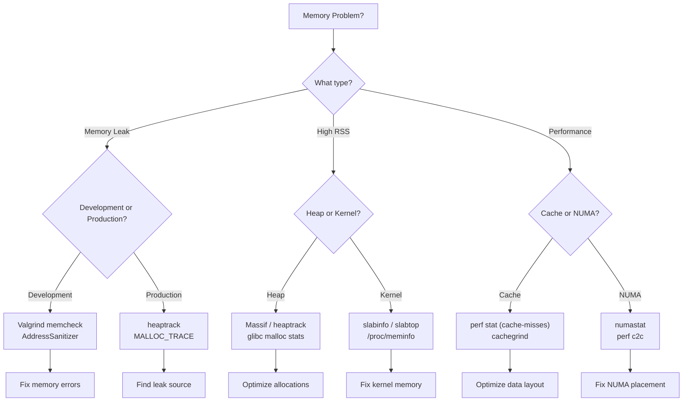
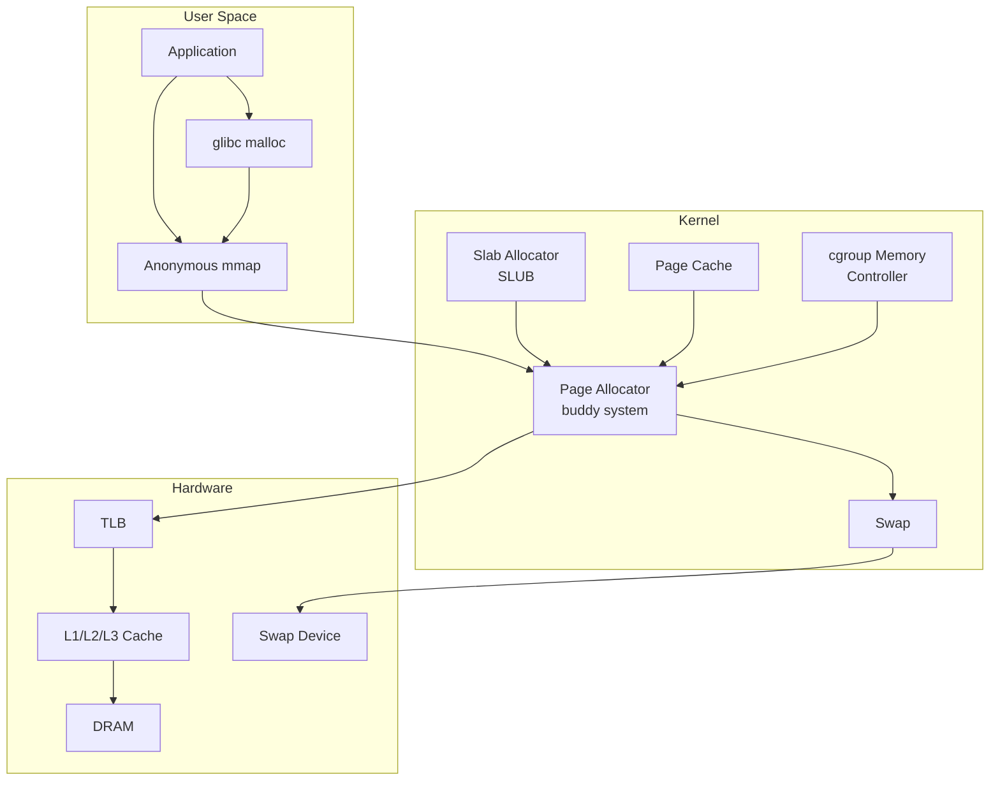
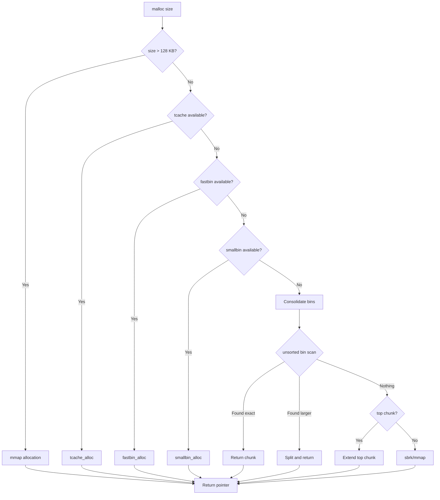

# Chapter 237: Memory Profiling — Valgrind massif, heaptrack, /proc/meminfo, slabinfo

## 1. Intuition

Memory profiling is the practice of understanding how a program uses system memory — how much it allocates, where it allocates it, when it frees it, and where leaks occur. While CPU profiling tells you *where time is spent*, memory profiling tells you *where memory is used* and *where it's wasted*.

Memory problems are among the most insidious bugs in systems programming:

- **Memory leaks** cause programs to grow unbounded until the OOM killer terminates them
- **Fragmentation** wastes memory that's technically free but unusable
- **Excessive allocation** causes cache pollution and TLB pressure
- **Stack overflow** crashes programs without warning
- **Use-after-free** and **double-free** cause data corruption and security vulnerabilities

The key insight is that **memory behavior is often the dominant factor in application performance**, even more than CPU efficiency. A program that's "CPU-bound" might actually be stalled waiting for memory — modern CPUs can execute billions of instructions per second, but a single LLC (Last Level Cache) miss costs ~100 cycles, and a page fault costs ~10,000 cycles.

### The Memory Hierarchy and Profiling

Understanding memory profiling requires understanding the memory hierarchy:

```
Registers:     ~1 cycle    (32-64 registers, ~1 KB)
L1 Cache:      ~4 cycles   (32-64 KB per core)
L2 Cache:      ~12 cycles  (256 KB - 1 MB per core)
L3 Cache:      ~40 cycles  (4-64 MB shared)
Main Memory:   ~100 cycles (GBs, ~100ns latency)
Swap (SSD):    ~10,000 cycles (TBs, ~10ms latency)
Swap (HDD):    ~10,000,000 cycles (TBs, ~10ms latency)
```

Memory profiling operates at different levels:

1. **Application-level**: Heap allocations, leaks, fragmentation (Valgrind, heaptrack)
2. **Kernel-level**: Slab allocator, page cache, kernel memory (slabinfo, /proc/meminfo)
3. **System-level**: NUMA, huge pages, swap, overcommit (numastat, /proc/vmstat)
4. **Hardware-level**: TLB misses, cache behavior (perf, VTune)

### Types of Memory Problems

| Problem | Symptoms | Tools |
|---------|----------|-------|
| Memory leak | RSS grows over time | Valgrind memcheck, AddressSanitizer |
| Heap fragmentation | High RSS but low allocations | heaptrack, glibc malloc stats |
| Excessive allocation | High allocation rate, GC pressure | heaptrack, perf |
| Stack overflow | Segfault at deep recursion | ulimit, AddressSanitizer |
| Use-after-free | Random crashes, data corruption | Valgrind, AddressSanitizer |
| Buffer overflow | Data corruption, security issues | AddressSanitizer, Valgrind |
| Cache thrashing | Poor performance despite low CPU | perf, cachegrind |
| NUMA imbalance | High remote memory access | numastat, perf |

## 2. Architecture

### Linux Memory Layout

```
┌──────────────────────────────────┐ 0xFFFFFFFFFFFFFFFF (kernel space)
│  Kernel Memory                   │
│  (unmapped from user space)      │
├──────────────────────────────────┤ 0xFFFF800000000000
│  Guard Region                    │
├──────────────────────────────────┤
│  Stack (grows downward)          │ ← Stack frames, local variables
│  ↓                               │
│  ...                             │
│  ↑                               │
│  Memory-Mapped Region            │ ← Shared libraries, mmap
│  (grows upward)                  │
├──────────────────────────────────┤
│  Heap (grows upward)             │ ← malloc/new allocations
│  ↑                               │
│  BSS (uninitialized globals)     │
│  Data (initialized globals)      │
│  Text (code)                     │
├──────────────────────────────────┤ 0x0000000000000000
```

### glibc malloc Architecture

The GNU C Library's `malloc` implementation (ptmalloc2) is the default allocator on most Linux systems:

```
┌─────────────────────────────────────────────────┐
│  Application Code                               │
│  malloc() / free() / realloc()                  │
└────────────────────┬────────────────────────────┘
                     │
                     ▼
┌─────────────────────────────────────────────────┐
│  Main Arena (arena[0])                          │
│  ┌─────────────────────────────────────────┐    │
│  │  Fastbins (singly-linked, LIFO)         │    │
│  │  Sizes: 16, 24, 32, 40, 48, 56, 64...  │    │
│  └─────────────────────────────────────────┘    │
│  ┌─────────────────────────────────────────┐    │
│  │  Unsorted Bin (doubly-linked)           │    │
│  └─────────────────────────────────────────┘    │
│  ┌─────────────────────────────────────────┐    │
│  │  Small Bins (62 bins, ≤ 512 bytes)      │    │
│  └─────────────────────────────────────────┘    │
│  ┌─────────────────────────────────────────┐    │
│  │  Large Bins (> 512 bytes, sorted trees) │    │
│  └─────────────────────────────────────────┘    │
│  ┌─────────────────────────────────────────┐    │
│  │  Top Chunk (remaining unmapped memory)  │    │
│  └─────────────────────────────────────────┘    │
└────────────────────┬────────────────────────────┘
                     │
         ┌───────────┴───────────┐
         ▼                       ▼
┌─────────────────┐    ┌─────────────────┐
│  brk()/sbrk()   │    │  mmap()         │
│  (heap growth)  │    │  (large allocs, │
│                 │    │   > 128 KB)     │
└─────────────────┘    └─────────────────┘
```

**Thread-local caching (tcache):**
Modern glibc (2.26+) includes per-thread caches that avoid lock contention:

```
Thread 1 Cache          Thread 2 Cache
┌──────────────┐       ┌──────────────┐
│ tcache[0]:   │       │ tcache[0]:   │
│  entry → entry│       │  entry → entry│
│ tcache[1]:   │       │ tcache[1]:   │
│  entry → entry│       │  entry → entry│
│ ...          │       │ ...          │
└──────┬───────┘       └──────┬───────┘
       │                      │
       └──────────┬───────────┘
                  ▼
       ┌─────────────────┐
       │  Main Arena     │
       │  (shared)       │
       └─────────────────┘
```

### Kernel Memory: Slab Allocator

The Linux kernel uses the slab allocator for kernel object allocation:

```
┌──────────────────────────────────────────────────┐
│  Kernel Memory Management                        │
│                                                  │
│  ┌─────────────────────────────────────────────┐ │
│  │  SLUB Allocator (default since 2.6.23)      │ │
│  │                                             │ │
│  │  Per-CPU Caches (no locking needed)         │ │
│  │  ┌───────┐  ┌───────┐  ┌───────┐           │ │
│  │  │ CPU 0 │  │ CPU 1 │  │ CPU 2 │           │ │
│  │  │ freelist│ │ freelist│ │ freelist│          │ │
│  │  └───┬───┘  └───┬───┘  └───┬───┘           │ │
│  │      │          │          │                 │ │
│  │      └──────────┼──────────┘                 │ │
│  │                 ▼                            │ │
│  │  ┌─────────────────────────────────────┐     │ │
│  │  │  Slab Cache (e.g., "inode_cache")   │     │ │
│  │  │  ┌─────────┐ ┌─────────┐            │     │ │
│  │  │  │  Page 0  │ │  Page 1  │ ...        │     │ │
│  │  │  │ [obj|obj|│ │ [obj|obj|            │     │ │
│  │  │  │  obj|obj]│ │  obj|obj]            │     │ │
│  │  │  └─────────┘ └─────────┘            │     │ │
│  │  └─────────────────────────────────────┘     │ │
│  └─────────────────────────────────────────────┘ │
│                                                  │
│  ┌─────────────────────────────────────────────┐ │
│  │  Buddy Allocator (page-level)               │ │
│  │  Manages free pages in power-of-2 blocks    │ │
│  └─────────────────────────────────────────────┘ │
└──────────────────────────────────────────────────┘
```

### /proc/meminfo Internals

The `/proc/meminfo` file exposes kernel memory statistics:

```
┌────────────────────────────────────────────────────────┐
│  Physical Memory (RAM)                                 │
│  ┌──────────────────────────────────────────────────┐  │
│  │  Used Pages                                      │  │
│  │  ┌──────────────┐  ┌──────────────┐              │  │
│  │  │ User Process │  │ Kernel       │              │  │
│  │  │ Memory       │  │ Memory       │              │  │
│  │  │ (RSS)        │  │ (Slab, PageCache, etc.) │     │  │
│  │  └──────────────┘  └──────────────┘              │  │
│  ├──────────────────────────────────────────────────┤  │
│  │  Buffers/Cache                                   │  │
│  │  ┌──────────────┐  ┌──────────────┐              │  │
│  │  │ Page Cache   │  │ Buffers      │              │  │
│  │  │ (file data)  │  │ (metadata)   │              │  │
│  │  └──────────────┘  └──────────────┘              │  │
│  ├──────────────────────────────────────────────────┤  │
│  │  Free Pages (truly unused)                       │  │
│  └──────────────────────────────────────────────────┘  │
│                                                        │
│  Swap Space                                            │
│  ┌──────────────────────────────────────────────────┐  │
│  │  Swap Used (pages moved from RAM)                │  │
│  └──────────────────────────────────────────────────┘  │
└────────────────────────────────────────────────────────┘
```

## 3. Tools & Techniques

### Valgrind Massif

Massif is a Valgrind tool for heap profiling. It takes a snapshot of the heap at regular intervals:

```bash
# Basic heap profiling
valgrind --tool=massif ./my_program

# With stack profiling (shows allocation call stacks)
valgrind --tool=massif --stacks=yes ./my_program

# Custom snapshot frequency
valgrind --tool=massif --detailed-freq=10 ./my_program

# Profile a running process
valgrind --tool=massif --pid=<PID>

# View results
ms_print massif.out.12345

# Or with massif-visualizer (GUI)
massif-visualizer massif.out.12345
```

**Massif output interpretation:**

```
    MB
35.25^                                          #########
     |                                          #
     |                                          #
28.20^                                     ######
     |                                     #
21.15^                                #####
     |                                #
14.10^                           #####
     |                           #
 7.05^                      #####
     |                 #####
 0.00^################################################################
     |                                                               
     0                                                                time

# The peaks show maximum heap usage
# Use ms_print to see the allocation call stack at each peak
```

**Key Massif options:**

| Option | Description |
|--------|-------------|
| `--stacks=yes` | Profile stack usage (not just heap) |
| `--heap-admin=N` | Bytes of admin overhead per allocation (default: 8) |
| `--depth=N` | Maximum stack depth for allocation sites |
| `--threshold=0.1` | Ignore allocations < 0.1% of total |
| `--detailed-freq=10` | Take detailed snapshot every 10th snapshot |
| `--max-snapshots=100` | Maximum number of snapshots |
| `--pages-as-heap=no` | Don't profile mmap'd regions |

### heaptrack

heaptrack is a fast heap profiler that uses LD_PRELOAD:

```bash
# Install
sudo apt install heaptrack heaptrack-gui

# Profile a program
heaptrack ./my_program

# Profile a running process
heaptrack -p <PID>

# Analyze results
heaptrack_gui heaptrack.my_program.12345.gz

# CLI analysis
heaptrack_print heaptrack.my_program.12345.gz

# Options:
# --record-only: Don't analyze during recording (faster)
# --analyze-only: Analyze previously recorded data
```

**heaptrack advantages over Valgrind massif:**
- 10-100× faster (uses LD_PRELOAD, not CPU emulation)
- Tracks allocation/deallocation patterns over time
- Shows memory leaks with full call stacks
- Tracks peak memory usage with timestamps
- Lower overhead makes it suitable for longer-running programs

### /proc/meminfo

```bash
# View system memory usage
cat /proc/meminfo

# Key fields:
# MemTotal:       Total usable RAM
# MemFree:        Completely unused RAM
# MemAvailable:   Estimated available memory (free + reclaimable cache)
# Buffers:        Block device cache
# Cached:         Page cache (file contents)
# SwapCached:     Swapped pages also in cache
# Active:         Recently accessed pages
# Inactive:       Less recently accessed pages
# SwapTotal:      Total swap space
# SwapFree:       Unused swap space
# Dirty:          Pages modified but not yet written
# Slab:           Kernel slab allocator total
# SReclaimable:   Slab memory that can be freed
# SUnreclaim:     Slab memory that cannot be freed
# CommitLimit:    Total memory available for allocation
# Committed_AS:   Total memory allocated (may exceed physical)
# AnonPages:      Anonymous (non-file) pages
# Mapped:         Memory-mapped files
# Shmem:          Shared memory (tmpfs, shared libs)
```

**Monitoring memory over time:**

```bash
# Watch meminfo changes
watch -n 1 'grep -E "MemTotal|MemFree|MemAvailable|Cached|Slab|AnonPages" /proc/meminfo'

# Log to file
while true; do
    echo "$(date +%s) $(awk '/MemTotal|MemFree|MemAvailable|Cached|Slab/{print $2}' /proc/meminfo)" >> memlog.txt
    sleep 1
done

# Per-process memory (smaps)
cat /proc/<PID>/smaps_rollup

# RSS, VSZ, PSS for a process
cat /proc/<PID>/status | grep -E "VmRSS|VmSize|VmSwap|RssAnon|RssFile|RssShmem"
```

### slabinfo

```bash
# View kernel slab allocator statistics
sudo cat /proc/slabinfo

# Or use the slabtop utility (live view)
sudo slabtop

# Sort by size (memory usage)
sudo slabtop -s c

# Sort by number of objects
sudo slabtop -s a

# One-shot output
sudo slabtop -o

# Key columns:
# NAME: Cache name (e.g., inode_cache, dentry)
# ACTIVE_OBJS: Currently allocated objects
# NUM_PAGES: Total pages used by this cache
# OBJ_SIZE: Size of each object
# OBJ_PER_SLAB: Objects per slab page
# SLABS: Total number of slab pages
```

**Analyzing slabinfo:**

```bash
# Parse slabinfo for analysis
sudo cat /proc/slabinfo | awk 'NR>2 {
    name=$1;
    active=$2;
    num_slabs=$3;
    obj_size=$4;
    obj_per_slab=$5;
    pages_per_slab=$6;
    total_mem = num_slabs * pages_per_slab * 4;  # KB
    printf "%-30s %10d objects  %10d KB  obj_size=%d\n", name, active, total_mem, obj_size;
}' | sort -t= -k2 -rn | head -20

# Check for slab memory leaks
# Compare slabinfo over time
```

### Additional Memory Profiling Tools

```bash
# Valgrind memcheck (memory errors, not just profiling)
valgrind --tool=memcheck --leak-check=full --show-leak-kinds=all ./my_program

# AddressSanitizer (compile-time instrumentation)
gcc -fsanitize=address -g -o my_program my_program.c
./my_program  # Reports memory errors with stack traces

# MemorySanitizer (uninitialized memory reads)
gcc -fsanitize=memory -g -o my_program my_program.c

# LeakSanitizer (subset of ASan, lower overhead)
gcc -fsanitize=leak -g -o my_program my_program.c

# glibc malloc debugging
MALLOC_CHECK_=3 ./my_program  # Abort on errors
MALLOC_TRACE=mtrace.log ./my_program
mtrace my_program mtrace.log  # Analyze allocations

# glibc malloc statistics
malloc_stats()  # Print to stderr from within program
MALLOC_STATS_=1 ./my_program  # Auto-print on exit

# pmap - process memory map
pmap -x <PID>
pmap -XX <PID>  # Extended information

# smaps - detailed per-VMA memory info
cat /proc/<PID>/smaps  # Detailed memory regions
cat /proc/<PID>/smaps_rollup  # Summary

# vmstat - virtual memory statistics
vmstat 1  # Update every second

# ps memory usage
ps -eo pid,rss,vsz,comm --sort=-rss | head -20

# /proc/<PID>/oom_score - OOM killer priority
cat /proc/<PID>/oom_score
```

### System-wide Memory Analysis

```bash
# /proc/vmstat - detailed VM statistics
cat /proc/vmstat

# Key counters:
# pgfault - Total page faults
# pgmajfault - Major page faults (required disk I/O)
# pgpgin/pgpgout - Pages read/written to disk
# pswpin/pswpout - Pages swapped in/out
# nr_free_pages - Free pages
# nr_inactive_anon - Inactive anonymous pages
# nr_active_anon - Active anonymous pages
# nr_inactive_file - Inactive file pages (cache)
# nr_active_file - Active file pages (cache)

# Monitor page faults per second
sar -B 1  # Or:
vmstat 1 | awk 'NR>2 {print $7, $8}'  # pgfault, pgmajfault

# NUMA memory distribution
numastat
numastat -p <PID>
```

## 4. Source Code References

### Valgrind Massif

```
massif/ms_main.c           — Massif tool entry point
massif/ms_snapshot.c        — Snapshot logic
massif/ms_print.c           — Output formatting
coregrind/m_mallocfree.c    — Valgrind's malloc interception
```

### glibc malloc (ptmalloc2)

```
malloc/malloc.c             — Main malloc implementation
malloc/arena.c              — Arena management
malloc/hooks.c              — malloc hook infrastructure
malloc/mtrace.c             — Memory tracing support
```

**Key data structures in glibc malloc:**

```c
// Simplified from malloc/malloc.c
struct malloc_chunk {
    size_t mchunk_prev_size;  // Size of previous chunk (if free)
    size_t mchunk_size;       // Size of this chunk (includes flags)
    struct malloc_chunk* fd;  // Forward pointer (when free)
    struct malloc_chunk* bk;  // Back pointer (when free)
};

struct malloc_state {
    mutex_t mutex;            // Lock for arena
    mchunkptr bins[NBINS * 2 - 2];  // Bin pointers
    mchunkptr top;            // Top chunk
    size_t system_mem;        // Total memory from system
    /* ... */
};

// Thread-local cache (tcache)
struct tcache_perthread_struct {
    char entries[TCACHE_MAX_BINS];  // Linked list heads
    uint16_t counts[TCACHE_MAX_BINS]; // Count per bin
};
```

### Kernel Slab Allocator (SLUB)

```
mm/slub.c                   — SLUB allocator implementation
mm/slab_common.c            — Common slab functions
include/linux/slub_def.h    — SLUB structures
mm/page_alloc.c             — Buddy allocator
```

**Key kernel structures:**

```c
// include/linux/slub_def.h (simplified)
struct kmem_cache {
    struct kmem_cache_cpu __percpu *cpu_slab;  // Per-CPU cache
    slab_flags_t flags;
    unsigned long min_partial;
    int size;                // Object size including metadata
    int object_size;         // User-requested size
    int offset;              // Free pointer offset
    struct kmem_cache_order_objects oo;  // Pages per slab
    /* ... */
};

struct kmem_cache_cpu {
    union {
        struct {
            void **freelist;   // Next free object
            unsigned long tid; // Transaction ID
        };
    };
    struct slab *slab;       // Current slab being used
#ifdef CONFIG_SLUB_CPU_PARTIAL
    struct slab *partial;    // Partial slab list
#endif
};
```

### /proc/meminfo Implementation

```
fs/proc/meminfo.c           — /proc/meminfo output generation
mm/page_alloc.c             — Page allocator statistics
mm/vmstat.c                 — /proc/vmstat counters
mm/memcontrol.c             — cgroup memory controller
```

## 5. Examples

### Example 1: Finding a Memory Leak with Valgrind

```bash
# Compile program with debug info
gcc -g -O0 -o leaky_program leaky_program.c

# Run with Valgrind memcheck
valgrind --tool=memcheck --leak-check=full --show-leak-kinds=all \
    --track-origins=yes ./leaky_program

# Output:
# ==12345== 100 bytes in 1 blocks are definitely lost in loss record 1 of 1
# ==12345==    at 0x4C2AB80: malloc (in /usr/lib/valgrind/vgpreload_memcheck-amd64-linux.so)
# ==12345==    by 0x4005F4: allocate_buffer (leaky_program.c:15)
# ==12345==    by 0x400623: main (leaky_program.c:22)
```

### Example 2: Heap Profile with Massif

```bash
# Profile heap usage
valgrind --tool=massif --stacks=yes ./my_program

# View results
ms_print massif.out.12345

# Find peak allocation site
# ms_print shows the allocation call stack at each snapshot point
# Look for the snapshot with maximum heap usage

# Example output:
# n        time(i)         total(B)   useful-heap(B) extra-heap(B)
#  0              0                0                0             0
#  1        2,345,678       1,048,576        1,048,576             0
#  2        4,567,890       2,097,152        2,097,152             0
#  3        6,789,012       1,048,576        1,048,576             0
#  ...
# 10       23,456,789      10,485,760       10,485,760             0
```

### Example 3: Tracking Allocations with heaptrack

```bash
# Profile allocation patterns
heaptrack ./my_program

# Analyze output
heaptrack_print heaptrack.my_program.*.gz

# Output includes:
# - Total allocations: 1,234,567
# - Total leaked: 1,024 bytes in 5 allocations
# - Peak heap memory: 45.2 MB
# - Peak RSS: 67.8 MB
# - Top allocation sites by total bytes
# - Top allocation sites by number of allocations
# - Temporary allocations (allocated and freed within same call stack)

# Find temporary allocations (performance improvement opportunity)
# Temporary allocations cause unnecessary work — consider pre-allocation
```

### Example 4: Analyzing System Memory with /proc/meminfo

```bash
# Quick system memory overview
free -h

# Detailed breakdown
awk '
/MemTotal/ { total = $2 }
/MemFree/ { free = $2 }
/MemAvailable/ { avail = $2 }
/Cached/ { cached = $2 }
/Buffers/ { buffers = $2 }
/Slab/ { slab = $2 }
/SReclaimable/ { reclaim = $2 }
/SUnreclaim/ { unreclaim = $2 }
/AnonPages/ { anon = $2 }
/Active:/ { active = $2 }
/Inactive:/ { inactive = $2 }
END {
    printf "Total:      %8d MB\n", total/1024
    printf "Used:       %8d MB\n", (total-free)/1024
    printf "Available:  %8d MB\n", avail/1024
    printf "Page Cache: %8d MB\n", cached/1024
    printf "Buffers:    %8d MB\n", buffers/1024
    printf "Slab:       %8d MB (reclaim: %d MB, unreclaim: %d MB)\n", slab/1024, reclaim/1024, unreclaim/1024
    printf "Anonymous:  %8d MB\n", anon/1024
}' /proc/meminfo
```

### Example 5: Kernel Slab Analysis

```bash
# View top slab consumers
sudo slabtop -o -s c | head -30

# Output:
#  OBJS ACTIVE  USE OBJ SIZE  SLABS OBJ/SLAB CACHE SIZE NAME
# 345678 345678 100%    0.19K   8192       42     65536K dentry
# 234567 234567 100%    0.57K   4096       16     65536K inode_cache
# 123456 123456 100%    0.10K   3072       16     12288K ext4_inode_cache

# Check for slab memory issues
# High SUnreclaim in /proc/meminfo indicates memory that can't be freed
# This can happen with:
# - Slab fragmentation
# - Kernel memory leaks
# - Too many small objects

# Monitor slab growth over time
while true; do
    date +%H:%M:%S
    sudo cat /proc/slabinfo | awk 'NR>2 {sum += $3*$4} END {printf "Total slab: %d KB\n", sum/1024}'
    sleep 60
done
```

### Example 6: Process Memory Map Analysis

```bash
# View detailed memory map
pmap -XX <PID>

# Or directly from /proc
cat /proc/<PID>/maps

# Key memory regions:
# - [heap]: Program's heap (malloc)
# - [stack]: Main thread stack
# - [anon]: Anonymous mmap (malloc large, mmap, thread stacks)
# - [vdso]: Virtual Dynamic Shared Object
# - [vvar]: Kernel variables
# - libc.so, libpthread.so, etc.: Shared libraries

# Analyze PSS (Proportional Set Size) — memory actually attributable to process
cat /proc/<PID>/smaps_rollup
# Rss:   Total resident memory
# Pss:   Proportional share (shared libs divided by sharing processes)
# Shared_Clean:  Shared pages (clean)
# Shared_Dirty:  Shared pages (modified)
# Private_Clean: Private pages (clean)
# Private_Dirty: Private pages (modified)
```

## 6. Diagrams

### Memory Profiling Tool Selection



### Linux Memory Subsystem Architecture



### glibc malloc Decision Flow



## 7. Common Pitfalls

### 1. Confusing RSS with Actual Memory Usage

```bash
# Problem: RSS shows 2GB, but program only uses 500MB
# RSS includes shared libraries counted once per process

# Solution: Use PSS (Proportional Set Size)
cat /proc/<PID>/smaps_rollup | grep Pss
# Pss accurately reflects memory attributable to this process

# Or use smem
sudo smem -t -k -P my_program
```

### 2. Missing Memory Leaks from Third-Party Libraries

```bash
# Problem: Valgrind shows leaks from OpenSSL, GLib, etc.
# These are often "still reachable" — not true leaks

# Solution: Use suppression files
valgrind --suppressions=/usr/share/valgrind/libpython.supp \
         --suppressions=openssl.supp \
         --tool=memcheck --leak-check=full ./my_program

# Create custom suppressions
valgrind --tool=memcheck --gen-suppressions=all ./my_program 2>&1 | \
    grep -A 5 "insert_a_suppression_name_here" > my.supp
```

### 3. Profiling with Different Memory Allocator

```bash
# Problem: Production uses jemalloc/tcmalloc, development uses glibc malloc
# Profiles don't match reality

# Solution: Use the same allocator
LD_PRELOAD=/usr/lib/x86_64-linux-gnu/libjemalloc.so.2 valgrind --tool=massif ./my_program

# Or for tcmalloc:
LD_PRELOAD=/usr/lib/x86_64-linux-gnu/libtcmalloc.so.4 heaptrack ./my_program
```

### 4. Ignoring mmap Allocations

```bash
# Problem: heaptrack/massif shows low heap usage, but RSS is high
# Large allocations may use mmap, not the heap

# Solution: Check mmap usage
pmap -x <PID> | tail -1  # Total RSS

# Or track mmap calls
strace -e mmap,munmap ./my_program 2>&1 | head -50

# In Massif, use --pages-as-heap=yes to include mmap'd memory
valgrind --tool=massif --pages-as-heap=yes ./my_program
```

### 5. False Memory Leak Reports

```bash
# Problem: "Definitely lost" reported, but memory is freed at exit
# This happens when cleanup is done in atexit() or global destructors

# Solution: Run with --show-reachable=yes to see all reachable memory
valgrind --leak-check=full --show-reachable=yes ./my_program

# "Still reachable" at exit is usually fine for short-lived programs
# Focus on "definitely lost" and "indirectly lost"
```

### 6. Profiling in Container Environments

```bash
# Problem: Valgrind fails in containers due to missing ptrace capability

# Solution: Add capability
docker run --cap-add=SYS_PTRACE ...

# Or use heaptrack (doesn't need ptrace)
docker run -v $(pwd):/data heaptrack ./my_program

# For cgroup memory limits:
cat /sys/fs/cgroup/memory/memory.limit_in_bytes  # cgroup v1
cat /sys/fs/cgroup/memory.max  # cgroup v2
```

### 7. Confusing Virtual Memory with Physical Memory

```bash
# Problem: VSZ shows 100GB, but system only has 16GB RAM
# Linux overcommits memory — VSZ can be much larger than physical RAM

# Solution: Check actual usage
# Committed_AS in /proc/meminfo shows total committed memory
# This is the real risk metric for OOM

# Check overcommit settings
cat /proc/sys/vm/overcommit_memory
# 0 = heuristic (default), 1 = always, 2 = never (strict)

cat /proc/sys/vm/overcommit_ratio  # Percentage of RAM + swap for mode 2
```

## 8. Best Practices

### 1. Use AddressSanitizer in Development

```bash
# Compile with AddressSanitizer for all debug builds
CFLAGS="-fsanitize=address -fno-omit-frame-pointer -g"
LDFLAGS="-fsanitize=address"
export ASAN_OPTIONS="detect_leaks=1:halt_on_error=0:print_stats=1"

# Run with ASan
gcc ${CFLAGS} -o my_program my_program.c ${LDFLAGS}
./my_program

# ASan detects:
# - Heap buffer overflow/underflow
# - Stack buffer overflow
# - Use-after-free
# - Use-after-return
# - Memory leaks
# - Initialization order bugs
```

### 2. Profile Memory with Production Workloads

```bash
# Don't profile with toy data
# Use production-like data volumes and patterns

# Long-running services: profile during steady state
heaptrack -p <SERVER_PID>  # Attach to running server
# Wait for representative traffic period
# Detach: kill -INT <heaptrack_pid>

# Batch jobs: profile the full run
heaptrack ./batch_processor --input=production_data.csv
```

### 3. Monitor System Memory Continuously

```bash
# Set up monitoring with Prometheus + node_exporter
# node_exporter exposes /proc/meminfo, /proc/vmstat, etc.

# Or use collectd with the memory plugin
# Or write a simple monitoring script:
#!/bin/bash
while true; do
    memavail=$(awk '/MemAvailable/{print $2}' /proc/meminfo)
    memtotal=$(awk '/MemTotal/{print $2}' /proc/meminfo)
    pct=$((100 - memavail * 100 / memtotal))
    if [ $pct -gt 90 ]; then
        echo "ALERT: Memory usage at ${pct}%"
        # Log top processes
        ps -eo pid,rss,comm --sort=-rss | head -10 >> /var/log/mem_alert.log
    fi
    sleep 60
done
```

### 4. Tune glibc malloc for Your Workload

```bash
# For multi-threaded applications:
export MALLOC_ARENA_MAX=4  # Limit arenas (default: 8 * ncores)
# Too many arenas waste memory; too few cause contention

# For applications with many small allocations:
export MALLOC_TRIM_THRESHOLD_=131072  # 128KB
export MALLOC_MMAP_THRESHOLD_=131072  # 128KB

# For applications that call free() frequently with wild pointers:
export MALLOC_CHECK_=3  # Abort on errors

# Consider alternative allocators:
# jemalloc: Better fragmentation behavior
# tcmalloc: Better multi-threaded performance
# mimalloc: Microsoft's fast allocator

# Benchmark different allocators:
/usr/bin/time -v ./my_program 2>&1 | grep "Maximum resident"
LD_PRELOAD=libjemalloc.so /usr/bin/time -v ./my_program 2>&1 | grep "Maximum resident"
```

### 5. Investigate Kernel Memory Issues

```bash
# Monitor slab growth
sudo cat /proc/slabinfo | awk 'NR>2 {
    active = $2;
    obj_size = $4;
    total = active * obj_size;
    if (total > 1024*1024) printf "%-30s %10.1f MB (%d objects)\n", $1, total/1048576, active;
}' | sort -t'(' -k1 -rn

# Check for kernel memory leaks in specific subsystems
# /proc/buddyinfo: Check for memory fragmentation
cat /proc/buddyinfo

# /proc/pagetypeinfo: Detailed page type breakdown
sudo cat /proc/pagetypeinfo

# Check if huge pages are consuming too much memory
grep -i huge /proc/meminfo
```

### 6. Track Memory Usage Over Application Lifetime

```bash
# Log memory at key points in the application
# C/C++: Use mallinfo() or malloc_stats()
# Python: Use tracemalloc
# Java: Use JMX or jcmd

# Example: Python memory tracking
python3 -c "
import tracemalloc
tracemalloc.start()

# ... your code ...

snapshot = tracemalloc.take_snapshot()
top_stats = snapshot.statistics('lineno')
for stat in top_stats[:10]:
    print(stat)
"

# Example: C program with periodic stats
# Include <malloc.h> and call malloc_stats() or mallinfo()
```

## 9. Exercises

### Exercise 1: Finding a Memory Leak
```c
// leaky.c - Program with intentional memory leak
#include <stdlib.h>
#include <string.h>

struct record {
    char *name;
    int value;
    struct record *next;
};

struct record *create_record(const char *name, int value) {
    struct record *r = malloc(sizeof(struct record));
    r->name = strdup(name);  // strdup allocates
    r->value = value;
    r->next = NULL;
    return r;
}

void process_list(struct record *head) {
    struct record *curr = head;
    while (curr) {
        curr->value *= 2;
        curr = curr->next;
    }
    // Bug: doesn't free the list
}

int main() {
    struct record *head = NULL, *tail = NULL;
    for (int i = 0; i < 1000; i++) {
        struct record *r = create_record("test", i);
        if (!head) head = r;
        else tail->next = r;
        tail = r;
    }
    process_list(head);
    return 0;  // Memory leak!
}
```

```bash
# Compile and find the leak
gcc -g -O0 -o leaky leaky.c
valgrind --tool=memcheck --leak-check=full ./leaky

# Questions:
# 1. How many bytes are definitely lost?
# 2. What are the allocation sites?
# 3. Fix the leak and verify with Valgrind
```

### Exercise 2: Heap Profile Analysis
```bash
# Profile a program's heap usage over time
valgrind --tool=massif --stacks=yes ./leaky
ms_print massif.out.*

# Questions:
# 1. What is the peak heap usage?
# 2. At what point in the program does peak usage occur?
# 3. What is the allocation call stack at peak?
# 4. Is there a pattern of growing allocations that aren't freed?
```

### Exercise 3: System Memory Analysis
```bash
# Analyze system memory usage
cat /proc/meminfo

# Questions:
# 1. What percentage of memory is used by the page cache?
# 2. Is swap being used? How much?
# 3. What is the difference between MemFree and MemAvailable?
# 4. Is the system at risk of OOM? (Check Committed_AS vs MemTotal)
```

### Exercise 4: Slab Memory Analysis
```bash
# Analyze kernel slab memory
sudo slabtop -o -s c

# Questions:
# 1. What are the top 5 slab consumers by memory?
# 2. What is the total slab memory usage?
# 3. How much of the slab is reclaimable vs non-reclaimable?
# 4. Compare with /proc/meminfo Slab and SReclaimable values
```

### Exercise 5: Allocator Comparison
```bash
# Compare memory usage with different allocators
cat > alloc_test.c << 'EOF'
#include <stdlib.h>
#include <stdio.h>
#define N 1000000
int main() {
    void *ptrs[N];
    for (int i = 0; i < N; i++) {
        ptrs[i] = malloc(64 + (i % 1024));
    }
    for (int i = 0; i < N; i += 2) {
        free(ptrs[i]);
        ptrs[i] = NULL;
    }
    for (int i = 0; i < N; i++) {
        if (!ptrs[i]) ptrs[i] = malloc(64 + (i % 1024));
    }
    for (int i = 0; i < N; i++) free(ptrs[i]);
    return 0;
}
EOF
gcc -O2 -o alloc_test alloc_test.c

# Compare:
# 1. glibc malloc (default)
/usr/bin/time -v ./alloc_test 2>&1 | grep "Maximum resident"

# 2. jemalloc
LD_PRELOAD=libjemalloc.so /usr/bin/time -v ./alloc_test 2>&1 | grep "Maximum resident"

# 3. tcmalloc
LD_PRELOAD=libtcmalloc.so /usr/bin/time -v ./alloc_test 2>&1 | grep "Maximum resident"

# Questions:
# 1. Which allocator uses the least RSS?
# 2. Which is fastest?
# 3. Profile each with heaptrack to see allocation patterns
```

## 10. References

1. **Valgrind Documentation**: https://valgrind.org/docs/manual/manual.html
2. **Massif Manual**: https://valgrind.org/docs/manual/ms-manual.html
3. **heaptrack Documentation**: https://github.com/KDE/heaptrack
4. **glibc malloc Internals**: https://sourceware.org/glibc/wiki/MallocInternals
5. **Brendan Gregg - Linux Memory Performance**: https://www.brendangregg.com/linuxperf.html
6. **Linux Kernel Documentation - Memory Management**: https://www.kernel.org/doc/html/latest/admin-guide/mm/
7. **jemalloc**: https://jemalloc.net/
8. **tcmalloc**: https://github.com/google/tcmalloc
9. **AddressSanitizer**: https://github.com/google/sanitizers/wiki/AddressSanitizer
10. **"Systems Performance" by Brendan Gregg**: Chapter 7 - Memory Analysis Methodology
11. **Understanding the Linux Virtual Memory Manager**: https://www.kernel.org/doc/gorman/
12. **proc(5) man page**: https://man7.org/linux/man-pages/man5/proc.5.html
