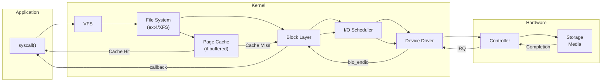
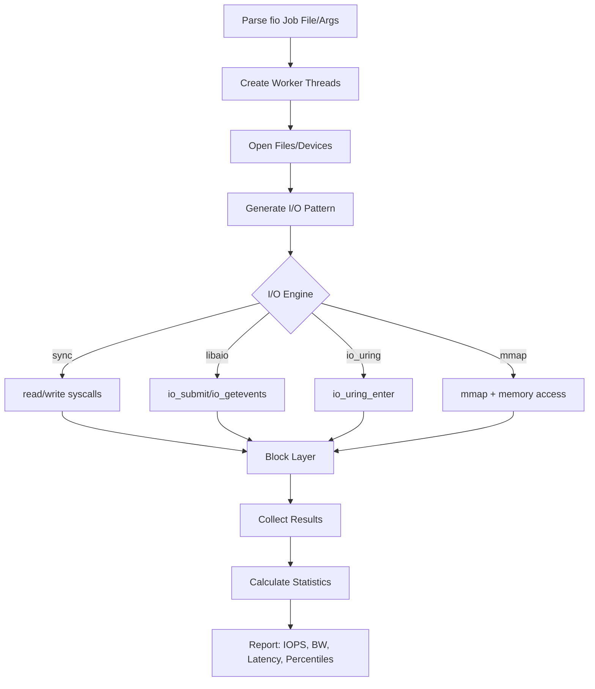
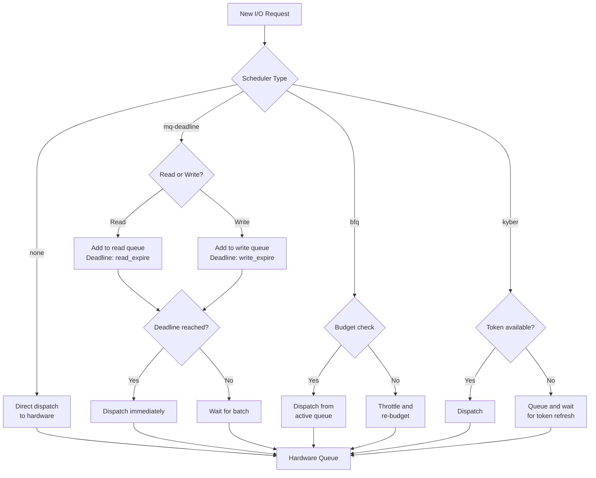

# Chapter 238: I/O Optimization — iostat, blktrace, fio, I/O Schedulers (mq-deadline, bfq, kyber)

## 1. Intuition

I/O optimization is the art and science of making storage operations faster, more efficient, and more predictable. While CPU and memory optimizations deal with nanosecond-scale operations, storage I/O operates on a timescale of microseconds (NVMe SSDs) to milliseconds (HDDs) — a difference of 3-6 orders of magnitude. This vast difference means that even small improvements in I/O patterns can have dramatic effects on overall system performance.

The fundamental challenge of I/O optimization is bridging the gap between how applications want to access data (random, variable-sized, unpredictable) and how storage devices are most efficient (sequential, aligned, batched). The operating system's I/O stack exists largely to perform this translation.

### The I/O Stack

Understanding I/O optimization requires understanding the full I/O path:

```
Application (read/write/fopen/fread)
    ↓
C Library (buffered I/O, stdio)
    ↓
System Call Interface (read/write/pread/pwrite)
    ↓
VFS (Virtual File System)
    ↓
File System (ext4, XFS, Btrfs)
    ↓
Block Layer (I/O scheduler, merging, dispatch)
    ↓
Device Driver (NVMe, SCSI, virtio)
    ↓
Hardware (SSD controller, HDD platters)
```

Each layer introduces potential bottlenecks and optimization opportunities:

1. **Application layer**: I/O patterns (sequential vs random), request sizes, alignment
2. **C library**: Buffered vs unbuffered I/O, stdio buffering
3. **System calls**: Direct I/O (O_DIRECT), sync vs async, io_uring
4. **File system**: Journaling overhead, fragmentation, block allocation strategy
5. **Block layer**: I/O scheduling, request merging, queue depth
6. **Device driver**: Command queuing, interrupt handling
7. **Hardware**: Internal parallelism, wear leveling, garbage collection (SSDs)

### Key I/O Metrics

| Metric | Description | Why It Matters |
|--------|-------------|----------------|
| IOPS | I/O Operations Per Second | Throughput for random workloads |
| Bandwidth | MB/s transferred | Throughput for sequential workloads |
| Latency | Time per I/O operation | Application responsiveness |
| Queue Depth | Number of in-flight I/Os | Device utilization |
| Merge Rate | I/Os merged by block layer | Efficiency of I/O scheduling |
| %util | Device utilization percentage | Whether device is bottleneck |
| await | Average wait time (ms) | Overall I/O latency |
| svctm | Average service time (ms) | Device-side latency (deprecated) |

### The I/O Pattern Spectrum

```
┌─────────────────────────────────────────────────────────┐
│  Sequential Read    Random Read    Sequential Write    Random Write
│  ████████████       ██  ████  ██    ████████████       ██  ████  ██
│  ████████████       ████  ██  ██    ████████████       ████  ██  ██
│  ████████████       ██  ████  ██    ████████████       ██  ████  ██
│                                                          
│  HDD: Fast          HDD: Slow      HDD: Medium         HDD: Very Slow
│  SSD: Fast          SSD: Fast      SSD: Fast           SSD: Medium
│                                                          
│  100-200 MB/s       0.5-2 MB/s     80-160 MB/s         0.5-2 MB/s
│  (HDD)              (HDD)          (HDD)               (HDD)
│                                                          
│  500-3500 MB/s       500-3500 MB/s  500-3500 MB/s       200-2000 MB/s
│  (NVMe SSD)          (NVMe SSD)     (NVMe SSD)          (NVMe SSD)
└─────────────────────────────────────────────────────────┘
```

## 2. Architecture

### Linux Block I/O Layer

```
┌──────────────────────────────────────────────────────────────────┐
│  Block I/O Layer                                                  │
│                                                                   │
│  ┌─────────────────────────────────────────────────────────────┐ │
│  │  Bio Layer (block I/O)                                      │ │
│  │  struct bio → represents a single block I/O request         │ │
│  │  Contains: sector, size, data pointer, completion callback   │ │
│  └──────────────────────────┬──────────────────────────────────┘ │
│                              │                                    │
│  ┌──────────────────────────▼──────────────────────────────────┐ │
│  │  I/O Scheduler                                              │ │
│  │  ┌─────────────┐  ┌─────────────┐  ┌─────────────┐         │ │
│  │  │ mq-deadline │  │    BFQ      │  │   Kyber     │         │ │
│  │  │ (latency)   │  │ (fairness)  │  │ (throughput)│         │ │
│  │  └─────────────┘  └─────────────┘  └─────────────┘         │ │
│  │  Functions: Merging, reordering, prioritization, timeout    │ │
│  └──────────────────────────┬──────────────────────────────────┘ │
│                              │                                    │
│  ┌──────────────────────────▼──────────────────────────────────┐ │
│  │  Request Queue (struct request_queue)                        │ │
│  │  Per-device queue with hardware dispatch                    │ │
│  └──────────────────────────┬──────────────────────────────────┘ │
│                              │                                    │
│  ┌──────────────────────────▼──────────────────────────────────┐ │
│  │  Device Driver                                              │ │
│  │  NVMe: Multi-queue (per-CPU submission/completion queues)   │ │
│  │  SCSI: Single queue with tag-based command queuing          │ │
│  │  virtio-blk/virtio-scsi: Paravirtualized I/O               │ │
│  └─────────────────────────────────────────────────────────────┘ │
└──────────────────────────────────────────────────────────────────┘
```

### NVMe Multi-Queue Architecture

Modern NVMe devices use per-CPU I/O queues, eliminating the lock contention that plagued older SCSI devices:

```
CPU 0                    CPU 1                    CPU 2
┌──────────┐            ┌──────────┐            ┌──────────┐
│ Submit   │            │ Submit   │            │ Submit   │
│ Queue 0  │            │ Queue 1  │            │ Queue 2  │
│ (SQ0)    │            │ (SQ1)    │            │ (SQ2)    │
└────┬─────┘            └────┬─────┘            └────┬─────┘
     │                       │                       │
     └───────────────────────┼───────────────────────┘
                             │
                    ┌────────▼────────┐
                    │   NVMe Device   │
                    │   Controller    │
                    │                 │
                    │  ┌───────────┐  │
                    │  │ Flash     │  │
                    │  │ Controller│  │
                    │  │ Channels  │  │
                    │  └───────────┘  │
                    └────────┬────────┘
                             │
     ┌───────────────────────┼───────────────────────┐
     │                       │                       │
┌────▼─────┐            ┌────▼─────┐            ┌────▼─────┐
│ Complete │            │ Complete │            │ Complete │
│ Queue 0  │            │ Queue 1  │            │ Queue 2  │
│ (CQ0)    │            │ (CQ1)    │            │ (CQ2)    │
└──────────┘            └──────────┘            └──────────┘
```

### I/O Scheduler Comparison

| Scheduler | Algorithm | Best For | Overhead |
|-----------|-----------|----------|----------|
| **none** | No scheduling | NVMe, fast SSDs | Minimal |
| **mq-deadline** | Per-request deadline | General purpose, databases | Low |
| **bfq** | Budget Fair Queuing | Desktop, interactive workloads | Medium |
| **kyber** | Token-based, two-queues | Fast devices, throughput | Low |
| **cfq** | Completely Fair Queuing | Legacy HDDs (removed in 5.0) | High |

### File System I/O Path

```
┌──────────────────────────────────────────────────────────┐
│  File System (e.g., ext4)                                │
│                                                          │
│  ┌──────────────────────────────────────────────────┐    │
│  │  Journal (JBD2)                                  │    │
│  │  Write-ahead log for crash consistency           │    │
│  │  Modes: journal (slow/safe), ordered (default),  │    │
│  │         writeback (fast/less safe)               │    │
│  └──────────────────────────────────────────────────┘    │
│                                                          │
│  ┌──────────────────────────────────────────────────┐    │
│  │  Page Cache (Buffer Cache)                       │    │
│  │  Caches file data in memory                      │    │
│  │  Dirty pages written back by pdflush/kworker     │    │
│  └──────────────────────────────────────────────────┘    │
│                                                          │
│  ┌──────────────────────────────────────────────────┐    │
│  │  Block Allocation                                │    │
│  │  Extent-based (ext4, XFS) vs block-based (ext2) │    │
│  │  Allocation groups for parallelism               │    │
│  └──────────────────────────────────────────────────┘    │
└──────────────────────────────────────────────────────────┘
```

## 3. Tools & Techniques

### iostat

`iostat` provides device-level I/O statistics:

```bash
# Basic device statistics
iostat -x 1

# Output columns:
# Device: Device name
# r/s: Reads per second
# w/s: Writes per second
# rkB/s: Read kilobytes per second
# wkB/s: Write kilobytes per second
# rrqm/s: Read merges per second
# wrqm/s: Write merges per second
# %rrqm: Read merge percentage
# %wrqm: Write merge percentage
# r_await: Average read latency (ms)
# w_await: Average write latency (ms)
# aqu-sz: Average queue size
# rareq-sz: Average read request size (KB)
# wareq-sz: Average write request size (KB)
# svctm: Average service time (deprecated)
# %util: Device utilization percentage

# Extended statistics with device mapper
iostat -xN 1

# JSON output (more recent versions)
iostat -x -o JSON 1

# Show only specific devices
iostat -x sda nvme0n1 1

# Accumulated statistics since boot
iostat -x -t 1  # Include timestamp
```

**iostat output interpretation:**

```bash
# Example output:
# Device  r/s    w/s   rkB/s  wkB/s  rrqm/s  wrqm/s  %rrqm  %wrqm  r_await  w_await  aqu-sz  %util
# sda     150.0  200.0 2400.0 8000.0  10.0    50.0    6.25   20.0    0.5     1.2      0.35    45.0
# nvme0n1 5000.0 3000.0 80000.0 48000.0 0.0   0.0     0.0    0.0    0.02    0.05     0.40    78.0

# Interpretation:
# sda (HDD): Low IOPS, moderate merge rate, higher latency
# nvme0n1 (NVMe): High IOPS, no merges needed, very low latency
# nvme0n1 at 78% utilization — may be approaching saturation
```

### blktrace

`blktrace` traces block I/O events at the kernel level:

```bash
# Capture block trace
sudo blktrace -d /dev/sda -o trace

# Convert to human-readable format
blkparse -i trace.blktrace.0 -o trace.txt

# Live trace
sudo blktrace -d /dev/sda -o - | blkparse -i -

# Analyze with btt (block trace tools)
blkparse -i trace.blktrace.0 | btt

# btt output includes:
# Q2C (queue to complete): Total I/O latency
# D2C (dispatch to complete): Device latency
# Q2D (queue to dispatch): Scheduler latency
# D2C / Q2C ratio shows how much latency is device vs scheduler

# Trace specific processes
sudo blktrace -d /dev/sda -o trace &
# Run workload
sudo kill %1
blkparse -i trace.blktrace.0

# Filter by process
blkparse -i trace.blktrace.0 -a issue -a complete -d trace.bin
```

**blktrace event types:**

| Event | Description |
|-------|-------------|
| Q | Request queued to block layer |
| G | Get request from block layer |
| I | Request inserted into scheduler |
| D | Request dispatched to driver |
| C | Request completed |
| M | Request merged with existing request |
| A | Remap (device mapper) |

### fio (Flexible I/O Tester)

`fio` is the industry-standard I/O benchmarking tool:

```bash
# Sequential read test
fio --name=seqread --rw=read --bs=128k --size=1G --numjobs=4 \
    --ioengine=libaio --direct=1 --runtime=60

# Random read test
fio --name=randread --rw=randread --bs=4k --size=1G --numjobs=4 \
    --ioengine=libaio --direct=1 --iodepth=32 --runtime=60

# Random write test with sync
fio --name=randwrite --rw=randwrite --bs=4k --size=1G --numjobs=1 \
    --ioengine=sync --direct=1 --fsync=1 --runtime=60

# Mixed workload (70% read, 30% write)
fio --name=mixed --rw=randrw --rwmixread=70 --bs=4k --size=1G \
    --numjobs=4 --ioengine=libaio --direct=1 --iodepth=32 --runtime=60

# Database-like workload
fio --name=db --rw=randrw --rwmixread=70 --bs=8k --size=10G \
    --numjobs=8 --ioengine=libaio --direct=1 --iodepth=64 \
    --group_reporting --runtime=120

# Latency-focused test
fio --name=latency --rw=randread --bs=4k --size=1G --numjobs=1 \
    --ioengine=libaio --direct=1 --iodepth=1 --runtime=60 \
    --lat_percentiles=1 --percentile_list=1:5:10:20:30:40:50:60:70:80:90:95:99:99.5:99.9:99.95:99.99
```

**Key fio options:**

| Option | Description |
|--------|-------------|
| `--rw=TYPE` | I/O pattern: read, write, randread, randwrite, randrw, readwrite |
| `--bs=SIZE` | Block size (4k, 8k, 128k, 1m, etc.) |
| `--size=SIZE` | Working set size per job |
| `--numjobs=N` | Number of parallel I/O threads |
| `--ioengine=TYPE` | I/O engine: sync, libaio, io_uring, mmap, posixaio |
| `--direct=1` | Bypass page cache (O_DIRECT) |
| `--iodepth=N` | Queue depth (async engines only) |
| `--runtime=SECS` | Test duration |
| `--time_based` | Run for specified duration even if work completes |
| `--group_reporting` | Aggregate results across jobs |
| `--rwmixread=N` | Percentage of reads for mixed workloads |
| `--lat_percentiles=1` | Report latency percentiles |
| `--log_avg_msec=1000` | Log interval for bandwidth/latency |
| `--write_bw_log=bw` | Write bandwidth log |
| `--write_lat_log=lat` | Write latency log |
| `--write_iops_log=iops` | Write IOPS log |

**fio job file format:**

```ini
; db_workload.fio
[global]
ioengine=libaio
direct=1
size=10G
runtime=120
time_based
group_reporting
lat_percentiles=1

[seq-read]
rw=read
bs=128k
numjobs=4

[rand-read-4k]
rw=randread
bs=4k
numjobs=8
iodepth=32

[rand-write-8k]
rw=randwrite
bs=8k
numjobs=4
iodepth=16
```

```bash
# Run job file
fio db_workload.fio

# Run specific section
fio db_workload.fio --section=rand-read-4k
```

### I/O Scheduler Configuration

```bash
# View current scheduler
cat /sys/block/sda/queue/scheduler
# Output: [mq-deadline] bfq kyber none

# Change scheduler (runtime)
echo "bfq" | sudo tee /sys/block/sda/queue/scheduler

# Change scheduler (persistent) via udev
cat > /etc/udev/rules.d/60-ioscheduler.rules << 'EOF'
# HDD: use mq-deadline
ACTION=="add|change", KERNEL=="sd[a-z]", ATTR{queue/rotational}=="1", ATTR{queue/scheduler}="mq-deadline"
# SSD/NVMe: use none (or kyber for throughput)
ACTION=="add|change", KERNEL=="nvme[0-9]*", ATTR{queue/scheduler}="none"
ACTION=="add|change", KERNEL=="sd[a-z]", ATTR{queue/rotational}=="0", ATTR{queue/scheduler}="kyber"
EOF

# View scheduler-specific parameters
ls /sys/block/sda/queue/iosched/
# mq-deadline: fifo_batch, writes_starved, read_expire, write_expire
# bfq: slice_idle, back_seek_max, back_seek_min, low_latency
# kyber: read_lat_nsec, write_lat_nsec
```

**Scheduler tuning examples:**

```bash
# mq-deadline: Reduce read latency for database workloads
echo 125 | sudo tee /sys/block/sda/queue/iosched/read_expire   # 125ms
echo 500 | sudo tee /sys/block/sda/queue/iosched/write_expire  # 500ms
echo 16  | sudo tee /sys/block/sda/queue/iosched/fifo_batch    # Batch size

# BFQ: Optimize for interactive workloads
echo 0 | sudo tee /sys/block/sda/queue/iosched/low_latency     # Disable for servers
echo 8  | sudo tee /sys/block/sda/queue/iosched/slice_idle      # 8ms idle wait

# Kyber: Set target latencies
echo 2000000 | sudo tee /sys/block/nvme0n1/queue/iosched/read_lat_nsec   # 2ms
echo 10000000 | sudo tee /sys/block/nvme0n1/queue/iosched/write_lat_nsec # 10ms
```

### Additional I/O Tools

```bash
# iotop: Per-process I/O statistics (like top for I/O)
sudo iotop -oP
# -o: Only show processes with I/O
# -P: Show processes (not threads)

# ioping: Measure storage latency
ioping -c 100 /dev/sda          # 100 I/O requests to device
ioping -c 100 -s 4k /dev/sda    # 4k request size
ioping -c 100 -i 1ms /dev/sda   # 1ms interval

# Direct device latency test
ioping -R /dev/nvme0n1           # Raw device, no filesystem

# latencytop: System-wide latency profiling
sudo latencytop

# seekwatcher: Visualize block I/O patterns
# Creates timeline/heatmaps from blktrace data
seekwatcher -t trace.blktrace.0 -o io_pattern.png

# bcc/bpftrace tools for I/O analysis
# biolatency: I/O latency histogram
sudo biolatency-bpfcc

# biosnoop: Per-I/O trace
sudo biosnoop-bpfcc

# biotop: Top-like display of I/O
sudo biotop-bpfcc

# filetop: Per-file I/O statistics
sudo filetop-bpfcc

# ext4slower: Slow ext4 operations
sudo ext4slower-bpfcc 10  # Show operations > 10ms

# bpftrace I/O latency histogram
sudo bpftrace -e 'tracepoint:block:block_rq_complete { @usecs = hist(args->io_duration / 1000); }'
```

## 4. Source Code References

### Linux Block Layer

```
block/blk-core.c            — Core block I/O handling
block/blk-mq.c             — Multi-queue block layer
block/blk-mq-sched.c       — MQ scheduler interface
block/blk-merge.c          — I/O request merging
block/blk-settings.c       — Queue settings/parameters
block/blk-timeout.c        — Request timeout handling
include/linux/blk_types.h  — Bio structure definitions
include/linux/blk-mq.h     — Multi-queue structures
```

### I/O Schedulers

```
block/mq-deadline.c        — mq-deadline scheduler
block/bfq-cgroup.c         — BFQ cgroup support
block/bfq-iosched.c        — BFQ core scheduler
block/bfq-wf2q.c           — BFQ fair queuing
block/kyber-iosched.c      — Kyber scheduler
```

**Key data structures:**

```c
// include/linux/blk_types.h (simplified)
struct bio {
    struct bio *bi_next;      // Link in request
    struct block_device *bi_bdev;  // Target device
    unsigned int bi_opf;      // Operation and flags
    unsigned short bi_flags;  
    unsigned short bi_ioprio; // I/O priority
    blk_status_t bi_status;   // Completion status
    struct bvec_iter bi_iter; // Iterator over bio_vec array
    bio_end_io_t *bi_end_io;  // Completion callback
    void *bi_private;         // Owner-private data
};

struct request {
    struct request_queue *q;  // Owning queue
    struct blk_mq_ctx *mq_ctx; // MQ context
    struct blk_mq_hw_ctx *mq_hctx; // MQ hardware context
    unsigned int cmd_flags;   // Command flags
    blk_status_t rq_status;   // Completion status
    sector_t __sector;        // Target sector
    unsigned int __data_len;  // Total data length
    struct bio *bio;          // First bio in list
    /* ... */
};
```

### NVMe Driver

```
drivers/nvme/host/core.c     — NVMe core logic
drivers/nvme/host/pci.c      — NVMe PCI driver
drivers/nvme/host/ioctl.c    — NVMe ioctls
include/linux/nvme.h         — NVMe structures
```

### File System (ext4)

```
fs/ext4/inode.c              — Inode operations
fs/ext4/extents.c            — Extent management
fs/ext4/mballoc.c            — Block allocation
fs/ext4/jbd2.c               — Journal interface
fs/ext4/page-io.c            — Page I/O handling
fs/jbd2/commit.c             — Journal commit
fs/jbd2/checkpoint.c         — Journal checkpoint
```

## 5. Examples

### Example 1: Identifying I/O Bottlenecks with iostat

```bash
# Start monitoring
iostat -x 1

# Under load, look for:
# %util near 100%: Device is saturated
# r_await/w_await > 10ms (HDD) or > 1ms (SSD): High latency
# aqu-sz > 1: Requests queueing up
# %rrqm/%wrqm near 0: No merging (random workload)

# Example analysis:
# Device  r/s    w/s   rkB/s  wkB/s  r_await  w_await  aqu-sz  %util
# sda     5.0    200.0 80.0   8000.0  5.0     15.0     3.05    100.0

# Diagnosis:
# - High write IOPS (200/s) saturating the HDD
# - Write latency of 15ms is high for an HDD (normal is 5-10ms)
# - Queue depth of 3.05 means requests are backing up
# - 100% utilization confirms device saturation

# Solutions:
# 1. Reduce write frequency (batch writes)
# 2. Use write-back caching
# 3. Switch to SSD
# 4. Use direct I/O to avoid double-buffering
```

### Example 2: Analyzing I/O Latency with blktrace

```bash
# Capture a 30-second trace
sudo blktrace -d /dev/sda -o trace -w 30

# Analyze latency distribution
blkparse -i trace.blktrace.0 | btt

# btt output example:
# ALL               MIN     AVG     MAX     N
# Q2Q               0.000000453  0.000005234  0.005234123  123456
# Q2G               0.000000123  0.000000345  0.001234567  123456
# G2I               0.000000056  0.000000123  0.000567890  123456
# Q2M               0.000000012  0.000000023  0.000123456  12345
# I2D               0.000000034  0.000000078  0.000345678  123456
# D2C               0.000001234  0.003456789  0.056789012  123456
# Q2C               0.000001345  0.003567890  0.057890123  123456

# Interpretation:
# D2C (device latency): avg 3.5ms — this is the actual disk latency
# Q2C (total latency): avg 3.6ms — most time is at the device
# Q2G + G2I + I2D (scheduler overhead): ~0.5ms — scheduler is fast
```

### Example 3: Benchmarking with fio

```bash
# Comprehensive storage benchmark
# Sequential read (throughput)
fio --name=seq-read --rw=read --bs=1m --size=4G --numjobs=4 \
    --ioengine=libaio --direct=1 --iodepth=32 --runtime=60 \
    --group_reporting --output-format=json > seq_read.json

# Random read (IOPS)
fio --name=rand-read --rw=randread --bs=4k --size=4G --numjobs=8 \
    --ioengine=libaio --direct=1 --iodepth=64 --runtime=60 \
    --group_reporting --output-format=json > rand_read.json

# Random write (IOPS)
fio --name=rand-write --rw=randwrite --bs=4k --size=4G --numjobs=8 \
    --ioengine=libaio --direct=1 --iodepth=64 --runtime=60 \
    --group_reporting --output-format=json > rand_write.json

# Database workload (mixed, 8k blocks)
fio --name=db --rw=randrw --rwmixread=70 --bs=8k --size=10G \
    --numjobs=8 --ioengine=libaio --direct=1 --iodepth=64 \
    --runtime=120 --group_reporting --output-format=json > db.json

# Parse results
python3 -c "
import json
for name in ['seq_read', 'rand_read', 'rand_write', 'db']:
    with open(f'{name}.json') as f:
        data = json.load(f)
    j = data['jobs'][0]
    if 'read' in j and j['read']['iops'] > 0:
        print(f'{name} READ:  IOPS={j[\"read\"][\"iops\"]:,.0f}  BW={j[\"read\"][\"bw\"]/1024:.0f} MB/s  lat_p99={j[\"read\"][\"clat_ns\"][\"percentile\"][\"99.000000\"]/1e6:.2f} ms')
    if 'write' in j and j['write']['iops'] > 0:
        print(f'{name} WRITE: IOPS={j[\"write\"][\"iops\"]:,.0f}  BW={j[\"write\"][\"bw\"]/1024:.0f} MB/s  lat_p99={j[\"write\"][\"clat_ns\"][\"percentile\"][\"99.000000\"]/1e6:.2f} ms')
"
```

### Example 4: Comparing I/O Schedulers

```bash
# Benchmark each scheduler
for sched in none mq-deadline bfq kyber; do
    echo "$sched" | sudo tee /sys/block/nvme0n1/queue/scheduler
    sleep 2
    
    fio --name="test_${sched}" --rw=randread --bs=4k --size=1G \
        --numjobs=4 --ioengine=libaio --direct=1 --iodepth=32 \
        --runtime=30 --group_reporting --output-format=json \
        --output="fio_${sched}.json"
    
    python3 -c "
import json
with open('fio_${sched}.json') as f:
    data = json.load(f)
j = data['jobs'][0]['read']
print(f'${sched}: IOPS={j[\"iops\"]:,.0f}  p99={j[\"clat_ns\"][\"percentile\"][\"99.000000\"]/1e6:.3f}ms')
"
done

# Restore preferred scheduler
echo "none" | sudo tee /sys/block/nvme0n1/queue/scheduler
```

### Example 5: Per-Process I/O Analysis

```bash
# Monitor per-process I/O in real-time
sudo iotop -oP -d 1

# Track I/O for a specific process using BPF
sudo biosnoop-bpfcc | grep <PID>

# Trace slow I/O operations
sudo biolatency-bpfcc -D  # Per-disk histogram

# Find which files cause the most I/O
sudo filetop-bpfcc -C  # Clear screen between updates

# Example output from filetop:
# PID    COMM             FILE             READS  WRITES  R_KB   W_KB
# 12345  mysqld           ibdata1          500    0       2000   0
# 12345  mysqld           ib_logfile0      0      300     0      1200
# 23456  postgres         base/16384/      200    0       800    0
```

### Example 6: Optimizing I/O for a Database

```bash
# 1. Check current I/O configuration
cat /sys/block/nvme0n1/queue/scheduler
cat /sys/block/nvme0n1/queue/nr_requests
cat /sys/block/nvme0n1/queue/read_ahead_kb

# 2. Tune for database workload
# Use 'none' scheduler for NVMe (let device handle scheduling)
echo "none" | sudo tee /sys/block/nvme0n1/queue/scheduler

# Increase queue depth
echo 256 | sudo tee /sys/block/nvme0n1/queue/nr_requests

# Reduce read-ahead for random I/O
echo 8 | sudo tee /sys/block/nvme0n1/queue/read_ahead_kb

# 3. Filesystem tuning (ext4)
# Disable journal for maximum performance (if acceptable)
sudo tune2fs -O ^has_journal /dev/nvme0n1p1

# Or use data=writeback for better performance (less safe)
sudo mount -o data=writeback /dev/nvme0n1p1 /data

# Use noatime to avoid metadata writes
sudo mount -o remount,noatime /data

# 4. Benchmark the changes
fio --name=db-after --rw=randrw --rwmixread=70 --bs=8k \
    --size=10G --numjobs=8 --ioengine=libaio --direct=1 \
    --iodepth=64 --runtime=60 --group_reporting
```

## 6. Diagrams

### I/O Latency Breakdown



### fio Workflow



### I/O Scheduler Decision Flow



## 7. Common Pitfalls

### 1. Benchmarking with Buffer Cache

```bash
# Problem: fio results show 10 GB/s on a 500 MB/s device
# The page cache is serving data from memory, not disk

# Solution: Always use --direct=1 for device benchmarks
fio --name=test --rw=read --bs=4k --direct=1 ...  # Correct

# Or clear caches between runs
sudo sh -c 'echo 3 > /proc/sys/vm/drop_caches'
fio --name=test --rw=read --bs=4k ...

# For filesystem benchmarks (where cache is desired):
# Use --direct=0 but be aware results include cache effects
```

### 2. Using --numjobs=1 for Device Benchmarks

```bash
# Problem: Single-threaded benchmark doesn't saturate NVMe device
# NVMe drives have multiple internal channels that need parallel access

# Solution: Use enough jobs to saturate the device
fio --name=test --rw=randread --bs=4k --numjobs=8 --iodepth=64 ...

# Rule of thumb:
# HDD: 1-4 jobs, iodepth 32-64
# SATA SSD: 4-8 jobs, iodepth 32-64
# NVMe SSD: 8-32 jobs, iodepth 64-256
```

### 3. Ignoring Alignment

```bash
# Problem: I/O crosses page/sector boundaries, causing extra I/O
# Misaligned partitions or file offsets cause read-modify-write cycles

# Solution: Ensure proper alignment
# Check alignment:
sudo fdisk -l /dev/nvme0n1
# Partition should start at 2048 (1MB boundary) or 4096 sectors

# For fio: use --offset and --size aligned to 4k
fio --name=test --offset=0 --size=1G --bs=4k --direct=1 ...

# For O_DIRECT: buffer must be page-aligned
# posix_memalign(&buf, 4096, size);
```

### 4. Wrong Block Size for Workload

```bash
# Problem: Testing with 4k blocks but application uses 128k blocks
# Results are not representative

# Solution: Match block size to application
# Database (OLTP): 4k-16k random
# Database (OLAP): 256k-1M sequential
# File server: 64k-1M mixed
# Log writing: 4k-64k sequential writes
# Web server: 4k-64k mixed

# Use iostat to find actual block size:
# rareq-sz and wareq-sz columns show average request size
```

### 5. Short Benchmark Duration

```bash
# Problem: 10-second benchmark doesn't account for:
# - Device garbage collection (SSD)
# - Thermal throttling
# - Write cache filling up
# - Steady-state vs burst performance

# Solution: Run for at least 60 seconds, preferably 300+ seconds
fio --name=test --runtime=300 --time_based ...

# For SSDs: run until steady-state is reached
# This may require filling the drive first:
fio --name=precondition --rw=write --bs=128k --size=100% --direct=1
# Then run the actual benchmark
```

### 6. Ignoring I/O Priority

```bash
# Problem: Background I/O (backups, logs) competes with foreground I/O
# All I/O treated equally causes latency spikes

# Solution: Use I/O priority classes
# Real-time (highest priority)
ionice -c 1 -n 0 ./critical_database

# Best-effort (default)
ionice -c 2 -n 4 ./normal_process

# Idle (lowest priority, only runs when disk is idle)
ionice -c 3 ./backup_job

# With cgroups v2:
echo "+io" | sudo tee /sys/fs/cgroup/critical/cgroup.subtree_control
echo "8:0 rbps=104857600 wiops=1000" | sudo tee /sys/fs/cgroup/critical/io.max
```

### 7. Measuring Latency Without Percentiles

```bash
# Problem: Average latency is 1ms, but p99 is 100ms
# Average hides tail latency that affects user experience

# Solution: Always look at percentiles
fio --name=test --rw=randread --bs=4k --lat_percentiles=1 \
    --percentile_list=1:5:10:20:30:40:50:60:70:80:90:95:99:99.9:99.99

# Or use histograms:
fio --name=test --rw=randread --bs=4k --log_hist_msec=100 \
    --write_lat_log=latency
# Then analyze with fio_generate_plots or custom tools
```

## 8. Best Practices

### 1. Match I/O Pattern to Application

```bash
# OLTP Database (MySQL, PostgreSQL)
fio --name=oltp --rw=randrw --rwmixread=70 --bs=8k \
    --ioengine=libaio --direct=1 --iodepth=32 --numjobs=8

# Log-structured storage (Kafka, Cassandra)
fio --name=log --rw=write --bs=64k --ioengine=libaio --direct=1 \
    --iodepth=16 --numjobs=4

# Web server (static files)
fio --name=web --rw=randread --bs=4k --ioengine=libaio --direct=1 \
    --iodepth=16 --numjobs=4

# Data warehouse (sequential scans)
fio --name=dwh --rw=read --bs=1m --ioengine=libaio --direct=1 \
    --iodepth=16 --numjobs=4
```

### 2. Tune Kernel I/O Parameters

```bash
# Increase maximum queue depth
echo 256 | sudo tee /sys/block/nvme0n1/queue/nr_requests

# Adjust read-ahead for workload
# Sequential workloads: increase read-ahead
echo 2048 | sudo tee /sys/block/sda/queue/read_ahead_kb
# Random workloads: decrease read-ahead
echo 8 | sudo tee /sys/block/nvme0n1/queue/read_ahead_kb

# Set I/O scheduler
echo "none" | sudo tee /sys/block/nvme0n1/queue/scheduler  # NVMe
echo "mq-deadline" | sudo tee /sys/block/sda/queue/scheduler  # HDD

# Disable I/O stats collection for minimal overhead (if not needed)
echo 0 | sudo tee /sys/block/nvme0n1/queue/iostats
```

### 3. Use Direct I/O Appropriately

```bash
# O_DIRECT bypasses the page cache
# Use when:
# - Application manages its own cache (databases)
# - Large sequential I/O that would pollute cache
# - Avoiding double-buffering

# Don't use when:
# - Small random reads (page cache is beneficial)
# - Multiple processes read the same files
# - File system metadata operations

# In C:
int fd = open("datafile", O_RDONLY | O_DIRECT);
// Buffer must be page-aligned
void *buf;
posix_memalign(&buf, 4096, block_size);
read(fd, buf, block_size);
```

### 4. Monitor I/O in Production

```bash
# Set up continuous I/O monitoring
# Prometheus + node_exporter exposes:
# node_disk_reads_completed_total
# node_disk_writes_completed_total
# node_disk_read_time_seconds_total
# node_disk_write_time_seconds_total
# node_disk_io_time_seconds_total

# Alert on high latency
# Calculate await from counters:
# rate(node_disk_read_time_seconds_total[5m]) / rate(node_disk_reads_completed_total[5m])

# Or use collectd with the disk plugin
# Or write a simple monitoring script:
#!/bin/bash
while true; do
    iostat -x 1 2 | tail -n +4 | head -n -1 >> /var/log/iostat.log
    sleep 59  # iostat already waited 1 second
done
```

### 5. Profile Before Optimizing

```bash
# Step 1: Measure current performance
iostat -x 1 > before_iostat.txt &
fio --name=baseline --rw=randread --bs=4k --direct=1 --iodepth=32 \
    --numjobs=8 --runtime=60 --output=before_fio.json &
wait

# Step 2: Make ONE change (e.g., change scheduler)
echo "bfq" | sudo tee /sys/block/sda/queue/scheduler

# Step 3: Measure again
iostat -x 1 > after_iostat.txt &
fio --name=optimized --rw=randread --bs=4k --direct=1 --iodepth=32 \
    --numjobs=8 --runtime=60 --output=after_fio.json &
wait

# Step 4: Compare
python3 -c "
import json
for phase in ['before', 'after']:
    with open(f'{phase}_fio.json') as f:
        data = json.load(f)
    r = data['jobs'][0]['read']
    print(f'{phase}: IOPS={r[\"iops\"]:,.0f}  p99={r[\"clat_ns\"][\"percentile\"][\"99.000000\"]/1e6:.2f}ms')
"
```

### 6. Use io_uring for High-Performance I/O

```bash
# io_uring is the newest Linux I/O interface (5.1+)
# Advantages:
# - Zero syscall overhead (shared ring buffers)
# - True async for all I/O operations
# - Submission batching
# - Kernel-side polling

# fio with io_uring:
fio --name=io_uring_test --rw=randread --bs=4k --direct=1 \
    --iodepth=128 --ioengine=io_uring --sqthread_poll=1 \
    --runtime=60

# Compare with libaio:
fio --name=libaio_test --rw=randread --bs=4k --direct=1 \
    --iodepth=128 --ioengine=libaio --runtime=60
```

## 9. Exercises

### Exercise 1: I/O Performance Baseline
```bash
# Benchmark your storage device
fio --name=baseline --rw=randread --bs=4k --size=1G --numjobs=4 \
    --ioengine=libaio --direct=1 --iodepth=32 --runtime=60 \
    --lat_percentiles=1 --output=baseline.json

# Questions:
# 1. What is the IOPS for random 4k reads?
# 2. What is the p99 latency?
# 3. What is the maximum bandwidth for sequential 1M reads?
# 4. Is the device performing as expected for its type?
```

### Exercise 2: Scheduler Comparison
```bash
# Compare I/O schedulers on your system
for sched in none mq-deadline bfq kyber; do
    echo "$sched" | sudo tee /sys/block/*/queue/scheduler 2>/dev/null
    fio --name="sched_${sched}" --rw=randread --bs=4k --size=1G \
        --numjobs=4 --ioengine=libaio --direct=1 --iodepth=32 \
        --runtime=30 --lat_percentiles=1 --output="sched_${sched}.json"
done

# Questions:
# 1. Which scheduler gives the best IOPS?
# 2. Which scheduler gives the best p99 latency?
# 3. Which scheduler would you choose for a database? Why?
```

### Exercise 3: I/O Pattern Analysis
```bash
# Monitor your system's I/O patterns
sudo blktrace -d /dev/sda -o trace -w 30
blkparse -i trace.blktrace.0 | btt

# Questions:
# 1. What is the average I/O size?
# 2. What percentage of I/Os are sequential vs random?
# 3. What is the average device latency (D2C)?
# 4. What is the scheduler overhead (Q2D)?
```

### Exercise 4: Application I/O Profiling
```bash
# Profile I/O for a real application
# Start the application
./my_server &

# Monitor its I/O
sudo biosnoop-bpfcc | grep my_server > iosnoop.txt &
sudo biolatency-bpfcc > biolatency.txt &

# Generate load
ab -n 10000 -c 100 http://localhost:8080/api/data

# Stop monitoring and analyze
# Questions:
# 1. What is the I/O pattern (sequential/random, read/write ratio)?
# 2. What is the average I/O latency?
# 3. Are there any outlier I/O operations (> 10ms)?
# 4. What optimization would improve I/O performance?
```

### Exercise 5: Filesystem Tuning
```bash
# Compare filesystem options
# Create test filesystems
sudo mkfs.ext4 -O ^has_journal /dev/loop0
sudo mkfs.xfs /dev/loop1
sudo mkfs.btrfs /dev/loop2

# Mount with different options
sudo mount -o noatime,data=writeback /dev/loop0 /mnt/ext4
sudo mount -o noatime /dev/loop1 /mnt/xfs
sudo mount -o noatime,compress=no /dev/loop2 /mnt/btrfs

# Benchmark each
for fs in ext4 xfs btrfs; do
    fio --name="${fs}" --directory="/mnt/${fs}" --rw=randwrite --bs=4k \
        --size=1G --numjobs=4 --ioengine=libaio --direct=1 --iodepth=32 \
        --runtime=30 --lat_percentiles=1 --output="${fs}.json"
done

# Questions:
# 1. Which filesystem has the best random write performance?
# 2. Which has the best latency?
# 3. How does the journal affect ext4 performance?
```

## 10. References

1. **Brendan Gregg - Block I/O Analysis**: https://www.brendangregg.com/linuxperf.html
2. **fio Documentation**: https://fio.readthedocs.io/
3. **Linux Block I/O Documentation**: https://www.kernel.org/doc/html/latest/block/
4. **blktrace Manual**: https://man7.org/linux/man-pages/man8/blktrace.8.html
5. **iostat Manual**: https://man7.org/linux/man-pages/man1/iostat.1.html
6. **io_uring**: https://kernel.dk/io_uring.pdf
7. **BPF Performance Tools (Brendan Gregg)**: http://www.brendangregg.com/bpf-performance-tools-book.html
8. **"Systems Performance" by Brendan Gregg**: Chapter 9 - Disk Analysis Methodology
9. **NVMe Specification**: https://nvmexpress.org/nvmexpress-specification/
10. **Linux I/O Scheduler Documentation**: https://www.kernel.org/doc/html/latest/block/
11. **fio HOWTO**: https://fio.readthedocs.io/en/latest/fio_doc.html
