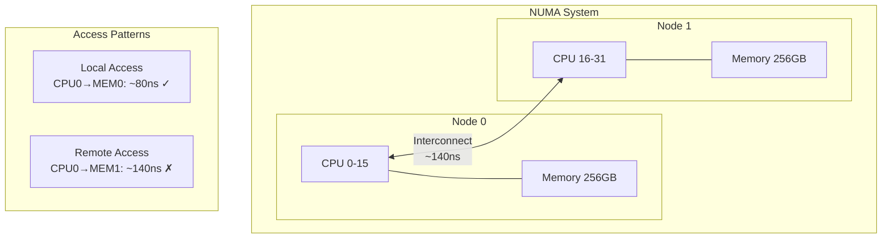
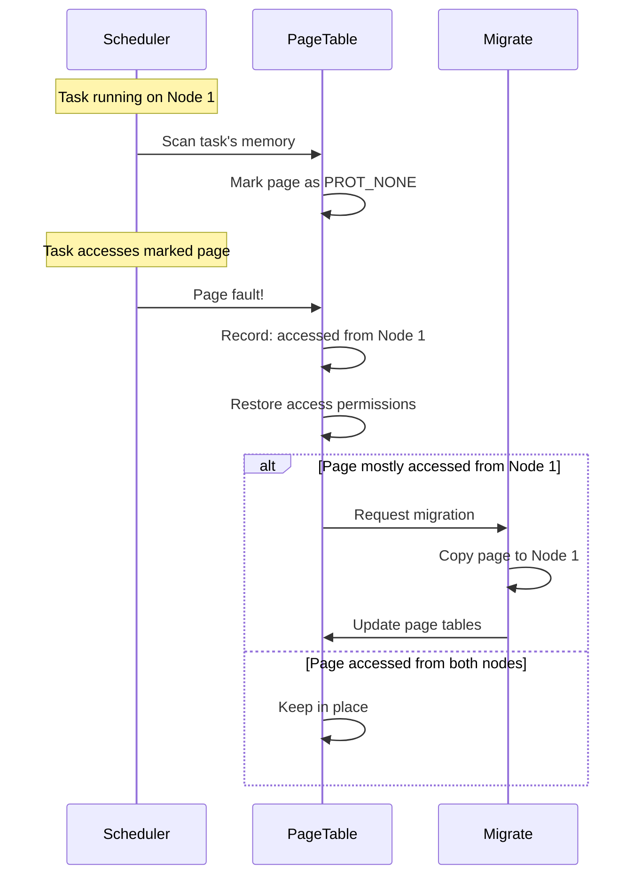
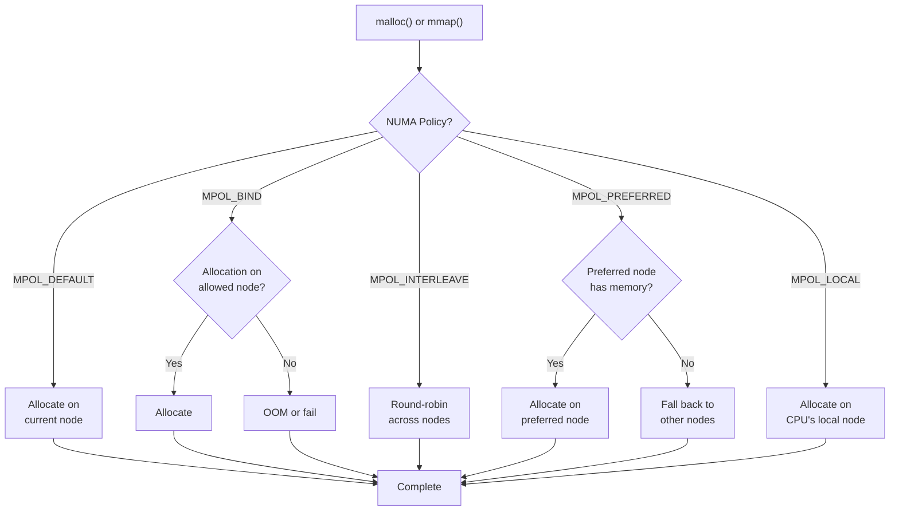

# Chapter 239: NUMA Optimization — numactl, numastat, AutoNUMA, interleave/bind policies

## 1. Intuition

NUMA (Non-Uniform Memory Access) is a memory architecture where the time to access memory depends on which memory bank and which processor is involved. In a NUMA system, each CPU has a "local" memory bank that it can access quickly, and "remote" memory banks that take significantly longer to reach. The performance difference between local and remote memory access can be 2-3× or more, making NUMA optimization critical for memory-intensive workloads.

Consider a dual-socket server with 64 cores per socket and 256 GB of RAM per socket (512 GB total):

```
Socket 0                    Socket 1
┌─────────────────┐        ┌─────────────────┐
│ CPU 0-63        │        │ CPU 64-127      │
│ 256 GB RAM      │        │ 256 GB RAM      │
│ (local latency  │        │ (local latency  │
│  ~80ns)         │←QPI→   │  ~80ns)         │
│                 │ ~140ns │                 │
└─────────────────┘        └─────────────────┘
```

If a thread on CPU 0 allocates memory that lands in Socket 1's RAM, every memory access takes ~140ns instead of ~80ns — a 75% penalty. For a program doing millions of memory accesses per second, this penalty is devastating.

### Why NUMA Exists

NUMA is a consequence of scaling memory bandwidth and capacity beyond what a single memory controller can provide:

1. **Single-socket systems**: UMA (Uniform Memory Access) — all memory equidistant from all cores
2. **Multi-socket systems**: NUMA — each socket has local memory, connected via high-speed interconnect (Intel UPI, AMD Infinity Fabric)
3. **Multi-NUMA-node systems**: Some CPUs have multiple NUMA nodes per socket (e.g., AMD EPYC with 2-8 NUMA nodes per socket)

### NUMA Performance Impact

| Access Type | Typical Latency | Relative Speed |
|-------------|----------------|----------------|
| Local L1 cache hit | ~1ns | 100× |
| Local L2 cache hit | ~4ns | 25× |
| Local L3 cache hit | ~12ns | 8× |
| Local DRAM | ~80ns | 1.25× |
| Remote DRAM (same socket) | ~120ns | 0.83× |
| Remote DRAM (cross-socket) | ~140ns | 0.71× |
| Remote DRAM (2 hops) | ~200ns | 0.5× |

### The Key Insight

**The most important NUMA optimization is ensuring that threads access memory that's local to their CPU.** This means:
1. Allocate memory on the same NUMA node as the thread that will use it
2. Bind threads to CPUs on the same NUMA node
3. Avoid memory migration unless necessary

## 2. Architecture

### NUMA Topology

```
┌─────────────────────────────────────────────────────────────────┐
│  NUMA System (2-socket, 4 NUMA nodes)                          │
│                                                                 │
│  Socket 0                          Socket 1                    │
│  ┌─────────────────────┐          ┌─────────────────────┐      │
│  │ NUMA Node 0         │          │ NUMA Node 2         │      │
│  │ CPU 0-15            │          │ CPU 32-47           │      │
│  │ 128 GB RAM          │          │ 128 GB RAM          │      │
│  │ L3 Cache: 32 MB     │          │ L3 Cache: 32 MB     │      │
│  └──────────┬──────────┘          └──────────┬──────────┘      │
│             │                                 │                 │
│  ┌──────────▼──────────┐          ┌──────────▼──────────┐      │
│  │ NUMA Node 1         │          │ NUMA Node 3         │      │
│  │ CPU 16-31           │          │ CPU 48-63           │      │
│  │ 128 GB RAM          │          │ 128 GB RAM          │      │
│  │ L3 Cache: 32 MB     │          │ L3 Cache: 32 MB     │      │
│  └─────────────────────┘          └─────────────────────┘      │
│                                                                 │
│             Intel UPI / AMD Infinity Fabric                     │
│  ┌─────────────────────────────────────────────────────────┐   │
│  │                  Interconnect                            │   │
│  └─────────────────────────────────────────────────────────┘   │
└─────────────────────────────────────────────────────────────────┘
```

### Linux NUMA Memory Policies

Linux provides several NUMA memory policies:

| Policy | Description | Use Case |
|--------|-------------|----------|
| `default` | Allocate on current node | Simple applications |
| `bind` | Allocate only on specified nodes | Latency-critical |
| `interleave` | Round-robin across nodes | Bandwidth-bound |
| `preferred` | Prefer specific node, fall back to others | Best-effort locality |
| `local` | Always allocate on local node | Default for most workloads |

```
┌─────────────────────────────────────────────────────────┐
│  NUMA Policy Decision Tree                              │
│                                                         │
│  malloc() called on CPU 24 (Node 1)                    │
│       │                                                 │
│       ▼                                                 │
│  ┌─────────────┐                                       │
│  │ Check NUMA  │                                       │
│  │ Policy      │                                       │
│  └──────┬──────┘                                       │
│         │                                               │
│    ┌────┼────┬────────┬────────┐                       │
│    ▼    ▼    ▼        ▼        ▼                       │
│  local  bind  interleave  preferred  default           │
│    │    │    │        │        │                        │
│    ▼    ▼    ▼        ▼        ▼                        │
│  Node1 NodeX  Round   NodeX   Node1                     │
│  only  only  Robin   (prefer) (current)                 │
└─────────────────────────────────────────────────────────┘
```

### AutoNUMA (Automatic NUMA Balancing)

AutoNUMA is a Linux kernel feature that automatically migrates memory pages to the NUMA node where they're most frequently accessed:

```
┌──────────────────────────────────────────────────────────────┐
│  AutoNUMA Balancing                                           │
│                                                              │
│  Step 1: Initial state                                       │
│  ┌──────────────┐          ┌──────────────┐                 │
│  │ Node 0       │          │ Node 1       │                 │
│  │ Thread A     │          │ Thread B     │                 │
│  │              │          │              │                 │
│  │ [Page X]─────┼──────────┼──→accesses   │                 │
│  │              │          │   remotely   │                 │
│  └──────────────┘          └──────────────┘                 │
│                                                              │
│  Step 2: AutoNUMA detects remote access                      │
│  - Page marked as "NUMA hint" (prot_none)                    │
│  - Access triggers page fault                                │
│  - Kernel records which node accessed the page               │
│                                                              │
│  Step 3: Migration decision                                  │
│  - If page is accessed more from Node 1 than Node 0          │
│  - Kernel migrates page to Node 1                            │
│                                                              │
│  Step 4: After migration                                     │
│  ┌──────────────┐          ┌──────────────┐                 │
│  │ Node 0       │          │ Node 1       │                 │
│  │ Thread A     │          │ Thread B     │                 │
│  │              │          │              │                 │
│  │              │          │ [Page X]     │                 │
│  │              │          │  (local!)    │                 │
│  └──────────────┘          └──────────────┘                 │
└──────────────────────────────────────────────────────────────┘
```

**AutoNUMA parameters:**

```
/proc/sys/kernel/numa_balancing               # Enable/disable (1/0)
/proc/sys/kernel/numa_balancing_scan_delay_ms  # Delay before scanning (1000ms)
/proc/sys/kernel/numa_balancing_scan_period_min_ms  # Min scan interval (1000ms)
/proc/sys/kernel/numa_balancing_scan_period_max_ms  # Max scan interval (60000ms)
/proc/sys/kernel/numa_balancing_scan_size_mb  # MB to scan per period (256MB)
```

### NUMA Interleave for Bandwidth

When an application needs maximum memory bandwidth (not minimum latency), interleaving allocations across all NUMA nodes can be beneficial:

```
┌───────────────────────────────────────────────────────────┐
│  Memory Interleaving                                      │
│                                                           │
│  Without interleave (local allocation):                   │
│  Node 0: ████████████████████████████ 100% of accesses   │
│  Node 1: ░░░░░░░░░░░░░░░░░░░░░░░░░░ 0% of accesses      │
│  Total bandwidth: ~50 GB/s (single node)                  │
│                                                           │
│  With interleave:                                         │
│  Node 0: ████████████████████████████ 50% of accesses    │
│  Node 1: ████████████████████████████ 50% of accesses    │
│  Total bandwidth: ~100 GB/s (both nodes)                  │
│                                                           │
│  Trade-off: Higher bandwidth, but higher latency          │
│  (some accesses will be remote)                           │
└───────────────────────────────────────────────────────────┘
```

## 3. Tools & Techniques

### numactl

`numactl` controls NUMA policies for processes or shared libraries:

```bash
# Show NUMA topology
numactl --hardware
# Output:
# available: 2 nodes (0-1)
# node 0 cpus: 0 1 2 3 4 5 6 7 8 9 10 11 12 13 14 15
# node 0 size: 131072 MB
# node 0 free: 98765 MB
# node 1 cpus: 16 17 18 19 20 21 22 23 24 25 26 27 28 29 30 31
# node 1 size: 131072 MB
# node 1 free: 87654 MB
# node distances:
# node   0   1
#   0:  10  21
#   1:  21  10

# Show current NUMA policy
numactl --show

# Run program with specific NUMA policy
numactl --cpunodebind=0 --membind=0 ./my_program      # Bind to node 0
numactl --cpunodebind=1 --membind=1 ./my_program      # Bind to node 1
numactl --interleave=all ./my_program                  # Interleave across all nodes
numactl --preferred=0 ./my_program                     # Prefer node 0
numactl --localalloc ./my_program                      # Allocate on current node

# Bind to specific CPUs
numactl --physcpubind=0-7,16-23 --membind=0 ./my_program

# Run with interleave for large allocations
numactl --interleave=all ./database_server

# NUMA-aware memory allocation from shell
numactl --membind=0 bash -c 'for i in $(seq 100); do ./worker & done'

# Check NUMA statistics
numastat
# Output:
#                           node0           node1
# numa_hit              12345678        23456789
# numa_miss                12345           23456
# numa_foreign             23456           12345
# interleave_hit           12345           12345
# local_node            12345678        23456789
# other_node               12345           23456

# Per-process NUMA statistics
numastat -p <PID>
numastat -p mysqld

# Summary with percentages
numastat -m
# Output shows memory distribution across nodes
```

### numad

`numad` is an automatic NUMA affinity management daemon:

```bash
# Install numad
sudo apt install numad

# Start the daemon
sudo systemctl start numad

# Or run manually
sudo numad

# numad automatically:
# 1. Monitors application memory access patterns
# 2. Migrates memory to appropriate NUMA nodes
# 3. Provides advice for initial placement

# Get placement advice
numad -S 0  # Advisory mode
# Suggests CPU and memory bindings for a new process

# Run a process with numad management
numad -i 0 ./my_program  # Interactive mode, interval 0 (continuous)
```

### lstopo

`lstopo` visualizes system topology including NUMA:

```bash
# Install hwloc
sudo apt install hwloc

# Text topology
lstopo --of txt

# Graphical topology
lstopo --of png > topology.png

# Detailed text output
lstopo --of txt --no-io --no-bridges --no-caches

# Output shows:
# - Physical packages (sockets)
# - NUMA nodes
# - Cores and threads
# - Cache hierarchy
# - Memory sizes per node
```

**Example lstopo output:**

```
Machine (512GB)
  Package L#0
    NUMANode L#0 (P#0 256GB)
    L3 L#0 (32MB)
      L2 L#0 (1024KB) + L1d L#0 (32KB) + L1i L#0 (32KB) + Core L#0
        PU L#0 (P#0)
        PU L#1 (P#1)
      L2 L#1 (1024KB) + L1d L#1 (32KB) + L1i L#1 (32KB) + Core L#1
        PU L#2 (P#2)
        PU L#3 (P#3)
      ...
  Package L#1
    NUMANode L#1 (P#1 256GB)
    L3 L#1 (32MB)
      L2 L#16 (1024KB) + L1d L#16 (32KB) + L1i L#16 (32KB) + Core L#16
        PU L#16 (P#16)
        PU L#17 (P#17)
      ...
```

### numastat Deep Dive

```bash
# Per-process NUMA memory distribution
numastat -p $(pgrep -d, mysqld)

# Output:
# Per-node process memory usage (in MBs)
# PID             Node 0   Node 1    Total
# ---------------  ------  ------   ------
# 12345 (mysqld)    8192    2048    10240
# ---------------  ------  ------   ------
# Total             8192    2048    10240

# Interpretation: mysqld has 80% of memory on Node 0, 20% on Node 1
# If mysqld runs on CPUs in Node 0, this is good
# If mysqld's threads span both nodes, consider binding

# Monitor NUMA imbalance over time
watch -n 1 'numastat -m | head -20'

# Check for excessive remote access
# numa_miss should be low compared to numa_hit
# High numa_foreign indicates cross-node allocation
```

### Additional NUMA Tools

```bash
# /proc/<PID>/numa_maps - Per-VMA NUMA policy and statistics
cat /proc/<PID>/numa_maps
# Output per memory region:
# 00400000 default file=/usr/bin/my_program mapped=2 N0=2
# 7f1234000000 interleave:0-1 anon=1024 dirty=512 N0=512 N1=512

# /proc/<PID>/smaps - Detailed memory with NUMA info
cat /proc/<PID>/smaps | grep -E "^Size:|^Rss:|^AnonHugePages:|^Node"

# /proc/vmstat NUMA counters
grep numa /proc/vmstat
# numa_hit: Allocations on intended node
# numa_miss: Allocations on wrong node (bad)
# numa_foreign: Allocations that should have been on another node
# numa_interleave_hit: Interleave policy allocations
# numa_local: Local node allocations
# numa_other: Remote node allocations

# BPF-based NUMA monitoring
sudo bpftrace -e 'kmem:kmalloc { @[numa_node_id] = count(); }'

# perf NUMA analysis
perf stat -e node-loads,node-load-misses,node-stores,node-store-misses ./my_program
```

## 4. Source Code References

### Kernel NUMA Implementation

```
mm/mempolicy.c              — NUMA memory policy implementation
mm/migrate.c                — Page migration
mm/memory-failure.c         — NUMA hint fault handling
mm/huge_memory.c            — Transparent huge pages NUMA
kernel/sched/core.c         — Scheduler NUMA awareness
kernel/sched/fair.c         — CFS NUMA balancing
include/linux/mempolicy.h   — Memory policy structures
```

**Key data structures:**

```c
// include/linux/mempolicy.h (simplified)
enum policy_type {
    MPOL_DEFAULT,    // Local allocation
    MPOL_BIND,       // Bind to specific nodes
    MPOL_INTERLEAVE, // Round-robin
    MPOL_PREFERRED,  // Prefer specific node
    MPOL_LOCAL,      // Allocate on local node
    MPOL_WEIGHTED_INTERLEAVE, // Weighted interleave (6.9+)
};

struct mempolicy {
    atomic_t refcnt;
    union {
        short mode;                    // Policy type
        short flags;
        nodemask_t nodes;              // Node mask for BIND/INTERLEAVE
        int preferred_node;            // Preferred node
    };
};
```

### AutoNUMA Kernel Code

```
kernel/sched/fair.c         — NUMA balancing in scheduler
mm/memory.c                 — NUMA hint page fault handling
mm/migrate.c                — NUMA page migration
```

The AutoNUMA algorithm works as follows:

1. **Scanning**: The scheduler periodically scans task memory regions, marking pages as inaccessible (PROT_NONE)
2. **Faulting**: When a task accesses a marked page, a NUMA hint fault occurs
3. **Recording**: The fault handler records which NUMA node caused the fault
4. **Migration**: If a page is accessed predominantly from a remote node, it's migrated

### libnuma

```
libnuma.c                   — NUMA library implementation
libnuma.h                   — NUMA library API
numactl.c                   — numactl command implementation
numastat.c                  — numastat command implementation
```

## 5. Examples

### Example 1: Identifying NUMA Topology

```bash
# Method 1: numactl
numactl --hardware

# Method 2: /sys
ls /sys/devices/system/node/
# node0/ node1/ ...

cat /sys/devices/system/node/node0/cpulist
# 0-15

cat /sys/devices/system/node/node0/meminfo
# Node 0 MemTotal: 134217728 kB
# Node 0 MemFree: 101234567 kB
# ...

# Method 3: lstopo
lstopo --of txt

# Method 4: dmidecode (physical topology)
sudo dmidecode -t memory | grep -E "Size|Locator|Bank"

# Method 5: numastat
numastat -m
```

### Example 2: Binding a Database to NUMA Nodes

```bash
# For a database like MySQL/PostgreSQL:

# Option 1: Bind to single NUMA node (best for latency)
numactl --cpunodebind=0 --membind=0 mysqld --defaults-file=/etc/my.cnf

# Option 2: Interleave for large databases (better bandwidth)
numactl --interleave=all mysqld --defaults-file=/etc/my.cnf

# Option 3: Use numad for automatic management
sudo numad -i 0 -u 0 &
mysqld --defaults-file=/etc/my.cnf

# Benchmark to find best policy:
for policy in "membind=0" "interleave=all" "preferred=0"; do
    echo "Testing policy: $policy"
    sudo systemctl restart mysqld
    sleep 5
    sysbench oltp_read_write --mysql-user=root --tables=10 \
        --table-size=1000000 --threads=32 --time=60 run
done
```

### Example 3: NUMA-Aware Application Design

```c
// numa_aware.c - Example of NUMA-aware memory allocation
#define _GNU_SOURCE
#include <numa.h>
#include <numaif.h>
#include <stdio.h>
#include <stdlib.h>
#include <string.h>
#include <pthread.h>

#define SIZE (1024 * 1024 * 256)  // 256 MB

void *worker(void *arg) {
    int node = *(int *)arg;
    
    // Bind thread to specific NUMA node
    struct bitmask *cpumask = numa_allocate_cpumask();
    numa_node_to_cpus(node, cpumask);
    numa_sched_setaffinity(0, cpumask);
    numa_free_cpumask(cpumask);
    
    // Allocate memory on specific node
    void *ptr = numa_alloc_onnode(SIZE, node);
    if (!ptr) {
        perror("numa_alloc_onnode");
        return NULL;
    }
    
    // Touch memory to fault it in
    memset(ptr, 0, SIZE);
    
    // Use memory...
    for (size_t i = 0; i < SIZE; i += 4096) {
        ((char *)ptr)[i] = 1;
    }
    
    numa_free(ptr, SIZE);
    return NULL;
}

int main() {
    if (numa_available() < 0) {
        fprintf(stderr, "NUMA not available\n");
        return 1;
    }
    
    int max_node = numa_max_node();
    printf("NUMA nodes: %d\n", max_node + 1);
    
    // Create one thread per NUMA node
    pthread_t threads[max_node + 1];
    int nodes[max_node + 1];
    
    for (int i = 0; i <= max_node; i++) {
        nodes[i] = i;
        pthread_create(&threads[i], NULL, worker, &nodes[i]);
    }
    
    for (int i = 0; i <= max_node; i++) {
        pthread_join(threads[i], NULL);
    }
    
    return 0;
}

// Compile: gcc -O2 -o numa_aware numa_aware.c -lnuma -lpthread
```

### Example 4: Diagnosing NUMA Imbalance

```bash
# Step 1: Check NUMA distribution
numastat -p $(pgrep -d, myapp)

# Step 2: Check for remote access
grep numa_miss /proc/vmstat
grep numa_foreign /proc/vmstat

# Step 3: Monitor memory migration
watch -n 1 'grep -E "numa_(hit|miss|foreign|local|other)" /proc/vmstat'

# Step 4: Check per-process NUMA maps
cat /proc/$(pgrep myapp)/numa_maps | head -20

# Step 5: Use perf to measure remote access penalty
perf stat -e node-loads,node-load-misses ./myapp

# If node-load-misses is high, memory is being accessed remotely

# Solutions:
# 1. Bind application to single NUMA node
numactl --membind=0 ./myapp

# 2. Use interleave for bandwidth
numactl --interleave=all ./myapp

# 3. Let AutoNUMA handle it (may take time to converge)
echo 1 | sudo tee /proc/sys/kernel/numa_balancing
```

### Example 5: NUMA-Aware Memory Policy with set_mempolicy()

```c
// set_mempolicy_example.c
#define _GNU_SOURCE
#include <sys/mman.h>
#include <numaif.h>
#include <stdio.h>
#include <stdlib.h>
#include <string.h>

int main() {
    // Set default policy to interleave across nodes 0 and 1
    unsigned long nodemask = (1 << 0) | (1 << 1);
    set_mempolicy(MPOL_INTERLEAVE, &nodemask, 2);
    
    // All subsequent allocations will be interleaved
    size_t size = 1024 * 1024 * 512;  // 512 MB
    void *ptr = mmap(NULL, size, PROT_READ | PROT_WRITE,
                     MAP_PRIVATE | MAP_ANONYMOUS, -1, 0);
    
    // Touch pages to fault them in (interleaved across nodes)
    memset(ptr, 0, size);
    
    // Switch to bind policy for next allocation
    nodemask = (1 << 0);
    set_mempolicy(MPOL_BIND, &nodemask, 1);
    
    // This allocation will be on node 0 only
    void *ptr2 = mmap(NULL, size, PROT_READ | PROT_WRITE,
                      MAP_PRIVATE | MAP_ANONYMOUS, -1, 0);
    memset(ptr2, 0, size);
    
    // Use mbind() for per-VMA policy
    nodemask = (1 << 1);
    mbind(ptr, size, MPOL_BIND, &nodemask, 2, MPOL_MF_MOVE);
    
    munmap(ptr, size);
    munmap(ptr2, size);
    return 0;
}
```

## 6. Diagrams

### NUMA Memory Access Patterns



### AutoNUMA Balancing Process



### NUMA Policy Decision Tree



## 7. Common Pitfalls

### 1. Not Checking NUMA Topology

```bash
# Problem: Assuming all memory is equidistant
# A 2-socket server with 512GB RAM has 2 NUMA nodes

# Solution: Always check topology first
numactl --hardware
lstopo --of txt

# Check if the system is NUMA at all
cat /sys/devices/system/node/possible
# If output is "0", it's a UMA system — NUMA tuning not needed
```

### 2. Using --interleave When Not Needed

```bash
# Problem: Using interleave for a latency-sensitive application
# Interleave increases average latency because some accesses are remote

# Solution: Use interleave only for bandwidth-bound workloads
# For latency-sensitive workloads, use membind or localalloc

# Good: Bandwidth-bound (large matrix operations, data warehouse)
numactl --interleave=all ./data_warehouse

# Bad: Latency-bound (OLTP database)
numactl --interleave=all ./oltp_database  # Wrong!
# Better:
numactl --cpunodebind=0 --membind=0 ./oltp_database
```

### 3. Ignoring AutoNUMA Overhead

```bash
# Problem: AutoNUMA scanning adds overhead and can cause latency spikes
# Every 10 seconds, pages are marked inaccessible and faults occur

# Solution: Disable AutoNUMA for latency-critical applications
echo 0 | sudo tee /proc/sys/kernel/numa_balancing

# Or tune scanning parameters
echo 10000 | sudo tee /proc/sys/kernel/numa_balancing_scan_delay_ms
echo 256 | sudo tee /proc/sys/kernel/numa_balancing_scan_size_mb
```

### 4. Thread Memory Allocation Across Nodes

```bash
# Problem: Thread on Node 0 allocates memory, thread on Node 1 uses it
# Memory allocated on Node 0, accessed remotely from Node 1

# Solution: Allocate memory from the thread that will use it
# Or use first-touch policy and ensure the correct thread touches first

# In C:
void *thread_func(void *arg) {
    // Allocate AND touch in the same thread
    void *buf = malloc(SIZE);
    memset(buf, 0, SIZE);  // First touch determines NUMA node
    
    // Now use buf...
    return NULL;
}
```

### 5. Over-Binding CPUs

```bash
# Problem: Binding to too few CPUs leaves resources unused
# Or binding to CPUs that are already busy

# Solution: Check CPU utilization before binding
mpstat -P ALL 1 5

# Don't bind if:
# - CPUs are already heavily utilized
# - Application doesn't need deterministic performance
# - Workload varies over time

# Do bind if:
# - Application is latency-sensitive
# - Memory access patterns are known and stable
# - Running on a dedicated system
```

### 6. Not Considering Huge Pages with NUMA

```bash
# Problem: Huge pages (2MB/1GB) are allocated from a single NUMA node
# If the huge page pool is on the wrong node, performance suffers

# Solution: Allocate huge pages on specific NUMA nodes
echo 1024 | sudo tee /sys/devices/system/node/node0/hugepages/hugepages-2048kB/nr_hugepages
echo 1024 | sudo tee /sys/devices/system/node/node1/hugepages/hugepages-2048kB/nr_hugepages

# Or use numactl for huge page allocation
numactl --membind=0 ./hugepage_application
```

### 7. Ignoring NUMA on Single-Socket Systems

```bash
# Problem: Even single-socket AMD EPYC CPUs have multiple NUMA nodes
# EPYC 7763: 8 NUMA nodes per socket (NPS4 mode)

# Solution: Always check, even on single-socket systems
numactl --hardware
# You might see:
# available: 8 nodes (0-7)
# Even on a single socket!

# For EPYC: consider NPS1 mode (BIOS setting) to get a single NUMA node
# Trade-off: Lower latency uniformity but simpler programming model
```

## 8. Best Practices

### 1. Profile Before Optimizing

```bash
# Measure current NUMA behavior
numastat -p $(pgrep -d, myapp)
perf stat -e node-loads,node-load-misses ./myapp

# Only optimize if:
# - numa_miss > 5% of numa_hit
# - node-load-misses > 10% of node-loads
# - Application is memory-bandwidth or latency sensitive
```

### 2. Use Appropriate NUMA Policy for Workload

```bash
# Latency-sensitive OLTP database:
numactl --cpunodebind=0 --membind=0 ./mysqld

# Bandwidth-bound data warehouse:
numactl --interleave=all ./clickhouse-server

# Mixed workload:
# Split database instances across NUMA nodes
numactl --cpunodebind=0 --membind=0 ./mysqld --port=3306
numactl --cpunodebind=1 --membind=1 ./mysqld --port=3307
```

### 3. Monitor NUMA in Production

```bash
# Set up continuous NUMA monitoring
# Prometheus + node_exporter exposes:
# node_memory_numa_hit_total
# node_memory_numa_miss_total
# node_memory_numa_foreign_total

# Alert on high NUMA miss rate
# rate(node_memory_numa_miss_total[5m]) / rate(node_memory_numa_hit_total[5m]) > 0.05

# Or use collectd with the numa plugin
```

### 4. Design Applications for NUMA Awareness

```c
// Use thread-local allocation where possible
// In C++: use tbb::cache_aligned_allocator or numa-aware allocators

// Use first-touch policy correctly:
// Allocate memory in the thread that will use it

// Consider using libnuma for explicit control:
#include <numa.h>
void *ptr = numa_alloc_onnode(size, target_node);

// For Java: use NUMA-aware garbage collectors
// -XX:+UseNUMA (enables NUMA-aware allocation in G1/ZGC)

// For Go: use runtime.LockOSThread() + numactl
```

### 5. Test with Real NUMA Topology

```bash
# Don't test on UMA systems and deploy on NUMA systems
# The performance characteristics are fundamentally different

# If you don't have a multi-socket system:
# - Use QEMU/KVM with NUMA emulation
# - Use cloud instances with NUMA (bare metal instances)

# QEMU NUMA example:
qemu-system-x86_64 \
    -smp 8,sockets=2,cores=2,threads=2 \
    -m 8G \
    -object memory-backend-ram,size=4G,id=m0 \
    -object memory-backend-ram,size=4G,id=m1 \
    -numa node,memdev=m0,cpus=0-3 \
    -numa node,memdev=m1,cpus=4-7 \
    -numa dist,src=0,dst=1,val=21
```

## 9. Exercises

### Exercise 1: NUMA Topology Discovery
```bash
# Discover your system's NUMA topology
numactl --hardware
lstopo --of txt
cat /sys/devices/system/node/node*/meminfo

# Questions:
# 1. How many NUMA nodes does your system have?
# 2. What is the memory size per node?
# 3. What is the NUMA distance between nodes?
# 4. Which CPUs belong to which NUMA nodes?
```

### Exercise 2: NUMA Policy Comparison
```bash
# Create a memory-intensive benchmark
cat > numa_bench.c << 'EOF'
#include <stdio.h>
#include <stdlib.h>
#include <string.h>
#include <time.h>

#define SIZE (512 * 1024 * 1024)  // 512 MB

int main() {
    char *buf = malloc(SIZE);
    struct timespec start, end;
    
    // Touch all pages
    memset(buf, 0, SIZE);
    
    // Benchmark sequential read
    clock_gettime(CLOCK_MONOTONIC, &start);
    volatile long sum = 0;
    for (size_t i = 0; i < SIZE; i += 4096) {
        sum += buf[i];
    }
    clock_gettime(CLOCK_MONOTONIC, &end);
    
    double elapsed = (end.tv_sec - start.tv_sec) + 
                     (end.tv_nsec - start.tv_nsec) / 1e9;
    printf("Time: %.3f seconds\n", elapsed);
    
    free(buf);
    return 0;
}
EOF
gcc -O2 -o numa_bench numa_bench.c

# Test with different NUMA policies
for policy in "" "--membind=0" "--interleave=all" "--preferred=0"; do
    echo "Policy: ${policy:-default}"
    numactl $policy ./numa_bench
done

# Questions:
# 1. Which policy gives the best performance?
# 2. What is the performance difference between local and interleave?
# 3. When would you choose each policy?
```

### Exercise 3: NUMA Imbalance Detection
```bash
# Monitor NUMA statistics for a running application
numastat -p $(pgrep -d, myapp) &
watch -n 1 'grep numa /proc/vmstat' &

# Questions:
# 1. Is there a NUMA imbalance?
# 2. What is the numa_miss/numa_hit ratio?
# 3. Would binding the application improve performance?
```

### Exercise 4: Multi-Instance Deployment
```bash
# Deploy multiple instances across NUMA nodes
# Example: Two database instances
numactl --cpunodebind=0 --membind=0 ./mysqld --port=3306 &
numactl --cpunodebind=1 --membind=1 ./mysqld --port=3307 &

# Benchmark each instance
for port in 3306 3307; do
    sysbench oltp_read_write --mysql-port=$port --threads=16 --time=30 run
done

# Questions:
# 1. Do both instances perform equally?
# 2. Is there contention on the interconnect?
# 3. What happens if both instances use the same NUMA node?
```

### Exercise 5: AutoNUMA Behavior
```bash
# Test AutoNUMA with a memory-intensive workload
# Start with AutoNUMA disabled
echo 0 | sudo tee /proc/sys/kernel/numa_balancing
numactl --membind=1 ./numa_bench  # Run on Node 0, memory on Node 1

# Enable AutoNUMA
echo 1 | sudo tee /proc/sys/kernel/numa_balancing
./numa_bench  # Run without binding, let AutoNUMA optimize

# Questions:
# 1. Does AutoNUMA improve performance?
# 2. How long does it take for AutoNUMA to converge?
# 3. What is the overhead of AutoNUMA scanning?
```

## 10. References

1. **numactl man page**: https://man7.org/linux/man-pages/man8/numactl.8.html
2. **Linux NUMA Documentation**: https://www.kernel.org/doc/html/latest/vm/numa.html
3. **libnuma API**: https://man7.org/linux/man-pages/man3/numa.3.html
4. **AutoNUMA Patch Series**: https://lwn.net/Articles/488828/
5. **Intel UPI Architecture**: https://www.intel.com/content/www/us/en/developer/articles/technical/intel-sdm.html
6. **AMD Infinity Fabric**: https://www.amd.com/en/technologies/infinity-fabric
7. **hwloc (Hardware Locality)**: https://www.open-projects.org/hwloc/
8. **"Systems Performance" by Brendan Gregg**: Chapter 7 - Memory Analysis Methodology
9. **NUMA-aware programming**: https://www.kernel.org/doc/html/latest/vm/numa_memory_policy.html
10. **Linux Memory Policy API**: https://man7.org/linux/man-pages/man2/set_mempolicy.2.html
