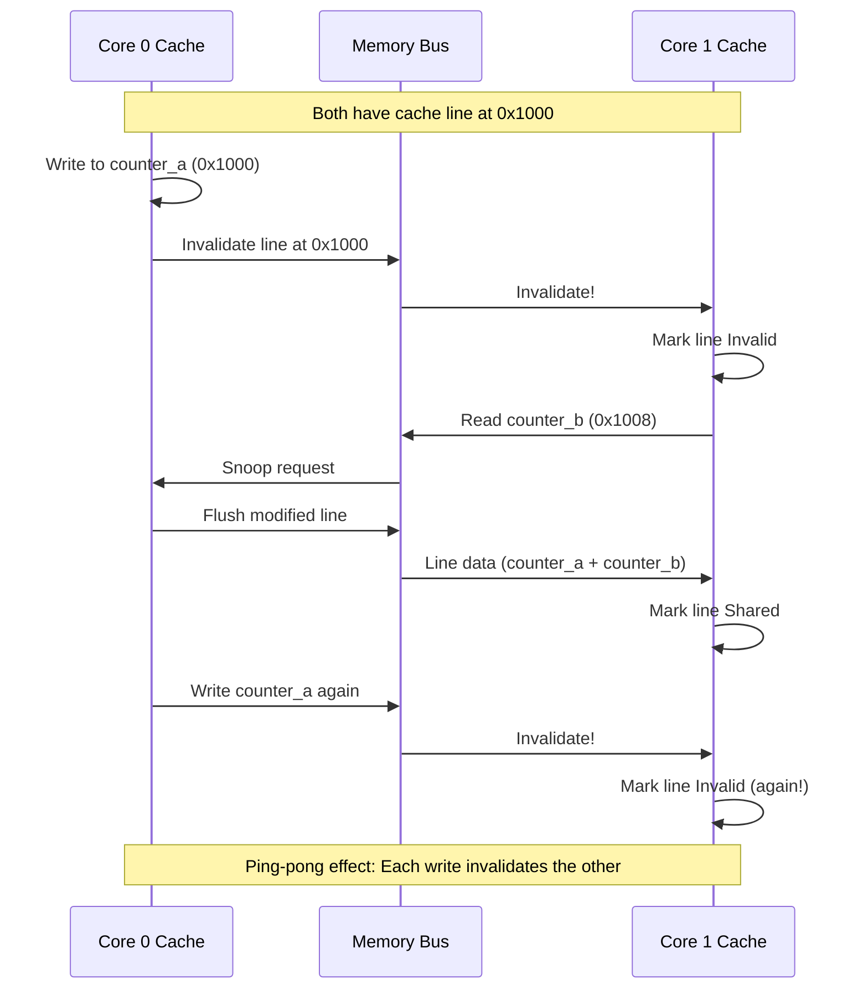
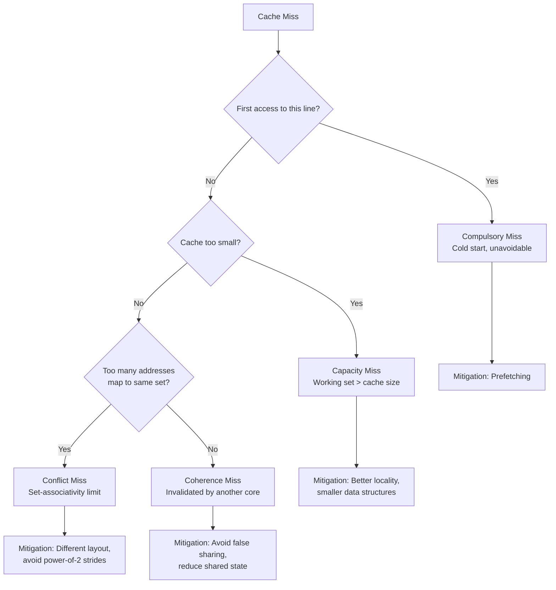
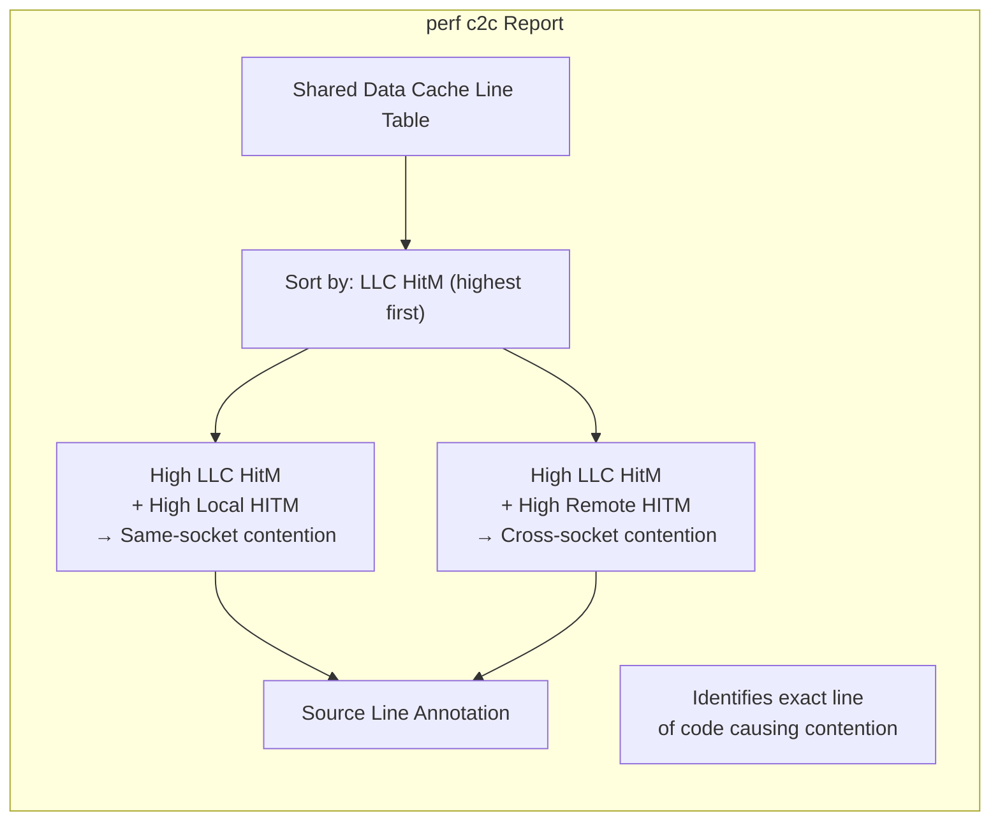

# Chapter 240: Cache Optimization — perf c2c, cachegrind, cache line bouncing, false sharing

## 1. Intuition

Cache optimization is the practice of organizing data and code to maximize the effectiveness of CPU caches. In modern processors, the difference between a cache hit and a cache miss can be 100× or more in latency. A program that runs entirely from L1 cache might complete in milliseconds, while the same program with constant cache misses might take seconds or even minutes.

The fundamental principle is simple: **make the most frequently accessed data fit in the fastest available cache**. But achieving this in practice requires understanding cache hierarchies, cache coherence protocols, and the subtle ways that data layout and access patterns interact with hardware.

### The Cache Hierarchy

```
┌─────────────────────────────────────────────────────────┐
│  CPU Core 0                    CPU Core 1               │
│  ┌──────────────┐             ┌──────────────┐          │
│  │ L1 Data Cache│             │ L1 Data Cache│          │
│  │ 32 KB, 8-way │             │ 32 KB, 8-way │          │
│  │ ~4 cycles    │             │ ~4 cycles    │          │
│  ├──────────────┤             ├──────────────┤          │
│  │ L1 Inst Cache│             │ L1 Inst Cache│          │
│  │ 32 KB, 8-way │             │ 32 KB, 8-way │          │
│  ├──────────────┤             ├──────────────┤          │
│  │ L2 Cache     │             │ L2 Cache     │          │
│  │ 256 KB, 8-way│             │ 256 KB, 8-way│          │
│  │ ~12 cycles   │             │ ~12 cycles   │          │
│  └──────┬───────┘             └──────┬───────┘          │
│         └──────────────┬─────────────┘                  │
│                ┌───────▼────────┐                       │
│                │ L3 Cache (LLC) │                       │
│                │ 16 MB, 16-way  │                       │
│                │ ~40 cycles     │                       │
│                └───────┬────────┘                       │
│                        │                                │
│                ┌───────▼────────┐                       │
│                │  Main Memory   │                       │
│                │  ~200 cycles   │                       │
│                └────────────────┘                       │
└─────────────────────────────────────────────────────────┘
```

### Cache Line: The Fundamental Unit

Caches don't operate on individual bytes — they operate on **cache lines**, typically 64 bytes on x86-64:

```
┌─────────────────────────────────────────────────────────────┐
│  Cache Line (64 bytes)                                       │
│                                                              │
│  Byte 0-7   │ Byte 8-15  │ Byte 16-23 │ ... │ Byte 56-63  │
│  (8 bytes)  │ (8 bytes)  │ (8 bytes)  │     │ (8 bytes)   │
│                                                              │
│  When ANY byte in this line is accessed:                     │
│  → The ENTIRE 64-byte line is fetched from memory            │
│  → Subsequent accesses to any byte in the line are fast      │
│                                                              │
│  Key implication: Adjacent data that's accessed together     │
│  should be in the same cache line (spatial locality)         │
└─────────────────────────────────────────────────────────────┘
```

### Cache Coherence and False Sharing

In multi-core systems, caches must remain coherent — all cores must see a consistent view of memory. The MESI protocol (Modified, Exclusive, Shared, Invalid) handles this:

```
Core 0 writes to variable A at address 0x1000
     │
     ▼
┌──────────────────────────────────────────────────────────────┐
│  Core 0 Cache           Core 1 Cache                        │
│  ┌─────────────────┐    ┌─────────────────┐                 │
│  │ Line at 0x1000  │    │ Line at 0x1000  │                 │
│  │ State: Modified  │───▶│ State: Invalid  │                 │
│  │ (has new data)   │    │ (must re-fetch) │                 │
│  └─────────────────┘    └─────────────────┘                 │
│                                                              │
│  Core 0's write invalidates Core 1's copy of the            │
│  entire cache line. If Core 1 reads any byte in that        │
│  line, it must fetch the updated line from Core 0's cache.  │
└──────────────────────────────────────────────────────────────┘
```

**False sharing** occurs when two variables that are accessed by different cores happen to reside on the same cache line:

```
Core 0: counter_a++ (address 0x1000)
Core 1: counter_b++ (address 0x1004)

Both are on the same cache line (0x1000-0x103F)!

Core 0 writes counter_a:
  → Invalidates Core 1's copy of entire line
  → Core 1 must re-fetch the line to access counter_b
  → Even though counter_b didn't change!

Core 1 writes counter_b:
  → Invalidates Core 0's copy of entire line
  → Core 0 must re-fetch the line to access counter_a

Result: Ping-pong effect — each write invalidates the other's cache
This can slow a program by 10-100×!
```

### True Sharing vs False Sharing

```
True Sharing (necessary):
  Two cores access the SAME variable
  → Invalidation is necessary for correctness
  → Minimize by reducing shared state

False Sharing (unnecessary):
  Two cores access DIFFERENT variables on the SAME cache line
  → Invalidation is unnecessary but happens anyway
  → Fix by padding or aligning to cache line boundaries
```

## 2. Architecture

### Cache Organization

```
┌─────────────────────────────────────────────────────────────┐
│  Cache Set (one of N sets in a set-associative cache)       │
│                                                              │
│  Way 0        Way 1        Way 2        Way 3               │
│  ┌────────┐  ┌────────┐  ┌────────┐  ┌────────┐           │
│  │ Tag    │  │ Tag    │  │ Tag    │  │ Tag    │           │
│  │ Valid  │  │ Valid  │  │ Valid  │  │ Valid  │           │
│  │ Dirty  │  │ Dirty  │  │ Dirty  │  │ Dirty  │           │
│  │ LRU    │  │ LRU    │  │ LRU    │  │ LRU    │           │
│  │ Data   │  │ Data   │  │ Data   │  │ Data   │           │
│  │ (64B)  │  │ (64B)  │  │ (64B)  │  │ (64B)  │           │
│  └────────┘  └────────┘  └────────┘  └────────┘           │
│                                                              │
│  Address breakdown for 32KB L1, 8-way, 64B lines:          │
│  [Tag (36 bits)] [Set Index (6 bits)] [Offset (6 bits)]    │
│                                                              │
│  64 sets × 8 ways × 64 bytes = 32,768 bytes = 32 KB       │
└─────────────────────────────────────────────────────────────┘
```

### Cache Line States (MESI Protocol)

```
┌──────────────────────────────────────────────────────────────┐
│  MESI States                                                  │
│                                                              │
│  Modified (M):                                               │
│  - Data is dirty (modified, not yet written to memory)       │
│  - Only this cache has the valid copy                        │
│  - Must write back to memory if evicted                      │
│                                                              │
│  Exclusive (E):                                              │
│  - Data is clean (matches memory)                            │
│  - Only this cache has the copy                              │
│  - Can transition to Modified without bus transaction        │
│                                                              │
│  Shared (S):                                                 │
│  - Data is clean (matches memory)                            │
│  - Multiple caches may have copies                           │
│  - Must broadcast write intent to invalidate others          │
│                                                              │
│  Invalid (I):                                                │
│  - Data is not valid                                         │
│  - Must fetch from memory or another cache before use        │
│                                                              │
│  State Transitions:                                          │
│  I → S: Read miss, other caches have it (Shared)            │
│  I → E: Read miss, no other cache has it (Exclusive)        │
│  I → M: Write miss (Modified)                               │
│  S → M: Write hit, broadcast invalidation                   │
│  M → S: Snoop: another core reads (flush to memory)         │
│  E → M: Local write (no bus transaction needed)             │
└──────────────────────────────────────────────────────────────┘
```

### Cache Miss Types

| Type | Description | Cause | Mitigation |
|------|-------------|-------|------------|
| **Compulsory** (cold) | First access to a cache line | Program start, new data | Prefetching |
| **Capacity** | Cache too small for working set | Large data sets | Larger cache, better locality |
| **Conflict** | Too many addresses map to same set | Set-associativity limit | Different data layout |
| **Coherence** | Cache line invalidated by another core | False/true sharing | Avoid sharing, pad data |

## 3. Tools & Techniques

### perf c2c (Cache-to-Cache)

`perf c2c` is specifically designed to detect false sharing and cache contention:

```bash
# Record cache-to-cache events
sudo perf c2c record -a -- sleep 10

# Generate report
sudo perf c2c report --stdio

# Key columns in the report:
# - LLC HitM: L3 cache hit with Modified state (contention indicator)
# - Total records: Total cache events
# - Peer Snp: Peer snoop (cross-core communication)
# - Local HITM: Hit Modified on local L3
# - Remote HITM: Hit Modified on remote L3 (cross-socket, expensive)

# Sort by HITM to find worst contention
sudo perf c2c report --stdio --sort=mem,sym,dso

# Show source code lines with contention
sudo perf c2c report --stdio --sort=src

# Example output:
# =================================================
#            Shared Data Cache Line Table
# =================================================
# #
# Total      LLC     Local   LLC     Off  Symbol + Offset
# Records    HitM    HITM    Load
# ---------- ------- ------- ------- ---- ---------
#    123456  98765   65432   33333   0x00 counter_a+0x00
#     67890  45678   23456   22222   0x40 counter_b+0x00
#
# The first line shows counter_a at offset 0x00 has massive contention
# counter_b at offset 0x40 is on a DIFFERENT cache line (good!)
```

**Interpreting perf c2c output:**

```bash
# Look for:
# 1. High LLC HitM → contention on cache line
# 2. High Local HITM → same-socket contention
# 3. High Remote HITM → cross-socket contention (most expensive)
# 4. Offsets 0x00 and 0x40 on same line → false sharing

# Fix by adding padding:
# struct data {
#     volatile long counter_a;
#     char padding[56];  // Pad to 64-byte boundary
#     volatile long counter_b;
# } __attribute__((aligned(64)));
```

### cachegrind (Valgrind)

Cachegrind simulates cache behavior and provides detailed hit/miss statistics:

```bash
# Run with cachegrind
valgrind --tool=cachegrind ./my_program

# Output:
# ==12345== I   refs:      1,234,567,890
# ==12345== I1  misses:       12,345,678
# ==12345== LLi misses:          234,567
# ==12345==
# ==12345== D   refs:        567,890,123  (345,678,901 rd + 222,211,222 wr)
# ==12345== D1  misses:       34,567,890  ( 23,456,789 rd +  11,111,101 wr)
# ==12345== LLd misses:        5,678,901  (  3,456,789 rd +   2,222,112 wr)
# ==12345==
# ==12345== LL refs:          46,913,568  ( 35,802,467 rd +  11,111,101 wr)
# ==12345== LL misses:         5,913,468  (  3,691,356 rd +   2,222,112 wr)

# Customize cache parameters
valgrind --tool=cachegrind \
    --I1=32768,8,64 \    # L1i: 32KB, 8-way, 64B lines
    --D1=32768,8,64 \    # L1d: 32KB, 8-way, 64B lines
    --LL=16777216,16,64 \ # LLC: 16MB, 16-way, 64B lines
    ./my_program

# Annotate with source code
cg_annotate cachegrind.out.12345

# Annotate specific source file
cg_annotate cachegrind.out.12345 --auto=yes src/myfile.c

# Visualize with KCachegrind
kcachegrind cachegrind.out.12345

# Compare two profiles
cg_diff cachegrind.out.before cachegrind.out.after
```

### perf stat for Cache Statistics

```bash
# Quick cache statistics
perf stat -e L1-dcache-load-misses,L1-dcache-loads,LLC-load-misses,LLC-loads ./my_program

# Interpretation:
# L1 miss rate = L1-dcache-load-misses / L1-dcache-loads
# LLC miss rate = LLC-load-misses / LLC-loads
# 
# Good: L1 miss rate < 5%, LLC miss rate < 1%
# Bad: L1 miss rate > 10%, LLC miss rate > 5%

# Detailed cache events
perf stat -e \
    L1-dcache-loads,L1-dcache-load-misses,L1-dcache-stores,L1-dcache-store-misses,\
    L1-icache-load-misses,\
    LLC-loads,LLC-load-misses,LLC-stores,LLC-store-misses,\
    dTLB-load-misses,dTLB-loads,iTLB-load-misses \
    ./my_program

# Per-CPU cache statistics
sudo perf stat -a -e cache-references,cache-misses,cycles,instructions sleep 5
```

### perf mem (Memory Access Profiling)

```bash
# Record memory access events (Intel PEBS)
sudo perf mem record -e ldlat-loads --ldlat 30 -- ./my_program

# Report memory access patterns
sudo perf mem report --stdio

# Sort by latency
sudo perf mem report --sort=mem,sym,dso --stdio

# TUI mode
sudo perf mem report
```

### BPF-based Cache Monitoring

```bash
# Monitor cache line bouncing
sudo bpftrace -e '
hardware:cache-misses:1000001 {
    @[kstack] = count();
}'

# Monitor false sharing patterns
sudo bpftrace -e '
kmem:kmalloc {
    @[kstack, args->bytes] = count();
}

# Count cache misses per function
perf stat -e cache-misses -a -- sleep 1
```

### Additional Cache Tools

```bash
# likwid (LIKWID - Like I Knew What I'm Doing)
# Install: sudo apt install likwid

# Cache bandwidth benchmark
likwid-bench -t copy -w S0:100MB:1

# Cache hierarchy test
likwid-bench -t load -w S0:32KB:1    # L1
likwid-bench -t load -w S0:256KB:1   # L2
likwid-bench -t load -w S0:16MB:1    # L3
likwid-bench -t load -w S0:256MB:1   # Main memory

# Cache statistics with LIKWID
likwid-perfctr -g CACHE -C 0 ./my_program

# Intel Memory Latency Checker (MLC)
# Download from Intel
./mlc --latency_matrix
./mlc --bandwidth_matrix
./mlc --loaded_latency -W1 -d0

# AMD uProf cache analysis
AMDuProf collect -e data-access ./my_program
```

## 4. Source Code References

### Linux Kernel Cache Management

```
arch/x86/include/asm/cache.h     — Cache line size definitions
arch/x86/include/asm/cacheflush.h — Cache flush operations
mm/vmscan.c                      — Page reclaim (affects cache)
kernel/sched/core.c              — Scheduler (affects cache affinity)
```

### Cache Line Size Definition

```c
// arch/x86/include/asm/cache.h
#define L1_CACHE_SHIFT  6
#define L1_CACHE_BYTES  (1 << L1_CACHE_SHIFT)  // 64 bytes

// include/linux/cache.h
#define __cacheline_aligned __attribute__((__aligned__(L1_CACHE_BYTES)))
#define __cacheline_aligned_in_smp __cacheline_aligned
#define ____cacheline_aligned __attribute__((__aligned__(SMP_CACHE_BYTES)))
```

### perf c2c Implementation

```
tools/perf/util/c2c.c          — perf c2c main logic
tools/perf/util/mem-events.c   — Memory event handling
tools/perf/util/hist.c         — Histogram generation
```

### Valgrind Cachegrind

```
cachegrind/cg_main.c           — Cachegrind tool entry point
cachegrind/cg_sim.c            — Cache simulation
cachegrind/cg_annotate.c       — Annotation tool
```

## 5. Examples

### Example 1: Detecting False Sharing

```c
// false_sharing.c — Demonstration of false sharing
#include <stdio.h>
#include <pthread.h>
#include <time.h>

#define ITERATIONS 100000000L

// BAD: Both counters on the same cache line
struct {
    volatile long counter_a;
    volatile long counter_b;
} shared_bad;

// GOOD: Counters on separate cache lines
struct {
    volatile long counter_a;
    char padding[56];  // Pad to 64-byte boundary
    volatile long counter_b;
} __attribute__((aligned(64))) shared_good;

// Alternative: Use separate cache-line-aligned structs
struct {
    volatile long counter_a;
} __attribute__((aligned(64))) separate_a;

struct {
    volatile long counter_b;
} __attribute__((aligned(64))) separate_b;

void *thread_a(void *arg) {
    volatile long *counter = (volatile long *)arg;
    for (long i = 0; i < ITERATIONS; i++) {
        (*counter)++;
    }
    return NULL;
}

void *thread_b(void *arg) {
    volatile long *counter = (volatile long *)arg;
    for (long i = 0; i < ITERATIONS; i++) {
        (*counter)++;
    }
    return NULL;
}

int main() {
    pthread_t t1, t2;
    struct timespec start, end;
    
    // Test with false sharing
    clock_gettime(CLOCK_MONOTONIC, &start);
    pthread_create(&t1, NULL, thread_a, &shared_bad.counter_a);
    pthread_create(&t2, NULL, thread_b, &shared_bad.counter_b);
    pthread_join(t1, NULL);
    pthread_join(t2, NULL);
    clock_gettime(CLOCK_MONOTONIC, &end);
    printf("False sharing: %.3f seconds\n",
           (end.tv_sec - start.tv_sec) + (end.tv_nsec - start.tv_nsec) / 1e9);
    
    // Test with padding
    clock_gettime(CLOCK_MONOTONIC, &start);
    pthread_create(&t1, NULL, thread_a, &shared_good.counter_a);
    pthread_create(&t2, NULL, thread_b, &shared_good.counter_b);
    pthread_join(t1, NULL);
    pthread_join(t2, NULL);
    clock_gettime(CLOCK_MONOTONIC, &end);
    printf("No false sharing: %.3f seconds\n",
           (end.tv_sec - start.tv_sec) + (end.tv_nsec - start.tv_nsec) / 1e9);
    
    return 0;
}
// Compile: gcc -O2 -pthread -o false_sharing false_sharing.c
```

### Example 2: Cache-Friendly Data Layout

```c
// cache_layout.c — Compare AoS vs SoA layouts
#include <stdio.h>
#include <stdlib.h>
#include <time.h>

#define N 1000000

// Array of Structures (AoS) — cache-unfriendly for partial access
struct PointAoS {
    double x, y, z;
    double r, g, b;  // Color (not always needed)
};

// Structure of Arrays (SoA) — cache-friendly for partial access
struct PointSoA {
    double *x, *y, *z;
    double *r, *g, *b;
};

void sum_aos(struct PointAoS *points, int n, double *sum_x, double *sum_y, double *sum_z) {
    *sum_x = *sum_y = *sum_z = 0;
    for (int i = 0; i < n; i++) {
        *sum_x += points[i].x;  // Accesses x, then skips y,z,r,g,b
        *sum_y += points[i].y;  // Accesses y, then skips z,r,g,b,x
        *sum_z += points[i].z;  // Accesses z, then skips r,g,b,x,y
    }
}

void sum_soa(struct PointSoA *points, int n, double *sum_x, double *sum_y, double *sum_z) {
    *sum_x = *sum_y = *sum_z = 0;
    for (int i = 0; i < n; i++) {
        *sum_x += points->x[i];  // Sequential access to x array
        *sum_y += points->y[i];  // Sequential access to y array
        *sum_z += points->z[i];  // Sequential access to z array
    }
}

int main() {
    struct timespec start, end;
    
    // AoS layout
    struct PointAoS *aos = malloc(N * sizeof(struct PointAoS));
    for (int i = 0; i < N; i++) {
        aos[i].x = i; aos[i].y = i+1; aos[i].z = i+2;
        aos[i].r = 0; aos[i].g = 0; aos[i].b = 0;
    }
    
    clock_gettime(CLOCK_MONOTONIC, &start);
    double sx, sy, sz;
    sum_aos(aos, N, &sx, &sy, &sz);
    clock_gettime(CLOCK_MONOTONIC, &end);
    printf("AoS: %.3f ms (sum=%f)\n",
           (end.tv_sec - start.tv_sec) * 1000 + (end.tv_nsec - start.tv_nsec) / 1e6, sx);
    
    // SoA layout
    struct PointSoA soa;
    soa.x = malloc(N * sizeof(double));
    soa.y = malloc(N * sizeof(double));
    soa.z = malloc(N * sizeof(double));
    soa.r = malloc(N * sizeof(double));
    soa.g = malloc(N * sizeof(double));
    soa.b = malloc(N * sizeof(double));
    for (int i = 0; i < N; i++) {
        soa.x[i] = i; soa.y[i] = i+1; soa.z[i] = i+2;
        soa.r[i] = 0; soa.g[i] = 0; soa.b[i] = 0;
    }
    
    clock_gettime(CLOCK_MONOTONIC, &start);
    sum_soa(&soa, N, &sx, &sy, &sz);
    clock_gettime(CLOCK_MONOTONIC, &end);
    printf("SoA: %.3f ms (sum=%f)\n",
           (end.tv_sec - start.tv_sec) * 1000 + (end.tv_nsec - start.tv_nsec) / 1e6, sx);
    
    return 0;
}
// Compile: gcc -O2 -o cache_layout cache_layout.c
```

### Example 3: Detecting Cache Misses with perf

```bash
# Profile cache behavior
perf stat -e L1-dcache-load-misses,L1-dcache-loads,LLC-load-misses,LLC-loads ./cache_layout

# Generate cache profile with cachegrind
valgrind --tool=cachegrind ./cache_layout
cg_annotate cachegrind.out.* --auto=yes

# Find hot cache lines
perf c2c record -a -- ./cache_layout
perf c2c report --stdio --sort=mem
```

### Example 4: Prefetching for Cache Optimization

```c
// prefetch.c — Using prefetch hints
#include <stdio.h>
#include <stdlib.h>
#include <x86intrin.h>

#define N 10000000
#define STRIDE 16

void process_array_no_prefetch(int *arr, int n) {
    long sum = 0;
    for (int i = 0; i < n; i += STRIDE) {
        sum += arr[i];
    }
}

void process_array_with_prefetch(int *arr, int n) {
    long sum = 0;
    for (int i = 0; i < n; i += STRIDE) {
        // Prefetch cache lines we'll need soon
        if (i + 64 < n) {
            _mm_prefetch((const char *)&arr[i + 64], _MM_HINT_T0);
        }
        sum += arr[i];
    }
}

int main() {
    int *arr = malloc(N * sizeof(int));
    for (int i = 0; i < N; i++) arr[i] = i;
    
    struct timespec start, end;
    
    clock_gettime(CLOCK_MONOTONIC, &start);
    process_array_no_prefetch(arr, N);
    clock_gettime(CLOCK_MONOTONIC, &end);
    printf("No prefetch: %.3f ms\n",
           (end.tv_sec - start.tv_sec) * 1000 + (end.tv_nsec - start.tv_nsec) / 1e6);
    
    clock_gettime(CLOCK_MONOTONIC, &start);
    process_array_with_prefetch(arr, N);
    clock_gettime(CLOCK_MONOTONIC, &end);
    printf("With prefetch: %.3f ms\n",
           (end.tv_sec - start.tv_sec) * 1000 + (end.tv_nsec - start.tv_nsec) / 1e6);
    
    free(arr);
    return 0;
}
```

### Example 5: Cache-Aware Data Structure Design

```c
// cache_aware_list.c — Cache-friendly linked list
#include <stdio.h>
#include <stdlib.h>
#include <string.h>

#define CACHE_LINE_SIZE 64
#define NODES_PER_BLOCK 7  // (64 - 8) / 8 = 7 nodes per cache line block

// Traditional linked list — one node per allocation
struct ListNode {
    int data;
    struct ListNode *next;
};

// Cache-friendly block list — multiple nodes per cache-line-sized block
struct ListBlock {
    int count;
    struct ListBlock *next;
    int data[NODES_PER_BLOCK];
};

struct BlockList {
    struct ListBlock *head;
    struct ListBlock *tail;
    int total;
};

void block_list_init(struct BlockList *list) {
    list->head = list->tail = NULL;
    list->total = 0;
}

void block_list_add(struct BlockList *list, int value) {
    if (!list->tail || list->tail->count >= NODES_PER_BLOCK) {
        struct ListBlock *block = aligned_alloc(CACHE_LINE_SIZE, CACHE_LINE_SIZE);
        block->count = 0;
        block->next = NULL;
        if (list->tail) list->tail->next = block;
        else list->head = block;
        list->tail = block;
    }
    list->tail->data[list->tail->count++] = value;
    list->total++;
}

int main() {
    struct BlockList list;
    block_list_init(&list);
    
    // Add 1 million elements
    for (int i = 0; i < 1000000; i++) {
        block_list_add(&list, i);
    }
    
    // Traverse — each cache line fetch gives us 7 elements
    long sum = 0;
    int count = 0;
    for (struct ListBlock *b = list.head; b; b = b->next) {
        for (int i = 0; i < b->count; i++) {
            sum += b->data[i];
            count++;
        }
    }
    
    printf("Sum: %ld, Count: %d\n", sum, count);
    printf("Blocks: %d (vs %d traditional nodes)\n",
           (1000000 + NODES_PER_BLOCK - 1) / NODES_PER_BLOCK, 1000000);
    printf("Cache line fetches: ~%d (vs ~1000000 traditional)\n",
           (1000000 + NODES_PER_BLOCK - 1) / NODES_PER_BLOCK);
    
    return 0;
}
```

## 6. Diagrams

### Cache Line Bouncing (False Sharing)



### Cache Miss Classification



### perf c2c Report Interpretation



## 7. Common Pitfalls

### 1. Assuming Cache Line Size is Always 64

```bash
# Problem: Code assumes 64-byte cache lines
# Some ARM processors use 32-byte or 128-byte lines

# Solution: Query or define cache line size
# Linux:
getconf LEVEL1_DCACHE_LINESIZE
# Or use sysconf:
# sysconf(_SC_LEVEL1_DCACHE_LINESIZE)

# In C:
#include <unistd.h>
long cache_line_size = sysconf(_SC_LEVEL1_DCACHE_LINESIZE);

# Or define conservatively:
#define CACHE_LINE_SIZE 128  // Works for all current architectures
```

### 2. Padding All Structs

```bash
# Problem: Padding every struct wastes memory
# Not every struct has false sharing issues

# Solution: Only pad structs that are:
# 1. Accessed by multiple threads
# 2. Modified frequently
# 3. On the same cache line

# Don't pad:
struct point { int x, y, z; };  // Single-threaded, no need

# Do pad:
struct thread_counters {
    long local_count;
    char padding[56];
} __attribute__((aligned(64)));
```

### 3. Using volatile Instead of Proper Synchronization

```c
// Problem: Using volatile for synchronization
volatile long shared_counter;  // volatile doesn't prevent false sharing!

// Solution: Use atomics or proper locks
#include <stdatomic.h>
atomic_long shared_counter;  // Atomic operations

// For false sharing, pad with atomics:
struct {
    atomic_long counter;
    char padding[56];
} __attribute__((aligned(64)));
```

### 4. Ignoring Instruction Cache

```bash
# Problem: Data cache is optimized, but instruction cache thrashes
# Large code with poor locality causes i-cache misses

# Solution: Profile instruction cache too
perf stat -e L1-icache-load-misses,L1-icache-loads ./my_program

# Reduce code size:
# - Use -Os (optimize for size) for hot code paths
# - Use link-time optimization (LTO) to remove dead code
# - Use -ffunction-sections and --gc-sections
gcc -ffunction-sections -fdata-sections -o my_program my_program.c
ld --gc-sections -o my_program my_program.o
```

### 5. Misunderstanding Hardware Prefetching

```bash
# Problem: Hardware prefetcher handles sequential access automatically
# Manual prefetching for sequential access is redundant and may hurt

# Solution: Use manual prefetching only for:
# - Linked lists (pointer-chasing)
# - Sparse/random access patterns
# - Access patterns the hardware can't predict

# Don't prefetch for:
# - Sequential array traversal (hardware does this)
# - Small arrays that fit in cache
# - Patterns already handled by stride prefetcher
```

### 6. Cache Thrashing from Large Working Sets

```bash
# Problem: Working set larger than LLC causes constant evictions
# Performance degrades as data set grows

# Solution:
# 1. Reduce working set size
# 2. Process data in blocks that fit in cache
# 3. Use cache-oblivious algorithms

# Example: Matrix multiplication
# Naive: O(n^3) cache misses for large matrices
# Blocked: O(n^3 / B) cache misses (B = cache line size)
for (int i0 = 0; i0 < N; i0 += BLOCK)
    for (int j0 = 0; j0 < N; j0 += BLOCK)
        for (int k0 = 0; k0 < N; k0 += BLOCK)
            for (int i = i0; i < min(i0+BLOCK, N); i++)
                for (int j = j0; j < min(j0+BLOCK, N); j++)
                    for (int k = k0; k < min(k0+BLOCK, N); k++)
                        C[i][j] += A[i][k] * B[k][j];
```

### 7. Not Measuring Before Optimizing

```bash
# Problem: Adding cache optimizations without measuring
# The bottleneck might be elsewhere (I/O, network, algorithm)

# Solution: Always profile first
perf stat -e cache-misses,cache-references,cycles,instructions ./my_program

# Only optimize cache if:
# - Cache miss rate > 5%
# - Significant time spent on memory stalls
# - IPC < 1.0 (likely memory-bound)
```

## 8. Best Practices

### 1. Profile Cache Behavior First

```bash
# Quick cache assessment
perf stat -e L1-dcache-load-misses,L1-dcache-loads,LLC-load-misses,LLC-loads ./my_program

# Detailed cache analysis with cachegrind
valgrind --tool=cachegrind ./my_program
cg_annotate cachegrind.out.* --auto=yes

# False sharing detection
sudo perf c2c record -a -- ./my_program
sudo perf c2c report --stdio
```

### 2. Use Cache-Friendly Data Structures

```c
// Prefer arrays over linked lists for sequential access
int array[N];          // Cache-friendly: sequential memory
struct node *list;     // Cache-unfriendly: scattered memory

// Use SoA (Structure of Arrays) instead of AoS (Array of Structures)
// When accessing only some fields frequently
struct SoA {
    float *x, *y, *z;  // Separate arrays
};
// vs
struct AoS {
    float x, y, z;     // Interleaved
} points[N];

// Use intrusive data structures when possible
struct cache_friendly_node {
    struct list_head list;  // Embedded list node
    int data;
};
```

### 3. Align Hot Data to Cache Lines

```c
// Align frequently accessed data structures
struct __attribute__((aligned(64))) hot_data {
    atomic_long counter;
    int flags;
    void *pointer;
};

// Allocate aligned memory
void *ptr = aligned_alloc(64, size);

// Use compiler macros for alignment
#define CACHE_ALIGNED __attribute__((aligned(64)))
CACHE_ALIGNED struct my_data { ... };
```

### 4. Avoid False Sharing in Multi-Threaded Code

```c
// BAD: Shared array accessed by different threads
long counters[NUM_THREADS];  // Adjacent in memory

// GOOD: Padded array
struct {
    long value;
    char padding[56];
} __attribute__((aligned(64))) counters[NUM_THREADS];

// Alternative: Use thread-local storage
__thread long local_counter;

// Alternative: Per-CPU allocation
long *counters = calloc(num_cpus, CACHE_LINE_SIZE);
```

### 5. Use Blocking for Cache Efficiency

```c
// Process data in blocks that fit in cache
#define BLOCK_SIZE 1024  // Fits in L1 cache (4KB = 1024 ints)

void process_blocked(int *data, int n) {
    for (int i = 0; i < n; i += BLOCK_SIZE) {
        int end = (i + BLOCK_SIZE < n) ? i + BLOCK_SIZE : n;
        for (int j = i; j < end; j++) {
            // Process data[j]
            data[j] *= 2;
        }
    }
}
```

### 6. Monitor Cache Performance in Production

```bash
# Set up cache miss monitoring
# Prometheus + node_exporter exposes:
# node_cpu_cache_misses_total
# node_cpu_cache_references_total

# Alert on high cache miss rate
# rate(node_cpu_cache_misses_total[5m]) / rate(node_cpu_cache_references_total[5m]) > 0.05
```

## 9. Exercises

### Exercise 1: False Sharing Detection
```bash
# Compile and run the false sharing example
gcc -O2 -pthread -o false_sharing false_sharing.c
./false_sharing

# Profile with perf c2c
sudo perf c2c record -a -- ./false_sharing
sudo perf c2c report --stdio

# Questions:
# 1. What is the performance difference between padded and unpadded?
# 2. Which cache lines show contention in perf c2c?
# 3. How many LLC HitM events are there?
```

### Exercise 2: Cache-Friendly vs Cache-Unfriendly Access
```bash
# Compare AoS and SoA access patterns
gcc -O2 -o cache_layout cache_layout.c
./cache_layout

# Profile with cachegrind
valgrind --tool=cachegrind ./cache_layout
cg_annotate cachegrind.out.* --auto=yes

# Questions:
# 1. What is the L1 miss rate for AoS vs SoA?
# 2. What is the LLC miss rate for each?
# 3. How much faster is SoA?
```

### Exercise 3: Cache Line Analysis
```bash
# Find the cache line size on your system
getconf LEVEL1_DCACHE_LINESIZE
cat /sys/devices/system/cpu/cpu0/cache/index0/coherency_line_size

# Profile a program with different strides
cat > stride_test.c << 'EOF'
#include <stdio.h>
#include <stdlib.h>
#include <time.h>
#define N 10000000
int main() {
    int *arr = malloc(N * sizeof(int));
    for (int i = 0; i < N; i++) arr[i] = i;
    struct timespec start, end;
    long sum = 0;
    for (int stride = 1; stride <= 1024; stride *= 2) {
        clock_gettime(CLOCK_MONOTONIC, &start);
        for (int i = 0; i < N; i += stride) sum += arr[i];
        clock_gettime(CLOCK_MONOTONIC, &end);
        double ms = (end.tv_sec - start.tv_sec) * 1000.0 + (end.tv_nsec - start.tv_nsec) / 1e6;
        printf("Stride %4d: %.3f ms\n", stride, ms);
    }
    free(arr);
    return 0;
}
EOF
gcc -O2 -o stride_test stride_test.c
./stride_test

# Questions:
# 1. At what stride does performance degrade significantly?
# 2. How does this relate to cache line size?
# 3. What happens at stride = cache_line_size / sizeof(int)?
```

### Exercise 4: Prefetch Effectiveness
```bash
# Compare prefetch vs no-prefetch
gcc -O2 -o prefetch prefetch.c
./prefetch

# Profile cache misses
perf stat -e L1-dcache-load-misses,L1-dcache-loads ./prefetch

# Questions:
# 1. Does prefetching help for sequential access?
# 2. When would prefetching be most beneficial?
# 3. What is the overhead of prefetch instructions?
```

### Exercise 5: Real-World Cache Optimization
```bash
# Profile a real application's cache behavior
perf stat -e L1-dcache-load-misses,L1-dcache-loads,LLC-load-misses,LLC-loads ./myapp

# If cache miss rate is high:
# 1. Use cachegrind to find hot functions
valgrind --tool=cachegrind ./myapp
cg_annotate cachegrind.out.* --auto=yes

# 2. Use perf c2c to find false sharing
sudo perf c2c record -a -- ./myapp
sudo perf c2c report --stdio

# 3. Apply optimizations and re-measure
# Questions:
# 1. What is the current cache miss rate?
# 2. Which functions have the most cache misses?
# 3. Are there any false sharing issues?
```

## 10. References

1. **Intel Optimization Manual**: https://www.intel.com/content/www/us/en/developer/articles/technical/intel-sdm.html
2. **Agner Fog - Optimization Manuals**: https://www.agner.org/optimize/
3. **Brendan Gregg - perf c2c**: https://www.brendangregg.com/perf.html
4. **Cachegrind Manual**: https://valgrind.org/docs/manual/cg-manual.html
5. **LIKWID Performance Tools**: https://github.com/RRZE-HPC/likwid
6. **Intel MLC (Memory Latency Checker)**: https://software.intel.com/content/www/us/en/develop/articles/intelr-memory-latency-checker.html
7. **"What Every Programmer Should Know About Memory" by Ulrich Drepper**: https://people.freebsd.org/~lstewart/articles/cpumemory.pdf
8. **"Systems Performance" by Brendan Gregg**: Chapter 6 - CPU Analysis Methodology
9. **Herlihy & Shavit - "The Art of Multiprocessor Programming"**: Chapter on cache coherence
10. **Linux kernel cache documentation**: https://www.kernel.org/doc/html/latest/
