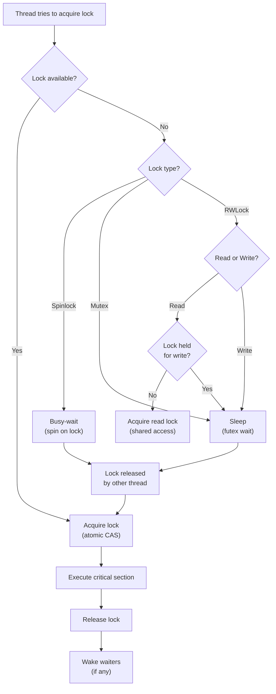
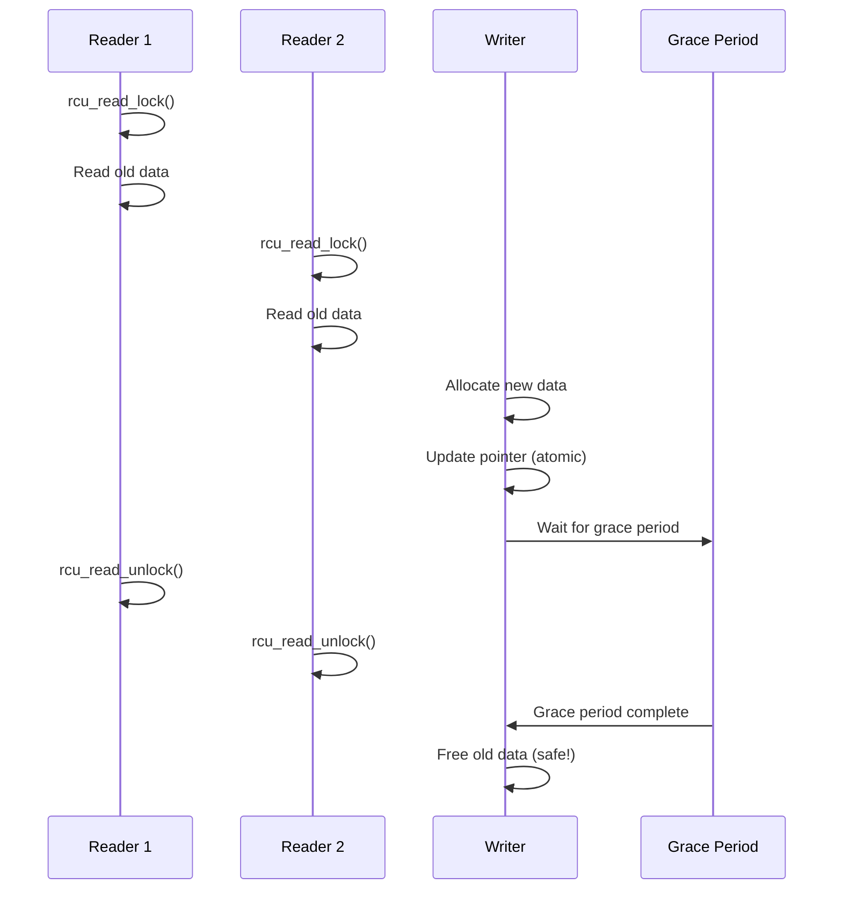
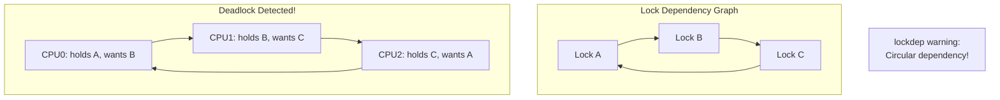

# Chapter 241: Lock Contention Analysis — perf lock, lockdep, BPF lock tracing, rwlock vs rcu

## 1. Intuition

Lock contention is one of the most pervasive and damaging performance problems in multi-threaded systems. When multiple threads compete for the same lock, they serialize — turning parallel code into sequential code. The result is that adding more CPUs makes the program *slower*, not faster. Understanding and mitigating lock contention is essential for building scalable multi-threaded applications.

### The Lock Contention Problem

Consider a simple counter increment protected by a mutex:

```
Thread 1:  lock(counter_mutex) → counter++ → unlock(counter_mutex)
Thread 2:  lock(counter_mutex) → [BLOCKED] → counter++ → unlock(counter_mutex)
Thread 3:  lock(counter_mutex) → [BLOCKED] → [BLOCKED] → counter++ → unlock(counter_mutex)
```

With 3 threads, the effective throughput is 1× (serial), not 3× (parallel). The lock creates a **serialization point** — the more threads you add, the more time they spend waiting, and the less useful work gets done.

### Amdahl's Law and Lock Contention

Amdahl's Law states that the maximum speedup of a program is limited by its serial portion:

```
Speedup = 1 / (S + P/N)

Where:
S = Serial fraction (lock-protected code)
P = Parallel fraction (1 - S)
N = Number of processors
```

If 10% of execution time is spent in a contended lock:

| Threads | Speedup | Efficiency |
|---------|---------|------------|
| 1 | 1.0× | 100% |
| 2 | 1.82× | 91% |
| 4 | 3.08× | 77% |
| 8 | 4.71× | 59% |
| 16 | 6.06× | 38% |
| 64 | 7.32× | 11% |

Even 10% serialization limits maximum speedup to 10×, regardless of how many CPUs you have.

### Types of Synchronization Primitives

| Primitive | Use Case | Overhead | Scalability |
|-----------|----------|----------|-------------|
| **Spinlock** | Very short critical sections | Low (if uncontended) | Poor under contention |
| **Mutex** | General-purpose locking | Medium | Moderate |
| **RWLock** | Read-heavy workloads | Medium | Good for reads |
| **RCU** | Read-mostly workloads | Very low reads | Excellent for reads |
| **Seqlock** | Read-mostly, tolerance for retries | Very low reads | Excellent for reads |
| **Atomic ops** | Simple counters/flags | Very low | Excellent (lock-free) |

### The Lock Contention Spectrum

```
No Contention          Low Contention         High Contention        Severe Contention
─────────────────────────────────────────────────────────────────────────────────────
Thread 1: [WORK]       Thread 1: [WORK]       Thread 1: [WORK]       Thread 1: [WORK]
Thread 2: [WORK]       Thread 2: [WORK]  [W]  Thread 2: [W][WORK]    Thread 2: [W][W][W]
Thread 3: [WORK]       Thread 3: [WORK]       Thread 3: [W][WORK]    Thread 3: [W][W][W]
Thread 4: [WORK]       Thread 4: [WORK]       Thread 4: [W][WORK]    Thread 4: [W][W][W]

Efficiency: ~100%      Efficiency: ~90%       Efficiency: ~50%       Efficiency: ~25%
```

## 2. Architecture

### Linux Locking Primitives

```
┌──────────────────────────────────────────────────────────────────┐
│  User-Space Locks                                                │
│                                                                  │
│  ┌──────────────────┐  ┌──────────────────┐  ┌───────────────┐ │
│  │ pthread_mutex_t  │  │ pthread_rwlock_t │  │ atomic ops    │ │
│  │ (futex-based)    │  │ (futex-based)    │  │ (lock-free)   │ │
│  └────────┬─────────┘  └────────┬─────────┘  └───────────────┘ │
│           │                      │                               │
│           └──────────┬───────────┘                               │
│                      ▼                                           │
│  ┌────────────────────────────────────────────────────────────┐  │
│  │  Futex (Fast Userspace Mutex)                              │  │
│  │  Uncontended: Pure userspace atomic operation              │  │
│  │  Contended: Falls back to kernel futex() syscall           │  │
│  └────────────────────────────────────────────────────────────┘  │
└──────────────────────────────────────────────────────────────────┘
                      │
                      ▼
┌──────────────────────────────────────────────────────────────────┐
│  Kernel-Space Locks                                              │
│                                                                  │
│  ┌──────────────┐  ┌──────────────┐  ┌──────────────────────┐  │
│  │ spinlock_t   │  │ mutex        │  │ RCU (Read-Copy-      │  │
│  │ (busy-wait)  │  │ (sleep)      │  │ Update)              │  │
│  └──────────────┘  └──────────────┘  └──────────────────────┘  │
│  ┌──────────────┐  ┌──────────────┐  ┌──────────────────────┐  │
│  │ rwlock_t     │  │ seqlock      │  │ percpu_ref            │  │
│  │ (reader-     │  │ (retry-      │  │ (per-CPU reference    │  │
│  │  writer)     │  │  based)      │  │  counting)            │  │
│  └──────────────┘  └──────────────┘  └──────────────────────┘  │
└──────────────────────────────────────────────────────────────────┘
```

### Futex Architecture

```
┌──────────────────────────────────────────────────────────────────┐
│  Futex (Fast Userspace Mutex)                                    │
│                                                                  │
│  Uncontended Path (fast):                                        │
│  ┌─────────┐    atomic_cmpxchg()    ┌─────────┐                │
│  │ Thread  │ ──────────────────────▶│ Lock    │                │
│  │         │    (userspace only)     │ acquired│                │
│  └─────────┘                         └─────────┘                │
│  Latency: ~25 ns                                                 │
│                                                                  │
│  Contended Path (slow):                                          │
│  ┌─────────┐    atomic_cmpxchg()    ┌─────────┐                │
│  │ Thread  │ ──────────────────────▶│ Lock    │                │
│  │         │    (fails)             │ held by │                │
│  └────┬────┘                         │ another │                │
│       │                              └─────────┘                │
│       ▼                                                          │
│  ┌─────────┐    futex(FUTEX_WAIT)   ┌─────────┐                │
│  │ Thread  │ ──────────────────────▶│ Kernel  │                │
│  │ sleeps  │    (syscall)           │ wait    │                │
│  └─────────┘                         └─────────┘                │
│  Latency: ~1-10 μs (syscall overhead)                           │
└──────────────────────────────────────────────────────────────────┘
```

### RCU (Read-Copy-Update) Architecture

```
┌──────────────────────────────────────────────────────────────────┐
│  RCU Read-Side Critical Section                                  │
│                                                                  │
│  Reader 1:  rcu_read_lock() ──── [READ] ──── rcu_read_unlock() │
│  Reader 2:  rcu_read_lock() ──── [READ] ──── rcu_read_unlock() │
│  Reader 3:  rcu_read_lock() ──── [READ] ──── rcu_read_unlock() │
│                                                                  │
│  All readers run concurrently — no locks, no atomics!            │
│                                                                  │
│  Writer:                                                         │
│  1. Allocate new version of data                                │
│  2. Update pointer (atomic)                                     │
│  3. synchronize_rcu() — wait for all existing readers to finish │
│  4. Free old version                                            │
│                                                                  │
│  Timeline:                                                       │
│  Writer: [copy] [update] [───── wait for grace period ─────] [free]│
│  Reader: [───────────────── read old version ──────────────────]│
│  Reader: [───── read ─────]  [─────── read new version ───────]│
└──────────────────────────────────────────────────────────────────┘
```

### Lock Hierarchy and Deadlock Prevention

```
┌──────────────────────────────────────────────────────────────────┐
│  Lock Ordering (prevent deadlock)                                │
│                                                                  │
│  Correct order: A → B → C                                       │
│                                                                  │
│  Thread 1: lock(A) → lock(B) → lock(C)  ✓                      │
│  Thread 2: lock(A) → lock(C)            ✓                      │
│  Thread 3: lock(B) → lock(C)            ✓                      │
│                                                                  │
│  Deadlock:                                                       │
│  Thread 1: lock(A) → lock(B)  ←─────  Thread 2: lock(B) → lock(A)│
│            ┌─────────────────────────────────────┐              │
│            │  Thread 1 holds A, waits for B      │              │
│            │  Thread 2 holds B, waits for A      │              │
│            │  → DEADLOCK                         │              │
│            └─────────────────────────────────────┘              │
└──────────────────────────────────────────────────────────────────┘
```

## 3. Tools & Techniques

### perf lock

`perf lock` analyzes lock contention events:

```bash
# Record lock events
sudo perf lock record -a -- sleep 10

# Report lock contention
sudo perf lock report --stdio

# Output columns:
# Name: Lock name/address
# acquired: Number of acquisitions
# contended: Number of contentions
# total wait: Total time spent waiting
# max wait: Maximum single wait time
# avg wait: Average wait time

# Sort by total wait time
sudo perf lock report --stdio --sort=wait_total

# Show call stacks for contention
sudo perf lock report --stdio -k caller

# Live lock contention view
sudo perf lock contention

# Trace specific lock
sudo perf lock report --stdio --lock-addr=0xffffffff82345678

# Example output:
#              Name    acquired  contended  total wait  max wait  avg wait
#  &rq->__lock      1234567     23456      12345.678ms  45.678ms   0.526ms
#  &ctx->lock        567890      12345     6789.012ms   23.456ms   0.550ms
#  &sb->s_umount      12345        234      567.890ms    12.345ms   2.426ms
```

### lockdep (Lock Dependency Validator)

Lockdep is a kernel debug feature that detects potential deadlocks:

```bash
# Enable lockdep in kernel config
CONFIG_LOCKDEP=y
CONFIG_PROVE_LOCKING=y
CONFIG_DEBUG_LOCK_ALLOC=y

# Or enable at runtime (if compiled as module)
sudo modprobe lockdep

# Check lock dependency warnings
dmesg | grep -i "lockdep\|deadlock\|circular"

# Example lockdep output:
# =============================================
# WARNING: possible circular locking dependency detected
# 5.15.0 #1 Not tainted
# ---------------------------------------------
# stress/12345 is trying to acquire lock:
# ffff888012345678 (&mm->mmap_lock){++++}-{3:3}, at: mmap_read_lock
#
# but task is already holding lock:
# ffff888087654321 (&sb->s_umount){++++}-{3:3}, at: freeze_super
#
# which lock already depends on the new lock.
# ...
# Chain exists of:
#   &mm->mmap_lock --> &sb->s_umount
#
# Possible unsafe locking scenario:
#
#       CPU0                    CPU1
#       ----                    ----
#  lock(&sb->s_umount);
#                               lock(&mm->mmap_lock);
#                               lock(&sb->s_umount);
#  lock(&mm->mmap_lock);
#
#  *** DEADLOCK ***
```

**lockdep features:**
- Detects potential deadlocks (circular dependencies)
- Validates lock ordering
- Tracks lock classes (not individual instances)
- Warns about:
  - Circular dependencies
  - Lock nesting issues
  - Hardirq/softirq safety violations
  - Read/write lock imbalances

### BPF Lock Tracing

BPF tools provide flexible lock contention analysis:

```bash
# Using bcc tools

# Count mutex contention events
sudo bpftrace -e '
tracepoint:lock:contention_begin {
    @start[args->lock] = nsecs;
}
tracepoint:lock:contention_end /@start[args->lock]/ {
    @usecs = hist((nsecs - @start[args->lock]) / 1000);
    delete(@start[args->lock]);
}'

# Trace lock contention by call stack
sudo bpftrace -e '
tracepoint:lock:contention_begin {
    @start[tid] = nsecs;
}
tracepoint:lock:contention_end /@start[tid]/ {
    $dur = nsecs - @start[tid];
    if ($dur > 1000000) {  # > 1ms
        printf("Lock contention: %d us\n", $dur / 1000);
        print(kstack);
    }
    delete(@start[tid]);
}'

# Count lock acquisitions and contentions
sudo bpftrace -e '
tracepoint:lock:contention_begin {
    @contentions[args->lock] = count();
}
tracepoint:lock:contention_end {
    @total_wait[args->lock] = sum(args->duration);
}'

# Using bcc's profile tool for off-CPU analysis
sudo profile-bpfcc -p PID -F 99 | grep -i lock | head -20

# lockstat from /proc
sudo cat /proc/lock_stat
# Shows per-lock contention statistics

# Enable lockstat
echo 1 | sudo tee /proc/sys/kernel/lock_stat

# View lock statistics
sudo cat /proc/lock_stat | head -30
```

### Additional Lock Analysis Tools

```bash
# /proc/lock_stat — Kernel lock statistics
sudo cat /proc/lock_stat
# Columns:
# con-bounces: Number of contentions
# acquisitions: Total acquisitions
# waittime-min/avg/max: Wait time statistics
# acq-bounces: Acquisition bounces
# holdtime-min/avg/max: Hold time statistics

# /proc/locks — Active locks
cat /proc/locks
# Shows all active file locks

# valgrind drd — Thread error detector
valgrind --tool=drd ./my_program

# valgrind helgrind — Thread error detector
valgrind --tool=helgrind ./my_program

# ThreadSanitizer (compile-time)
gcc -fsanitize=thread -g -o my_program my_program.c

# perf sched — Scheduler analysis (shows lock-related delays)
sudo perf sched record -- sleep 10
sudo perf sched latency --stdio
```

## 4. Source Code References

### Kernel Locking Subsystem

```
kernel/locking/mutex.c            — Mutex implementation
kernel/locking/spinlock.c         — Spinlock implementation
kernel/locking/rwsem.c            — Read-write semaphore
kernel/locking/lockdep.c          — Lock dependency validator
kernel/locking/lock_events.h      — Lock event counters
kernel/rcu/                       — RCU implementation
include/linux/mutex.h             — Mutex structures
include/linux/spinlock.h          — Spinlock structures
include/linux/rwlock.h            — RW lock structures
include/linux/rcupdate.h          — RCU API
```

### Futex Implementation

```
kernel/futex/                     — Futex subsystem
kernel/futex/core.c               — Core futex operations
kernel/futex/futex.c              — Futex wait/wake
include/linux/futex.h             — Futex structures
```

### Key Data Structures

```c
// include/linux/mutex.h (simplified)
struct mutex {
    atomic_long_t owner;          // Owner task (or NULL)
    raw_spinlock_t wait_lock;     // Protects wait list
    struct list_head wait_list;   // Waiting tasks
#ifdef CONFIG_DEBUG_MUTEXES
    void *magic;                  // Debug magic
#endif
};

// include/linux/spinlock_types.h (simplified)
typedef struct spinlock {
    union {
        struct raw_spinlock rlock;
#ifdef CONFIG_DEBUG_LOCK_ALLOC
# define LOCK_PADSIZE (offsetof(struct raw_spinlock, dep_map))
        struct {
            u8 __padding[LOCK_PADSIZE];
            struct lockdep_map dep_map;
        };
#endif
    };
} spinlock_t;

// include/linux/rcupdate.h (simplified)
// RCU read-side critical section
static inline void rcu_read_lock(void)
{
    preempt_disable();  // Classic RCU: just disable preemption
    __acquire(RCU);     // Compiler barrier
}

static inline void rcu_read_unlock(void)
{
    __release(RCU);     // Compiler barrier
    preempt_enable();   // Re-enable preemption
}
```

### Lockdep Core

```c
// kernel/locking/lockdep.c (simplified)
struct lock_class {
    struct list_head hash_entry;   // Hash table entry
    struct list_head lock_entry;   // Lock chain entry
    struct list_head dependencies; // Dependency list
    /* ... */
};

struct held_lock {
    struct lock_class *instance;   // Lock class instance
    unsigned int irq_context;      // IRQ context
    u64 waittime_stamp;            // When wait started
    /* ... */
};

// lockdep validates that lock ordering is consistent
// It builds a graph of lock dependencies and checks for cycles
```

## 5. Examples

### Example 1: Detecting Lock Contention with perf

```bash
# Record lock contention for a database server
sudo perf lock record -a -p $(pgrep mysqld) -- sleep 30

# Analyze the results
sudo perf lock report --stdio --sort=wait_total

# Example output:
#               Name     acquired   contended   total wait   max wait   avg wait
#  &buf_pool->mutex     5678901      234567    56789.012ms   123.456ms     0.242ms
#  &trx_sys->mutex      1234567       89012    23456.789ms    89.012ms     0.264ms
#  &lock_sys->mutex      345678       12345     5678.901ms    56.789ms     0.460ms

# Interpretation:
# buf_pool->mutex has highest total wait time — optimize buffer pool
# lock_sys->mutex has highest avg wait — individual waits are long

# Generate flame graph of lock wait times
sudo perf lock report --stdio -k caller | head -50
```

### Example 2: RCU vs Mutex for Read-Heavy Workload

```c
// rcu_vs_mutex.c — Compare RCU and mutex for read-heavy workload
#include <stdio.h>
#include <stdlib.h>
#include <pthread.h>
#include <string.h>
#include <stdatomic.h>
#include <time.h>
#include <unistd.h>

#define NUM_READERS 8
#define NUM_WRITERS 1
#define ITERATIONS 10000000

// Shared data
struct data {
    int value;
    char name[64];
};

// Mutex-protected version
pthread_mutex_t data_mutex = PTHREAD_MUTEX_INITIALIZER;
struct data *mutex_data;

void *mutex_reader(void *arg) {
    for (long i = 0; i < ITERATIONS; i++) {
        pthread_mutex_lock(&data_mutex);
        int val = mutex_data->value;  // Read
        pthread_mutex_unlock(&data_mutex);
        (void)val;
    }
    return NULL;
}

void *mutex_writer(void *arg) {
    for (long i = 0; i < ITERATIONS / 100; i++) {
        pthread_mutex_lock(&data_mutex);
        struct data *new_data = malloc(sizeof(struct data));
        new_data->value = i;
        snprintf(new_data->name, 64, "updated_%ld", i);
        struct data *old = mutex_data;
        mutex_data = new_data;
        pthread_mutex_unlock(&data_mutex);
        free(old);
        usleep(1);  // Simulate write delay
    }
    return NULL;
}

// RCU-like version (using hazard pointers for simplicity)
_Atomic(struct data *) rcu_data;

void *rcu_reader(void *arg) {
    for (long i = 0; i < ITERATIONS; i++) {
        // Read-side: just atomic load (no lock!)
        struct data *p = atomic_load(&rcu_data);
        int val = p->value;
        (void)val;
    }
    return NULL;
}

void *rcu_writer(void *arg) {
    for (long i = 0; i < ITERATIONS / 100; i++) {
        struct data *new_data = malloc(sizeof(struct data));
        new_data->value = i;
        snprintf(new_data->name, 64, "updated_%ld", i);
        struct data *old = atomic_exchange(&rcu_data, new_data);
        usleep(100);  // Grace period (simplified)
        free(old);     // Safe after grace period
    }
    return NULL;
}

int main() {
    struct timespec start, end;
    pthread_t readers[NUM_READERS], writer;
    
    // Test mutex version
    mutex_data = malloc(sizeof(struct data));
    mutex_data->value = 0;
    strcpy(mutex_data->name, "initial");
    
    clock_gettime(CLOCK_MONOTONIC, &start);
    for (int i = 0; i < NUM_READERS; i++)
        pthread_create(&readers[i], NULL, mutex_reader, NULL);
    pthread_create(&writer, NULL, mutex_writer, NULL);
    for (int i = 0; i < NUM_READERS; i++)
        pthread_join(readers[i], NULL);
    pthread_join(writer, NULL);
    clock_gettime(CLOCK_MONOTONIC, &end);
    printf("Mutex: %.3f seconds\n",
           (end.tv_sec - start.tv_sec) + (end.tv_nsec - start.tv_nsec) / 1e9);
    
    // Test RCU version
    struct data *initial = malloc(sizeof(struct data));
    initial->value = 0;
    strcpy(initial->name, "initial");
    atomic_store(&rcu_data, initial);
    
    clock_gettime(CLOCK_MONOTONIC, &start);
    for (int i = 0; i < NUM_READERS; i++)
        pthread_create(&readers[i], NULL, rcu_reader, NULL);
    pthread_create(&writer, NULL, rcu_writer, NULL);
    for (int i = 0; i < NUM_READERS; i++)
        pthread_join(readers[i], NULL);
    pthread_join(writer, NULL);
    clock_gettime(CLOCK_MONOTONIC, &end);
    printf("RCU: %.3f seconds\n",
           (end.tv_sec - start.tv_sec) + (end.tv_nsec - start.tv_nsec) / 1e9);
    
    return 0;
}
// Compile: gcc -O2 -pthread -o rcu_vs_mutex rcu_vs_mutex.c
```

### Example 3: Lock-Free Counter with Atomics

```c
// lockfree_counter.c — Compare mutex, spinlock, and atomic counter
#include <stdio.h>
#include <pthread.h>
#include <stdatomic.h>
#include <time.h>

#define NUM_THREADS 8
#define ITERATIONS 100000000L

// Mutex counter
pthread_mutex_t mutex = PTHREAD_MUTEX_INITIALIZER;
long mutex_counter = 0;

// Atomic counter
atomic_long atomic_counter = 0;

void *mutex_increment(void *arg) {
    for (long i = 0; i < ITERATIONS; i++) {
        pthread_mutex_lock(&mutex);
        mutex_counter++;
        pthread_mutex_unlock(&mutex);
    }
    return NULL;
}

void *atomic_increment(void *arg) {
    for (long i = 0; i < ITERATIONS; i++) {
        atomic_fetch_add(&atomic_counter, 1);
    }
    return NULL;
}

int main() {
    pthread_t threads[NUM_THREADS];
    struct timespec start, end;
    
    // Mutex version
    clock_gettime(CLOCK_MONOTONIC, &start);
    for (int i = 0; i < NUM_THREADS; i++)
        pthread_create(&threads[i], NULL, mutex_increment, NULL);
    for (int i = 0; i < NUM_THREADS; i++)
        pthread_join(threads[i], NULL);
    clock_gettime(CLOCK_MONOTONIC, &end);
    printf("Mutex:   %ld increments in %.3f seconds\n",
           mutex_counter,
           (end.tv_sec - start.tv_sec) + (end.tv_nsec - start.tv_nsec) / 1e9);
    
    // Atomic version
    clock_gettime(CLOCK_MONOTONIC, &start);
    for (int i = 0; i < NUM_THREADS; i++)
        pthread_create(&threads[i], NULL, atomic_increment, NULL);
    for (int i = 0; i < NUM_THREADS; i++)
        pthread_join(threads[i], NULL);
    clock_gettime(CLOCK_MONOTONIC, &end);
    printf("Atomic:  %ld increments in %.3f seconds\n",
           atomic_load(&atomic_counter),
           (end.tv_sec - start.tv_sec) + (end.tv_nsec - start.tv_nsec) / 1e9);
    
    return 0;
}
```

### Example 4: Per-CPU Data (Avoiding Locks Entirely)

```c
// percpu_counter.c — Per-CPU counter eliminates contention
#include <stdio.h>
#include <stdlib.h>
#include <pthread.h>
#include <stdatomic.h>
#include <time.h>
#include <unistd.h>

#define NUM_THREADS 16
#define ITERATIONS 100000000L

// Per-CPU counter array
long percpu_counters[NUM_THREADS] __attribute__((aligned(64)));

long get_total() {
    long total = 0;
    for (int i = 0; i < NUM_THREADS; i++) {
        total += percpu_counters[i];
    }
    return total;
}

void *percpu_increment(void *arg) {
    int cpu = (int)(long)arg;
    for (long i = 0; i < ITERATIONS; i++) {
        percpu_counters[cpu]++;  // No contention!
    }
    return NULL;
}

int main() {
    pthread_t threads[NUM_THREADS];
    struct timespec start, end;
    
    clock_gettime(CLOCK_MONOTONIC, &start);
    for (int i = 0; i < NUM_THREADS; i++)
        pthread_create(&threads[i], NULL, percpu_increment, (void *)(long)i);
    for (int i = 0; i < NUM_THREADS; i++)
        pthread_join(threads[i], NULL);
    clock_gettime(CLOCK_MONOTONIC, &end);
    
    printf("Per-CPU: %ld increments in %.3f seconds\n",
           get_total(),
           (end.tv_sec - start.tv_sec) + (end.tv_nsec - start.tv_nsec) / 1e9);
    
    return 0;
}
```

### Example 5: Analyzing Lock Contention in the Kernel

```bash
# Enable lock statistics
echo 1 | sudo tee /proc/sys/kernel/lock_stat

# Run workload
./my_workload

# View lock statistics
sudo cat /proc/lock_stat | head -40

# Disable when done
echo 0 | sudo tee /proc/sys/kernel/lock_stat

# Analyze with perf
sudo perf lock record -a -- sleep 30
sudo perf lock report --stdio --sort=wait_total

# BPF-based lock latency histogram
sudo bpftrace -e '
tracepoint:lock:contention_begin {
    @start[tid] = nsecs;
}
tracepoint:lock:contention_end /@start[tid]/ {
    @latency_us = hist((nsecs - @start[tid]) / 1000);
    delete(@start[tid]);
}'
```

## 6. Diagrams

### Lock Contention Flow



### RCU Read/Write Protocol



### Lockdep Dependency Graph



## 7. Common Pitfalls

### 1. Holding Locks Too Long

```c
// BAD: Lock held during I/O
pthread_mutex_lock(&mutex);
read(fd, buffer, size);       // I/O can block for milliseconds!
process(buffer);
pthread_mutex_unlock(&mutex);

// GOOD: Release lock before I/O
pthread_mutex_lock(&mutex);
data = copy_protected_data();
pthread_mutex_unlock(&mutex);
read(fd, buffer, size);       // I/O without holding lock
process(buffer);
```

### 2. Using Mutex When Spinlock is Sufficient

```c
// BAD: Mutex for very short critical section
pthread_mutex_lock(&mutex);
counter++;                    // Very fast operation
pthread_mutex_unlock(&mutex);

// GOOD: Atomic for simple operations
atomic_fetch_add(&counter, 1);

// GOOD: Spinlock for short kernel-like critical sections
spin_lock(&lock);
counter++;
spin_unlock(&lock);
```

### 3. Not Considering RCU for Read-Heavy Workloads

```bash
# Problem: RWLock with many readers still has overhead
# Readers must atomically increment reader count
# This causes cache line bouncing between readers

# Solution: Use RCU for read-mostly workloads
# RCU readers: No locks, no atomics, no cache line bouncing
# RCU writers: Pay the cost of grace period waiting
# Rule of thumb: Use RCU if read:write ratio > 10:1
```

### 4. Lock Ordering Violations

```bash
# Problem: Different threads acquire locks in different order
# Thread 1: lock(A) → lock(B)
# Thread 2: lock(B) → lock(A)
# → Potential deadlock!

# Solution: Always acquire locks in the same order
# Define a lock hierarchy and document it
# Use lockdep to detect violations during development
```

### 5. False Sharing in Lock Structures

```c
// BAD: Lock variables on the same cache line
struct {
    pthread_mutex_t lock_a;
    pthread_mutex_t lock_b;  // On same cache line!
} shared;

// GOOD: Pad to separate cache lines
struct {
    pthread_mutex_t lock_a;
    char padding1[64 - sizeof(pthread_mutex_t)];
    pthread_mutex_t lock_b;
    char padding2[64 - sizeof(pthread_mutex_t)];
} __attribute__((aligned(64))) shared;
```

### 6. Over-Optimizing Locks

```bash
# Problem: Spending time optimizing locks when they're not the bottleneck
# Locks might account for < 1% of execution time

# Solution: Profile first!
sudo perf lock record -a -- sleep 10
sudo perf lock report --stdio

# Only optimize locks that appear in the top contention list
# Most applications have 1-3 locks that cause most contention
```

### 7. Using Global Locks Instead of Fine-Grained Locking

```c
// BAD: Global lock for entire data structure
pthread_mutex_t global_lock;
struct hash_table *table;

void insert(int key, int value) {
    pthread_mutex_lock(&global_lock);
    // Insert into hash table
    pthread_mutex_unlock(&global_lock);
}

// GOOD: Per-bucket locks
struct hash_table {
    struct bucket {
        pthread_mutex_t lock;
        struct entry *head;
    } buckets[NUM_BUCKETS];
};

void insert(struct hash_table *table, int key, int value) {
    int bucket = hash(key) % NUM_BUCKETS;
    pthread_mutex_lock(&table->buckets[bucket].lock);
    // Insert into bucket
    pthread_mutex_unlock(&table->buckets[bucket].lock);
}
```

## 8. Best Practices

### 1. Profile Lock Contention Before Optimizing

```bash
# Quick check for lock contention
sudo perf lock record -a -- sleep 10
sudo perf lock report --stdio --sort=wait_total

# Only optimize if:
# - Total wait time > 5% of execution time
# - Specific lock shows high contention
# - Adding CPUs doesn't improve throughput
```

### 2. Choose the Right Synchronization Primitive

```c
// Simple counter: Use atomics
atomic_long counter;
atomic_fetch_add(&counter, 1);

// Read-heavy, write-rare: Use RCU
rcu_read_lock();
data = rcu_dereference(ptr);
rcu_read_unlock();

// General purpose: Use mutex
pthread_mutex_lock(&mutex);
// Critical section
pthread_mutex_unlock(&mutex);

// Very short critical section in kernel: Use spinlock
spin_lock(&lock);
// Very short operation
spin_unlock(&lock);

// Read-heavy with occasional writes: Use RWLock
pthread_rwlock_rdlock(&rwlock);  // Many readers
pthread_rwlock_wrlock(&rwlock);  // Exclusive writer
```

### 3. Reduce Critical Section Size

```c
// BAD: Large critical section
pthread_mutex_lock(&mutex);
prepare_data();           // Can be outside
process_data();           // Must be inside
save_results();           // Can be outside
pthread_mutex_unlock(&mutex);

// GOOD: Minimal critical section
prepare_data();
pthread_mutex_lock(&mutex);
process_data();           // Only this needs protection
pthread_mutex_unlock(&mutex);
save_results();
```

### 4. Use Per-CPU/Per-Thread Data

```c
// Per-thread counters — no synchronization needed
__thread long local_counter = 0;

void increment() {
    local_counter++;  // No lock, no contention
}

long get_total() {
    // Must iterate all threads (use atexit or similar)
    return total_from_all_threads;
}
```

### 5. Monitor Lock Contention in Production

```bash
# Set up lock contention monitoring
# BPF-based monitoring (low overhead)
sudo bpftrace -e '
tracepoint:lock:contention_begin /pid == $1/ {
    @start[tid] = nsecs;
}
tracepoint:lock:contention_end /@start[tid]/ {
    $dur = nsecs - @start[tid];
    if ($dur > 1000000) {  # Alert on > 1ms
        printf("Lock contention: %d us on CPU %d\n", $dur / 1000, cpu);
        print(kstack);
    }
    delete(@start[tid]);
}' -- $(pgrep myapp)
```

### 6. Test with Contention

```bash
# Don't test with single thread and deploy with many
# Always test with realistic thread counts

# Use stress testing tools
stress-ng --lockbus 8 --timeout 60s  # 8 threads contending on locks

# Or application-specific load testing
wrk -t 8 -c 100 -d 60s http://localhost:8080/
```

## 9. Exercises

### Exercise 1: Lock Contention Measurement
```bash
# Measure lock contention for a real application
sudo perf lock record -a -p $(pgrep myapp) -- sleep 30
sudo perf lock report --stdio

# Questions:
# 1. Which lock has the highest total wait time?
# 2. What is the average wait time for the most contended lock?
# 3. What percentage of time is spent waiting for locks?
```

### Exercise 2: Mutex vs Atomic Performance
```bash
# Compile and run the lock-free counter example
gcc -O2 -pthread -o lockfree_counter lockfree_counter.c
./lockfree_counter

# Questions:
# 1. How much faster is the atomic version?
# 2. Does the atomic version scale linearly with threads?
# 3. Profile with perf to see cache behavior
perf stat -e cache-misses,cache-references,instructions,cycles ./lockfree_counter
```

### Exercise 3: RCU Read Performance
```bash
# Compile and run the RCU vs mutex example
gcc -O2 -pthread -o rcu_vs_mutex rcu_vs_mutex.c
./rcu_vs_mutex

# Questions:
# 1. How much faster is RCU for readers?
# 2. What is the overhead for writers?
# 3. At what read:write ratio does RCU become beneficial?
```

### Exercise 4: Lockdep Analysis
```bash
# Enable lockdep in a test kernel
# Or use a kernel with lockdep enabled
# Run workload and check for warnings
dmesg | grep -i "lockdep\|deadlock\|circular"

# Questions:
# 1. Are there any circular dependency warnings?
# 2. What locks are involved in potential deadlocks?
# 3. How would you fix the ordering violation?
```

### Exercise 5: Lock-Free Data Structure
```bash
# Implement a lock-free stack or queue
# Compare performance with locked version
# Use atomic compare-and-swap (CAS) operations

# Benchmark with varying thread counts
for threads in 1 2 4 8 16; do
    echo "Threads: $threads"
    ./lockfree_stack --threads=$threads --iterations=1000000
done

# Questions:
# 1. Does the lock-free version scale linearly?
# 2. What is the overhead of CAS retries under contention?
# 3. When is a locked version better than lock-free?
```

## 10. References

1. **perf lock Documentation**: https://man7.org/linux/man-pages/man1/perf-lock.1.html
2. **Lockdep Documentation**: https://www.kernel.org/doc/html/latest/locking/lockdep-design.html
3. **Linux Kernel Locking Documentation**: https://www.kernel.org/doc/html/latest/locking/
4. **RCU Documentation**: https://www.kernel.org/doc/html/latest/RCU/
5. **Paul McKenney - "Is Parallel Programming Hard?"**: https://mirrors.edge.kernel.org/pub/linux/kernel/people/paulmck/perfbook/perfbook.html
6. **BPF Performance Tools (Brendan Gregg)**: http://www.brendangregg.com/bpf-performance-tools-book.html
7. **"Systems Performance" by Brendan Gregg**: Chapter 6 - CPU Analysis Methodology
8. **Futex Overview**: https://man7.org/linux/man-pages/man2/futex.2.html
9. **Herlihy & Shavit - "The Art of Multiprocessor Programming"**: Lock-free algorithms
10. **Intel TBB (Threading Building Blocks)**: https://github.com/oneapi-src/oneTBB
