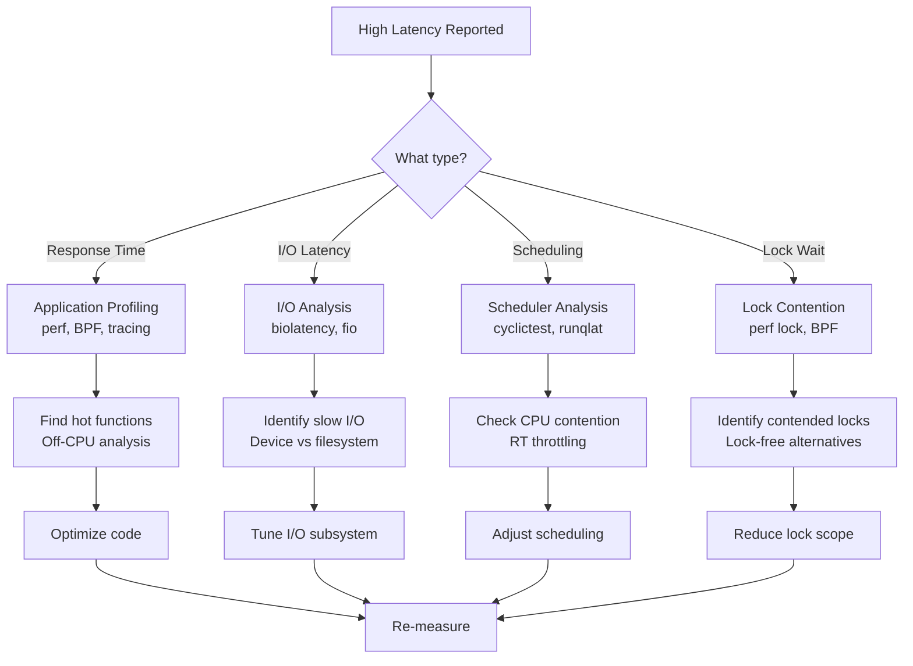
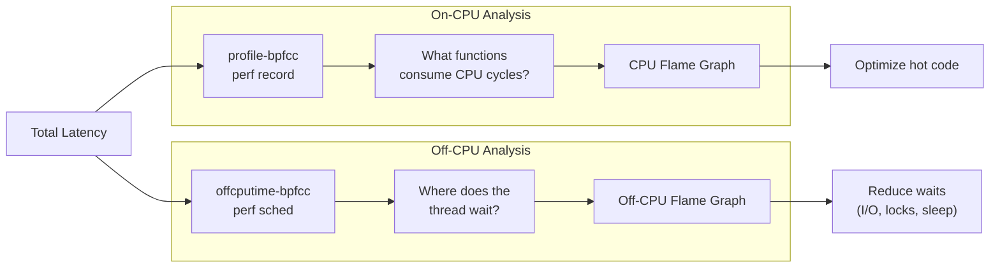
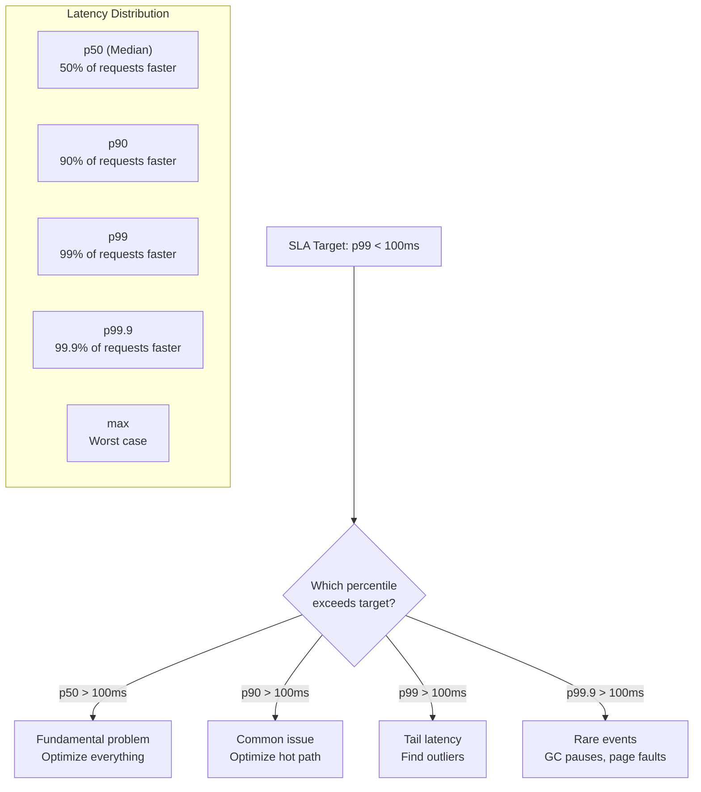

# Chapter 242: Latency Analysis — perf latency, cyclictest, BPF histograms, off-CPU analysis

## 1. Intuition

Latency is the time delay between an action and its response. In computing, latency appears everywhere: disk I/O latency, network latency, memory access latency, lock acquisition latency, scheduling latency, and system call latency. While throughput tells you how much work gets done, latency tells you how long each piece of work takes — and for interactive applications, latency is what users actually perceive.

The critical insight about latency is that **averages are useless**. A web server with an average response time of 10ms might have 1% of requests taking 500ms. Those 500ms requests affect 1% of users — which at scale means thousands of frustrated users per hour. The 99th percentile (p99) is what matters.

### The Latency Distribution

```
Request Latency Distribution (example web server):

Count
  │
  │████
  │████
  │████████
  │████████████
  │████████████████
  │████████████████████
  │████████████████████████████
  │████████████████████████████████████████████
  │████████████████████████████████████████████████████████████
  └─────────────────────────────────────────────────────────────▶ Latency
  1ms    5ms    10ms   50ms   100ms  500ms  1s     5s
  
  p50=2ms  p90=5ms  p99=50ms  p99.9=500ms  max=5s
  
  The average (mean) is ~8ms, but:
  - 99% of users see < 50ms (good)
  - 1% of users see 50ms-5s (bad!)
  - 0.1% of users see 500ms-5s (terrible!)
```

### Types of Latency

| Latency Type | Typical Range | Source |
|-------------|---------------|--------|
| CPU cycle | ~0.3ns | Clock speed |
| L1 cache | ~1ns | Cache hit |
| L2 cache | ~4ns | Cache hit |
| L3 cache | ~12ns | Cache hit |
| Main memory | ~100ns | DRAM access |
| NVMe SSD | ~10-100μs | Storage I/O |
| SATA SSD | ~50-200μs | Storage I/O |
| HDD | ~1-10ms | Mechanical seek |
| Network (local) | ~50-200μs | LAN |
| Network (cross-datacenter) | ~1-10ms | WAN |
| Lock acquisition | ~25ns-100μs | Contention-dependent |
| Context switch | ~1-10μs | Scheduler |
| System call | ~0.1-10μs | Kernel entry/exit |
| Page fault (minor) | ~1-10μs | Memory mapping |
| Page fault (major) | ~1-10ms | Disk I/O |

### Why Percentiles Matter

```
Why Average is Misleading:

Scenario A: 100 requests, all take 10ms
Average = 10ms, p99 = 10ms, p99.9 = 10ms

Scenario B: 99 requests take 1ms, 1 request takes 910ms
Average = 10ms, p99 = 1ms, p99.9 = 910ms

Same average, completely different user experience!

Scenario C: 99.9 requests take 1ms, 0.1% take 10s
Average = 11ms, p99 = 1ms, p99.9 = 10,000ms

Average says "11ms — fine!" Reality: 1 in 1000 users waits 10 seconds!
```

## 2. Architecture

### Latency Sources in Linux

```
┌──────────────────────────────────────────────────────────────────┐
│  Application Latency Sources                                     │
│                                                                  │
│  ┌────────────────────────────────────────────────────────────┐  │
│  │  User Space                                                │  │
│  │  ┌──────────┐  ┌──────────┐  ┌──────────┐  ┌──────────┐  │  │
│  │  │ Algorithm│  │ Memory   │  │ Lock     │  │ GC/JIT   │  │  │
│  │  │ latency  │  │ alloc    │  │ contention│  │ pauses   │  │  │
│  │  └──────────┘  └──────────┘  └──────────┘  └──────────┘  │  │
│  └────────────────────────────────────────────────────────────┘  │
│                                                                  │
│  ┌────────────────────────────────────────────────────────────┐  │
│  │  Kernel                                                    │  │
│  │  ┌──────────┐  ┌──────────┐  ┌──────────┐  ┌──────────┐  │  │
│  │  │ Scheduler│  │ Syscall  │  │ IRQ      │  │ Memory   │  │  │
│  │  │ latency  │  │ overhead │  │ handling │  │ mgmt     │  │  │
│  │  └──────────┘  └──────────┘  └──────────┘  └──────────┘  │  │
│  └────────────────────────────────────────────────────────────┘  │
│                                                                  │
│  ┌────────────────────────────────────────────────────────────┐  │
│  │  Hardware                                                  │  │
│  │  ┌──────────┐  ┌──────────┐  ┌──────────┐  ┌──────────┐  │  │
│  │  │ Memory   │  │ Cache    │  │ Storage  │  │ Network  │  │  │
│  │  │ latency  │  │ misses   │  │ I/O      │  │ I/O      │  │  │
│  │  └──────────┘  └──────────┘  └──────────┘  └──────────┘  │  │
│  └────────────────────────────────────────────────────────────┘  │
└──────────────────────────────────────────────────────────────────┘
```

### Scheduling Latency

```
┌──────────────────────────────────────────────────────────────────┐
│  Thread State Transitions                                        │
│                                                                  │
│  Running ──▶ Blocked (I/O, lock, sleep)                         │
│  Running ──▶ Runnable (preempted, time slice expired)           │
│  Runnable ──▶ Running (scheduled)                               │
│  Blocked ──▶ Runnable (I/O complete, lock acquired)             │
│                                                                  │
│  Scheduling Latency = Time in "Runnable" state                  │
│  (Thread is ready to run but waiting for a CPU)                 │
│                                                                  │
│  ┌─────────────────────────────────────────────────────────────┐ │
│  │ Timeline for a thread:                                      │ │
│  │                                                             │ │
│  │ ████████░░░░░░░░░░████████████░░░░░░░░████████████████      │ │
│  │ Running  Blocked  Running     Blocked  Running              │ │
│  │         (I/O)                (lock)                         │ │
│  │                                                             │ │
│  │ Off-CPU time = Blocked time + Runnable time                 │ │
│  │ Scheduling latency = Time in Runnable state                 │ │
│  └─────────────────────────────────────────────────────────────┘ │
└──────────────────────────────────────────────────────────────────┘
```

### Latency Histogram Architecture

```
┌──────────────────────────────────────────────────────────────────┐
│  BPF Latency Histogram                                           │
│                                                                  │
│  ┌─────────────────────────────────────────────────────────────┐ │
│  │  BPF Program (attached to tracepoint/kprobe)               │ │
│  │                                                             │ │
│  │  1. Record start timestamp on event entry                   │ │
│  │  2. Calculate duration on event exit                        │ │
│  │  3. Increment histogram bucket                              │ │
│  └─────────────────────────────────────────────────────────────┘ │
│                          │                                        │
│                          ▼                                        │
│  ┌─────────────────────────────────────────────────────────────┐ │
│  │  Histogram (per-CPU, lock-free)                             │ │
│  │                                                             │ │
│  │  Bucket    Count                                            │ │
│  │  [0-1μs]   ████████████████████████  234567                │ │
│  │  [1-2μs]   ██████████████████       178901                 │ │
│  │  [2-4μs]   ████████████            123456                  │ │
│  │  [4-8μs]   ████████                 89012                  │ │
│  │  [8-16μs]  ██████                   67890                  │ │
│  │  [16-32μs] ████                     45678                  │ │
│  │  [32-64μs] ██                       23456                  │ │
│  │  [64+μs]   █                        12345                  │ │
│  └─────────────────────────────────────────────────────────────┘ │
└──────────────────────────────────────────────────────────────────┘
```

## 3. Tools & Techniques

### perf latency

```bash
# General latency profiling with perf
# Record scheduling events
sudo perf sched record -- sleep 10

# Analyze scheduling latency
sudo perf sched latency --stdio

# Output:
#   Task               |  Runtime ms  |  Switches  |  Average delay  |  Maximum delay
#   -------------------|-------------|------------|-----------------|---------------
#   mysqld             |  12345.678   |   23456    |      0.123 ms   |     12.345 ms
#   kworker            |   2345.678   |    5678    |      0.045 ms   |      1.234 ms
#   nginx              |   1234.567   |    3456    |      0.089 ms   |      5.678 ms

# Show context switch details
sudo perf sched map --stdio

# Show per-CPU scheduling
sudo perf sched timehist --stdio

# Record latency events
sudo perf record -e 'sched:sched_switch' -a -- sleep 10
sudo perf report --stdio --sort=comm
```

### cyclictest

cyclictest is the standard tool for measuring real-time scheduling latency:

```bash
# Install
sudo apt install rt-tests

# Basic latency test
sudo cyclictest -t1 -p80 -i1000 -l10000
# -t1: One thread
# -p80: Priority 80
# -i1000: 1ms interval
# -l10000: 10000 iterations

# System-wide latency test
sudo cyclictest -t -p80 -i1000 -l100000 -m
# -t: One thread per CPU
# -m: Lock memory (prevent page faults)

# Output:
# T: 0 (12345) P:80 I:1000 C: 100000 Min:      1 Act:    3 Avg:    2 Max:      15
# T: 1 (12346) P:80 I:1000 C: 100000 Min:      1 Act:    2 Avg:    2 Max:      12
# T: 2 (12347) P:80 I:1000 C: 100000 Min:      1 Act:    4 Avg:    3 Max:      18
# T: 3 (12348) P:80 I:1000 C: 100000 Min:      1 Act:    2 Avg:    2 Max:      14

# Interpretation:
# Min: Minimum latency (μs)
# Act: Most recent latency (μs)
# Avg: Average latency (μs)
# Max: Maximum latency (μs) ← This is what matters!

# Histogram output
sudo cyclictest -t -p80 -i1000 -l100000 -m -H 100
# Shows latency distribution in 100μs buckets

# Real-time kernel comparison
# Standard kernel: Max latency typically 50-200μs
# RT kernel: Max latency typically 5-20μs

# Long-running stability test
sudo cyclictest -t -p80 -i1000 -D 3600 -m
# Run for 1 hour, report maximum latency
```

### BPF Latency Histograms

```bash
# System call latency histogram
sudo bpftrace -e '
tracepoint:raw_syscalls:sys_enter {
    @start[tid] = nsecs;
}
tracepoint:raw_syscalls:sys_exit /@start[tid]/ {
    @usecs = hist((nsecs - @start[tid]) / 1000);
    delete(@start[tid]);
}'

# I/O latency histogram
sudo bpftrace -e '
tracepoint:block:block_rq_issue {
    @start[args->dev] = nsecs;
}
tracepoint:block:block_rq_complete /@start[args->dev]/ {
    @usecs = hist((nsecs - @start[args->dev]) / 1000);
    delete(@start[args->dev]);
}'

# Scheduling latency (time in runnable state)
sudo bpftrace -e '
tracepoint:sched:sched_wakeup {
    @qtime[args->pid] = nsecs;
}
tracepoint:sched:sched_switch /@qtime[args->next_pid]/ {
    @usecs = hist((nsecs - @qtime[args->next_pid]) / 1000);
    delete(@qtime[args->next_pid]);
}'

# Lock contention latency
sudo bpftrace -e '
tracepoint:lock:contention_begin {
    @start[tid] = nsecs;
}
tracepoint:lock:contention_end /@start[tid]/ {
    @usecs = hist((nsecs - @start[tid]) / 1000);
    delete(@start[tid]);
}'

# Network latency (TCP RTT)
sudo bpftrace -e 'kprobe:tcp_rcv_established { @usecs = hist(arg2 / 1000); }'

# Using bcc tools
# biolatency: Block I/O latency
sudo biolatency-bpfcc

# runqlat: Run queue (scheduling) latency
sudo runqlat-bpfcc

# ext4slower: Slow ext4 operations
sudo ext4slower-bpfcc 10  # Operations > 10ms

# tcpconnlat: TCP connection latency
sudo tcpconnlat-bpfcc
```

### Off-CPU Analysis

Off-CPU analysis identifies where threads spend time NOT running on the CPU:

```bash
# Off-CPU profiling with bcc
sudo offcputime-bpfcc -df -p PID 30 > offcpu.stacks

# Generate off-CPU flame graph
cat offcpu.stacks | ./FlameGraph/flamegraph.pl --color=io --title="Off-CPU" > offcpu.svg

# Combined on-CPU + off-CPU flame graph
# On-CPU (what's running)
sudo profile-bpfcc -F 99 -p PID 10 > oncpu.stacks
# Off-CPU (what's waiting)
sudo offcputime-bpfcc -df -p PID 10 > offcpu.stacks

# Generate both
cat oncpu.stacks | ./FlameGraph/flamegraph.pl --color=cpu > oncpu.svg
cat offcpu.stacks | ./FlameGraph/flamegraph.pl --color=io > offcpu.svg

# Using bpftrace for off-CPU analysis
sudo bpftrace -e '
tracepoint:sched:sched_switch /args->prev_pid == $1/ {
    @offcpu_start[args->prev_pid] = nsecs;
}
tracepoint:sched:sched_switch /@offcpu_start[args->next_pid]/ {
    $dur = nsecs - @offcpu_start[args->next_pid];
    @offcpu_ms = hist($dur / 1000000);
    @offcpu_comm[args->comm] = sum($dur);
    delete(@offcpu_start[args->next_pid]);
}' -- $(pgrep myapp)
```

### Additional Latency Tools

```bash
# perf trace — System call latency tracing
sudo perf trace -p PID --duration 10
# Shows per-syscall latency

# perf trace with latency histogram
sudo perf trace -p PID -s

# latencytop — System-wide latency source tracking
sudo latencytop

# /proc/<PID>/wchan — What a blocked process is waiting for
cat /proc/<PID>/wchan

# /proc/<PID>/status — Thread state
grep -E "State|voluntary|nonvoluntary" /proc/<PID>/status

# /proc/schedstat — Per-task scheduling statistics
cat /proc/<PID>/schedstat
# Fields: time_on_cpu time_waiting run_count

# perf script — Raw event dump for custom analysis
sudo perf script --header -i perf.data

# tiptop — Top-like tool with latency info
sudo tiptop
```

## 4. Source Code References

### Kernel Scheduler Latency

```
kernel/sched/core.c         — Core scheduler
kernel/sched/fair.c         — CFS scheduler
kernel/sched/stats.h        — Scheduler statistics
kernel/sched/debug.c        — Scheduler debug output
include/linux/sched.h       — Task structure
```

### Kernel Latency Tracing

```
kernel/trace/trace.c        — Ftrace core
kernel/trace/trace_events.c — Tracepoint events
kernel/trace/trace_sched.c  — Scheduler tracing
include/trace/events/sched.h — Scheduler tracepoints
```

### BPF Latency Tools

```
tools/bpf/bpftrace/         — bpftrace source
tools/perf/util/bpf-event.c — BPF event handling
```

## 5. Examples

### Example 1: Measuring Web Server Latency

```bash
# Measure HTTP latency with wrk
wrk -t4 -c100 -d30s --latency http://localhost:8080/api/data

# Output:
# Latency Distribution
#    50%    2.34ms
#    75%    3.45ms
#    90%    5.67ms
#    99%   23.45ms
#  99.9%  123.45ms

# Or with ab (Apache Bench)
ab -n 10000 -c 100 http://localhost:8080/api/data

# Or with hey
hey -n 10000 -c 100 http://localhost:8080/api/data

# Record system-level latency during test
sudo perf trace -p $(pgrep nginx) --duration 1 -o perf_trace.txt &
wrk -t4 -c100 -d30s --latency http://localhost:8080/api/data
```

### Example 2: Scheduling Latency Analysis

```bash
# Measure scheduling latency
sudo cyclictest -t -p80 -i1000 -l100000 -m

# Record scheduler events
sudo perf sched record -- sleep 30

# Analyze scheduling delays
sudo perf sched latency --stdio

# Show per-thread scheduling timeline
sudo perf sched timehist --stdio

# Find the worst scheduling delays
sudo perf sched latency --stdio | sort -k6 -rn | head -20

# BPF-based scheduling latency histogram
sudo bpftrace -e '
tracepoint:sched:sched_wakeup {
    @qtime[args->pid] = nsecs;
}
tracepoint:sched:sched_switch /@qtime[args->next_pid]/ {
    $delay = nsecs - @qtime[args->next_pid];
    @sched_latency_us = hist($delay / 1000);
    delete(@qtime[args->next_pid]);
}'
```

### Example 3: I/O Latency Profiling

```bash
# Block I/O latency histogram
sudo biolatency-bpfcc

# Per-device I/O latency
sudo biolatency-bpfcc -D

# I/O latency over time (1-second intervals)
sudo biolatency-bpfcc 1 10

# Trace slow I/O operations
sudo biosnoop-bpfcc | awk '$NF > 10 {print}'  # Operations > 10ms

# Filesystem latency
sudo ext4slower-bpfcc 10  # ext4 operations > 10ms
sudo xfs_slower-bpfcc 10  # xfs operations > 10ms

# fio latency benchmark
fio --name=latency --rw=randread --bs=4k --size=1G \
    --ioengine=libaio --direct=1 --iodepth=1 --numjobs=1 \
    --runtime=60 --lat_percentiles=1
```

### Example 4: Off-CPU Analysis

```bash
# Find where a process spends time off-CPU
sudo offcputime-bpfcc -df -p $(pgrep mysqld) 30 > mysql_offcpu.txt

# Generate off-CPU flame graph
cat mysql_offcpu.txt | stackcollapse-bpf.pl | \
    flamegraph.pl --color=io --title="MySQL Off-CPU" > mysql_offcpu.svg

# Interpret the flame graph:
# - Wide bars = functions where the process spends time waiting
# - Look for: lock contention, I/O waits, sleep calls
# - Compare with on-CPU flame graph to see full picture

# On-CPU flame graph for comparison
sudo profile-bpfcc -F 99 -p $(pgrep mysqld) 10 | \
    stackcollapse-bpf.pl | flamegraph.pl --title="MySQL On-CPU" > mysql_oncpu.svg
```

### Example 5: End-to-End Latency Analysis

```bash
# Analyze a request from start to finish

# Step 1: Application-level timing
curl -w "@curl-format.txt" -o /dev/null -s http://localhost:8080/api/data

# curl-format.txt:
#     time_namelookup:  %{time_namelookup}s\n
#        time_connect:  %{time_connect}s\n
#     time_appconnect:  %{time_appconnect}s\n
#    time_pretransfer:  %{time_pretransfer}s\n
#       time_redirect:  %{time_redirect}s\n
#  time_starttransfer:  %{time_starttransfer}s\n
#                     ----------\n
#          time_total:  %{time_total}s\n

# Step 2: Kernel-level tracing
sudo perf trace -p $(pgrep nginx) --call-graph dwarf -o perf_trace.txt

# Step 3: Off-CPU analysis
sudo offcputime-bpfcc -df -p $(pgrep nginx) 30 > nginx_offcpu.txt

# Step 4: BPF latency breakdown
sudo bpftrace -e '
tracepoint:syscalls:sys_enter_read /pid == $1/ { @start[tid] = nsecs; }
tracepoint:syscalls:sys_exit_read /@start[tid]/ {
    @read_latency = hist((nsecs - @start[tid]) / 1000);
    delete(@start[tid]);
}
tracepoint:syscalls:sys_enter_write /pid == $1/ { @start_w[tid] = nsecs; }
tracepoint:syscalls:sys_exit_write /@start_w[tid]/ {
    @write_latency = hist((nsecs - @start_w[tid]) / 1000);
    delete(@start_w[tid]);
}' -- $(pgrep nginx)
```

## 6. Diagrams

### Latency Analysis Workflow



### On-CPU vs Off-CPU Analysis



### Latency Percentile Interpretation



## 7. Common Pitfalls

### 1. Using Averages Instead of Percentiles

```bash
# Problem: "Average latency is 5ms" — hides the 1% of requests at 500ms
# Always report percentiles

# Solution: Use tools that report percentiles
fio --lat_percentiles=1 ...
wrk --latency ...
# Or calculate from histogram data
```

### 2. Profiling in Different Environment

```bash
# Problem: Latency measured on development laptop, deployed to production server
# Different hardware, different kernel, different load

# Solution: Measure in production-like environment
# - Same hardware (or equivalent cloud instance)
# - Same kernel version
# - Same configuration
# - Realistic load
```

### 3. Ignoring Off-CPU Time

```bash
# Problem: CPU flame graph shows no hot functions
# But the program is slow — because it's waiting, not computing

# Solution: Always do both on-CPU and off-CPU analysis
# On-CPU: What's running?
sudo profile-bpfcc -F 99 -p PID 10 > oncpu.txt
# Off-CPU: What's waiting?
sudo offcputime-bpfcc -df -p PID 10 > offcpu.txt
```

### 4. Not Accounting for Warmup

```bash
# Problem: First few requests are slow (cold cache, JIT compilation)
# They skew the average and percentiles

# Solution: Use warmup period
wrk -t4 -c100 -d60s http://localhost:8080/  # 60s total
# Discard first 10 seconds of data

# Or with fio:
fio --name=test --runtime=120 --time_based --ramp_time=10 ...
# --ramp_time=10: Run 10 seconds before measuring
```

### 5. Measuring Wrong Thing

```bash
# Problem: Measuring disk latency when the bottleneck is network latency
# Or measuring application latency when the bottleneck is DNS resolution

# Solution: Break down latency into components
curl -w "DNS: %{time_namelookup}s\nConnect: %{time_connect}s\nTTFB: %{time_starttransfer}s\nTotal: %{time_total}s\n" -o /dev/null -s http://example.com

# Use distributed tracing for complex systems
# OpenTelemetry, Jaeger, Zipkin
```

### 6. Ignoring Coordinated Omission

```bash
# Problem: Load generator stops sending requests when responses are slow
# This "coordinates" with the server, omitting slow requests from measurement

# Solution: Use open-loop load generators
# wrk2: Fixed-rate load generation
wrk2 -t4 -R1000 -d60s http://localhost:8080/  # 1000 req/s regardless of latency

# Or use constant-rate tools
hey -q 1000 -z 60s http://localhost:8080/  # 1000 req/s
```

### 7. Not Considering Tail Latency Amplification

```bash
# Problem: Single service p99 is 100ms
# But a request touches 10 services in parallel
# Probability of ALL 10 responding in < 100ms = 0.99^10 = 0.904
# So 9.6% of requests are slow (p90, not p99!)

# Solution: Design for much lower p99 at each service level
# If fan-out is N services: target p99 < SLA / N
# Or use hedged requests, timeouts, fallbacks
```

## 8. Best Practices

### 1. Measure End-to-End and Component Latency

```bash
# End-to-end: curl timing
curl -w "@curl-format.txt" -o /dev/null -s http://localhost/api

# Component breakdown:
# - DNS lookup time
# - TCP connection time
# - TLS handshake time (if HTTPS)
# - Time to first byte (TTFB)
# - Content transfer time

# Kernel-level breakdown:
# - System call latency
# - I/O latency
# - Scheduling latency
# - Lock contention
```

### 2. Use Histograms, Not Averages

```bash
# Always use tools that provide histograms
fio --lat_percentiles=1 --log_hist_msec=100 ...
sudo biolatency-bpfcc
sudo runqlat-bpfcc

# Store and visualize histograms over time
# Prometheus histograms, Grafana heatmaps
```

### 3. Monitor Latency Continuously

```bash
# Set up latency monitoring
# Prometheus + application metrics
# Or use BPF-based monitoring

# Alert on percentile violations
# p99 > 100ms for 5 minutes → alert

# Use SLOs (Service Level Objectives)
# Example: 99.9% of requests < 200ms
# Track error budget: how much of 0.1% is consumed
```

### 4. Profile Under Realistic Load

```bash
# Don't measure latency idle — measure under load
# Use production-like traffic patterns

# Tools for realistic load generation:
wrk2 -t4 -R1000 -d300s -s script.lua http://localhost/
# Constant rate, Lua script for complex scenarios

# Or use real traffic replay
tcpreplay -i eth0 captured_traffic.pcap
```

### 5. Use Off-CPU Analysis for Slow Applications

```bash
# If CPU utilization is low but latency is high:
# → The process is waiting, not computing

# Off-CPU flame graph reveals what's blocking
sudo offcputime-bpfcc -df -p PID 30 | stackcollapse-bpf.pl | \
    flamegraph.pl --color=io > offcpu.svg

# Common off-CPU causes:
# - Lock contention (waiting for mutex)
# - I/O waits (disk, network)
# - Sleep calls (timers, rate limiting)
# - Scheduler delays (run queue)
```

### 6. Break Down Latency by Component

```bash
# For a web request:
# Total = DNS + TCP + TLS + Server Processing + Transfer

# For server processing:
# Total = Routing + Auth + DB Query + Business Logic + Serialization

# For DB query:
# Total = Parse + Plan + Execute + Fetch + Network

# Instrument each component
# Use distributed tracing (OpenTelemetry) for complex systems
```

## 9. Exercises

### Exercise 1: Scheduling Latency Measurement
```bash
# Measure scheduling latency with cyclictest
sudo cyclictest -t -p80 -i1000 -l100000 -m

# Questions:
# 1. What is the maximum scheduling latency?
# 2. Is the latency acceptable for a real-time application (< 50μs)?
# 3. Run with different priorities. Does priority affect latency?
```

### Exercise 2: Off-CPU Analysis
```bash
# Profile a slow application with off-CPU analysis
sudo offcputime-bpfcc -df -p $(pgrep myapp) 30 > offcpu.txt
cat offcpu.txt | stackcollapse-bpf.pl | flamegraph.pl --color=io > offcpu.svg

# Questions:
# 1. What are the top 3 off-CPU waiting functions?
# 2. Is the process waiting on I/O, locks, or sleep?
# 3. What optimization would reduce off-CPU time?
```

### Exercise 3: I/O Latency Profiling
```bash
# Profile I/O latency
sudo biolatency-bpfcc
sudo biolatency-bpfcc -D  # Per-device

# Questions:
# 1. What is the median I/O latency?
# 2. What is the p99 I/O latency?
# 3. Is there a bimodal distribution (fast SSD + slow HDD)?
```

### Exercise 4: Latency Distribution Analysis
```bash
# Benchmark with fio and analyze latency distribution
fio --name=latency --rw=randread --bs=4k --size=1G \
    --ioengine=libaio --direct=1 --iodepth=1 --numjobs=1 \
    --runtime=60 --lat_percentiles=1 \
    --percentile_list=1:5:10:20:30:40:50:60:70:80:90:95:99:99.5:99.9:99.95:99.99

# Questions:
# 1. What is the latency distribution shape?
# 2. Is there a long tail?
# 3. What percentile exceeds your SLA target?
```

### Exercise 5: End-to-End Latency Breakdown
```bash
# Break down HTTP request latency
curl -w "DNS: %{time_namelookup}s\nConnect: %{time_connect}s\nTLS: %{time_appconnect}s\nTTFB: %{time_starttransfer}s\nTotal: %{time_total}s\n" \
    -o /dev/null -s http://localhost:8080/api/data

# Questions:
# 1. Which component contributes most to total latency?
# 2. What optimization would have the biggest impact?
# 3. Profile the server-side processing separately
```

## 10. References

1. **Brendan Gregg - Off-CPU Analysis**: https://www.brendangregg.com/offcpuanalysis.html
2. **cyclictest Documentation**: https://wiki.linuxfoundation.org/realtime/documentation/howto/tools/rt-tests
3. **BPF Performance Tools (Brendan Gregg)**: http://www.brendangregg.com/bpf-performance-tools-book.html
4. **"Systems Performance" by Brendan Gregg**: Chapter 6 - CPU Analysis Methodology
5. **perf sched Documentation**: https://man7.org/linux/man-pages/man1/perf-sched.1.html
6. **bpftrace Reference Guide**: https://github.com/bpftrace/bpftrace/blob/master/docs/reference_guide.md
7. **bpftrace One-Liners**: https://github.com/bpftrace/bpftrace/blob/master/docs/tutorial_one_liners.md
8. **wrk2 (constant-throughput wrk)**: https://github.com/giltene/wrk2
9. **Gil Tene - "How NOT to Measure Latency"**: https://www.youtube.com/watch?v=lJ8ydIuPFeU
10. **HDR Histogram**: http://hdrhistogram.org/ — High Dynamic Range Histogram for latency
