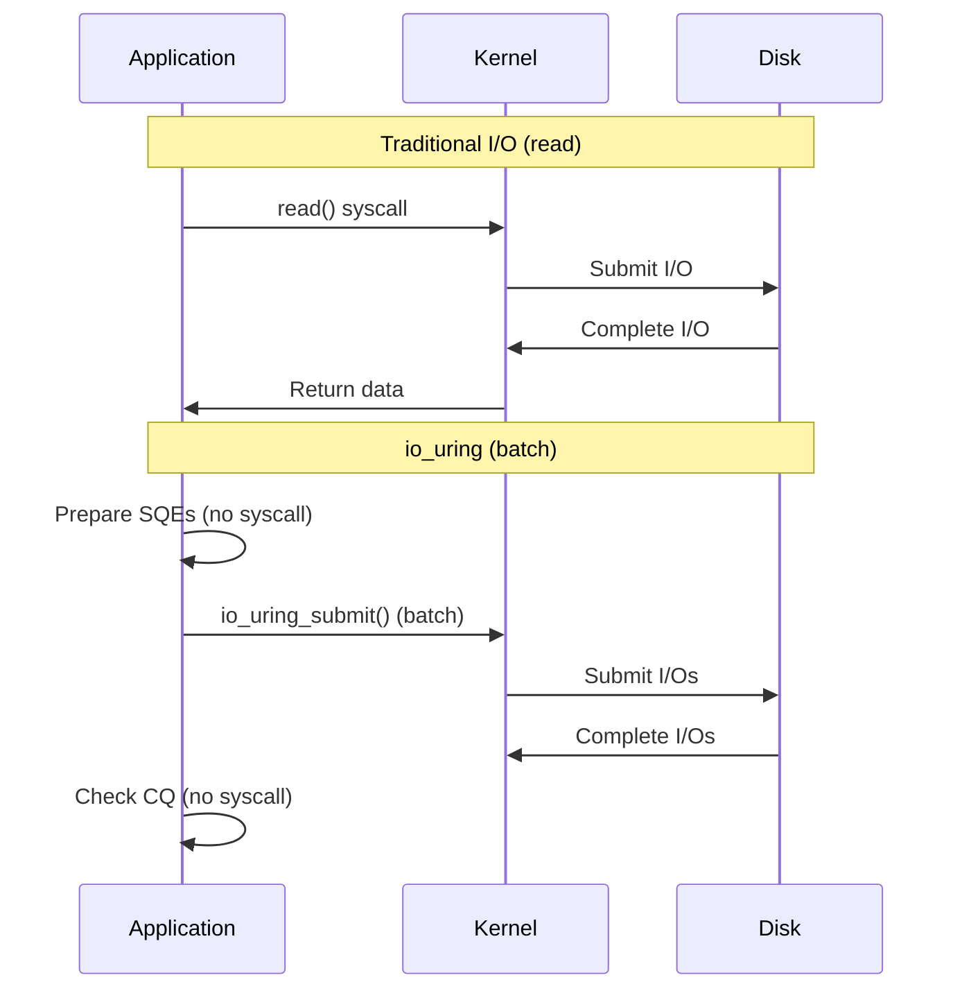
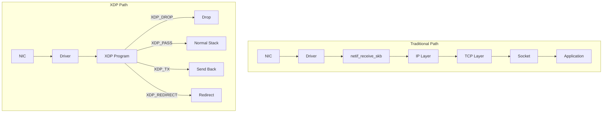
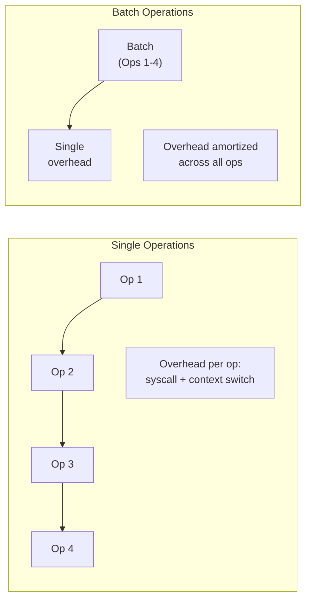

# Chapter 243: Throughput Optimization — Batching, Zero-Copy, io_uring, XDP, Busy Polling

## 1. Intuition

Throughput optimization is the art of maximizing the amount of work a system can perform per unit time. While latency optimization focuses on making individual operations faster, throughput optimization focuses on doing more operations in parallel, reducing per-operation overhead, and eliminating unnecessary work.

The key insight is that **throughput and latency often trade off against each other**. Batching improves throughput by amortizing fixed costs across many operations, but it increases the latency of individual operations. Understanding when to optimize for which is critical.

### The Throughput Formula

```
Throughput = Concurrency / Latency

If latency = 1ms per request, and we process 1 request at a time:
  Throughput = 1 / 0.001 = 1,000 requests/second

If we batch 100 requests together (batch latency = 5ms):
  Throughput = 100 / 0.005 = 20,000 requests/second

20× throughput improvement, but 5× higher latency per request.
```

### Key Throughput Optimization Strategies

| Strategy | Description | Trade-off |
|----------|-------------|-----------|
| **Batching** | Group operations to amortize overhead | Higher per-op latency |
| **Zero-copy** | Avoid data copying between buffers | More complex code |
| **Async I/O** | Submit multiple I/Os concurrently | More complex code |
| **Polling** | Busy-wait instead of sleeping | Higher CPU usage |
| **Pipelining** | Overlap computation with I/O | More complex code |
| **Lock-free** | Avoid synchronization overhead | Harder to get right |
| **SIMD** | Process multiple data elements per instruction | Data must be vectorizable |
| **Kernel bypass** | Skip kernel for data path | Loss of kernel features |

### The Per-Operation Overhead Problem

Many operations have fixed overhead that dominates for small operations:

```
Fixed overhead: 5μs (syscall, lock, allocation, etc.)
Actual work: 1μs per item

Without batching:
  Total per item: 6μs
  Throughput: 166,667 items/second

With batching (100 items):
  Total per batch: 5μs + (100 × 1μs) = 105μs
  Throughput: 952,381 items/second

5.7× throughput improvement!
```

## 2. Architecture

### io_uring Architecture

io_uring is Linux's newest and most efficient I/O interface:

```
┌──────────────────────────────────────────────────────────────────┐
│  io_uring                                                        │
│                                                                  │
│  User Space                                                      │
│  ┌─────────────────────────────────────────────────────────────┐ │
│  │  Submission Queue (SQ)                                      │ │
│  │  ┌─────┬─────┬─────┬─────┬─────┬─────┬─────┬─────┐        │ │
│  │  │ SQE │ SQE │ SQE │ SQE │ SQE │ SQE │ SQE │ SQE │        │ │
│  │  └─────┴─────┴─────┴─────┴─────┴─────┴─────┴─────┘        │ │
│  │  Shared ring buffer (no syscall to submit!)                 │ │
│  └─────────────────────────────────────────────────────────────┘ │
│                          │                                        │
│                          ▼ io_uring_enter() (batch submit)       │
│  ┌─────────────────────────────────────────────────────────────┐ │
│  │  Completion Queue (CQ)                                      │ │
│  │  ┌─────┬─────┬─────┬─────┬─────┬─────┬─────┬─────┐        │ │
│  │  │ CQE │ CQE │ CQE │ CQE │ CQE │ CQE │ CQE │ CQE │        │ │
│  │  └─────┴─────┴─────┴─────┴─────┴─────┴─────┴─────┘        │ │
│  │  Shared ring buffer (no syscall to reap!)                   │ │
│  └─────────────────────────────────────────────────────────────┘ │
│                                                                  │
│  Kernel Space                                                    │
│  ┌─────────────────────────────────────────────────────────────┐ │
│  │  io_uring kernel worker threads                             │ │
│  │  Process submissions asynchronously                         │ │
│  └─────────────────────────────────────────────────────────────┘ │
└──────────────────────────────────────────────────────────────────┘
```

**Key io_uring advantages:**
- Zero syscall overhead for submit and complete (shared ring buffers)
- Batch submission of multiple I/Os
- Kernel-side polling (SQPOLL) eliminates even the io_uring_enter() syscall
- Supports file I/O, network I/O, timeouts, and more

### XDP (eXpress Data Path) Architecture

XDP processes packets at the earliest point in the Linux networking stack:

```
┌──────────────────────────────────────────────────────────────────┐
│  Traditional Network Stack                                       │
│                                                                  │
│  NIC → Driver → netif_receive_skb → IP → TCP → Socket → App    │
│  Latency: ~50-100μs                                              │
│  Throughput: ~1-2 Mpps                                           │
└──────────────────────────────────────────────────────────────────┘

┌──────────────────────────────────────────────────────────────────┐
│  XDP Path                                                        │
│                                                                  │
│  NIC → Driver → XDP program → (pass/drop/tx/redirect)          │
│  Latency: ~1-5μs                                                 │
│  Throughput: ~10-20 Mpps                                         │
│                                                                  │
│  XDP Actions:                                                    │
│  - XDP_PASS: Pass to normal network stack                       │
│  - XDP_DROP: Drop packet (very fast)                            │
│  - XDP_TX: Send back out same NIC                               │
│  - XDP_REDIRECT: Redirect to another NIC or user space          │
└──────────────────────────────────────────────────────────────────┘
```

### Zero-Copy Architecture

```
┌──────────────────────────────────────────────────────────────────┐
│  Traditional Copy Path                                           │
│                                                                  │
│  NIC → Kernel Buffer → Copy → User Buffer → Copy → Kernel Buf → NIC│
│                2 copies (receive) + 2 copies (send)              │
│                                                                  │
│  NIC → DMA → ┌─────────┐     ┌─────────┐     ┌─────────┐       │
│              │Kernel   │ ──▶ │User     │ ──▶ │Kernel   │ ──▶ NIC│
│              │Buffer   │copy │Buffer   │copy │Buffer   │       │
│              └─────────┘     └─────────┘     └─────────┘       │
│              CPU copies data 4 times!                            │
└──────────────────────────────────────────────────────────────────┘

┌──────────────────────────────────────────────────────────────────┐
│  Zero-Copy Path                                                  │
│                                                                  │
│  NIC → DMA → User Buffer → DMA → NIC                           │
│                0 CPU copies!                                     │
│                                                                  │
│  NIC → DMA → ┌─────────┐     ┌─────────┐                       │
│              │User     │ ──────────────────▶ NIC (DMA)          │
│              │Buffer   │                    (sg-DMA / sendmsg)   │
│              └─────────┘                                        │
│              No CPU copies at all!                               │
│                                                                  │
│  Technologies:                                                   │
│  - MSG_ZEROCOPY (sendmsg)                                       │
│  - splice() / tee() / vmsplice()                                │
│  - AF_XDP (zero-copy sockets)                                   │
│  - DPDK (kernel bypass)                                         │
└──────────────────────────────────────────────────────────────────┘
```

### Busy Polling vs Interrupt-Driven I/O

```
┌──────────────────────────────────────────────────────────────────┐
│  Interrupt-Driven I/O (default)                                  │
│                                                                  │
│  NIC ──IRQ──▶ CPU ──process──▶ return to sleep                  │
│                                                                  │
│  Latency: IRQ + context switch + processing (~5-20μs)           │
│  CPU usage: Low when idle                                       │
│  Throughput: Good for bursty traffic                            │
└──────────────────────────────────────────────────────────────────┘

┌──────────────────────────────────────────────────────────────────┐
│  Busy Polling                                                    │
│                                                                  │
│  CPU ──poll──▶ NIC ──poll──▶ NIC ──poll──▶ ...                  │
│  (CPU continuously checks for new packets)                      │
│                                                                  │
│  Latency: ~1-3μs (no IRQ, no context switch)                   │
│  CPU usage: 100% even when idle                                 │
│  Throughput: Excellent for low-latency requirements              │
└──────────────────────────────────────────────────────────────────┘
```

## 3. Tools & Techniques

### io_uring Programming

```c
// io_uring_example.c — Basic io_uring usage
#include <liburing.h>
#include <fcntl.h>
#include <string.h>
#include <stdio.h>

#define QUEUE_DEPTH 256
#define BLOCK_SIZE 4096

int main() {
    struct io_uring ring;
    struct io_uring_sqe *sqe;
    struct io_uring_cqe *cqe;
    
    // Initialize io_uring
    io_uring_queue_init(QUEUE_DEPTH, &ring, 0);
    
    // Open file
    int fd = open("testfile", O_RDONLY | O_DIRECT);
    
    // Allocate aligned buffer
    void *buf;
    posix_memalign(&buf, BLOCK_SIZE, BLOCK_SIZE);
    
    // Submit read request
    sqe = io_uring_get_sqe(&ring);
    io_uring_prep_read(sqe, fd, buf, BLOCK_SIZE, 0);
    
    // Submit and wait for completion
    io_uring_submit(&ring);
    io_uring_wait_cqe(&ring, &cqe);
    
    printf("Read %d bytes\n", cqe->res);
    io_uring_cqe_seen(&ring, cqe);
    
    // Cleanup
    close(fd);
    io_uring_queue_exit(&ring);
    return 0;
}
// Compile: gcc -O2 -o io_uring_example io_uring_example.c -luring
```

**io_uring batch submission:**

```c
// Submit multiple I/Os at once
#define BATCH_SIZE 64

void batch_read(struct io_uring *ring, int fd, void **bufs, 
                off_t *offsets, int count) {
    for (int i = 0; i < count; i++) {
        struct io_uring_sqe *sqe = io_uring_get_sqe(ring);
        io_uring_prep_read(sqe, fd, bufs[i], BLOCK_SIZE, offsets[i]);
        sqe->user_data = i;  // Tag for identification
    }
    
    // Submit all at once (single syscall!)
    io_uring_submit(ring);
    
    // Collect completions
    for (int i = 0; i < count; i++) {
        struct io_uring_cqe *cqe;
        io_uring_wait_cqe(ring, &cqe);
        int idx = cqe->user_data;
        printf("Request %d: read %d bytes\n", idx, cqe->res);
        io_uring_cqe_seen(ring, cqe);
    }
}
```

**io_uring SQPOLL mode:**

```c
// Kernel-side polling — no syscall for submission
struct io_uring_params params = {0};
params.flags = IORING_SETUP_SQPOLL;
params.sq_thread_idle = 2000;  // Poll for 2ms before sleeping

io_uring_queue_init_params(QUEUE_DEPTH, &ring, &params);

// Now submissions don't need io_uring_enter()
sqe = io_uring_get_sqe(&ring);
io_uring_prep_read(sqe, fd, buf, BLOCK_SIZE, 0);
// No need to call io_uring_submit() — kernel thread polls SQ
```

### XDP Programming

```c
// xdp_filter.c — XDP packet filter
#include <linux/bpf.h>
#include <bpf/bpf_helpers.h>

// Drop packets from specific IP
SEC("xdp")
int xdp_drop_source(struct xdp_md *ctx) {
    void *data = (void *)(long)ctx->data;
    void *data_end = (void *)(long)ctx->data_end;
    
    struct ethhdr *eth = data;
    if ((void *)eth + sizeof(*eth) > data_end)
        return XDP_PASS;
    
    if (eth->h_proto != bpf_htons(ETH_P_IP))
        return XDP_PASS;
    
    struct iphdr *iph = data + sizeof(*eth);
    if ((void *)iph + sizeof(*iph) > data_end)
        return XDP_PASS;
    
    // Drop packets from 10.0.0.1
    if (iph->saddr == bpf_htonl(0x0A000001)) {
        bpf_printk("Dropping packet from 10.0.0.1\n");
        return XDP_DROP;
    }
    
    return XDP_PASS;
}

char _license[] SEC("license") = "GPL";
```

```bash
# Compile XDP program
clang -O2 -target bpf -c xdp_filter.c -o xdp_filter.o

# Load XDP program
sudo ip link set dev eth0 xdp obj xdp_filter.o sec xdp

# Or with libbpf
sudo bpftool net attach xdp id <prog_id> dev eth0

# View XDP statistics
ip -s link show dev eth0

# Remove XDP program
sudo ip link set dev eth0 xdp off

# Using libxdp
sudo xdp-loader load -m skb eth0 xdp_filter.o
```

### Zero-Copy Networking

```bash
# MSG_ZEROCOPY for send
# Requires kernel 4.14+
setsockopt(fd, SOL_SOCKET, SO_ZEROCOPY, &one, sizeof(one));
sendmsg(fd, &msg, MSG_ZEROCOPY);

# splice() for zero-copy pipe-based transfers
splice(fd_in, NULL, pipefd[1], NULL, 4096, SPLICE_F_MOVE);
splice(pipefd[0], NULL, fd_out, NULL, 4096, SPLICE_F_MOVE);

# AF_XDP for zero-copy packet processing
# Requires kernel 5.4+ and NIC driver support
struct xsk_socket_config cfg = {
    .rx_size = XSK_RING_PROD__DEFAULT_NUM_DESCS,
    .tx_size = XSK_RING_CONS__DEFAULT_NUM_DESCS,
    .bind_flags = XDP_USE_NEED_WAKEUP,
};
xsk_socket__create(&xsk, "eth0", queue_id, &rx, &tx, &cfg);
```

### Busy Polling Configuration

```bash
# Enable busy polling globally
echo 50 | sudo tee /proc/sys/net/core/busy_read  # 50μs busy poll
echo 50 | sudo tee /proc/sys/net/core/busy_poll  # 50μs busy poll

# Per-socket busy polling
setsockopt(fd, SOL_SOCKET, SO_BUSY_POLL, &timeout, sizeof(timeout));

# Enable epoll busy polling
setsockopt(fd, SOL_SOCKET, SO_PREFER_BUSY_POLL, &one, sizeof(one));

# IRQ affinity for dedicated polling cores
echo 2 | sudo tee /proc/irq/<irq_number>/smp_affinity

# Isolate CPUs for polling
# In GRUB: isolcpus=2,3
# Then use taskset to pin polling threads to isolated CPUs
taskset -c 2,3 ./my_network_app

# Use adaptive busy polling
echo 1 | sudo tee /proc/sys/net/core/busy_poll
```

### Batch Processing Techniques

```bash
# Database batching (MySQL)
# BAD: One query at a time
for item in items:
    INSERT INTO table VALUES (item)  # 1000 syscalls + 1000 roundtrips

# GOOD: Batch insert
INSERT INTO table VALUES (item1), (item2), ..., (item1000)  # 1 syscall + 1 roundtrip

# Kernel I/O batching with io_uring
# Submit 256 reads at once instead of 256 individual reads

# Network batching with TCP_CORK / MSG_MORE
setsockopt(fd, IPPROTO_TCP, TCP_CORK, &one, sizeof(one));
write(fd, header, header_len);
write(fd, body, body_len);
setsockopt(fd, IPPROTO_TCP, TCP_CORK, &zero, sizeof(zero));
# Cork accumulates data, uncork sends as single segment

# Nagle's algorithm (default) vs TCP_NODELAY
# Nagle: Wait for ACK before sending small packets (batching)
# TCP_NODELAY: Send immediately (low latency)
setsockopt(fd, IPPROTO_TCP, TCP_NODELAY, &one, sizeof(one));
```

### Additional Throughput Tools

```bash
# perf for throughput analysis
perf stat -e cycles,instructions,cache-misses,context-switches ./my_program

# numastat for NUMA throughput
numastat -p $(pgrep -d, myapp)

# sar for system throughput
sar -n DEV 1  # Network throughput
sar -d 1      # Disk throughput
sar -u 1      # CPU throughput

# iperf3 for network throughput
iperf3 -s  # Server
iperf3 -c server_ip -t 30 -P 8  # Client, 8 parallel streams

# netperf for network throughput
netperf -H server_ip -t TCP_STREAM
netperf -H server_ip -t TCP_RR  # Request-response

# DPDK for kernel bypass networking
# Requires special setup — see DPDK documentation
dpdk-testpmd -l 0-3 -n 4 -- -i --forward-mode=macswap
```

## 4. Source Code References

### io_uring

```
fs/io_uring.c               — io_uring core implementation
include/uapi/linux/io_uring.h — io_uring UAPI
tools/io_uring/              — io_uring examples
liburing/                    — liburing library (userspace)
```

### XDP

```
net/core/dev.c               — XDP hook in network stack
include/linux/bpf.h          — BPF structures
net/core/filter.c            — BPF network filters
drivers/net/ethernet/*/      — NIC XDP support
```

### Zero-Copy

```
net/core/skbuff.c            — Socket buffer management
net/ipv4/tcp.c               — TCP zero-copy support
include/linux/skbuff.h       — sk_buff structure
mm/                          — Memory management for zero-copy
```

## 5. Examples

### Example 1: io_uring vs libaio Performance

```bash
# Compare io_uring with libaio
# libaio (traditional async I/O)
fio --name=libaio --rw=randread --bs=4k --size=1G \
    --ioengine=libaio --direct=1 --iodepth=128 --numjobs=4 \
    --runtime=60 --group_reporting

# io_uring
fio --name=io_uring --rw=randread --bs=4k --size=1G \
    --ioengine=io_uring --direct=1 --iodepth=128 --numjobs=4 \
    --runtime=60 --group_reporting

# io_uring SQPOLL
fio --name=io_uring_sqpoll --rw=randread --bs=4k --size=1G \
    --ioengine=io_uring --direct=1 --iodepth=128 --numjobs=4 \
    --runtime=60 --group_reporting --sqthread_poll=1

# Expected results:
# libaio: ~500K IOPS
# io_uring: ~600K IOPS
# io_uring SQPOLL: ~700K IOPS
```

### Example 2: Zero-Copy Network Transfer

```c
// zerocopy_send.c — Using MSG_ZEROCOPY
#include <sys/socket.h>
#include <netinet/in.h>
#include <string.h>
#include <stdio.h>

int main() {
    int fd = socket(AF_INET, SOCK_STREAM, 0);
    
    // Enable zero-copy
    int one = 1;
    setsockopt(fd, SOL_SOCKET, SO_ZEROCOPY, &one, sizeof(one));
    
    // Connect to server
    struct sockaddr_in addr = {
        .sin_family = AF_INET,
        .sin_port = htons(8080),
    };
    inet_pton(AF_INET, "127.0.0.1", &addr.sin_addr);
    connect(fd, (struct sockaddr *)&addr, sizeof(addr));
    
    // Send with zero-copy
    struct msghdr msg = {0};
    struct iovec iov = {
        .iov_base = buffer,
        .iov_len = buffer_size,
    };
    msg.msg_iov = &iov;
    msg.msg_iovlen = 1;
    
    sendmsg(fd, &msg, MSG_ZEROCOPY);
    
    close(fd);
    return 0;
}
```

### Example 3: XDP Packet Processing

```bash
# High-performance packet filtering with XDP
# Compile XDP program
clang -O2 -target bpf -c xdp_filter.c -o xdp_filter.o

# Load on interface
sudo ip link set dev eth0 xdp obj xdp_filter.o sec xdp

# Measure packet rate
sar -n DEV 1

# Compare with iptables (much slower for filtering)
iptables -A INPUT -s 10.0.0.1 -j DROP
# XDP: ~10M pps
# iptables: ~1M pps
```

### Example 4: Batch Processing Optimization

```c
// batch_vs_single.c — Compare batch vs single operations
#include <stdio.h>
#include <stdlib.h>
#include <time.h>
#include <string.h>

#define N 100000
#define BATCH_SIZE 100

void single_writes(FILE *fp) {
    for (int i = 0; i < N; i++) {
        fprintf(fp, "record %d value %d\n", i, i * 2);
    }
}

void batch_writes(FILE *fp) {
    char buffer[BATCH_SIZE * 64];
    int offset = 0;
    for (int i = 0; i < N; i++) {
        offset += sprintf(buffer + offset, "record %d value %d\n", i, i * 2);
        if ((i + 1) % BATCH_SIZE == 0 || i == N - 1) {
            fwrite(buffer, 1, offset, fp);
            offset = 0;
        }
    }
}

int main() {
    struct timespec start, end;
    
    // Single writes
    FILE *fp = fopen("single.txt", "w");
    clock_gettime(CLOCK_MONOTONIC, &start);
    single_writes(fp);
    clock_gettime(CLOCK_MONOTONIC, &end);
    fclose(fp);
    printf("Single: %.3f ms\n",
           (end.tv_sec - start.tv_sec) * 1000 + (end.tv_nsec - start.tv_nsec) / 1e6);
    
    // Batch writes
    fp = fopen("batch.txt", "w");
    clock_gettime(CLOCK_MONOTONIC, &start);
    batch_writes(fp);
    clock_gettime(CLOCK_MONOTONIC, &end);
    fclose(fp);
    printf("Batch: %.3f ms\n",
           (end.tv_sec - start.tv_sec) * 1000 + (end.tv_nsec - start.tv_nsec) / 1e6);
    
    return 0;
}
```

### Example 5: Busy Polling for Low Latency

```bash
# Enable busy polling
echo 50 | sudo tee /proc/sys/net/core/busy_read
echo 50 | sudo tee /proc/sys/net/core/busy_poll

# Isolate CPUs for polling
# Add to GRUB: isolcpus=2,3
# Then:
taskset -c 2,3 ./my_network_server

# Measure latency improvement
# Without busy polling:
netperf -H server_ip -t TCP_RR
# Latency: ~50μs

# With busy polling:
netperf -H server_ip -t TCP_RR
# Latency: ~10μs

# Monitor CPU usage
mpstat -P 2,3 1
# CPUs 2,3 will be 100% busy (expected trade-off)
```

## 6. Diagrams

### io_uring vs Traditional I/O



### XDP vs Traditional Networking



### Batch vs Single Operations



## 7. Common Pitfalls

### 1. Over-Batching

```bash
# Problem: Batching 10,000 items causes 100ms latency
# User experience suffers

# Solution: Batch for throughput, but limit batch latency
# Use time-based flushing
if (batch_size >= MAX_BATCH || time_since_last_flush > 10ms) {
    flush_batch();
}
```

### 2. Ignoring CPU Affinity

```bash
# Problem: io_uring threads bounce between CPUs
# Cache pollution from context switches

# Solution: Pin threads to CPUs
taskset -c 0-3 ./io_uring_server

# Or use io_uring affinity
io_uring_register_iowq_aff(&ring, sizeof(mask), &mask);
```

### 3. Not Using Huge Pages with io_uring

```bash
# Problem: TLB misses on io_uring buffers
# Each 4KB page requires a TLB entry

# Solution: Use huge pages for I/O buffers
echo 1024 | sudo tee /proc/sys/vm/nr_hugepages
# Allocate with mmap(MAP_HUGETLB)
```

### 4. Busy Polling Without CPU Isolation

```bash
# Problem: Busy polling thread competes with other work
# Context switches negate the benefit of polling

# Solution: Isolate polling CPUs
# GRUB: isolcpus=2,3 nohz_full=2,3
taskset -c 2,3 ./network_poller
```

### 5. Zero-Copy with Small Messages

```bash
# Problem: Zero-copy overhead > copy overhead for small messages
# DMA setup has fixed cost that dominates for small data

# Solution: Use zero-copy only for large messages (> 4KB typically)
if (msg_size > 4096) {
    sendmsg(fd, &msg, MSG_ZEROCOPY);
} else {
    sendmsg(fd, &msg, 0);  // Regular copy
}
```

### 6. Missing Completion Events

```bash
# Problem: io_uring completions not processed
# CQ fills up, new submissions fail

# Solution: Process completions regularly
// After submitting
io_uring_submit(&ring);

// Process all available completions
while (io_uring_peek_cqe(&ring, &cqe) == 0) {
    handle_completion(cqe);
    io_uring_cqe_seen(&ring, cqe);
}
```

### 7. Not Measuring Both Latency and Throughput

```bash
# Problem: Optimizing for throughput destroys latency
# Batch of 1000 items: high throughput, but each item waits for batch

# Solution: Always measure both
fio --name=test --rw=randread --bs=4k \
    --ioengine=io_uring --iodepth=128 \
    --lat_percentiles=1 --group_reporting

# Check:
# - IOPS (throughput)
# - p50, p99, p99.9 (latency)
# - CPU usage (efficiency)
```

## 8. Best Practices

### 1. Choose the Right I/O Interface

```c
// For most applications: regular read/write (simple, well-supported)
read(fd, buf, size);

// For high-throughput: io_uring
io_uring_prep_read(sqe, fd, buf, size, offset);

// For ultra-low latency: DPDK or AF_XDP (kernel bypass)
// Only when kernel overhead is the bottleneck

// Decision matrix:
// - < 10K IOPS: Regular I/O
// - 10K-100K IOPS: libaio or io_uring
// - > 100K IOPS: io_uring with SQPOLL
// - > 1M pps network: XDP or DPDK
```

### 2. Batch When Possible

```c
// Database: Use prepared statements and batch inserts
// Network: Use TCP_CORK or MSG_MORE for multi-part messages
// I/O: Use io_uring for batch submission
// Computation: Use SIMD for vector operations

// Example: TCP batching
int cork = 1;
setsockopt(fd, IPPROTO_TCP, TCP_CORK, &cork, sizeof(cork));
writev(fd, iovs, num_iovs);  // Single send
cork = 0;
setsockopt(fd, IPPROTO_TCP, TCP_CORK, &cork, sizeof(cork));
```

### 3. Use Zero-Copy for Large Data

```bash
# For network transfers > 4KB:
setsockopt(fd, SOL_SOCKET, SO_ZEROCOPY, &one, sizeof(one));

# For file-to-network transfers:
splice(file_fd, NULL, pipe_fd, NULL, size, SPLICE_F_MOVE);
splice(pipe_fd, NULL, socket_fd, NULL, size, SPLICE_F_MOVE);

# For packet processing:
AF_XDP sockets with zero-copy mode
```

### 4. Profile Before Optimizing

```bash
# Measure current throughput
perf stat -e cycles,instructions,cache-misses ./my_program

# Identify bottleneck
# CPU-bound: Optimize algorithm, use SIMD
# I/O-bound: Use async I/O, batching
# Lock-bound: Reduce contention, use lock-free
# Memory-bound: Optimize data layout, use huge pages
```

### 5. Monitor Throughput in Production

```bash
# Network throughput
sar -n DEV 1
# Or: iftop, nethogs, bmon

# Disk throughput
iostat -x 1
# Or: iotop

# Application throughput
# Expose metrics: requests/second, operations/second
# Monitor with Prometheus + Grafana
```

## 9. Exercises

### Exercise 1: io_uring vs libaio
```bash
# Benchmark io_uring vs libaio
fio --name=libaio --rw=randread --bs=4k --size=1G \
    --ioengine=libaio --direct=1 --iodepth=128 --runtime=30
fio --name=io_uring --rw=randread --bs=4k --size=1G \
    --ioengine=io_uring --direct=1 --iodepth=128 --runtime=30

# Questions:
# 1. What is the IOPS difference?
# 2. What is the latency difference?
# 3. When would you choose each?
```

### Exercise 2: Batch Processing
```bash
# Compare single vs batch operations
gcc -O2 -o batch_vs_single batch_vs_single.c
./batch_vs_single

# Questions:
# 1. What is the throughput improvement from batching?
# 2. What is the latency trade-off?
# 3. Find the optimal batch size for your workload
```

### Exercise 3: Zero-Copy Networking
```bash
# Benchmark zero-copy send
# Compare MSG_ZEROCOPY vs regular send for different sizes

# Questions:
# 1. At what message size does zero-copy become beneficial?
# 2. What is the throughput improvement?
# 3. What is the latency trade-off?
```

### Exercise 4: XDP Packet Processing
```bash
# Create and load an XDP program
# Benchmark packet processing rate

# Questions:
# 1. What is the packet rate with XDP vs iptables?
# 2. What actions can XDP perform?
# 3. When would you use XDP vs eBPF TC?
```

### Exercise 5: Busy Polling Optimization
```bash
# Enable busy polling and measure latency
echo 50 | sudo tee /proc/sys/net/core/busy_read
echo 50 | sudo tee /proc/sys/net/core/busy_poll

# Measure latency with and without busy polling
netperf -H server_ip -t TCP_RR

# Questions:
# 1. What is the latency improvement?
# 2. What is the CPU usage trade-off?
# 3. When is busy polling worth the CPU cost?
```

## 10. References

1. **io_uring**: https://kernel.dk/io_uring.pdf
2. **io_uring documentation**: https://man7.org/linux/man-pages/man7/io_uring.7.html
3. **liburing**: https://github.com/axboe/liburing
4. **XDP documentation**: https://www.kernel.org/doc/html/latest/networking/xdp.html
5. **AF_XDP**: https://www.kernel.org/doc/html/latest/networking/af_xdp.html
6. **DPDK**: https://doc.dpdk.org/
7. **Brendan Gregg - Linux Performance**: https://www.brendangregg.com/linuxperf.html
8. **"Systems Performance" by Brendan Gregg**: Chapter 10 - Network Analysis Methodology
9. **MSG_ZEROCOPY**: https://lwn.net/Articles/726917/
10. **TCP batching**: https://lwn.net/Articles/420800/
