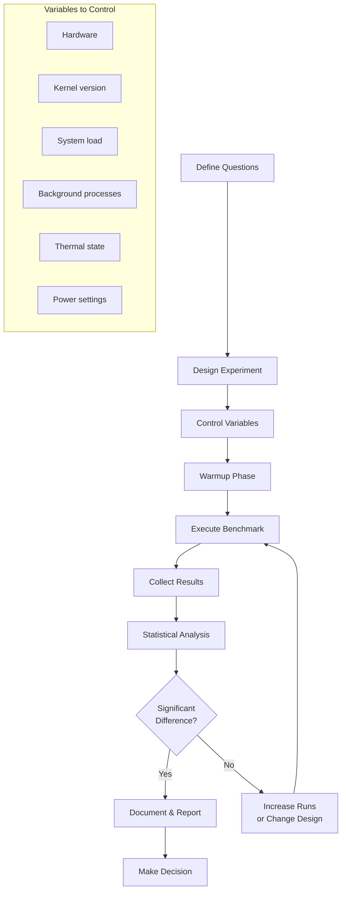
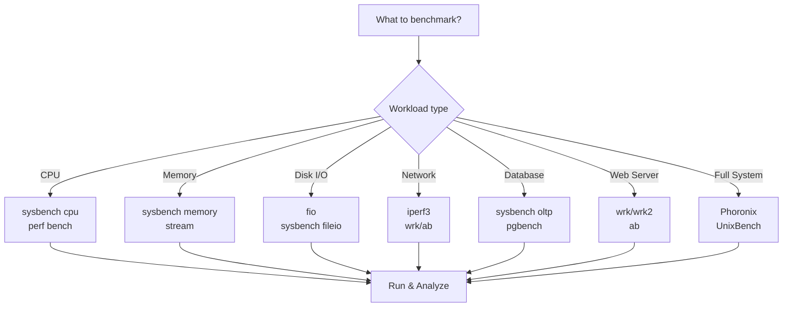
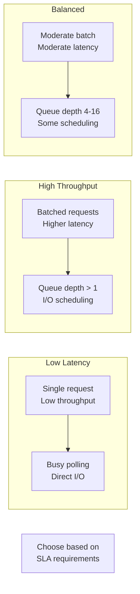

# Chapter 244: Benchmarking Methodology — Phoronix, sysbench, fio, wrk, ab, Proper Methodology

## 1. Intuition

Benchmarking is the practice of measuring system performance under controlled conditions. It's how we answer questions like "Is this new kernel faster?", "Can this server handle our traffic?", or "Which cloud provider gives us the best price-performance ratio?" Yet despite being seemingly straightforward, benchmarking is one of the most commonly botched activities in systems engineering.

The fundamental challenge is that **benchmarking is measurement, and measurement is hard**. Every number you produce is only meaningful if you understand exactly what you measured, under what conditions, and what the number actually means. A benchmark result without context is worse than useless — it's actively misleading.

### Why Benchmarking Goes Wrong

Common benchmarking failures:

1. **Measuring the wrong thing**: Benchmarking throughput when the bottleneck is latency
2. **Wrong workload**: Using synthetic benchmarks that don't represent real usage
3. **Ignoring warmup**: First-run results are dominated by cold caches
4. **Not controlling variables**: Comparing results across different hardware, software, or load
5. **Small sample size**: Running once and reporting the number
6. **Survivorship bias**: Only reporting the best run
7. **Ignoring variability**: Not accounting for variance in results
8. **Wrong metrics**: Using averages instead of percentiles for latency
9. **Coordinated omission**: Load generator stops when server is slow
10. **Premature optimization**: Optimizing without understanding the bottleneck

### The Benchmarking Pyramid

```
                    ┌─────────┐
                    │ Your    │  ← Most relevant, hardest to get right
                    │ App     │
                    ├─────────┤
                    │ Realistic│  ← Good approximation
                    │ Workload│
                    ├─────────┤
                    │ Standard │  ← Comparable across systems
                    │ Benchmark│
                    ├─────────┤
                    │ Micro-   │  ← Least relevant, easiest to run
                    │ benchmark│
                    └─────────┘

Always prefer benchmarks higher in the pyramid.
Micro-benchmarks are useful for understanding, not for decisions.
```

### What Makes a Good Benchmark?

A good benchmark is:

1. **Relevant**: Measures what matters for your use case
2. **Repeatable**: Same conditions produce similar results
3. **Representative**: Uses realistic workloads and data
4. **Controllable**: Variables are isolated and documented
5. **Statistically sound**: Multiple runs, confidence intervals, outlier analysis

## 2. Architecture

### Benchmarking Infrastructure

```
┌──────────────────────────────────────────────────────────────────┐
│  Benchmarking Setup                                              │
│                                                                  │
│  ┌─────────────────────────────────────────────────────────────┐ │
│  │  Load Generator (Client)                                    │ │
│  │  ┌──────────┐  ┌──────────┐  ┌──────────┐                  │ │
│  │  │ wrk/ab   │  │ sysbench │  │ fio      │                  │ │
│  │  │ (HTTP)   │  │ (DB)     │  │ (I/O)    │                  │ │
│  │  └─────┬────┘  └────┬─────┘  └────┬─────┘                  │ │
│  │        │            │             │                         │ │
│  │        └────────────┼─────────────┘                         │ │
│  │                     │                                       │ │
│  │              ┌──────▼──────┐                                │ │
│  │              │ Network     │                                │ │
│  │              │ (isolated)  │                                │ │
│  │              └──────┬──────┘                                │ │
│  └─────────────────────┼───────────────────────────────────────┘ │
│                        │                                         │
│  ┌─────────────────────▼───────────────────────────────────────┐ │
│  │  System Under Test (SUT)                                    │ │
│  │  ┌──────────┐  ┌──────────┐  ┌──────────┐                  │ │
│  │  │ CPU      │  │ Memory   │  │ Disk     │                  │ │
│  │  │ perf     │  │ vmstat   │  │ iostat   │                  │ │
│  │  └──────────┘  └──────────┘  └──────────┘                  │ │
│  │  ┌──────────┐  ┌──────────┐  ┌──────────┐                  │ │
│  │  │ Network  │  │ Scheduler│  │ Kernel   │                  │ │
│  │  │ sar -n   │  │ perf     │  │ tracing  │                  │ │
│  │  └──────────┘  └──────────┘  └──────────┘                  │ │
│  └─────────────────────────────────────────────────────────────┘ │
│                                                                  │
│  ┌─────────────────────────────────────────────────────────────┐ │
│  │  Data Collection & Analysis                                 │ │
│  │  ┌──────────┐  ┌──────────┐  ┌──────────┐                  │ │
│  │  │ Metrics  │  │ Logs     │  │ Profiles │                  │ │
│  │  │ (CSV)    │  │ (text)   │  │ (perf)   │                  │ │
│  │  └──────────┘  └──────────┘  └──────────┘                  │ │
│  └─────────────────────────────────────────────────────────────┘ │
└──────────────────────────────────────────────────────────────────┘
```

### The Benchmarking Process

```
┌──────────────────────────────────────────────────────────────────┐
│  1. Define Goals                                                 │
│  What question are we answering?                                │
│  "Can server X handle 10,000 requests/second at p99 < 100ms?"   │
├──────────────────────────────────────────────────────────────────┤
│  2. Design Experiment                                            │
│  What metrics? What workload? What duration?                    │
├──────────────────────────────────────────────────────────────────┤
│  3. Control Variables                                            │
│  Isolate CPU, memory, disk, network, kernel version              │
├──────────────────────────────────────────────────────────────────┤
│  4. Warmup                                                       │
│  Run warmup phase to fill caches, JIT, etc.                     │
├──────────────────────────────────────────────────────────────────┤
│  5. Execute                                                      │
│  Run benchmark multiple times, collect data                     │
├──────────────────────────────────────────────────────────────────┤
│  6. Analyze                                                      │
│  Statistical analysis, outlier detection, confidence intervals   │
├──────────────────────────────────────────────────────────────────┤
│  7. Report                                                       │
│  Document methodology, results, and limitations                  │
└──────────────────────────────────────────────────────────────────┘
```

## 3. Tools & Techniques

### Phoronix Test Suite

Phoronix Test Suite is the most comprehensive Linux benchmarking framework:

```bash
# Install
sudo apt install phoronix-test-suite

# List available tests
phoronix-test-suite list-available-suites

# Run a complete suite
phoronix-test-suite benchmark pts/cpu
phoronix-test-suite benchmark pts/memory
phoronix-test-suite benchmark pts/disk
phoronix-test-suite benchmark pts/network

# Run specific tests
phoronix-test-suite benchmark pts/compress-7zip
phoronix-test-suite benchmark pts/openssl
phoronix-test-suite benchmark pts/apache
phoronix-test-suite benchmark pts/postgresql

# Compare results
phoronix-test-suite benchmark pts/cpu  # Run and upload
phoronix-test-suite compare-results RESULT_FILE

# Automated batch mode
phoronix-test-suite batch-benchmark pts/cpu
phoronix-test-suite batch-run pts/cpu

# Custom test suite
cat > my_suite.xml << 'EOF'
<?xml version="1.0"?>
<PhoronixTestSuite>
  <Suite>
    <Title>My Custom Suite</Title>
    <Description>Custom benchmark suite for my workload</Description>
    <Execute>
      <Test>compress-7zip</Test>
      <Test>openssl</Test>
      <Test>fio</Test>
    </Execute>
  </Suite>
</PhoronixTestSuite>
EOF
phoronix-test-suite benchmark my_suite.xml

# Result analysis
phoronix-test-suite analyze-result <result_id>
```

### sysbench

sysbench is a modular, multi-threaded benchmark tool:

```bash
# Install
sudo apt install sysbench

# CPU benchmark
sysbench cpu --threads=8 --time=60 run

# Memory benchmark
sysbench memory --threads=8 --time=60 run
sysbench memory --threads=8 --memory-block-size=1M --memory-total-size=10G run

# File I/O benchmark
sysbench fileio --file-total-size=10G --file-test-mode=rndrw \
    --time=60 --threads=8 prepare
sysbench fileio --file-total-size=10G --file-test-mode=rndrw \
    --time=60 --threads=8 run
sysbench fileio --file-total-size=10G cleanup

# MySQL/PostgreSQL benchmark
# MySQL
sysbench oltp_read_write --mysql-user=root --mysql-password=pass \
    --mysql-db=test --tables=10 --table-size=1000000 \
    --threads=32 --time=300 prepare
sysbench oltp_read_write --mysql-user=root --mysql-password=pass \
    --mysql-db=test --tables=10 --table-size=1000000 \
    --threads=32 --time=300 run
sysbench oltp_read_write --mysql-user=root --mysql-password=pass \
    --mysql-db=test cleanup

# PostgreSQL
sysbench oltp_read_write --pgsql-user=postgres --pgsql-db=test \
    --tables=10 --table-size=1000000 --threads=32 --time=300 run

# Thread benchmark
sysbench threads --threads=256 --time=60 run

# Mutex benchmark
sysbench mutex --threads=256 --mutex-num=4096 --time=60 run

# Key sysbench options:
# --threads=N: Number of threads
# --time=N: Duration in seconds
# --report-interval=N: Print stats every N seconds
# --histogram: Enable latency histogram
# --percentile=N: Percentile to report (default: 95)
```

**sysbench OLTP workloads:**

| Workload | Description | Use Case |
|----------|-------------|----------|
| `oltp_read_write` | Mixed read/write | General OLTP |
| `oltp_read_only` | Read-only | Read-heavy OLTP |
| `oltp_write_only` | Write-only | Write-heavy OLTP |
| `oltp_point_select` | Single-row lookups | Key-value workload |
| `oltp_insert` | Inserts only | Write-intensive |
| `oltp_update_index` | Updates with index | Update-heavy |
| `oltp_delete` | Deletes | Cleanup benchmark |

### fio

fio is the standard I/O benchmarking tool:

```bash
# Sequential read
fio --name=seq-read --rw=read --bs=128k --size=4G --numjobs=4 \
    --ioengine=libaio --direct=1 --iodepth=32 --runtime=60 \
    --group_reporting --output-format=json

# Random read
fio --name=rand-read --rw=randread --bs=4k --size=4G --numjobs=8 \
    --ioengine=libaio --direct=1 --iodepth=64 --runtime=60 \
    --group_reporting --lat_percentiles=1

# Mixed workload
fio --name=mixed --rw=randrw --rwmixread=70 --bs=8k --size=10G \
    --numjobs=8 --ioengine=libaio --direct=1 --iodepth=64 \
    --runtime=120 --group_reporting --lat_percentiles=1

# Latency test
fio --name=latency --rw=randread --bs=4k --size=1G --numjobs=1 \
    --ioengine=io_uring --direct=1 --iodepth=1 --runtime=60 \
    --lat_percentiles=1 --percentile_list=1:5:10:20:30:40:50:60:70:80:90:95:99:99.9:99.99

# Job file for complex workloads
cat > benchmark.fio << 'EOF'
[global]
ioengine=libaio
direct=1
size=4G
runtime=60
time_based
group_reporting
lat_percentiles=1

[seq-read]
rw=read
bs=128k
numjobs=4

[rand-read-4k]
rw=randread
bs=4k
numjobs=8
iodepth=64

[rand-write-4k]
rw=randwrite
bs=4k
numjobs=4
iodepth=32

[mixed-70-30]
rw=randrw
rwmixread=70
bs=8k
numjobs=8
iodepth=64
EOF

fio benchmark.fio
```

### wrk and wrk2

wrk is a modern HTTP benchmarking tool:

```bash
# Install
sudo apt install wrk

# Basic HTTP benchmark
wrk -t4 -c100 -d30s http://localhost:8080/

# With latency distribution
wrk -t4 -c100 -d30s --latency http://localhost:8080/api/data

# With Lua script for complex scenarios
cat > post.lua << 'EOF'
wrk.method = "POST"
wrk.body = '{"key": "value"}'
wrk.headers["Content-Type"] = "application/json"
EOF
wrk -t4 -c100 -d30s -s post.lua http://localhost:8080/api/data

# wrk2 (constant-throughput, avoids coordinated omission)
wrk2 -t4 -c100 -R1000 -d30s --latency http://localhost:8080/
# -R1000: Send 1000 requests/second regardless of response time

# wrk options:
# -t: Number of threads
# -c: Number of connections
# -d: Duration
# -R: Requests per second (wrk2 only)
# --latency: Show latency distribution
# -s: Lua script
# -H: Add header
# --timeout: Socket timeout
```

### ab (Apache Bench)

```bash
# Install
sudo apt install apache2-utils

# Basic benchmark
ab -n 10000 -c 100 http://localhost:8080/

# With POST data
ab -n 10000 -c 100 -p post_data.json -T application/json http://localhost:8080/api/

# Keep-alive connections
ab -n 10000 -c 100 -k http://localhost:8080/

# Custom headers
ab -n 10000 -c 100 -H "Authorization: Bearer token" http://localhost:8080/

# ab options:
# -n: Total number of requests
# -c: Number of concurrent requests
# -k: Use HTTP keep-alive
# -p: POST data file
# -T: Content-Type header
# -H: Custom header
# -s: Timeout in seconds
# -t: Timelimit in seconds

# ab output includes:
# Requests per second
# Time per request (mean)
# Transfer rate
# Percentage of requests served within X ms (table)
```

### Additional Benchmarking Tools

```bash
# perf bench — Kernel benchmarks
perf bench sched messaging    # Scheduler messaging benchmark
perf bench sched pipe         # Scheduler pipe benchmark
perf bench mem memcpy          # Memory copy benchmark
perf bench mem memset          # Memory memset benchmark
perf bench numa                # NUMA benchmark
perf bench futex hash          # Futex hash benchmark
perf bench futex wake          # Futex wake benchmark

# stress-ng — System stress testing
stress-ng --cpu 8 --io 4 --vm 2 --vm-bytes 1G --timeout 60s
stress-ng --cpu 8 --metrics-brief --timeout 60s

# iperf3 — Network throughput
iperf3 -s  # Server
iperf3 -c server_ip -t 30 -P 8  # Client, 8 parallel streams
iperf3 -c server_ip -t 30 -R    # Reverse mode (server to client)

# netperf — Network latency
netperf -H server_ip -t TCP_STREAM  # Throughput
netperf -H server_ip -t TCP_RR      # Request-response latency

# pgbench — PostgreSQL benchmark
pgbench -i -s 100 testdb  # Initialize
pgbench -c 32 -j 8 -T 300 testdb  # Run

# mysqlslap — MySQL benchmark
mysqlslap --auto-generate-sql --concurrency=32 --iterations=10 \
    --number-of-queries=100000

# UnixBench — System-wide benchmark
# Install and run
./Run

# tinymembench — Memory bandwidth benchmark
./tinymembench

# stream — Memory bandwidth
./stream

# lmbench — Micro-benchmarks
# lat_ctx: Context switch latency
# lat_proc: Process creation latency
# lat_syscall: System call latency
# bw_mem: Memory bandwidth
```

## 4. Source Code References

### Phoronix Test Suite

```
pts-core/                    — Core framework
pts-core/objects/            — Test objects
pts-core/commands/           — CLI commands
```

### sysbench

```
src/                         — Source code
src/sb_counter.c             — Counter implementation
src/sb_timer.c               — Timer implementation
src/tests/                   — Built-in tests
src/tests/cpu/               — CPU test
src/tests/memory/            — Memory test
src/tests/fileio/            — File I/O test
src/tests/oltp/              — OLTP test
```

### fio

```
fio.c                        — Main entry point
ioengines/                   — I/O engines
ioengines/libaio.c           — Linux AIO
ioengines/io_uring.c         — io_uring
ioengines/sync.c             — Synchronous I/O
stat.c                       — Statistics
init.c                       — Initialization
```

### wrk

```
src/                         — Source code
src/wrk.c                    — Main entry point
src/net.c                    — Networking
src/ssl.c                    — SSL support
scripts/                     — Lua scripts
```

## 5. Examples

### Example 1: Complete Web Server Benchmark

```bash
#!/bin/bash
# benchmark_webserver.sh — Comprehensive web server benchmark

set -e

SERVER_URL="http://localhost:8080/api/data"
DURATION=60
RESULTS_DIR="benchmark_results_$(date +%Y%m%d_%H%M%S)"
mkdir -p "$RESULTS_DIR"

echo "Starting benchmark suite..."
echo "Server: $SERVER_URL"
echo "Duration: ${DURATION}s"
echo "Results: $RESULTS_DIR"

# 1. Warmup
echo "=== Warmup ==="
wrk -t2 -c10 -d10s "$SERVER_URL" > /dev/null 2>&1

# 2. Throughput test (max throughput)
echo "=== Throughput Test ==="
wrk -t4 -c200 -d${DURATION}s --latency "$SERVER_URL" \
    > "$RESULTS_DIR/throughput.txt" 2>&1

# 3. Latency test (constant rate)
echo "=== Latency Test (1000 req/s) ==="
wrk2 -t4 -c100 -R1000 -d${DURATION}s --latency "$SERVER_URL" \
    > "$RESULTS_DIR/latency_1000.txt" 2>&1

# 4. Latency test (higher rate)
echo "=== Latency Test (5000 req/s) ==="
wrk2 -t4 -c100 -R5000 -d${DURATION}s --latency "$SERVER_URL" \
    > "$RESULTS_DIR/latency_5000.txt" 2>&1

# 5. Concurrency scaling test
echo "=== Concurrency Scaling ==="
for c in 1 10 50 100 200 500; do
    echo "  Concurrency: $c"
    wrk -t4 -c${c} -d30s --latency "$SERVER_URL" \
        > "$RESULTS_DIR/concurrency_${c}.txt" 2>&1
done

# 6. Collect system metrics during benchmark
echo "=== System Metrics ==="
iostat -x 1 > "$RESULTS_DIR/iostat.txt" &
IOSTAT_PID=$!
vmstat 1 > "$RESULTS_DIR/vmstat.txt" &
VMSTAT_PID=$!
mpstat -P ALL 1 > "$RESULTS_DIR/mpstat.txt" &
MPSTAT_PID=$!

# Run a final benchmark while collecting metrics
wrk -t4 -c200 -d${DURATION}s "$SERVER_URL" > /dev/null 2>&1

kill $IOSTAT_PID $VMSTAT_PID $MPSTAT_PID 2>/dev/null || true

# 7. Generate summary
echo "=== Summary ==="
echo "Throughput results:"
grep "Requests/sec" "$RESULTS_DIR/throughput.txt"

echo ""
echo "Latency distribution (1000 req/s):"
grep -A 10 "Latency Distribution" "$RESULTS_DIR/latency_1000.txt"

echo ""
echo "Results saved to: $RESULTS_DIR"
```

### Example 2: Database Benchmark

```bash
#!/bin/bash
# benchmark_database.sh — Database benchmark suite

DB_TYPE="mysql"  # or postgresql
DB_USER="root"
DB_PASS="password"
DB_NAME="benchmark"
TABLES=10
TABLE_SIZE=1000000
THREADS="1 4 8 16 32 64 128"
DURATION=300

echo "=== Database Benchmark ==="
echo "Type: $DB_TYPE"
echo "Tables: $TABLES, Size: $TABLE_SIZE"
echo "Duration: ${DURATION}s per test"

# Prepare
echo "Preparing data..."
sysbench oltp_read_write \
    --${DB_TYPE}-user=$DB_USER \
    --${DB_TYPE}-password=$DB_PASS \
    --${DB_TYPE}-db=$DB_NAME \
    --tables=$TABLES \
    --table-size=$TABLE_SIZE \
    prepare

# Run benchmarks
for workload in oltp_read_only oltp_read_write oltp_write_only oltp_point_select; do
    echo ""
    echo "=== Workload: $workload ==="
    for t in $THREADS; do
        echo "  Threads: $t"
        sysbench $workload \
            --${DB_TYPE}-user=$DB_USER \
            --${DB_TYPE}-password=$DB_PASS \
            --${DB_TYPE}-db=$DB_NAME \
            --tables=$TABLES \
            --table-size=$TABLE_SIZE \
            --threads=$t \
            --time=$DURATION \
            --report-interval=10 \
            --histogram \
            run > "results_${workload}_${t}threads.txt" 2>&1
        
        # Extract key metrics
        qps=$(grep "queries:" "results_${workload}_${t}threads.txt" | awk '{print $3}' | tr -d '(')
        p95=$(grep "95th percentile:" "results_${workload}_${t}threads.txt" | awk '{print $3}')
        echo "    QPS: $qps, p95: ${p95}ms"
    done
done

# Cleanup
sysbench oltp_read_write \
    --${DB_TYPE}-user=$DB_USER \
    --${DB_TYPE}-password=$DB_PASS \
    --${DB_TYPE}-db=$DB_NAME \
    --tables=$TABLES \
    cleanup
```

### Example 3: Storage Benchmark

```bash
#!/bin/bash
# benchmark_storage.sh — Comprehensive storage benchmark

DEVICE="/dev/nvme0n1"
MOUNT="/mnt/benchmark"
RESULTS_DIR="storage_benchmark_$(date +%Y%m%d)"
mkdir -p "$RESULTS_DIR"

# Create filesystem
sudo mkfs.ext4 -F $DEVICE
sudo mount $DEVICE $MOUNT
sudo chmod 777 $MOUNT

echo "=== Storage Benchmark ==="
echo "Device: $DEVICE"
echo "Mount: $MOUNT"

# Sequential read/write
for bs in 4k 8k 16k 64k 128k 256k 1m 4m; do
    echo "=== Block Size: $bs ==="
    
    # Sequential write
    fio --name="seq_write_${bs}" --directory=$MOUNT \
        --rw=write --bs=$bs --size=4G --numjobs=4 \
        --ioengine=libaio --direct=1 --iodepth=32 \
        --runtime=30 --group_reporting --output-format=json \
        > "$RESULTS_DIR/seq_write_${bs}.json"
    
    # Sequential read
    sudo sh -c 'echo 3 > /proc/sys/vm/drop_caches'
    fio --name="seq_read_${bs}" --directory=$MOUNT \
        --rw=read --bs=$bs --size=4G --numjobs=4 \
        --ioengine=libaio --direct=1 --iodepth=32 \
        --runtime=30 --group_reporting --output-format=json \
        > "$RESULTS_DIR/seq_read_${bs}.json"
done

# Random read/write at different queue depths
for qd in 1 4 16 32 64 128; do
    echo "=== Queue Depth: $qd ==="
    
    # Random read
    fio --name="rand_read_qd${qd}" --directory=$MOUNT \
        --rw=randread --bs=4k --size=4G --numjobs=4 \
        --ioengine=libaio --direct=1 --iodepth=$qd \
        --runtime=30 --group_reporting --lat_percentiles=1 \
        --output-format=json > "$RESULTS_DIR/rand_read_qd${qd}.json"
done

# Cleanup
sudo umount $MOUNT

# Generate summary
python3 << 'EOF'
import json
import os

results_dir = "storage_benchmark_$(date +%Y%m%d)"
print(f"{'Block Size':>10} {'Seq Write MB/s':>15} {'Seq Read MB/s':>15}")
print("-" * 45)

for bs in ['4k', '8k', '16k', '64k', '128k', '256k', '1m', '4m']:
    try:
        with open(f"{results_dir}/seq_write_{bs}.json") as f:
            w = json.load(f)['jobs'][0]['write']
        with open(f"{results_dir}/seq_read_{bs}.json") as f:
            r = json.load(f)['jobs'][0]['read']
        print(f"{bs:>10} {w['bw']/1024:>15.0f} {r['bw']/1024:>15.0f}")
    except:
        pass
EOF
```

### Example 4: Statistical Analysis of Benchmark Results

```python
#!/usr/bin/env python3
# analyze_benchmark.py — Statistical analysis of benchmark results

import sys
import numpy as np
from scipy import stats

def analyze_results(values, name=""):
    """Analyze a set of benchmark measurements."""
    arr = np.array(values)
    
    print(f"\n=== {name} ===")
    print(f"N:           {len(arr)}")
    print(f"Mean:        {np.mean(arr):.2f}")
    print(f"Median:      {np.median(arr):.2f}")
    print(f"Std Dev:     {np.std(arr):.2f}")
    print(f"Min:         {np.min(arr):.2f}")
    print(f"Max:         {np.max(arr):.2f}")
    print(f"p5:          {np.percentile(arr, 5):.2f}")
    print(f"p25:         {np.percentile(arr, 25):.2f}")
    print(f"p75:         {np.percentile(arr, 75):.2f}")
    print(f"p95:         {np.percentile(arr, 95):.2f}")
    print(f"p99:         {np.percentile(arr, 99):.2f}")
    
    # 95% confidence interval for the mean
    ci = stats.t.interval(0.95, len(arr)-1, loc=np.mean(arr), 
                          scale=stats.sem(arr))
    print(f"95% CI:      [{ci[0]:.2f}, {ci[1]:.2f}]")
    
    # Check for outliers (IQR method)
    q1, q3 = np.percentile(arr, [25, 75])
    iqr = q3 - q1
    lower = q1 - 1.5 * iqr
    upper = q3 + 1.5 * iqr
    outliers = arr[(arr < lower) | (arr > upper)]
    print(f"Outliers:    {len(outliers)} ({100*len(outliers)/len(arr):.1f}%)")
    
    # Normality test (Shapiro-Wilk)
    if len(arr) >= 8:
        stat, p = stats.shapiro(arr)
        print(f"Normality:   p={p:.4f} ({'Normal' if p > 0.05 else 'Not normal'})")

# Example usage
# Read values from file or stdin
values = [float(line.strip()) for line in sys.stdin if line.strip()]
analyze_results(values, "Benchmark Results")
```

### Example 5: Comparing Two Configurations

```python
#!/usr/bin/env python3
# compare_benchmarks.py — Compare two benchmark configurations

import sys
import numpy as np
from scipy import stats

def compare(before, after, name=""):
    """Compare two sets of benchmark measurements."""
    a = np.array(before)
    b = np.array(after)
    
    print(f"\n=== {name} ===")
    print(f"Before: mean={np.mean(a):.2f}, n={len(a)}")
    print(f"After:  mean={np.mean(b):.2f}, n={len(b)}")
    
    # Improvement
    improvement = (np.mean(b) - np.mean(a)) / np.mean(a) * 100
    print(f"Change: {improvement:+.1f}%")
    
    # Statistical significance (t-test)
    t_stat, p_value = stats.ttest_ind(a, b)
    print(f"t-test: t={t_stat:.3f}, p={p_value:.4f}")
    
    if p_value < 0.05:
        if improvement > 0:
            print("Result: SIGNIFICANT IMPROVEMENT")
        else:
            print("Result: SIGNIFICANT REGRESSION")
    else:
        print("Result: NOT SIGNIFICANT (p > 0.05)")
    
    # Effect size (Cohen's d)
    pooled_std = np.sqrt((np.std(a)**2 + np.std(b)**2) / 2)
    cohens_d = (np.mean(b) - np.mean(a)) / pooled_std
    print(f"Effect size (Cohen's d): {cohens_d:.2f}")
    if abs(cohens_d) < 0.2:
        print("  → Small effect")
    elif abs(cohens_d) < 0.8:
        print("  → Medium effect")
    else:
        print("  → Large effect")

# Example
before = [100, 102, 98, 101, 99, 103, 97, 100, 101, 99]
after = [110, 112, 108, 111, 109, 113, 107, 110, 111, 109]
compare(before, after, "QPS")
```

## 6. Diagrams

### Benchmarking Methodology



### Tool Selection Flowchart



### Latency vs Throughput Trade-off



## 7. Common Pitfalls

### 1. Benchmarking on a Shared System

```bash
# Problem: Other processes interfere with results
# A cron job runs during the benchmark, results are skewed

# Solution: Control the environment
# - Use a dedicated system
# - Disable unnecessary services
# - Stop cron jobs
# - Monitor for interference

# Check for interference:
sar -u 1  # CPU usage
iostat -x 1  # Disk usage
iftop  # Network usage
```

### 2. Not Warming Up

```bash
# Problem: First results are slow (cold cache, JIT, etc.)
# Average includes cold-start results

# Solution: Add warmup phase
fio --name=test --rw=randread --bs=4k --runtime=120 --ramp_time=30 ...
# --ramp_time=30: Run 30 seconds before measuring

# For web servers:
wrk -t4 -c100 -d10s http://localhost/ > /dev/null  # Warmup
wrk -t4 -c100 -d60s --latency http://localhost/   # Actual test
```

### 3. Using Averages for Latency

```bash
# Problem: "Average latency is 5ms" hides the 1% at 500ms
# Always report percentiles

# Solution: Use tools that report percentiles
fio --lat_percentiles=1 ...
wrk --latency ...
# Or calculate from histograms
```

### 4. Benchmarking the Wrong Thing

```bash
# Problem: Benchmarking I/O when the bottleneck is CPU
# Or benchmarking network when the bottleneck is database

# Solution: Profile first to identify the bottleneck
perf stat ./my_program
iostat -x 1
sar -n DEV 1

# Then benchmark the bottleneck
```

### 5. Not Controlling for Thermal Throttling

```bash
# Problem: CPU throttles during long benchmarks
# Results get worse over time

# Solution: Monitor temperature
sensors  # Or: cat /sys/class/thermal/thermal_zone*/temp

# Use consistent thermal conditions
# - Run benchmarks in a cool environment
# - Wait for cooldown between runs
# - Use shorter benchmark durations
```

### 6. Single Run Results

```bash
# Problem: Running once and reporting the number
# Variance can be 10-30% between runs

# Solution: Run multiple times and analyze statistically
for i in $(seq 1 10); do
    wrk -t4 -c100 -d30s http://localhost/ 2>&1 | grep "Requests/sec" >> results.txt
done

# Calculate mean, std dev, confidence interval
python3 -c "
import numpy as np
from scipy import stats
values = [float(line.split()[1]) for line in open('results.txt')]
print(f'Mean: {np.mean(values):.0f} ± {np.std(values):.0f}')
ci = stats.t.interval(0.95, len(values)-1, loc=np.mean(values), scale=stats.sem(values))
print(f'95% CI: [{ci[0]:.0f}, {ci[1]:.0f}]')
"
```

### 7. Comparing Apples to Oranges

```bash
# Problem: Comparing results from different:
# - Hardware (different CPUs, different RAM)
# - Software (different kernel versions, different library versions)
# - Configuration (different sysctl settings, different compiler flags)
# - Workloads (different data sizes, different request patterns)

# Solution: Document ALL variables
# Use the same hardware, software, configuration, and workload
# Or use a consistent baseline for comparison
```

### 8. Ignoring Coordinated Omission

```bash
# Problem: Load generator stops sending when server is slow
# This "coordinates" with the server, omitting slow responses

# Solution: Use open-loop load generators
wrk2 -R1000 -d60s http://localhost/  # Constant rate
# wrk2 sends 1000 req/s regardless of response time

# Or use hey:
hey -q 1000 -z 60s http://localhost/
```

### 9. Not Benchmarking with Realistic Data

```bash
# Problem: Using small datasets that fit in cache
# Or using random data when real data has patterns

# Solution: Use production-like data
# - Same data volume
# - Same data distribution
# - Same access patterns
# - Same concurrent user count
```

### 10. Cherry-Picking Results

```bash
# Problem: Running 10 benchmarks and reporting only the best
# This is dishonest and misleading

# Solution: Report ALL results, including:
# - Median (not just best/worst)
# - Variance
# - Outliers
# - Conditions that affected results
# - Failures and anomalies
```

## 8. Best Practices

### 1. Define Clear Goals

```bash
# Before benchmarking, answer:
# 1. What question are we answering?
#    "Can this server handle 10K req/s at p99 < 100ms?"
# 2. What metric matters?
#    Throughput? Latency? Both?
# 3. What is the acceptance criteria?
#    "QPS > 10,000 AND p99 < 100ms"
```

### 2. Control All Variables

```bash
# Document and control:
# - Hardware: CPU model, RAM size, disk type, NIC speed
# - Software: Kernel version, library versions, compiler flags
# - Configuration: sysctl, ulimit, cgroup limits
# - Environment: Temperature, power, network conditions
# - Workload: Data size, access pattern, concurrency

# Create a benchmark configuration file:
cat > benchmark_config.md << 'EOF'
# Benchmark Configuration
- Hardware: Intel Xeon E5-2680 v4, 256GB RAM, NVMe SSD
- Kernel: 5.15.0-76-generic
- Compiler: GCC 11.3.0, -O2
- sysctl: net.core.somaxconn=65535, vm.swappiness=10
- Environment: 22°C, dedicated network
EOF
```

### 3. Warm Up Properly

```bash
# Warmup phase should:
# - Fill caches (page cache, CPU cache)
# - Trigger JIT compilation
# - Reach steady state

# Duration depends on workload:
# - CPU: 5-10 seconds
# - I/O: 30-60 seconds (fill page cache)
# - Database: 60-300 seconds (fill buffer pool)
# - Web: 10-30 seconds

# fio: --ramp_time=N
# wrk: Run a separate short test first
# sysbench: Use --warmup-time=N
```

### 4. Run Multiple Times

```bash
# Minimum: 3 runs
# Recommended: 5-10 runs
# For high variance: 20+ runs

# Calculate statistics:
# - Mean (central tendency)
# - Median (robust to outliers)
# - Standard deviation (variability)
# - 95% confidence interval (uncertainty)
# - Outlier detection (IQR or z-score)
```

### 5. Report Results Honestly

```bash
# Good report includes:
# 1. Methodology (how you benchmarked)
# 2. Configuration (all variables)
# 3. Raw data (all measurements)
# 4. Statistical analysis (mean, median, CI, outliers)
# 5. Limitations (what you couldn't control)
# 6. Conclusions (what the data means)
```

### 6. Use Standard Tools

```bash
# Prefer well-known tools:
# CPU: sysbench cpu, perf bench
# Memory: sysbench memory, stream
# I/O: fio, sysbench fileio
# Network: iperf3, netperf, wrk
# Database: sysbench oltp, pgbench
# Web: wrk, wrk2, ab, hey
# System: Phoronix Test Suite, UnixBench

# These tools are:
# - Well-documented
# - Widely used
# - Regularly updated
# - Results are comparable across systems
```

### 7. Automate Benchmarking

```bash
#!/bin/bash
# automated_benchmark.sh — Repeatable benchmark suite

set -e

RUNS=5
RESULTS_DIR="benchmark_$(date +%Y%m%d_%H%M%S)"
mkdir -p "$RESULTS_DIR"

for run in $(seq 1 $RUNS); do
    echo "Run $run/$RUNS"
    
    # Clear caches
    sudo sh -c 'echo 3 > /proc/sys/vm/drop_caches'
    sleep 2
    
    # Run benchmark
    wrk -t4 -c100 -d30s --latency http://localhost/ \
        > "$RESULTS_DIR/run_${run}.txt" 2>&1
    
    # Cooldown
    sleep 10
done

# Analyze results
python3 analyze_results.py "$RESULTS_DIR"
```

## 9. Exercises

### Exercise 1: Web Server Benchmark
```bash
# Benchmark a web server (nginx, apache, or your app)
wrk -t4 -c100 -d60s --latency http://localhost/

# Questions:
# 1. What is the maximum throughput?
# 2. What is the p99 latency?
# 3. Run with different concurrency levels. How does throughput scale?
```

### Exercise 2: Storage Benchmark
```bash
# Benchmark storage with fio
fio --name=randread --rw=randread --bs=4k --size=1G \
    --ioengine=libaio --direct=1 --iodepth=32 --numjobs=4 \
    --runtime=60 --lat_percentiles=1

# Questions:
# 1. What is the IOPS?
# 2. What is the p99 latency?
# 3. Compare with different block sizes (4k, 8k, 16k, 64k)
```

### Exercise 3: Statistical Analysis
```bash
# Run a benchmark 10 times and analyze statistically
for i in $(seq 1 10); do
    sysbench cpu --threads=8 --time=30 run 2>&1 \
        | grep "events per second" | awk '{print $NF}' >> cpu_results.txt
done

# Calculate statistics
python3 -c "
import numpy as np
from scipy import stats
values = [float(line.strip()) for line in open('cpu_results.txt')]
print(f'Mean: {np.mean(values):.2f}')
print(f'Std Dev: {np.std(values):.2f}')
print(f'95% CI: {stats.t.interval(0.95, len(values)-1, loc=np.mean(values), scale=stats.sem(values))}')
"

# Questions:
# 1. What is the variance between runs?
# 2. Is the variance acceptable (< 5%)?
# 3. What could cause variance?
```

### Exercise 4: Database Benchmark
```bash
# Benchmark a database with sysbench
sysbench oltp_read_write --mysql-user=root --tables=10 \
    --table-size=100000 --threads=32 --time=120 run

# Questions:
# 1. What is the QPS (queries per second)?
# 2. What is the p95 latency?
# 3. How does performance change with thread count?
```

### Exercise 5: Methodology Comparison
```bash
# Compare benchmarking methodologies
# Method 1: Single run
wrk -t4 -c100 -d30s http://localhost/ 2>&1 | grep "Requests/sec"

# Method 2: Multiple runs
for i in $(seq 1 5); do
    wrk -t4 -c100 -d30s http://localhost/ 2>&1 | grep "Requests/sec"
done

# Method 3: With warmup
wrk -t4 -c100 -d10s http://localhost/ > /dev/null  # Warmup
for i in $(seq 1 5); do
    wrk -t4 -c100 -d30s http://localhost/ 2>&1 | grep "Requests/sec"
done

# Questions:
# 1. Which method gives the most reliable results?
# 2. What is the difference between the methods?
# 3. What is the proper way to report the results?
```

## 10. References

1. **Phoronix Test Suite**: https://www.phoronix-test-suite.com/
2. **sysbench**: https://github.com/akopytov/sysbench
3. **fio**: https://fio.readthedocs.io/
4. **wrk**: https://github.com/wg/wrk
5. **wrk2**: https://github.com/giltene/wrk2
6. **ab (Apache Bench)**: https://httpd.apache.org/docs/2.4/programs/ab.html
7. **iperf3**: https://iperf.fr/
8. **netperf**: https://github.com/HewlettPackard/netperf
9. **Brendan Gregg - Benchmarking**: https://www.brendangregg.com/blog/2018-06-30/benchmarking.html
10. **"Systems Performance" by Brendan Gregg**: Chapter 2 - Methodology
11. **Gil Tene - "How NOT to Measure Latency"**: https://www.youtube.com/watch?v=lJ8ydIuPFeU
12. **Google SRE Book - Monitoring**: https://sre.google/sre-book/practical-alerting/
13. **USE Method**: https://www.brendangregg.com/usemethod.html
14. **RED Method**: https://www.weave.works/blog/the-red-method-key-metrics-for-microservices-architecture/
