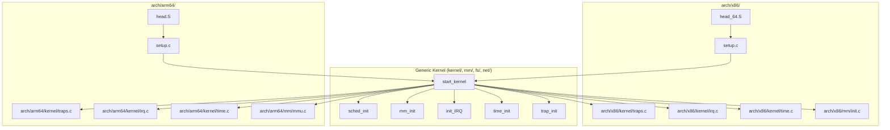
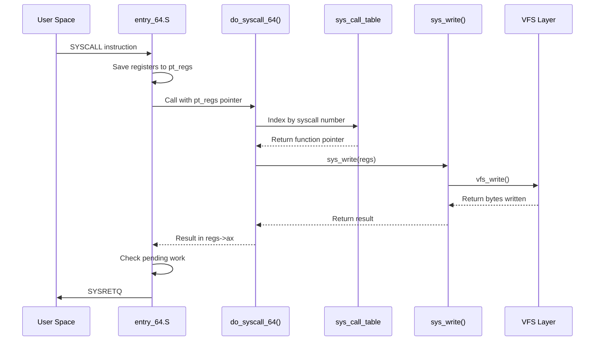
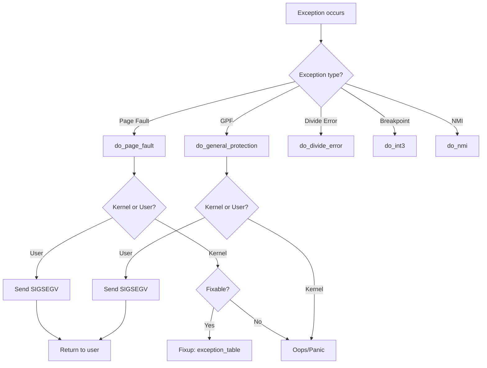
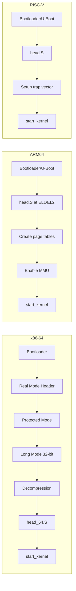
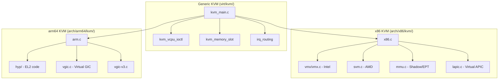

# Chapter 245: arch/ — Architecture-Specific Code: x86, arm64, Entry Points, Syscall Tables

## 1. Introduction and Intuition

The Linux kernel is designed to run on a remarkable variety of processor architectures — from the ubiquitous x86-64 desktop and server CPUs to ARM64 mobile chips, RISC-V experimental boards, MIPS routers, and even s390 mainframes. The `arch/` directory is the kernel's mechanism for handling this diversity. It contains all the architecture-specific code that cannot be shared across platforms, serving as the bridge between the generic kernel subsystems and the peculiarities of each CPU family.

The fundamental insight behind `arch/` is the principle of **hardware abstraction through code organization**. Rather than littering generic kernel code with `#ifdef CONFIG_X86` conditionals, the kernel isolates platform-dependent code into separate directories. The generic kernel code calls well-defined interfaces (like `asm/` headers and architecture-specific function implementations), and each architecture provides its own implementation of those interfaces.

Think of `arch/` as a set of "adapter plugs." The generic kernel is an appliance that expects a standard power outlet. Each architecture provides its own plug adapter — the appliance doesn't need to know the shape of the wall socket, only that the adapter will deliver the right voltage.

### 1.1 What Lives in arch/

Each architecture directory typically contains:

- **Boot code**: The very first instructions that execute when the kernel starts
- **Entry/exit code**: How the kernel handles transitions from user space to kernel space (syscalls, interrupts, exceptions)
- **Syscall tables**: The mapping from syscall numbers to handler functions
- **Memory management helpers**: TLB flushing, page table manipulation, cache management
- **Interrupt handling**: Architecture-specific interrupt controller interfaces
- **Time and clock**: How the kernel reads the hardware clock, handles timer interrupts
- **Signal delivery**: How signals are pushed onto the user-space stack
- **ptrace**: Architecture-specific debugging support
- **Platform initialization**: SMP bring-up, device enumeration, firmware interfaces

### 1.2 Design Philosophy

The kernel's architecture abstraction has evolved over decades. Early versions had far more `#ifdef` spaghetti. Modern kernels have moved toward a cleaner model:

1. **`asm-generic/`** provides default implementations for common operations
2. Each architecture overrides only what it must
3. **Kconfig** selects the active architecture at build time
4. **`include/asm/`** is a symlink that points to the active architecture's headers

This design allows a single kernel source tree to target dozens of platforms while keeping the generic code clean and maintainable.

---

## 2. Directory Layout

```
arch/
├── x86/                    # x86-32 and x86-64
│   ├── boot/               # Boot sector, setup code
│   ├── configs/            # Defconfig files
│   ├── crypto/             # x86-accelerated crypto implementations
│   ├── entry/              # Entry/exit code for syscalls, interrupts
│   ├── events/             # Performance monitoring (perf) support
│   ├── hypervisor/         # Hyper-V, Xen, KVM guest support
│   ├── include/
│   │   └── asm/            # x86-specific header files
│   ├── kernel/             # Core x86 kernel code
│   ├── kvm/                # KVM hypervisor (host side)
│   ├── lib/                # x86-optimized library functions
│   ├── math-emu/           # FPU emulation
│   ├── mm/                 # x86-specific memory management
│   ├── net/                # x86 network optimizations (BPF JIT)
│   ├── pci/                # x86 PCI quirks and setup
│   ├── platform/           # Specific platforms (OLPC, UV, etc.)
│   ├── power/              # ACPI, sleep states, hibernation
│   ├── tools/              # x86-specific build tools
│   └── video/              # Early video/framebuffer setup
│
├── arm64/                  # AArch64 (ARM 64-bit)
│   ├── boot/               # Image generation, device tree
│   ├── configs/            # Defconfig files
│   ├── crypto/             # ARM crypto extensions
│   ├── include/
│   │   └── asm/            # arm64-specific headers
│   ├── kernel/             # Core arm64 kernel code
│   ├── kvm/                # KVM for arm64
│   ├── lib/                # ARM-optimized library routines
│   ├── mm/                 # arm64 memory management
│   ├── net/                # BPF JIT for arm64
│   ├── pci/                # PCI/ECAM support
│   └── virt/               # Virtualization helpers
│
├── riscv/                  # RISC-V
├── mips/                   # MIPS
├── powerpc/                # PowerPC
├── s390/                   # IBM System/390
├── arm/                    # ARM (32-bit)
├── loongarch/              # Loongson
├── parisc/                 # HP PA-RISC
├── alpha/                  # DEC Alpha
├── ia64/                   # Intel Itanium
├── sparc/                  # Sun SPARC
├── um/                     # User-Mode Linux (runs kernel as process)
└── ...
```

### 2.1 The asm-generic/ Directory

```
arch/asm-generic/
├── asm-offsets.h
├── atomic.h
├── bitops.h
├── bug.h
├── cmpxchg.h
├── current.h
├── delay.h
├── div64.h
├── dma-mapping.h
├── fcntl.h
├── futex.h
├── ioctl.h
├── ipcbuf.h
├── irq.h
├── irqflags.h
├── kprobes.h
├── local.h
├── memory_model.h
├── mman.h
├── module.h
├── page.h
├── param.h
├── pci.h
├── preempt.h
├── scatterlist.h
├── sections.h
├── setup.h
├── shmbuf.h
├── signal.h
├── simd.h
├── socket.h
├── sockios.h
├── stat.h
├── statfs.h
├── string.h
├── switch_to.h
├── syscalls.h
├── termbits.h
├── termios.h
├── timex.h
├── tlb.h
├── topology.h
├── types.h
├── uaccess.h
├── unaligned.h
├──unistd.h
├── virttime.h
└── ...
```

This directory provides "default" implementations. An architecture can either use the generic version directly or override it with a specialized version. For example, `arch/x86/include/asm/current.h` overrides the generic version because x86 stores the current task pointer in a per-CPU register, which is faster than a memory lookup.

---

## 3. Key Files and Subsystems

### 3.1 x86 Architecture

#### 3.1.1 Boot Sequence: `arch/x86/boot/`

The x86 boot process is one of the most complex due to decades of backward compatibility:

| File | Purpose |
|------|---------|
| `header.S` | Real-mode header; contains the boot protocol header that the bootloader reads |
| `setup.S` | Legacy real-mode setup code (being phased out) |
| `main.c` | C-level boot setup: heap, video, CPU detection, memory detection |
| `pm.c` | Protected mode transition |
| `pmjump.S` | The actual jump from real mode to protected mode |
| `compressed/head_64.S` | 64-bit kernel decompression entry point |
| `compressed/misc.c` | Decompression routine (gzip, bzip2, LZMA, etc.) |

The boot flow on x86-64 is:

1. Bootloader (GRUB, systemd-boot) loads the kernel image
2. Real-mode header (`header.S`) validates the boot protocol version
3. `setup.S` / `main.c` performs early hardware detection in real mode
4. `pm.c` / `pmjump.S` switches to protected mode
5. `compressed/head_64.S` sets up initial 64-bit page tables and enters long mode
6. `compressed/misc.c` decompresses the kernel
7. Control transfers to `arch/x86/kernel/head_64.S` which sets up the final page tables and calls `start_kernel()`

#### 3.1.2 Entry Points: `arch/x86/entry/`

This is one of the most critical directories in the kernel. It defines how user-space programs enter kernel space:

| File | Purpose |
|------|---------|
| `entry_64.S` | Main 64-bit entry points for system calls, interrupts, exceptions |
| `entry_32.S` | 32-bit entry points (for compatibility mode) |
| `entry_64_compat.S` | Entry points for 32-bit programs running on a 64-bit kernel |
| `syscall_64.c` | C wrappers for 64-bit syscall dispatch |
| `syscall_32.c` | C wrappers for 32-bit syscall dispatch |
| `common.c` | Shared entry/exit helper functions |
| `thunk.S` | Various assembly thunks and helpers |

The syscall entry path on x86-64 is one of the most performance-critical code paths in the kernel. When a user program executes the `syscall` instruction:

1. The CPU saves `RIP` to `RCX`, `RFLAGS` to `R11`, and jumps to the address in `LSTAR` MSR
2. `entry_64.S` at the `entry_SYSCALL_64` label:
   - Saves all registers to a `pt_regs` structure on the kernel stack
   - Loads the kernel stack pointer from a per-CPU area
   - Calls `do_syscall_64()` via `syscall_dispatch`
   - On return, restores registers and executes `sysretq` to return to user space

The key assembly structure looks like:

```asm
SYM_CODE_START(entry_SYSCALL_64)
    /* Save user-space state */
    swapgs
    mov [gs:cpu_tss_rw.x86_tss.sp2], rsp  /* save user RSP */
    mov rsp, [gs:cpu_current_top_of_stack]
    
    /* Build pt_regs frame */
    push rdi
    push rsi
    push rdx
    push rcx    /* user RIP */
    push rax
    ...
    
    /* Dispatch syscall */
    mov rdi, rsp            /* pt_regs pointer */
    call do_syscall_64
    
    /* Return to user space */
    ...
    sysretq
SYM_CODE_END(entry_SYSCALL_64)
```

#### 3.1.3 Syscall Tables: `arch/x86/entry/syscalls/`

The syscall table maps system call numbers to their implementations:

| File | Purpose |
|------|---------|
| `syscall_64.tbl` | 64-bit syscall table (x86-64) |
| `syscall_32.tbl` | 32-bit syscall table (i386 compat) |

The format of `syscall_64.tbl`:

```
# <number>  <abi>   <name>           <entry point>
0           common  read             sys_read
1           common  write            sys_write
2           common  open             sys_open
3           common  close            sys_close
...
57          common  fork             sys_fork
59          common  execve           sys_execve
...
231         common  exit_group       sys_exit_group
...
```

At build time, the scripts `syscalltbl.sh` and `syscallhdr.sh` generate:
- `asm/syscalls_64.h` — declarations of all syscall functions
- `asm/unistd_64.h` — `#define __NR_read 0` etc.
- `asm/syscall_table.h` — the actual table array

The generated table is used by `do_syscall_64()`:

```c
__visible void do_syscall_64(struct pt_regs *regs)
{
    unsigned long nr = regs->orig_ax;
    
    if (nr < NR_syscalls) {
        nr = array_index_nospec(nr, NR_syscalls);
        regs->ax = sys_call_table[nr](regs);
    }
}
```

#### 3.1.4 Kernel Core: `arch/x86/kernel/`

| File | Purpose |
|------|---------|
| `head_64.S` | First code executed after decompression; sets up page tables, GDT, IDT |
| `setup.c` | Platform setup: E820 memory map, command line parsing, early devices |
| `smpboot.c` | SMP initialization: bringing up secondary CPUs |
| `process.c` | Context switching, `fork()` helpers |
| `signal.c` | Signal frame setup on user stack |
| `traps.c` | Exception handlers (page fault, GPF, divide-by-zero) |
| `irq.c` | IRQ management |
| `time.c` | Timekeeping infrastructure |
| `tsc.c` | TSC (Time Stamp Counter) calibration and reading |
| `cpuid.c` | CPU feature detection |
| `cpu/common.c` | Per-CPU initialization |
| `apic/apic.c` | Local APIC driver |
| `apic/io_apic.c` | I/O APIC driver |
| `reboot.c` | Reboot/shutdown handlers |
| `module.c` | Module loading helpers for x86 |
| `alternative.c` | Runtime patching of instructions (nop → optimized) |
| `paravirt.c` | Paravirtualization interface (Xen, KVM guests) |

#### 3.1.5 Memory Management: `arch/x86/mm/`

| File | Purpose |
|------|---------|
| `init.c` | Memory map initialization, zone sizing |
| `fault.c` | Page fault handler (`do_page_fault()`) |
| `ioremap.c` | I/O memory mapping |
| `pgtable.c` | Page table manipulation helpers |
| `tlb.c` | TLB flushing operations |
| `mmu_gather.c` | Batched TLB invalidation |
| `pat.c` | Page Attribute Table support |
| `numa.c` | NUMA topology detection |
| `kasan_init.c` | KASAN shadow memory setup |

#### 3.1.6 KVM (Kernel-based Virtual Machine): `arch/x86/kvm/`

| File | Purpose |
|------|---------|
| `x86.c` | Main KVM x86 code: vCPU creation, instruction emulation |
| `vmx/vmx.c` | Intel VMX (VT-x) implementation |
| `svm.c` | AMD SVM (AMD-V) implementation |
| `mmu.c` | Shadow page tables, EPT/NPT management |
| `irq.c` | Virtual interrupt injection |
| `lapic.c` | Virtual local APIC |
| `i8254.c` | Virtual PIT (Programmable Interval Timer) |
| `i8259.c` | Virtual PIC (Programmable Interrupt Controller) |

### 3.2 ARM64 Architecture

#### 3.2.1 Boot: `arch/arm64/boot/`

The ARM64 boot process differs significantly from x86:

| File | Purpose |
|------|---------|
| `Makefile` | Generates the final kernel image |
| `dts/` | Device Tree Source files for supported boards |

ARM64 does not use the real-mode/protected-mode transition. Instead:

1. The bootloader (U-Boot, UEFI, etc.) loads the kernel image
2. The image has a header (`arch/arm64/kernel/head.S`) that the bootloader validates
3. `head.S` runs at the exception level set by the bootloader (usually EL1 or EL2)
4. It creates initial page tables, enables the MMU, and calls `start_kernel()`

Unlike x86, ARM64 requires a **Device Tree** (DT) or **ACPI** to describe hardware. There is no PC-style BIOS/UEFI auto-enumeration for most ARM platforms.

#### 3.2.2 Entry Points: `arch/arm64/kernel/entry.S`

ARM64 uses exception levels (EL0–EL3) and the `svc` instruction for syscalls:

| Symbol | Purpose |
|--------|---------|
| `el0_sync` | Synchronous exception from EL0 (user space) — syscall |
| `el0_irq` | IRQ from EL0 — interrupt while in user space |
| `el0_fpsimd_acc` | FPSIMD/SVE access trap from EL0 |
| `el1_sync` | Synchronous exception from EL1 (kernel) — kernel faults |
| `el1_irq` | IRQ from EL1 — interrupt while in kernel |
| `vectors` | The exception vector table (VBAR_EL1) |

The syscall entry path:

1. User program executes `svc #0`
2. CPU jumps to `vectors + 0x400` (EL0 sync entry)
3. `el0_sync` handler:
   - Saves registers to `pt_regs` on the kernel stack
   - Reads the syscall number from `x8` (register)
   - Calls `invoke_syscall()` which indexes `sys_call_table`
   - Restores registers and executes `eret` to return to user space

#### 3.2.3 Syscall Table: `arch/arm64/kernel/sys.c` and `include/uapi/asm-generic/unistd.h`

ARM64 uses the **generic syscall table** (`include/uapi/asm-generic/unistd.h`) rather than its own `.tbl` file. This is because ARM64 was designed as a clean 64-bit architecture without the legacy baggage of x86.

```c
#include <asm-generic/unistd.h>
```

This header defines the standard set of ~300 syscalls that most modern 64-bit architectures share.

#### 3.2.4 Key ARM64 Files

| File | Purpose |
|------|---------|
| `arch/arm64/kernel/head.S` | Initial entry point, page table setup |
| `arch/arm64/kernel/setup.c` | Platform initialization, DT parsing |
| `arch/arm64/kernel/smp.c` | SMP bring-up via PSCI |
| `arch/arm64/kernel/signal.c` | Signal frame layout for AArch64 |
| `arch/arm64/kernel/process.c` | Context switching (save/restore NEON/SVE state) |
| `arch/arm64/kernel/fpsimd.c` | NEON/SIMD state management |
| `arch/arm64/kernel/cpufeature.c` | CPU feature detection and capability matching |
| `arch/arm64/mm/mmu.c` | Page table setup, identity mapping |
| `arch/arm64/mm/context.c` | ASID (Address Space ID) management |
| `arch/arm64/mm/fault.c` | Page fault handler |
| `arch/arm64/kvm/hyp/` | KVM hypervisor code running at EL2 |

### 3.3 RISC-V Architecture

RISC-V is the newest major architecture in the kernel:

| File | Purpose |
|------|---------|
| `arch/riscv/kernel/head.S` | Boot entry point |
| `arch/riscv/kernel/setup.c` | Platform initialization |
| `arch/riscv/kernel/entry.S` | Exception/interrupt entry points |
| `arch/riscv/kernel/syscall_table.c` | Syscall table (uses generic) |
| `arch/riscv/mm/fault.c` | Page fault handler |
| `arch/riscv/kvm/` | KVM for RISC-V |

---

## 4. Core Data Structures

### 4.1 pt_regs — Saved Register State

This structure is critical across all architectures. When transitioning from user space to kernel space (via syscall, interrupt, or exception), the architecture-specific code saves the CPU registers into this structure:

```c
// arch/x86/include/asm/ptrace.h
struct pt_regs {
    unsigned long r15;
    unsigned long r14;
    unsigned long r13;
    unsigned long r12;
    unsigned long bp;
    unsigned long bx;
    unsigned long r11;
    unsigned long r10;
    unsigned long r9;
    unsigned long r8;
    unsigned long ax;
    unsigned long cx;
    unsigned long dx;
    unsigned long si;
    unsigned long di;
    unsigned long orig_ax;  /* Original syscall number (or error code) */
    unsigned long ip;       /* Instruction pointer */
    unsigned long cs;       /* Code segment */
    unsigned long flags;    /* RFLAGS */
    unsigned long sp;       /* Stack pointer */
    unsigned long ss;       /* Stack segment */
};
```

```c
// arch/arm64/include/asm/ptrace.h
struct pt_regs {
    union {
        u64 regs[31];
        struct {
            u64 x0, x1, x2, x3, x4, x5, x6, x7;
            u64 x8, x9, x10, x11, x12, x13, x14, x15;
            u64 x16, x17, x18, x19, x20, x21, x22, x23;
            u64 x24, x25, x26, x27, x28, x29, lr;
        };
    };
    u64 sp;          /* Stack pointer */
    u64 pc;          /* Program counter (return address) */
    u64 pstate;      /* Processor state */
    u64 orig_x0;     /* Original syscall argument */
    s32 syscallno;   /* Syscall number */
};
```

### 4.2 thread_struct — Per-Thread Architecture State

```c
// arch/x86/include/asm/processor.h
struct thread_struct {
    unsigned long       rsp0;       /* Kernel stack pointer when in user mode */
    unsigned long       rsp;
    unsigned short      es;
    unsigned short      ds;
    unsigned short      fsindex;
    unsigned short      gsindex;
    unsigned long       fsbase;
    unsigned long       gsbase;
    unsigned long       fs;
    unsigned long       gs;
    struct fpu          fpu;        /* FPU/SSE/AVX state */
    struct perf_event   *ptrace_bps[HBP_NUM];
    unsigned long       virtual_dr6;
    unsigned long       ptrace_dr7;
    unsigned long       cr2;
    unsigned long       trap_nr;
    unsigned long       error_code;
    /* ... */
};
```

```c
// arch/arm64/include/asm/processor.h
struct thread_struct {
    struct cpu_context  cpu_context;    /* Callee-saved registers */
    unsigned long       tp_value;      /* TLS register */
    unsigned long       tp2_value;
    struct fpsimd_state fpsimd_state;  /* NEON/SVE state */
    unsigned int        fpsimd_cpu;
    void                *sve_state;    /* SVE (Scalable Vector Extension) */
    unsigned int        sve_vl;        /* SVE vector length */
    unsigned int        sve_max_vl;
    unsigned long       fault_address;
    unsigned long       fault_code;
    unsigned long       debug;         /* Debug state */
    /* ... */
};
```

### 4.3 cpuinfo_x86 — CPU Feature Information

```c
// arch/x86/include/asm/processor.h
struct cpuinfo_x86 {
    __u8            x86;            /* CPU family */
    __u8            x86_vendor;     /* CPU vendor */
    __u8            x86_model;
    __u8            x86_stepping;
    int             x86_tlbsize;
    __u16           x86_virt_bits;
    __u16            x86_phys_bits;
    __u8            x86_coreid_bits;
    __u32           extended_cpuid_level;
    int             cpuid_level;
    union {
        char        x86_vendor_id[16];
        char        x86_model_id[64];
    };
    unsigned        x86_cache_size;
    int             x86_cache_alignment;
    u16             x86_clflush_size;
    u16             x86_cache_max_rmid;
    u32             x86_cache_occ_scale;
    u32             x86_power;
    unsigned long   loops_per_jiffy;
    u16             x86_max_cores;
    u16             apicid;
    u16             initial_apicid;
    u16             x86_clflush_size;
    u16             booted_cores;
    u16             phys_proc_id;
    u16             logical_proc_id;
    u16             cpu_core_id;
    u32             microcode;
    /* ... feature flags ... */
    u16             x86_cache_max_rmid;
    u32             x86_cache_occ_scale;
    u32             x86_power;
    struct cpuinfo_x86 *secondary; /* For multi-die CPUs */
};
```

### 4.4 Thread Info

```c
// arch/x86/include/asm/thread_info.h
struct thread_info {
    unsigned long       flags;      /* Thread flags (TIF_*) */
    unsigned long       syscall_work;
    u32                 status;     /* Thread status */
    u32                 cpu;
};

// arch/arm64/include/asm/thread_info.h
struct thread_info {
    unsigned long       flags;      /* Thread flags */
    mm_segment_t        addr_limit;
    unsigned int        preempt_count;
    u32                 cpu;
};
```

### 4.5 start_kernel() — The Entry Point

`start_kernel()` is defined in `init/main.c` and is the same across all architectures. Each architecture's boot code creates the initial environment and then calls it:

```c
asmlinkage __visible void __init start_kernel(void)
{
    set_task_stack_end_magic(&init_task);
    smp_setup_processor_id();
    debug_objects_early_init();
    
    setup_command_line(command_line);
    setup_per_cpu_areas();
    
    trap_init();            /* arch-specific */
    mm_init();              /* memory management init */
    sched_init();           /* scheduler init */
    init_IRQ();             /* arch-specific */
    time_init();            /* arch-specific */
    local_irq_enable();
    
    /* ... many more init calls ... */
    
    arch_call_rest_init();
}
```

---

## 5. Code Walkthrough: Syscall Entry and Exit

### 5.1 x86-64 Syscall Path (Detailed)

Let's trace a `write(1, buf, 100)` call on x86-64:

**User Space:**
```asm
mov rax, 1          ; __NR_write = 1
mov rdi, 1          ; fd = stdout
lea rsi, [buf]      ; buf pointer
mov rdx, 100        ; count
syscall              ; Enter kernel
```

**Kernel Entry (`entry_SYSCALL_64`):**

```
┌─────────────────────────────────────────────────────┐
│ CPU executes SYSCALL instruction                     │
│   - Saves user RIP to RCX                           │
│   - Saves user RFLAGS to R11                        │
│   - Jumps to LSTAR MSR address                      │
│   - Switches to ring 0 (kernel mode)                │
│   - Loads RFLAGS from FMASK MSR                     │
└──────────────────────┬──────────────────────────────┘
                       │
                       ▼
┌─────────────────────────────────────────────────────┐
│ entry_SYSCALL_64 (entry_64.S)                        │
│   1. SWAPGS: Switch to kernel GS base               │
│   2. Save user RSP to per-CPU area                  │
│   3. Load kernel RSP                                │
│   4. PUSH all registers → pt_regs on stack          │
│   5. STI: Enable interrupts                         │
│   6. MOV rdi, rsp (pt_regs pointer)                 │
│   7. CALL do_syscall_64                             │
└──────────────────────┬──────────────────────────────┘
                       │
                       ▼
┌─────────────────────────────────────────────────────┐
│ do_syscall_64 (entry/common.c)                       │
│   1. Read regs->orig_ax (syscall number)            │
│   2. Bounds check: nr < NR_syscalls                 │
│   3. Look up sys_call_table[nr]                     │
│   4. Call handler: regs->ax = handler(regs)         │
│   5. Return result in regs->ax                      │
└──────────────────────┬──────────────────────────────┘
                       │
                       ▼
┌─────────────────────────────────────────────────────┐
│ sys_write(regs)                                      │
│   Extracts fd, buf, count from regs->di, regs->si,  │
│   regs->dx and calls the actual VFS write path      │
└──────────────────────┬──────────────────────────────┘
                       │
                       ▼
┌─────────────────────────────────────────────────────┐
│ syscall_return_via_sysret (entry_64.S)              │
│   1. Check work pending (signals, resched)          │
│   2. If pending → call syscall_return_slowpath      │
│   3. If clean → restore registers from pt_regs      │
│   4. CLI: Disable interrupts                        │
│   5. SWAPGS: Switch back to user GS base           │
│   6. SYSRETQ: Return to user space                 │
└─────────────────────────────────────────────────────┘
```

### 5.2 ARM64 Syscall Path

```
┌─────────────────────────────────────────────────────┐
│ User space executes SVC #0                           │
│   - CPU jumps to VBAR_EL1 + 0x400 (EL0 sync)       │
└──────────────────────┬──────────────────────────────┘
                       │
                       ▼
┌─────────────────────────────────────────────────────┐
│ el0_sync (entry.S)                                   │
│   1. Save all registers to pt_regs                   │
│   2. Read ESR_EL1 to determine exception type       │
│   3. Check ISS field: is it SVC?                    │
│   4. Branch to el0_svc                              │
└──────────────────────┬──────────────────────────────┘
                       │
                       ▼
┌─────────────────────────────────────────────────────┐
│ el0_svc → invoke_syscall                             │
│   1. Read x8 for syscall number                     │
│   2. Bounds check                                    │
│   3. sys_call_table[nr](regs)                        │
│   4. Store result in x0                              │
└──────────────────────┬──────────────────────────────┘
                       │
                       ▼
┌─────────────────────────────────────────────────────┐
│ ret_to_user (entry.S)                                │
│   1. Check TIF_WORK_MASK (signals, etc.)            │
│   2. Restore registers                               │
│   3. ERET: Return to EL0                             │
└─────────────────────────────────────────────────────┘
```

### 5.3 The Slow Path: syscall_return_slowpath

When returning from a syscall, the kernel must check for pending work:

```c
// arch/x86/entry/common.c
static void syscall_return_slowpath(struct pt_regs *regs)
{
    if (unlikely(current->work.syscall_work)) {
        /* TIF_SIGPENDING: signals to deliver */
        /* TIF_NOTIFY_RESUME: work pending (uprobe, etc.) */
        /* TIF_NEED_RESCHED: need to reschedule */
        arch_do_signal_or_restart(regs);
    }
    
    /* Perform audit if configured */
    syscall_exit_work(regs, current->work.syscall_work);
}
```

This is why returning from a syscall can take much longer than the fast path — the kernel might need to deliver signals, handle pending ptrace events, or reschedule.

---

## 6. Architecture Interaction Diagrams

### 6.1 Generic Kernel ↔ Architecture Boundary



### 6.2 Syscall Dispatch Flow



### 6.3 Exception Handling Flow



### 6.4 Multi-Architecture Boot Flow Comparison



---

## 7. Relationships with Other Kernel Subsystems

### 7.1 arch/ and kernel/

The `kernel/` directory contains generic code that calls into `arch/` for hardware-specific operations. The interface is defined through:

- **Header files**: `include/linux/interrupt.h` declares `init_IRQ()` which each architecture implements
- **Function pointers**: The `struct irq_chip` structure has architecture-specific implementations
- **Per-CPU variables**: `arch/` defines per-CPU storage that `kernel/` accesses

### 7.2 arch/ and mm/

Memory management has a complex split:

| Generic (mm/) | Architecture (arch/x86/mm/) |
|---------------|---------------------------|
| Page allocator (`page_alloc.c`) | Page table manipulation |
| Slab allocator (`slab.c`) | TLB flushing |
| VMA management (`mmap.c`) | Fault handling |
| Swap (`swap.c`) | I/O memory mapping |
| OOM killer (`oom_kill.c`) | NUMA topology |

### 7.3 arch/ and drivers/

Device drivers generally live in `drivers/`, but some very low-level hardware initialization lives in `arch/`:

- **APIC drivers**: `arch/x86/kernel/apic/`
- **Interrupt controller setup**: Part of `init_IRQ()`
- **PCI quirks**: `arch/x86/pci/`
- **Platform devices**: `arch/x86/platform/`

### 7.4 arch/ and include/

Each architecture provides headers in `arch/X/include/asm/`. These are accessible as `<asm/header.h>` in kernel code. The build system creates a symlink:

```
include/asm → arch/x86/include/asm   (for x86 build)
include/asm → arch/arm64/include/asm  (for arm64 build)
```

---

## 8. Advanced Topics

### 8.1 Paravirtualization (arch/x86/kernel/paravirt.c)

The kernel supports running as a guest under a hypervisor (Xen, KVM). The `paravirt_ops` structure replaces certain critical operations with optimized versions:

```c
struct pv_ops {
    struct pv_init_ops     init;
    struct pv_time_ops     time;
    struct pv_cpu_ops      cpu;
    struct pv_irq_ops      irq;
    struct pv_mmu_ops      mmu;
    struct pv_lock_ops     lock;
};
```

For example, instead of executing `cli`/`sti` to disable/enable interrupts (which is a privileged operation in a guest), the guest calls a hypercall to the hypervisor.

### 8.2 Alternative Instructions (arch/x86/kernel/alternative.c)

The kernel can patch its own code at boot time based on detected CPU features. For example, if the CPU supports `MWAIT`, the kernel can replace a `HLT` instruction in the idle loop with `MWAIT` for better power efficiency.

```c
// Example: patching NOPs with optimized instructions
alternative_instructions(false);
```

### 8.3 CPU Feature Negotiation (arm64)

ARM64 uses a sophisticated system of "CPU capabilities" to enable features at boot time:

```c
// arch/arm64/kernel/cpufeature.c
static const struct arm64_cpu_capabilities arm64_features[] = {
    {
        .desc = "GIC system register CPU interface",
        .capability = ARM64_HAS_SYSREG_GIC_CPUIF,
        .matches = has_useable_gicv3_cpuif,
        .type = ARM64_CPUCAP_SYSTEM_FEATURE,
    },
    /* ... */
};
```

The kernel evaluates all detected features and enables them only if all CPUs in the system support them (for SMP safety).

### 8.4 KVM Architecture Abstraction

KVM uses an architecture-independent core (`virt/kvm/`) with architecture-specific backends:



---

## 9. References

1. **Linux Kernel Source**: `arch/x86/`, `arch/arm64/`, `arch/riscv/`
2. **Intel Software Developer Manual**, Volume 3: System Programming Guide
3. **ARM Architecture Reference Manual** (ARM DDI 0487)
4. **RISC-V Privileged Architecture Specification**
5. **Understanding the Linux Kernel, 3rd Edition** — Bovet & Cesati (Chapter 18: Process Address Space, Chapter 4: Interrupts and Exceptions)
6. **Linux Kernel Development, 3rd Edition** — Robert Love (Chapter 19: Portability)
7. **kernel.org documentation**: `Documentation/arch/x86/`, `Documentation/arch/arm64/`
8. **LWN.net**: "A survey of memory-management benchmark results" and various architecture porting articles
9. **x86 syscall entry rework**: LWN.net coverage of Andy Lutomirski's entry code rewrite (kernel 5.5+)
10. **ARM64 kernel boot protocol**: `Documentation/arm64/booting.rst`
