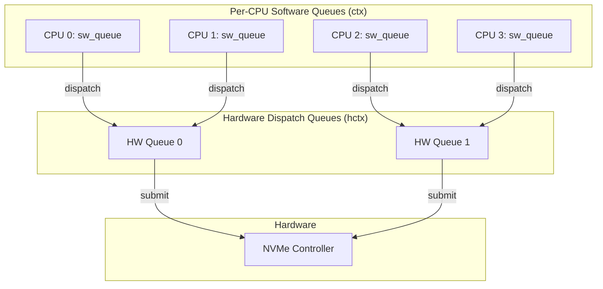
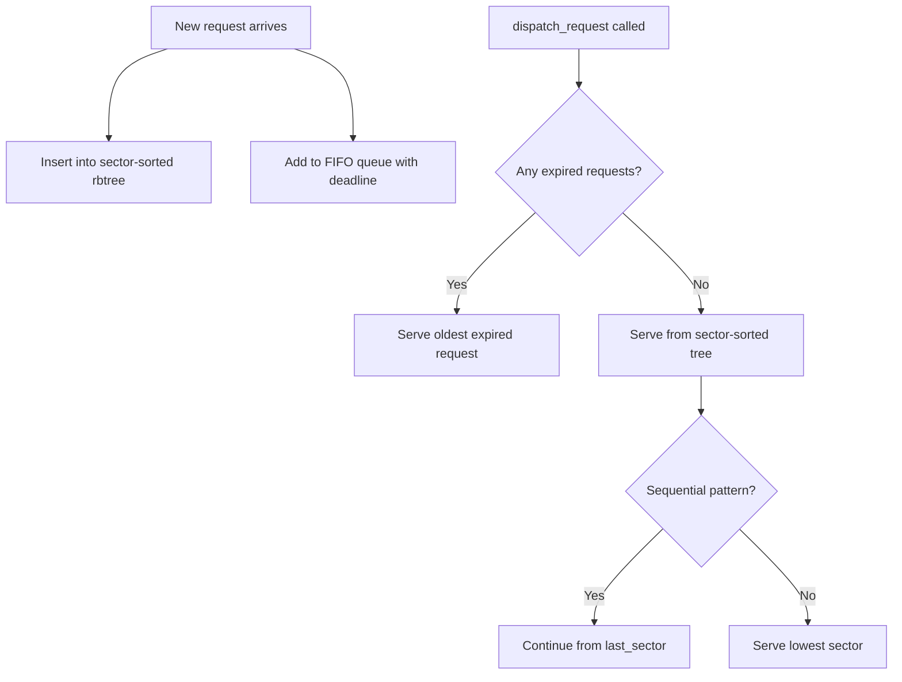
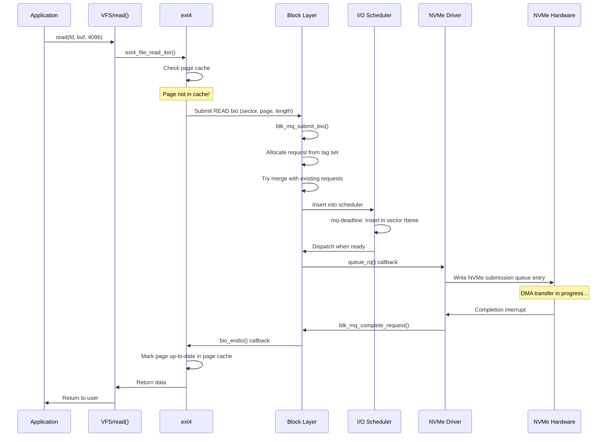
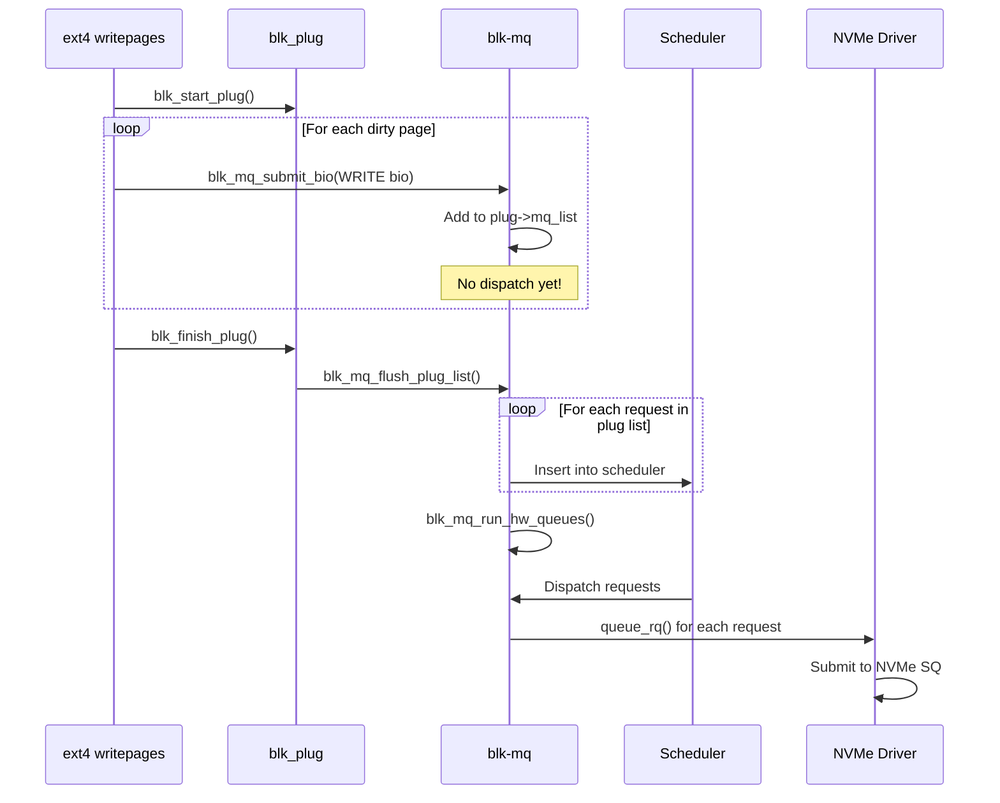
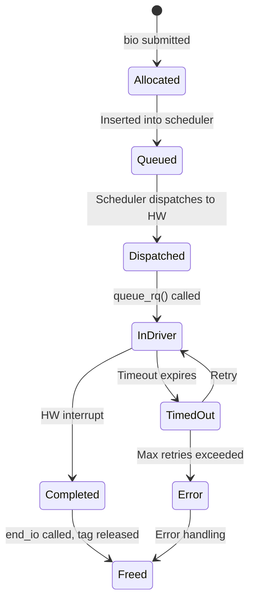
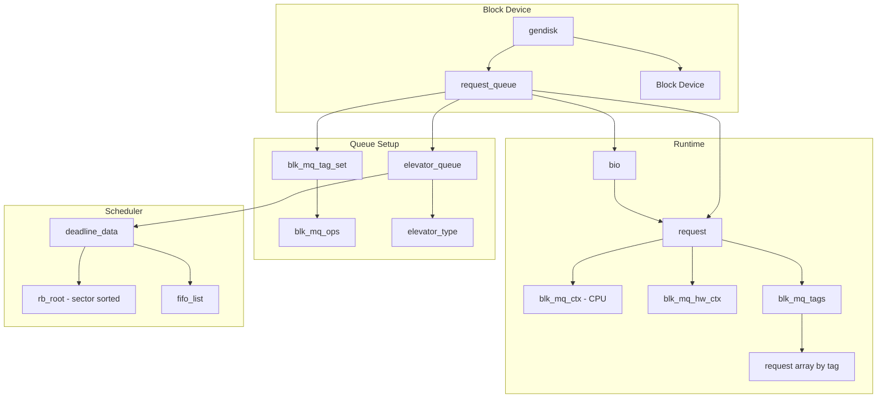

# Chapter 246: block/ — Block Layer: blk-mq, Request Handling, I/O Schedulers, Bio Structures

## 1. Introduction and Intuition

The block layer is the kernel's I/O backbone — it sits between the filesystem layer above and the device drivers below, transforming abstract read/write requests into optimized sequences of operations on block devices (disks, SSDs, NVMe drives). Understanding the block layer is essential because it determines storage performance, reliability, and the behavior of every application that reads or writes data.

### 1.1 The Problem the Block Layer Solves

Without the block layer, every filesystem would need to:
- Know how to talk to every disk controller
- Handle device-specific optimizations (alignment, queue depths)
- Manage I/O scheduling and merging
- Deal with error handling and retries

The block layer provides a unified abstraction. Filesystems submit "I/O requests" and the block layer handles everything else. This is the same pattern of abstraction that VFS provides for filesystems, but for the storage hardware below.

### 1.2 Evolution: From Legacy to blk-mq

The Linux block layer has undergone a major evolution:

**Legacy (pre-3.13):** A single request queue protected by a single lock. Every I/O request went through one queue, one lock, one thread. This worked fine for single spinning disks but became a bottleneck for fast SSDs and multi-core systems.

**blk-mq (3.13+, 2014):** "Block Multi-Queue" — a complete redesign that uses multiple hardware dispatch queues and per-CPU software staging queues. This eliminates the single-lock bottleneck and maps naturally to modern hardware like NVMe, which has many hardware queues.

Think of the legacy model as a single bank teller window. blk-mq is like having multiple teller windows, each with their own queue, and customers naturally line up at the least busy one.

### 1.3 Key Concepts

- **bio** (Block I/O): The fundamental unit of I/O — represents a single contiguous region of data on a block device
- **request**: One or more merged bios destined for the same device
- **request_queue**: The queue that holds requests for a block device
- **I/O scheduler**: Decides the order in which requests are dispatched (e.g., mq-deadline, BFQ, kyber)
- **blk-mq**: The multi-queue framework that replaces the legacy single-queue path

---

## 2. Directory Layout

```
block/
├── bio.c                   # Bio allocation, splitting, merging
├── blk-core.c              # Core block layer: make_request, generic_make_request
├── blk-cgroup.c            # Block I/O cgroup (blkio controller)
├── blk-cgroup-rwstat.c     # Read/write statistics for cgroups
├── blk-exec.c              # Request execution helpers
├── blk-flush.c             # Flush/FUA (Force Unit Access) handling
├── blk-integrity.c         # Data integrity (T10-PI, DIF/DIX)
├── blk-ioc.c               # I/O context management
├── blk-iolatency.c         # I/O latency cgroup controller
├── blk-ioprio.c            # I/O priority cgroup controller
├── blk-lib.c               # Library functions (discard, secure erase)
├── blk-map.c               # DMA mapping helpers for block layer
├── blk-mq.c                # Multi-queue core: queue management, dispatch
├── blk-mq-debugfs.c        # Debugfs interface for blk-mq
├── blk-mq-pci.c            # PCI-specific blk-mq helpers
├── blk-mq-sched.c          # Scheduler integration with blk-mq
├── blk-mq-sysfs.c          # Sysfs interface for blk-mq queues
├── blk-mq-tag.c            # Tag management for blk-mq
├── blk-mq-virtio.c         # VirtIO-specific blk-mq helpers
├── blk-pm.c                # Power management (suspend/resume)
├── blk-rq-qos.c            # Request QoS framework
├── blk-settings.c          # Queue settings/configuration
├── blk-sysfs.c             # Sysfs attributes for request queues
├── blk-throttle.c          # I/O throttling (cgroup-based bandwidth limiting)
├── blk-timeout.c           # Request timeout handling
├── blk-wbt.c               # Write-back throttling
├── bounce.c                # Bounce buffers for high-memory I/O
├── elevator.c              # I/O scheduler framework
├── genhd.c                 # Generic disk management (gendisk)
├── ioctl.c                 # Block device ioctl handling
├── partitions/
│   ├── core.c              # Partition detection framework
│   ├── efi.c               # GPT partition table parsing
│   ├── dos.c               # MBR partition table parsing
│   ├── mac.c               # Apple partition map
│   ├── msdos.c             # Extended partition handling
│   └── cmdline.c           # Command-line partition parsing
│
├── Kconfig                 # Block layer configuration options
├── Makefile                # Build rules
│
└── schedulers/             # I/O scheduler implementations
    ├── Kconfig.iosched      # Scheduler selection config
    ├── bfq-iosched.c        # BFQ (Budget Fair Queueing)
    ├── bfq-cgroup.c         # BFQ cgroup support
    ├── bfq-wf2q.c           # WF2Q+ tree implementation for BFQ
    ├── deadline-iosched.c   # Deadline scheduler (legacy, for legacy path)
    ├── kyber-iosched.c      # Kyber scheduler (latency-oriented)
    ├── mq-deadline.c        # Deadline scheduler for blk-mq
    └── none-iosched.c       # No scheduler (passthrough)
```

---

## 3. Key Files and Subsystems

### 3.1 bio.c — Block I/O Structures

The bio is the fundamental I/O descriptor. It represents a single contiguous I/O operation:

```c
// include/linux/blk_types.h
struct bio {
    struct bio          *bi_next;       /* Next bio in request */
    struct block_device *bi_bdev;       /* Target block device */
    unsigned int         bi_opf;        /* Operation + flags */
    unsigned short       bi_flags;      /* BIO_* flags */
    unsigned short       bi_ioprio;     /* I/O priority */
    unsigned short       bi_write_hint; /* Write hint for SSD optimization */
    blk_status_t         bi_status;     /* I/O completion status */
    atomic_t             __bi_remaining;

    struct bvec_iter    bi_iter;        /* Current position in I/O */
    bio_end_io_t        *bi_end_io;     /* Completion callback */
    void                *bi_private;    /* Owner-private data */

    unsigned short      bi_vcnt;        /* Number of bio_vecs */
    unsigned short      bi_max_vecs;    /* Max bio_vecs allocated */
    atomic_t            __bi_cnt;       /* Pin count */
    struct bio_vec      *bi_io_vec;     /* Array of bio_vecs */
};
```

The `bio_vec` describes a single contiguous memory buffer:

```c
struct bio_vec {
    struct page     *bv_page;       /* Page containing the data */
    unsigned int     bv_len;        /* Length of data in page */
    unsigned int     bv_offset;     /* Offset within page */
};
```

An I/O request that spans multiple non-contiguous pages uses multiple `bio_vec` entries. The `bvec_iter` tracks progress through the bio:

```c
struct bvec_iter {
    sector_t        bi_sector;      /* Device sector position */
    unsigned int    bi_size;        /* Remaining I/O size (bytes) */
    unsigned int    bi_idx;         /* Current bio_vec index */
    unsigned int    bi_bvec_done;   /* Bytes completed in current bvec */
};
```

**Key bio operations:**

| Function | Purpose |
|----------|---------|
| `bio_alloc()` | Allocate a new bio with specified number of bio_vecs |
| `bio_add_page()` | Add a page to a bio |
| `bio_chain()` | Chain bios together for large I/O splits |
| `bio_endio()` | Signal bio completion |
| `bio_split()` | Split a bio at a sector boundary |
| `bio_clone()` | Clone a bio (share page pointers) |
| `bio_copy_data()` | Copy data between bios |

### 3.2 blk-core.c — The Heart of the Block Layer

This file contains the core I/O submission path:

```c
// The main entry point for submitting I/O
blk_status_t blk_mq_submit_bio(struct bio *bio)
{
    struct request_queue *q = bio->bi_bdev->bd_disk->queue;
    struct blk_plug *plug;
    struct request *rq;
    
    /* Check if we can plug this bio */
    plug = blk_mq_plug(q, bio);
    if (plug) {
        /* Try to merge with existing request in plug list */
        rq = blk_mq_plug_bio_list_head(plug);
        if (rq && blk_attempt_bio_merge(q, rq, bio))
            return BLK_STS_OK;
        
        /* No merge possible — allocate new request */
        rq = blk_mq_get_new_requests(q, plug, bio);
    } else {
        rq = blk_mq_get_request(q, bio);
    }
    
    /* Initialize request from bio */
    blk_mq_bio_to_request(rq, bio);
    
    /* Submit request */
    blk_mq_run_hw_queues(q, false);
    return BLK_STS_OK;
}
```

The **plug** mechanism is a key optimization. When a filesystem is submitting multiple bios (e.g., writing out a large file), it "plugs" the queue, collecting requests into a list. When the plug is released, all collected requests are dispatched together, allowing for better merging and batching.

### 3.3 blk-mq.c — Multi-Queue Framework

This is the most important file in the modern block layer. It implements the blk-mq architecture:

#### 3.3.1 Queue Architecture



Each CPU has a software staging queue (`blk_mq_ctx`). Each hardware dispatch queue (`blk_mq_hw_ctx`) maps to one or more CPUs. The driver configures the mapping based on hardware capabilities.

#### 3.3.2 Key blk-mq Data Structures

```c
// include/linux/blk-mq.h
struct blk_mq_ops {
    /* Queue a request to the hardware */
    blk_status_t (*queue_rq)(struct blk_mq_hw_ctx *hctx,
                              const struct blk_mq_queue_data *bd);
    
    /* Called when a hardware queue needs to be started */
    void (*commit_rqs)(struct blk_mq_hw_ctx *hctx);
    
    /* Complete a request */
    void (*complete)(struct request *rq);
    
    /* Allocate/init hardware queue data */
    int (*init_hctx)(struct blk_mq_hw_ctx *hctx, void *data,
                     unsigned int hctx_idx);
    void (*exit_hctx)(struct blk_mq_hw_ctx *hctx, unsigned int hctx_idx);
    
    /* Allocate/init request */
    int (*init_request)(struct blk_mq_tag_set *set, struct request *rq,
                        unsigned int hctx_idx, unsigned int numa_node);
    void (*exit_request)(struct blk_mq_tag_set *set, struct request *rq,
                         unsigned int hctx_idx);
    
    /* Timeout handling */
    enum blk_eh_timer_return (*timeout)(struct request *rq, bool reserved);
    
    /* Polling for completion (for io_uring / polled I/O) */
    int (*poll)(struct blk_mq_hw_ctx *hctx, struct io_comp_batch *iob);
    
    /* Map queues to CPUs */
    int (*map_queues)(struct blk_mq_tag_set *set);
};
```

```c
struct blk_mq_tag_set {
    const struct blk_mq_ops *ops;
    unsigned int             nr_hw_queues;   /* Number of HW queues */
    unsigned int             queue_depth;     /* Max requests per queue */
    unsigned int             reserved_tags;   /* Reserved for internal use */
    unsigned int             cmd_size;        /* Per-request driver data size */
    int                      numa_node;       /* NUMA node for allocation */
    unsigned int             flags;           /* BLK_MQ_F_* flags */
    void                    *driver_data;     /* Driver private data */
    
    struct blk_mq_tags      **tags;           /* Tag sets per HW queue */
    struct blk_mq_tags      *shared_tags;     /* Shared across queues */
    
    struct mutex             tag_list_lock;
    struct list_head         tag_list;        /* List of request_queues */
};
```

```c
struct request {
    struct request_queue    *q;             /* Owning queue */
    struct blk_mq_ctx       *mq_ctx;       /* Software queue context */
    struct blk_mq_hw_ctx    *mq_hctx;      /* Hardware queue context */
    
    unsigned int            cmd_flags;      /* REQ_OP_* flags */
    blk_opf_t               cmd_op;         /* Combined op + flags */
    
    rq_end_io_fn            *end_io;        /* Completion callback */
    void                    *end_io_data;   /* Private completion data */
    
    struct gendisk          *rq_disk;       /* Target disk */
    struct block_device     *part;          /* Target partition */
    
    sector_t                __sector;       /* Sector position */
    unsigned int            __data_len;     /* Total data length */
    
    union {
        struct {
            union {
                struct __scatterlist *sg;   /* Scatter-gather list */
                struct bio *bio;            /* First bio in request */
            };
        };
    };
    
    struct list_head        queuelist;      /* Link in queue request list */
    
    unsigned long           deadline;       /* Jiffies deadline */
    
    /* ... tag, timeout, etc. */
};
```

### 3.4 blk-mq-tag.c — Tag Management

Each in-flight request is assigned a unique tag (integer). The tag allows the hardware to identify which request a completion interrupt corresponds to:

```c
struct blk_mq_tags {
    unsigned int            nr_tags;        /* Total tags */
    unsigned int            nr_reserved_tags;
    atomic_t                active_queues;
    
    struct sbitmap_queue    bitmap_tags;     /* Tag allocation bitmap */
    struct sbitmap_queue    breserved_tags;  /* Reserved tag bitmap */
    
    struct request          **rqs;           /* Tag → request mapping */
    struct request          **static_rqs;    /* Pre-allocated requests */
};
```

When the driver receives a completion interrupt, it reads the tag from the hardware, looks up `tags->rqs[tag]` to find the completed `struct request`, and calls the completion handler.

### 3.5 blk-flush.c — Flush and FUA Handling

Modern storage requires careful handling of write barriers:

```c
// Flush request sequence:
// 1. Pre-flush: Send FLUSH to device (flush device write cache)
// 2. Data: Write the actual data
// 3. Post-flush: Send FLUSH again (ensure data is on persistent storage)

struct blk_flush_queue {
    spinlock_t              mq_flush_lock;
    struct list_head        flush_queue[2]; /* [0]=pending, [1]=in-progress */
    struct list_head        flush_data_in_flight;
    struct request          *flush_rq;       /* Shared flush request */
};
```

The FUA (Force Unit Access) flag tells the device that the data must be written to persistent storage before the I/O completes, bypassing any volatile write cache.

### 3.6 blk-throttle.c — I/O Throttling

The block I/O throttling mechanism limits I/O bandwidth per cgroup:

```c
struct throtl_grp {
    struct blkg_policy_data pd;
    
    /* Configuration (set via cgroup) */
    uint64_t                bps[2];         /* [READ/WRITE] bytes/sec limit */
    unsigned int            iops[2];        /* [READ/WRITE] IOPS limit */
    
    /* Current state */
    unsigned long           last_check_time;
    
    struct {
        uint64_t            bytes_disp;     /* Bytes dispatched in window */
        unsigned int        io_disp;        /* IOs dispatched in window */
    } limit[2];
    
    /* Queued bios waiting for throttle allowance */
    struct bio_list         bio_lists[2];   /* [READ/WRITE] */
};
```

### 3.7 blk-wbt.c — Write-Back Throttling

Write-back throttling automatically limits the rate at which writes are submitted to the block device, preventing the writeback queue from getting too deep and causing large latency spikes:

```c
struct rq_wb {
    /* ... */
    unsigned int            wb_background;  /* Background threshold */
    unsigned int            wb_normal;      /* Normal threshold */
    unsigned int            wb_max;         /* Max queue depth */
    
    s64                     win_nsec;       /* Sampling window */
    struct rq_qos           rqos;
    
    struct rq_wait          rq_wait[2];     /* [READ/WRITE] wait states */
};
```

### 3.8 elevator.c — I/O Scheduler Framework

The elevator framework provides the interface for pluggable I/O schedulers:

```c
struct elevator_type {
    struct elevator_mq_ops  ops;
    struct elv_fs_entry     *elevator_attrs;
    const char              *elevator_name;
    const char              *elevator_alias;
    const unsigned int      elevator_features;
    struct module           *elevator_owner;
    struct kobj_type        *elevator_ktype;
    /* ... */
};

struct elevator_mq_ops {
    int             (*init_sched)(struct request_queue *q, struct elevator_type *e);
    void            (*exit_sched)(struct elevator_queue *e);
    
    void            (*limit_depth)(unsigned int op, struct blk_mq_alloc_data *data);
    void            (*prepare_request)(struct request *rq);
    void            (*finish_request)(struct request *rq);
    
    bool            (*has_work)(struct blk_mq_hw_ctx *hctx);
    void            (*completed_request)(struct request *rq, u64 now);
    
    struct request  *(*dispatch_request)(struct blk_mq_hw_ctx *hctx);
    
    /* ... */
};
```

---

## 4. I/O Scheduler Implementations

### 4.1 mq-deadline — Deadline Scheduler for blk-mq

The mq-deadline scheduler ensures fairness and prevents starvation:

```c
struct deadline_data {
    /* Sorted by sector (for merging/sequential detection) */
    struct rb_root          sort_list[2];   /* [READ/WRITE] */
    
    /* FIFO queues (for deadline enforcement) */
    struct list_head        fifo_list[2];   /* [READ/WRITE] */
    
    /* Per-sector ordering */
    sector_t                last_sector;
    
    /* Tunable parameters */
    int                     reads_expire;   /* Read deadline (ms) */
    int                     writes_expire;  /* Write deadline (ms) */
    int                     writes_starved; /* Read priority ratio */
    int                     fifo_batch;     /* Requests dispatched in batch */
};
```

**Algorithm:**
1. Requests are sorted by sector number for efficient sequential I/O
2. Each request has a deadline (current time + expire)
3. On dispatch: check if any request has expired → serve it (FIFO order)
4. Otherwise: serve from the sector-sorted list (nearby sectors)
5. After `fifo_batch` requests, re-check for expired requests



### 4.2 BFQ — Budget Fair Queueing

BFQ provides proportional-share fairness and low latency for interactive workloads:

```c
struct bfq_data {
    struct request_queue *queue;
    
    /* Device-wide state */
    struct bfq_sched_data sched_data;   /* Root scheduling data */
    struct rb_root_cached queue_weights_tree; /* Weight-sorted queue tree */
    
    /* In-service queue (currently being served) */
    struct bfq_queue *in_service_queue;
    
    /* Budget management */
    unsigned long budget;               /* Current queue's budget */
    unsigned long wr_cur_max_time;      /* Max time in soft-realtime mode */
    
    /* ... */
};

struct bfq_queue {
    /* Position in the scheduling tree */
    struct rb_node rb_node;
    struct bfq_sched_data *sched_data;
    
    /* Budget */
    unsigned long budget;           /* Assigned budget (sectors) */
    unsigned long service;          /* Sectors served */
    unsigned long entity.budget;    /* WF2Q+ budget */
    
    /* Priority */
    unsigned short ioprio;
    unsigned short ioprio_class;
    
    /* Queue state */
    int pid;
    struct bfq_data *bfqd;
    
    /* Requests */
    struct request *next_rq;
    struct list_head fifo;
};
```

BFQ uses the **WF2Q+** (Worst-case Fair Weighted Fair Queueing) algorithm, implemented in `bfq-wf2q.c`. It guarantees that each process gets a share of the disk bandwidth proportional to its weight.

### 4.3 Kyber — Latency-Based Scheduler

Kyber is designed for fast devices (NVMe SSDs) and focuses on latency rather than fairness:

```c
struct kyber_queue_data {
    struct request_queue *q;
    
    /* Token buckets for latency domains */
    struct sbitmap_queue domain_tokens[KYBER_NUM_DOMAINS];
    
    /* Async request batching */
    struct list_head rqs[KYBER_NUM_DOMAINS][KYBER_NUM_DOMAINS];
    
    /* Latency targets per domain */
    unsigned int latency_targets[KYBER_NUM_DOMAINS];
    
    /* Completion time tracking */
    atomic64_t kcq_map[KYBER_NUM_DOMAINS][KYBER_NUM_DOMAINS];
};
```

Kyber categorizes I/O into domains (READ, SYNC_WRITE, ASYNC_WRITE, DISCARD) and uses token buckets to limit each domain's queue depth, adjusting dynamically based on observed completion latencies.

### 4.4 Noop/None — No Scheduler

For devices with their own scheduling (NVMe with multiple hardware queues), the "none" scheduler simply passes requests through:

```c
static struct elevator_type mq_none = {
    .ops = {
        .has_work       = none_has_work,
        .completed_request = none_completed_request,
        .dispatch_request = none_dispatch_request,
    },
    .elevator_name = "none",
    .elevator_alias = "noop",
    .elevator_owner = THIS_MODULE,
};
```

---

## 5. Code Walkthrough: Complete I/O Path

### 5.1 Read Path: User Reads a File



### 5.2 Write Path with Plug/Unplug



### 5.3 Request Lifecycle



---

## 6. Key Data Structures Interconnection



### 6.1 gendisk — The Generic Disk

```c
struct gendisk {
    int major;                  /* Major number */
    int first_minor;            /* First minor number */
    int minors;                 /* Maximum number of minors */
    
    const struct block_device_operations *fops;
    struct request_queue *queue;    /* Request queue */
    void *private_data;             /* Driver private data */
    
    struct disk_part_tbl *part_tbl; /* Partition table */
    struct block_device part0;      /* Whole-disk block device */
    
    const char *disk_name;          /* e.g., "sda", "nvme0n1" */
    
    /* ... integrity, events, etc. */
};
```

### 6.2 request_queue — The I/O Queue

```c
struct request_queue {
    struct blk_mq_tag_set   *tag_set;       /* Tag set */
    struct blk_mq_ops       *mq_ops;        /* MQ operations */
    
    struct elevator_queue    *elevator;     /* Current scheduler */
    
    struct blk_mq_ctx __percpu *queue_ctx;  /* Per-CPU contexts */
    unsigned int             nr_hw_queues;
    struct blk_mq_hw_ctx    **queue_hw_ctx;
    
    /* Queue limits */
    struct queue_limits      limits;
    
    /* Throttling */
    struct throtl_data      *td;            /* Throttle data */
    struct rq_wb            *rq_wb;         /* Write-back throttle */
    
    /* State */
    unsigned long            queue_flags;
    
    /* Stats */
    struct blk_queue_stats  *stats;
    
    /* ... */
};
```

---

## 7. Relationships with Other Subsystems

### 7.1 Block Layer ↔ Filesystems

Filesystems interact with the block layer through:
- **`submit_bio()`**: Submit a bio for I/O
- **`blkdev_read_iter()` / `blkdev_write_iter()`**: Direct block device access
- **Buffer heads** (legacy, for older filesystems): Map blocks to pages
- **Direct I/O** (`O_DIRECT`): Bypass page cache, submit bios directly

### 7.2 Block Layer ↔ Device Drivers

Drivers interact through:
- **`blk_mq_alloc_disk()`**: Allocate a gendisk + request queue
- **`blk_mq_ops.queue_rq()`**: Receive requests from the block layer
- **`blk_mq_complete_request()`**: Signal request completion
- **`blk_mq_start_request()`**: Mark request as in-flight

### 7.3 Block Layer ↔ Memory Management

- **Page cache**: Filesystem pages are backed by bio I/O
- **Bounce buffers**: When I/O targets high memory (>4G on 32-bit)
- **Direct reclaim**: Under memory pressure, the block layer may trigger page writeback

### 7.4 Block Layer ↔ cgroups

The blkio cgroup controller (`blk-cgroup.c`) provides:
- **Throttling**: Limit IOPS or bandwidth per cgroup
- **Proportional weight**: BFQ shares disk time by weight
- **Latency targets**: blk-iolatency provides latency guarantees

---

## 8. Advanced Topics

### 8.1 Polled I/O

For ultra-low-latency workloads, the kernel supports polled I/O where the CPU actively checks for completions instead of waiting for interrupts:

```c
// Applications use io_uring with IORING_SETUP_IOPOLL
// The kernel calls blk_mq_ops.poll() to check completions
static int nvme_poll(struct blk_mq_hw_ctx *hctx, struct io_comp_batch *iob)
{
    /* Check NVMe completion queue entries */
    /* Process completions without interrupts */
}
```

### 8.2 Write Hints

NVMe devices support "write hints" that inform the SSD about the data's access pattern, allowing it to optimize internal data placement:

```c
enum rq_qos_bits {
    RQ_QOS_MERGED,
    RQ_QOS_LATENCY,
    RQ_QOS_COST,
};
```

### 8.3 Zoned Block Devices

Zoned storage devices (SMR disks, ZNS SSDs) have zones that must be written sequentially. The block layer supports this through:

```c
// include/linux/blkdev.h
struct blk_zone {
    sector_t        start;      /* Zone start sector */
    sector_t        len;        /* Zone length */
    sector_t        wp;         /* Write pointer */
    enum blk_zone_type type;    /* Conventional or Sequential */
    enum blk_zone_cond cond;    /* Zone condition */
};
```

---

## 9. References

1. **Linux Kernel Source**: `block/` directory
2. **Documentation**: `Documentation/block/`
3. **"Linux Block I/O"** — LWN.net article series on blk-mq
4. **"The Multi-Queue Block Layer"** — Jens Axboe's presentation, kernel summit 2013
5. **BFQ I/O Scheduler paper**: "Budget Fair Queueing" by Paolo Valente
6. **"Kyber I/O Scheduler"** — LWN.net article (2017)
7. **NVMe specification** (nvmexpress.org) — for understanding hardware queue design
8. **"Write-Back Throttling"** — LWN.net article (2016)
9. **Jens Axboe's blk-mq design document**: `Documentation/block/blk-mq.rst`
10. **io_uring and polled I/O**: `Documentation/userspace-api/io_uring.rst`
