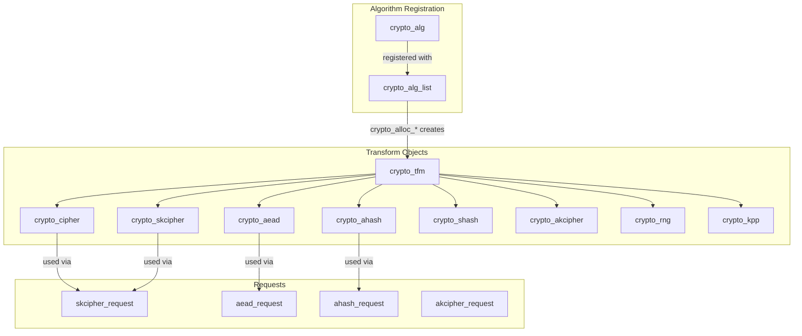
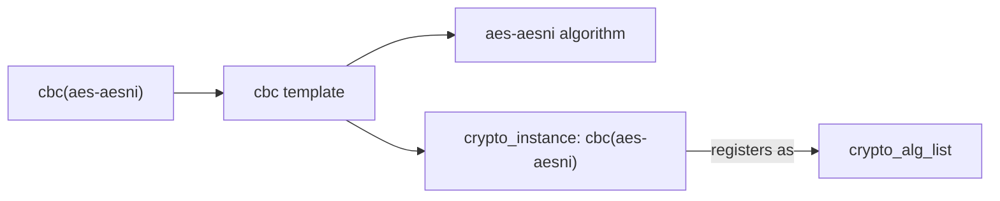
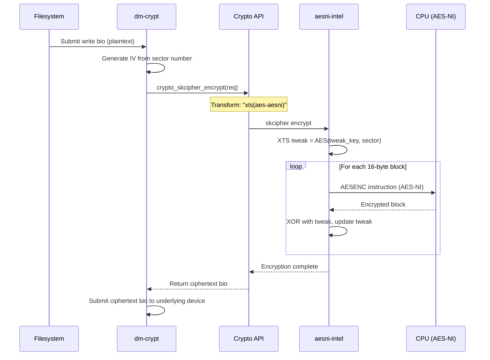
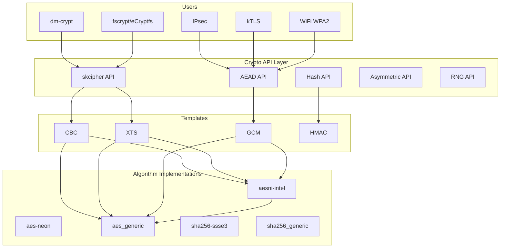

# Chapter 247: crypto/ — Cryptographic API: Cipher, Hash, AEAD, Async Crypto, Hardware Acceleration

## 1. Introduction and Intuition

The Linux kernel's cryptographic API provides a comprehensive set of cryptographic primitives that other kernel subsystems can use. It's the foundation for disk encryption (dm-crypt), network security (IPsec, TLS), filesystem integrity (dm-verity), and secure boot. The API is designed to be flexible — the same code can use a pure software implementation or a hardware accelerator, depending on what's available.

### 1.1 Why Kernel Crypto?

Cryptographic operations appear in many kernel paths:

- **dm-crypt**: Encrypts every disk block read/write
- **IPsec**: Encrypts/authenticates network packets
- **Wireless (WPA2/WPA3)**: AES-CCMP for WiFi security
- **eCryptfs/fscrypt**: Filesystem-level encryption
- **dm-verity/fs-verity**: Integrity verification
- **TLS offload**: Kernel TLS with hardware crypto
- **RNG**: Random number generation for `/dev/urandom`

Having a unified crypto API avoids code duplication and allows hardware acceleration to be transparent.

### 1.2 Design Principles

1. **Algorithm independence**: Users request "give me an AES cipher" not "give me the AES-NI implementation"
2. **Transparent hardware acceleration**: If a CPU has AES-NI or a crypto accelerator is present, it's used automatically
3. **Synchronous and asynchronous**: Some operations (especially hardware-accelerated) may complete asynchronously
4. **Self-testing**: Algorithms are tested against known test vectors at registration time
5. **Module-based**: Algorithms are loadable kernel modules

---

## 2. Directory Layout

```
crypto/
├── api.c                   # Core API: crypto_alloc_*, crypto_cipher_*
├── cipher.c                # Simple cipher operations (single block)
├── compress.c              # Compression algorithm API
├── aead.c                  # AEAD (Authenticated Encryption with Associated Data)
├── ahash.c                 # Asynchronous hash API
├── shash.c                 # Synchronous hash API
├── akcipher.c              # Asymmetric key cipher API
├── kpp.c                   # Key-agreement (e.g., Diffie-Hellman)
├── rng.c                   # Random number generator API
├── lrw.c                   # Liskov-Rivest-Wagner mode (for disk encryption)
├── xts.c                   # XTS mode (IEEE 1619, for disk encryption)
├── cbc.c                   # CBC (Cipher Block Chaining) mode
├── ecb.c                   # ECB (Electronic Codebook) mode
├── ctr.c                   # CTR (Counter) mode
├── gcm.c                   # GCM (Galois/Counter Mode)
├── ccm.c                   # CCM (Counter with CBC-MAC)
├── chacha20poly1305.c      # ChaCha20-Poly1305 AEAD
├── seqiv.c                 # Sequence number IV generator
├── eseqiv.c                # Encrypted sequence number IV
├── hmac.c                  # HMAC (Hash-based MAC)
├── sha1_generic.c          # SHA-1 software implementation
├── sha256_generic.c        # SHA-256 software implementation
├── sha512_generic.c        # SHA-512 software implementation
├── sha3_generic.c          # SHA-3 (Keccak) implementation
├── blake2b_generic.c       # BLAKE2b hash
├── md5.c                   # MD5 (legacy, still used in some protocols)
├── aes_generic.c           # AES software implementation (lookup tables)
├── aesni-intel_glue.c      # AES-NI hardware acceleration (x86)
├── aes-neon-bs.c           # AES NEON (ARM64 SIMD)
├── crc32c-intel_glue.c     # CRC32C with SSE4.2 instructions
├── crct10dif-generic.c     # CRC T10 DIF
├── poly1305_generic.c      # Poly1305 MAC
├── chacha_generic.c        # ChaCha20 stream cipher
├── curve25519-generic.c    # Curve25519 key agreement
├── rsa.c                   # RSA algorithm
├── ecdsa.c                 # ECDSA algorithm
├── ecdh.c                  # ECDH key agreement
├── dh.c                    # Diffie-Hellman key agreement
├── drbg.c                  # Deterministic Random Bit Generator (NIST SP 800-90A)
├── jent.c                  # Jitter entropy RNG
├── testmgr.c              # Algorithm self-test manager
├── tcrypt.c               # Test module for benchmarking
├── algapi.c               # Algorithm template API
├── algboss.c              # Algorithm manager (auto-loading)
├── crypto_user.c          # Netlink interface for crypto configuration
├── proc.c                 # /proc/crypto interface
│
├── asymmetric_keys/       # Asymmetric key handling
│   ├── x509_cert_parser.c # X.509 certificate parsing
│   ├── pkcs7_parser.c     # PKCS#7 message parsing
│   ├── verify.c           # Signature verification
│   └── public_key.c       # Public key operations
│
├── Kconfig                # Configuration options
└── Makefile               # Build rules
```

---

## 3. Key Files and Subsystems

### 3.1 api.c — Core Crypto API

This is the central hub. All crypto operations start here:

```c
// Allocate a transform (cipher, hash, etc.)
struct crypto_tfm *crypto_alloc_base(const char *alg_name, u32 type, u32 mask);

// Higher-level convenience wrappers:
struct crypto_cipher *crypto_alloc_cipher(const char *alg_name, u32 type, u32 mask);
struct crypto_ahash *crypto_alloc_ahash(const char *alg_name, u32 type, u32 mask);
struct crypto_aead *crypto_alloc_aead(const char *alg_name, u32 type, u32 mask);
struct crypto_skcipher *crypto_alloc_skcipher(const char *alg_name, u32 type, u32 mask);
struct crypto_shash *crypto_alloc_shash(const char *alg_name, u32 type, u32 mask);
struct crypto_akcipher *crypto_alloc_akcipher(const char *alg_name, u32 type, u32 mask);
struct crypto_rng *crypto_alloc_rng(const char *alg_name, u32 type, u32 mask);
struct crypto_kpp *crypto_alloc_kpp(const char *alg_name, u32 type, u32 mask);

// Set key (for ciphers)
int crypto_cipher_setkey(struct crypto_cipher *tfm, const u8 *key, unsigned int keylen);
int crypto_skcipher_setkey(struct crypto_skcipher *tfm, const u8 *key, unsigned int keylen);
int crypto_aead_setkey(struct crypto_aead *tfm, const u8 *key, unsigned int keylen);

// Encrypt/decrypt single block
void crypto_cipher_encrypt_one(struct crypto_cipher *tfm, u8 *dst, const u8 *src);
void crypto_cipher_decrypt_one(struct crypto_cipher *tfm, u8 *dst, const u8 *src);

// Encrypt/decrypt scatter-gather (skcipher)
int crypto_skcipher_encrypt(struct skcipher_request *req);
int crypto_skcipher_decrypt(struct skcipher_request *req);

// Hash
int crypto_ahash_digest(struct ahash_request *req);

// AEAD (encrypt + authenticate)
int crypto_aead_encrypt(struct aead_request *req);
int crypto_aead_decrypt(struct aead_request *req);

// Free
void crypto_free_tfm(struct crypto_tfm *tfm);
```

### 3.2 Cipher Modes

The kernel implements standard cipher modes as separate modules:

#### CBC (Cipher Block Chaining)

```c
// crypto/cbc.c
struct crypto_cbc_ctx {
    struct crypto_cipher *child;    /* Underlying block cipher */
};

static int crypto_cbc_encrypt(struct skcipher_request *req)
{
    /* For each block:
     * 1. XOR plaintext with previous ciphertext (or IV for first block)
     * 2. Encrypt the XORed result
     * 3. Output becomes the next "previous ciphertext"
     */
}
```

#### XTS (XEX-based Tweaked-codebook mode with ciphertext Stealing)

XTS is the standard mode for disk encryption (dm-crypt):

```c
// crypto/xts.c
struct crypto_xts_ctx {
    struct crypto_cipher *tweak_cipher;  /* For tweak encryption */
    struct crypto_cipher *crypt_cipher;  /* For data encryption */
};

// Each sector gets a unique tweak derived from its sector number
// Tweak = AES(TweakKey, sector_number)
// For each 16-byte block in the sector:
//   T = Tweak * alpha (in GF(2^128))
//   C = AES(DataKey, P XOR T) XOR T
```

#### GCM (Galois/Counter Mode)

GCM provides authenticated encryption — it encrypts data and produces an authentication tag:

```c
// crypto/gcm.c
struct crypto_gcm_ctx {
    struct crypto_skcipher *ctr;    /* Counter mode for encryption */
    struct crypto_ahash *ghash;     /* GHASH for authentication */
};

// Encryption: E_k(CTR) = plaintext XOR keystream
// Authentication: GHASH_H(AAD || ciphertext || lengths)
// Tag = GHASH XOR E_k(CTR_0)
```

### 3.3 skcipher.c — Symmetric Key Cipher API

The `skcipher` (Symmetric Key Cipher) API is the modern way to do bulk encryption:

```c
// A scatter-gather request for encryption
struct skcipher_request {
    struct crypto_async_request base;
    unsigned int cryptlen;          /* Data length */
    u8 *iv;                         /* Initialization vector */
    struct scatterlist *src;        /* Source scatter-gather list */
    struct scatterlist *dst;        /* Destination scatter-gather list */
    void *__ctx[];                  /* Private context */
};
```

Usage pattern:

```c
/* 1. Allocate cipher */
struct crypto_skcipher *tfm = crypto_alloc_skcipher("cbc(aes)", 0, 0);

/* 2. Set key */
crypto_skcipher_setkey(tfm, key, key_len);

/* 3. Allocate request */
struct skcipher_request *req = skcipher_request_alloc(tfm, GFP_KERNEL);

/* 4. Set up request */
skcipher_request_set_callback(req, CRYPTO_TFM_REQ_MAY_BACKLOG, complete, data);
skcipher_request_set_crypt(req, src_sg, dst_sg, len, iv);

/* 5. Encrypt/decrypt */
ret = crypto_skcipher_encrypt(req);  /* or _decrypt */

/* 6. Cleanup */
skcipher_request_free(req);
crypto_free_skcipher(tfm);
```

### 3.4 aead.c — Authenticated Encryption

AEAD combines encryption and authentication in one operation:

```c
struct aead_request {
    struct crypto_async_request base;
    unsigned int assoclen;          /* Associated data length (authenticated, not encrypted) */
    unsigned int cryptlen;          /* Data length (authenticated AND encrypted) */
    u8 *iv;                         /* IV/nonce */
    struct scatterlist *src;        /* Source (assoc || data) */
    struct scatterlist *dst;        /* Destination (assoc || data || tag) */
    void *__ctx[];
};
```

The `src`/`dst` scatterlists contain:
- **Associated data**: Authenticated but not encrypted (e.g., IP header for IPsec)
- **Ciphertext/plaintext**: Authenticated and encrypted
- **Authentication tag**: Appended to output on encrypt, verified on decrypt

### 3.5 shash.c / ahash.c — Hash APIs

Two hash APIs exist:

**shash (Synchronous Hash)**: Simple, blocking:

```c
struct shash_desc {
    struct crypto_shash *tfm;
    void *__ctx[];
};

// Usage:
struct crypto_shash *tfm = crypto_alloc_shash("sha256", 0, 0);
struct shash_desc *desc = kmalloc(sizeof(*desc) + crypto_shash_descsize(tfm));
desc->tfm = tfm;

crypto_shash_init(desc);
crypto_shash_update(desc, data1, len1);
crypto_shash_update(desc, data2, len2);
crypto_shash_final(desc, output_hash);
```

**ahash (Asynchronous Hash)**: Can complete asynchronously (for hardware crypto):

```c
struct ahash_request {
    struct crypto_async_request base;
    unsigned int nbytes;        /* Bytes to hash */
    struct scatterlist *src;    /* Source scatter-gather */
    u8 *result;                 /* Output hash */
    void *__ctx[];
};

// Usage:
struct crypto_ahash *tfm = crypto_alloc_ahash("sha256", 0, 0);
struct ahash_request *req = ahash_request_alloc(tfm, GFP_KERNEL);
ahash_request_set_callback(req, ...);
ahash_request_set_crypt(req, sg, result, len);
crypto_ahash_digest(req);  /* Async: may return -EINPROGRESS */
```

### 3.6 testmgr.c — Self-Test Manager

Every registered algorithm is tested against known test vectors:

```c
static const struct alg_test_desc alg_test_descs[] = {
    {
        .alg = "cbc(aes)",
        .test = alg_test_skcipher,
        .fips_allowed = 1,
        .suite = {
            .cipher = {
                .vecs = aes_cbc_tv_template,
                .count = ARRAY_SIZE(aes_cbc_tv_template),
            },
        },
    },
    {
        .alg = "sha256",
        .test = alg_test_shash,
        .suite = {
            .hash = {
                .vecs = sha256_tv_template,
                .count = ARRAY_SIZE(sha256_tv_template),
            },
        },
    },
    /* ... hundreds of test entries ... */
};
```

This is critical for FIPS compliance — every algorithm must pass its self-tests before being available for use.

### 3.7 AES-NI Hardware Acceleration

```c
// crypto/aesni-intel_glue.c
static struct crypto_alg aesni_algs[] = {
    {
        .cra_name = "aes",
        .cra_driver_name = "aes-aesni",
        .cra_priority = 300,  /* Higher priority than software AES */
        .cra_flags = CRYPTO_ALG_TYPE_CIPHER,
        .cra_blocksize = AES_BLOCK_SIZE,
        .cra_ctxsize = sizeof(struct crypto_aes_ctx),
        .cra_module = THIS_MODULE,
        .cra_u = {
            .cipher = {
                .cia_min_keysize = AES_MIN_KEY_SIZE,
                .cia_max_keysize = AES_MAX_KEY_SIZE,
                .cia_setkey = crypto_aes_set_key,
                .cia_encrypt = aesni_encrypt,
                .cia_decrypt = aesni_decrypt,
            },
        },
    },
};
```

The AES-NI implementation uses hardware AES instructions (`AESENC`, `AESDEC`, etc.) that are 3-10x faster than the software lookup-table implementation.

### 3.8 DRBG — Deterministic Random Bit Generator

The kernel's CSPRNG is based on NIST SP 800-90A:

```c
// crypto/drbg.c
struct drbg_state {
    struct crypto_skcipher *ctr_cipher;  /* For CTR_DRBG */
    struct mutex drbg_mutex;
    unsigned char *V;                    /* Internal state */
    unsigned char *Vbuf;
    unsigned int reseed_ctr;             /* Reseed counter */
    /* ... */
};

// Supports three DRBG mechanisms:
// - CTR_DRBG (AES-based, default)
// - Hash_DRBG (SHA-based)
// - HMAC_DRBG (HMAC-based)
```

---

## 4. Core Data Structures

### 4.1 The Transform Hierarchy



### 4.2 crypto_alg — Algorithm Descriptor

```c
struct crypto_alg {
    struct list_head cra_list;          /* Global algorithm list */
    struct list_head cra_users;         /* Users of this algorithm */
    
    u32 cra_flags;                      /* CRYPTO_ALG_TYPE_* flags */
    unsigned int cra_blocksize;         /* Block size in bytes */
    unsigned int cra_ctxsize;           /* Transform context size */
    unsigned int cra_alignmask;         /* Alignment requirements */
    
    int cra_priority;                   /* Priority (higher = preferred) */
    int cra_refcnt;                     /* Reference count */
    
    char cra_name[CRYPTO_MAX_ALG_NAME]; /* Algorithm name (e.g., "aes") */
    char cra_driver_name[CRYPTO_MAX_ALG_NAME]; /* Driver name (e.g., "aes-aesni") */
    
    const struct crypto_type *cra_type; /* Type-specific operations */
    
    union {
        struct cipher_alg cipher;
        struct compress_alg compress;
        /* ... */
    } cra_u;
    
    struct module *cra_module;
    /* ... */
};
```

### 4.3 Algorithm Templates

Templates wrap other algorithms to create composite algorithms:

```c
// Example: "cbc(aes)" is created by the CBC template wrapping AES
struct crypto_template {
    struct list_head list;
    struct list_head instances;
    struct module *module;
    
    struct crypto_instance *(*alloc)(struct rtattr **tb);
    void (*free)(struct crypto_instance *inst);
    
    char name[CRYPTO_MAX_ALG_NAME];
    /* ... */
};
```

Templates include: `cbc`, `ecb`, `ctr`, `xts`, `lrw`, `gcm`, `ccm`, `hmac`, `authenc`, `seqiv`, `eseqiv`, `pcbc`, `rfc3686`, `rfc4106`, `rfc4543`, `rfc7539esp`, `rfc7539`.

### 4.4 The crypto_instance Hierarchy

When you request `"cbc(aes-aesni)"`, the kernel:

1. Parses the template name `"cbc"` and inner algorithm `"aes-aesni"`
2. Finds the `crypto_template` for `cbc`
3. Finds the `crypto_alg` for `aes-aesni`
4. Calls `cbc->alloc()` which creates a `crypto_instance` combining both
5. Registers the instance as `"cbc(aes-aesni)"`



---

## 5. Code Walkthrough: Encrypting a Disk Block

Let's trace how dm-crypt encrypts a disk write:



### 5.1 XTS Mode Walkthrough

```
Sector: 0x12345
TweakKey: K_T
DataKey: K_D

1. Tweak = AES(K_T, 0x12345)
2. For each 16-byte block i in the sector:
   a. T_i = tweak * alpha^i  (in GF(2^128), alpha = x)
   b. P_i = plaintext[i] XOR T_i
   c. C_i = AES(K_D, P_i)
   d. ciphertext[i] = C_i XOR T_i

This ensures that the same plaintext encrypted with different keys,
different sectors, or different positions within a sector produces
different ciphertext — critical for disk encryption security.
```

---

## 6. Diagrams

### 6.1 Crypto API Layer Architecture



### 6.2 Algorithm Registration Flow

```mermaid
sequenceDiagram
    MOD as Module (aesni-intel)
    REG as Algorithm Registry
    SELF as Self-Test Manager
    
    MOD->>REG: crypto_register_alg(&aesni_alg)
    REG->>SELF: Run test vectors
    SELF->>SELF: Encrypt known plaintext with known key
    SELF->>SELF: Compare with expected ciphertext
    SELF-->>REG: Test passed
    REG->>REG: Add to crypto_alg_list
    REG-->>MOD: Registration successful
    
    Note over REG: Now "cbc(aes-aesni)" is available
    Note over REG: Priority 300 > generic's 100
```

### 6.3 Async Crypto Completion

```mermaid
sequenceDiagram
    CALLER as dm-crypt
    CRYPTO as Crypto API
    HW as Hardware Accelerator
    IRQ as Completion IRQ
    
    CALLER->>CRYPTO: crypto_skcipher_encrypt(req)
    CRYPTO->>HW: Submit to accelerator
    HW-->>CRYPTO: -EINPROGRESS (async)
    CRYPTO-->>CALLER: -EINPROGRESS
    
    Note over CALLER: Caller continues other work
    
    HW->>IRQ: DMA complete, fire interrupt
    IRQ->>CRYPTO: crypto_request_complete(req, 0)
    CRYPTO->>CALLER: req->base.complete(req, 0)
    CALLER->>CALLER: Process completed request
```

---

## 7. Relationships with Other Subsystems

### 7.1 crypto/ ↔ dm-crypt (Device Mapper)

dm-crypt is the primary consumer for disk encryption. It uses:
- `crypto_alloc_skcipher("xts(aes)")` for disk encryption
- `crypto_skcipher_setkey()` with the user-provided key
- `crypto_skcipher_encrypt/decrypt()` for every I/O request

### 7.2 crypto/ ↔ net/ (IPsec)

The IPsec subsystem uses AEAD algorithms:
- ESP (Encapsulating Security Payload) uses `crypto_aead` for `gcm(aes)` or `cbc(aes)+hmac(sha256)`
- AH (Authentication Header) uses `crypto_ahash` for integrity-only

### 7.3 crypto/ ↔ fs/ (fscrypt)

The filesystem encryption subsystem uses:
- `crypto_skcipher` for file content encryption
- Key derivation via `crypto_shash` (HKDF)

### 7.4 crypto/ ↔ random/ (RNG)

The kernel's random number generator uses:
- `crypto_rng` (DRBG) as the core CSPRNG
- Hardware entropy sources via `crypto_rng` with `jitterentropy`
- ChaCha20 as a fast stream cipher for `/dev/urandom`

### 7.5 crypto/ ↔ keys/ (Key Management)

Asymmetric key operations (`crypto_akcipher`) are used by:
- Module signature verification
- Secure boot (IMA/EVM)
- PKCS#7 message verification

---

## 8. Hardware Acceleration Deep Dive

### 8.1 x86 AES-NI

The `aesni-intel_glue.c` module registers optimized implementations that use:

- **`AESENC`/`AESENCLAST`**: AES encryption rounds (hardware instructions)
- **`AESDEC`/`AESDECLAST`**: AES decryption rounds
- **`AESKEYGENASSIST`**: AES key schedule generation
- **PCLMULQDQ**: Carry-less multiplication for GCM/GHASH

The module also provides optimized implementations for:
- `cbc(aes-aesni)` — CBC mode with AES-NI
- `xts(aes-aesni)` — XTS mode with AES-NI
- `gcm(aes-aesni)` — GCM mode with AES-NI + PCLMULQDQ
- `rfc4106(gcm(aes-aesni))` — IPsec-specific GCM

### 8.2 ARM64 Crypto Extensions

ARMv8 includes dedicated crypto instructions:

- **`AESE`/`AESD`**: AES encrypt/decrypt
- **`AESMC`/`AESIMC`**: AES MixColumns
- **`SHA256H`/`SHA256H2`**: SHA-256 hash rounds
- **`PMULL`/`PMULL2`**: Polynomial multiplication for GHASH

The `aes-neon-bs.c` and `aes-neon-glue.c` modules provide these optimizations.

### 8.3 Priority System

When multiple implementations exist for the same algorithm, the one with the highest priority wins:

| Implementation | Priority | Description |
|---------------|----------|-------------|
| `aes-aesni` | 300 | AES-NI hardware |
| `aes-neon` | 250 | ARM NEON |
| `aes-generic` | 100 | Software lookup tables |

The crypto API automatically selects the highest-priority implementation when an algorithm is allocated.

---

## 9. References

1. **Linux Kernel Source**: `crypto/` directory
2. **Documentation**: `Documentation/crypto/`
3. **NIST SP 800-90A**: DRBG specification
4. **NIST SP 800-38D**: GCM specification
5. **IEEE 1619**: XTS-AES for disk encryption
6. **RFC 4106**: The Use of GCM in IPsec ESP
7. **Intel AES-NI White Paper**: Hardware AES acceleration
8. **ARM Architecture Reference Manual**: Crypto extensions
9. **"Linux Kernel Crypto API"** — kernel.org documentation
10. **LWN.net**: "The kernel crypto API" article series
11. **FIPS 140-2/140-3**: Federal Information Processing Standards for cryptographic modules
