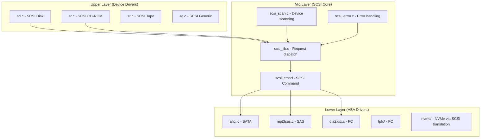

# Chapter 248: drivers/ — Device Drivers: Subsystem Organization, Bus Drivers, Class Drivers

## 1. Introduction and Intuition

The `drivers/` directory is the largest directory in the Linux kernel source tree, containing millions of lines of code. It houses all device drivers — the software that enables the kernel to communicate with hardware devices. From the humble keyboard to exotic InfiniBand network cards, from tiny embedded sensors to massive GPU clusters, every piece of hardware that Linux supports has a driver here.

### 1.1 The Driver Model

Linux uses a hierarchical driver model built around three concepts:

- **Bus drivers**: Manage communication channels (PCI, USB, I2C, SPI)
- **Device drivers**: Implement the logic for specific hardware
- **Class drivers**: Provide generic interfaces for device categories (input, sound, network)

The relationship is: a **device** sits on a **bus**, is managed by a **device driver**, and exposes functionality through a **class** interface.

### 1.2 The Linux Device Model (LDM)

The Linux Device Model provides a unified view of all devices in the system:

```c
struct device {
    struct kobject kobj;                /* Sysfs representation */
    struct device *parent;              /* Parent device */
    struct device_private *p;           /* Private data */
    const char *init_name;              /* Initial name */
    const struct device_type *type;     /* Device type */
    struct bus_type *bus;               /* Bus type */
    struct device_driver *driver;       /* Bound driver */
    void *platform_data;                /* Platform-specific data */
    void *driver_data;                  /* Driver-private data */
    struct dev_pm_info power;           /* Power management */
    struct dev_archdata archdata;       /* Architecture-specific data */
    struct device_node *of_node;        /* Device Tree node */
    /* ... */
};
```

```c
struct device_driver {
    const char *name;                   /* Driver name */
    struct bus_type *bus;               /* Bus type */
    struct module *owner;               /* Module owner */
    const struct of_device_id *of_match_table;  /* Device Tree matching */
    const struct acpi_device_id *acpi_match_table; /* ACPI matching */
    
    int (*probe)(struct device *dev);   /* Called when device is found */
    void (*remove)(struct device *dev); /* Called when device is removed */
    int (*suspend)(struct device *dev, pm_message_t state);
    int (*resume)(struct device *dev);
    /* ... */
};
```

```c
struct bus_type {
    const char *name;                   /* Bus name (e.g., "pci", "usb") */
    int (*match)(struct device *dev, struct device_driver *drv);
    int (*uevent)(struct device *dev, struct kobj_uevent_env *env);
    int (*probe)(struct device *dev);
    void (*remove)(struct device *dev);
    /* ... */
};
```

---

## 2. Directory Layout

```
drivers/
├── Makefile                    # Top-level build, selects which subdirs to build
├── Kconfig                     # Top-level config menu
│
├── pci/                        # PCI bus driver
│   ├── probe.c                 # PCI device enumeration
│   ├── pci-driver.c            # PCI driver framework
│   ├── pci.c                   # Core PCI subsystem
│   ├── setup-bus.c             # Resource allocation (BARs)
│   ├── msi.c                   # MSI/MSI-X interrupt support
│   ├── pci-sysfs.c             # Sysfs interface
│   ├── quirks.c                # Device-specific workarounds
│   ├── vpd.c                   # Vital Product Data
│   ├── of.c                    # Device Tree integration
│   ├── acpi.c                  # ACPI integration
│   ├── iova.c                  # I/O Virtual Address management
│   ├── ats.c                   # Address Translation Services
│   └── pci-driver.c            # Driver binding framework
│
├── usb/
│   ├── core/                   # USB core subsystem
│   │   ├── usb.c               # USB subsystem init
│   │   ├── hcd.c               # Host Controller Driver framework
│   │   ├── hub.c               # USB hub driver (critical!)
│   │   ├── urb.c               # USB Request Block handling
│   │   ├── message.c           # Control message transfers
│   │   ├── config.c            # Configuration parsing
│   │   ├── driver.c            # USB driver framework
│   │   ├── file.c              # usbfs (user-space USB access)
│   │   └── sysfs.c             # Sysfs interface
│   ├── host/                   # Host controller drivers
│   │   ├── xhci.c              # xHCI (USB 3.x) driver
│   │   ├── ehci-pci.c          # EHCI (USB 2.0) driver
│   │   ├── ohci-hcd.c          # OHCI (USB 1.1) driver
│   │   └── dwc3/               # DWC3 controller (USB-C)
│   ├── storage/                # USB mass storage
│   │   └── usb.c               # USB storage driver
│   ├── serial/                 # USB serial converters
│   ├── net/                    # USB network adapters
│   └── gadget/                 # USB gadget (device mode)
│
├── net/
│   ├── ethernet/               # Ethernet drivers
│   │   ├── intel/              # Intel NICs (e1000, igb, ixgbe, i40e, ice)
│   │   ├── broadcom/           # Broadcom NICs
│   │   ├── mellanox/           # Mellanox ConnectX
│   │   ├── realtek/            # Realtek (r8169, etc.)
│   │   └── ...
│   ├── wireless/               # WiFi drivers
│   │   ├── intel/              # Intel WiFi (iwlwifi)
│   │   ├── atheros/            # Atheros (ath9k, ath10k)
│   │   ├── broadcom/           # Broadcom WiFi
│   │   ├── realtek/            # Realtek WiFi
│   │   └── ...
│   ├── infiniband/             # InfiniBand/RDMA
│   ├── bluetooth/              # Bluetooth
│   ├── can/                    # CAN bus
│   └── wan/                    # WAN interfaces
│
├── gpu/
│   ├── drm/                    # Direct Rendering Manager
│   │   ├── drm_drv.c           # DRM core
│   │   ├── drm_ioctl.c         # DRM ioctls
│   │   ├── drm_gem.c           # GEM (Graphics Execution Manager)
│   │   ├── drm_fb_helper.c     # Framebuffer helper
│   │   ├── drm_mm.c            # Memory manager
│   │   ├── drm_prime.c         # DMA-BUF/PRIME
│   │   ├── drm_vblank.c        # VBlank handling
│   │   ├── i915/               # Intel GPU
│   │   ├── amdgpu/             # AMD GPU
│   │   ├── nouveau/            # NVIDIA (open source)
│   │   └── v3d/                # Broadcom VideoCore
│   └── vga/                    # VGA support
│
├── scsi/
│   ├── scsi.c                  # SCSI core
│   ├── scsi_lib.c              # SCSI library
│   ├── scsi_error.c            # SCSI error handling
│   ├── scsi_scan.c             # SCSI device scanning
│   ├── scsi_sysfs.c            # Sysfs interface
│   ├── sd.c                    # SCSI disk driver
│   ├── sr.c                    # SCSI CD-ROM driver
│   ├── sg.c                    # SCSI generic (pass-through)
│   ├── lpfc/                   # Emulex FC HBA
│   ├── qla2xxx/                # QLogic FC HBA
│   ├── mpt3sas/                # Broadcom SAS HBA
│   ├── megaraid/               # MegaRAID
│   └── aacraid/                # Adaptec RAID
│
├── nvme/
│   ├── core.c                  # NVMe core
│   ├── host.c                  # NVMe host driver
│   ├── pci.c                   # NVMe PCI driver
│   ├── rdma.c                  # NVMe over RDMA
│   ├── tcp.c                   # NVMe over TCP
│   ├── fc.c                    # NVMe over Fibre Channel
│   ├── target/                 # NVMe target (server side)
│   └── multipath.c             # NVMe multipath
│
├── ata/                        # SATA/PATA (libata)
│   ├── libata-core.c           # libata core
│   ├── libata-scsi.c           # SCSI translation layer
│   ├── libata-eh.c             # Error handling
│   ├── ahci.c                  # AHCI (SATA) driver
│   └── ...
│
├── md/                         # Software RAID
│   ├── md.c                    # MD core
│   ├── raid5.c                 # RAID 5/6
│   ├── raid1.c                 # RAID 1 (mirror)
│   ├── raid10.c                # RAID 10
│   └── dm-*                    # Device Mapper (see block/)
│
├── input/
│   ├── input.c                 # Input subsystem core
│   ├── evdev.c                 # Event device (generic)
│   ├── keyboard/
│   │   └── atkbd.c             # AT/PS2 keyboard
│   ├── mouse/
│   │   └── psmouse.c           # PS/2 mouse/trackpad
│   ├── touchscreen/            # Touchscreen drivers
│   ├── tablet/                 # Graphics tablets
│   └── misc/                   # Miscellaneous input devices
│
├── tty/
│   ├── tty_io.c                # TTY core I/O
│   ├── tty_ioctl.c             # TTY ioctls
│   ├── n_tty.c                 # Line discipline (canonical mode)
│   ├── serial/                 # Serial port drivers
│   │   ├── 8250/               # 8250/16550 UART driver
│   │   └── ...
│   └── vt/                     # Virtual terminal (console)
│       └── vt.c                # VT core
│
├── char/
│   ├── misc.c                  # Miscellaneous character devices
│   ├── mem.c                   # /dev/null, /dev/zero, /dev/mem, /dev/random
│   └── ...
│
├── platform/
│   ├── x86/                    # x86 platform drivers
│   │   ├── thinkpad_acpi.c     # ThinkPad specific
│   │   ├── asus-wmi.c          # ASUS specific
│   │   └── ...
│   └── ...
│
├── clocksource/                # Clock sources and timers
├── cpufreq/                    # CPU frequency scaling
├── cpuidle/                    # CPU idle management
├── devfreq/                    # Device frequency scaling
├── dma/                        # DMA engine drivers
├── edac/                       # Error Detection And Correction (ECC)
├── firmware/                   # Firmware loading
├── gpio/                       # GPIO framework and drivers
├── gpu/                        # GPU drivers (see above)
├── hwmon/                      # Hardware monitoring (temperature, fans)
├── hwspinlock/                 # Hardware spinlock
├── hwtracing/                  # Hardware tracing (Intel PT, CoreSight)
├── i2c/                        # I2C bus and drivers
├── iio/                        # Industrial I/O (sensors)
├── interrupt-controller/       # Interrupt controllers (GIC, APIC)
├── iommu/                      # IOMMU drivers (Intel VT-d, ARM SMMU)
├── irqchip/                    # IRQ chip drivers
├── leds/                       # LED subsystem
├── lightnvm/                   # Open-Channel SSD
├── mailbox/                    # Hardware mailbox
├── media/                      # Multimedia (cameras, TV tuners)
├── memory/                     # Memory technology (LPDDR, etc.)
├── message/                    # Fusion MPT (SCSI/FC/SAS)
├── mfd/                        # Multi-Function Devices
├── mmc/                        # MMC/SD/SDIO
├── mtd/                        # Memory Technology Devices (flash)
├── nvdimm/                     # Non-volatile DIMM (persistent memory)
├── nvmem/                      # Non-volatile memory (EEPROM, efuse)
├── of/                         # Device Tree framework
├── parport/                    # Parallel port
├── pci/                        # PCI subsystem
├── pcmcia/                     # PCMCIA/CardBus
├── phy/                        # PHY framework
├── pinctrl/                    # Pin control
├── power/                      # Power supply
├── powercap/                   # Power capping (Intel RAPL)
├── pwm/                        # Pulse Width Modulation
├── rapidio/                    # RapidIO interconnect
├── remoteproc/                 # Remote processor management
├── reset/                      # Reset controllers
├── rpmsg/                      # Remote Processor Messaging
├── rtc/                        # Real-Time Clock
├── soc/                        # SoC-specific drivers
├── sound/                      # Audio (see Chapter 259)
├── spi/                        # SPI bus
├── spmi/                       # SPMI bus
├── staging/                    # Drivers not yet ready for mainline
├── target/                     # SCSI target subsystem
├── thermal/                    # Thermal management
├── thunderbolt/                # Thunderbolt/USB4
├── uio/                        # User-space I/O drivers
├── usb/                        # USB subsystem
├── vfio/                       # Virtual Function I/O (device passthrough)
├── video/                      # Framebuffer
├── virt/                       # Virtualization drivers
│   ├── kvm/                    # KVM core
│   ├── vboxguest/              # VirtualBox guest
│   └── ...
├── virtio/                     # VirtIO drivers
│   ├── virtio_pci.c            # VirtIO PCI transport
│   ├── virtio_ring.c           # VirtIO vring
│   ├── virtio_blk.c            # VirtIO block device
│   ├── virtio_net.c            # VirtIO network
│   └── virtio_scsi.c           # VirtIO SCSI
└── watchdog/                   # Watchdog timers
```

---

## 3. Key Subsystems in Detail

### 3.1 PCI Subsystem (drivers/pci/)

PCI (Peripheral Component Interconnect) is the primary bus for desktop and server hardware.

#### Device Enumeration

```c
// drivers/pci/probe.c
struct pci_dev *pci_scan_single_device(struct pci_bus *bus, int devfn)
{
    struct pci_dev *dev;
    u32 l;
    u16 vendor, device, class;
    
    /* Read vendor/device ID from config space */
    pci_bus_read_config_dword(bus, devfn, PCI_VENDOR_ID, &l);
    vendor = l & 0xffff;
    device = (l >> 16) & 0xffff;
    
    if (vendor == 0xffff || vendor == 0)
        return NULL;  /* No device here */
    
    dev = pci_alloc_dev(bus);
    dev->devfn = devfn;
    dev->vendor = vendor;
    dev->device = device;
    
    /* Read class code */
    pci_bus_read_config_dword(bus, devfn, PCI_CLASS_REVISION, &l);
    class = l >> 16;
    dev->class = class;
    
    /* Read BARs, capabilities, etc. */
    pci_setup_device(dev);
    
    /* Add to device list */
    pci_device_add(dev, bus);
    
    return dev;
}
```

#### Resource Allocation (BARs)

```c
// drivers/pci/setup-bus.c
void pci_assign_unassigned_resources(void)
{
    /* Phase 1: Assign resources to all devices */
    pci_assign_unassigned_root_bus_resources();
    
    /* Phase 2: If devices failed, try with smaller sizes */
    pci_reassign_resources();
}
```

BARs (Base Address Registers) tell the kernel what memory and I/O regions a device needs:

```c
struct resource {
    resource_size_t start;
    resource_size_t end;
    const char *name;
    unsigned long flags;    /* IORESOURCE_IO, IORESOURCE_MEM, etc. */
    struct resource *parent, *sibling, *child;
};
```

#### MSI/MSI-X Interrupts

```c
// drivers/pci/msi.c
int pci_alloc_irq_vectors(struct pci_dev *dev, unsigned int min_vecs,
                          unsigned int max_vecs, unsigned int flags)
{
    /* Try MSI-X first, then MSI, then legacy INTx */
    if (flags & PCI_IRQ_MSIX) {
        ret = pci_msix_alloc_irq_vectors(dev, min_vecs, max_vecs);
        if (ret >= 0)
            return ret;
    }
    if (flags & PCI_IRQ_MSI) {
        ret = pci_msi_alloc_irq_vectors(dev, min_vecs, max_vecs);
        if (ret >= 0)
            return ret;
    }
    /* Fall back to legacy interrupt */
    return 1;
}
```

### 3.2 USB Subsystem (drivers/usb/)

#### USB Device Enumeration

The USB hub driver (`core/hub.c`) is one of the most important drivers in the system:

```mermaid
sequenceDiagram
    HW as USB Hardware
    HCD as Host Controller Driver
    HUB as Hub Driver
    CORE as USB Core
    DRV as Device Driver
    
    HW->>HCD: Device connected (port status change)
    HCD->>HUB: Port status changed notification
    HUB->>HUB: Reset port
    HUB->>HUB: Get device descriptor (first 8 bytes)
    HUB->>HUB: Reset port again
    HUB->>HUB: Get full device descriptor
    HUB->>HUB: Assign address (usb_alloc_dev)
    HUB->>CORE: usb_new_device(dev)
    CORE->>CORE: usb_enumerate_device()
    CORE->>CORE: Read configurations
    CORE->>CORE: Read string descriptors
    CORE->>DRV: Match driver via USB ID table
    DRV->>DRV: probe() called
```

#### USB Request Blocks (URBs)

```c
struct urb {
    struct kref kref;
    
    struct usb_device *dev;         /* Target device */
    unsigned int pipe;              /* Endpoint pipe */
    unsigned int transfer_flags;    /* URB_* flags */
    
    void *transfer_buffer;          /* Data buffer */
    dma_addr_t transfer_dma;        /* DMA address */
    unsigned int transfer_buffer_length;
    
    unsigned char *setup_packet;    /* For control transfers */
    dma_addr_t setup_dma;
    
    int actual_length;              /* Bytes transferred */
    int status;                     /* Transfer status */
    
    usb_complete_t complete;        /* Completion callback */
    void *context;                  /* Private data */
    
    /* Isochronous transfers */
    int number_of_packets;
    int error_count;
    struct usb_iso_packet_descriptor iso_frame_desc[];
};
```

#### Pipe Encoding

```c
#define PIPE_CONTROL        0
#define PIPE_ISOCHRONOUS    1
#define PIPE_BULK           2
#define PIPE_INTERRUPT      3

#define usb_sndctrlpipe(dev, endpoint)  ((PIPE_CONTROL << 30) | __create_pipe(dev, endpoint))
#define usb_rcvctrlpipe(dev, endpoint)  ((PIPE_CONTROL << 30) | __create_pipe(dev, endpoint) | USB_DIR_IN)
#define usb_sndbulkpipe(dev, endpoint)  ((PIPE_BULK << 30) | __create_pipe(dev, endpoint))
#define usb_rcvbulkpipe(dev, endpoint)  ((PIPE_BULK << 30) | __create_pipe(dev, endpoint) | USB_DIR_IN)
```

### 3.3 Input Subsystem (drivers/input/)

The input subsystem provides a unified interface for all input devices:

```c
struct input_dev {
    const char *name;
    const char *phys;
    const char *uniq;
    struct input_id id;             /* Bus type, vendor, product, version */
    
    unsigned long evbit[BITS_TO_LONGS(EV_CNT)];   /* Event types */
    unsigned long keybit[BITS_TO_LONGS(KEY_CNT)];  /* Keys/buttons */
    unsigned long relbit[BITS_TO_LONGS(REL_CNT)];  /* Relative axes */
    unsigned long absbit[BITS_TO_LONGS(ABS_CNT)];  /* Absolute axes */
    
    struct input_handle __rcu *grab;
    struct device dev;
    /* ... */
};
```

Event types include:
- `EV_KEY`: Keyboard keys, mouse buttons
- `EV_REL`: Relative axes (mouse movement)
- `EV_ABS`: Absolute axes (touchscreen, joystick)
- `EV_MSC`: Miscellaneous events
- `EV_LED`: LED control
- `EV_SND`: Sound

### 3.4 SCSI Subsystem (drivers/scsi/)

The SCSI subsystem is one of the most complex, handling everything from SATA disks to Fibre Channel arrays:



#### SCSI Command

```c
struct scsi_cmnd {
    struct scsi_device *device;
    struct list_head eh_entry;      /* Error handling list */
    struct delayed_work abort_work;
    
    int retries;
    int allowed;
    
    unsigned char cmd_len;          /* CDB length */
    enum dma_data_direction sc_data_direction;
    
    unsigned char *cmnd;            /* SCSI Command Descriptor Block */
    struct scsi_data_buffer sdb;    /* Data buffer (SG list) */
    
    unsigned underflow;             /* Minimum transfer size */
    unsigned transfersize;          /* Transfer size */
    
    int result;                     /* Status byte */
    
    void (*done)(struct scsi_cmnd *);   /* Completion callback */
    /* ... */
};
```

### 3.5 DRM (Direct Rendering Manager) — drivers/gpu/drm/

The DRM subsystem manages GPUs and provides graphics to user space:

```c
struct drm_device {
    struct device *dev;
    struct drm_driver *driver;
    
    struct drm_minor *primary;      /* Primary node (/dev/dri/card0) */
    struct drm_minor *render;       /* Render node (/dev/dri/renderD128) */
    
    struct drm_master *master;
    
    /* GEM (Graphics Execution Manager) */
    struct drm_gem_object *gem;
    
    /* VBlank */
    struct drm_vblank_crtc *vblank;
    
    /* Modesetting */
    struct drm_mode_config mode_config;
    
    /* DMA-BUF */
    struct dma_buf *dma_buf;
    
    /* ... */
};
```

### 3.6 NVMe Subsystem (drivers/nvme/)

NVMe (Non-Volatile Memory Express) is the modern standard for high-performance storage:

```c
// drivers/nvme/host/nvme.h
struct nvme_ctrl {
    struct device *device;
    const struct nvme_ctrl_ops *ops;
    
    enum nvme_ctrl_state state;
    spinlock_t lock;
    
    struct request_queue *admin_q;      /* Admin queue */
    struct blk_mq_tag_set admin_tagset;
    
    struct blk_mq_tag_set tagset;       /* I/O queue tag set */
    struct blk_mq_tag_set *tagsets;
    
    u16 vs;                             /* Version */
    u32 ctrl_config;                    /* Controller config register */
    
    /* Queue pairs */
    struct nvme_queue *queues;
    unsigned int nr_queues;
    
    /* ... */
};

struct nvme_queue {
    struct nvme_dev *dev;
    spinlock_t sq_lock;
    struct nvme_command *sq_cmds;       /* Submission queue */
    volatile struct nvme_completion *cqes; /* Completion queue */
    
    u32 __iomem *q_db;                  /* Doorbell register */
    
    u16 sq_head, sq_tail, cq_head;
    u16 q_depth;
    u16 cq_vector;
    /* ... */
};
```

NVMe uses submission and completion queues in host memory, with doorbell MMIO registers for signaling:

```mermaid
sequenceDiagram
    HOST as Host (NVMe Driver)
    NVME as NVMe Controller
    
    HOST->>HOST: Build NVMe command in SQ
    HOST->>HOST: Copy data to PRP/SGL
    HOST->>NVME: Ring SQ doorbell
    NVME->>NVME: Fetch command from SQ
    NVME->>NVME: Execute (DMA read/write)
    NVME->>NVME: Write CQ entry
    NVME->>HOST: MSI-X interrupt
    HOST->>HOST: Process CQ entry
    HOST->>NVME: Ring CQ doorbell (ack)
```

### 3.7 IOMMU Subsystem (drivers/iommu/)

The IOMMU (I/O Memory Management Unit) translates device DMA addresses to physical addresses:

```c
struct iommu_domain {
    unsigned type;
    const struct iommu_domain_ops *ops;
    unsigned long pgsize_bitmap;    /* Supported page sizes */
    struct iommu_geometry geometry;
    struct iommu_group *iommu_group;
    /* ... */
};

struct iommu_ops {
    bool (*capable)(struct device *dev, enum iommu_cap cap);
    struct iommu_domain *(*domain_alloc)(unsigned type);
    void (*domain_free)(struct iommu_domain *domain);
    int (*attach_dev)(struct iommu_domain *domain, struct device *dev);
    void (*detach_dev)(struct iommu_domain *domain, struct device *dev);
    int (*map)(struct iommu_domain *domain, unsigned long iova,
               phys_addr_t paddr, size_t size, int prot, gfp_t gfp);
    size_t (*unmap)(struct iommu_domain *domain, unsigned long iova,
                    size_t size, struct iommu_iotlb_gather *gather);
    phys_addr_t (*iova_to_phys)(struct iommu_domain *domain, dma_addr_t iova);
    /* ... */
};
```

---

## 4. Driver Matching and Binding

### 4.1 Match Methods

Drivers are matched to devices through multiple mechanisms:

```mermaid
flowchart TD
    A[New device discovered] --> B{Matching method?}
    B -->|PCI| C[Match by vendor:device ID]
    B -->|USB| D[Match by vendor:product ID]
    B -->|Device Tree| E[Match by compatible string]
    B -->|ACPI| F[Match by ACPI HID]
    B -->|Platform| G[Match by name]
    B -->|I2C| H[Match by I2C device ID]
    
    C --> I[driver.probe() called]
    D --> I
    E --> I
    F --> I
    G --> I
    H --> I
```

### 4.2 PCI ID Matching

```c
static const struct pci_device_id my_pci_ids[] = {
    { PCI_DEVICE(0x8086, 0x15b8) },  /* Intel Ethernet */
    { PCI_DEVICE(0x15b7, 0x5009) },  /* Some NVMe device */
    { 0, }  /* Terminator */
};
MODULE_DEVICE_TABLE(pci, my_pci_ids);

static struct pci_driver my_driver = {
    .name = "my_driver",
    .id_table = my_pci_ids,
    .probe = my_probe,
    .remove = my_remove,
};
```

### 4.3 Device Tree Matching

```c
static const struct of_device_id my_of_ids[] = {
    { .compatible = "vendor,my-device" },
    { .compatible = "vendor,my-device-v2" },
    { },
};
MODULE_DEVICE_TABLE(of, my_of_ids);

static struct platform_driver my_driver = {
    .driver = {
        .name = "my-driver",
        .of_match_table = my_of_ids,
    },
    .probe = my_probe,
    .remove = my_remove,
};
```

### 4.4 The Probe/Remove Lifecycle

```c
static int my_probe(struct pci_dev *pdev, const struct pci_device_id *id)
{
    struct my_device *mydev;
    int ret;
    
    /* 1. Enable the device */
    ret = pci_enable_device(pdev);
    if (ret)
        return ret;
    
    /* 2. Request memory regions */
    ret = pci_request_regions(pdev, "my_driver");
    if (ret)
        goto err_disable;
    
    /* 3. Map BARs */
    void __iomem *hw_base = pci_iomap(pdev, 0, 0);
    if (!hw_base) {
        ret = -ENOMEM;
        goto err_regions;
    }
    
    /* 4. Allocate driver data structure */
    mydev = kzalloc(sizeof(*mydev), GFP_KERNEL);
    
    /* 5. Initialize hardware */
    mydev->pdev = pdev;
    mydev->hw_base = hw_base;
    init_hardware(mydev);
    
    /* 6. Set up DMA */
    ret = dma_set_mask_and_coherent(&pdev->dev, DMA_BIT_MASK(64));
    
    /* 7. Allocate IRQ */
    ret = pci_alloc_irq_vectors(pdev, 1, 1, PCI_IRQ_MSI);
    ret = request_irq(pci_irq_vector(pdev, 0), my_irq_handler,
                      0, "my_driver", mydev);
    
    /* 8. Register with appropriate subsystem */
    /* (e.g., register_netdev, add_disk, etc.) */
    
    /* 9. Save driver data */
    pci_set_drvdata(pdev, mydev);
    
    return 0;

err_regions:
    pci_release_regions(pdev);
err_disable:
    pci_disable_device(pdev);
    return ret;
}
```

---

## 5. Platform and Device Tree Integration

### 5.1 Device Tree Node Example

```dts
/* Example: An I2C-connected sensor */
&i2c1 {
    sensor@48 {
        compatible = "vendor,temperature-sensor";
        reg = <0x48>;                    /* I2C address */
        interrupt-parent = <&gpio1>;
        interrupts = <5 IRQ_TYPE_EDGE_FALLING>;
        vdd-supply = <&vdd_3v3>;
        /* Custom properties */
        vendor,sample-rate = <100>;
    };
};
```

### 5.2 Platform Data (Legacy)

Before Device Tree, platform-specific data was passed through C structures:

```c
static struct my_platform_data my_pdata = {
    .gpio_reset = 42,
    .clock_freq = 100000,
};

static struct platform_device my_pdev = {
    .name = "my-device",
    .id = 0,
    .dev = {
        .platform_data = &my_pdata,
    },
};
```

---

## 6. Diagrams

### 6.1 Linux Device Model Hierarchy

```mermaid
graph TB
    BUS[bus_type: "pci"]
    DRV[device_driver: "e1000e"]
    DEV1[device: "0000:00:1f.6"]
    DEV2[device: "0000:03:00.0"]
    
    BUS --> |"matches"| DRV
    BUS --> |"enumerates"| DEV1
    BUS --> |"enumerates"| DEV2
    DRV --> |"probes"| DEV1
    DRV --> |"probes"| DEV2
    
    DEV1 --> |"exposes"| NET1[net_device: eth0]
    DEV2 --> |"exposes"| NET2[net_device: eth1]
    
    NET1 --> SYSFS1["/sys/class/net/eth0"]
    NET2 --> SYSFS2["/sys/class/net/eth1"]
    
    DEV1 --> SYSFS3["/sys/bus/pci/devices/0000:00:1f.6"]
    DRV --> SYSFS4["/sys/bus/pci/drivers/e1000e"]
```

### 6.2 Device Discovery Flow

```mermaid
sequenceDiagram
    BIOS as BIOS/UEFI
    KERN as Kernel
    PCI as PCI Subsystem
    BUS as Bus Drivers
    DRV as Device Drivers
    
    BIOS->>KERN: Hand off hardware
    KERN->>PCI: pci_scan_bus()
    PCI->>PCI: Enumerate all PCI devices
    PCI->>PCI: Read vendor/device IDs
    PCI->>PCI: Assign BARs and IRQs
    
    PCI->>BUS: Create device objects
    BUS->>DRV: Match driver ID tables
    DRV->>DRV: probe() for each match
    DRV->>DRV: Initialize hardware
    DRV->>DRV: Register with class subsystem
    
    Note over DRV: e.g., register_netdev() for NICs
    Note over DRV: e.g., add_disk() for storage
```

---

## 7. Relationships with Other Subsystems

### 7.1 drivers/ ↔ mm/

- **DMA mapping**: `dma_alloc_coherent()`, `dma_map_sg()` — drivers allocate DMA-capable memory
- **IOMMU**: The IOMMU subsystem translates device addresses
- **vmalloc**: Large driver buffers are allocated via `vmalloc()`

### 7.2 drivers/ ↔ kernel/

- **Work queues**: Deferred work via `queue_work()`
- **Interrupts**: `request_irq()`, threaded IRQs
- **Timers**: `mod_timer()`, `hrtimer`
- **Modules**: `module_init()`, `module_exit()`

### 7.3 drivers/ ↔ net/

- Network drivers register with `net/core/dev.c` via `register_netdev()`
- They use `netdev_alloc_skb()` for packet buffers
- The networking stack calls `ndo_start_xmit()` to send packets

### 7.4 drivers/ ↔ block/

- Block drivers register with the block layer via `add_disk()`
- They use `blk_mq_ops` to receive I/O requests
- The block layer calls `blk_mq_complete_request()` back into the driver

### 7.5 drivers/ ↔ fs/

- Character devices: drivers register via `register_chrdev()`
- Sysfs: every device exposes attributes under `/sys/`
- Configfs: driver configuration via `/sys/kernel/config/`

---

## 8. Advanced Topics

### 8.1 Device Managed Resources (devres)

Modern drivers use `devm_*` functions for automatic resource cleanup:

```c
static int my_probe(struct platform_device *pdev)
{
    struct device *dev = &pdev->dev;
    
    /* Automatically freed when device is unbound */
    void *buf = devm_kmalloc(dev, size, GFP_KERNEL);
    void __iomem *base = devm_ioremap_resource(dev, res);
    int irq = platform_get_irq(pdev, 0);
    devm_request_irq(dev, irq, my_isr, 0, "my", data);
    
    return 0;
    /* No need for cleanup in remove()! */
}
```

### 8.2 Regulator Framework

The regulator framework manages power supplies to devices:

```c
struct regulator *vdd = devm_regulator_get(dev, "vdd");
regulator_enable(vdd);
regulator_set_voltage(vdd, 3300000, 3300000);
/* ... use device ... */
regulator_disable(vdd);
```

### 8.3 Clock Framework

```c
struct clk *clk = devm_clk_get(dev, "core");
clk_prepare_enable(clk);
rate = clk_get_rate(clk);
/* ... use device ... */
clk_disable_unprepare(clk);
```

### 8.4 Pin Control (pinctrl)

```c
struct pinctrl *pinctrl = devm_pinctrl_get(dev);
struct pinctrl_state *active = pinctrl_lookup_state(pinctrl, "active");
pinctrl_select_state(pinctrl, active);
```

---

## 9. References

1. **Linux Kernel Source**: `drivers/` directory
2. **Documentation**: `Documentation/driver-api/`, `Documentation/driver-model/`
3. **"Linux Device Drivers, 3rd Edition"** — Corbet, Rubini, Kroah-Hartman
4. **"Linux Kernel in a Nutshell"** — Greg Kroah-Hartman
5. **PCI Local Bus Specification** (pcisig.com)
6. **USB Specification** (usb.org)
7. **NVMe Specification** (nvmexpress.org)
8. **Device Tree Specification** (devicetree.org)
9. **DRM/KMS Documentation**: `Documentation/gpu/`
10. **LWN.net**: Various driver model and subsystem articles
