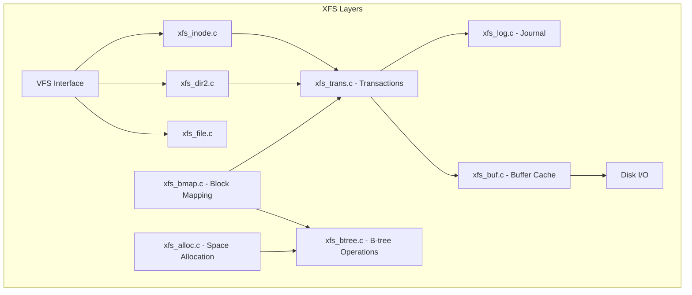
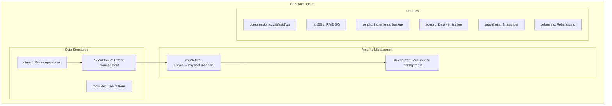

# Chapter 249: fs/ — Filesystem Implementations: VFS Layer, ext4, xfs, btrfs Source Walkthrough

## 1. Introduction and Intuition

The `fs/` directory contains one of the kernel's most architecturally elegant subsystems: the Virtual File System (VFS) layer and all filesystem implementations. The VFS provides a uniform interface so that applications can use the same `read()`, `write()`, `open()` system calls regardless of whether the underlying filesystem is ext4, XFS, Btrfs, NFS, or procfs.

### 1.1 The VFS Abstraction

The VFS is the kernel's "file system switchboard." When a user program calls `open("/home/user/file.txt")`, the VFS:

1. Parses the path, traversing directory components
2. Looks up each component in the dentry cache
3. If not cached, calls the filesystem's lookup method
4. Creates a `struct file` connected to the `inode`
5. Returns a file descriptor to the user

The key insight is that the VFS defines **interfaces** (virtual method tables), and each filesystem provides **implementations** of those interfaces. This is classic object-oriented design implemented in C.

### 1.2 Key VFS Objects

| Object | Represents | Key Structure |
|--------|-----------|---------------|
| **Superblock** | A mounted filesystem | `struct super_block` |
| **Inode** | A file/directory/symlink | `struct inode` |
| **Dentry** | A name → inode mapping | `struct dentry` |
| **File** | An open file | `struct file` |

The relationships: A **superblock** contains many **inodes**. An **inode** can have many **dentries** (hard links). A **file** points to an **inode** and tracks the current position.

---

## 2. Directory Layout

```
fs/
├── Makefile
├── Kconfig
│
├── namei.c                 # Path lookup (open, stat, etc.)
├── open.c                  # open(), close(), truncate()
├── read_write.c            # read(), write(), lseek()
├── stat.c                  # stat(), lstat(), fstat()
├── readdir.c               # getdents()
├── select.c                # select()/poll()
├── pipe.c                  # Pipe implementation
├── fifo.c                  # FIFO (named pipe) implementation
├── timerfd.c               # timerfd_create()
├── eventfd.c               # eventfd_create()
├── signalfd.c              # signalfd()
├── inotify.c               # inotify file watching
├── fanotify.c              # fanotify file watching
├── dnotify.c               # dnotify (legacy file notification)
│
├── buffer.c                # Buffer cache (block device page cache)
├── bio.c                   # (Moved to block/)
├── block_dev.c             # Block device operations
├── char_dev.c              # Character device operations
├── direct-io.c             # O_DIRECT I/O path
├── splice.c                # splice() and sendfile()
├── aio.c                   # Asynchronous I/O (legacy)
├── io_uring.c              # io_uring subsystem
│
├── namespace.c             # Mount namespace
├── mount.c                 # Mount/umount implementation
├── super.c                 # Superblock management
├── inode.c                 # Inode cache and management
├── dcache.c                # Dentry (directory entry) cache
├── file.c                  # struct file operations
├── file_table.c            # File table management
├── compat.c                # 32-bit compatibility ioctls
├── attr.c                  # File attribute manipulation
├
├── proc/                   # /proc filesystem
│   ├── base.c              # /proc/[pid]/ files
│   ├── cmdline.c           # /proc/cmdline
│   ├── cpuinfo.c           # /proc/cpuinfo
│   ├── meminfo.c           # /proc/meminfo
│   ├── version.c           # /proc/version
│   ├── stat.c              # /proc/stat
│   ├── uptime.c            # /proc/uptime
│   ├── loadavg.c           # /proc/loadavg
│   ├── filesystems.c       # /proc/filesystems
│   ├── mounts.c            # /proc/mounts
│   ├── net/                # /proc/net/
│   ├── sys/                # /proc/sys/
│   ├── sysctl.c            # sysctl interface
│   └── ...
│
├── sysfs/                  # /sys filesystem
│   ├── file.c              # Sysfs file operations
│   ├── dir.c               # Sysfs directory operations
│   ├── symlink.c           # Sysfs symlink operations
│   ├── group.c             # Sysfs group handling
│   └── mount.c             # Sysfs mount
│
├── debugfs/                # Debug filesystem
│   ├── inode.c             # Debugfs core
│   └── file.c              # Debugfs file operations
│
├── configfs/               # Config filesystem
│   ├── item.c              # Configfs items
│   ├── dir.c               # Configfs directory operations
│   └── file.c              # Configfs file operations
│
├── tmpfs/                  # tmpfs (RAM-based filesystem)
│   ├── inode.c             # tmpfs inode operations
│   ├── dir.c               # tmpfs directory operations
│   ├── file.c              # tmpfs file operations
│   └── shmem.c             # shmem/tmpfs shared memory
│
├── ramfs/                  # Simple RAM filesystem
│   ├── inode.c             # ramfs core
│   └── file-nommu.c        # ramfs for no-MMU systems
│
├── ext4/                   # ext4 filesystem
│   ├── ext4.h              # Main header
│   ├── super.c             # Superblock operations (mount, umount)
│   ├── inode.c             # Inode operations
│   ├── namei.c             # Directory operations (lookup, create, etc.)
│   ├── file.c              # File operations
│   ├── readpage.c          # Read-ahead and page cache
│   ├── extents.c           # Extent-based block mapping
│   ├── mballoc.c           # Multi-block allocator
│   ├── block_validity.c    # Block validity checking
│   ├── journal.c           # Journal operations
│   ├── jbd2/               # JBD2 journaling subsystem
│   ├── resize.c            # Online resize
│   ├── migrate.c           # Block migration (defrag)
│   ├── xattr.c             # Extended attributes
│   ├── acl.c               # POSIX ACLs
│   ├── dir.c               # Directory operations (HTree)
│   ├── symlink.c           # Symlink handling
│   ├── ioctl.c             # ext4-specific ioctls
│   ├── fsync.c             # fsync/fdatasync
│   ├── inline.c            # Inline data support
│   ├── verity.c            # fs-verity support
│   ├── encryption.c        # fscrypt support
│   └── ...
│
├── xfs/                    # XFS filesystem
│   ├── xfs_mount.h         # Mount structure
│   ├── xfs_inode.h         # Inode structure
│   ├── xfs_sb.c            # Superblock operations
│   ├── xfs_inode.c         # Inode operations
│   ├── xfs_dir2.c          # Directory operations (B+tree)
│   ├── xfs_bmap.c          # Block mapping (extent-based)
│   ├── xfs_alloc.c         # Space allocator
│   ├── xfs_btree.c         # B+tree implementation
│   ├── xfs_log.c           # Journal/log operations
│   ├── xfs_trans.c         # Transaction management
│   ├── xfs_buf.c           # Buffer management
│   ├── xfs_iomap.c         # I/O mapping
│   ├── xfs_aops.c          # Address space operations
│   ├── xfs_file.c          # File operations
│   ├── xfs_attr.c          # Extended attributes
│   ├── xfs_acl.c           # POSIX ACLs
│   ├── xfs_reflink.c       # Reflink (CoW) support
│   ├── xfs_scrub/          # Online scrub/repair
│   └── ...
│
├── btrfs/                  # Btrfs filesystem
│   ├── btrfs_inode.h       # Inode structure
│   ├── super.c             # Superblock operations
│   ├── inode.c             # Inode operations
│   ├── file.c              # File operations
│   ├── dir.c               # Directory operations
│   ├── extent-tree.c       # Extent management
│   ├── ctree.c             # B-tree implementation
│   ├── volumes.c           # Multi-device support
│   ├── raid56.c            # RAID 5/6 support
│   ├── compression.c       # Transparent compression
│   ├── send.c              # Send/receive (incremental backup)
│   ├── scrub.c             # Data scrubbing
│   ├── balance.c           # Balance (rebalance) operation
│   ├── qgroup.c            # Quota groups
│   ├── tree-log.c          # Tree log (fast fsync)
│   ├── free-space-cache.c  # Free space caching
│   ├── dev-replace.c       # Device replacement
│   ├── zoned.c             # Zoned device support
│   └── ...
│
├── fat/                    # FAT filesystem (Windows compatibility)
├── ntfs3/                  # NTFS filesystem (read-write)
├── iso9660/                # CD-ROM filesystem
├── nfs/                    # NFS client
├── nfsv4/                  # NFSv4 client
├── exportfs/               # Export support for NFS server
├── nfsd/                   # NFS server
├── cifs/                   # SMB/CIFS client (Windows shares)
├── fuse/                   # Filesystem in Userspace
├── overlayfs/              # Overlay filesystem (containers)
├── squashfs/               # SquashFS (compressed, read-only)
├── erofs/                  # EROFS (Enhanced Read-Only FS)
├── f2fs/                   # F2FS (Flash-Friendly FS)
├── jffs2/                  # JFFS2 (Journalling Flash FS)
├── ubifs/                  # UBIFS (Unsorted Block Image FS)
├── romfs/                  # ROM filesystem
├── cramfs/                 # Compressed ROM filesystem
├── adfs/                   # Acorn Disc Filing System
├── affs/                   # Amiga Fast File System
├── hfs/                    # Apple HFS
├── hfsplus/                # Apple HFS+
├── jfs/                    # IBM JFS
├── reiserfs/               # ReiserFS (legacy)
├── nilfs2/                 # NILFS2 (log-structured)
├── gfs2/                   # GFS2 (Red Hat cluster FS)
├── ocfs2/                  # OCFS2 (Oracle cluster FS)
├── ceph/                   # Ceph distributed FS client
├── orangefs/               # OrangeFS (parallel FS)
├── 9p/                     # Plan 9 filesystem protocol
├── autofs/                 # Automounter
├── befs/                   # BeOS filesystem
├── bfs/                    # BeOS BFS
├── coda/                   # Coda distributed FS
├── dlmfs/                  # DLM (Distributed Lock Manager) FS
├── efs/                    # SGI EFS
├── exfat/                  # exFAT filesystem
├── freevxfs/               # Veritas VxFS
├── minix/                  # Minix filesystem
├── ncpfs/                  # NetWare filesystem
├── sysv/                   # System V filesystem
├── udf/                    # Universal Disk Format (DVD)
├── ufs/                    # UFS (BSD/Solaris)
└── zonefs/                 # Zone filesystem (zoned storage)
```

---

## 3. VFS Core Data Structures

### 3.1 struct super_block — A Mounted Filesystem

```c
struct super_block {
    struct list_head        s_list;         /* Global superblock list */
    dev_t                   s_dev;          /* Device identifier */
    unsigned char           s_blocksize_bits;
    unsigned long           s_blocksize;
    loff_t                  s_maxbytes;     /* Max file size */
    struct file_system_type *s_type;        /* Filesystem type */
    const struct super_operations *s_op;    /* Superblock operations */
    struct dentry           *s_root;        /* Root dentry */
    struct rw_semaphore     s_umount;       /* Unmount semaphore */
    atomic_t                s_active;       /* Active reference count */
    
    struct block_device     *s_bdev;        /* Underlying block device */
    void                    *s_fs_info;     /* Filesystem-specific info */
    
    /* Quotas */
    struct quota_info       s_dquot;
    
    /* Shrinker for memory pressure */
    struct shrinker         *s_shrink;
    
    /* ... */
};
```

### 3.2 struct inode — A File/Directory

```c
struct inode {
    umode_t                 i_mode;         /* File type and permissions */
    unsigned short          i_opflags;
    kuid_t                  i_uid;          /* Owner UID */
    kgid_t                  i_gid;          /* Owner GID */
    unsigned int            i_flags;        /* Mount flags */
    
    const struct inode_operations   *i_op;  /* Inode operations */
    struct super_block      *i_sb;          /* Owning superblock */
    struct address_space    *i_mapping;     /* Page cache mapping */
    unsigned long           i_ino;          /* Inode number */
    
    union {
        const unsigned int  i_nlink;        /* Hard link count */
        unsigned int        __i_nlink;
    };
    dev_t                   i_rdev;         /* Device ID (if device file) */
    loff_t                  i_size;         /* File size in bytes */
    struct timespec64       __i_atime;      /* Access time */
    struct timespec64       __i_mtime;      /* Modification time */
    struct timespec64       __i_ctime;      /* Change time */
    
    spinlock_t              i_lock;
    atomic_t                i_count;        /* Reference count */
    struct rw_semaphore     i_rwsem;        /* Read-write semaphore */
    
    const struct file_operations    *i_fop; /* File operations */
    struct address_space            i_data; /* Embedded address_space */
    
    union {
        struct pipe_inode_info  *i_pipe;    /* If pipe */
        struct cdev             *i_cdev;    /* If char device */
        char                    *i_link;    /* If symlink */
        unsigned                i_dir_seq;  /* Directory sequencing */
    };
    
    void                    *i_private;     /* Filesystem-private data */
};
```

### 3.3 struct dentry — Directory Entry (Name → Inode)

```c
struct dentry {
    unsigned int            d_flags;        /* Dentry flags */
    seqcount_spinlock_t     d_seq;          /* Per-dentry seqlock */
    struct hlist_bl_node    d_hash;         /* Hash table node */
    struct dentry           *d_parent;      /* Parent dentry */
    struct qstr             d_name;         /* Name (string, hash, length) */
    struct inode            *d_inode;       /* Associated inode */
    
    union {
        struct list_head    d_lru;          /* LRU list */
        wait_queue_head_t   *d_wait;        /* Lookup wait queue */
    };
    struct list_head        d_child;        /* Child of parent */
    struct list_head        d_subdirs;      /* Children list */
    struct hlist_node       d_sib;          /* Sibling list */
    
    const struct dentry_operations *d_op;
    struct super_block      *d_sb;          /* Owning superblock */
    
    union {
        struct rcu_head     d_rcu;          /* RCU freeing */
        struct callback_head d_rcu;
    };
    
    /* ... */
};
```

### 3.4 struct file — An Open File

```c
struct file {
    union {
        struct llist_node   f_llist;
        struct rcu_head     f_rcuhead;
    };
    struct path             f_path;         /* Dentry + vfsmount */
    struct inode            *f_inode;       /* Cached inode */
    const struct file_operations *f_op;     /* File operations */
    
    spinlock_t              f_lock;
    atomic_long_t           f_count;        /* Reference count */
    unsigned int            f_flags;        /* O_RDONLY, O_NONBLOCK, etc. */
    fmode_t                 f_mode;         /* FMODE_READ, FMODE_WRITE */
    loff_t                  f_pos;          /* Current file position */
    struct mutex            f_pos_lock;
    struct fown_struct      f_owner;        /* Owner for SIGIO */
    void                    *private_data;  /* Driver-private data */
    struct address_space    *f_mapping;     /* Page cache mapping */
};
```

### 3.5 Operation Tables

Each VFS object has an operations table that the filesystem fills in:

```c
struct super_operations {
    struct inode *(*alloc_inode)(struct super_block *sb);
    void (*destroy_inode)(struct inode *);
    void (*dirty_inode)(struct inode *, int flags);
    int (*write_inode)(struct inode *, struct writeback_control *wbc);
    void (*evict_inode)(struct inode *);
    void (*put_super)(struct super_block *);
    int (*sync_fs)(struct super_block *sb, int wait);
    int (*freeze_super)(struct super_block *);
    int (*freeze_fs)(struct super_block *);
    int (*thaw_super)(struct super_block *);
    int (*statfs)(struct dentry *, struct kstatfs *);
    int (*remount_fs)(struct super_block *, int *, char *);
    void (*umount_begin)(struct super_block *);
    /* ... */
};

struct inode_operations {
    struct dentry *(*lookup)(struct inode *, struct dentry *, unsigned int);
    int (*create)(struct mnt_idmap *, struct inode *, struct dentry *, umode_t, bool);
    int (*link)(struct dentry *, struct inode *, struct dentry *);
    int (*unlink)(struct inode *, struct dentry *);
    int (*symlink)(struct mnt_idmap *, struct inode *, struct dentry *, const char *);
    int (*mkdir)(struct mnt_idmap *, struct inode *, struct dentry *, umode_t);
    int (*rmdir)(struct inode *, struct dentry *);
    int (*mknod)(struct mnt_idmap *, struct inode *, struct dentry *, umode_t, dev_t);
    int (*rename)(struct mnt_idmap *, struct inode *, struct dentry *,
                  struct inode *, struct dentry *, unsigned int);
    int (*setattr)(struct mnt_idmap *, struct dentry *, struct iattr *);
    int (*getattr)(struct mnt_idmap *, const struct path *, struct kstat *, u32, unsigned int);
    int (*permission)(struct mnt_idmap *, struct inode *, int);
    /* ... */
};

struct file_operations {
    struct module *owner;
    loff_t (*llseek)(struct file *, loff_t, int);
    ssize_t (*read)(struct file *, char __user *, size_t, loff_t *);
    ssize_t (*write)(struct file *, const char __user *, size_t, loff_t *);
    ssize_t (*read_iter)(struct kiocb *, struct iov_iter *);
    ssize_t (*write_iter)(struct kiocb *, struct iov_iter *);
    int (*iterate_shared)(struct file *, struct dir_context *);
    __poll_t (*poll)(struct file *, struct poll_table_struct *);
    long (*unlocked_ioctl)(struct file *, unsigned int, unsigned long);
    int (*mmap)(struct file *, struct vm_area_struct *);
    int (*open)(struct inode *, struct file *);
    int (*flush)(struct file *, fl_owner_t id);
    int (*release)(struct inode *, struct file *);
    int (*fsync)(struct file *, loff_t, loff_t, int datasync);
    int (*fasync)(int, struct file *, int);
    int (*flock)(struct file *, int, struct file_lock *);
    ssize_t (*splice_read)(struct file *, loff_t *, struct pipe_inode_info *, size_t, unsigned int);
    ssize_t (*splice_write)(struct pipe_inode_info *, struct file *, loff_t *, size_t, unsigned int);
    /* ... */
};
```

---

## 4. Path Lookup Walkthrough (namei.c)

The path lookup is one of the most performance-critical VFS operations:

```mermaid
sequenceDiagram
    USER as User Space
    VFS as VFS namei.c
    DCACHE as Dentry Cache
    FS as Filesystem lookup()
    DISK as Disk
    
    USER->>VFS: open("/home/user/file.txt")
    VFS->>VFS: Start at root dentry (/)
    
    VFS->>DCACHE: Lookup "home" in root's children
    alt Cache hit
        DCACHE-->>VFS: Return dentry for "home"
    else Cache miss
        DCACHE-->>VFS: Not found
        VFS->>FS: ext4_lookup(root_inode, "home")
        FS->>DISK: Read directory block
        DISK-->>FS: Inode number for "home"
        FS-->>VFS: Return new dentry
        VFS->>DCACHE: Add to dcache
    end
    
    VFS->>DCACHE: Lookup "user" in "home" dentry
    Note over VFS: Same process...
    
    VFS->>DCACHE: Lookup "file.txt" in "user" dentry
    Note over VFS: Same process...
    
    VFS->>VFS: Create struct file
    VFS->>FS: file->f_op->open()
    VFS-->>USER: Return file descriptor
```

### 4.1 The RCU Walk Optimization

Modern kernels use RCU (Read-Copy-Update) for lockless path lookup:

```c
static int link_path_walk(const char *name, struct nameidata *nd)
{
    /* RCU walk: no locks, just careful sequencing */
    if (nd->flags & LOOKUP_RCU) {
        /* Try lockless lookup */
        /* If we hit a symlink or miss cache, fall back to REF walk */
    }
    
    while (*name == '/')
        name++;
    if (!*name) {
        nd->flags &= ~LOOKUP_PARENT;
        return 0;
    }
    
    /* Walk each component */
    while (1) {
        /* Lookup current component */
        struct dentry *dentry = __d_lookup_rcu(parent, &this);
        
        if (!dentry) {
            /* Miss: fall back to ref walk */
            goto unlazy;
        }
        
        /* Check permissions */
        err = inode_permission(nd->mnt, dentry->d_inode, nd->flags);
        
        /* Follow mount points */
        if (d_mountpoint(dentry))
            dentry = __lookup_mnt(dentry);
        
        name = next_component;
    }
}
```

---

## 5. ext4 Walkthrough

### 5.1 Superblock (super.c)

```c
static int ext4_fill_super(struct super_block *sb, void *data, int silent)
{
    struct ext4_sb_info *sbi;
    struct ext4_super_block *es;
    
    /* 1. Read superblock from disk (block 1, offset 1024) */
    bh = sb_bread(sb, 1);
    es = (struct ext4_super_block *)(bh->b_data + 1024);
    
    /* 2. Validate magic number (0xEF53) */
    if (es->s_magic != cpu_to_le16(EXT4_SUPER_MAGIC))
        goto failed_mount;
    
    /* 3. Initialize sbi (superblock info) */
    sbi = kzalloc(sizeof(*sbi), GFP_KERNEL);
    sb->s_fs_info = sbi;
    sbi->s_sb = sb;
    sbi->s_es = es;
    
    /* 4. Parse options (mount -o ...) */
    ext4_parse_options(sb, data);
    
    /* 5. Set block size */
    sb->s_blocksize = le32_to_cpu(es->s_log_block_size);
    sb->s_blocksize_bits = sb->s_blocksize;
    
    /* 6. Initialize block groups */
    ext4_get_desc(sb);
    
    /* 7. Initialize journal (JBD2) */
    ext4_load_journal(sb, es);
    
    /* 8. Set up operations */
    sb->s_op = &ext4_sops;
    sb->s_export_op = &ext4_export_ops;
    sb->s_xattr = ext4_xattr_handlers;
    
    /* 9. Load root inode */
    root = ext4_iget(sb, EXT4_ROOT_INO);
    sb->s_root = d_make_root(root);
    
    return 0;
}
```

### 5.2 Extent-Based Block Mapping (extents.c)

ext4 uses extents to map file offsets to disk blocks:

```c
struct ext4_extent {
    __le32  ee_block;       /* First logical block */
    __le16  ee_len;         /* Number of blocks covered */
    __le16  ee_start_hi;    /* High 16 bits of physical block */
    __le32  ee_start_lo;    /* Low 32 bits of physical block */
};

struct ext4_extent_idx {
    __le32  ei_block;       /* Logical block covered by this index */
    __le32  ei_leaf_lo;     /* Low 32 bits of physical block of leaf */
    __le16  ei_leaf_hi;     /* High 16 bits of physical block */
    __le16  ei_unused;
};

struct ext4_extent_header {
    __le16  eh_magic;       /* 0xF30A */
    __le16  eh_entries;     /* Number of valid entries */
    __le16  eh_max;         /* Max entries before splitting */
    __le16  eh_depth;       /* Depth: 0 = leaf */
    __le32  eh_generation;  /* Generation for consistency */
};
```

The extent tree is a B-tree stored inside the inode's `i_block` array:

```
Inode i_block[60]:
┌─────────────────────────────────────────────────┐
│ Header: magic=0xF30A, entries=3, depth=1        │
│ Index[0]: block=0     → leaf at physical 1000   │
│ Index[1]: block=65536 → leaf at physical 2000   │
│ Index[2]: block=131072 → leaf at physical 3000  │
└─────────────────────────────────────────────────┘

Leaf at physical 1000:
┌─────────────────────────────────────────────────┐
│ Header: magic=0xF30A, entries=4, depth=0        │
│ Extent[0]: block=0,     len=32768, phys=500     │
│ Extent[1]: block=32768, len=16384, phys=600     │
│ Extent[2]: block=49152, len=8192,  phys=620     │
│ Extent[3]: block=57344, len=8192,  phys=640     │
└─────────────────────────────────────────────────┘
```

### 5.3 Multi-Block Allocator (mballoc.c)

The mballoc allocator allocates contiguous blocks efficiently:

```c
struct ext4_allocation_request {
    struct inode *inode;        /* File requesting blocks */
    unsigned int len;           /* Number of blocks requested */
    ext4_lblk_t logical;       /* Logical block number */
    ext4_lblk_t lleft;         /* Left neighbor logical */
    ext4_lblk_t lright;        /* Right neighbor logical */
    ext4_pblk_t goal;          /* Preferred physical block */
    ext4_pblk_t pleft;         /* Left neighbor physical */
    ext4_pblk_t pright;        /* Right neighbor physical */
    unsigned int flags;         /* Allocation flags */
};
```

The allocator tries to:
1. Allocate near the "goal" block (for locality)
2. Allocate in the same block group as the inode
3. Preallocate extra blocks for sequential writes

### 5.4 Journal (JBD2)

The JBD2 journal provides crash consistency:

```c
// fs/ext4/super.c - journal initialization
static int ext4_load_journal(struct super_block *sb,
                             struct ext4_super_block *es)
{
    journal_t *journal;
    
    journal = jbd2_journal_init_inode(sb, journal_inum);
    err = jbd2_journal_load(journal);
    
    /* Replay any uncommitted transactions */
    jbd2_journal_recover(journal);
    
    sbi->s_journal = journal;
}
```

A journal transaction:

```c
handle_t *handle = ext4_journal_start(inode, EXT4_HT_INODE, nblocks);

/* Modify metadata blocks */
ext4_mark_inode_dirty(handle, inode);
ext4_ext_insert_extent(handle, inode, &path, &newext);
ext4_handle_dirty_metadata(handle, NULL, bh);

ext4_journal_stop(handle);
```

---

## 6. XFS Walkthrough

### 6.1 XFS Architecture

XFS is a high-performance 64-bit journaling filesystem:



### 6.2 Key XFS Structures

```c
struct xfs_mount {
    struct super_block  *m_super;
    struct xfs_sb       m_sb;           /* On-disk superblock */
    
    struct xfs_buftarg  *m_ddev_targ;   /* Data device target */
    struct xfs_buftarg  *m_logdev_targ; /* Log device target */
    struct xfs_buftarg  *m_rtdev_targ;  /* Realtime device target */
    
    struct xfs_ail      m_ail;          /* Active Item List (for log) */
    struct xfs_perag    *m_perag;       /* Per-allocation-group data */
    
    /* B-tree cursor caches */
    struct xfs_btree_cur *m_bmap_cur;
    
    /* ... */
};

struct xfs_inode {
    struct xfs_icdinode  i_d;           /* On-disk inode core */
    struct xfs_imap      i_imap;        /* Inode location on disk */
    struct xfs_ifork     *i_afp;        /* Attribute fork */
    struct xfs_ifork     i_df;          /* Data fork */
    
    struct inode         i_vnode;       /* VFS inode (embedded) */
    
    uint64_t             i_flush_seq;   /* Flush sequence */
    atomic_t             i_pincount;    /* Pin count (in log) */
    spinlock_t           i_flags_lock;
    unsigned long        i_flags;
    
    /* ... */
};
```

### 6.3 XFS Transactions

Every metadata modification in XFS is wrapped in a transaction:

```c
struct xfs_trans {
    struct xfs_mount        *t_mountp;
    struct xfs_log_item     *t_items;      /* Items dirtied in this transaction */
    xfs_lsn_t               t_lsn;         /* Log sequence number when committed */
    unsigned int            t_flags;
    
    /* Block reservations */
    int                     t_blk_res;     /* Blocks reserved */
    int                     t_blk_res_used;/* Blocks actually used */
    
    /* Item tracking */
    struct list_head        t_items_list;
};
```

---

## 7. Btrfs Walkthrough

### 7.1 Btrfs Architecture

Btrfs is a copy-on-write (CoW) filesystem with built-in volume management:



### 7.2 Btrfs B-tree

Btrfs stores everything in B-trees (called "b-tree" or "ctree"):

```c
struct btrfs_root {
    struct extent_buffer *node;         /* Root node of the tree */
    struct btrfs_root_item root_item;
    
    struct rb_node rb_node;
    struct btrfs_key root_key;
    
    u64 objectid;                       /* Root object ID */
    u64 last_trans;                     /* Last transaction that modified this root */
    
    struct btrfs_fs_info *fs_info;
    
    /* ... */
};
```

Btrfs has multiple trees:
- **Root tree** (tree 0): Contains pointers to all other trees
- **Extent tree** (tree 2): Tracks all extents (allocated/free)
- **Chunk tree** (tree 3): Logical to physical address mapping
- **Device tree** (tree 4): Multi-device information
- **Fs tree** (tree 5): Filesystem data (inodes, directories, file data)
- **Checksum tree** (tree 7): Data checksums
- **Log tree**: Fast fsync journal

### 7.3 CoW (Copy-on-Write)

Every write in Btrfs creates new blocks rather than modifying existing ones:

```c
static noinline int btrfs_cow_file_range(struct btrfs_inode *inode,
                                          struct page *page,
                                          u64 start, u64 end)
{
    /* 1. Allocate new extent */
    ret = btrfs_alloc_data_chunk(inode, &alloc_hint, num_bytes, &disk_bytenr);
    
    /* 2. Write data to new location */
    btrfs_csum_one_bio(bio);
    
    /* 3. Update extent tree (old extent refcount-- → free; new extent added) */
    btrfs_drop_extent_map_range(inode, start, end, false);
    btrfs_set_extent_delalloc(inode, start, end, 0, &cached_state);
    
    /* 4. On fsync/commit: update fs tree with new extent pointers */
}
```

---

## 8. Other Important Filesystems

### 8.1 procfs (fs/proc/)

procfs exposes kernel data as files:

```c
// /proc/cpuinfo
static int show_cpuinfo(struct seq_file *m, void *v)
{
    struct cpuinfo_x86 *c = v;
    seq_printf(m, "processor\t: %d\n", cpu);
    seq_printf(m, "vendor_id\t: %s\n", c->x86_vendor_id);
    seq_printf(m, "model name\t: %s\n", c->x86_model_id);
    seq_printf(m, "cpu MHz\t\t: %u\n", c->cpu_khz / 1000);
    /* ... */
}
```

### 8.2 tmpfs (fs/tmpfs/)

tmpfs stores everything in RAM (no disk):

```c
static const struct super_operations shmem_ops = {
    .alloc_inode    = shmem_alloc_inode,
    .destroy_inode  = shmem_destroy_inode,
    .statfs         = shmem_statfs,
    .put_super       = shmem_put_super,
};
```

### 8.3 FUSE (fs/fuse/)

FUSE allows filesystems to run in user space:

```c
struct fuse_conn {
    /* ... */
    int connected;
    struct list_head pending;       /* Pending requests */
    struct list_head processing;    /* In-flight requests */
    wait_queue_head_t waitq;        /* User-space daemon wait queue */
    /* ... */
};
```

---

## 9. Diagrams

### 9.1 VFS Object Relationships

```mermaid
graph TB
    SB[super_block] --> |"s_root"| ROOT_DENTRY[dentry: "/"]
    SB --> |"s_op"| SB_OP[super_operations]
    
    ROOT_DENTRY --> |"d_inode"| ROOT_INODE[inode: /]
    ROOT_DENTRY --> |"d_child"| CHILD1[dentry: "home"]
    CHILD1 --> |"d_inode"| INODE2[inode: home/]
    CHILD1 --> |"d_child"| CHILD2[dentry: "file.txt"]
    CHILD2 --> |"d_inode"| FILE_INODE[inode: file.txt]
    
    FILE_INODE --> |"i_op"| INODE_OP[inode_operations]
    FILE_INODE --> |"i_fop"| FILE_OP[file_operations]
    FILE_INODE --> |"i_mapping"| PAGE_CACHE[address_space]
    
    FILE1[struct file: fd=3] --> |"f_inode"| FILE_INODE
    FILE2[struct file: fd=4] --> |"f_inode"| FILE_INODE
    
    FILE1 --> |"f_pos"| POS1[pos=0]
    FILE2 --> |"f_pos"| POS2[pos=1024]
```

### 9.2 File Read Path

```mermaid
sequenceDiagram
    USER as read(fd, buf, 4096)
    VFS as VFS read_write.c
    FS as ext4_file_read_iter
    PC as Page Cache
    BIO as Block Layer
    DISK as Disk
    
    USER->>VFS: sys_read()
    VFS->>VFS: fdget(fd) → struct file
    VFS->>FS: file->f_op->read_iter(kiocb, iov_iter)
    
    FS->>PC: page_cache_sync_readahead()
    alt Page in cache
        PC-->>FS: Page found, data ready
    else Page not in cache
        PC->>BIO: Submit READ bio
        BIO->>DISK: Read from disk
        DISK-->>BIO: Data transferred
        BIO-->>PC: Page added to cache
        PC-->>FS: Page now in cache
    end
    
    FS->>VFS: copy_to_user(buf, page_data, 4096)
    VFS-->>USER: Return 4096
```

---

## 10. References

1. **Linux Kernel Source**: `fs/` directory
2. **Documentation**: `Documentation/filesystems/`
3. **"Understanding the Linux Kernel, 3rd Edition"** — Bovet & Cesati (Chapter 12: The Virtual Filesystem)
4. **"Linux Kernel Development, 3rd Edition"** — Robert Love (Chapter 12: The Virtual Filesystem)
5. **ext4 Wiki**: ext4.wiki.kernel.org
6. **XFS Documentation**: xfs.wiki.kernel.org
7. **Btrfs Documentation**: btrfs.wiki.kernel.org
8. **"Design and Implementation of the Second Extended Filesystem"** — Card, Ts'o, Tweedie
9. **"The VFS Layer"** — LWN.net article series
10. **POSIX.1-2017**: File system interface specification
