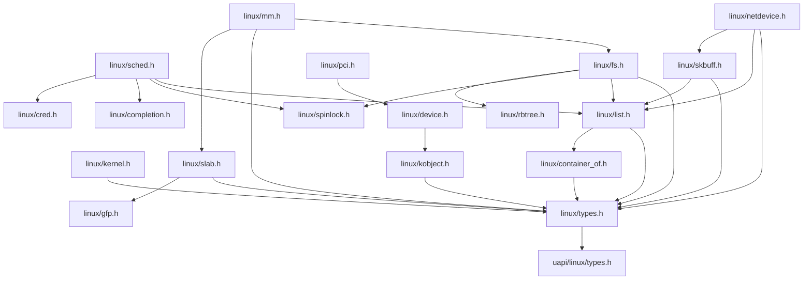

# Chapter 250: include/ — Kernel Headers: linux/, uapi/, Key Type Definitions, API Declarations

## 1. Introduction and Intuition

The `include/` directory is the kernel's public contract — the set of header files that define every data structure, function prototype, constant, and macro used throughout the kernel. Understanding the header structure is essential because headers are where the kernel's architecture is most explicitly defined: they specify the interfaces between subsystems, the types used everywhere, and the API contracts that all code must follow.

### 1.1 Why Headers Matter

Headers serve multiple roles in the kernel:

1. **Type definitions**: `struct task_struct`, `struct inode`, etc. — defined once in a header, used everywhere
2. **Function declarations**: Subsystem APIs declared in headers, implemented in `.c` files
3. **Constants and macros**: Error codes, flags, magic numbers
4. **Inline functions**: Small performance-critical functions defined in headers
5. **Architecture abstraction**: `<asm/>` headers provide platform-specific implementations
6. **User-space API**: `<uapi/>` headers define the stable ABI between kernel and user space

### 1.2 Header Categories

The kernel's headers are split into two main categories:

- **Internal headers** (`include/linux/`, `include/net/`, etc.): Used only within the kernel
- **UAPI headers** (`include/uapi/`): Exported to user space, stable ABI

This split is critical: UAPI headers must maintain backward compatibility forever. Internal headers can change freely between kernel versions.

---

## 2. Directory Layout

```
include/
├── Kbuild                     # Header installation rules
│
├── asm-generic/               # Generic architecture headers
│   ├── asm-offsets.h
│   ├── atomic.h
│   ├── bitops.h
│   ├── bug.h
│   ├── cmpxchg.h
│   ├── current.h
│   ├── delay.h
│   ├── dma-mapping.h
│   ├── irqflags.h
│   ├── memory_model.h
│   ├── page.h
│   ├── pci.h
│   ├── preempt.h
│   ├── scatterlist.h
│   ├── sections.h
│   ├── signal.h
│   ├── string.h
│   ├── switch_to.h
│   ├── types.h
│   ├── uaccess.h
│   ├── unaligned.h
│   ├──unistd.h
│   └── ...
│
├── crypto/                    # Crypto subsystem headers
│   ├── aes.h
│   ├── hash.h
│   ├── skcipher.h
│   └── ...
│
├── acpi/                      # ACPI subsystem headers
│   ├── acpi.h
│   ├── acpi_bus.h
│   ├── acpi_drivers.h
│   └── ...
│
├── clocksource/               # Clock source headers
├── drm/                       # DRM (GPU) headers
├── dt-bindings/               # Device Tree binding constants
│   ├── clock/
│   ├── gpio/
│   ├── interrupt-controller/
│   ├── pinctrl/
│   └── ...
│
├── keys/                      # Key management headers
├── kvm/                       # KVM headers
├── media/                     # Media subsystem headers
├── memory/                    # Memory management headers
├── mic/                       # MIC (Intel Xeon Phi) headers
├── net/                       # Networking headers
│   ├── sock.h
│   ├── sk_buff.h
│   ├── ip.h
│   ├── tcp.h
│   ├── netlink.h
│   ├── netfilter/
│   ├── bridge/
│   ├── sched/
│   └── ...
│
├── pcmcia/                    # PCMCIA headers
├── rdma/                      # RDMA headers
├── scsi/                      # SCSI headers
├── soc/                       # SoC headers
├── sound/                     # Audio headers
├── target/                    # SCSI target headers
├── trace/                     # Tracing headers
├── uapi/                      # User-space API headers
│   ├── asm-generic/
│   ├── asm-x86/
│   ├── asm-arm64/
│   ├── linux/
│   │   ├── types.h
│   │   ├── errno.h
│   │   ├── fcntl.h
│   │   ├── ioctl.h
│   │   ├── ioctl.h
│   │   ├── ioctl.h
│   │   ├── ipc.h
│   │   ├── kernel.h
│   │   ├── keyctl.h
│   │   ├── limits.h
│   │   ├── loop.h
│   │   ├── mman.h
│   │   ├── module.h
│   │   ├── mount.h
│   │   ├── msg.h
│   │   ├── netlink.h
│   │   ├── param.h
│   │   ├── pci.h
│   │   ├── perf_event.h
│   │   ├── personality.h
│   │   ├── poll.h
│   │   ├── ptrace.h
│   │   ├── reboot.h
│   │   ├── resource.h
│   │   ├── sched.h
│   │   ├── sem.h
│   │   ├── shm.h
│   │   ├── signal.h
│   │   ├── socket.h
│   │   ├── sockios.h
│   │   ├── stat.h
│   │   ├── statfs.h
│   │   ├── stddef.h
│   │   ├── string.h
│   │   ├── sysctl.h
│   │   ├── sysinfo.h
│   │   ├── syslog.h
│   │   ├── taskstats.h
│   │   ├── time.h
│   │   ├── timex.h
│   │   ├── tty.h
│   │   ├── types.h
│   │   ├── uio.h
│   │   ├── unistd.h
│   │   ├── usbdevice_fs.h
│   │   ├── utime.h
│   │   ├── version.h
│   │   ├── videodev2.h
│   │   ├── virtio_*.h
│   │   ├── wait.h
│   │   └── ...
│   ├── misc/
│   ├── mtd/
│   ├── rdma/
│   ├── scsi/
│   ├── sound/
│   ├── video/
│   ├── xen/
│   └── ...
│
├── video/                     # Video/framebuffer headers
├── xen/                       # Xen hypervisor headers
│
├── linux/                     # *** Main kernel headers ***
│   ├── arch_topology.h
│   ├── audit.h
│   ├── backlight.h
│   ├── bcache.h
│   ├── bpf.h
│   ├── bpf_types.h
│   ├── brcmphy.h
│   ├── buffer_head.h
│   ├── bug.h
│   ├── build_bug.h
│   ├── cache.h
│   ├── can/
│   ├── cdev.h
│   ├── cgroup.h
│   ├── cgroup-defs.h
│   ├── clk.h
│   ├── clk-provider.h
│   ├── compat.h
│   ├── compiler.h
│   ├── compiler_types.h
│   ├── completion.h
│   ├── container_of.h
│   ├── context_tracking.h
│   ├── cpu.h
│   ├── cpu_pm.h
│   ├── cpufreq.h
│   ├── cpumask.h
│   ├── cred.h
│   ├── crypto.h
│   ├── ctype.h
│   ├── debug_locks.h
│   ├── delayacct.h
│   ├── device.h
│   ├── device-mapper.h
│   ├── devpts_fs.h
│   ├── dma-buf.h
│   ├── dma-direction.h
│   ├── dma-mapping.h
│   ├── dcache.h
│   ├── dnotify.h
│   ├── edd.h
│   ├── elf.h
│   ├── elfcore.h
│   ├── err.h
│   ├── errno.h
│   ├── etherdevice.h
│   ├── exportfs.h
│   ├── extable.h
│   ├── fcntl.h
│   ├── fd.h
│   ├── file.h
│   ├── filter.h
│   ├── freezer.h
│   ├── fs.h
│   ├── fs_struct.h
│   ├── fscache.h
│   ├── ftrace.h
│   ├── futex.h
│   ├── gcd.h
│   ├── genalloc.h
│   ├── genhd.h
│   ├── genl_magic_func.h
│   ├── gpio.h
│   ├── hardirq.h
│   ├── hash.h
│   ├── hid.h
│   ├── highmem.h
│   ├── huge_mm.h
│   ├── hw_breakpoint.h
│   ├── hwspinlock.h
│   ├── idr.h
│   ├── if.h
│   ├── if_ether.h
│   ├── in.h
│   ├── in6.h
│   ├── inet.h
│   ├── init.h
│   ├── init_task.h
│   ├── inotify.h
│   ├── interrupt.h
│   ├── iomap.h
│   ├── ioprio.h
│   ├── ipc.h
│   ├── ipc_namespace.h
│   ├── irq.h
│   ├── irq_work.h
│   ├── irqdesc.h
│   ├── irqdomain.h
│   ├── jbd2.h
│   ├── jiffies.h
│   ├── jump_label.h
│   ├── kallsyms.h
│   ├── kbd_kern.h
│   ├── kconfig.h
│   ├── kernel.h
│   ├── kernel_stat.h
│   ├── kexec.h
│   ├── klist.h
│   ├── kmemleak.h
│   ├── kmod.h
│   ├── kmsg_dump.h
│   ├── kobject.h
│   ├── kobject_ns.h
│   ├── kprobes.h
│   ├── kref.h
│   ├── ks0108.h
│   ├── kthread.h
│   ├── ktime.h
│   ├── latencytop.h
│   ├── launcher.h
│   ├── lcm.h
│   ├── leds.h
│   ├── libata.h
│   ├── license.h
│   ├── linkage.h
│   ├── list.h
│   ├── list_bl.h
│   ├── list_lru.h
│   ├── list_nulls.h
│   ├── llist.h
│   ├── lockd/
│   ├── lockdep.h
│   ├── log2.h
│   ├── lzo.h
│   ├── math64.h
│   ├── mbcache.h
│   ├── memory.h
│   ├── mempolicy.h
│   ├── mempool.h
│   ├── memremap.h
│   ├── migrate.h
│   ├── min_heap.h
│   ├── mISDNif.h
│   ├── mm.h
│   ├── mm_types.h
│   ├── mmzone.h
│   ├── mnt_namespace.h
│   ├── module.h
│   ├── moduleparam.h
│   ├── mount.h
│   ├── mroute.h
│   ├── msg.h
│   ├── mutex.h
│   ├── namei.h
│   ├── nbd.h
│   ├── net.h
│   ├── netdev_features.h
│   ├── netdevice.h
│   ├── netfilter.h
│   ├── netlink.h
│   ├── nfs.h
│   ├── nfs_fs.h
│   ├── nmi.h
│   ├── nodemask.h
│   ├── notifier.h
│   ├── nsproxy.h
│   ├── ntb.h
│   ├── nvmem-provider.h
│   ├── of.h
│   ├── of_device.h
│   ├── of_irq.h
│   ├── oprofile.h
│   ├── overflow.h
│   ├── page-flags.h
│   ├── page_ref.h
│   ├── panic.h
│   ├── parser.h
│   ├── pci.h
│   ├── pci-epc.h
│   ├── pci-epf.h
│   ├── percpu.h
│   ├── percpu-refcount.h
│   ├── percpu-rwsem.h
│   ├── perf_event.h
│   ├── personality.h
│   ├── pid.h
│   ├── pid_namespace.h
│   ├── pipe_fs_i.h
│   ├── plist.h
│   ├── pm.h
│   ├── pm_opp.h
│   ├── pm_runtime.h
│   ├── pnp.h
│   ├── poll.h
│   ├── posix_acl.h
│   ├── posix-timers.h
│   ├── preempt.h
│   ├── printcolors.h
│   ├── printk.h
│   ├── proc_fs.h
│   ├── proc_ns.h
│   ├── profile.h
│   ├── psci.h
│   ├── pstore.h
│   ├── ptrace.h
│   ├── radix-tree.h
│   ├── ramfs.h
│   ├── random.h
│   ├── ratelimit.h
│   ├── rculist.h
│   ├── rcupdate.h
│   ├── rcutree.h
│   ├── reboot.h
│   ├── refcount.h
│   ├── regmap.h
│   ├── regulator.h
│   ├── relay.h
│   ├── remoteproc.h
│   ├── reservation.h
│   ├── reset.h
│   ├── resource.h
│   ├── resume-trace.h
│   ├── return_address.h
│   ├── rio.h
│   ├── rmap.h
│   ├── root_dev.h
│   ├── roundup.h
│   ├── route.h
│   ├── rpmsg.h
│   ├── rslib.h
│   ├── rtc.h
│   ├── rwlock.h
│   ├── rwsem.h
│   ├── scatterlist.h
│   ├── sched.h
│   ├── sched/coredump.h
│   ├── sched/smt.h
│   ├── screen_info.h
│   ├── sctp.h
│   ├── secbits.h
│   ├── security.h
│   ├── semaphore.h
│   ├── seq_file.h
│   ├── seqlock.h
│   ├── serial.h
│   ├── serial_core.h
│   ├── shm.h
│   ├── shmem_fs.h
│   ├── signal.h
│   ├── signal_types.h
│   ├── slab.h
│   ├── smp.h
│   ├── socket.h
│   ├── sockio.h
│   ├── sort.h
│   ├── spi/spi.h
│   ├── spinlock.h
│   ├── srcu.h
│   ├── stackdepot.h
│   ├── stacktrace.h
│   ├── start_kernel.h
│   ├── stat.h
│   ├── static_key.h
│   ├── stddef.h
│   ├── stm.h
│   ├── stop_machine.h
│   ├── string.h
│   ├── string_helpers.h
│   ├── sudden_death.h
│   ├── swap.h
│   ├── swapops.h
│   ├── swiotlb.h
│   ├── syscalls.h
│   ├── syscore_ops.h
│   ├── sysctl.h
│   ├── sysfs.h
│   ├── sysinfo.h
│   ├── syslog.h
│   ├── sysrq.h
│   ├── sys_soc.h
│   ├── task_io_accounting.h
│   ├── task_work.h
│   ├── taskstats.h
│   ├── task_io_accounting.h
│   ├── thermal.h
│   ├── thread_info.h
│   ├── threads.h
│   ├── tick.h
│   ├── time.h
│   ├── time64.h
│   ├── timekeeping.h
│   ├── timer.h
│   ├── timerfd.h
│   ├── timerqueue.h
│   ├── timex.h
│   ├── topolgy.h
│   ├── translation/translation_helpers.h
│   ├── trap.h
│   ├── tso.h
│   ├── tty.h
│   ├── tty_driver.h
│   ├── tty_flip.h
│   ├── types.h
│   ├── u64_stats_sync.h
│   ├── uaccess.h
│   ├── uio.h
│   ├── unaligned.h
│   ├── unistd.h
│   ├── usb.h
│   ├── usb/ch9.h
│   ├── usbdevice_fs.h
│   ├── user.h
│   ├── utime.h
│   ├──utsname.h
│   ├── uuid.h
│   ├── verifier.h
│   ├── version.h
│   ├── vfio.h
│   ├── vgaarb.h
│   ├── vga_switcheroo.h
│   ├── virtio.h
│   ├── virtio_*.h
│   ├── vhost.h
│   ├── vmalloc.h
│   ├── vm_event_item.h
│   ├── vmpressure.h
│   ├── wakelock.h
│   ├── watchdog.h
│   ├── workqueue.h
│   ├── writeback.h
│   ├── xarray.h
│   └── ...
│
├── vdso/                      # vDSO headers
└── xscsi/                     # Legacy SCSI headers
```

---

## 3. Key Header Files in Detail

### 3.1 include/linux/sched.h — The Task Structure

This is arguably the most important header in the kernel. It defines `struct task_struct`, which represents a process or thread:

```c
struct task_struct {
    struct thread_info          thread_info;
    
    /* State */
    volatile long               state;          /* -1 unrunnable, 0 runnable, >0 stopped */
    unsigned int                flags;          /* PF_* flags */
    unsigned int                ptrace;
    
    /* Scheduling */
    int                         prio;           /* Dynamic priority */
    int                         static_prio;    /* Static priority (nice-based) */
    int                         normal_prio;
    unsigned int                rt_priority;    /* Real-time priority */
    const struct sched_class    *sched_class;   /* Scheduling class */
    struct sched_entity         se;             /* CFS scheduling entity */
    struct sched_rt_entity      rt;             /* RT scheduling entity */
    struct sched_dl_entity      dl;             /* Deadline scheduling entity */
    
    /* Process relationships */
    struct task_struct __rcu    *real_parent;
    struct task_struct __rcu    *parent;
    struct list_head            children;
    struct list_head            sibling;
    struct task_struct          *group_leader;
    
    /* PID */
    pid_t                       pid;
    pid_t                       tgid;
    struct pid_link             pids[PIDTYPE_MAX];
    
    /* Credentials */
    const struct cred __rcu     *cred;          /* Effective credentials */
    const struct cred __rcu     *real_cred;     /* Objective credentials */
    
    /* Memory management */
    struct mm_struct            *mm;            /* Memory descriptor */
    struct mm_struct            *active_mm;
    
    /* File system */
    struct fs_struct            *fs;            /* Current directory, root */
    struct files_struct         *files;         /* Open file table */
    
    /* Signal handling */
    struct signal_struct        *signal;
    struct sighand_struct __rcu *sighand;
    sigset_t                    blocked;
    sigset_t                    real_blocked;
    struct sigpending           pending;
    
    /* IPC namespaces */
    struct nsproxy              *nsproxy;
    
    /* Timing */
    u64                         utime;          /* User time */
    u64                         stime;          /* System time */
    u64                         start_time;     /* Start time */
    
    /* CPU state */
    int                         on_cpu;
    int                         cpu;
    unsigned int                wake_cpu;
    
    /* Stack */
    void                        *stack;         /* Kernel stack base */
    struct thread_struct        thread;         /* Architecture-specific state */
    
    /* ... hundreds more fields ... */
};
```

### 3.2 include/linux/mm_types.h — Memory Descriptor

```c
struct mm_struct {
    struct maple_tree           mm_mt;          /* Maple tree for VMAs */
    struct rw_semaphore         mmap_lock;      /* Protects VMAs */
    
    unsigned long               task_size;      /* Size of user address space */
    
    pgd_t                      *pgd;            /* Page global directory */
    
    atomic_t                    mm_users;       /* Address space users */
    atomic_t                    mm_count;       /* Reference count */
    
    atomic_long_t               pgtables_bytes; /* Page table size */
    int                         map_count;      /* Number of VMAs */
    
    spinlock_t                  page_table_lock;
    
    struct list_head            mmlist;         /* List of all mm_structs */
    
    /* Code, data, heap segments */
    unsigned long               start_code, end_code;
    unsigned long               start_data, end_data;
    unsigned long               start_brk, brk;
    unsigned long               start_stack;
    
    /* Memory areas (VMAs) */
    struct vm_area_struct       *mmap;          /* VMA linked list */
    struct rb_root_cached       mm_rb;          /* VMA red-black tree */
    
    /* ... */
};
```

### 3.3 include/linux/fs.h — Filesystem Structures

This header defines the core filesystem types and the `file_operations`, `inode_operations`, `super_operations` tables we saw in Chapter 249.

Key declarations:

```c
/* File operations table */
extern const struct file_operations def_blk_fops;   /* Default block device */
extern const struct file_operations def_chr_fops;   /* Default char device */
extern const struct file_operations def_fifo_fops;  /* Default FIFO */
extern const struct file_operations bad_sock_fops;  /* Bad socket */

/* VFS syscalls */
extern long do_sys_open(int dfd, const char __user *filename, int flags, umode_t mode);
extern struct file *filp_open(const char *, int, umode_t);
extern void fput(struct file *);
extern struct file *get_empty_filp(void);
```

### 3.4 include/linux/slab.h — Slab Allocator API

```c
/* Allocate memory */
void *kmalloc(size_t size, gfp_t flags);
void *kzalloc(size_t size, gfp_t flags);           /* Zero-initialized */
void *kmalloc_array(size_t n, size_t size, gfp_t flags);
void *kcalloc(size_t n, size_t size, gfp_t flags);
void *krealloc(const void *p, size_t new_size, gfp_t flags);
void kfree(const void *obj);
void kvfree(const void *addr);

/* Slab caches */
struct kmem_cache *kmem_cache_create(const char *name, size_t size,
                                     size_t align, unsigned long flags,
                                     void (*ctor)(void *));
void *kmem_cache_alloc(struct kmem_cache *s, gfp_t flags);
void kmem_cache_free(struct kmem_cache *s, void *obj);
void kmem_cache_destroy(struct kmem_cache *s);

/* Flags */
#define GFP_KERNEL      (__GFP_RECLAIM | __GFP_IO | __GFP_FS)
#define GFP_ATOMIC      (__GFP_HIGH)
#define GFP_NOWAIT      (__GFP_RECLAIM)
#define GFP_NOIO        (__GFP_RECLAIM)
#define GFP_NOFS        (__GFP_RECLAIM | __GFP_IO)
#define GFP_USER        (__GFP_RECLAIM | __GFP_IO | __GFP_FS | __GFP_HARDWALL)
#define GFP_DMA         __GFP_DMA
#define GFP_DMA32       __GFP_DMA32
#define GFP_HIGHUSER    (GFP_USER | __GFP_HIGHMEM)
#define __GFP_ZERO      ((__force gfp_t)___GFP_ZERO)
```

### 3.5 include/linux/list.h — Linked Lists

The kernel's intrusive linked list is one of its most used data structures:

```c
struct list_head {
    struct list_head *next, *prev;
};

/* Initialize */
#define LIST_HEAD_INIT(name) { &(name), &(name) }
#define LIST_HEAD(name) struct list_head name = LIST_HEAD_INIT(name)
#define INIT_LIST_HEAD(ptr) do { (ptr)->next = (ptr); (ptr)->prev = (ptr); } while (0)

/* Add */
static inline void list_add(struct list_head *new, struct list_head *head);
static inline void list_add_tail(struct list_head *new, struct list_head *head);

/* Delete */
static inline void list_del(struct list_head *entry);
static inline void list_del_init(struct list_head *entry);

/* Move */
static inline void list_move(struct list_head *list, struct list_head *head);
static inline void list_move_tail(struct list_head *list, struct list_head *head);

/* Iteration */
#define list_for_each(pos, head) \
    for (pos = (head)->next; pos != (head); pos = pos->next)

#define list_for_each_entry(pos, head, member) \
    for (pos = list_first_entry(head, typeof(*pos), member); \
         &pos->member != (head); \
         pos = list_next_entry(pos, member))

/* Container-of macro */
#define container_of(ptr, type, member) ({ \
    void *__mptr = (void *)(ptr); \
    BUILD_BUG_ON_MSG(!__same_type(*(ptr), ((type *)0)->member) && \
                     !__same_type(*(ptr), void), \
                     "pointer type mismatch in container_of()"); \
    ((type *)(__mptr - offsetof(type, member))); \
})
```

### 3.6 include/linux/rbtree.h — Red-Black Trees

```c
struct rb_node {
    unsigned long  __rb_parent_color;
    struct rb_node *rb_right;
    struct rb_node *rb_left;
};

struct rb_root {
    struct rb_node *rb_node;
};

struct rb_root_cached {
    struct rb_root rb_root;
    struct rb_node *rb_leftmost;
};

/* Insert a node */
void rb_insert_color(struct rb_node *, struct rb_root *);

/* Erase a node */
void rb_erase(struct rb_node *, struct rb_root *);

/* Find/replace */
struct rb_node *rb_first(const struct rb_root *);
struct rb_node *rb_last(const struct rb_root *);
struct rb_node *rb_next(const struct rb_node *);
struct rb_node *rb_prev(const struct rb_node *);

/* Augmented rbtree (for interval trees, etc.) */
void rb_insert_augmented(struct rb_node *node, struct rb_root *root,
                         void (*augment_rotate)(struct rb_node *old,
                                                struct rb_node *new));
```

### 3.7 include/linux/completion.h — Completions

```c
struct completion {
    unsigned int done;
    wait_queue_head_t wait;
};

#define DECLARE_COMPLETION(work) \
    struct completion work = { .done = 0, .wait = __WAIT_QUEUE_HEAD_INITIALIZER(work.wait) }

void init_completion(struct completion *x);
void wait_for_completion(struct completion *x);
bool wait_for_completion_timeout(struct completion *x, unsigned long timeout);
void complete(struct completion *x);
void complete_all(struct completion *x);
```

### 3.8 include/linux/spinlock.h — Spinlocks

```c
typedef struct spinlock {
    union {
        struct raw_spinlock rlock;
#ifdef CONFIG_DEBUG_LOCK_ALLOC
# define LOCK_PADSIZE (offsetof(struct raw_spinlock, dep_map))
        struct {
            u8 __padding[LOCK_PADSIZE];
            struct lockdep_map dep_map;
        };
#endif
    };
} spinlock_t;

/* Usage */
spinlock_t my_lock;
spin_lock_init(&my_lock);

spin_lock(&my_lock);           /* Disable preemption, acquire lock */
/* ... critical section ... */
spin_unlock(&my_lock);         /* Release lock, enable preemption */

spin_lock_irq(&my_lock);      /* Disable IRQs and preemption, acquire */
spin_unlock_irq(&my_lock);    /* Release and enable IRQs */

spin_lock_irqsave(&my_lock, flags);   /* Save IRQ state, disable, acquire */
spin_unlock_irqrestore(&my_lock, flags); /* Release and restore IRQ state */

spin_lock_bh(&my_lock);       /* Disable bottom halves, acquire */
spin_unlock_bh(&my_lock);     /* Release and enable bottom halves */
```

### 3.9 include/linux/mutex.h — Mutexes

```c
struct mutex {
    atomic_long_t       owner;
    raw_spinlock_t      wait_lock;
    struct list_head    wait_list;
#ifdef CONFIG_DEBUG_MUTEXES
    void                *magic;
#endif
#ifdef CONFIG_DEBUG_LOCK_ALLOC
    struct lockdep_map  dep_map;
#endif
};

#define DEFINE_MUTEX(name) \
    struct mutex name = __MUTEX_INITIALIZER(name)

mutex_init(&my_mutex);
mutex_lock(&my_mutex);          /* Sleep until acquired */
mutex_unlock(&my_mutex);        /* Release */
mutex_trylock(&my_mutex);       /* Non-blocking acquire */
mutex_lock_interruptible(&my_mutex); /* Interruptible sleep */
```

### 3.10 include/linux/workqueue.h — Work Queues

```c
struct work_struct {
    atomic_long_t data;
    struct list_head entry;
    work_func_t func;
#ifdef CONFIG_DEBUG_OBJECTS_WORK
    struct debug_obj_descr *debug_descr;
#endif
};

struct delayed_work {
    struct work_struct work;
    struct timer_list timer;
    struct workqueue_struct *wq;
    int cpu;
};

#define DECLARE_WORK(name, function) \
    struct work_struct name = __WORK_INITIALIZER(name, function)

#define INIT_WORK(_work, _func) \
    do { \
        INIT_LIST_HEAD(&(_work)->entry); \
        (_work)->func = (_func); \
    } while (0)

/* Queue work */
bool queue_work(struct workqueue_struct *wq, struct work_struct *work);
bool schedule_work(struct work_struct *work);  /* system_wq */

/* Delayed work */
bool queue_delayed_work(struct workqueue_struct *wq,
                        struct delayed_work *dwork, unsigned long delay);
bool schedule_delayed_work(struct delayed_work *dwork, unsigned long delay);

/* Wait for completion */
void flush_work(struct work_struct *work);
void flush_scheduled_work(void);
```

---

## 4. UAPI Headers (include/uapi/)

### 4.1 Purpose and Stability

UAPI (User-space API) headers define the stable ABI between the kernel and user space. These headers must maintain backward compatibility:

```c
// include/uapi/linux/types.h
#ifndef __ASSEMBLY__
typedef __u16 __le16;
typedef __u16 __be16;
typedef __u32 __le32;
typedef __u32 __be32;
typedef __u64 __le64;
typedef __u64 __be64;
/* ... */
#endif
```

### 4.2 System Call Numbers

```c
// Generated from arch/x86/entry/syscalls/syscall_64.tbl
// include/uapi/asm-x86/unistd_64.h
#define __NR_read           0
#define __NR_write          1
#define __NR_open           2
#define __NR_close          3
#define __NR_stat           4
#define __NR_fstat          5
#define __NR_lstat          6
#define __NR_poll           7
#define __NR_lseek          8
#define __NR_mmap           9
#define __NR_mprotect       10
#define __NR_munmap         11
#define __NR_brk            12
/* ... */
```

### 4.3 ioctl Numbers

```c
// include/uapi/linux/ioctl.h
#define _IOC(dir,type,nr,size) \
    (((dir)  << _IOC_DIRSHIFT) | \
     ((type) << _IOC_TYPESHIFT) | \
     ((nr)   << _IOC_NRSHIFT) | \
     ((size) << _IOC_SIZESHIFT))

#define _IO(type,nr)        _IOC(_IOC_NONE,(type),(nr),0)
#define _IOR(type,nr,size)  _IOC(_IOC_READ,(type),(nr),sizeof(size))
#define _IOW(type,nr,size)  _IOC(_IOC_WRITE,(type),(nr),sizeof(size))
#define _IOWR(type,nr,size) _IOC(_IOC_READ|_IOC_WRITE,(type),(nr),sizeof(size))
```

### 4.4 Key UAPI Headers

| Header | Defines |
|--------|---------|
| `linux/types.h` | Basic types: `__u8`, `__u16`, `__u32`, `__u64`, `__le16`, `__be32` |
| `linux/errno.h` | Error codes: `EPERM`, `ENOENT`, `EIO`, `ENOMEM`, etc. |
| `linux/fcntl.h` | File flags: `O_RDONLY`, `O_WRONLY`, `O_CREAT`, `O_NONBLOCK` |
| `linux/mman.h` | Memory flags: `PROT_READ`, `MAP_PRIVATE`, `MAP_ANONYMOUS` |
| `linux/sched.h` | Scheduling: `SCHED_NORMAL`, `SCHED_FIFO`, `SCHED_RR` |
| `linux/signal.h` | Signals: `SIGTERM`, `SIGKILL`, `SIGSEGV`, signal sets |
| `linux/socket.h` | Socket types: `AF_INET`, `SOCK_STREAM`, `SOL_SOCKET` |
| `linux/stat.h` | File stats: `struct stat`, `S_IFREG`, permissions |
| `linux/io_uring.h` | io_uring: `struct io_uring_params`, ring operations |
| `linux/bpf.h` | BPF: program types, map types, helper functions |
| `linux/perf_event.h` | Perf events: event types, attributes |

---

## 5. Architecture Headers (arch/X/include/asm/)

### 5.1 The asm Symlink

When the kernel is configured for a specific architecture (e.g., x86), the build system creates:

```
include/asm → arch/x86/include/asm
```

This means `<asm/processor.h>` resolves to `arch/x86/include/asm/processor.h` on x86 and `arch/arm64/include/asm/processor.h` on ARM64.

### 5.2 Key Architecture Headers

| Header | Purpose |
|--------|---------|
| `<asm/current.h>` | Get current task pointer |
| `<asm/processor.h>` | CPU info, thread struct |
| `<asm/ptrace.h>` | Register state (`pt_regs`) |
| `<asm/irqflags.h>` | IRQ enable/disable |
| `<asm/page.h>` | Page size, page flags |
| `<asm/pgtable.h>` | Page table manipulation |
| `<asm/tlbflush.h>` | TLB flushing |
| `<asm/uaccess.h>` | User-space memory access |
| `<asm/atomic.h>` | Atomic operations |
| `<asm/cmpxchg.h>` | Compare-and-swap |
| `<asm/barrier.h>` | Memory barriers |
| `<asm/switch_to.h>` | Context switching |
| `<asm/syscall.h>` | Syscall number extraction |
| `<asm/unistd.h>` | Syscall number definitions |

### 5.3 Architecture-Neutral Defaults

```c
// include/asm-generic/atomic.h
// Default atomic_t implementation using locks
// Overridden by arch-specific versions that use hardware atomics

// arch/x86/include/asm/atomic.h
// Uses LOCK XADD, LOCK CMPXCHG etc.

// arch/arm64/include/asm/atomic.h
// Uses LDXR/STXR (load-exclusive/store-exclusive)
```

---

## 6. Header Include Patterns

### 6.1 The Include Order

Kernel code follows a specific include order:

```c
/* 1. Linux kernel headers (most to least generic) */
#include <linux/module.h>
#include <linux/kernel.h>
#include <linux/slab.h>
#include <linux/fs.h>

/* 2. Subsystem headers */
#include <linux/netdevice.h>
#include <linux/etherdevice.h>

/* 3. Architecture headers */
#include <asm/io.h>
#include <asm/irq.h>

/* 4. Local headers */
#include "my_private_header.h"
```

### 6.2 Forward Declarations vs Includes

To reduce compile time and break circular dependencies, headers use forward declarations:

```c
// include/linux/fs.h
struct super_block;     /* Forward declaration */
struct inode;           /* Forward declaration */
struct file;            /* Forward declaration */
struct dentry;          /* Forward declaration */

/* Only include what's strictly needed */
#include <linux/types.h>
#include <linux/list.h>
#include <linux/cache.h>
#include <linux/spinlock.h>
```

### 6.3 include/linux/kernel.h — Common Utilities

```c
/* Min/Max */
#define min(x, y) ({ \
    typeof(x) _min1 = (x); \
    typeof(y) _min2 = (y); \
    (void) (&_min1 == &_min2); \
    _min1 < _min2 ? _min1 : _min2; })

#define max(x, y) ({ \
    typeof(x) _max1 = (x); \
    typeof(y) _max2 = (y); \
    (void) (&_max1 == &_max2); \
    _max1 > _max2 ? _max1 : _max2; })

/* Array size */
#define ARRAY_SIZE(arr) (sizeof(arr) / sizeof((arr)[0]) + __must_be_array(arr))

/* Alignment */
#define ALIGN(x, a) __ALIGN_KERNEL((x), (a))
#define PTR_ALIGN(p, a) ((typeof(p))ALIGN((unsigned long)(p), (a)))

/* Container of */
#define container_of(ptr, type, member) ...

/* Printf */
#define pr_info(fmt, ...) printk(KERN_INFO pr_fmt(fmt), ##__VA_ARGS__)
#define pr_warn(fmt, ...) printk(KERN_WARNING pr_fmt(fmt), ##__VA_ARGS__)
#define pr_err(fmt, ...) printk(KERN_ERR pr_fmt(fmt), ##__VA_ARGS__)
#define pr_debug(fmt, ...) printk(KERN_DEBUG pr_fmt(fmt), ##__VA_ARGS__)
```

### 6.4 include/linux/err.h — Error Handling

```c
/* Encode error as pointer */
static inline void *ERR_PTR(long error)
{
    return (void *)error;
}

/* Extract error from pointer */
static inline long PTR_ERR(const void *ptr)
{
    return (long)ptr;
}

/* Check if pointer is error */
static inline bool IS_ERR(const void __user *ptr)
{
    return unlikely((unsigned long)ptr >= (unsigned long)-MAX_ERRNO);
}

/* Check and extract error */
static inline long PTR_ERR_OR_ZERO(const void *ptr)
{
    return IS_ERR(ptr) ? PTR_ERR(ptr) : 0;
}

/* Typical usage pattern */
struct device *dev = get_device();
if (IS_ERR(dev))
    return PTR_ERR(dev);
```

---

## 7. The `typeof` and `__attribute__` Extensions

The kernel uses GCC extensions extensively:

```c
/* typeof: Get the type of an expression */
#define min(x, y) ({ \
    typeof(x) _min1 = (x); \
    typeof(y) _min2 = (y); \
    _min1 < _min2 ? _min1 : _min2; })

/* __attribute__((packed)): No padding */
struct __attribute__((packed)) my_struct {
    u8 a;
    u32 b;
    u8 c;
};

/* __attribute__((aligned(N))): Alignment */
struct __attribute__((aligned(64))) cache_line_struct {
    int data;
};

/* __attribute__((section("name"))): Place in specific section */
#define __init          __section(.init.text)
#define __initdata      __section(.init.data)
#define __exit          __section(.exit.text)
#define __exitdata      __section(.exit.data)

/* __attribute__((unused)) */
#define __maybe_unused  __attribute__((unused))

/* __attribute__((noreturn)) */
#define __noreturn      __attribute__((noreturn))

/* __attribute__((format(printf, ...))) */
#define __printf(a, b)  __attribute__((format(printf, a, b)))
```

---

## 8. Header Dependency Graph



---

## 9. Relationships with Other Subsystems

### 9.1 Headers ↔ Build System

The Kbuild system handles header dependencies:

```makefile
# In drivers/net/ethernet/intel/e1000e/Makefile
obj-$(CONFIG_E1000E) += e1000e.o
e1000e-objs := netdev.o ethtool.o param.o ...
```

The build system automatically tracks header dependencies using `.cmd` files.

### 9.2 Headers ↔ Scripts

Many headers are generated at build time:

```makefile
# Generated headers
include/generated/autoconf.h      # From .config
include/generated/asm-offsets.h   # From arch/*/kernel/asm-offsets.c
include/generated/utsrelease.h    # Kernel version string
```

### 9.3 Headers ↔ User Space

UAPI headers are installed to `/usr/include/linux/` via:

```bash
make headers_install ARCH=x86 INSTALL_HDR_PATH=/usr
```

---

## 10. References

1. **Linux Kernel Source**: `include/` directory
2. **Documentation**: `Documentation/process/coding-style.rst`
3. **"Linux Kernel Development, 3rd Edition"** — Robert Love (Chapter 2: Getting Started with the Kernel)
4. **kernel.org**: `include/linux/` — comprehensive header documentation
5. **LWN.net**: "How to read kernel header files" articles
6. **GCC documentation**: `__attribute__` extensions
7. **C11 Standard**: For understanding `typeof` and other extensions
8. **POSIX.1-2017**: UAPI header compatibility reference
