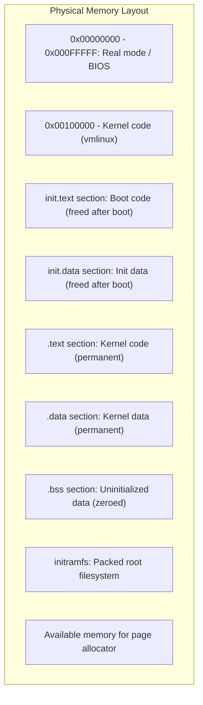
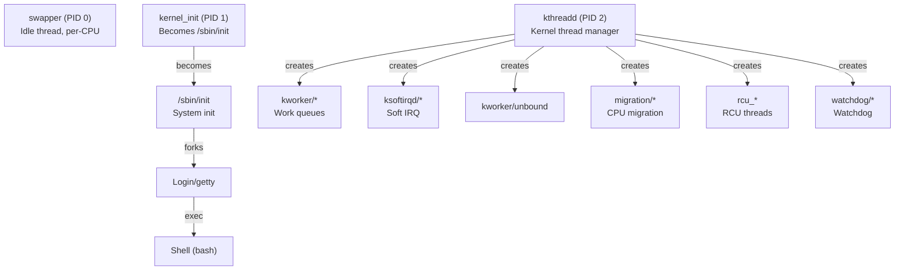

# Chapter 251: init/ — Kernel Initialization: main.c, do_basic_setup(), initcalls

## 1. Introduction and Intuition

The `init/` directory contains the kernel's initialization code — the code that runs after the architecture-specific boot code has set up the basic hardware environment and is ready to start the generic kernel. The centerpiece is `init/main.c`, which contains `start_kernel()`, the function that orchestrates the entire kernel initialization sequence.

### 1.1 The Boot Journey

The complete boot sequence is:

1. **BIOS/UEFI**: Hardware initialization, POST
2. **Bootloader** (GRUB/systemd-boot): Loads kernel image, passes parameters
3. **Architecture-specific assembly**: Sets up page tables, GDT, enables MMU
4. **`start_kernel()`** (init/main.c): The "real" kernel initialization
5. **`kernel_init()`**: The first kernel thread, which spawns the init process

Understanding `start_kernel()` is understanding how all the kernel's subsystems come to life, one by one, in a carefully orchestrated sequence.

### 1.2 Initialization Ordering

Some subsystems must be initialized before others. For example:
- Memory management must be up before anything that allocates memory
- The scheduler must be running before you can create threads
- Interrupts must be handled before device drivers run
- The VFS must exist before filesystems can mount

The initcall mechanism provides a way for subsystems to register their initialization functions, and the kernel calls them in the correct order.

---

## 2. Directory Layout

```
init/
├── main.c              # start_kernel() and early initialization
├── do_mounts.c         # Root filesystem mounting
├── do_mounts.h         # Mount helper declarations
├── do_mounts_initrd.c  # initrd/initramfs handling
├── do_mounts_md.c      # MD (RAID) device handling for root
├── do_mounts_rd.c      # RAM disk handling
├── initramfs.c         # initramfs unpacking
├── init_task.c         # init_task (PID 0) definition
├── calibrate.c         # BogoMIPS calibration
├── Kconfig             # Configuration options
└── Makefile            # Build rules
```

---

## 3. Key Files and Subsystems

### 3.1 main.c — The Heart of Initialization

`main.c` is the most important file in `init/`. It contains the `start_kernel()` function, which is called by the architecture-specific boot code after basic hardware setup is complete.

#### 3.1.1 start_kernel() — Complete Walkthrough

```c
asmlinkage __visible void __init __no_sanitize_address start_kernel(void)
{
    char *command_line;
    char *after_dashes;
    
    /* ---- Very early setup ---- */
    
    /* Set magic number on init task's stack for overflow detection */
    set_task_stack_end_magic(&init_task);
    
    /* Save the command line passed by bootloader */
    saved_command_line = boot_command_line;
    
    /* Set up the per-cpu areas (must be before anything per-cpu) */
    setup_per_cpu_areas();
    
    /* ---- Core subsystem initialization ---- */
    
    /* Process command-line parameters */
    setup_command_line(command_line);
    parse_early_param();
    parse_args("Booting kernel", static_command_line, __start___param,
               __stop___param - __start___param, -1, -1,
               NULL, &unknown_bootoption);
    
    /* Initialize sorting of exceptions */
    sort_main_extable();
    
    /* Initialize trap handling (architecture-specific) */
    trap_init();
    
    /* Initialize memory management */
    mm_init();
    
    /* Set up the scheduler */
    sched_init();
    
    /* Initialize IRQ subsystem */
    init_IRQ();
    
    /* Initialize timekeeping */
    time_init();
    
    /* Enable local interrupts */
    local_irq_enable();
    
    /* ---- Subsystem initialization ---- */
    
    /* Initialize console (early printk) */
    console_init();
    
    /* Calibrate BogoMIPS (busy-wait loop speed) */
    calibrate_delay();
    
    /* Initialize PID hash table */
    pid_idr_init();
    
    /* Initialize security framework */
    security_init();
    
    /* Initialize kernel caches (slab, etc.) */
    vfs_caches_init();
    
    /* Initialize signals */
    signals_init();
    
    /* Initialize /proc filesystem */
    proc_root_init();
    
    /* Initialize IRQ domains and softirqs */
    irq_init();
    
    /* Initialize timers */
    timers_init();
    
    /* ---- Initcalls ---- */
    
    /* Run all early initcalls */
    do_pre_smp_initcalls();
    
    /* SMP bring-up */
    smp_init();
    smp_prepare_cpus(setup_max_cpus);
    
    /* Run rest_init() in a new thread */
    arch_call_rest_init();
}
```

#### 3.1.2 Key Initialization Functions

**mm_init():**
```c
static void __init mm_init(void)
{
    /* Initialize page allocator */
    page_ext_init_flatmem();
    mem_init();
    
    /* Initialize slab allocator */
    kmem_cache_init();
    
    /* Initialize page table handling */
    pgtable_init();
    
    /* Initialize vmalloc */
    vmalloc_init();
    
    /* Initialize memory policy */
    mpol_init();
    
    /* Initialize swap */
    swap_init();
    
    /* Initialize page cache */
    page_writeback_init();
}
```

**sched_init():**
```c
void __init sched_init(void)
{
    int i;
    
    /* Initialize wait queues */
    wait_bit_init();
    
    /* Initialize root task group */
    init_rootdomain(&root_task_group.domain);
    
    /* Initialize per-CPU runqueues */
    for_each_possible_cpu(i) {
        struct rq *rq = cpu_rq(i);
        
        raw_spin_lock_init(&rq->lock);
        rq->nr_running = 0;
        rq->clock = 0;
        INIT_LIST_HEAD(&rq->cfs_tasks);
        INIT_LIST_HEAD(&rq->rt.pushable_tasks);
        /* ... */
    }
    
    /* Initialize CFS scheduler */
    init_cfs_rq(&rq->cfs);
    
    /* Initialize RT scheduler */
    init_rt_rq(&rq->rt);
    
    /* Initialize DL scheduler */
    init_dl_rq(&rq->dl);
    
    /* Set init_task's scheduling parameters */
    init_task.se.exec_start = sched_clock();
}
```

**vfs_caches_init():**
```c
void __init vfs_caches_init(void)
{
    /* Initialize names (paths) cache */
    names_cachep = kmem_cache_create("names_cache", PATH_MAX, 0,
                                     SLAB_HWCACHE_ALIGN|SLAB_PANIC, NULL);
    
    /* Initialize dcache */
    dcache_init();
    
    /* Initialize inode cache */
    inode_init();
    
    /* Initialize files cache */
    files_init();
    
    /* Initialize mount cache */
    mnt_init();
    
    /* Initialize bdev cache */
    bdev_cache_init();
    
    /* Initialize chrdev cache */
    chrdev_init();
    
    /* Initialize proc, sysfs, etc. */
    proc_init();
    sysfs_init();
    devtmpfs_init();
}
```

### 3.2 rest_init() — The Final Step

After `start_kernel()` completes, `rest_init()` creates the first real kernel threads:

```c
noinline void __ref rest_init(void)
{
    struct task_struct *tsk;
    int pid;
    
    /* Create the "init" thread (PID 1) */
    rcu_read_lock();
    tsk = find_task_by_pid_ns(pid, &init_pid_ns);
    rcu_read_unlock();
    
    /* Create kernel_init thread */
    pid = kernel_thread(kernel_init, NULL, CLONE_FS);
    
    /* Create kthreadd thread (PID 2) - manages all other kernel threads */
    pid = kernel_thread(kthreadd, NULL, CLONE_FS | CLONE_FILES);
    
    /* The current thread becomes the idle thread (PID 0) */
    cpu_idle();
}
```

### 3.3 kernel_init() — The Init Process

```c
static int __ref kernel_init(void *unused)
{
    /* Wait for kthreadd to start */
    wait_for_completion(&kthreadd_done);
    
    /* Run late initcalls */
    kernel_init_freeable();
    
    /* Free init memory */
    free_initmem();
    
    /* Mark itself as the init process */
    if (ramdisk_execute_command)
        run_init_process(ramdisk_execute_command);  /* Try initramfs init */
    
    if (execute_command)
        run_init_process(execute_command);  /* Try init= argument */
    
    /* Default: try common init paths */
    if (!run_init_process("/sbin/init") ||
        !run_init_process("/etc/init") ||
        !run_init_process("/bin/init") ||
        !run_init_process("/bin/sh"))
        return 0;
    
    panic("No working init found.");
}
```

### 3.4 init_task.c — The Initial Task

```c
/* PID 0 - the initial task (swapper/idle) */
struct task_struct init_task = {
    .thread_info    = INIT_THREAD_INFO(init_task),
    .stack          = init_stack,
    .usage          = REFCOUNT_INIT(2),
    .flags          = PF_KTHREAD,
    .prio           = MAX_PRIO - 20,
    .static_prio    = MAX_PRIO - 20,
    .normal_prio    = MAX_PRIO - 20,
    .policy         = SCHED_NORMAL,
    .cpus_ptr       = &init_task.cpus_mask,
    .max_allowed_capacity = SCHED_CAPACITY_SCALE,
    
    .comm           = INIT_TASK_COMM,
    .fs             = &init_fs,
    .files          = &init_files,
    .signal         = &init_signals,
    .sighand        = &init_sighand,
    .nsproxy        = &init_nsproxy,
    .active_mm      = &init_mm,
    
    .thread         = INIT_THREAD,
};
```

---

## 4. Initcall Mechanism

### 4.1 Initcall Levels

The kernel defines multiple initcall levels, executed in order:

```c
// include/linux/init.h
#define early_initcall(fn)      __define_initcall(fn, early)
#define pure_initcall(fn)       __define_initcall(fn, 0)
#define core_initcall(fn)       __define_initcall(fn, 1)
#define core_initcall_sync(fn)  __define_initcall(fn, 1s)
#define postcore_initcall(fn)   __define_initcall(fn, 2)
#define postcore_initcall_sync(fn) __define_initcall(fn, 2s)
#define arch_initcall(fn)       __define_initcall(fn, 3)
#define arch_initcall_sync(fn)  __define_initcall(fn, 3s)
#define subsys_initcall(fn)     __define_initcall(fn, 4)
#define subsys_initcall_sync(fn) __define_initcall(fn, 4s)
#define fs_initcall(fn)         __define_initcall(fn, 5)
#define fs_initcall_sync(fn)    __define_initcall(fn, 5s)
#define rootfs_initcall(fn)     __define_initcall(fn, rootfs)
#define device_initcall(fn)     __define_initcall(fn, 6)
#define device_initcall_sync(fn) __define_initcall(fn, 6s)
#define late_initcall(fn)       __define_initcall(fn, 7)
#define late_initcall_sync(fn)  __define_initcall(fn, 7s)
```

The execution order is:

```
early_initcall       → Very early hardware setup
pure_initcall        → Pure functions, no dependencies
core_initcall        → Core subsystems
postcore_initcall    → After core
arch_initcall        → Architecture-specific
subsys_initcall      → Subsystem initialization
fs_initcall          → Filesystem initialization
rootfs_initcall      → Root filesystem initramfs
device_initcall      → Device drivers (most common!)
late_initcall        → Final initialization
```

### 4.2 How Initcalls Work

```c
// include/linux/init.h
#define __define_initcall(fn, id) \
    static initcall_t __initcall_##fn##id __used \
    __attribute__((__section__(".initcall" #id ".init"))) = fn

// The linker script places all initcalls in order:
// .initcall1.init, .initcall2.init, ..., .initcall7.init
```

At boot time, the kernel iterates through all initcalls:

```c
// init/main.c
static void __init do_initcalls(void)
{
    int level;
    
    for (level = 0; level < ARRAY_SIZE(initcall_levels) - 1; level++) {
        do_initcall_level(level);
    }
}

static void __init do_initcall_level(int level)
{
    initcall_t *fn;
    
    for (fn = initcall_levels[level]; fn < initcall_levels[level+1]; fn++)
        do_one_initcall(*fn);
}

int __init do_one_initcall(initcall_t fn)
{
    int count = preempt_count();
    char msgbuf[64];
    int ret;
    
    ret = fn();  /* Call the init function */
    
    if (ret && ret != -ENODEV && initcall_debug) {
        sprintf(msgbuf, "error code %d", ret);
        printk("initcall %pS returned %s\n", fn, msgbuf);
    }
    
    return ret;
}
```

### 4.3 Module initcalls

Loadable modules use `module_init()` which expands to `device_initcall` by default:

```c
// include/linux/module.h
#define module_init(x)  __initcall(x);
#define module_exit(x)  __exitcall(x);

// include/linux/init.h
#define __initcall(fn) device_initcall(fn)
```

This is why most driver initialization runs at the `device_initcall` level (level 6).

### 4.4 Initcall Debugging

To see all initcalls and their timing, add `initcall_debug` to the kernel command line:

```
[    0.123456] initcall net_ns_init+0x0/0x150 returned 0 after 12345 usecs
[    0.123789] initcall pci_driver_init+0x0/0x30 returned 0 after 5678 usecs
```

---

## 5. Root Filesystem Mounting

### 5.1 do_mounts.c

After initcalls complete, the kernel must mount the root filesystem:

```c
// init/do_mounts.c
void __init prepare_namespace(void)
{
    /* Wait for root device to appear */
    wait_for_device_probe();
    
    /* If we have an initrd, use it */
    if (initrd_load())
        goto out;
    
    /* Mount root filesystem */
    mount_root();
    
    /* Change to root */
    sys_mount(".", "/", NULL, MS_MOVE, NULL);
    sys_chroot(".");
    
out:
    devtmpfs_mount();
    init_mount(".", "/", NULL, MS_MOVE, NULL);
    init_chdir("/root");
}
```

### 5.2 initramfs (initramfs.c)

The initramfs is a compressed cpio archive that's unpacked into a tmpfs:

```c
// init/initramfs.c
static int __init populate_rootfs(void)
{
    /* Unpack initramfs if present */
    if (initrd_start) {
        /* It's an initramfs (cpio archive) */
        err = unpack_to_rootfs((char *)initrd_start,
                               initrd_end - initrd_start);
        if (err)
            printk(KERN_ERR "Initramfs unpacking failed: %s\n", err);
    }
    
    /* If no initramfs, create default /dev, /root, etc. */
    return 0;
}
rootfs_initcall(populate_rootfs);
```

---

## 6. Code Walkthrough: Complete Boot Sequence

```mermaid
sequenceDiagram
    BOOT as Bootloader
    ASM as arch/x86/kernel/head_64.S
    SK as start_kernel()
    INIT as kernel_init()
    USER as /sbin/init (PID 1)
    
    BOOT->>ASM: Load kernel, pass command line
    ASM->>ASM: Setup page tables, GDT, IDT
    ASM->>ASM: Enable MMU, set up per-CPU
    ASM->>SK: Call start_kernel()
    
    SK->>SK: trap_init()
    SK->>SK: mm_init()
    SK->>SK: sched_init()
    SK->>SK: init_IRQ()
    SK->>SK: time_init()
    SK->>SK: console_init()
    SK->>SK: calibrate_delay()
    SK->>SK: do_initcalls()
    Note over SK: All initcalls run (early→late)
    SK->>SK: rest_init()
    
    SK->>INIT: kernel_thread(kernel_init)
    SK->>SK: cpu_idle() → becomes idle thread (PID 0)
    
    INIT->>INIT: Run late initcalls
    INIT->>INIT: prepare_namespace()
    INIT->>INIT: Mount root filesystem
    INIT->>INIT: Free init memory
    INIT->>USER: exec("/sbin/init")
    
    USER->>USER: System is alive!
```

### 6.1 Early printk and Console

```c
// init/main.c
static void __init console_init(void)
{
    /* Initialize tty driver */
    tty_ldisc_begin();
    
    /* Call all console initcalls */
    /* This is where early_printk transitions to real console */
}
```

### 6.2 BogoMIPS Calibration

```c
// init/calibrate.c
void __init calibrate_delay(void)
{
    unsigned long ticks, loopbit;
    int lps_precision = LPS_PREC;
    
    /* Binary search for loops_per_jiffy */
    loops_per_jiffy = (1 << 12);
    
    while ((loops_per_jiffy <<= 1) != 0) {
        /* Wait for one jiffy tick */
        ticks = jiffies;
        while (ticks == jiffies)
            /* nothing */;
        ticks = jiffies;
        while (ticks == jiffies)
            loops_per_jiffy++;
        /* ... */
    }
    
    printk(KERN_INFO "Calibrating delay loop... %lu.%02lu BogoMIPS\n",
           loops_per_jiffy / (500000 / HZ),
           loops_per_jiffy / (5000 / HZ) % 100);
}
```

---

## 7. Diagrams

### 7.1 Initcall Order Diagram

```mermaid
graph TD
    subgraph "Initcall Levels (Execution Order)"
        L0[early_initcall] --> L1[pure_initcall]
        L1 --> L2[core_initcall]
        L2 --> L2S[core_initcall_sync]
        L2S --> L3[postcore_initcall]
        L3 --> L3S[postcore_initcall_sync]
        L3S --> L4[arch_initcall]
        L4 --> L4S[arch_initcall_sync]
        L4S --> L5[subsys_initcall]
        L5 --> L5S[subsys_initcall_sync]
        L5S --> L6[fs_initcall]
        L6 --> L6S[fs_initcall_sync]
        L6S --> LR[rootfs_initcall]
        LR --> L7[device_initcall]
        L7 --> L7S[device_initcall_sync]
        L7S --> L8[late_initcall]
        L8 --> L8S[late_initcall_sync]
    end
```



### 7.2 Memory Layout During Boot



### 7.3 Kernel Thread Hierarchy



---

## 8. Relationships with Other Subsystems

### 8.1 init/ ↔ kernel/

- `init/main.c` calls functions from `kernel/` (scheduler init, signals init)
- `kernel/kthread.c` provides `kthreadd` (the kernel thread manager)
- `kernel/params.c` handles boot parameter parsing

### 8.2 init/ ↔ mm/

- `mm_init()` is called early in `start_kernel()`
- `free_initmem()` frees `__init` code/data after boot
- `init/initramfs.c` unpacks the initramfs into memory

### 8.3 init/ ↔ arch/

- Architecture-specific boot code calls `start_kernel()`
- `trap_init()`, `init_IRQ()`, `time_init()` are architecture-specific
- `smp_init()` brings up secondary CPUs

### 8.4 init/ ↔ fs/

- `vfs_caches_init()` initializes the VFS caches
- `prepare_namespace()` mounts the root filesystem
- `initramfs.c` unpacks the initramfs

---

## 9. Advanced Topics

### 9.1 __init and __initdata Sections

Functions and data marked with `__init` and `__initdata` are placed in special sections that are freed after boot:

```c
static int __init my_init_function(void)
{
    /* This code is freed after boot */
    return 0;
}
device_initcall(my_init_function);

static int __initdata my_init_variable = 42;
```

The linker places these in `.init.text` and `.init.data` sections. After boot, `free_initmem()` reclaims this memory:

```c
void free_initmem(void)
{
    free_initmem_default(0);
}

// arch/x86/mm/init.c
void free_initmem_default(int poison)
{
    free_reserved_area(init_begin, init_end, poison, "unused kernel");
}
```

This can save hundreds of kilobytes of memory.

### 9.2 Early Parameter Parsing

Some parameters must be parsed before the full parameter infrastructure is ready:

```c
// include/linux/init.h
#define early_param(str, fn) \
    __setup_param(str, fn, fn, 1)

// Usage:
static int __init early_console_setup(char *arg)
{
    /* Set up early console for printk */
    return 0;
}
early_param("earlycon", early_console_setup);
```

### 9.3 SMP Initialization

```c
// init/main.c
static void __init smp_init(void)
{
    /* Bring up all online CPUs */
    for_each_present_cpu(cpu) {
        if (num_online_cpus() >= setup_max_cpus)
            break;
        cpu_up(cpu);
    }
    
    /* Wait for all CPUs to be ready */
    smp_threads_initialized = true;
}
```

### 9.4 Kernel Command Line Processing

```c
// init/main.c
static int __init parse_early_param(void)
{
    /* Parse early parameters (e.g., earlycon, debug) */
    parse_early_options(tmp_cmdline);
    return 0;
}

static void __init setup_command_line(char *command_line)
{
    saved_command_line = kmalloc(strlen(boot_command_line) + 1, GFP_KERNEL);
    strcpy(saved_command_line, boot_command_line);
    static_command_line = kmalloc(strlen(command_line) + 1, GFP_KERNEL);
    strcpy(static_command_line, command_line);
}
```

---

## 10. References

1. **Linux Kernel Source**: `init/main.c`, `init/do_mounts.c`, `init/initramfs.c`
2. **Documentation**: `Documentation/admin-guide/kernel-parameters.rst`
3. **"Understanding the Linux Kernel, 3rd Edition"** — Bovet & Cesati (Chapter 5: Kernel Initialization)
4. **"Linux Kernel Development, 3rd Edition"** — Robert Love (Chapter 2: Getting Started with the Kernel)
5. **kernel.org boot flow**: `Documentation/process/adding-syscalls.rst`
6. **LWN.net**: "A new initcall mechanism" and boot process articles
7. **x86 boot protocol**: `Documentation/arch/x86/boot.rst`
8. **initramfs documentation**: `Documentation/filesystems/ramfs-rootfs-initramfs.rst`
