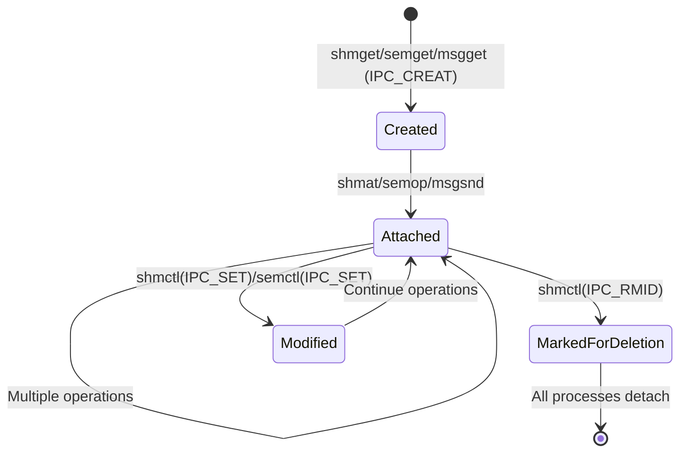

# Chapter 252: ipc/ — Inter-Process Communication: Shared Memory, Semaphores, Message Queues

## 1. Introduction and Intuition

The `ipc/` directory implements the classic System V inter-process communication (IPC) mechanisms: shared memory, semaphores, and message queues. These are among the oldest IPC mechanisms in Unix, dating back to System V in the 1980s. While modern Linux also offers POSIX IPC, pipes, Unix sockets, and other mechanisms, System V IPC remains widely used in legacy applications and databases.

### 1.1 Why IPC Matters

Processes on the same machine need to communicate. They might need to:
- **Share data**: Multiple processes accessing the same memory region
- **Synchronize**: Ensure only one process accesses a resource at a time
- **Exchange messages**: Send structured data between processes

System V IPC provides three mechanisms for this:

| Mechanism | Purpose | Kernel Object |
|-----------|---------|---------------|
| **Shared Memory** | Fastest: processes share memory pages | `struct shmid_kernel` |
| **Semaphores** | Synchronization: counting or binary locks | `struct sem_array` |
| **Message Queues** | Structured message passing | `struct msg_queue` |

### 1.2 IPC Identifiers and Keys

Each IPC object is identified by:
- **Key**: A user-chosen value (like a filename) that identifies the object
- **ID**: A kernel-assigned integer handle (like a file descriptor)

```c
/* Create or get an IPC object */
int shmget(key_t key, size_t size, int shmflg);  /* Shared memory */
int semget(key_t key, int nsems, int semflg);     /* Semaphore */
int msgget(key_t key, int msgflg);                /* Message queue */

/* Special key values */
#define IPC_PRIVATE  ((key_t)0)  /* Create new, private object */
```

### 1.3 IPC Namespaces

Modern Linux supports IPC namespaces, allowing containers to have isolated IPC objects. Each namespace has its own ID space.

---

## 2. Directory Layout

```
ipc/
├── Makefile
├── Kconfig
├── syscall.c               # Syscall implementations (shmget, semget, msgget, etc.)
├── ipc_sysctl.c            # Sysctl parameters for IPC
├── namespace.c             # IPC namespace support
│
├── util.c                  # Common utilities (ID management, locking)
├── ipc_namespace.c         # IPC namespace creation/destruction
│
├── shm.c                   # Shared memory implementation
├── shmem.c                 # (Moved to mm/shmem.c - tmpfs backing)
│
├── sem.c                   # System V semaphore implementation
│
├── msg.c                   # Message queue implementation
├── msgutil.c               # Message queue utilities
│
├── compat.c                # 32-bit compatibility wrappers
└── mqueue.c                # POSIX message queues (mqueue)
```

---

## 3. Shared Memory (shm.c)

### 3.1 Core Data Structure

```c
struct shmid_kernel /* private to the kernel */
{
    struct kern_ipc_perm    shm_perm;      /* IPC permission structure */
    struct file             *shm_file;     /* Backing file (tmpfs) */
    unsigned long           shm_nattch;    /* Number of current attaches */
    unsigned long           shm_segsz;     /* Segment size in bytes */
    time64_t                shm_atim;      /* Last attach time */
    time64_t                shm_dtim;      /* Last detach time */
    time64_t                shm_ctim;      /* Last change time */
    struct pid              *shm_cprid;    /* Creator PID */
    struct pid              *shm_lprid;    /* Last operation PID */
    struct user_struct      *mlock_user;   /* User who mlocked */
    
    /* ... */
};

struct kern_ipc_perm {
    spinlock_t      lock;
    bool            deleted;
    int             id;             /* IPC ID */
    key_t           key;            /* IPC key */
    kuid_t          uid;            /* Creator UID */
    kgid_t          gid;            /* Creator GID */
    kuid_t          cuid;           /* Creator UID */
    kgid_t          cgid;           /* Creator GID */
    umode_t         mode;           /* Access permissions */
    unsigned long   seq;            /* Sequence number */
    void            *security;      /* LSM security context */
    struct rhash_head khtnode;
    struct callback_head rcu;
    refcount_t      refcount;
};
```

### 3.2 shmget() — Create/Get Shared Memory

```c
// ipc/shm.c
SYSCALL_DEFINE3(shmget, key_t, key, size_t, size, int, shmflg)
{
    struct ipc_namespace *ns = current->nsproxy->ipc_ns;
    struct ipc_params shm_params;
    
    shm_params.key = key;
    shm_params.flg = shmflg;
    shm_params.u.size = size;
    
    return ipcget(ns, &shm_ids(ns), &shm_ops, &shm_params);
}
```

The `ipcget()` function handles both creation and lookup:

```c
// ipc/util.c
int ipcget(struct ipc_namespace *ns, struct ipc_ids *ids,
           const struct ipc_ops *ops, struct ipc_params *params)
{
    if (params->key == IPC_PRIVATE)
        return ops->newget(ns, params);  /* Create new */
    
    /* Look up existing by key */
    ipcp = ipc_findkey(ids, params->key);
    if (ipcp == NULL) {
        if (!(params->flg & IPC_CREAT))
            return -ENOENT;  /* Not found and no CREATE flag */
        return ops->newget(ns, params);  /* Create new */
    }
    
    /* Found existing */
    if (params->flg & IPC_CREAT && params->flg & IPC_EXCL)
        return -EEXIST;  /* Exclusive create but already exists */
    
    return ops->getnew(ns, params);  /* Return existing ID */
}
```

### 3.3 shmat() — Attach Shared Memory

```c
SYSCALL_DEFINE3(shmat, int, shmid, char __user *, shmaddr, int, shmflg)
{
    return do_shmat(shmid, shmaddr, shmflg, NULL, 0);
}

long do_shmat(int shmid, char __user *shmaddr, int shmflg,
              struct shmid_kernel **shp, unsigned long shm_size)
{
    struct shmid_kernel *shp;
    unsigned long addr;
    struct file *file;
    
    /* Find shared memory segment */
    shp = shm_obtain_object(ns, shmid);
    
    /* Get the backing file */
    file = shp->shm_file;
    
    /* Calculate attach address */
    addr = get_addr(shp, shmaddr, shmflg);
    
    /* Map the shared memory into the process's address space */
    ret = do_mmap(file, addr, shp->shm_segsz, prot, flags, 0, &populate, NULL);
    
    /* Update attach time and PID */
    shp->shm_atim = ktime_get_real_seconds();
    shp->shm_lprid = task_tgid_vnr(current);
    shp->shm_nattch++;
    
    return addr;
}
```

### 3.4 Shared Memory Backing

Shared memory segments are backed by tmpfs files. When `shmget()` creates a segment, the kernel creates an anonymous file in a hidden tmpfs mount:

```mermaid
sequenceDiagram
    PROC1 as Process 1 (Creator)
    KERN as Kernel (shm.c)
    TMPFS as tmpfs (hidden)
    PROC2 as Process 2 (Attacher)
    
    PROC1->>KERN: shmget(key, size, IPC_CREAT)
    KERN->>TMPFS: Create anonymous file
    TMPFS-->>KERN: struct file
    KERN->>KERN: Create shmid_kernel
    KERN-->>PROC1: Return shmid
    
    PROC1->>KERN: shmat(shmid, NULL, 0)
    KERN->>KERN: do_mmap() the tmpfs file
    KERN-->>PROC1: Return virtual address (0x7f...)
    
    PROC2->>KERN: shmget(key, 0, 0)
    KERN-->>PROC2: Return same shmid
    
    PROC2->>KERN: shmat(shmid, NULL, 0)
    KERN->>KERN: do_mmap() same tmpfs file
    KERN-->>PROC2: Return virtual address (0x7f...)
    
    Note over PROC1,PROC2: Both processes now share the same physical pages
```

### 3.5 The shm_ids Structure

```c
struct ipc_ids {
    rw_semaphore_t  rwsem;
    struct idr      ipcs_idr;       /* ID to object mapping */
    int             max_idx;        /* Maximum index in use */
    unsigned int    in_use;         /* Number of objects */
    unsigned short  seq;            /* Sequence counter */
    unsigned short  next_id;        /* Next ID to allocate */
    struct rhashtable key_ht;       /* Key to object hash table */
};
```

---

## 4. Semaphores (sem.c)

### 4.1 Core Data Structure

```c
struct sem_array {
    struct kern_ipc_perm    sem_perm;       /* IPC permissions */
    time64_t                sem_ctime;      /* Last operation time */
    struct list_head        pending_alter;  /* Pending alteration operations */
    struct list_head        pending_const;  /* Pending constant operations */
    struct list_head        list_id;        /* List of sem arrays */
    
    int                     sem_nsems;      /* Number of semaphores */
    int                     complex_count;  /* Complex operations pending */
    
    struct sem              sems[];         /* Array of semaphores */
};

struct sem {
    int                     semval;         /* Current value */
    int                     sempid;         /* PID of last operation */
    spinlock_t              lock;           /* Per-semaphore lock */
    struct list_head        pending_alter;  /* Pending alter operations */
    struct list_head        pending_const;  /* Pending const operations */
};

struct sem_queue {
    struct list_head        list;           /* List node */
    struct task_struct      *sleeper;       /* Sleeping task */
    struct sem_undo         *undo;          /* Undo structure */
    struct pid              *pid;           /* Process ID */
    int                     status;         /* Completion status */
    struct sembuf           *sops;          /* Array of operations */
    struct sembuf           *blocking;      /* Blocking operation */
    int                     nsops;          /* Number of operations */
    bool                    alter;          /* Does this alter semaphores? */
    bool                    dupsop;         /* Duplicate operations? */
};
```

### 4.2 semget() — Create/Get Semaphore Set

```c
SYSCALL_DEFINE3(semget, key_t, key, int, nsems, int, semflg)
{
    struct ipc_namespace *ns = current->nsproxy->ipc_ns;
    struct ipc_params sem_params;
    
    sem_params.key = key;
    sem_params.flg = semflg;
    sem_params.u.nsems = nsems;
    
    return ipcget(ns, &sem_ids(ns), &sem_ops, &sem_params);
}
```

### 4.3 semop() — Semaphore Operations

```c
SYSCALL_DEFINE4(semtimedop, int, semid, struct sembuf __user *, tsops,
                unsigned, nsops, const struct timespec64 __user *, timeout)
{
    return ksys_semtimedop(semid, tsops, nsops, timeout);
}

static long ksys_semtimedop(int semid, struct sembuf __user *tsops,
                            unsigned nsops, const struct timespec64 *timeout)
{
    struct sem_array *sma;
    struct sembuf *sops;
    
    /* Copy operations from user space */
    sops = copy_semarray_from_user(tsops, nsops);
    
    /* Get semaphore array */
    sma = sem_obtain_check(ns, semid);
    
    /* Try the operation (non-blocking) */
    error = perform_atomic_semop(sma, sops, nsops, &undos, &dupsop);
    
    if (error == 0) {
        /* Success: update semaphores */
        /* ... */
        goto out_free;
    }
    
    if (error < 0 || (error > 0 && timeout && timespec64_compare(timeout, &now) <= 0)) {
        error = -EAGAIN;
        goto out_free;
    }
    
    /* Block until semaphore becomes available */
    queue.task = current;
    queue.sops = sops;
    queue.nsops = nsops;
    queue.alter = true;
    
    /* Add to wait queue and sleep */
    list_add_tail(&queue.list, &sma->pending_alter);
    error = sleep_on(sma, timeout);
    
    /* ... cleanup ... */
    return error;
}
```

### 4.4 Semaphore Operation Types

```c
// include/uapi/linux/sem.h
struct sembuf {
    unsigned short sem_num;  /* Semaphore index */
    short sem_op;           /* Operation */
    short sem_flg;          /* Flags */
};

/* sem_op values:
 *   positive: Add to semaphore value (release)
 *   negative: Subtract from semaphore value (acquire)
 *   zero:     Wait for semaphore to reach zero
 */
```

---

## 5. Message Queues (msg.c)

### 5.1 Core Data Structures

```c
struct msg_queue {
    struct kern_ipc_perm    q_perm;
    time64_t                q_stime;        /* Last msgsnd time */
    time64_t                q_rtime;        /* Last msgrcv time */
    time64_t                q_ctime;        /* Last change time */
    unsigned long           q_cbytes;       /* Current bytes in queue */
    unsigned long           q_qnum;         /* Number of messages */
    unsigned long           q_qbytes;       /* Max bytes in queue */
    struct pid              *q_lspid;       /* PID of last msgsnd */
    struct pid              *q_lrpid;       /* PID of last msgrcv */
    struct list_head        q_messages;     /* List of messages */
    struct list_head        q_receivers;    /* Waiting receivers */
    struct list_head        q_senders;      /* Waiting senders */
};

struct msg_msg {
    struct list_head        m_list;         /* Message list node */
    long                    m_type;         /* Message type */
    size_t                  m_ts;           /* Message text size */
    struct msg_msgseg      *next;           /* Next segment */
    void                    *security;      /* LSM security */
    /* The actual message data follows */
};

struct msg_msgseg {
    struct msg_msgseg      *next;
    /* Data follows */
};
```

### 5.2 msgsnd() — Send Message

```c
SYSCALL_DEFINE4(msgsnd, int, msqid, struct msgbuf __user *, msgp,
                size_t, msgsz, int, msgflg)
{
    return ksys_msgsnd(msqid, msgp, msgsz, msgflg);
}

static long ksys_msgsnd(int msqid, struct msgbuf __user *msgp,
                        size_t msgsz, int msgflg)
{
    struct msg_queue *msq;
    struct msg_msg *msg;
    long mtype;
    
    /* Get message type from user */
    if (get_user(mtype, &msgp->mtype))
        return -EFAULT;
    
    /* Allocate and copy message */
    msg = load_msg(msgp->mtext, msgsz);
    msg->m_type = mtype;
    msg->m_ts = msgsz;
    
    /* Get message queue */
    msq = msq_obtain_object_check(ns, msqid);
    
    /* Check queue limits */
    if (msq->q_qbytes + msgsz > msq->q_qbytes ||
        msq->q_qnum + 1 > msq->q_qbytes) {
        if (msgflg & IPC_NOWAIT) {
            err = -EAGAIN;
            goto out_free;
        }
        /* Block until space available */
        ss.type = Q_SENDERS;
        ss.msgsz = msgsz;
        list_add_tail(&ss.list, &msq->q_senders);
        schedule();
    }
    
    /* Add message to queue */
    list_add_tail(&msg->m_list, &msq->q_messages);
    msq->q_qnum++;
    msq->q_cbytes += msgsz;
    
    /* Wake up waiting receivers */
    walk = list_first_entry(&msq->q_receivers, struct msg_receiver, r_list);
    if (walk)
        wake_up_process(walk->r_tsk);
    
    return 0;
}
```

### 5.3 msgrcv() — Receive Message

```c
SYSCALL_DEFINE5(msgrcv, int, msqid, struct msgbuf __user *, msgp,
                size_t, msgsz, long, msgtyp, int, msgflg)
{
    struct msg_queue *msq;
    struct msg_msg *msg;
    
    msq = msq_obtain_object_check(ns, msqid);
    
    /* Find matching message */
    msg = find_msg(msq, &msgtyp, msgflg);
    
    if (!msg) {
        if (msgflg & IPC_NOWAIT)
            return -ENOMSG;
        
        /* Block until matching message arrives */
        msr.r_tsk = current;
        msr.r_msgtype = msgtyp;
        msr.r_msgsz = msgsz;
        msr.r_maxsize = msgsz;
        msr.r_msg = NULL;
        
        list_add_tail(&msr.r_list, &msq->q_receivers);
        schedule();
        
        msg = msr.r_msg;
    }
    
    /* Copy message to user space */
    store_msg(msgp->mtext, msg, msgsz);
    put_user(msg->m_type, &msgp->mtype);
    
    /* Free message */
    free_msg(msg);
    
    return msgsz;
}
```

### 5.4 Message Queue Flow

```mermaid
sequenceDiagram
    SENDER as Sender Process
    KERN as Kernel (msg.c)
    QUEUE as Message Queue
    RECEIVER as Receiver Process
    
    SENDER->>KERN: msgsnd(msqid, msg, len, 0)
    KERN->>KERN: Allocate msg_msg, copy data
    KERN->>QUEUE: Add to q_messages list
    KERN->>RECEIVER: Wake up waiting receiver
    KERN-->>SENDER: Return success
    
    RECEIVER->>KERN: msgrcv(msqid, buf, len, type, 0)
    KERN->>QUEUE: Find matching message
    KERN->>KERN: Copy message to user buffer
    KERN->>KERN: Free msg_msg
    KERN-->>RECEIVER: Return message length
    
    Note over SENDER,RECEIVER: If no message available, receiver blocks
    Note over SENDER,RECEIVER: If queue full, sender blocks
```

---

## 6. IPC Utilities (util.c)

### 6.1 IPC ID Management

```c
// ipc/util.c
struct ipc_id {
    struct rw_semaphore rwsem;
    struct idr ipcs_idr;         /* ID → object mapping */
    int max_idx;
    unsigned int in_use;
    unsigned short seq;
    unsigned short next_id;
    struct rhashtable key_ht;    /* key → object hash table */
};

/* Allocate a new IPC ID */
int ipc_addid(struct ipc_ids *ids, struct kern_ipc_perm *new, int limit)
{
    /* Allocate IDR */
    id = idr_alloc(&ids->ipcs_idr, new, 0, limit, GFP_NOWAIT);
    
    /* Set ID and sequence number */
    new->id = ipc_buildid(id, new->seq);
    
    /* Add to key hash table */
    if (new->key != IPC_PRIVATE)
        rhashtable_insert_fast(&ids->key_ht, &new->khtnode, ...);
    
    return id;
}
```

### 6.2 Permission Checking

```c
// ipc/util.c
static int ipcperms(struct ipc_namespace *ns, struct kern_ipc_perm *ipcp, short flag)
{
    kuid_t euid = current_euid();
    int requested_mode = flag;
    int granted_mode;
    
    if (uid_eq(euid, ipcp->cuid) || uid_eq(euid, ipcp->uid))
        granted_mode = ipcp->mode >> 6;
    else if (in_group_p(ipcp->cgid) || in_group_p(ipcp->gid))
        granted_mode = ipcp->mode >> 3;
    else
        granted_mode = ipcp->mode;
    
    requested_mode &= 0007;
    if (!requested_mode)
        return 0;
    
    granted_mode &= requested_mode;
    if (granted_mode == requested_mode)
        return 0;
    
    /* LSM check */
    return security_ipc_permission(ipcp, flag);
}
```

---

## 7. IPC Namespaces

### 7.1 Namespace Structure

```c
struct ipc_namespace {
    refcount_t      count;
    struct ipc_ids  ids[3];         /* [0]=shm, [1]=sem, [2]=msg */
    
    int             shm_ctlmax;     /* Max shared memory segment size */
    int             shm_ctlall;     /* Max total shared memory */
    int             shm_ctlmni;     /* Max number of shared memory IDs */
    
    int             sem_ctls[4];    /* Semaphore limits */
    int             msg_ctlmax;     /* Max message size */
    int             msg_ctlmni;     /* Max number of message queue IDs */
    int             msg_ctlmnb;     /* Max bytes in message queue */
    
    unsigned int    shm_tot;        /* Total shared memory in pages */
    struct user_namespace *user_ns;
    struct ucounts *ucounts;
    
    struct llist_node mnt_llist;
    struct ns_common ns;
};
```

### 7.2 Namespace Isolation

```mermaid
graph TB
    subgraph "Host IPC Namespace"
        HS[Shared Memory: key=0x1234]
        HM[Message Queue: key=0x5678]
        HSEM[Semaphore: key=0x9ABC]
    end
    
    subgraph "Container 1 IPC Namespace"
        CS1[Shared Memory: key=0x1234]
        CM1[Message Queue: key=0x5678]
    end
    
    subgraph "Container 2 IPC Namespace"
        CS2[Shared Memory: key=0x1234]
        CM2[Message Queue: key=0x5678]
    end
    
    Note over CS1,CM1: Same keys, different objects!
    Note over CS2,CM2: Same keys, different objects!
```

---

## 8. sysctl Parameters

```c
// ipc/ipc_sysctl.c
static struct ctl_table ipc_kern_table[] = {
    {
        .procname = "shmmax",
        .data = &init_ipc_ns.shm_ctlmax,
        .maxlen = sizeof(init_ipc_ns.shm_ctlmax),
        .mode = 0644,
        .proc_handler = proc_ipc_doulongvec_minmax,
    },
    {
        .procname = "shmall",
        .data = &init_ipc_ns.shm_ctlall,
        .maxlen = sizeof(init_ipc_ns.shm_ctlall),
        .mode = 0644,
        .proc_handler = proc_ipc_doulongvec_minmax,
    },
    {
        .procname = "shmmni",
        .data = &init_ipc_ns.shm_ctlmni,
        .maxlen = sizeof(init_ipc_ns.shm_ctlmni),
        .mode = 0644,
        .proc_handler = proc_ipc_dointvec_minmax,
    },
    {
        .procname = "msgmni",
        .data = &init_ipc_ns.msg_ctlmni,
        .maxlen = sizeof(init_ipc_ns.msg_ctlmni),
        .mode = 0644,
        .proc_handler = proc_ipc_dointvec_minmax,
    },
    {
        .procname = "msgmnb",
        .data = &init_ipc_ns.msg_ctlmnb,
        .maxlen = sizeof(init_ipc_ns.msg_ctlmnb),
        .mode = 0644,
        .proc_handler = proc_ipc_dointvec_minmax,
    },
    {
        .procname = "msgmax",
        .data = &init_ipc_ns.msg_ctlmax,
        .maxlen = sizeof(init_ipc_ns.msg_ctlmax),
        .mode = 0644,
        .proc_handler = proc_ipc_dointvec_minmax,
    },
    /* ... */
};
```

---

## 9. Diagrams

### 9.1 System V IPC Architecture

```mermaid
graph TB
    subgraph "User Space"
        P1[Process 1]
        P2[Process 2]
        P3[Process 3]
    end
    
    subgraph "Kernel Space"
        subgraph "IPC Subsystem"
            IDS_SHM[shm_ids: ID→shmid_kernel]
            IDS_SEM[sem_ids: ID→sem_array]
            IDS_MSG[msg_ids: ID→msg_queue]
        end
        
        SHM[Shared Memory Segment]
        SEM[Semaphore Array]
        MSG[Message Queue]
    end
    
    subgraph "Memory"
        PAGES[Physical Pages (via tmpfs)]
    end
    
    P1 -->|"shmget/shmat"| IDS_SHM
    P2 -->|"shmget/shmat"| IDS_SHM
    P1 -->|"semget/semop"| IDS_SEM
    P3 -->|"semget/semop"| IDS_SEM
    P1 -->|"msgget/msgsnd"| IDS_MSG
    P3 -->|"msgget/msgrcv"| IDS_MSG
    
    IDS_SHM --> SHM
    SHM --> PAGES
    IDS_SEM --> SEM
    IDS_MSG --> MSG
```

### 9.2 IPC Object Lifecycle



---

## 10. Relationships with Other Subsystems

### 10.1 ipc/ ↔ mm/

- Shared memory segments are backed by tmpfs files in memory
- `do_mmap()` maps the shared memory file into process address spaces
- Page faults on shared memory allocate physical pages

### 10.2 ipc/ ↔ fs/

- POSIX message queues (`ipc/mqueue.c`) use the VFS
- `/proc/sysvipc/` provides information about IPC objects
- `ipcs` and `ipcrm` commands use these interfaces

### 10.3 ipc/ ↔ security/

- LSM hooks check permissions for every IPC operation
- SELinux labels IPC objects for mandatory access control
- `security_ipc_permission()` is called by `ipcperms()`

### 10.4 ipc/ ↔ kernel/

- IPC operations can sleep, so they interact with the scheduler
- Signal delivery can interrupt blocked IPC operations
- PID tracking uses the kernel's PID infrastructure

---

## 11. POSIX Message Queues (mqueue.c)

POSIX message queues provide a more modern alternative:

```c
// ipc/mqueue.c
struct mqueue_inode_info {
    spinlock_t lock;
    struct inode vfs_inode;
    wait_queue_head_t wait_q;       /* Waiting senders/receivers */
    struct rb_root msg_tree;        /* Messages sorted by priority */
    struct posix_msg_tree_node *node_cache;
    struct mq_attr attr;            /* Queue attributes */
    struct sigevent notify;         /* Notification on message arrival */
    struct pid *notify_owner;
    struct user_namespace *notify_user_ns;
    struct ucounts *ucounts;
    struct sock *notify_sock;
    struct sk_buff *notify_cookie;
    struct ext_wait_queue e_wait_q[];
};
```

---

## 12. References

1. **Linux Kernel Source**: `ipc/` directory
2. **Documentation**: `Documentation/sysctl/ipc.rst`
3. **"Understanding the Linux Kernel, 3rd Edition"** — Bovet & Cesati (Chapter 19: Process Communication)
4. **"Advanced Programming in the UNIX Environment, 3rd Edition"** — Stevens & Rago (Chapters 14-15)
5. **POSIX.1-2017**: IPC specification
6. **System V Interface Definition**: Original IPC specification
7. **LWN.net**: "IPC in the Linux kernel" articles
8. **man pages**: `shmget(2)`, `semget(2)`, `msgget(2)`, `mq_overview(7)`
