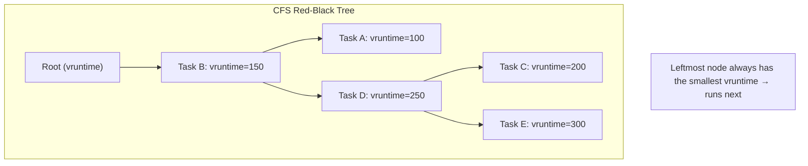
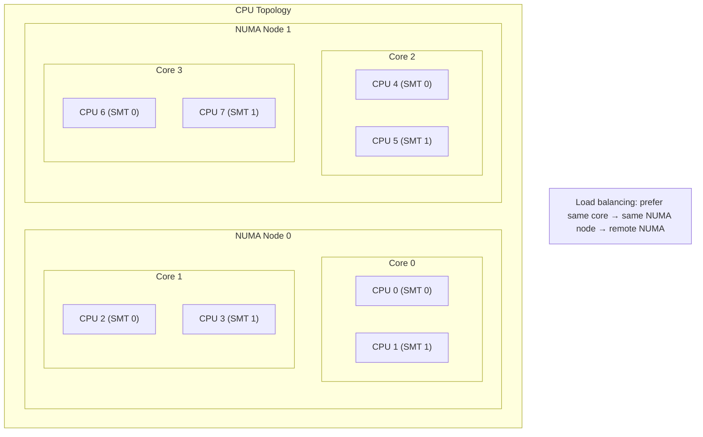
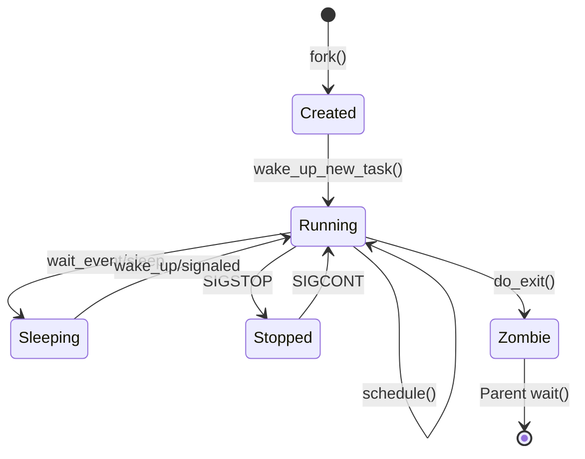
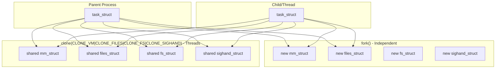

# Chapter 253: kernel/ — Core Kernel: sched/, fork.c, signal.c, exit.c, sys.c, printk

## 1. Introduction and Intuition

The `kernel/` directory is the beating heart of the Linux kernel. It contains the most fundamental subsystems: the scheduler (which decides which process runs when), process creation and destruction (fork/exit), signal delivery, system call infrastructure, and the kernel's logging system (printk). These are the mechanisms that make a kernel a kernel — without them, you'd just have a collection of hardware drivers and library functions.

### 1.1 What Makes the Core Kernel

The core kernel answers fundamental questions:
- **Who runs?** → The scheduler
- **How are processes created?** → fork.c
- **How do processes communicate?** → signal.c
- **How do processes die?** → exit.c
- **How does the kernel communicate with the outside world?** → printk, sysctl

---

## 2. Directory Layout

```
kernel/
├── Makefile
├── Kconfig
│
├── sched/                      # *** Scheduler subsystem ***
│   ├── core.c                  # Core scheduler: schedule(), wakeup, load balancing
│   ├── fair.c                  # CFS (Completely Fair Scheduler)
│   ├── rt.c                    # Real-time scheduler
│   ├── deadline.c              # Deadline scheduler (SCHED_DEADLINE)
│   ├── stop_task.c             # Stop-task scheduler (migration)
│   ├── idle.c                  # Idle task management
│   ├── cpudeadline.c           # CPU deadline tracking
│   ├── cpupri.c                # CPU priority tracking
│   ├── topology.c              # Scheduling topology (NUMA, MC, SMT)
│   ├── stats.c                 # Scheduler statistics
│   ├── wait.c                  # Wait queues
│   ├── autogroup.c             # Automatic process grouping (desktop)
│   ├── pelt.c                  # Per-Entity Load Tracking
│   ├── psi.c                   # Pressure Stall Information
│   ├── cputime.c               # CPU time accounting
│   ├── membarrier.c            # Memory barriers
│   ├── completion.c            # Completion variables
│   ├── deadline.c              # SCHED_DEADLINE
│   └── debug.c                 # Scheduler debugging
│
├── fork.c                      # Process creation (fork, clone, vfork)
├── exec_domain.c               # Execution domain (legacy)
├── exit.c                      # Process exit (do_exit, wait)
├── signal.c                    # Signal delivery and handling
├── sys.c                       # Misc syscalls (getpid, sethostname, etc.)
├── sysctl.c                    # /proc/sys interface
├── sysctl_binary.c             # Binary sysctl (deprecated)
│
├── printk/                     # Printk subsystem
│   ├── printk.c                # Core printk implementation
│   ├── ringbuffer.c            # Ring buffer for log messages
│   ├── kmsg_dump.c             # Kmsg dump on panic
│   └── ...
│
├── kthread.c                   # Kernel thread management
├── workqueue.c                 # Work queue implementation
├── async.c                     # Async function calls
├── softirq.c                   # Soft IRQ handling
├── irq_work.c                  # IRQ work items
│
├── rcu/                        # RCU (Read-Copy-Update)
│   ├── tree.c                  # Tree RCU implementation
│   ├── update.c                # RCU update operations
│   ├── srcutree.c              # Sleepable RCU
│   └── ...
│
├── time/                       # Timekeeping
│   ├── timer.c                 # Timer wheel
│   ├── hrtimer.c               # High-resolution timers
│   ├── timekeeping.c           # Core timekeeping
│   ├── ntp.c                   # NTP synchronization
│   ├── clocksource.c           # Clock source framework
│   ├── tick-oneshot.c          # Tick oneshot mode
│   └── ...
│
├── locking/                    # Locking primitives
│   ├── mutex.c                 # Mutex implementation
│   ├── semaphore.c             # Semaphore implementation
│   ├── rwsem.c                 # Read-write semaphore
│   ├── spinlock.c              # Spinlock debugging
│   ├── lockdep.c               # Lock dependency validator
│   ├── qspinlock.c             # Queued spinlock
│   ├── mcs_spinlock.c          # MCS spinlock
│   └── ...
│
├── bpf/                        # BPF subsystem
│   ├── core.c                  # BPF core
│   ├── verifier.c              # BPF verifier
│   ├── syscall.c               # BPF syscalls
│   ├── helpers.c               # BPF helper functions
│   ├── map.c                   # BPF maps
│   ├── prog.c                  # BPF program management
│   └── ...
│
├── trace/                      # Tracing infrastructure
│   ├── trace.c                 # Core tracing
│   ├── trace_events.c          # Trace events
│   ├── ring_buffer.c           # Trace ring buffer
│   ├── ftrace.c                # Function tracer
│   ├── kprobes.c               # Kprobes tracing
│   ├── uprobes.c               # Uprobes tracing
│   └── ...
│
├── power/                      # Power management
│   ├── suspend.c               # Suspend/resume
│   ├── hibernate.c             # Hibernation
│   ├── qos.c                   # PM QoS
│   └── ...
│
├── cgroup/                     # Control groups
│   ├── cgroup.c                # Cgroup core
│   ├── cpuset.c                # Cpuset controller
│   ├── freezer.c               # Cgroup freezer
│   └── ...
│
├── audit.c                     # Audit subsystem
├── capability.c                # POSIX capabilities
├── cpu.c                       # CPU hotplug
├── crash_dump.c                # Kdump support
├── dma.c                       # DMA pool management
├── futex.c                     # Futex implementation
├── hung_task.c                 # Hung task detection
├── kallsyms.c                  # Symbol resolution
├── kcmp.c                      # Kernel compare
├── kexec.c                     # Kexec (fast reboot)
├── kmod.c                      # Module loading
├── kprobes.c                   # Kprobes infrastructure
├── module/                     # Module loading subsystem
│   ├── main.c                  # Module core
│   ├── kallsyms.c              # Module symbol resolution
│   └── ...
│
├── nsproxy.c                   # Namespace proxy
├── pid.c                       # PID management
├── pid_namespace.c             # PID namespaces
├── ptrace.c                    # ptrace implementation
├── reboot.c                    # Reboot/halt
├── resource.c                  # I/O resource management
├── seccomp.c                   # Seccomp (syscall filtering)
├── signal.c                    # Signal handling
├── sys_ni.c                    # Not-implemented syscalls
├── task_work.c                 # Task work items
├── ucount.c                    # User namespace counters
├── umh.c                       # User-mode helper (modprobe, etc.)
├── user_namespace.c            # User namespaces
├── utsname.c                   # UTS name (hostname)
└── ...
```

---

## 3. The Scheduler (kernel/sched/)

### 3.1 Core Concepts

The scheduler determines which process runs on each CPU at any given moment. Linux uses multiple scheduling classes:

| Class | Policy | Priority | Purpose |
|-------|--------|----------|---------|
| **Stop** | `SCHED_STOP` | Highest | Migration, CPU hotplug |
| **Deadline** | `SCHED_DEADLINE` | Very high | Real-time with guarantees |
| **Real-time FIFO** | `SCHED_FIFO` | 1-99 | Real-time, first-in-first-out |
| **Real-time RR** | `SCHED_RR` | 1-99 | Real-time, round-robin |
| **CFS** | `SCHED_NORMAL` | -20 to 19 (nice) | Normal processes |
| **Idle** | `SCHED_IDLE` | Lowest | Only when nothing else runs |

### 3.2 core.c — The Schedule Loop

```c
// kernel/sched/core.c
static void __sched __schedule(unsigned int sched_mode)
{
    struct task_struct *prev, *next;
    struct rq *rq;
    int cpu;
    
    /* Get current CPU's runqueue */
    cpu = smp_processor_id();
    rq = cpu_rq(cpu);
    prev = rq->curr;
    
    /* Disable preemption */
    preempt_disable();
    
    /* Update rq clock */
    update_rq_clock(rq);
    
    /* Pick the next task to run */
    next = pick_next_task(rq, prev, &rf);
    
    if (likely(prev != next)) {
        /* Context switch */
        rq->nr_switches++;
        rq->curr = next;
        
        /* Architecture-specific context switch */
        context_switch(rq, prev, next, &rf);
    }
    
    /* Enable preemption */
    balance_callback(rq);
    sched_preempt_enable_no_resched();
}
```

### 3.3 CFS (Completely Fair Scheduler) — fair.c

CFS is the default scheduler for normal processes. It aims to give each process a fair share of CPU time:

```c
struct sched_entity {
    struct load_weight      load;           /* Weight (based on nice value) */
    struct rb_node          run_node;       /* Position in rb-tree */
    struct list_head        group_node;
    unsigned int            on_rq;          /* Is it on a runqueue? */
    
    u64                     exec_start;     /* Start of current execution */
    u64                     sum_exec_runtime; /* Total execution time */
    u64                     vruntime;       /* Virtual runtime */
    u64                     prev_sum_exec_runtime;
    
    u64                     nr_migrations;
    
    /* ... */
};
```

The key concept is **vruntime** (virtual runtime). Each process accumulates vruntime at a rate inversely proportional to its weight:

```
vruntime_delta = wall_time * NICE_0_WEIGHT / weight
```

Lower nice → higher weight → slower vruntime accumulation → more CPU time.



### 3.4 Real-Time Scheduling (rt.c)

```c
struct sched_rt_entity {
    struct list_head        run_list;
    unsigned int            time_slice;
    unsigned short          on_rq;
    unsigned short          on_list;
    
    struct sched_rt_entity  *back;
    struct rt_rq            *rt_rq;
    struct rt_rq            *my_q;
};
```

### 3.5 Scheduling Topology



---

## 4. fork.c — Process Creation

### 4.1 The fork() System Call

```c
// kernel/fork.c
SYSCALL_DEFINE0(fork)
{
    return _do_fork(SIGCHLD, 0, 0, NULL, NULL, 0);
}

SYSCALL_DEFINE0(vfork)
{
    return _do_fork(CLONE_VFORK | CLONE_VM | SIGCHLD, 0, 0, NULL, NULL, 0);
}

SYSCALL_DEFINE5(clone, unsigned long, clone_flags, unsigned long, newsp,
                int __user *, parent_tidptr, int __user *, child_tidptr,
                unsigned long, tls)
{
    return _do_fork(clone_flags, newsp, 0, parent_tidptr, child_tidptr, tls);
}
```

### 4.2 _do_fork() → copy_process()

```c
static __latent_entropy struct task_struct *copy_process(
    struct pid *pid,
    int trace,
    int node,
    struct kernel_clone_args *args)
{
    struct task_struct *p;
    int retval;
    
    /* Allocate new task structure */
    p = dup_task_struct(current, node);
    
    /* Copy credentials */
    retval = copy_creds(p, clone_flags);
    
    /* Copy/files sharing (depending on flags) */
    retval = copy_files(clone_flags, p);     /* CLONE_FILES */
    retval = copy_fs(clone_flags, p);        /* CLONE_FS */
    retval = copy_sighand(clone_flags, p);   /* CLONE_SIGHAND */
    retval = copy_signal(clone_flags, p);    /* CLONE_THREAD */
    retval = copy_mm(clone_flags, p);        /* CLONE_VM */
    retval = copy_namespaces(clone_flags, p);
    retval = copy_io(clone_flags, p);
    retval = copy_thread(p, args);           /* Architecture-specific */
    
    /* Set up PID */
    p->pid = pid_nr(pid);
    
    /* Set up scheduling */
    sched_fork(clone_flags, p);
    
    /* Copy remaining fields */
    p->parent = current;
    INIT_LIST_HEAD(&p->children);
    INIT_LIST_HEAD(&p->sibling);
    
    /* Attach to parent's list */
    list_add_tail(&p->sibling, &p->parent->children);
    
    /* Wake up the new process */
    wake_up_new_task(p);
    
    return p;
}
```

### 4.3 CLONE Flags

| Flag | Effect |
|------|--------|
| `CLONE_VM` | Share address space (threads) |
| `CLONE_FS` | Share filesystem info |
| `CLONE_FILES` | Share file descriptor table |
| `CLONE_SIGHAND` | Share signal handlers |
| `CLONE_THREAD` | Same thread group (POSIX threads) |
| `CLONE_NEWNS` | New mount namespace |
| `CLONE_NEWPID` | New PID namespace |
| `CLONE_NEWNET` | New network namespace |
| `CLONE_NEWUSER` | New user namespace |
| `CLONE_NEWIPC` | New IPC namespace |
| `CLONE_NEWUTS` | New UTS namespace |
| `CLONE_NEWCGROUP` | New cgroup namespace |

---

## 5. signal.c — Signal Handling

### 5.1 Signal Delivery

```c
// kernel/signal.c
static int __send_signal_locked(int sig, struct kernel_siginfo *info,
                                struct task_struct *t, enum pid_type type)
{
    struct sigpending *pending;
    struct sigqueue *q;
    
    /* Determine which pending set to use */
    if (type == PIDTYPE_PID)
        pending = &t->pending;
    else
        pending = &t->signal->shared_pending;
    
    /* For non-rt signals, check if already pending */
    if (sig < SIGRTMIN && sigismember(&pending->signal, sig))
        return 0;  /* Already pending, drop */
    
    /* Allocate sigqueue for rt signals or siginfo */
    if (sig < SIGRTMIN) {
        /* Legacy: just set the bit */
        sigaddset(&pending->signal, sig);
        return 0;
    }
    
    /* Real-time signal: queue the siginfo */
    q = sigqueue_alloc();
    q->info = *info;
    list_add_tail(&q->list, &pending->list);
    sigaddset(&pending->signal, sig);
    
    /* Wake up the target process */
    signal_wake_up(t, sig == SIGKILL);
    
    return 0;
}
```

### 5.2 Signal Handling Flow

```mermaid
sequenceDiagram
    SENDER as Sender Process
    KERN as Kernel (signal.c)
    TARGET as Target Process
    HANDLER as Signal Handler
    
    SENDER->>KERN: kill(pid, SIGTERM)
    KERN->>KERN: __send_signal_locked(SIGTERM)
    KERN->>KERN: Set bit in pending signal set
    KERN->>TARGET: signal_wake_up()
    
    Note over TARGET: Target is running or will run
    
    TARGET->>KERN: Return from syscall/interrupt
    KERN->>KERN: do_signal() checks pending signals
    KERN->>KERN: Check signal mask (blocked)
    
    alt Signal not blocked
        KERN->>KERN: get_signal() → dequeue signal
        KERN->>HANDLER: Set up handler frame on stack
        KERN->>HANDLER: Jump to user handler
        HANDLER->>KERN: Return (via sigreturn)
        KERN->>TARGET: Resume execution
    else Signal blocked
        KERN->>KERN: Leave signal pending
    else SIGKILL/SIGSTOP
        KERN->>KERN: Cannot be blocked → act immediately
    end
```

### 5.3 Signal Frame Setup

```c
// arch/x86/kernel/signal.c
static int __setup_frame(int sig, struct ksignal *ksig,
                         sigset_t *set, struct pt_regs *regs)
{
    struct rt_sigframe __user *frame;
    
    /* Allocate frame on user stack */
    frame = get_sigframe(ksig, regs, sizeof(*frame));
    
    /* Set up the return address (sigreturn trampoline) */
    frame->pretcode = (void __user *)(frame->retcode);
    
    /* Copy signal info */
    copy_siginfo_to_user(&frame->info, &ksig->info);
    
    /* Save current register state */
    regs->si = (unsigned long)&frame->info;
    regs->di = sig;
    regs->ip = (unsigned long)ksig->ka.sa.sa_handler;
    regs->sp = (unsigned long)frame;
    
    /* Set up return code (calls sys_rt_sigreturn) */
    frame->retcode[0] = 0xb8;  /* mov $__NR_rt_sigreturn, %eax */
    frame->retcode[1] = __NR_rt_sigreturn;
    frame->retcode[2] = 0x0f;  /* syscall */
    frame->retcode[3] = 0x05;
    
    return 0;
}
```

---

## 6. exit.c — Process Exit

### 6.1 do_exit()

```c
// kernel/exit.c
void __noreturn do_exit(long code)
{
    struct task_struct *tsk = current;
    
    /* Set exit code */
    tsk->exit_code = code;
    
    /* Release resources */
    exit_signals(tsk);          /* Notify parent */
    exit_mm(tsk);               /* Release address space */
    exit_sem(tsk);              /* Release semaphores */
    exit_shm(tsk);              /* Release shared memory */
    exit_files(tsk);            /* Close all files */
    exit_fs(tsk);               /* Release filesystem info */
    exit_task_namespaces(tsk);  /* Release namespaces */
    exit_task_work(tsk);
    
    /* Notify parent via SIGCHLD */
    exit_notify(tsk, group_dead);
    
    /* Final scheduling: this task never runs again */
    tsk->state = TASK_DEAD;
    schedule();
    
    /* Should never reach here */
    BUG();
}
```

### 6.2 wait() System Call

```c
// kernel/exit.c
SYSCALL_DEFINE4(wait4, pid_t, pid, int __user *, stat_addr,
                int, options, struct rusage __user *, ru)
{
    return kernel_wait4(pid, stat_addr, options, ru);
}

pid_t kernel_wait4(pid_t pid, int __user *stat_addr, int options,
                   struct rusage __user *ru)
{
    struct wait_opts wo;
    
    wo.wo_type   = PIDTYPE_PID;
    wo.wo_pid    = pid ? find_get_pid(pid) : NULL;
    wo.wo_flags  = options;
    wo.wo_info   = NULL;
    wo.wo_stat   = stat_addr;
    wo.wo_rusage = ru;
    
    /* Sleep until a child exits */
    ret = do_wait(&wo);
    
    return ret;
}
```

---

## 7. printk/ — Kernel Logging

### 7.1 printk Implementation

```c
// kernel/printk/printk.c
asmlinkage __visible int printk(const char *fmt, ...)
{
    va_list args;
    int r;
    
    va_start(args, fmt);
    r = vprintk(fmt, args);
    va_end(args);
    
    return r;
}

int vprintk(const char *fmt, va_list args)
{
    /* Format the message */
    int len = vscnprintf(printk_buf, sizeof(printk_buf), fmt, args);
    
    /* Add to ring buffer */
    log_store(0, LOGLEVEL_DEFAULT, 0, printk_buf, len);
    
    /* Output to console */
    console_unlock();
    
    return len;
}
```

### 7.2 Ring Buffer

```c
// kernel/printk/ringbuffer.c
struct printk_ringbuffer {
    struct prb_desc_ring desc_ring;  /* Descriptor ring */
    struct prb_data_ring text_ring;  /* Text data ring */
};

/* Each log entry has a descriptor and text data */
struct printk_info {
    u64 seq;                /* Sequence number */
    u64 ts_nsec;            /* Timestamp */
    unsigned int text_len;  /* Text length */
    unsigned short facility; /* Syslog facility */
    enum log_flags flags:8; /* Message flags */
    unsigned int level:3;   /* Log level (0-7) */
    /* ... */
};
```

### 7.3 Log Levels

```c
#define KERN_EMERG      "<0>"   /* System is unusable */
#define KERN_ALERT      "<1>"   /* Action must be taken immediately */
#define KERN_CRIT       "<2>"   /* Critical conditions */
#define KERN_ERR        "<3>"   /* Error conditions */
#define KERN_WARNING    "<4>"   /* Warning conditions */
#define KERN_NOTICE     "<5>"   /* Normal but significant */
#define KERN_INFO       "<6>"   /* Informational */
#define KERN_DEBUG      "<7>"   /* Debug-level messages */
```

---

## 8. workqueue.c — Work Queues

```c
struct workqueue_struct {
    struct list_head    pwqs;           /* Pool workqueues */
    struct list_head    list;           /* Global list of workqueues */
    
    char                name[WQ_NAME_LEN]; /* Workqueue name */
    
    int                 flags;
    int                 max_active;
    
    struct pool_workqueue __percpu *cpu_pwqs;  /* Per-CPU pool workqueues */
    struct pool_workqueue *dfl_pwq;            /* Default pool workqueue */
    
    /* ... */
};

struct pool_workqueue {
    struct worker_pool  *pool;          /* Associated worker pool */
    struct workqueue_struct *wq;        /* Owning workqueue */
    int                 work_color;
    int                 max_active;
    int                 nr_active;
    struct list_head    delayed_works;
    /* ... */
};

struct worker_pool {
    spinlock_t          lock;
    int                 cpu;            /* CPU affinity */
    int                 node;           /* NUMA node */
    struct list_head    worklist;       /* Pending work items */
    int                 nr_workers;
    int                 nr_idle;
    
    struct list_head    idle_list;      /* Idle workers */
    struct timer_list   idle_timer;
    struct timer_list   mayday_timer;
    
    struct worker       *manager;       /* Manager worker */
    struct list_head    workers;        /* All workers */
    
    /* ... */
};
```

---

## 9. RCU (Read-Copy-Update)

```c
// kernel/rcu/tree.c
/* RCU grace period detection */
struct rcu_node {
    raw_spinlock_t lock;
    unsigned long gp_seq;
    unsigned long qsmask;
    unsigned long qsmaskinit;
    unsigned long grpmask;
    int grplo;
    int grphi;
    u8 grpnum;
    u8 level;
    bool wait_blkd_tasks;
    struct rcu_node *parent;
    struct list_head blkd_tasks;
    /* ... */
};

/* RCU per-CPU data */
struct rcu_data {
    unsigned long gp_seq;
    unsigned long gp_seq_needed;
    bool cpu_no_qs;
    struct rcu_segcblist cblist;
    /* ... */
};
```

---

## 10. Diagrams

### 10.1 Process State Machine



### 10.2 Scheduler Decision Flow

```mermaid
flowchart TD
    A[schedule() called] --> B[Pick next task]
    B --> C{Scheduling class priority}
    C -->|Stop| D[stop_task]
    C -->|Deadline| E[pick_next_task_dl]
    C -->|Real-time| F[pick_next_task_rt]
    C -->|CFS| G[pick_next_task_fair]
    C -->|Idle| H[pick_next_task_idle]
    
    G --> I[Pick leftmost from rb-tree]
    I --> J[Set vruntime = min_vruntime]
    
    D --> K[Context switch]
    E --> K
    F --> K
    G --> K
    H --> K
    
    K --> L[Switch mm (page tables)]
    K --> M[Switch registers]
    K --> N[Switch FPU/SIMD state]
```

### 10.3 fork() Resource Sharing



---

## 11. References

1. **Linux Kernel Source**: `kernel/` directory
2. **Documentation**: `Documentation/scheduler/`
3. **"Understanding the Linux Kernel, 3rd Edition"** — Bovet & Cesati
4. **"Linux Kernel Development, 3rd Edition"** — Robert Love
5. **CFS Design Documentation**: `Documentation/scheduler/sched-design-CPS.rst`
6. **LWN.net**: "Inside the Linux scheduler" articles
7. **"The Completely Fair Scheduler"** — Ingo Molnar's original design document
8. **POSIX.1-2017**: Signal and process management specification
