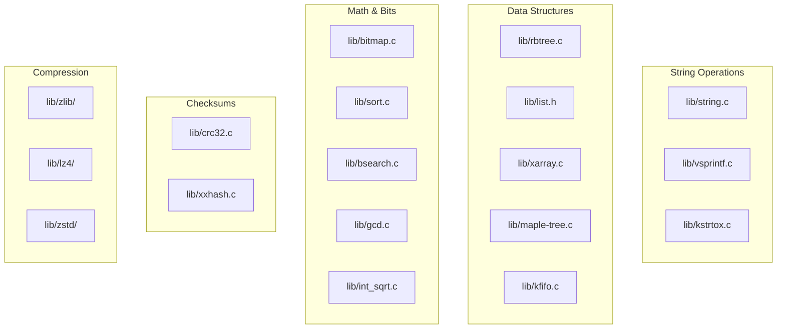
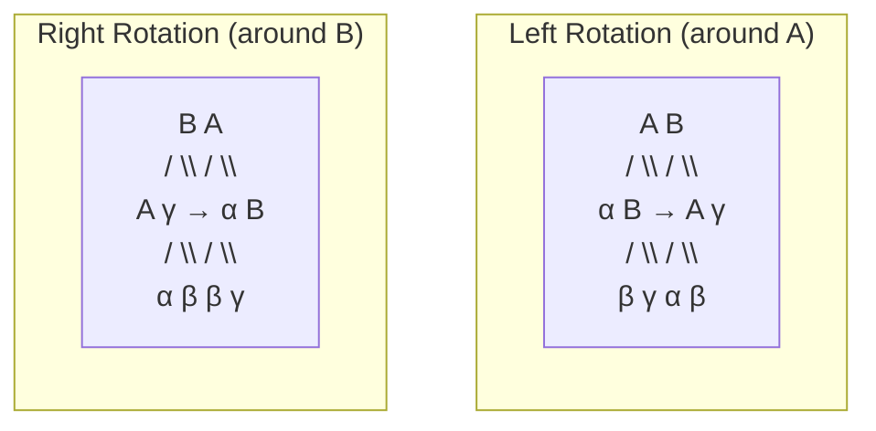

# Chapter 254: lib/ — Kernel Library Functions: String Ops, Sorting, Rbtree, List, Bitmap

## 1. Introduction and Intuition

The `lib/` directory contains general-purpose library functions used throughout the kernel. Think of it as the kernel's standard library — analogous to libc for user-space programs, but tailored for kernel use. These functions handle everything from string manipulation to sorting, from bitmap operations to cryptographic checksums.

### 1.1 Why a Kernel Library?

The kernel cannot link against user-space libraries like glibc. It needs its own implementations of common functions:

- **String operations**: `strcpy`, `strlen`, `memcpy` — but with safety bounds
- **Sorting**: For ordering arrays of data
- **Data structures**: Red-black trees, lists, radix trees
- **Math**: Division, logarithm, GCD
- **Checksums**: CRC32, Adler, Fletcher
- **Compression**: zlib, LZ4, LZO, ZSTD
- **Text processing**: Number formatting, string matching

### 1.2 Safety First

Kernel library functions are designed with safety in mind:
- Bounds checking (`strscpy` instead of `strcpy`)
- Overflow detection (`array_size`, `size_mul`)
- Panic on corruption (`BUILD_BUG_ON`)

---

## 2. Directory Layout

```
lib/
├── Makefile
├── Kconfig
│
├── string.c                # String operations
├── string_helpers.c        # String helper functions
├── vsprintf.c              # sprintf/format implementation
├── kstrtox.c               # String to number conversion
├── cmdstring.c             # Command-line parsing
│
├── sort.c                  # Generic sort (introsort)
├── bsearch.c               # Binary search
├── llist.c                 # Lock-less linked list
├── plist.c                 # Priority-sorted list
├── rbtree.c                # Red-black tree operations
├── radix-tree.c            # Radix tree (xarray predecessor)
├── xarray.c                # XArray (modern radix tree replacement)
├── maple-tree.c            # Maple tree (VMA management)
│
├── bitmap.c                # Bitmap operations
├── bitrev.c                # Bit reversal
├── crc32.c                 # CRC32
├── crc-ccitt.c             # CRC-CCITT
├── crc-t10dif.c            # CRC T10 DIF
├── xxhash.c                # xxHash (fast non-crypto hash)
│
├── kasprintf.c             # Kernel asprintf
├── kobject.c               # Kernel objects (sysfs)
├── kref.c                  # Reference counting
├── kfifo.c                 # Kernel FIFO buffer
├
├── parser.c                # Simple parser
├── cmdline.c               # Command-line parsing
├
├── hexdump.c               # Hex dump utility
├── dump_stack.c            # Stack dump
├
├── gcd.c                   # Greatest Common Divisor
├── lcm.c                   # Least Common Multiple
├── int_sqrt.c              # Integer square root
├
├── locking/                # Lock implementations
│   ├── mutex.c
│   ├── semaphore.c
│   ├── rwsem.c
│   ├── spinlock.c
│   ├── lockdep.c
│   └── ...
│
├── zlib/                   # zlib compression
├── lz4/                    # LZ4 compression
├── lzo/                    # LZO compression
├── zstd/                   # Zstandard compression
│
├── argv_split.c            # Argument splitting
├── flex_proportions.c      # Flexible proportions
├── percpu_counter.c        # Per-CPU counters
├
├── vsprintf.c              # printf family implementation
└── test_*.c                # Self-test modules
```

---

## 3. String Operations

### 3.1 include/linux/string.h

```c
/* Safe string copy (always NUL-terminates) */
size_t strscpy(char *dest, const char *src, size_t count);
size_t strscpy_pad(char *dest, const char *src, size_t count);

/* Concatenation */
size_t strlcat(char *dest, const char *src, size_t count);

/* Comparison */
int strcmp(const char *cs, const char *ct);
int strncmp(const char *cs, const char *ct, size_t count);
int strcasecmp(const char *s1, const char *s2);
int strncasecmp(const char *s1, const char *s2, size_t len);

/* Search */
char *strchr(const char *s, int c);
char *strrchr(const char *s, int c);
char *strnchr(const char *s, size_t count, int c);
char *strstr(const char *s1, const char *s2);
char *strnstr(const char *s1, const char *s2, size_t len);

/* Length */
size_t strlen(const char *s);
size_t strnlen(const char *s, size_t count);

/* Memory operations */
void *memcpy(void *dest, const void *src, size_t count);
void *memmove(void *dest, const void *src, size_t count);
void *memset(void *s, int c, size_t count);
int memcmp(const void *cs, const void *ct, size_t count);
void *memchr(const void *s, int c, size_t n);

/* Safe versions with overflow checking */
void *memcpy(void *dest, const void *src, size_t count);
void *memset(void *s, int c, size_t count);

/* Overflow-safe allocation helpers */
#define array_size(a, b) size_mul(a, b)
#define array3_size(a, b, c) size_mul(size_mul(a, b), c)
#define struct_size(p, member, count) size_add(sizeof(*(p)), size_mul(count, sizeof(*(p)->member)))
```

### 3.2 strscpy() — Safe String Copy

```c
// lib/string.c
ssize_t strscpy(char *dest, const char *src, size_t count)
{
    const char *osrc = src;
    size_t max = count;
    size_t len;
    
    if (count == 0 || WARN_ON(count > INT_MAX))
        return -E2BIG;
    
    /* Copy up to count-1 bytes */
    while (max > 1) {
        char c;
        
        c = *src++;
        *dest++ = c;
        if (c == '\0')
            return src - osrc - 1;
        max--;
    }
    
    /* Ensure NUL termination */
    if (count)
        *dest = '\0';
    
    /* Count remaining source length */
    while (*src)
        src++;
    
    return -E2BIG;  /* Truncated */
}
```

### 3.3 vsprintf.c — Kernel printf

The kernel's `sprintf` implementation is in `lib/vsprintf.c`. It's surprisingly complex, handling kernel-specific format specifiers:

```c
/* Standard formats: %d, %s, %x, %p, etc. */
/* Kernel-specific: */
printk("%pS", func_ptr);      /* Symbol name with offset */
printk("%pB", func_ptr);      /* Symbol name without offset */
printk("%pR", resource_ptr);  /* Resource range */
printk("%pM", mac_addr);      /* MAC address (xx:xx:xx:xx:xx:xx) */
printk("%pI4", ip_addr);      /* IPv4 address */
printk("%pI6", ipv6_addr);    /* IPv6 address */
printk("%pU", uuid_ptr);      /* UUID */
printk("%*ph", len, buf);     /* Hex dump */
printk("%pG", gid_ptr);       /* GID name */
printk("%pE", err_ptr);       /* Error pointer */
```

---

## 4. Sorting (sort.c)

### 4.1 Generic Sort Implementation

```c
// lib/sort.c
void sort(void *base, size_t num, size_t size,
          int (*cmp_func)(const void *, const void *),
          void (*swap_func)(void *, void *))
{
    /* Intro-sort: quicksort with heapsort fallback */
    /* Avoids worst-case O(n²) of pure quicksort */
    
    /* ... */
}
```

### 4.2 Usage Example

```c
#include <linux/sort.h>

struct my_data {
    int key;
    int value;
};

static int cmp_func(const void *a, const void *b)
{
    const struct my_data *da = a;
    const struct my_data *db = b;
    
    return da->key - db->key;
}

/* Sort an array */
struct my_data arr[100];
sort(arr, ARRAY_SIZE(arr), sizeof(arr[0]), cmp_func, NULL);
```

### 4.3 bsearch() — Binary Search

```c
// lib/bsearch.c
void *bsearch(const void *key, const void *base, size_t num, size_t size,
              int (*cmp)(const void *key, const void *elt))
{
    size_t start = 0, end = num;
    int result;
    
    while (start < end) {
        size_t mid = start + (end - start) / 2;
        
        result = cmp(key, base + mid * size);
        if (result < 0)
            end = mid;
        else if (result > 0)
            start = mid + 1;
        else
            return (void *)base + mid * size;
    }
    
    return NULL;
}
```

---

## 5. Red-Black Trees (rbtree.c)

### 5.1 Implementation

```c
// lib/rbtree.c
void rb_insert_color(struct rb_node *node, struct rb_root *root)
{
    struct rb_node *parent, *gparent;
    
    while ((parent = rb_parent(node)) && rb_is_red(parent)) {
        gparent = rb_parent(parent);
        
        if (parent == gparent->rb_left) {
            struct rb_node *uncle = gparent->rb_right;
            
            if (uncle && rb_is_red(uncle)) {
                /* Case 1: Uncle is red → recolor */
                rb_set_black(uncle);
                rb_set_black(parent);
                rb_set_red(gparent);
                node = gparent;
                continue;
            }
            
            if (parent->rb_right == node) {
                /* Case 2: Uncle is black, node is right child → rotate left */
                __rb_rotate_left(parent, root);
                tmp = parent;
                parent = node;
                node = tmp;
            }
            
            /* Case 3: Uncle is black, node is left child → rotate right */
            rb_set_black(parent);
            rb_set_red(gparent);
            __rb_rotate_right(gparent, root);
        } else {
            /* Mirror cases */
            /* ... */
        }
    }
    
    rb_set_black(root->rb_node);
}

void rb_erase(struct rb_node *node, struct rb_root *root)
{
    struct rb_node *rebalance;
    rebalance = __rb_erase_augmented(node, root);
    if (rebalance)
        ____rb_erase_color(rebalance, root);
}
```

### 5.2 Usage Pattern

```c
#include <linux/rbtree.h>

struct my_node {
    int key;
    int value;
    struct rb_node rb;
};

struct rb_root my_tree = RB_ROOT;

/* Insert */
void insert(struct rb_root *root, struct my_node *data)
{
    struct rb_node **new = &root->rb_node, *parent = NULL;
    
    while (*new) {
        struct my_node *this = rb_entry(*new, struct my_node, rb);
        int result = data->key - this->key;
        
        parent = *new;
        if (result < 0)
            new = &((*new)->rb_left);
        else if (result > 0)
            new = &((*new)->rb_right);
        else
            return;  /* Already exists */
    }
    
    rb_link_node(&data->rb, parent, new);
    rb_insert_color(&data->rb, root);
}

/* Search */
struct my_node *search(struct rb_root *root, int key)
{
    struct rb_node *node = root->rb_node;
    
    while (node) {
        struct my_node *data = rb_entry(node, struct my_node, rb);
        
        if (key < data->key)
            node = node->rb_left;
        else if (key > data->key)
            node = node->rb_right;
        else
            return data;
    }
    
    return NULL;
}
```

---

## 6. Bitmap Operations

### 6.1 include/linux/bitmap.h

```c
/* Set bit */
void set_bit(int nr, unsigned long *addr);
void __set_bit(int nr, unsigned long *addr);  /* Non-atomic */

/* Clear bit */
void clear_bit(int nr, unsigned long *addr);
void __clear_bit(int nr, unsigned long *addr);

/* Test bit */
int test_bit(int nr, const unsigned long *addr);

/* Test and set/clear */
int test_and_set_bit(int nr, unsigned long *addr);
int test_and_clear_bit(int nr, unsigned long *addr);

/* Find first set/clear bit */
int find_first_bit(const unsigned long *addr, unsigned int size);
int find_first_zero_bit(const unsigned long *addr, unsigned int size);
int find_next_bit(const unsigned long *addr, unsigned int size, int offset);
int find_next_zero_bit(const unsigned long *addr, unsigned int size, int offset);

/* Count set bits */
int bitmap_weight(const unsigned long *bitmap, int bits);

/* Bitmap operations */
void bitmap_set(unsigned long *map, unsigned int start, int len);
void bitmap_clear(unsigned long *map, unsigned int start, int len);
int bitmap_empty(const unsigned long *bitmap, int bits);
int bitmap_full(const unsigned long *bitmap, int bits);
int bitmap_intersects(const unsigned long *src1, const unsigned long *src2, int nbits);
int bitmap_subset(const unsigned long *src1, const unsigned long *src2, int nbits);
void bitmap_or(unsigned long *dst, const unsigned long *src1, int nbits);
void bitmap_and(unsigned long *dst, const unsigned long *src1, const unsigned long *src2, int nbits);
```

### 6.2 Atomic Bitmap Operations

```c
/* These are atomic and safe for concurrent use */
set_bit(nr, addr);           /* Atomic set */
clear_bit(nr, addr);         /* Atomic clear */
change_bit(nr, addr);        /* Atomic toggle */
test_and_set_bit(nr, addr);  /* Atomic test-and-set */
test_and_clear_bit(nr, addr);/* Atomic test-and-clear */
```

---

## 7. Kernel FIFO (kfifo.c)

```c
// include/linux/kfifo.h
struct kfifo {
    unsigned char *buffer;
    unsigned int size;
    unsigned int in;
    unsigned int out;
};

/* Declare a kfifo */
DECLARE_KFIFO(my_fifo, unsigned char, 256);

/* Initialize */
kfifo_init(&my_fifo, buf, sizeof(buf));

/* Put data */
kfifo_put(&my_fifo, data);

/* Get data */
kfifo_get(&my_fifo, &data);

/* Check if empty/full */
kfifo_is_empty(&my_fifo);
kfifo_is_full(&my_fifo);

/* Peek without removing */
kfifo_peek(&my_fifo, &data);

/* Length */
kfifo_len(&my_fifo);
kfifo_avail(&my_fifo);
```

---

## 8. Compression Libraries

### 8.1 zlib (lib/zlib/)

```c
#include <linux/zlib.h>

/* Compress */
z_stream stream;
stream.next_in = input_buf;
stream.avail_in = input_len;
stream.next_out = output_buf;
stream.avail_out = output_len;

zlib_deflateInit(&stream, level);
zlib_deflate(&stream, Z_FINISH);
zlib_deflateEnd(&stream);

/* Decompress */
zlib_inflateInit(&stream);
zlib_inflate(&stream, Z_FINISH);
zlib_inflateEnd(&stream);
```

### 8.2 LZ4

```c
#include <linux/lz4.h>

/* Compress */
int comp_len = LZ4_compress_default(src, dst, src_len, dst_len, work_mem);

/* Decompress */
int decomp_len = LZ4_decompress_safe(src, dst, comp_len, dst_len);
```

### 8.3 ZSTD

```c
#include <linux/zstd.h>

/* Compress */
ZSTD_CCtx *cctx = ZSTD_createCCtx();
size_t comp_len = ZSTD_compressCCtx(cctx, dst, dst_len, src, src_len, level);
ZSTD_freeCCtx(cctx);

/* Decompress */
ZSTD_DCtx *dctx = ZSTD_createDCtx();
size_t decomp_len = ZSTD_decompressDCtx(dctx, dst, dst_len, src, comp_len);
ZSTD_freeDCtx(dctx);
```

---

## 9. CRC and Hash Functions

### 9.1 CRC32

```c
#include <linux/crc32.h>

u32 crc32_le(u32 crc, const unsigned char *buf, size_t len);
u32 crc32_be(u32 crc, const unsigned char *buf, size_t len);
u32 crc32c_le(u32 crc, const unsigned char *buf, size_t len);
```

### 9.2 xxHash

```c
#include <linux/xxhash.h>

/* 32-bit hash */
u32 xxh32(const void *input, size_t len, u32 seed);

/* 64-bit hash */
u64 xxh64(const void *input, size_t len, u64 seed);
```

---

## 10. Overflow-Safe Arithmetic

```c
#include <linux/overflow.h>

/* Check for multiplication overflow */
#define check_mul_overflow(a, b, res) ...

/* Safe size calculation */
size_t array_size(size_t a, size_t b);          /* a * b with overflow check */
size_t array3_size(size_t a, size_t b, size_t c); /* a * b * c */
size_t struct_size(void *p, member, count);     /* sizeof(*p) + count * sizeof(p->member) */

/* Example usage */
struct my_struct {
    int header;
    int data[];
};

size_t size = struct_size(my_struct, data, count);
my_struct *p = kmalloc(size, GFP_KERNEL);
```

---

## 11. Self-Test Modules

The `lib/` directory includes self-test modules that verify the library functions:

```bash
# Enable kernel config options:
CONFIG_TEST_SORT=y
CONFIG_TEST_LIST_SORT=y
CONFIG_TEST_MIN_HEAP=y
CONFIG_TEST_XARRAY=m
CONFIG_TEST_MAPLE_TREE=m

# Run tests
dmesg | grep "test_sort:"
```

---

## 12. Diagrams

### 12.1 Library Function Categories



### 12.2 Red-Black Tree Rotations



---

## 13. Relationships with Other Subsystems

### 13.1 lib/ ↔ kernel/

- `sort()` is used by the scheduler, block layer, and many drivers
- `rbtree` is used by the scheduler (CFS), memory management (VMAs), and filesystems
- `bitmap` is used for CPU masks, IRQ management, and device allocation

### 13.2 lib/ ↔ mm/

- `xarray` replaced the old radix tree for page cache indexing
- `maple_tree` replaced the VMA red-black tree
- Overflow-safe arithmetic prevents memory allocation size errors

### 13.3 lib/ ↔ fs/

- `crc32c` is used by ext4 and btrfs for checksums
- `sort` is used for sorting directory entries
- `string` functions are used for path parsing

### 13.4 lib/ ↔ crypto/

- `crc32` provides hardware-accelerated checksums
- `xxhash` provides fast hashing for hash tables
- Compression libraries are used by filesystems and block layer

---

## 14. References

1. **Linux Kernel Source**: `lib/` directory
2. **Documentation**: `Documentation/core-api/` and `Documentation/printk-formats.rst`
3. **"Linux Kernel Development, 3rd Edition"** — Robert Love
4. **Red-Black Tree**: Cormen, Leiserson, Rivest, Stein — "Introduction to Algorithms"
5. **LWN.net**: "A new data structure for the kernel" (maple tree article)
6. **CRC32**: CRC Error Detection Algorithms (Williams, 1993)
7. **xxHash**: xxHash fast hash algorithm
8. **ZSTD**: Zstandard compression specification
