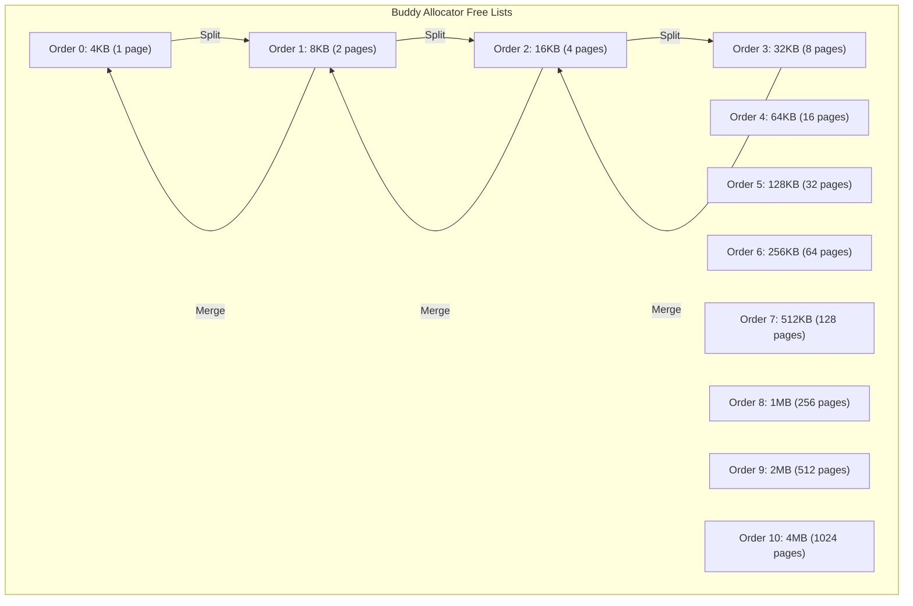
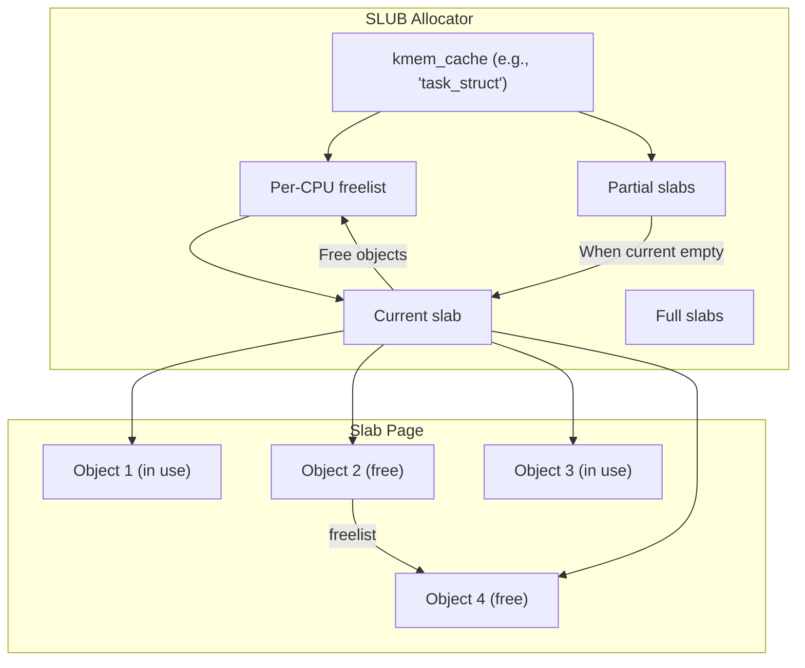

# Chapter 255: mm/ — Memory Management: page_alloc.c, mmap.c, slab.c, swap.c, oom_kill.c

## 1. Introduction and Intuition

The `mm/` directory implements the Linux kernel's memory management subsystem — one of the most complex and critical parts of the kernel. Memory management handles everything from physical page allocation to virtual memory mapping, from the slab allocator (which provides `kmalloc`) to swap (which extends physical memory with disk), to the OOM killer (which sacrifices processes when memory is exhausted).

### 1.1 The Memory Management Challenge

The kernel must solve several conflicting problems simultaneously:
- **Efficient allocation**: Give memory to processes quickly
- **Isolation**: Prevent processes from accessing each other's memory
- **Transparency**: Hide physical memory details from applications
- **Overcommit**: Allow processes to allocate more memory than physically available
- **Performance**: Minimize overhead for common operations
- **Fairness**: Share memory equitably among processes

### 1.2 Key Concepts

| Concept | Description |
|---------|-------------|
| **Physical pages** | Memory is managed in fixed-size pages (typically 4KB) |
| **Virtual memory** | Each process has its own virtual address space |
| **Page tables** | Hardware structures that map virtual → physical addresses |
| **Page cache** | Cached file data in memory |
| **Slab allocator** | Efficient allocation of small objects |
| **Zones** | Physical memory divided into regions (DMA, Normal, HighMem) |
| **NUMA** | Non-Uniform Memory Access — different memory regions have different access speeds |

---

## 2. Directory Layout

```
mm/
├── Makefile
├── Kconfig
│
├── page_alloc.c            # *** Physical page allocator ***
├── page_alloc.c            # Buddy allocator, zones, free lists
├── gup.c                   # get_user_pages() - pin user pages
├
├── mmap.c                  # *** Virtual memory mapping (mmap, munmap) ***
├── mremap.c                # mremap() - resize/relocate mappings
├── mlock.c                 # mlock()/munlock() - lock pages in memory
├── mprotect.c              # mprotect() - change page protections
├│
├── slab.c                  # *** Slab allocator (kmalloc/kfree) ***
├── slab_common.c           # Common slab operations
├── slub.c                  # SLUB allocator (default)
├── slob.c                  # SLOB allocator (tiny systems)
├── slqb.c                  # SLQB allocator (experimental)
│
├── vmscan.c                # *** Page reclaim (kswapd) ***
├── page-writeback.c        # Dirty page writeback
├│
├── swap.c                  # *** Swap subsystem ***
├│
├── swap_state.c            # Swap cache
├│
├── swapfile.c              # Swap file/partition management
├
├── oom_kill.c              # *** OOM (Out of Memory) killer ***
├│
├── memory.c                # *** Memory fault handling (page fault handler) ***
├│
├│
├── vma.c                   # VMA (Virtual Memory Area) operations
├
├│
├── mm_init.c               # Memory management initialization
├│
├
├── highmem.c               # High memory management (32-bit)
├│
├│
├── memcontrol.c            # Memory cgroup controller
├│
├
├│
├── huge_memory.c           # Huge pages (THP)
├│
├
├
├
├│
├│
├│
├
├── shmem.c                 # tmpfs/shmem implementation
├│
├
├
├│
├│
├
├── maccess.c               # Probe user/kernel memory safely
├│
├
├
├│
├│
├
├── page_owner.c            # Page owner tracking (debugging)
├│
├
├
├│
├│
├
├── ksm.c                   # Kernel Same-page Merging
├│
├
├│
├│
├
├── rmap.c                  # Reverse mapping (page → PTE)
├│
├
├│
├│
├
├│
├── memremap.c              # Memory remapping
├│
├
├│
├│
├
├
├── vmalloc.c               # vmalloc() - virtually contiguous allocation
├│
├
├│
├│
├
├
├── percpu.c                # Per-CPU memory allocation
├│
├
├│
├│
├
├│
├── compaction.c            # Memory compaction (defragmentation)
├│
├
├│
├│
├
├
├│
├── maccess.c               # Safe memory access
├│
├
├│
├│
├
├│
├── mm_init.c               # MM initialization
├│
├
├│
├│
├
├
├── hugetlb.c               # HugeTLB pages
├
├── usercopy.c              # User-space copy functions
├
├
├
├── page_vma_mapped.c       # Page-VM
├── nommu.c                 # No-MMU support (embedded)
├
├── process_vm_access.c     # process_vm_readv/writev
└── ...
```

---

## 3. Key Files and Subsystems

### 3.1 page_alloc.c — The Buddy Allocator

The buddy allocator manages physical pages. It's the foundation of all memory allocation:

```c
// mm/page_alloc.c

/* Free a page to the buddy system */
void __free_pages(struct page *page, unsigned int order)
{
    /* ... */
    free_one_page(page_zone(page), page, order, FPI_NONE);
}

/* Allocate pages */
struct page *alloc_pages(gfp_t gfp_mask, unsigned int order)
{
    return __alloc_pages(gfp_mask, order, numa_node_id(), NULL);
}

struct page *__alloc_pages(gfp_t gfp, unsigned int order, int preferred_nid,
                           nodemask_t *nodemask)
{
    struct page *page;
    
    /* Try direct allocation */
    page = get_page_from_freelist(gfp, order, alloc_flags, &ac);
    
    if (!page) {
        /* Direct reclaim: try to free some pages */
        page = __alloc_pages_slowpath(gfp, order, &ac);
    }
    
    return page;
}
```

#### 3.1.1 Zone Structure

```c
struct zone {
    unsigned long _watermark[NR_WMARK];     /* Watermarks (min, low, high) */
    unsigned long watermark_boost;
    
    long lowmem_reserve[MAX_NR_ZONES];      /* Reserve for higher zones */
    
    struct pglist_data *zone_pgdat;         /* Back pointer to node */
    struct per_cpu_pages __percpu *per_cpu_pageset;
    
    /* Free area lists (buddy system) */
    struct free_area free_area[NR_PAGE_ORDERS];
    
    /* Zone flags */
    unsigned long flags;
    
    /* Statistics */
    atomic_long_t vm_stat[NR_VM_ZONE_STAT_ITEMS];
    atomic_long_t vm_numa_event[NR_VM_NUMA_EVENT_ITEMS];
    
    /* ... */
};
```

#### 3.1.2 Free Area (Buddy Lists)

```c
struct free_area {
    struct list_head free_list[MIGRATE_TYPES];  /* Per-migrate-type lists */
    unsigned long nr_free;                       /* Number of free pages */
};
```

The buddy allocator maintains free lists for each order (0 to MAX_ORDER, typically 11):
- Order 0: 1 page (4KB)
- Order 1: 2 pages (8KB)
- Order 2: 4 pages (16KB)
- ...
- Order 10: 1024 pages (4MB)

#### 3.1.3 Watermarks

```c
enum zone_watermarks {
    WMARK_MIN,      /* Minimum: emergency reserves */
    WMARK_LOW,      /* Low: trigger kswapd */
    WMARK_HIGH,     /* High: kswapd stops */
    NR_WMARK
};

/* Default watermark calculation */
int __meminit init_per_zone_wmark_min(void)
{
    /* min_free_kbytes determines the watermarks */
    /* WMARK_MIN = min_free_kbytes / 4 */
    /* WMARK_LOW = WMARK_MIN + WMARK_MIN / 4 */
    /* WMARK_HIGH = WMARK_MIN + WMARK_MIN / 2 */
}
```

When free pages drop below `WMARK_LOW`, the kernel wakes `kswapd` to reclaim pages. When below `WMARK_MIN`, allocations may block to directly reclaim pages.

### 3.2 mmap.c — Virtual Memory Mapping

`mmap.c` manages virtual memory areas (VMAs) and the page tables that map them:

#### 3.2.1 VMA Structure

```c
struct vm_area_struct {
    unsigned long vm_start;         /* Start address */
    unsigned long vm_end;           /* End address */
    
    struct mm_struct *vm_mm;        /* Owning address space */
    pgprot_t vm_page_prot;          /* Page protections */
    unsigned long vm_flags;         /* VM_READ, VM_WRITE, VM_EXEC, etc. */
    
    struct rb_node vm_rb;           /* Red-black tree node */
    
    union {
        struct {
            struct rb_node rb;
            unsigned long rb_subtree_gap;
        } shared;
        struct list_head anon_vma_chain;
    };
    
    struct anon_vma *anon_vma;      /* Anonymous VMA */
    const struct vm_operations_struct *vm_ops;  /* VMA operations */
    
    unsigned long vm_pgoff;         /* File offset (in pages) */
    struct file *vm_file;           /* File (if file-backed) */
    void *vm_private_data;          /* Driver-private data */
    
    atomic_long_t ref_count;
};
```

#### 3.2.2 mmap System Call

```c
// mm/mmap.c
SYSCALL_DEFINE6(mmap, unsigned long, addr, unsigned long, len,
                unsigned long, prot, unsigned long, flags,
                unsigned long, fd, unsigned long, off)
{
    struct file *file = NULL;
    
    if (!(flags & MAP_ANONYMOUS)) {
        file = fget(fd);
        if (!file)
            return -EBADF;
    }
    
    return ksys_mmap_pgoff(addr, len, prot, flags, file, off >> PAGE_SHIFT);
}

unsigned long ksys_mmap_pgoff(unsigned long addr, unsigned long len,
                              unsigned long prot, unsigned long flags,
                              struct file *file, unsigned long pgoff)
{
    struct mm_struct *mm = current->mm;
    unsigned long retval;
    
    if (!(flags & MAP_ANONYMOUS)) {
        /* File-backed mapping */
        retval = vm_mmap_pgoff(file, addr, len, prot, flags, pgoff);
    } else {
        /* Anonymous mapping */
        retval = do_mmap(NULL, addr, len, prot, flags, 0, pgoff, &populate, NULL);
    }
    
    return retval;
}
```

#### 3.2.3 VMA Operations

```c
struct vm_operations_struct {
    void (*open)(struct vm_area_struct *area);
    void (*close)(struct vm_area_struct *area);
    int (*mremap)(struct vm_area_struct *area);
    int (*fault)(struct vm_fault *vmf);
    int (*huge_fault)(struct vm_fault *vmf, unsigned int order);
    int (*map_pages)(struct vm_fault *vmf, pgoff_t start_pgoff, pgoff_t end_pgoff);
    unsigned long (*pagesize)(struct vm_area_struct *area);
    /* ... */
};
```

### 3.3 memory.c — Page Fault Handler

The page fault handler is one of the most performance-critical code paths:

```c
// mm/memory.c
vm_fault_t do_page_fault(struct pt_regs *regs, unsigned long error_code,
                          unsigned long address)
{
    struct mm_struct *mm;
    struct vm_area_struct *vma;
    vm_fault_t fault;
    
    mm = current->mm;
    
    /* Find the VMA containing the faulting address */
    vma = vma_lookup(mm, address);
    
    if (!vma) {
        /* Check if we can expand an existing VMA */
        vma = find_vma(mm, address);
        if (!vma || vma->vm_start > address)
            return VM_FAULT_SIGSEGV;  /* No VMA → segfault */
    }
    
    /* Check permissions */
    if (error_code & X86_PF_WRITE) {
        if (!(vma->vm_flags & VM_WRITE))
            return VM_FAULT_SIGSEGV;  /* Write to read-only → segfault */
    }
    
    /* Handle the fault */
    fault = handle_mm_fault(vma, address, error_code, regs);
    
    /* If fatal, send SIGBUS/SIGSEGV */
    if (fault & VM_FAULT_ERROR) {
        if (fault & VM_FAULT_OOM)
            return VM_FAULT_OOM;  /* Out of memory */
        if (fault & VM_FAULT_SIGSEGV)
            return VM_FAULT_SIGSEGV;
    }
    
    return fault;
}
```

### 3.4 slab.c / slub.c — Slab Allocator

The slab allocator provides efficient allocation of small objects:

#### 3.4.1 SLUB Allocator (Default)

```c
// mm/slub.c
struct kmem_cache {
    struct kmem_cache_cpu __percpu *cpu_slab;  /* Per-CPU slabs */
    
    /* Slab management */
    slab_flags_t flags;
    unsigned long min_partial;
    unsigned int size;              /* Object size including metadata */
    unsigned int object_size;       /* User-requested object size */
    struct reciprocal_value reciprocal_size;
    unsigned int offset;            /* Free pointer offset */
    struct kmem_cache_order_objects oo;  /* Order and objects per slab */
    struct kmem_cache_order_objects min; /* Minimum allocation */
    
    /* Object management */
    gfp_t allocflags;
    int refcount;
    void (*ctor)(void *);
    
    /* Statistics */
    unsigned int inuse;         /* Objects in use */
    unsigned int objects;       /* Objects per slab */
    
    /* ... */
};

struct kmem_cache_cpu {
    union {
        struct {
            void **freelist;        /* Pointer to first free object */
            unsigned long tid;      /* Transaction ID */
        };
        freelist_aba_t freelist_tid;
    };
    struct slab *slab;          /* Current slab being allocated from */
    struct slab *partial;       /* Partial slabs */
#ifdef CONFIG_SLUB_CPU_PARTIAL
    struct slab *partial_list;  /* Per-CPU partial list */
#endif
};
```

#### 3.4.2 Allocation Path

```c
// kmalloc → __kmalloc → slab_alloc
static __always_inline void *slab_alloc(struct kmem_cache *s,
                                         struct list_head *head,
                                         gfp_t gfpflags,
                                         unsigned long addr,
                                         unsigned long caller)
{
    void *object;
    
    /* Fast path: allocate from per-CPU slab */
    object = kfence_alloc(s, gfpflags);
    if (!object)
        object = __slab_alloc(s, gfpflags, NUMA_NO_NODE, addr, caller);
    
    return object;
}

static void *__slab_alloc(struct kmem_cache *s, gfp_t gfpflags,
                          int node, unsigned long addr,
                          unsigned long caller)
{
    struct kmem_cache_cpu *c;
    
    c = raw_cpu_ptr(s->cpu_slab);
    
    /* Check per-CPU freelist */
    if (c->freelist) {
        object = c->freelist;
        c->freelist = get_freepointer(s, object);
        return object;
    }
    
    /* No free objects in current slab, get a new one */
    return ___slab_alloc(s, gfpflags, node, addr, caller);
}
```

### 3.5 vmscan.c — Page Reclaim (kswapd)

The kernel must reclaim pages when memory is low:

```c
// mm/vmscan.c

/* kswapd main loop */
static int kswapd(void *p)
{
    pg_data_t *pgdat = p;
    struct task_struct *tsk = current;
    
    for (;;) {
        /* Sleep until woken by memory pressure */
        wait_event_interruptible(pgdat->kswapd_wait,
                                 kswapd_shrink_node(pgdat));
        
        /* Reclaim pages */
        balance_pgdat(pgdat, order, highest_zoneidx);
    }
}
```

#### 3.5.1 LRU Lists

The page reclaim algorithm uses LRU (Least Recently Used) lists:

```c
enum lru_list {
    LRU_INACTIVE_ANON,      /* Inactive anonymous pages */
    LRU_ACTIVE_ANON,        /* Active anonymous pages */
    LRU_INACTIVE_FILE,      /* Inactive file-backed pages */
    LRU_ACTIVE_FILE,        /* Active file-backed pages */
    LRU_UNEVICTABLE,        /* Pages that cannot be evicted (mlocked) */
    NR_LRU_LISTS
};
```

### 3.6 swap.c — Swap Subsystem

Swap allows the kernel to move unused pages to disk:

```c
// mm/swap.c

/* Initialize swap subsystem */
void __init swap_setup(void)
{
    /* ... */
}

/* Add a swap entry */
int add_swap_extent(struct swap_info_struct *sis, pgoff_t start_page,
                    pgoff_t nr_pages, sector_t start_block)
{
    /* ... */
}
```

### 3.7 oom_kill.c — OOM Killer

When the system is completely out of memory, the OOM killer sacrifices a process:

```c
// mm/oom_kill.c

/* Select the OOM victim */
static struct task_struct *select_bad_process(struct oom_control *oc)
{
    struct task_struct *p;
    struct task_struct *chosen = NULL;
    unsigned long chosen_points = 0;
    
    for_each_process(p) {
        if (is_oom_victim(p))
            continue;
        
        /* Calculate "badness" score */
        points = oom_badness(p, oc);
        
        if (points > chosen_points) {
            chosen = p;
            chosen_points = points;
        }
    }
    
    return chosen;
}

/* Calculate OOM badness score */
long oom_badness(struct task_struct *p, unsigned long totalpages)
{
    long points;
    long adj;
    
    /* Base: process RSS + swap + page table usage */
    points = get_mm_rss(p->mm) + get_mm_counter(p->mm, MM_SWAPENTS) +
             mm_pgtables_bytes(p->mm) / PAGE_SIZE;
    
    /* Adjust by OOM score adjustment (-1000 to +1000) */
    adj = (long)p->signal->oom_score_adj * points / OOM_SCORE_ADJ_MAX;
    points += adj;
    
    /* Root processes get a bonus */
    if (has_capability_noaudit(p, CAP_SYS_ADMIN) ||
        has_capability_noaudit(p, CAP_SYS_RESOURCE))
        points -= 30;
    
    return points > 0 ? points : 1;
}

/* Kill the selected process */
static void oom_kill_process(struct oom_control *oc, const char *message)
{
    struct task_struct *victim = oc->chosen;
    struct task_struct *p;
    struct task_struct *t;
    
    pr_err("%s: Killed process %d (%s) total-vm:%lukB, anon-rss:%lukB\n",
           message, victim->pid, victim->comm,
           K(victim->mm->total_vm),
           K(get_mm_counter(victim->mm, MM_ANONPAGES)));
    
    /* Send SIGKILL to victim and all threads */
    do_send_sig_info(SIGKILL, SEND_SIG_PRIV, victim, PIDTYPE_TGID);
    for_each_thread(victim, t)
        do_send_sig_info(SIGKILL, SEND_SIG_PRIV, t, PIDTYPE_PID);
}
```

---

## 4. Key Data Structures

### 4.1 struct page

The `struct page` is one of the most important structures in the kernel:

```c
struct page {
    unsigned long flags;            /* Page flags (PG_locked, PG_dirty, etc.) */
    
    union {
        struct {    /* Page cache */
            union {
                struct list_head lru;       /* LRU list node */
                struct {
                    void *__filler;
                    unsigned int inuse;
                };
            };
            struct address_space *mapping;  /* Page cache mapping */
            pgoff_t index;                  /* Offset in mapping */
            unsigned long private;          /* FS-private data */
        };
        struct {    /* Slab */
            struct kmem_cache *slab_cache;
            void *freelist;
            union {
                unsigned long counters;
                struct {
                    unsigned inuse:16;
                    unsigned objects:15;
                    unsigned frozen:1;
                };
            };
        };
        struct {    /* Compound page */
            unsigned long compound_head;
            unsigned char compound_dtor;
            unsigned char compound_order;
            atomic_t compound_mapcount;
            atomic_t subpages_mapcount;
        };
        struct {    /* Tail pages */
            unsigned long _compound_pad_1;
            unsigned long _compound_pad_2;
            struct list_head deferred_list;
        };
    };
    
    atomic_t _refcount;
    atomic_t _mapcount;
};
```

### 4.2 struct mm_struct

Already covered in Chapter 250.

### 4.3 struct vm_area_struct

Already covered above.

---

## 5. Diagrams

### 5.1 Memory Allocation Layers

```mermaid
graph TB
    subgraph "User Space"
        MALLOC[malloc() / mmap()]
    end
    
    subgraph "Virtual Memory"
        VMA[VMA: vm_area_struct]
        PT[Page Tables: PGD → P4D → PUD → PMD → PTE]
    end
    
    subgraph "Page Allocator (Buddy)"
        PA[page_alloc.c]
        ZONES[Zones: DMA, DMA32, Normal, HighMem]
        FREELIST[Free lists by order]
    end
    
    subgraph "Slab Allocator"
        SLAB[SLUB: kmem_cache]
        PERCPU[Per-CPU slab]
        PARTIAL[Partial slabs]
    end
    
    subgraph "Physical Memory"
        PAGES[Physical pages]
    end
    
    subgraph "Swap"
        SWAP[Swap partition/file]
    end
    
    MALLOC --> VMA
    VMA --> PT
    PT --> |"page fault"| PA
    PA --> ZONES
    ZONES --> FREELIST
    FREELIST --> PAGES
    
    SLAB --> PA
    PERCPU --> PA
    
    PA --> |"kswapd"| SWAP
```

### 5.2 Page Fault Handling

```mermaid
sequenceDiagram
    PROC as Process
    CPU as CPU/Page Table
    PF as do_page_fault()
    VMA as VMA Lookup
    HANDLER as handle_mm_fault()
    PA as Page Allocator
    DISK as Disk (for file-backed)
    
    PROC->>CPU: Access virtual address
    CPU->>CPU: Walk page tables
    CPU->>PF: Page fault (PTE not present)
    
    PF->>VMA: find_vma(address)
    alt No VMA
        VMA-->>PROC: SIGSEGV (segfault)
    end
    
    PF->>PF: Check permissions
    alt Permission denied
        PF-->>PROC: SIGSEGV
    end
    
    PF->>HANDLER: handle_mm_fault(vma, addr)
    
    alt Anonymous page
        HANDLER->>PA: alloc_page(GFP_USER)
        PA-->>HANDLER: New zeroed page
        HANDLER->>HANDLER: Map page in PTE
    else File-backed page
        HANDLER->>DISK: Read page from file
        DISK-->>HANDLER: Page data
        HANDLER->>HANDLER: Add to page cache
        HANDLER->>HANDLER: Map page in PTE
    else Copy-on-Write
        HANDLER->>PA: alloc_page(GFP_USER)
        HANDLER->>HANDLER: Copy old page to new
        HANDLER->>HANDLER: Map new page read-write
    end
    
    HANDLER-->>PROC: Return from fault
```

### 5.3 Buddy Allocator Orders



### 5.4 SLUB Allocator



---

## 6. Relationships with Other Subsystems

### 6.1 mm/ ↔ kernel/

- Page faults are triggered by user-space memory access
- The scheduler uses `mm_struct` to track process memory
- `copy_mm()` is called during `fork()` to duplicate address spaces

### 6.2 mm/ ↔ fs/

- The page cache stores file data in memory
- `filemap_fault()` handles faults for file-backed mappings
- `writeback` writes dirty pages to disk
- tmpfs (`mm/shmem.c`) stores everything in memory

### 6.3 mm/ ↔ block/

- Swap I/O goes through the block layer
- Page readahead submits bios for file-backed pages
- Direct I/O (`O_DIRECT`) bypasses the page cache

### 6.4 mm/ ↔ arch/

- Page table manipulation is architecture-specific
- TLB flushing is architecture-specific
- The page fault handler starts in architecture-specific code

---

## 7. Advanced Topics

### 7.1 NUMA Memory Policy

```c
// include/linux/mempolicy.h
struct mempolicy {
    atomic_t refcnt;
    unsigned short mode;        /* MPOL_BIND, MPOL_INTERLEAVE, etc. */
    unsigned short flags;
    
    union {
        nodemask_t nodes;       /* Node mask for BIND/INTERLEAVE */
        nodemask_t preferred;   /* Preferred node */
    } v;
};
```

### 7.2 Transparent Huge Pages (THP)

```c
// mm/huge_memory.c
vm_fault_t do_huge_pmd_anonymous_page(struct vm_fault *vmf)
{
    /* Try to allocate a 2MB huge page instead of 512 4KB pages */
    struct page *page;
    
    page = alloc_hugepage_vma(gfp, vma, haddr, HPAGE_PMD_ORDER);
    if (!page)
        return VM_FAULT_FALLBACK;  /* Fall back to regular pages */
    
    /* Map the huge page */
    clear_huge_page(page, haddr);
    set_huge_pmd_at(vmf->vma->vm_mm, haddr, vmf->pmd, entry);
    
    return 0;
}
```

### 7.3 Memory Compaction

When the system has enough free memory but it's fragmented, compaction moves pages to create contiguous free blocks:

```c
// mm/compaction.c
static enum compact_result compact_zone(struct compact_control *cc)
{
    /* Migrate pages from source to destination */
    while (cc->migrate_pfn < cc->free_pfn) {
        /* Find a movable page */
        page = isolate_migratepages(cc);
        
        /* Migrate it */
        migrate_pages(&cc->migratepages, compaction_alloc, ...);
    }
}
```

### 7.4 Kernel Same-page Merging (KSM)

KSM finds pages with identical content and merges them into a single copy-on-write page:

```c
// mm/ksm.c
static int ksm_scan_thread(void *nothing)
{
    while (!kthread_should_stop()) {
        /* Scan for duplicate pages */
        ksm_do_scan(ksm_thread_pages_to_scan);
        
        /* Sleep */
        schedule_timeout_interruptible(ksm_thread_sleep_millisecs);
    }
}
```

---

## 8. References

1. **Linux Kernel Source**: `mm/` directory
2. **Documentation**: `Documentation/mm/`
3. **"Understanding the Linux Kernel, 3rd Edition"** — Bovet & Cesati
4. **"Linux Kernel Development, 3rd Edition"** — Robert Love (Chapter 12: Memory Management)
5. **"What Every Programmer Should Know About Memory"** — Ulrich Drepper
6. **LWN.net**: Various memory management articles
7. **NUMA documentation**: `Documentation/admin-guide/mm/numa_memory_policy.rst`
8. **THP documentation**: `Documentation/admin-guide/mm/transhuge.rst`
9. **SLUB allocator design**: `Documentation/mm/slub.rst`
10. **Mel Gorman's MM documentation**: Various papers and presentations
