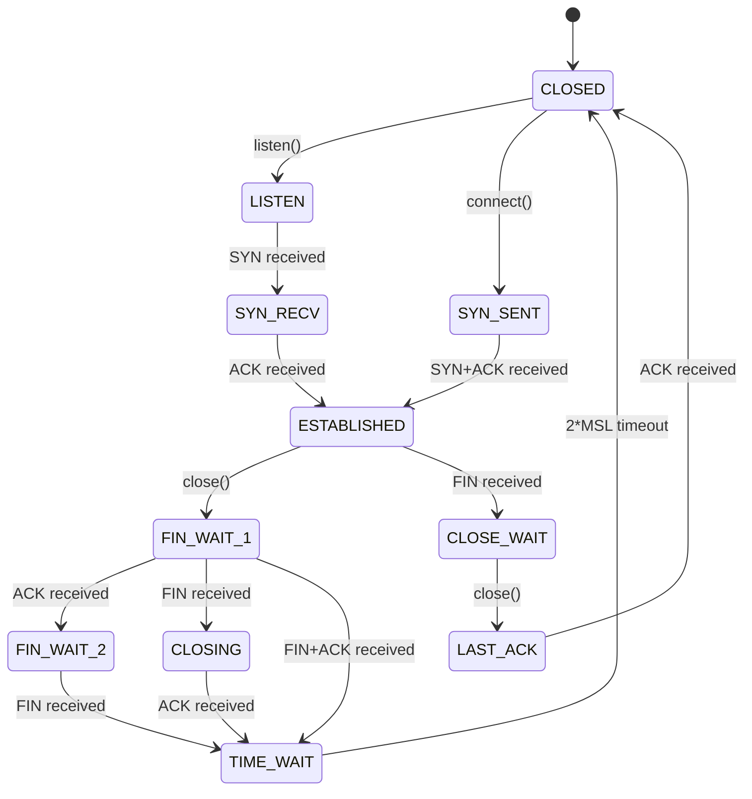
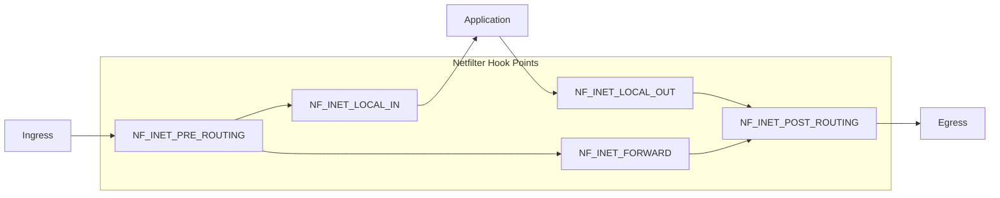

# Chapter 256: net/ — Networking Subsystem: core/, ipv4/, ipv6/, socket.c, sk_buff Flow

## 1. Introduction and Intuition

The `net/` directory implements the Linux kernel's networking stack — one of the most sophisticated and highest-performance networking implementations in the world. It implements the full TCP/IP protocol suite, from socket interfaces down to packet framing, along with advanced features like Netfilter, traffic control, and network namespaces.

### 1.1 The Networking Stack

The Linux networking stack follows a layered architecture, similar to the OSI model:

| Layer | Kernel Component | Purpose |
|-------|-----------------|---------|
| **Application** | Socket API | User-space interface |
| **Transport** | TCP/UDP | Reliable/unreliable delivery |
| **Network** | IPv4/IPv6 | Routing, fragmentation |
| **Link** | Net device drivers | Frame transmission |
| **Physical** | Hardware | Bits on wire |

### 1.2 Key Abstraction: sk_buff

The `sk_buff` (socket buffer) is the fundamental data structure representing a network packet. Every packet — from the moment it's created by an application until it's transmitted on the wire — is represented as an `sk_buff`.

---

## 2. Directory Layout

```
net/
├── Makefile
├── Kconfig
│
├── socket.c                # *** Socket system calls (socket, bind, listen, etc.) ***
├── core/                   # *** Networking core ***
│   ├── sock.c              # Socket management
│   ├── sk_buff.c           # sk_buff allocation and management
│   ├── dev.c               # Network device management
│   ├── dev_ioctl.c         # Device ioctls
│   ├── filter.c            # Socket filtering (BPF)
│   ├── flow_dissector.c    # Packet flow dissection
│   ├── gro.c               # Generic Receive Offload
│   ├── neighbour.c         # ARP/NDP neighbour tables
│   ├── dst.c               # Destination cache
│   ├── link_watch.c        # Link state monitoring
│   ├── net_namespace.c     # Network namespaces
│   ├── net-procfs.c        # /proc/net/ interface
│   ├── sock_diag.c         # Socket diagnostics (ss tool)
│   ├── skbuff.c            # sk_buff operations
│   ├── stream.c            # Stream socket helpers
│   ├── utils.c             # Network utilities
│   └── xdp.c               # eXpress Data Path
│
├── ipv4/                   # *** IPv4 protocol ***
│   ├── af_inet.c           # IPv4 socket family
│   ├── tcp_ipv4.c          # TCP over IPv4
│   ├── udp.c               # UDP implementation
│   ├── icmp.c              # ICMP (ping, destination unreachable)
│   ├── igmp.c              # IGMP (multicast group management)
│   ├── ip_forward.c        # IP forwarding (routing)
│   ├── ip_input.c          # IP packet reception
│   ├── ip_output.c         # IP packet transmission
│   ├── ip_fragment.c       # IP fragmentation/reassembly
│   ├── ip_sockglue.c       # IP socket options
│   ├── route.c             # Routing table
│   ├── fib_frontend.c      # FIB (Forwarding Information Base) frontend
│   ├── fib_trie.c          # FIB trie (LC-trie for fast lookup)
│   ├── arp.c               # ARP protocol
│   ├── ping.c              # ICMP ping socket
│   ├── raw.c               # Raw IP sockets
│   ├── sysctl_net_ipv4.c   # /proc/sys/net/ipv4/ sysctls
│   ├── inet_connection_sock.c # Connection socket (TCP) base
│   ├── tcp.c               # TCP core
│   ├── tcp_input.c         # TCP receive path
│   ├── tcp_output.c        # TCP transmit path
│   ├── tcp_timer.c         # TCP timers
│   ├── tcp_cong.c          # TCP congestion control framework
│   ├── tcp_cubic.c         # CUBIC congestion control
│   ├── tcp_bbr.c           # BBR congestion control
│   ├── tcp_bbr2.c          # BBRv2 congestion control
│   ├── tcp_reno.c          # Reno congestion control
│   ├── tcp_minisocks.c     # TCP mini-sockets (TIME_WAIT, etc.)
│   ├── tcp_metrics.c       # TCP metrics cache
│   └── tcp_fastopen.c      # TCP Fast Open
│
├── ipv6/                   # *** IPv6 protocol ***
│   ├── af_inet6.c          # IPv6 socket family
│   ├── tcp_ipv6.c          # TCP over IPv6
│   ├── udp_ipv6.c          # UDP over IPv6
│   ├── icmpv6.c            # ICMPv6
│   ├── ip6_input.c         # IPv6 packet reception
│   ├── ip6_output.c        # IPv6 packet transmission
│   ├── ip6_fib.c           # IPv6 FIB
│   ├── addrconf.c          # IPv6 address configuration (SLAAC)
│   ├── mcast.c             # IPv6 multicast
│   ├── ndisc.c             # Neighbour Discovery Protocol
│   ├── reassembly.c        # IPv6 fragment reassembly
│   ├── route.c             # IPv6 routing
│   └── sysctl_net_ipv6.c   # IPv6 sysctls
│
├── netfilter/              # *** Netfilter framework ***
│   ├── core.c              # Netfilter core (hook infrastructure)
│   ├── nf_queue.c          # Netfilter queue (NFQUEUE)
│   ├── nf_log.c            # Netfilter logging
│   ├── nf_sockopt.c        # Netfilter socket options
│   ├── nf_tables_api.c     # nftables API
│   ├── nf_internals.h      # Netfilter internals
│   └── ...
│
├── ipv4/netfilter/         # IPv4 Netfilter hooks
├── ipv6/netfilter/         # IPv6 Netfilter hooks
│
├── bridge/                 # *** Bridging ***
│   ├── br_device.c         # Bridge device
│   ├── br_forward.c        # Frame forwarding
│   ├── br_input.c          # Frame reception
│   ├── br_stp.c            # Spanning Tree Protocol
│   ├── br_netfilter.c      # Bridge Netfilter hooks
│   └── br_fdb.c            # Forwarding Database
│
├── wireless/               # *** WiFi subsystem ***
│   ├── core.c              # cfg80211 core
│   ├── nl80211.c            # Netlink interface
│   ├── scan.c              # Scanning
│   ├── mlme.c              # MLME (MAC Layer Management)
│   ├── util.c              # Utilities
│   └── ...
│
├── bluetooth/              # *** Bluetooth ***
│   ├── af_bluetooth.c      # Bluetooth socket family
│   ├── hci_core.c          # HCI (Host Controller Interface)
│   ├── l2cap.c             # L2CAP protocol
│   ├── rfcomm.c            # RFCOMM (serial emulation)
│   ├── sco.c               # SCO (audio)
│   └── ...
│
├── sched/                  # *** Traffic control (tc) ***
│   ├── sch_generic.c       # Generic qdisc framework
│   ├── sch_fifo.c          # FIFO qdisc
│   ├── sch_htb.c           # HTB (Hierarchy Token Bucket)
│   ├── sch_tbf.c           # TBF (Token Bucket Filter)
│   ├── sch_fq_codel.c      # FQ-CoDel (Fair Queuing Controlled Delay)
│   ├── sch_ingress.c       # Ingress qdisc
│   ├── cls_api.c           # Classifier API
│   ├── cls_flower.c        # Flower classifier
│   └── ...
│
├── dsa/                    # Distributed Switch Architecture
├
├│
├ ├── mpls/                 # MPLS protocol
├│
├ ├── openvswitch/           # Open vSwitch
├│
├ ├── sctp/                 # SCTP protocol
├│
├ ├── sunrpc/               # Sun RPC (for NFS)
├│
├ ├── tls/                  # kTLS (kernel TLS)
│
├── xfrm/                   # IPsec framework
│
├── netlink/                # Netlink protocol
│
├── packet/                 # AF_PACKET (raw packets)
│
├── unix/                   # Unix domain sockets
│
├── decnet/                 # DECnet (legacy)
├
├ -- llc/                   # LLC (802.2)
├
├ -- iucv/                  # IUCV (z/VM)
├
├ -- nfc/                   # Near Field Communication
├
├ -- qrtr/                  # QMI Router
├
├ -- switchdev/             # Switch device abstraction
└── ...
```

---

## 3. Key Data Structures

### 3.1 sk_buff — Socket Buffer

The `sk_buff` is the most important networking data structure:

```c
struct sk_buff {
    /* Link pointers */
    struct sk_buff *next;
    struct sk_buff *prev;
    
    union {
        struct net_device *dev;     /* Associated device */
        /* ... */
    };
    
    /* Timestamps */
    ktime_t tstamp;
    
    struct sock *sk;                /* Owning socket */
    
    struct net_device *dev;         /* Device (rx or tx) */
    
    /* Pointers to packet data */
    unsigned char *head;            /* Start of buffer */
    unsigned char *data;            /* Start of actual data */
    unsigned char *tail;            /* End of actual data */
    unsigned char *end;             /* End of buffer */
    
    unsigned int len;               /* Data length */
    unsigned int data_len;          /* Non-linear data length */
    unsigned int mac_len;           /* MAC header length */
    __u16 queue_mapping;            /* Queue mapping (for multiqueue) */
    
    /* Protocol headers */
    union {
        struct tcphdr *th;          /* TCP header */
        struct udphdr *uh;          /* UDP header */
        struct iphdr *iph;          /* IP header */
        struct ipv6hdr *ip6h;       /* IPv6 header */
        unsigned char *raw;
    } h;
    
    union {
        struct iphdr *iph;
        struct ipv6hdr *ip6h;
        struct arphdr *arp;
        unsigned char *raw;
    } nh;
    
    union {
        unsigned char *raw;
        struct ethhdr *ethernet;
    } mac;
    
    /* Network protocol */
    __be16 protocol;                /* Packet protocol (ETH_P_IP, etc.) */
    
    /* Packet type */
    __u8 pkt_type:3;               /* PACKET_HOST, BROADCAST, etc. */
    __u8 ip_summed:2;              /* Checksum offload state */
    
    /* Priority and traffic class */
    __u32 priority;
    
    /* ... */
};
```

### 3.2 Socket Structure

```c
struct sock {
    struct sock_common __sk_common;
    
    /* Socket options */
    unsigned long sk_flags;
    unsigned long sk_rcvtimeo;
    unsigned long sk_sndtimeo;
    
    /* Receive and send buffers */
    struct sk_buff_head sk_receive_queue;
    struct sk_buff_head sk_write_queue;
    
    /* Memory limits */
    int sk_rcvbuf;
    int sk_sndbuf;
    
    /* Protocol-specific */
    struct proto *sk_prot;          /* Protocol operations */
    
    /* State */
    volatile unsigned char sk_state;
    
    /* ... */
};

struct inet_sock {
    struct sock sk;
    
    /* IPv4 addresses */
    __be32 inet_saddr;              /* Source address */
    __be32 inet_daddr;              /* Destination address */
    __be16 inet_sport;              /* Source port */
    __be16 inet_dport;              /* Destination port */
    
    /* Socket options */
    __u16 inet_id;
    __u8 tos;
    __u8 min_ttl;
    __u8 mc_ttl;
    __u8 pmtudisc;
    
    /* ... */
};
```

### 3.3 Network Device

```c
struct net_device {
    char name[IFNAMSIZ];            /* Device name (eth0, wlan0) */
    
    struct net_device_stats stats;  /* Statistics */
    
    unsigned long features;         /* NETIF_F_* features */
    
    /* Hardware address */
    unsigned char addr_len;
    unsigned char dev_addr[MAX_ADDR_LEN];
    unsigned char broadcast[MAX_ADDR_LEN];
    
    /* MTU */
    unsigned int mtu;
    
    /* Interface index */
    int ifindex;
    
    /* Device operations */
    const struct net_device_ops *netdev_ops;
    const struct ethtool_ops *ethtool_ops;
    
    /* Queuing discipline */
    struct Qdisc *qdisc;
    struct Qdisc *ingress_cl;
    
    /* ... */
};
```

---

## 4. Socket API (socket.c)

### 4.1 Socket System Calls

```c
// net/socket.c
SYSCALL_DEFINE3(socket, int, family, int, type, int, protocol)
{
    return __sys_socket(family, type, protocol);
}

int __sys_socket(int family, int type, int protocol)
{
    struct socket *sock;
    int flags;
    
    /* Create socket */
    sock = sock_create(family, type, protocol, &sock);
    
    /* Allocate file descriptor */
    return sock_map_fd(sock, flags & (O_CLOEXEC | O_NONBLOCK));
}

SYSCALL_DEFINE3(bind, int, fd, struct sockaddr __user *, umyaddr, int, addrlen)
{
    struct socket *sock = sockfd_lookup(fd);
    return __sys_bind(sock, umyaddr, addrlen);
}

SYSCALL_DEFINE2(listen, int, fd, int, backlog)
{
    struct socket *sock = sockfd_lookup(fd);
    return __sys_listen(sock, backlog);
}

SYSCALL_DEFINE3(connect, int, fd, struct sockaddr __user *, uservaddr, int, addrlen)
{
    struct socket *sock = sockfd_lookup(fd);
    return __sys_connect(sock, uservaddr, addrlen);
}

SYSCALL_DEFINE4(accept, int, fd, struct sockaddr __user *, upeer_sockaddr,
                int __user *, upeer_addrlen, int, flags)
{
    return __sys_accept4(fd, upeer_sockaddr, upeer_addrlen, flags);
}
```

### 4.2 sendmsg/recvmsg

```c
SYSCALL_DEFINE3(sendmsg, int, fd, struct user_msghdr __user *, msg, unsigned int, flags)
{
    return __sys_sendmsg(fd, msg, flags, NULL);
}

SYSCALL_DEFINE4(recvmsg, int, fd, struct user_msghdr __user *, msg,
                unsigned int, flags, struct timespec64 __user *, timeout)
{
    return __sys_recvmsg(fd, msg, flags, timeout);
}
```

---

## 5. TCP Implementation

### 5.1 TCP Connection State Machine



### 5.2 TCP Packet Flow

```mermaid
sequenceDiagram
    CLIENT as Client
    SERVER as Server
    
    Note over CLIENT,SERVER: Three-way Handshake
    CLIENT->>SERVER: SYN (seq=x)
    SERVER->>CLIENT: SYN+ACK (seq=y, ack=x+1)
    CLIENT->>SERVER: ACK (ack=y+1)
    
    Note over CLIENT,SERVER: Data Transfer
    CLIENT->>SERVER: PSH+ACK (data, seq=x+1)
    SERVER->>CLIENT: ACK (ack=x+1+len)
    
    Note over CLIENT,SERVER: Four-way Teardown
    CLIENT->>SERVER: FIN (seq=x+len+1)
    SERVER->>CLIENT: ACK (ack=x+len+2)
    SERVER->>CLIENT: FIN (seq=y+1)
    CLIENT->>SERVER: ACK (ack=y+2)
    
    Note over CLIENT: TIME_WAIT (2*MSL)
```

### 5.3 TCP Congestion Control

```c
// net/ipv4/tcp_cong.c
struct tcp_congestion_ops {
    u32 (*ssthresh)(struct sock *sk);
    void (*cong_avoid)(struct sock *sk, u32 ack, u32 acked);
    void (*set_state)(struct sock *sk, u8 new_state);
    void (*cwnd_event)(struct sock *sk, enum tcp_ca_event ev);
    void (*pkts_acked)(struct sock *sk, const struct ack_sample *sample);
    u32 (*undo_cwnd)(struct sock *sk);
    void (*init)(struct sock *sk);
    void (*release)(struct sock *sk);
    
    char name[TCP_CA_NAME_MAX];
    struct module *owner;
    u32 key;
    u32 flags;
};
```

---

## 6. Netfilter Framework

### 6.1 Hook Points



### 6.2 Core Netfilter Structure

```c
struct nf_hook_ops {
    nf_hookfn *hook;                /* Hook function */
    struct net_device *dev;         /* Device filter */
    void *priv;                     /* Private data */
    u_int8_t pf;                    /* Protocol family */
    unsigned int hooknum;           /* Hook point (NF_INET_*) */
    int priority;                   /* Priority (lower = first) */
};
```

---

## 7. sk_buff Flow

### 7.1 Packet Receive Path

```mermaid
sequenceDiagram
    NIC as Network Card
    DRV as Driver
    NAPI as NAPI (poll)
    NETDEV as netif_receive_skb
    TC as Traffic Control
    IP as IP Layer
    TCP as TCP Layer
    APP as Application
    
    NIC->>DRV: DMA + Interrupt
    DRV->>NAPI: napi_schedule()
    NAPI->>DRV: napi->poll()
    DRV->>NAPI: napi_gro_receive()
    NAPI->>NETDEV: netif_receive_skb()
    NETDEV->>TC: Ingress qdisc
    TC->>IP: ip_rcv()
    IP->>IP: ip_rcv_finish()
    IP->>TCP: tcp_v4_rcv()
    TCP->>TCP: tcp_rcv_established()
    TCP->>APP: sk_data_ready() → wake up
```

### 7.2 Packet Transmit Path

```mermaid
sequenceDiagram
    APP as Application
    SOCK as Socket sendmsg
    TCP as tcp_sendmsg
    IP as ip_queue_xmit
    NDEV as dev_queue_xmit
    QDISC as Qdisc
    DRV as Driver ndo_start_xmit
    NIC as Network Card
    
    APP->>SOCK: send(fd, buf, len)
    SOCK->>TCP: tcp_sendmsg()
    TCP->>TCP: tcp_write_xmit()
    TCP->>IP: ip_queue_xmit()
    IP->>NDEV: ip_output() → dev_queue_xmit()
    NDEV->>QDISC: qdisc_run()
    QDISC->>DRV: ndo_start_xmit()
    DRV->>NIC: DMA + doorbell
```

---

## 8. Relationships with Other Subsystems

### 8.1 net/ ↔ drivers/

- Network drivers register with `register_netdev()`
- They implement `ndo_start_xmit()` for sending packets
- NAPI provides efficient packet reception

### 8.2 net/ ↔ mm/

- `sk_buff` allocation uses `kmalloc`/`alloc_page`
- Socket buffers use `__GFP_COMP` for compound pages
- Network memory is tracked for OOM decisions

### 8.3 net/ ↔ fs/

- Unix domain sockets use VFS inodes
- `/proc/net/` exposes network statistics
- Network namespaces use `struct net`

### 8.4 net/ ↔ crypto/

- IPsec uses the crypto API for ESP/AH
- kTLS offloads crypto to hardware
- WiFi uses AES for WPA2/WPA3

---

## 9. References

1. **Linux Kernel Source**: `net/` directory
2. **Documentation**: `Documentation/networking/`
3. **"Understanding Linux Network Internals"** — Christian Benvenuti
4. **"TCP/IP Illustrated, Volume 1"** — W. Richard Stevens
5. **"Linux Kernel Networking"** — Rami Rosen
6. **LWN.net**: Various networking articles
7. **Netfilter documentation**: `Documentation/networking/nf_conntrack-sysctl.rst`
8. **BPF documentation**: `Documentation/networking/filter.rst`
