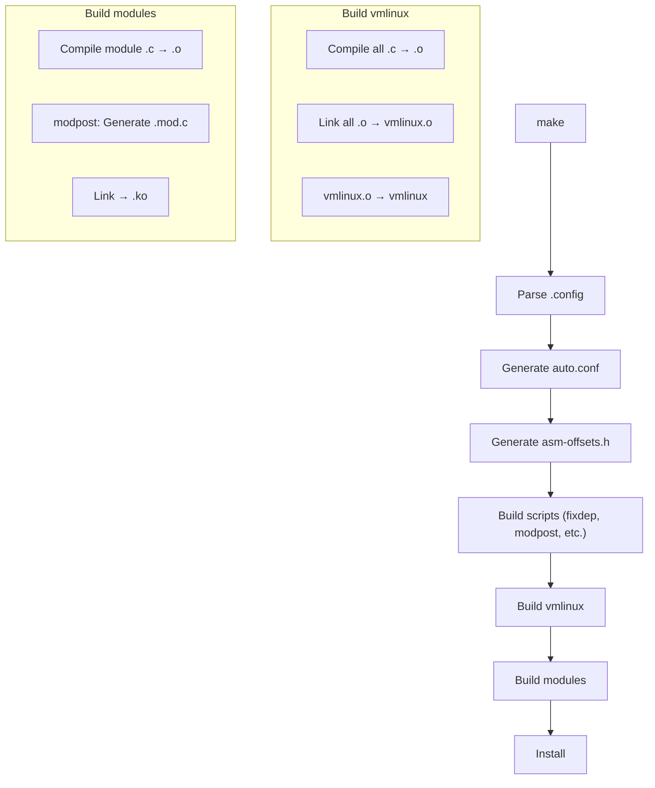
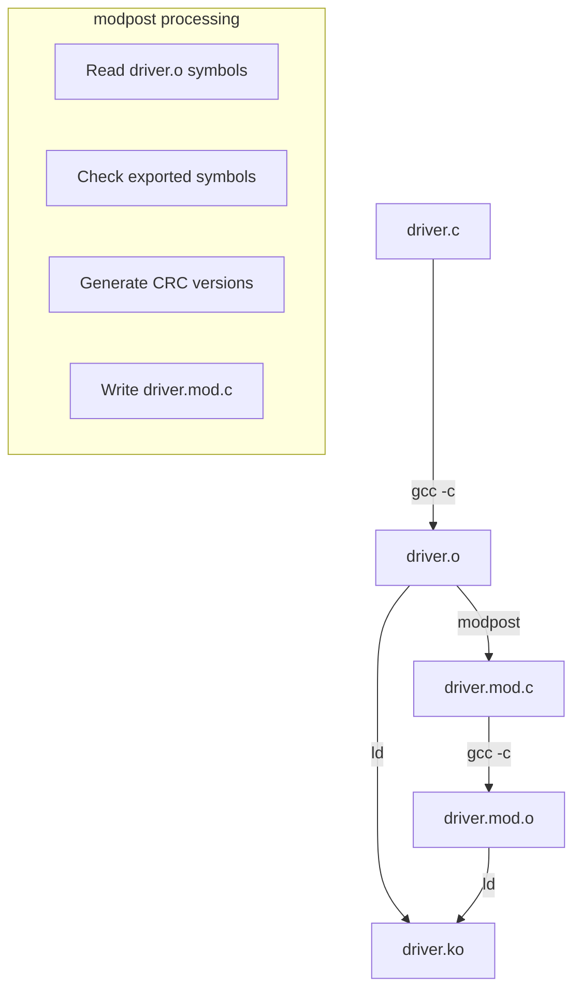
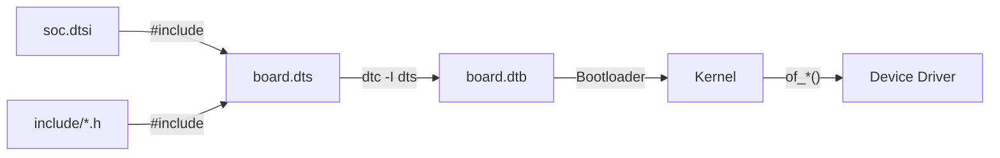

# Chapter 257: samples/ and scripts/ — Examples and Build Scripts: kconfig, checkpatch, modpost

## 1. Introduction and Intuition

The `samples/` and `scripts/` directories are the kernel's teaching and tooling infrastructure. `samples/` contains example code that demonstrates how to use various kernel APIs, while `scripts/` contains the build system, code quality tools, and helper scripts that make the kernel development process work.

### 1.1 Why These Directories Matter

- **samples/**: Learning by example is the most effective way to understand kernel APIs. These are working, tested examples that developers can use as templates.
- **scripts/**: The kernel's build system is one of the most sophisticated in the world. Understanding `scripts/` is understanding how the kernel is compiled, how configuration works, and how code quality is enforced.

---

## 2. Directory Layout

### 2.1 samples/

```
samples/
├── Kconfig
├── Makefile
│
├── accounting/
│   └── taskstats.c               # Task statistics example
│
├── bpf/
│   ├── xdp1.c                    # XDP (eXpress Data Path) example
│   ├── xdp2.c                    # XDP with redirect
│   ├── xdp_monitor.c             # XDP monitoring
│   ├── map_perf_test.c           # BPF map performance test
│   ├── sockex1.c                 # Socket filtering example
│   ├── sockex2.c                 # Advanced socket filtering
│   ├── trace_event.c             # BPF trace event example
│   ├── tracing.c                 # BPF tracing example
│   ├── hid/                      # BPF HID examples
│   └── ...
│
├── connector/
│   └── cn_test.c                 # Connector example
│
├── cgroup/
│   ├── cgroup_example.c          # Cgroup example
│   └── ...
│
├── ftrace/
│   └── ftrace-direct.c           # Direct ftrace example
│
├── hw_breakpoint/
│   └── data_breakpoint.c         # Hardware breakpoint example
│
├── kobject/
│   └── kobject-example.c         # Kobject/sysfs example
│
├── kprobes/
│   └── kprobe_example.c          # Kprobe example
│
├── landlock/
│   └── sandboxer.c               # Landlock sandbox example
│
├── livepatch/
│   └── livepatch-sample.c        # Live patching example
│
├── misc/
│   ├── pci_endpoint/             # PCI endpoint example
│   └── ...
│
├── qmi/
│   └── qmi_sample_client.c       # QMI client example
│
├── ras/
│   └── ras_example.c             # RAS (Reliability, Availability, Serviceability)
│
├── seccomp/
│   └── user-trap.c               # Seccomp example
│
├── timers/
│   ├── hrtimer_example.c         # High-resolution timer example
│   └── ...
│
├── vfio-mdev/
│   └── mtty.c                    # Mediated device example
│
├── v4l/                          # Video4Linux examples
├── watchdog/                     # Watchdog examples
└── ...
```

### 2.2 scripts/

```
scripts/
├── Makefile
├── Makefile.build                # Build rules for objects
├── Makefile.clean                # Clean rules
├── Makefile.dtbinst              # DTB installation
├── Makefile.extrawarn            # Extra warning flags
├── Makefile.host                 # Host program build rules
├── Makefile.lib                  # Build library functions
├── Makefile.modfinal             # Module final linking
├── Makefile.modinst              # Module installation
├│
├── Kconfig                       # Build system config
├
├ ├── Kconfig.include             # Kconfig include file
├│
├ ├── gen_compile_commands.py     # Generate compile_commands.json
├│
├── config                        # Config handling
├── confdata.c                    # Config data handling
├
├ -- kconfig/                     # *** Kconfig system ***
│   ├── Kconfig                   # Main Kconfig
│   ├── confdata.c                # Config data handling
│   ├── expr.c                    # Expression parser
│   ├── lexer.l                   # Lexer (flex)
│   ├── parser.y                  # Parser (bison)
│   ├── symbol.c                  # Symbol handling
│   ├── menu.c                    # Menu generation
│   ├── preprocess.c              # Preprocessor
│   ├── mconf.c                   # Menuconfig (ncurses)
│   ├── nconf.c                   # Nconfig (ncurses, newer)
│   ├── gconf.c                   # Gconfig (GTK)
│   ├── xconf.c                   # Xconfig (Qt)
│   └── ...
│
├── checkpatch.pl                 # *** Code style checker ***
├── cleanfile                      # File cleaning
├── cleanpatch                    # Patch cleaning
├
├-- dtc/                          # *** Device Tree Compiler ***
│   ├── dtc.c                     # Main compiler
│   ├── flattree.c                # Flattened DTB output
│   ├── livetree.c                # Live tree operations
│   ├── checks.c                  # Validation checks
│   ├── data.c                    # Data handling
│   ├── dtc-lexer.l               # Lexer
│   ├── dtc-parser.y              # Parser
│   └── ...
│
├── mod/                          # Module building
│   ├── empty.c                   # Empty module placeholder
│   └── ...
│
├-- modpost.c                     # *** Module post-processing ***
│
├── recordmcount.c                # Record mcount for ftrace
├── recordmcount.pl               # Perl version
│
├-- genksyms/                     # *** Symbol version generation ***
│   ├── genksyms.c                # Main symbol version generator
│   ├── lexer.l                   # Lexer
│   └── parser.y                  # Parser
│
├-- basic/                        # Basic build utilities
│   ├── fixdep.c                  # Dependency fixer
│   └── ...
│
├-- coccicheck                    # Coccinelle semantic patches
├-- coccinelle/                   # Coccinelle scripts
│   ├── api/                      # API migration scripts
│   ├── iterators/                # Iterator fixes
│   ├── locks/                    # Locking fixes
│   ├── misc/                     # Miscellaneous
│   └── ...
│
├-- sel-policy/                   # SELinux policy generation
│
├-- package/                      # Package building
│   ├── builddeb                  # Debian package builder
│   ├── buildrpm                  # RPM package builder
│   └── ...
│
├-- signing/                      # Module signing
│   ├── sign-file                 # Sign kernel modules
│   └── extract-cert              # Extract certificates
│
├-- decode_stacktrace.sh          # Decode kernel stack traces
├-- get_maintainer.pl             # Find maintainer for patches
├-- diffconfig                   # Compare .config files
├-- checkstack.pl                # Check stack usage
├-- objdiff                      # Compare object files
├-- gcc-version.sh               # Get GCC version
├── ld-version.sh               # Get linker version
│
├-- extract-vmlinux              # Extract vmlinux from bzImage
├-- headers_install.sh           # Install kernel headers
├── sortextable                  # Sort exception tables
├── unifdef                      # Remove #ifdefs
├── asn1_compiler                # ASN.1 grammar compiler
│
└── ...
```

---

## 3. Key Files and Subsystems

### 3.1 samples/bpf/ — BPF Examples

The BPF examples demonstrate the modern way to write kernel-extensible programs:

```c
// samples/bpf/xdp1.c
// XDP program that counts packets per IP protocol

#include <linux/bpf.h>
#include <bpf/bpf_helpers.h>

struct {
    __uint(type, BPF_MAP_TYPE_ARRAY);
    __uint(max_entries, 256);
    __type(key, __u32);
    __type(value, long);
} rxcnt SEC(".maps");

SEC("xdp")
int xdp_prog1(struct xdp_md *ctx)
{
    void *data_end = (void *)(long)ctx->data_end;
    void *data = (void *)(long)ctx->data;
    struct ethhdr *eth = data;
    __u16 h_proto;
    __u32 key;
    long *value;
    
    /* Parse Ethernet header */
    if (data + sizeof(*eth) > data_end)
        return XDP_DROP;
    
    h_proto = eth->h_proto;
    
    /* Count by protocol */
    key = bpf_ntohs(h_proto);
    value = bpf_map_lookup_elem(&rxcnt, &key);
    if (value)
        __sync_fetch_and_add(value, 1);
    
    return XDP_PASS;
}

char _license[] SEC("license") = "GPL";
```

### 3.2 samples/kobject/ — Kobject Example

```c
// samples/kobject/kobject-example.c
#include <linux/kobject.h>
#include <linux/sysfs.h>
#include <linux/module.h>

static int my_value = 0;

static ssize_t my_value_show(struct kobject *kobj,
                              struct kobj_attribute *attr, char *buf)
{
    return sprintf(buf, "%d\n", my_value);
}

static ssize_t my_value_store(struct kobject *kobj,
                               struct kobj_attribute *attr,
                               const char *buf, size_t count)
{
    int ret;
    
    ret = kstrtoint(buf, 10, &my_value);
    if (ret < 0)
        return ret;
    
    return count;
}

static struct kobj_attribute my_value_attribute =
    __ATTR(value, 0660, my_value_show, my_value_store);

static struct attribute *attrs[] = {
    &my_value_attribute.attr,
    NULL,
};

static struct attribute_group attr_group = {
    .attrs = attrs,
};

static struct kobject *my_kobj;

static int __init my_init(void)
{
    int ret;
    
    my_kobj = kobject_create_and_add("my_module", kernel_kobj);
    if (!my_kobj)
        return -ENOMEM;
    
    ret = sysfs_create_group(my_kobj, &attr_group);
    if (ret)
        kobject_put(my_kobj);
    
    return ret;
}

static void __exit my_exit(void)
{
    kobject_put(my_kobj);
}

module_init(my_init);
module_exit(my_exit);
MODULE_LICENSE("GPL");
```

### 3.3 samples/livepatch/ — Live Patching

```c
// samples/livepatch/livepatch-sample.c
#include <linux/module.h>
#include <linux/kernel.h>
#include <linux/livepatch.h>

/* Original function */
static int new_cmdline_proc_show(struct seq_file *m, void *v)
{
    seq_printf(m, "%s\n", "This has been live patched!");
    return 0;
}

static struct klp_func funcs[] = {
    {
        .old_name = "cmdline_proc_show",
        .new_func = new_cmdline_proc_show,
    },
    { }
};

static struct klp_object objs[] = {
    {
        .name = NULL,  /* vmlinux */
        .funcs = funcs,
    },
    { }
};

static struct klp_patch patch = {
    .mod = THIS_MODULE,
    .objs = objs,
};

static int __init livepatch_init(void)
{
    return klp_enable_patch(&patch);
}

static void __exit livepatch_exit(void)
{
    /* Patch is reverted when module is unloaded */
}

module_init(livepatch_init);
module_exit(livepatch_exit);
MODULE_LICENSE("GPL");
```

### 3.4 scripts/checkpatch.pl — Code Style Checker

`checkpatch.pl` enforces the kernel coding style:

```bash
# Check a patch
scripts/checkpatch.pl my-patch.patch

# Check a file
scripts/checkpatch.pl --file drivers/net/ethernet/intel/e1000e/netdev.c

# Strict mode
scripts/checkpatch.pl --strict my-patch.patch

# Check with tree
scripts/checkpatch.pl --tree my-patch.patch
```

Common checks:
- Line length (80 characters preferred, 100 max)
- Indentation (tabs, not spaces)
- Brace placement
- Comment style
- Function documentation
- Commit message format
- Trailing whitespace
- Blank lines

### 3.5 scripts/kconfig/ — Configuration System

The Kconfig system manages kernel configuration:

#### 3.5.1 Kconfig Language

```kconfig
# Kconfig example
config E1000E
    tristate "Intel(R) PRO/1000 PCI-Express Gigabit Ethernet support"
    depends on PCI && NET
    select PHYLIB
    select INTEL_MEI if ACPI
    help
      This driver supports the Intel PRO/1000 PCI-Express family
      of Gigabit Ethernet adapters.
      
      For general information and support, go to the Intel support
      website at: http://support.intel.com
      
      To compile this driver as a module, choose M here. The module
      will be called e1000e.
```

#### 3.5.2 Kconfig Syntax

| Keyword | Purpose |
|---------|---------|
| `config` | Define a configuration symbol |
| `menuconfig` | Config with a submenu |
| `choice` | Mutually exclusive options |
| `comment` | Help text |
| `depends on` | Dependencies |
| `select` | Force-enable another symbol |
| `imply` | Suggest another symbol |
| `default` | Default value |
| `range` | Value range |
| `help` | Multi-line help text |
| `if` | Conditional block |
| `source` | Include another Kconfig |

#### 3.5.3 The .config File

```bash
# Generate .config
make defconfig           # Default config
make menuconfig          # Interactive menu
make oldconfig           # Update existing .config
make allyesconfig        # Enable everything
make allnoconfig         # Disable everything
make tinyconfig          # Minimal config
make randconfig          # Random config
```

### 3.6 scripts/modpost.c — Module Post-Processing

`modpost` is run after compiling module objects to:
1. Generate the `modules.order` file
2. Create `Module.symvers` (exported symbol versions)
3. Validate module dependencies
4. Generate `*.mod.c` files with module info

```c
// scripts/modpost.c
int main(int argc, char **argv)
{
    struct module *mod;
    
    /* Parse command line */
    /* ... */
    
    /* Read all module objects */
    for (i = 0; i < argc; i++)
        read_symbols(argv[i]);
    
    /* Check for undefined symbols */
    check_exports();
    
    /* Generate Module.symvers */
    write_dump();
    
    /* Generate .mod.c files */
    for (mod = modules; mod; mod = mod->next)
        add_header(mod);
    
    return 0;
}
```

### 3.7 scripts/genksyms/ — Symbol Version Generation

`genksyms` generates CRC checksums for exported symbols:

```c
// Exported symbol with version
EXPORT_SYMBOL(my_function);
// Generates: my_function_<CRC> in Module.symvers
```

The CRC changes when the function signature or data structures change, ensuring module compatibility.

### 3.8 scripts/dtc/ — Device Tree Compiler

The Device Tree Compiler compiles `.dts` (source) files to `.dtb` (binary) files:

```bash
# Compile DTS to DTB
scripts/dtc/dtc -I dts -O dtb -o output.dtb input.dts

# Decompile DTB to DTS
scripts/dtc/dtc -I dtb -O dts -o output.dts input.dtb

# Validate
scripts/dtc/dtc -I dts -O dtb -o /dev/null -v input.dts
```

### 3.9 scripts/decode_stacktrace.sh

Decodes kernel stack traces to show file names and line numbers:

```bash
# Usage
dmesg | scripts/decode_stacktrace.sh vmlinux

# Example output:
# [  123.456] BUG: unable to handle kernel NULL pointer dereference
# [  123.456] RIP: 0010:my_function+0x42/0x100 (drivers/my/my_driver.c:123)
```

---

## 4. Build System Walkthrough

### 4.1 Top-Level Makefile Flow



### 4.2 Kbuild Rules

```makefile
# In drivers/net/ethernet/intel/e1000e/Makefile
obj-$(CONFIG_E1000E) += e1000e.o

e1000e-objs := 82571.o \
               ethtool.o \
               hw.o \
               ich8lan.o \
               mac.o \
               manage.o \
               netdev.o \
               nvm.o \
               phy.o \
               ptp.o \
               param.o
```

### 4.3 Compilation Database

```bash
# Generate compile_commands.json for IDE support
scripts/gen_compile_commands.py

# Now editors like VS Code, CLion, etc. can understand the codebase
```

---

## 5. Diagrams

### 5.1 Kconfig Processing Flow

```mermaid
sequenceDiagram
    USER as Developer
    MCONF as menuconfig (ncurses)
    PARSER as Kconfig Parser
    SYMBOL as Symbol Manager
    CONFIG as .config
    
    USER->>MCONF: make menuconfig
    MCONF->>PARSER: Parse all Kconfig files
    PARSER->>SYMBOL: Build symbol table
    SYMBOL->>MCONF: Generate menu structure
    MCONF->>USER: Display menus
    USER->>MCONF: Change options
    MCONF->>SYMBOL: Update symbols
    SYMBOL->>CONFIG: Write .config
    CONFIG->>USER: Config saved
```

### 5.2 Module Build Flow



### 5.3 Device Tree Compilation



---

## 6. Relationships with Other Subsystems

### 6.1 samples/ ↔ Documentation/

- Samples complement documentation with working code
- `Documentation/process/coding-style.rst` is enforced by `checkpatch.pl`
- Each sample usually has a `README` explaining how to use it

### 6.2 scripts/ ↔ Build System

- `scripts/Makefile.*` files are included by the top-level Makefile
- `scripts/kconfig/` handles all configuration
- `scripts/mod/` handles module linking

### 6.3 scripts/ ↔ drivers/

- `scripts/dtc/` compiles Device Tree files used by drivers
- `scripts/genksyms/` versions exported symbols
- `scripts/modpost.c` validates module dependencies

### 6.4 scripts/ ↔ Documentation/

- `scripts/get_maintainer.pl` reads `MAINTAINERS` file
- `scripts/kernel-doc` extracts documentation from source comments
- `scripts/coccicheck` runs semantic patches for code quality

---

## 7. Advanced Topics

### 7.1 Coccinelle Semantic Patches

Coccinelle is a tool for automated code transformation:

```cocci
// scripts/coccinelle/api/kstrdup.cocci
// Find kmalloc+strcpy patterns and suggest kstrdup

@@
expression src, size;
expression flags;
fresh identifier res = "__res";
@@

- res = kmalloc(strlen(src) + 1, flags);
- if (res == NULL) { ... }
- strcpy(res, src);
+ res = kstrdup(src, flags);
```

### 7.2 Module Signing

```bash
# Enable module signing in config
CONFIG_MODULE_SIG=y
CONFIG_MODULE_SIG_SHA256=y

# Sign modules during build
scripts/sign-file sha256 signing_key.priv signing_key.x509 module.ko
```

### 7.3 Stack Usage Analysis

```bash
# Check for stack-heavy functions
scripts/checkstack.pl

# Output:
# 0x00000042 my_function:     w  0x400 (1024 bytes)
# (Function my_function uses 1024 bytes of stack)
```

---

## 8. References

1. **Linux Kernel Source**: `samples/`, `scripts/` directories
2. **Documentation**: `Documentation/kbuild/`
3. **"Linux Kernel in a Nutshell"** — Greg Kroah-Hartman
4. **"Linux Device Drivers, 3rd Edition"** — Corbet, Rubini, Kroah-Hartman
5. **Kconfig documentation**: `Documentation/kbuild/kconfig-language.rst`
6. **BPF documentation**: `Documentation/bpf/`
7. **Device Tree documentation**: `Documentation/devicetree/`
8. **Coccinelle**: coccinelle.lip6.fr
9. **LWN.net**: Various build system and tooling articles
