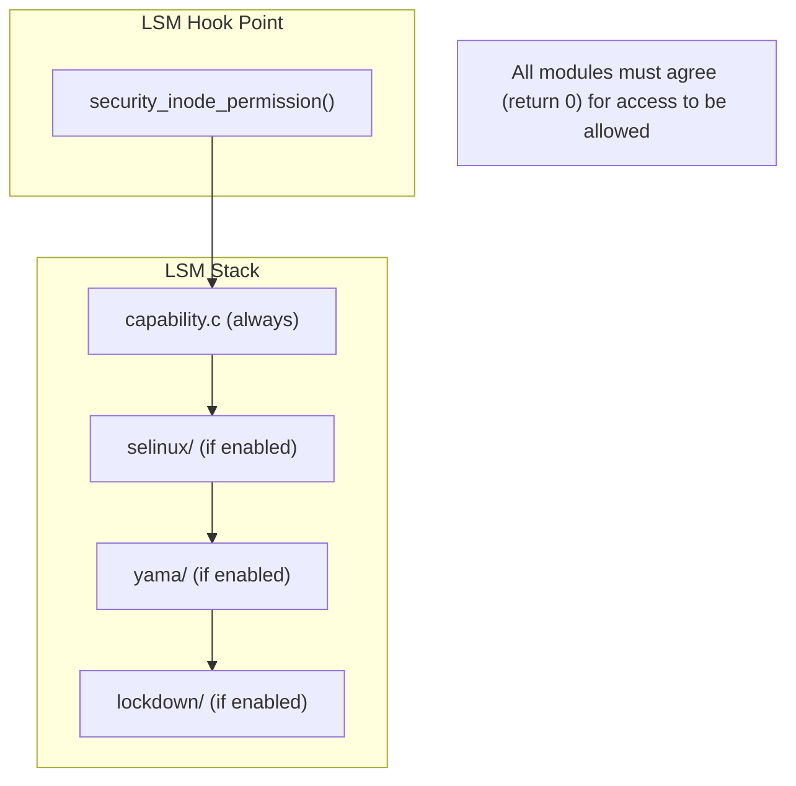
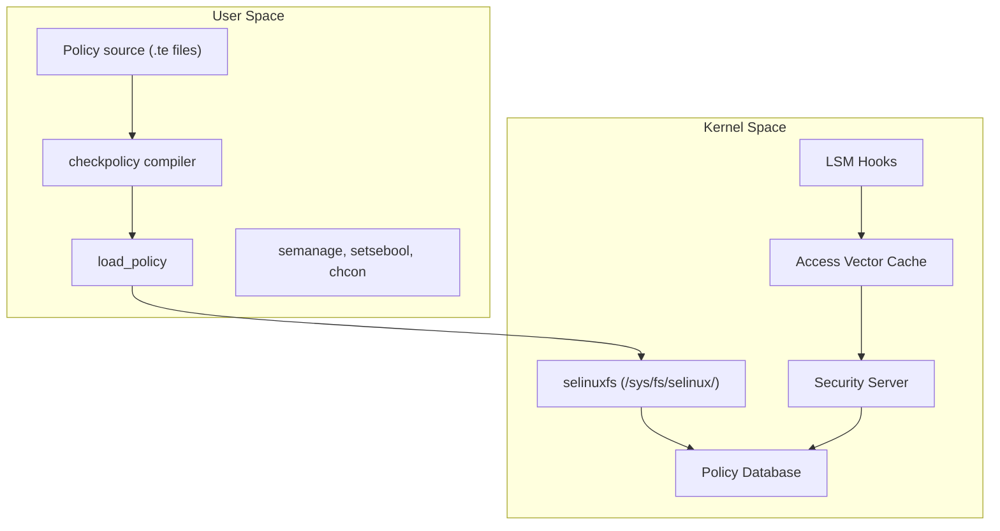
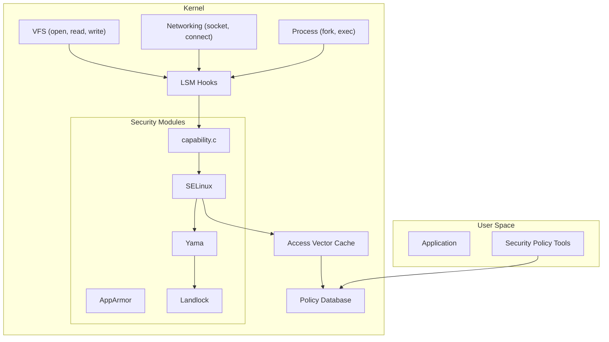

# Chapter 258: security/ — Security Frameworks: SELinux, AppArmor, Capabilities, LSM Framework

## 1. Introduction and Intuition

The `security/` directory implements the Linux kernel's security infrastructure. At its center is the Linux Security Module (LSM) framework — a set of hooks that allow security modules to mediate access to kernel objects. On top of LSM, the kernel provides several security implementations: SELinux (used by Red Hat/Fedora), AppArmor (used by Ubuntu/SUSE), Smack, TOMOYO, and others.

### 1.1 The Security Problem

The kernel must enforce security policies that answer questions like:
- Can process X read file Y?
- Can process X send a network packet to address Z?
- Can process X load a kernel module?
- Can process X access another process's memory?

Traditional Unix permissions (user/group/other) are too coarse for modern security needs. LSM provides a way to enforce fine-grained mandatory access control.

### 1.2 Design Philosophy

The LSM framework is designed with several principles:
1. **Minimal overhead**: Hooks are placed at critical points but don't slow down operations when no module is active
2. **Stacking**: Multiple LSM modules can be active simultaneously
3. **Mediation**: Every security-relevant operation passes through LSM hooks
4. **Transparency**: User-space tools can query security decisions

---

## 2. Directory Layout

```
security/
├── Makefile
├── Kconfig
│
├── security.c              # *** LSM framework core ***
│
├── lsm_audit.c             # LSM audit infrastructure
├── lsm_hooks.c             # LSM hook management
├── lsm_init.c              # LSM initialization
├
├── commoncap.c             # *** POSIX capabilities ***
├── capability.c            # Capability LSM module
│
├── selinux/                # *** SELinux ***
│   ├── hooks.c             # SELinux LSM hooks
│   ├── avc.c               # Access Vector Cache
│   ├── avc_ss.c            # AVC security server interface
│   ├── ss/                 # Security server
│   │   ├── services.c      # Policy services
│   │   ├── policydb.c      # Policy database
│   │   ├── context.c       # Security contexts
│   │   ├── conditional.c   # Conditional policy
│   │   ├── constraint.c    # Constraints
│   │   └── ...
│   ├── xfrm.c              # IPsec labeling
│   ├── netif.c             # Network interface labeling
│   ├── netlink.c           # Netlink labeling
│   ├── netnode.c           # Network node labeling
│   ├── netport.c           # Network port labeling
│   ├── nlmsgtab.c          # Netlink message tables
│   ├── exports.c           # Exported symbols
│   ├── selinuxfs.c         # /sys/fs/selinux/ filesystem
│   ├── inode.c             # Inode labeling
│   ├── file.c              # File operations
│   ├── task.c              # Task operations
│   ├── process.c           # Process labeling
│   ├── transition.c        # Domain transitions
│   └── ...
│
├── apparmor/               # *** AppArmor ***
│   ├── lsm.c               # AppArmor LSM hooks
│   ├── apparmorfs.c        # /sys/kernel/security/apparmor/
│   ├── domain.c            # Profile transitions
│   ├── file.c              # File operations
│   ├── ipc.c               # IPC mediation
│   ├── lib.c               # Library functions
│   ├── match.c             # Path matching
│   ├── mount.c             # Mount mediation
│   ├── net.c               # Network mediation
│   ├── policy.c            # Policy management
│   ├── policy_ns.c         # Policy namespaces
│   ├── procattr.c          # Process attributes
│   ├── resource.c          # Resource limits
│   ├── secid.c             # Security IDs
│   ├── capability.c        # Capability mediation
│   ├── cred.c              # Credential mediation
│   ├── af_unix.c           # Unix socket mediation
│   └── ...
│
├── smack/                  # *** Smack ***
│   ├── smack_lsm.c         # Smack LSM hooks
│   ├── smack_access.c      # Access control
│   ├── smackfs.c           # /sys/fs/smackfs/
│   └── ...
│
├── tomoyo/                 # *** TOMOYO ***
│   ├── tomoyo.c            # TOMOYO LSM hooks
│   ├── common.c            # Common functions
│   ├── domain.c            # Domain management
│   ├── file.c              # File operations
│   ├── network.c           # Network mediation
│   └── ...
│
├── yama/                   # *** Yama (ptrace restrictions) ***
│   └── yama_lsm.c
│
├── loadpin/                # *** LoadPin (restrict kernel loading) ***
│   └── loadpin.c
│
├── safesetid/              # *** SafeSetID ***
│   └── safesetid.c
│
├── lockdown/               # *** Lockdown (restrict kernel features) ***
│   └── lockdown.c
│
├── landlock/               # *** Landlock (sandboxing) ***
│   ├── setup.c
│   ├── fs.c                # Filesystem restrictions
│   ├── net.c               # Network restrictions
│   └── ...
│
├── keys/                   # *** Kernel key management ***
│   ├── key.c               # Key management core
│   ├── keyring.c           # Keyrings
│   ├── keyctl.c            # keyctl() syscall
│   ├── proc.c              # /proc/keys
│   ├── encrypted-keys.c    # Encrypted keys
│   ├── trusted-keys.c      # Trusted keys (TPM)
│   ├── user_defined.c      # User-defined keys
│   └── asymmetric_type.c   # Asymmetric keys
│
├── integrity/              # *** Integrity Measurement Architecture ***
│   ├── ima/                # IMA (Integrity Measurement Architecture)
│   │   ├── ima_api.c       # IMA API
│   │   ├── ima_policy.c    # IMA policy
│   │   ├── ima_main.c      # IMA core
│   │   ├── ima_fs.c        # IMA filesystem
│   │   └── ...
│   ├── evm/                # EVM (Extended Verification Module)
│   │   ├── evm_main.c      # EVM core
│   │   ├── evm_crypto.c    # EVM crypto operations
│   │   └── ...
│   └── ...
│
├── tpm/                    # *** TPM (Trusted Platform Module) ***
│   ├── tpm-interface.c     # TPM interface
│   ├── tpm-chip.c          # TPM chip management
│   ├── tpm-dev-common.c    # TPM device (/dev/tpm*)
│   ├── tpm2-cmds.c         # TPM 2.0 commands
│   ├── tpm-tpm1.c          # TPM 1.x commands
│   └── ...
│
└── ...
```

---

## 3. LSM Framework (security.c)

### 3.1 LSM Hook Structure

```c
// include/linux/lsm_hooks.h
struct security_hook_list {
    struct hlist_node list;
    struct hlist_head *head;
    union security_list_options hook;
    const struct lsm_id *lsmid;
};

struct security_hook_heads {
    struct hlist_head binder_set_context_mgr;
    struct hlist_head binder_transaction;
    struct hlist_head ptrace_access_check;
    struct hlist_head ptrace_traceme;
    struct hlist_head capget;
    struct hlist_head capset;
    struct hlist_head capable;
    struct hlist_head quotactl;
    struct hlist_head quota_on;
    struct hlist_head syslog;
    struct hlist_head settime;
    struct hlist_head vm_enough_memory;
    struct hlist_head bprm_creds_from_file;
    struct hlist_head bprm_committing_creds;
    struct hlist_head bprm_committed_creds;
    struct hlist_head fs_context_dup;
    struct hsbinder_set_context_mgr;
    struct hlist_head inode_permission;
    struct hlist_head inode_getattr;
    struct hlist_head inode_setattr;
    struct hlist_head inode_getxattr;
    struct hlist_head inode_setxattr;
    struct hlist_head inode_listxattr;
    struct hlist_head inode_removexattr;
    struct hlist_head file_permission;
    struct hlist_head file_ioctl;
    struct hlist_head mmap_file;
    struct hlist_head mmap_addr;
    struct hlist_head file_mprotect;
    struct hlist_head task_alloc;
    struct hlist_head task_free;
    struct hlist_head cred_alloc_blank;
    struct hlist_head cred_free;
    struct hlist_head cred_prepare;
    struct hlist_head cred_transfer;
    struct hlist_head kernel_act_as;
    struct hlist_head kernel_create_files_as;
    struct hlist_head task_setnice;
    struct hlist_head task_setioprio;
    struct hlist_head task_getioprio;
    struct hlist_head task_prlimit;
    struct hlist_head task_setrlimit;
    struct hlist_head task_setscheduler;
    struct hlist_head task_getscheduler;
    struct hlist_head task_kill;
    struct hsbinder_set_context_mgr;
    struct hlist_head socket_create;
    struct hlist_head socket_bind;
    struct hlist_head socket_connect;
    struct hlist_head socket_sendmsg;
    struct hlist_head socket_recvmsg;
    struct hlist_head socket_getsockname;
    struct hlist_head socket_getpeername;
    struct hlist_head socket_setsockopt;
    struct hlist_head socket_getsockopt;
    struct hlist_head socket_shutdown;
    struct hlist_head socket_sock_rcv_skb;
    struct hlist_head sk_alloc_security;
    struct hlist_head sk_free_security;
    struct hlist_head req_classify_flow;
    struct hlist_head tun_dev_create;
    struct hlist_head tun_dev_attach_queue;
    struct hlist_head tun_dev_open;
    struct hlist_head ib_pkey_access;
    struct hlist_head ib_endport_manage_subnet;
    struct hlist_head xfrm_policy_lookup_security;
    struct hlist_head xfrm_state_pol_flow_match;
    struct hlist_head key_alloc;
    struct hlist_head key_free;
    struct hlist_head key_permission;
    struct hlist_head audit_rule_init;
    struct hlist_head audit_rule_known;
    struct hlist_head audit_rule_match;
    struct hlist_head audit_rule_free;
    struct hlist_head bpf;
    struct hlist_head bpf_map;
    struct hlist_head bpf_prog;
    struct hlist_head bpf_map_alloc_security;
    struct hlist_head bpf_map_free_security;
    struct hlist_head locked_down;
};
```

### 3.2 Hook Registration

```c
// security/security.c
void security_add_hooks(struct security_hook_list *hooks, int count,
                        const struct lsm_id *lsmid)
{
    int i;
    
    for (i = 0; i < count; i++) {
        hooks[i].lsmid = lsmid;
        hlist_add_tail_rcu(&hooks[i].list, hooks[i].head);
    }
}
```

### 3.3 Security Hook Calling

```c
// include/linux/security.h
static inline int security_inode_permission(struct inode *inode, int mask)
{
    if (unlikely(IS_PRIVATE(inode)))
        return 0;
    return call_int_hook(inode_permission, inode, mask);
}

#define call_int_hook(FUNC, ...) ({                         \
    int RC = 0;                                             \
    struct security_hook_list *P;                           \
    hlist_for_each_entry(P, &security_hook_heads.FUNC, list) { \
        RC = P->hook.FUNC(__VA_ARGS__);                    \
        if (RC != 0)                                        \
            break;                                          \
    }                                                       \
    RC;                                                     \
})
```

### 3.4 Stacking LSMs

Modern kernels support stacking multiple LSM modules:



---

## 4. SELinux (security/selinux/)

### 4.1 Architecture



### 4.2 Access Vector Cache (AVC)

```c
// security/selinux/avc.c
struct avc_entry {
    u32 ssid;               /* Source security ID */
    u32 tsid;               /* Target security ID */
    u16 tclass;             /* Object class */
    struct av_decision avd; /* Decision */
    /* ... */
};

struct avc_node {
    struct avc_entry ae;
    struct hlist_node list; /* Hash table collision chain */
    struct rcu_head rhead;
};

/* Lookup cached decision */
static struct avc_node *avc_lookup(u32 ssid, u32 tsid, u16 tclass)
{
    struct avc_node *node;
    
    hash = avc_hash(ssid, tsid, tclass);
    hlist_for_each_entry_rcu(node, &avc_slots[hash], list) {
        if (node->ae.ssid == ssid &&
            node->ae.tsid == tsid &&
            node->ae.tclass == tclass)
            return node;
    }
    
    return NULL;
}
```

### 4.3 Security Context Labels

Every object in SELinux has a security context label:

```
user:role:type:level

Example: system_u:system_r:httpd_t:s0
```

| Component | Purpose |
|-----------|---------|
| **user** | SELinux user identity |
| **role** | Role in RBAC |
| **type** | Type (most important for TE) |
| **level** | MLS/MCS level |

### 4.4 SELinux Policy Rules

```
# Type Enforcement rules
allow httpd_t httpd_sys_content_t:file { read open getattr };
allow httpd_t http_port_t:tcp_socket { name_bind };

# Domain transitions
domain_auto_trans(init_t, httpd_exec_t, httpd_t)

# Booleans
bool httpd_enable_homedirs false;
```

---

## 5. AppArmor (security/apparmor/)

### 5.1 Profile-Based Security

AppArmor uses path-based profiles:

```
# /etc/apparmor.d/usr.sbin.apache2
/usr/sbin/apache2 {
    #include <abstractions/apache2-common>
    
    /var/www/** r,
    /var/log/apache2/** rw,
    /etc/apache2/** r,
    
    network inet stream,
    network inet dgram,
    
    signal (send) set=(term, kill) peer=/usr/sbin/apache2,
}
```

### 5.2 AppArmor LSM Hooks

```c
// security/apparmor/lsm.c
static int apparmor_inode_permission(struct inode *inode, int mask)
{
    struct aa_profile *profile;
    struct path_cond cond = {
        .uid = inode->i_uid,
        .mode = inode->i_mode,
    };
    
    if (!unconfined(profile))
        return aa_path_perm(OP_ACCESS, profile, &path, 0,
                            mask_to_perms(mask, inode->i_mode), &cond);
    
    return 0;
}

static int apparmor_file_open(struct file *file)
{
    struct aa_profile *profile;
    struct path_cond cond = {
        .uid = file_inode(file)->i_uid,
        .mode = file_inode(file)->i_mode,
    };
    
    if (!unconfined(profile))
        return aa_path_perm(OP_OPEN, profile, &file->f_path, 0,
                            aa_map_file_to_perms(file), &cond);
    
    return 0;
}
```

---

## 6. POSIX Capabilities (commoncap.c)

### 6.1 Capability System

```c
// include/uapi/linux/capability.h
#define CAP_CHOWN            0  /* Change file ownership */
#define CAP_DAC_OVERRIDE     1  /* Bypass file permission checks */
#define CAP_DAC_READ_SEARCH  2  /* Bypass read permission checks */
#define CAP_FOWNER           3  /* Bypass permission checks on operations that change file owner */
#define CAP_FSETID           4  /* Set file sticky bit */
#define CAP_KILL             5  /* Send signals to processes */
#define CAP_SETGID           6  /* Set group ID */
#define CAP_SETUID           7  /* Set user ID */
#define CAP_SETPCAP          8  /* Modify capability sets */
#define CAP_LINUX_IMMUTABLE  9  /* Set immutable flags */
#define CAP_NET_BIND_SERVICE 10 /* Bind to privileged ports */
#define CAP_NET_BROADCAST    11 /* Broadcast */
#define CAP_NET_ADMIN        12 /* Network administration */
#define CAP_NET_RAW          13 /* Use raw sockets */
#define CAP_IPC_LOCK         14 /* Lock memory */
#define CAP_IPC_OWNER        15 /* Bypass IPC permission checks */
#define CAP_SYS_MODULE       16 /* Load kernel modules */
#define CAP_SYS_RAWIO        17 /* Perform I/O port operations */
#define CAP_SYS_CHROOT       18 /* chroot() */
#define CAP_SYS_PTRACE       19 /* ptrace() any process */
#define CAP_SYS_ADMIN        20 /* Many admin operations */
#define CAP_SYS_BOOT         21 /* Reboot() */
#define CAP_SYS_NICE         22 /* Change priority */
#define CAP_SYS_RESOURCE     23 /* Override resource limits */
#define CAP_SYS_TIME         24 /* Set system clock */
#define CAP_SYS_TTY_CONFIG   25 /* Configure TTY */
#define CAP_MKNOD            26 /* Create device nodes */
#define CAP_LEASE            27 /* File leases */
#define CAP_AUDIT_WRITE      28 /* Write audit log */
#define CAP_AUDIT_CONTROL    29 /* Configure audit */
#define CAP_SETFCAP          30 /* Set file capabilities */
#define CAP_MAC_OVERRIDE     31 /* Override MAC */
#define CAP_MAC_ADMIN        32 /* Configure MAC */
#define CAP_SYSLOG           33 /* Use syslog() */
#define CAP_WAKE_ALARM       34 /* Use wake alarms */
#define CAP_BLOCK_SUSPEND    35 /* Block system suspend */
#define CAP_AUDIT_READ       36 /* Read audit log */
#define CAP_PERFMON          37 /* Use perf */
#define CAP_BPF              38 /* Use BPF */
#define CAP_CHECKPOINT_RESTORE 39 /* Checkpoint/restore */
#define CAP_LAST_CAP         CAP_CHECKPOINT_RESTORE
```

### 6.2 Capability Checking

```c
// security/commoncap.c
int cap_capable(const struct cred *cred, struct user_namespace *targ_ns,
               int cap, unsigned int opts)
{
    struct user_namespace *ns = targ_ns;
    
    /* Walk up the user namespace hierarchy */
    for (;;) {
        if (ns == &init_user_ns)
            return cap_raised(cred->cap_effective, cap) ? 0 : -EPERM;
        
        if (ns == cred->user_ns)
            return cap_raised(cred->cap_effective, cap) ? 0 : -EPERM;
        
        /* Check if we have the capability in the parent namespace */
        ns = ns->parent;
    }
}
```

---

## 7. Landlock (security/landlock/)

Landlock is a modern, unprivileged sandboxing framework:

```c
// security/landlock/fs.c
static int current_check_access(struct path *const path,
                                 const access_mask_t access_request)
{
    struct landlock_ruleset *dom;
    struct access_mask_t handled_access;
    
    dom = landlock_get_current_domain();
    
    /* Check if the access is allowed */
    handled_access = landlock_get_handled_access(dom);
    
    if ((access_request & handled_access) != access_request)
        return -EACCES;
    
    /* Check against rules */
    return landlock_check_access(dom, path, access_request);
}
```

---

## 8. Key Management (security/keys/)

```c
// security/keys/key.c
struct key {
    refcount_t              usage;
    key_serial_t            serial;         /* Key serial number */
    union {
        struct list_head graveyard_link;
        struct rb_node serial_node;
    };
    struct rw_semaphore     sem;
    struct key_user         *user;
    void                    *security;
    
    /* Key type operations */
    union {
        unsigned long expiry;
        time64_t revoked_at;
    };
    time64_t                last_used_at;
    kuid_t                  uid;
    kgid_t                  gid;
    key_perm_t              perm;
    unsigned short          quotalen;
    unsigned short          datalen;
    unsigned long           flags;
    
    char                    *description;
    union key_payload       payload;
    
    const struct key_type   *type;
};
```

---

## 9. Diagrams

### 9.1 LSM Framework Architecture



### 9.2 SELinux Access Check

```mermaid
sequenceDiagram
    PROC as Process (httpd_t)
    VFS as VFS
    SELINUX as SELinux
    AVC as AVC Cache
    SS as Security Server
    POLICY as Policy DB
    
    PROC->>VFS: open("/var/www/index.html")
    VFS->>SELINUX: security_file_open()
    SELINUX->>AVC: avc_has_perm(httpd_t, httpd_content_t, FILE__READ)
    
    alt Cache hit
        AVC-->>SELINUX: Cached decision (ALLOW)
    else Cache miss
        AVC->>SS: security_compute_av()
        SS->>POLICY: Look up rules
        POLICY-->>SS: Decision
        SS-->>AVC: Cache decision
        AVC-->>SELINUX: Decision
    end
    
    SELINUX-->>VFS: 0 (allow) or -EACCES (deny)
    VFS--PROC: File descriptor or error
```

---

## 10. References

1. **Linux Kernel Source**: `security/` directory
2. **Documentation**: `Documentation/security/`
3. **"SELinux System Administration, 2nd Edition"** — Sven Vermeulen
4. **"Linux Security Cookbook"** — Bauer
5. **SELinux Project**: selinuxproject.org
6. **AppArmor Wiki**: wiki.apparmor.net
7. **Landlock Documentation**: `Documentation/security/landlock.rst`
8. **LSM Documentation**: `Documentation/security/lsm-development.rst`
9. **LWN.net**: Various LSM and security articles
10. **NIST SP 800-53**: Security controls reference
