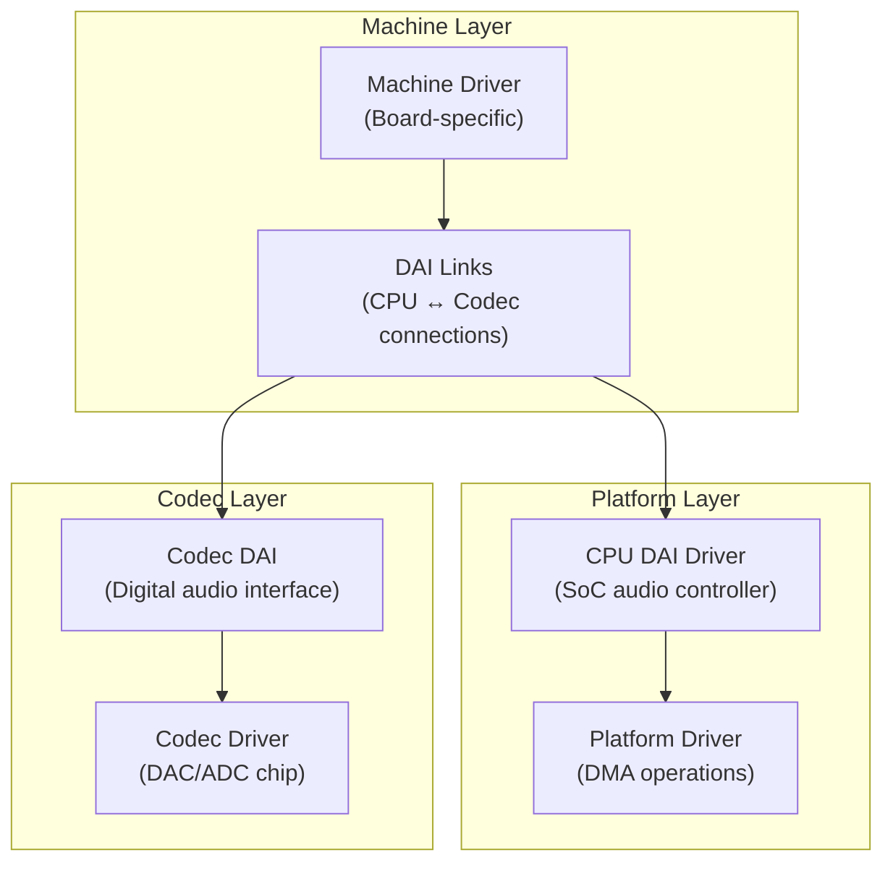
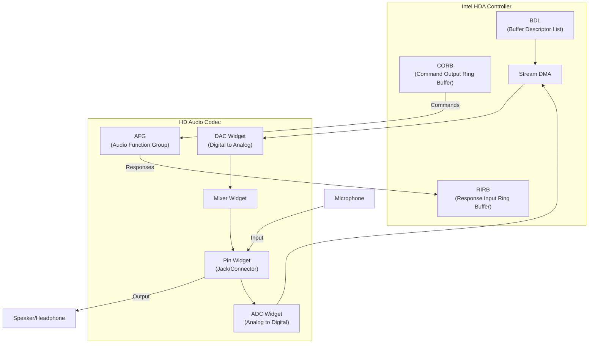
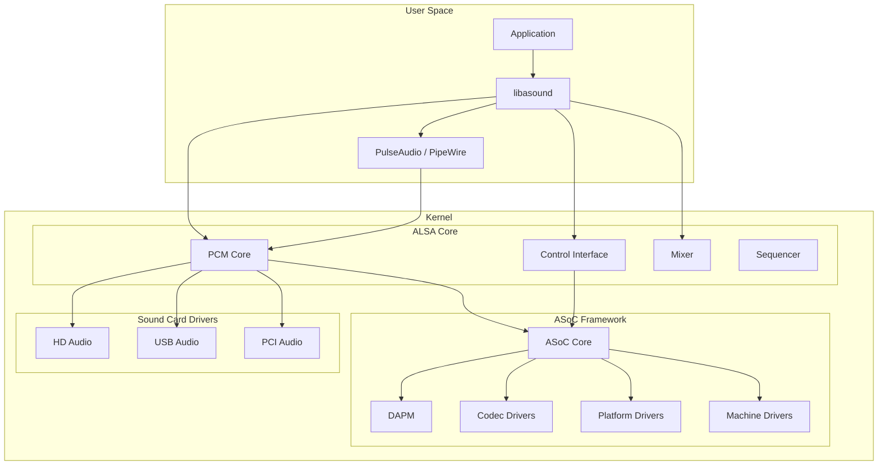

# Chapter 259: sound/ — Audio Subsystem: ALSA, ASoC, Codec Drivers, PCM Handling

## 1. Introduction and Intuition

The `sound/` directory implements the Linux audio subsystem, centered around ALSA (Advanced Linux Sound Architecture). ALSA provides a comprehensive framework for audio devices, from simple embedded speakers to professional multi-channel recording interfaces. On top of ALSA, the ASoC (ALSA System on Chip) framework provides a modular architecture for embedded audio systems.

### 1.1 ALSA Architecture

ALSA provides:
- **PCM (Pulse Code Modulation)**: Digital audio streaming
- **Mixer**: Volume and routing control
- **Sequencer**: MIDI and event sequencing
- **Control**: Device management and configuration
- **Raw MIDI**: Direct MIDI access
- **Timer**: High-resolution timing for audio

### 1.2 Why ASoC?

Embedded audio systems (phones, tablets, IoT devices) have a three-part architecture:
1. **CPU DAI** (Digital Audio Interface): The SoC's audio controller
2. **Codec**: The audio codec chip (DAC/ADC)
3. **Machine**: The board-specific wiring between them

ASoC provides a clean separation of these components, allowing codec drivers to be reused across different platforms.

---

## 2. Directory Layout

```
sound/
├── Makefile
├── Kconfig
│
├── core/                   # *** ALSA core ***
│   ├── sound_core.c        # Sound subsystem init
│   ├── init.c              # ALSA initialization
│   ├── memalloc.c          # Memory allocation for DMA
│   ├── memory.c            # Memory management
│   ├── info.c              # /proc/asound/ info
│   ├── control.c           # Control interface (/dev/snd/controlC0)
│   ├── pcm.c               # PCM core
│   ├── pcm_native.c        # PCM native operations
│   ├── pcm_lib.c           # PCM library functions
│   ├── pcm_memory.c        # PCM buffer management
│   ├── rawmidi.c           # Raw MIDI interface
│   ├── timer.c             # ALSA timer
│   ├── hrtimer.c           # High-resolution timer support
│   ├── seq/                # Sequencer subsystem
│   │   ├── seq.c           # Sequencer core
│   │   ├── seq_clientmgr.c # Client management
│   │   ├── seq_queue.c     # Event queues
│   │   ├── seq_memory.c    # Memory management
│   │   ├── seq_timer.c     # Sequencer timer
│   │   ├── seq_virmidi.c   # Virtual MIDI
│   │   └── ...
│   ├── jack.c              # Jack detection
│   ├── ctljack.c           # Control jack interface
│   ├── sound_firmware.c    # Firmware loading
│   ├── compress_offload.c  # Compressed audio offload
│   └── ...
│
├── drivers/                # *** Sound card drivers ***
│   ├── dummy.c             # Dummy soundcard (for testing)
│   ├── mtpav.c             # MOTU MidiTimepiece AV
│   ├── serial-u16550.c     # UART MIDI
│   ├── mpu401/             # MPU-401 MIDI
│   ├── pcsp/               # PC Speaker
│   ├── virmidi.c           # Virtual MIDI
│   └── ...
│
├── pci/                    # *** PCI sound card drivers ***
│   ├── hda/                # HD Audio (Intel HDA)
│   │   ├── hda_controller.c # HD Audio controller
│   │   ├── hda_codec.c     # HD Audio codec
│   │   ├── hda_intel.c     # Intel HD Audio driver
│   │   ├── hda_generic.c   # Generic HD Audio codec driver
│   │   ├── hda_eld.c       # ELD (EDID-Like Data) for HDMI
│   │   ├── hda_jack.c      # Jack detection
│   │   ├── hda_sysfs.c     # Sysfs interface
│   │   ├── hda_auto_parser.c # Auto-parsing of codec
│   │   ├── hda_proc.c      # /proc interface
│   │   ├── hda_hwdep.c     # Hardware dependent interface
│   │   ├── hda_bind.c      # Codec binding
│   │   ├── hda_beep.c      # Beep through HD Audio
│   │   ├── ca0132.c        # Creative CA0132
│   │   ├── hda_dell_dock.c # Dell dock support
│   │   ├── hda_intel.c     # Intel controller
│   │   ├── hda_tegra.c     # NVIDIA Tegra
│   │   └── ...
│   │
│   ├── ac97/               # AC'97 codecs
│   ├── emu10k1/            # Creative EMU10K1 (SB Live/Audigy)
│   ├── ice1712/            # ICE1712 (Envy24)
│   ├── rme/                # RME (Hammerfall)
│   ├── echoaudio/          # Echo Audio
│   ├── lx6464es/           # LX6464ES
│   ├── oxygen/             # C-Media Oxygen
│   ├── cs46xx/             # Crystal CS46xx
│   ├── ymfpci/             # Yamaha YMFPCI
│   ├── via82xx/            # VIA VT82xx
│   └── ...
│
├── usb/                    # *** USB audio ***
│   ├── card.c              # USB audio card
│   ├── stream.c            # USB audio streaming
│   ├── mixer.c             # USB audio mixer
│   ├── midi.c              # USB MIDI
│   ├── quirks.c            # Device-specific quirks
│   ├── endpoint.c          # Endpoint handling
│   ├── clock.c             # Clock source handling
│   ├── format.c            # Format handling
│   ├── power.c             # Power management
│   ├── helper.c            # Helper functions
│   └── ...
│
├── soc/                    # *** ASoC (System on Chip) ***
│   ├── core.c              # ASoC core
│   ├── soc-core.c          # ASoC framework core
│   ├── soc-dapm.c          # DAPM (Dynamic Audio Power Management)
│   ├── soc-ops.c           # ASoC operations
│   ├── soc-io.c            # Register I/O
│   ├── soc-pcm.c           # ASoC PCM operations
│   ├── soc-devres.c        # Device resource management
│   ├── soc-utils.c         # Utility functions
│   ├── soc-jack.c          # Jack detection
│   ├── soc-topology.c      # Audio topology
│   ├── soc-compress.c      # Compressed audio
│   ├── soc-dai.c           # DAI operations
│   ├── soc-link.c          # DAI link operations
│   ├── soc-component.c     # Component operations
│   ├── soc-dai-link.c      # DAI link management
│   ├── soc-acpi.c          # ACPI integration
│   │
│   ├── codecs/             # *** Codec drivers ***
│   │   ├── wm8994.c        # Wolfson WM8994
│   │   ├── wm5100.c        # Wolfson WM5100
│   │   ├── wm8960.c        # Wolfson WM8960
│   │   ├── rt5640.c        # Realtek RT5640
│   │   ├── rt5651.c        # Realtek RT5651
│   │   ├── rt5670.c        # Realtek RT5670
│   │   ├── rt5677.c        # Realtek RT5677
│   │   ├── ssm2602.c       # Analog Devices SSM2602
│   │   ├── ad193x.c        # Analog Devices AD193x
│   │   ├── adau17x1.c      # Analog Devices ADAU17x1
│   │   ├── cs42l51.c       # Cirrus Logic CS42L51
│   │   ├── cs42l52.c       # Cirrus Logic CS42L52
│   │   ├── cs4270.c        # Cirrus Logic CS4270
│   │   ├── cs4271.c        # Cirrus Logic CS4271
│   │   ├── cs47l24.c       # Cirrus Logic CS47L24
│   │   ├── hdmi-codec.c    # HDMI audio codec
│   │   ├── es8328.c        # Everest Semi ES8328
│   │   ├── es8316.c        # Everest Semi ES8316
│   │   ├── tlv320aic23.c   # TI TLV320AIC23
│   │   ├── tlv320aic3x.c   # TI TLV320AIC3x
│   │   ├── tfa989x.c       # NXP TFA989x
│   │   ├── max98090.c      # Maxim MAX98090
│   │   ├── max98095.c      # Maxim MAX98095
│   │   ├── max98357a.c     # Maxim MAX98357A
│   │   ├── max9867.c       # Maxim MAX9867
│   │   ├── pcm1681.c       # TI PCM1681
│   │   ├── pcm179x.c       # TI PCM179x
│   │   ├── pcm3168a.c      # TI PCM3168A
│   │   ├── pcm512x.c       # TI PCM512x
│   │   ├── nau8825.c       # Nuvoton NAU8825
│   │   ├── nau8824.c       # Nuvoton NAU8824
│   │   ├── inno_rk3036.c   # Inno RK3036
│   │   └── ...
│   │
│   ├── intel/              # *** Intel platform drivers ***
│   │   ├── atom/           # Intel Atom SST
│   │   ├── baytrail/       # Baytrail
│   │   ├── haswell/        # Haswell
│   │   ├── skylake/        # Skylake
│   │   ├── bxt/            # Broxton
│   │   ├── kbl/            # Kaby Lake
│   │   ├── apl/            # Apollo Lake
│   │   ├── cnl/            # Cannon Lake
│   │   ├── icl/            # Ice Lake
│   │   ├── tgl/            # Tiger Lake
│   │   ├── sof/            # Sound Open Firmware
│   │   └── ...
│   │
│   ├── samsung/            # Samsung platform
│   ├── tegra/              # NVIDIA Tegra
│   ├── ti/                 # Texas Instruments
│   ├── qcom/               # Qualcomm
│   ├── fsl/                # NXP/Freescale
│   ├── xilinx/             # Xilinx
│   ├── mediatek/           # MediaTek
│   ├── uniphier/           # Socionext UniPhier
│   ├── sunxi/              # Allwinner
│   ├── rockchip/           # Rockchip
│   ├── meson/              # Amlogic Meson
│   ├── actions/            # Actions Semi
│   ├── hisilicon/          # HiSilicon
│   └── ...
│
├── firewire/               # Firewire audio
├│
├ ├── ppc/                  # PowerPC audio
├│
├ ├── sparc/                # SPARC audio
├│
├ -- mips/                  # MIPS audio
├│
├ -- arm/                   # ARM audio (deprecated, use soc/)
├│
├ -- atmel/                 # Atmel audio
├│
├ -- sh/                    # SuperH audio
└── ...
```

---

## 3. Core Data Structures

### 3.1 PCM Substream

```c
// include/sound/pcm.h
struct snd_pcm_substream {
    struct snd_pcm *pcm;
    struct snd_pcm_str *pstr;
    void *private_data;
    int number;
    char name[32];
    int ref_count;
    atomic_t mmap_count;
    unsigned int f_flags;
    
    /* Buffer */
    struct snd_pcm_runtime *runtime;
    
    /* Hardware operations */
    struct snd_pcm_ops *ops;
    
    /* Timer */
    struct snd_timer *timer;
    
    /* DMA */
    struct snd_dma_buffer dma_buffer;
    
    /* State */
    snd_pcm_state_t status;
    
    /* ... */
};

struct snd_pcm_runtime {
    /* Format */
    snd_pcm_format_t format;        /* Sample format */
    unsigned int rate;              /* Sample rate */
    unsigned int channels;          /* Number of channels */
    
    /* Buffer */
    snd_pcm_uframes_t buffer_size;  /* Buffer size in frames */
    snd_pcm_uframes_t period_size;  /* Period size in frames */
    unsigned int periods;           /* Number of periods */
    
    /* DMA */
    unsigned char *dma_area;        /* DMA buffer area */
    dma_addr_t dma_addr;            /* DMA physical address */
    size_t dma_bytes;               /* DMA buffer size */
    
    /* Status */
    snd_pcm_uframes_t hw_ptr;       /* Hardware pointer */
    snd_pcm_uframes_t appl_ptr;     /* Application pointer */
    
    /* ... */
};
```

### 3.2 ASoC Component

```c
// include/sound/soc.h
struct snd_soc_component {
    const char *name;
    int id;
    const char *name_prefix;
    struct device *dev;
    
    /* Operations */
    const struct snd_soc_component_driver *driver;
    
    /* DAI */
    struct list_head dai_list;
    int num_dai;
    
    /* Register access */
    const struct regmap_config *regmap_config;
    struct regmap *regmap;
    
    /* ... */
};

struct snd_soc_component_driver {
    const char *name;
    
    /* Controls */
    const struct snd_kcontrol_new *controls;
    int num_controls;
    
    /* DAPM widgets */
    const struct snd_soc_dapm_widget *dapm_widgets;
    int num_dapm_widgets;
    
    /* DAPM routes */
    const struct snd_soc_dapm_route *dapm_routes;
    int num_dapm_routes;
    
    /* Probe/Remove */
    int (*probe)(struct snd_soc_component *);
    void (*remove)(struct snd_soc_component *);
    
    /* ... */
};
```

### 3.3 DAPM (Dynamic Audio Power Management)

```c
struct snd_soc_dapm_widget {
    const char *name;
    const char *sname;
    struct list_head list;
    struct snd_soc_dapm_context *dapm;
    
    enum snd_soc_dapm_type id;
    unsigned int shift;
    unsigned int mask;
    
    /* Power state */
    int power;
    
    /* Connections */
    struct list_head sources;
    struct list_head sinks;
    
    /* ... */
};

struct snd_soc_dapm_route {
    const char *sink;
    const char *control;
    const char *source;
};
```

---

## 4. ASoC Framework

### 4.1 ASoC Architecture



### 4.2 PCM Operations

```c
// include/sound/soc.h
struct snd_soc_component_driver {
    /* PCM operations */
    const struct snd_pcm_ops *pcm_ops;
    
    /* ... */
};

// Standard PCM operations
static const struct snd_pcm_ops my_pcm_ops = {
    .open       = my_pcm_open,
    .close      = my_pcm_close,
    .ioctl      = snd_pcm_lib_ioctl,
    .hw_params  = my_pcm_hw_params,
    .hw_free    = my_pcm_hw_free,
    .prepare    = my_pcm_prepare,
    .trigger    = my_pcm_trigger,
    .pointer    = my_pcm_pointer,
    .mmap       = my_pcm_mmap,
};
```

### 4.3 DAPM Widget Types

```c
enum snd_soc_dapm_type {
    snd_soc_dapm_input,          /* Input pin */
    snd_soc_dapm_output,         /* Output pin */
    snd_soc_dapm_mux,            /* Multiplexer */
    snd_soc_dapm_demux,          /* Demultiplexer */
    snd_soc_dapm_mixer,          /* Mixer */
    snd_soc_dapm_mixer_named_ctl, /* Mixer with named control */
    snd_soc_dapm_pga,            /* Programmable Gain Amplifier */
    snd_soc_dapm_out_drv,        /* Output driver */
    snd_soc_dapm_adc,            /* ADC */
    snd_soc_dapm_dac,            /* DAC */
    snd_soc_dapm_micbias,        /* Microphone bias */
    snd_soc_dapm_mic,            /* Microphone */
    snd_soc_dapm_hp,             /* Headphone */
    snd_soc_dapm_spk,            /* Speaker */
    snd_soc_dapm_line,           /* Line input/output */
    snd_soc_dapm_supply,         /* Power supply */
    snd_soc_dapm_regulator_supply, /* Regulator */
    snd_soc_dapm_clock_supply,   /* Clock */
    snd_soc_dapm_aif_in,         /* Audio interface input */
    snd_soc_dapm_aif_out,        /* Audio interface output */
    snd_soc_dapm_siggen,         /* Signal generator */
    snd_soc_dapm_pre,            /* Pre-processing */
    snd_soc_dapm_post,           /* Post-processing */
    /* ... */
};
```

---

## 5. HD Audio (hda/)

### 5.1 HD Audio Architecture



### 5.2 Codec Topology

```c
struct hda_codec {
    struct hdac_device core;
    
    /* Codec info */
    unsigned int vendor_id;
    unsigned int subsystem_id;
    unsigned int revision_id;
    
    /* Widgets */
    struct hda_pcm *pcm_list_head;
    int num_pcms;
    
    /* Operations */
    const struct hda_codec_ops *ops;
    
    /* Jack detection */
    struct list_head jack_list;
    
    /* ... */
};
```

---

## 6. USB Audio

### 6.1 USB Audio Descriptor Parsing

```c
// sound/usb/stream.c
int snd_usb_parse_audio_interface(struct snd_usb_audio *chip, int iface_no)
{
    struct usb_interface *iface;
    struct usb_interface_descriptor *altsd;
    
    /* Parse audio streaming interface descriptors */
    for (i = 0; i < iface->num_altsetting; i++) {
        alts = &iface->altsetting[i];
        altsd = get_iface_desc(alts);
        
        /* Parse format descriptor */
        fp = snd_usb_parse_audio_format(chip, fmt, alts, &num_channels);
        
        /* Create PCM stream */
        snd_usb_add_audio_stream(chip, stream, fp);
    }
}
```

---

## 7. Diagrams

### 7.1 ALSA Subsystem Architecture



### 7.2 Audio Data Flow

```mermaid
sequenceDiagram
    APP as Application
    ALSA as ALSA PCM
    DMA as DMA Engine
    DAI as CPU DAI
    CODEC as Codec
    SPEAKER as Speaker
    
    APP->>ALSA: write(pcm, buffer, frames)
    ALSA->>ALSA: Copy to DMA buffer
    ALSA->>DMA: Trigger DMA transfer
    DMA->>DAI: DMA to audio FIFO
    DAI->>CODEC: I2S/TDM bitstream
    CODEC->>CODEC: DAC conversion
    CODEC->>SPEAKER: Analog output
    
    Note over APP,SPEAKER: Hardware pointer advances
    ALSA->>APP: Period elapsed callback
```

---

## 8. References

1. **Linux Kernel Source**: `sound/` directory
2. **Documentation**: `Documentation/sound/`
3. **ALSA Project**: alsa-project.org
4. **"Writing an ALSA Driver"** — Takashi Iwai
5. **ASoC documentation**: `Documentation/sound/soc/`
6. **HD Audio specification**: Intel HDA specification
7. **LWN.net**: Various ALSA and audio articles
