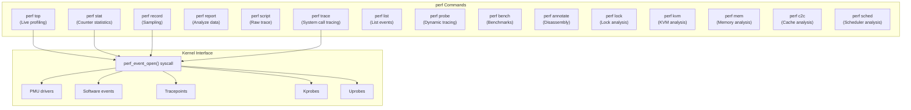
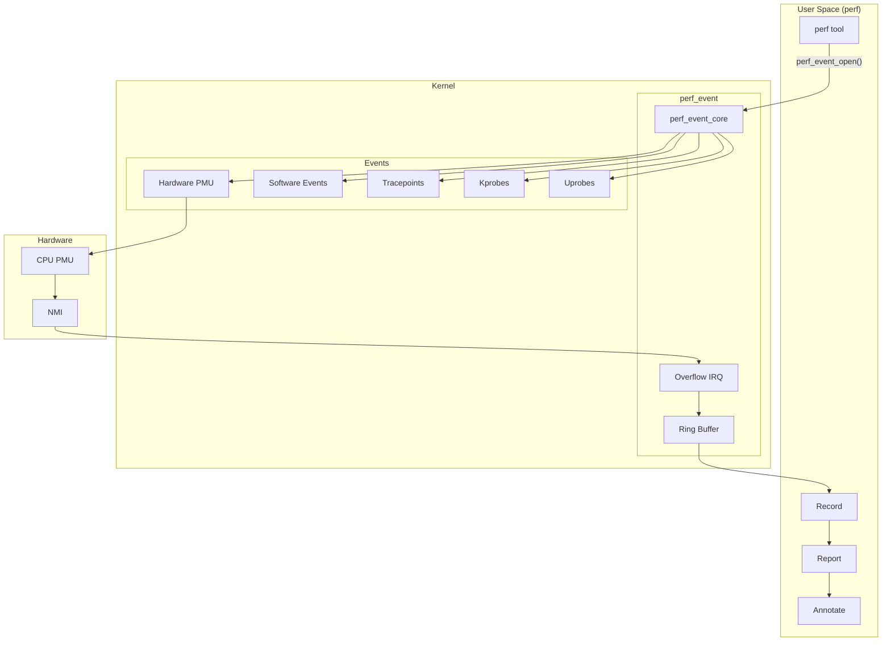
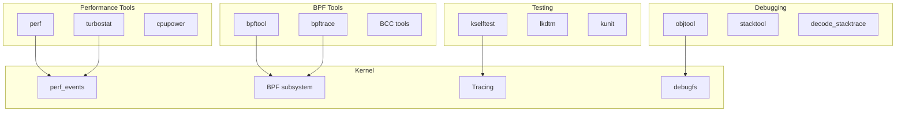

# Chapter 260: tools/ — Kernel Tools: perf, bpf, testing, debugging utilities

## 1. Introduction and Intuition

The `tools/` directory contains a wealth of user-space tools that are built from the kernel source tree. These tools are closely tied to kernel internals and provide powerful capabilities for performance analysis, debugging, testing, and development. The most prominent tools are `perf` (performance analysis) and `bpftool` (BPF management), but the directory also contains testing frameworks, documentation generators, and various helper utilities.

### 1.1 Why Tools Live in the Kernel Tree

These tools are part of the kernel source for several reasons:
- They depend on kernel headers and data structures
- They must stay synchronized with kernel changes
- They use kernel-specific features (perf events, BPF, tracepoints)
- They provide essential kernel development and debugging capabilities

---

## 2. Directory Layout

```
tools/
├── Makefile
├── build/
│   └── feature/              # Feature detection for build
│
├── perf/                     # *** perf: Performance analysis tool ***
│   ├── Makefile
│   ├── perf.c                # Main perf entry point
│   ├── builtin-top.c         # perf top (live profiling)
│   ├── builtin-stat.c        # perf stat (counter statistics)
│   ├── builtin-record.c      # perf record (sampling)
│   ├── builtin-report.c      # perf report (analyze recordings)
│   ├── builtin-script.c      # perf script (raw trace output)
│   ├── builtin-trace.c       # perf trace (strace-like)
│   ├── builtin-lock.c        # perf lock (lock analysis)
│   ├── builtin-kvm.c         # perf kvm (KVM analysis)
│   ├── builtin-mem.c         # perf mem (memory analysis)
│   ├── builtin-c2c.c         # perf c2c (cache-to-cache)
│   ├── builtin-sched.c       # perf sched (scheduler analysis)
│   ├── builtin-list.c        # perf list (list events)
│   ├── builtin-probe.c       # perf probe (dynamic tracing)
│   ├── builtin-bench.c       # perf bench (benchmarks)
│   ├── builtin-annotate.c    # perf annotate (disassembly)
│   ├── util/                 # Utility libraries
│   │   ├── event.c           # Event handling
│   │   ├── evsel.c           # Event selector
│   │   ├── evlist.c          # Event list
│   │   ├── header.c          # Perf data file header
│   │   ├── map.c             # Symbol mapping
│   │   ├── symbol.c          # Symbol resolution
│   │   ├── dso.c             # DSO (shared object) handling
│   │   ├── machine.c         # Machine/namespace
│   │   ├── session.c         # Recording session
│   │   ├── annotate.c        # Annotation
│   │   ├── llvm-utils.c      # LLVM integration
│   │   └── ...
│   ├── arch/                 # Architecture-specific support
│   │   ├── x86/              # x86 support
│   │   ├── arm/              # ARM support
│   │   ├── arm64/            # ARM64 support
│   │   └── ...
│   └── tests/                # perf self-tests
│       ├── tests.h
│       ├── bp_sample.c
│       ├── dlfilter-test.c
│       └── ...
│
├── bpf/                      # *** BPF tools ***
│   ├── bpftool/              # bpftool: BPF management
│   │   ├── main.c            # bpftool main
│   │   ├── prog.c            # Program management
│   │   ├── map.c             # Map management
│   │   ├── link.c            # Link management
│   │   ├── btf.c             # BTF operations
│   │   ├── feature.c         # Feature probing
│   │   ├── net.c             # Network attachment
│   │   ├── cgroup.c          # Cgroup attachment
│   │   ├── iter.c            # Iterator
│   │   ├── jit_disasm.c      # JIT disassembly
│   │   └── ...
│   │
│   ├── bpf_expert_test.c     # BPF expert tests
│   ├── bpf_jit_disasm.c      # BPF JIT disassembler
│   ├── bpf_dbg.c             # BPF debugger
│   ├── bpf_asm.c             # BPF assembler
│   ├── bpf_filter.c          # BPF filter
│   ├── sockex1_user.c        # Socket example (user)
│   ├── sockex1_kern.c        # Socket example (kernel)
│   ├── resolve_btfids/       # BTF ID resolver
│   └── ...
│
├── testing/                  # *** Kernel testing ***
│   ├── selftests/            # Kernel self-tests (kselftest)
│   │   ├── bpf/              # BPF self-tests
│   │   ├── net/              # Networking self-tests
│   │   ├── mm/               # Memory management tests
│   │   ├── drivers/          # Driver tests
│   │   ├── filesystems/      # Filesystem tests
│   │   ├── breakpoints/      # Breakpoint tests
│   │   ├── capabilities/     # Capability tests
│   │   ├── cgroup/           # Cgroup tests
│   │   ├── cpufreq/          # CPU frequency tests
│   │   ├── efivarfs/         # EFI variable filesystem tests
│   │   ├── futex/            # Futex tests
│   │   ├── ipc/              # IPC tests
│   │   ├── kcmp/             # kcmp tests
│   │   ├── kexec/            # Kexec tests
│   │   ├── memfd/            # memfd tests
│   │   ├── mount/            # Mount tests
│   │   ├── net/              # Network tests
│   │   ├── nsfs/             # Namespace tests
│   │   ├── pidfd/            # PID fd tests
│   │   ├── proc/             # /proc tests
│   │   ├── pstore/           # Persistent store tests
│   │   ├── ptrace/           # ptrace tests
│   │   ├── rseq/             # Restartable sequences tests
│   │   ├── seccomp/          # Seccomp tests
│   │   ├── sigaltstack/      # Signal stack tests
│   │   ├── size/             # Structure size tests
│   │   ├── splice/           # Splice tests
│   │   ├── static_keys/      # Static keys tests
│   │   ├── sync/             # Sync tests
│   │   ├── sysctl/           # Sysctl tests
│   │   ├── timers/           # Timer tests
│   │   ├── user/             # User namespace tests
│   │   ├── vDSO/             # vDSO tests
│   │   └── ...
│   │
│   ├── kselftest.h           # Kselftest framework header
│   ├── kselftest_module.h    # Module test framework
│   └── ...
│
├── lib/                      # *** Library functions ***
│   ├── traceevent/           # Trace event parsing library
│   │   ├── event-parse.c     # Event parser
│   │   ├── trace-seq.c       # Trace sequence
│   │   └── ...
│   │
│   ├── api/                  # Low-level APIs
│   │   ├── fs/               # Filesystem helpers
│   │   ├── io/               # I/O helpers
│   │   └── ...
│   │
│   ├── subcmd/               # Subcommand parsing
│   ├── string/               # String utilities
│   └── ...
│
├── cgroup/                   # Cgroup tools
│   └── cgroup.c
│
├── hv/                       # Hyper-V tools
│   └── hv_kvp_daemon.c
│
├── kvm/                      # KVM tools
│   ├── kvm_stat.c            # KVM statistics
│   └── ...
│
├── laptop/                   # Laptop-specific tools
│   └── ...
│
├── leds/                     # LED tools
│   └── uledmon.c             # User LED monitor
│
├── net/                      # Network tools
│   ├── genl.c                # Generic netlink
│   ├── ifconfig.c            # ifconfig replacement
│   ├── ...
│
├── nvmem/                    # NVMEM tools
│   └── ...
│
├── objtool/                  # *** Objtool: Object file analysis ***
│   ├── check.c               # Stack validation
│   ├── special.c             # Special section handling
│   ├── elf.c                 # ELF handling
│   ├── orc.h                 # ORC unwinder support
│   └── ...
│
├── power/                    # Power management tools
│   ├── cpupower/             # CPU power management
│   │   ├── cpupower.c        # Main tool
│   │   ├── frequency-info.c  # Frequency info
│   │   ├── frequency-set.c   # Set frequency
│   │   ├── idle-info.c       # Idle state info
│   │   ├── idle-set.c        # Set idle states
│   │   └── ...
│   └── turbostat/            # Turbostat: CPU frequency monitoring
│       ├── turbostat.c
│       └── ...
│
├── scripts/                  # Helper scripts
│   └── ...
│
├── spi/                      # SPI tools
│   └── spidev_test.c
│
├── testing/                  # Testing tools
│   ├── nvdimm/               # NVDIMM testing
│   ├── vsock/                # vsock testing
│   └── ...
│
├── thermal/                  # Thermal tools
│   ├── thermald/             # Thermal daemon
│   └── ...
│
├── usb/                      # USB tools
│   ├── usbip/                # USB/IP
│   └── ...
│
├── virtio/                   # VirtIO tools
│   └── ...
│
└── vm/                       # VM tools
    ├── page-types.c          # Page type inspection
    ├── slabinfo.c            # Slab allocator info
    ├── hugepage-mmap.c       # Huge page mmap test
    ├── mmap.c                # Mmap test
    └── ...
```

---

## 3. perf — Performance Analysis Tool

### 3.1 Architecture



### 3.2 Key perf Commands

#### perf stat — Count Events

```bash
# Count basic events
perf stat ls -la

# Count specific events
perf stat -e cycles,instructions,cache-misses ./my_program

# Count system-wide
perf stat -a -e cycles sleep 5

# Count per-CPU
perf stat -C 0,1 -e cycles sleep 5

# Group events
perf stat -e '{cycles,instructions}:S' ./my_program
```

#### perf record/report — Sampling

```bash
# Record with default event (cycles)
perf record ./my_program
perf report

# Record with specific event
perf record -e cache-misses -g ./my_program
perf report --stdio

# Record with call graphs
perf record -g ./my_program
perf report --call-graph

# Record with DWARF unwinding
perf record --call-graph dwarf ./my_program

# Record with Intel PT (Processor Trace)
perf record --intel-pt ./my_program
```

#### perf top — Live Profiling

```bash
# Live system-wide profiling
perf top

# Profile specific process
perf top -p 1234

# Profile with call graph
perf top -g
```

#### perf trace — System Call Tracing

```bash
# Trace system calls
perf trace

# Trace specific syscall
perf trace -e read,write

# Trace specific process
perf trace -p 1234

# Trace with duration filter
perf trace --duration 10
```

### 3.3 perf Data Format

```c
// tools/perf/util/header.c
struct perf_file_header {
    __u64 magic;                /* PERFILE2 */
    __u64 size;                 /* Header size */
    __u64 attr_size;            /* Attribute size */
    struct perf_file_section attrs;
    struct perf_file_section data;
    struct perf_file_section event_types;
    __u64 adds_features[PERF_HEADER_FEATS_BITS / 64];
};
```

---

## 4. BPF Tools

### 4.1 bpftool

```bash
# List loaded BPF programs
bpftool prog list

# Show program details
bpftool prog show id 42

# Dump program bytecode
bpftool prog dump xlated id 42

# Dump JIT-compiled code
bpftool prog dump jited id 42

# List BPF maps
bpftool map list

# Dump map contents
bpftool map dump id 123

# Pin a program
bpftool prog pin id 42 /sys/fs/bpf/my_prog

# Feature probe
bpftool feature probe

# List BPF links
bpftool link list

# List BPF types (BTF)
bpftool btf dump id 1
```

### 4.2 BPF Self-Tests

```bash
# Run BPF self-tests
cd tools/testing/selftests/bpf
make
sudo ./test_progs

# Run specific test
sudo ./test_progs -t test_maps

# Run with verbose output
sudo ./test_progs -v
```

---

## 5. Kselftest Framework

### 5.1 Writing a Self-Test

```c
// tools/testing/selftests/my_test/test_my_feature.c
#include "../kselftest.h"
#include <stdio.h>
#include <stdlib.h>
#include <unistd.h>
#include <sys/syscall.h>

int main(int argc, char *argv[])
{
    int ret;
    
    /* Test 1: Basic functionality */
    ret = syscall(__NR_my_syscall, 42);
    if (ret < 0) {
        ksft_exit_fail_msg("my_syscall failed: %m\n");
    }
    
    /* Test 2: Edge case */
    ret = syscall(__NR_my_syscall, -1);
    if (ret != -1 || errno != EINVAL) {
        ksft_exit_fail_msg("Expected EINVAL for -1\n");
    }
    
    ksft_exit_pass();
    return 0;
}
```

### 5.2 Running Self-Tests

```bash
# Build all self-tests
make -C tools/testing/selftests

# Run all tests
sudo make -C tools/testing/selftests run_tests

# Run specific test suite
sudo make -C tools/testing/selftests/bpf run_tests

# Run specific test
cd tools/testing/selftests/bpf
sudo ./test_progs -t test_maps
```

---

## 6. objtool — Object File Analysis

`objtool` analyzes compiled object files to:
- Validate stack usage (no unbounded stack)
- Generate ORC unwind tables for reliable stack traces
- Validate no inline asm that breaks assumptions

```bash
# Check an object file
tools/objtool/objtool check drivers/net/e1000e/netdev.o

# Generate ORC unwind data
tools/objtool/objtool orc generate drivers/net/e1000e/netdev.o
```

---

## 7. Testing Tools

### 7.1 vm/page-types.c

```bash
# Inspect page types
sudo tools/vm/page-types -p 1

# Show all page types
sudo tools/vm/page-types

# Show huge pages
sudo tools/vm/page-types -b huge
```

### 7.2 vm/slabinfo.c

```bash
# Show slab allocator statistics
sudo tools/vm/slabinfo

# Show top allocations
sudo tools/vm/slabinfo -T

# Sort by object count
sudo tools/vm/slabinfo -s objects
```

### 7.3 cpupower

```bash
# Show CPU frequency info
tools/power/cpupower/cpupower frequency-info

# Set CPU frequency governor
sudo tools/power/cpupower/cpupower frequency-set -g performance

# Show idle states
tools/power/cpupower/cpupower idle-info
```

### 7.4 turbostat

```bash
# Monitor CPU frequencies and power
sudo tools/power/x86/turbostat/turbostat

# Monitor specific package
sudo turbostat --num_iterations 10

# Show per-core statistics
sudo turbostat --show Core,CPU,Avg_MHz,Busy%,Bzy_MHz
```

---

## 8. Diagrams

### 8.1 perf Architecture



### 8.2 Tools Ecosystem



---

## 9. Relationships with Other Subsystems

### 9.1 tools/ ↔ kernel/trace/

- `perf` uses the perf_event and tracing infrastructure
- BPF tools interact with the BPF subsystem
- `traceevent` library parses trace event formats

### 9.2 tools/ ↔ kernel/bpf/

- `bpftool` manages BPF programs and maps
- BPF self-tests validate the BPF subsystem
- `resolve_btfids` handles BTF (BPF Type Format) IDs

### 9.3 tools/ ↔ arch/

- `objtool` analyzes architecture-specific object files
- `perf` has architecture-specific PMU support
- `cpupower` and `turbostat` are architecture-specific

### 9.4 tools/ ↔ scripts/

- Build system scripts support tool compilation
- `gen_compile_commands.py` helps IDE integration
- `checkpatch.pl` validates tool code style

---

## 10. References

1. **Linux Kernel Source**: `tools/` directory
2. **Documentation**: `Documentation/tools/`
3. **"BPF Performance Tools"** — Brendan Gregg
4. **"Systems Performance"** — Brendan Gregg
5. **perf Wiki**: perf.wiki.kernel.org
6. **BPF Documentation**: `Documentation/bpf/`
7. **LWN.net**: Various perf and BPF articles
8. **man pages**: `perf(1)`, `bpftool(8)`
