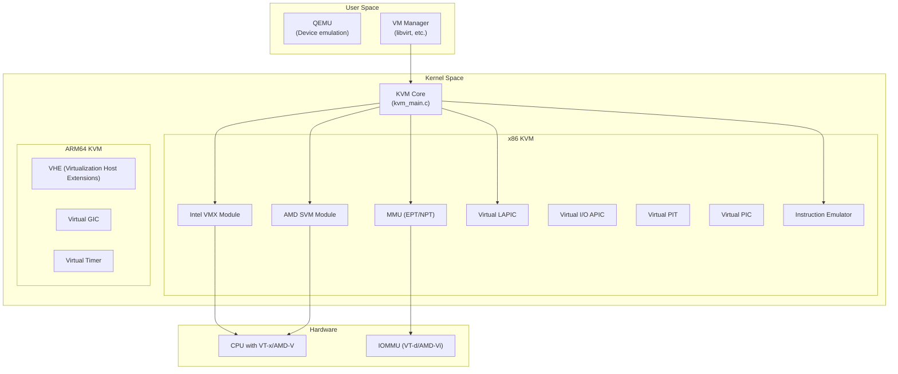
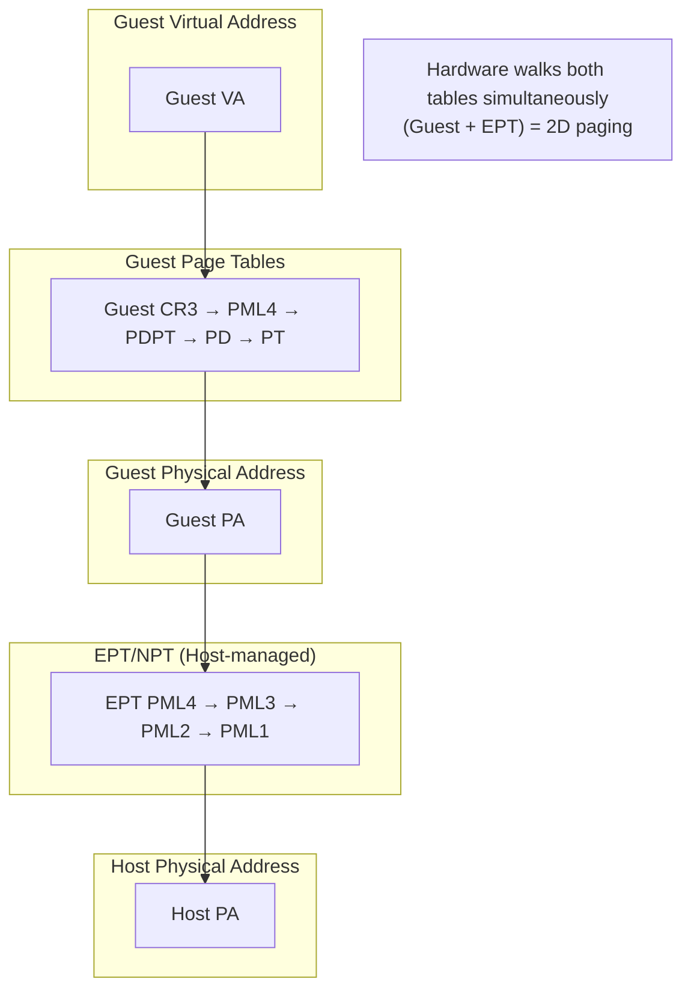
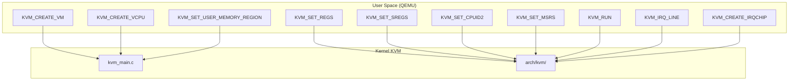
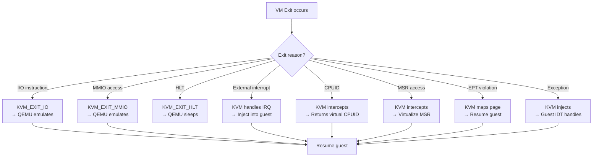
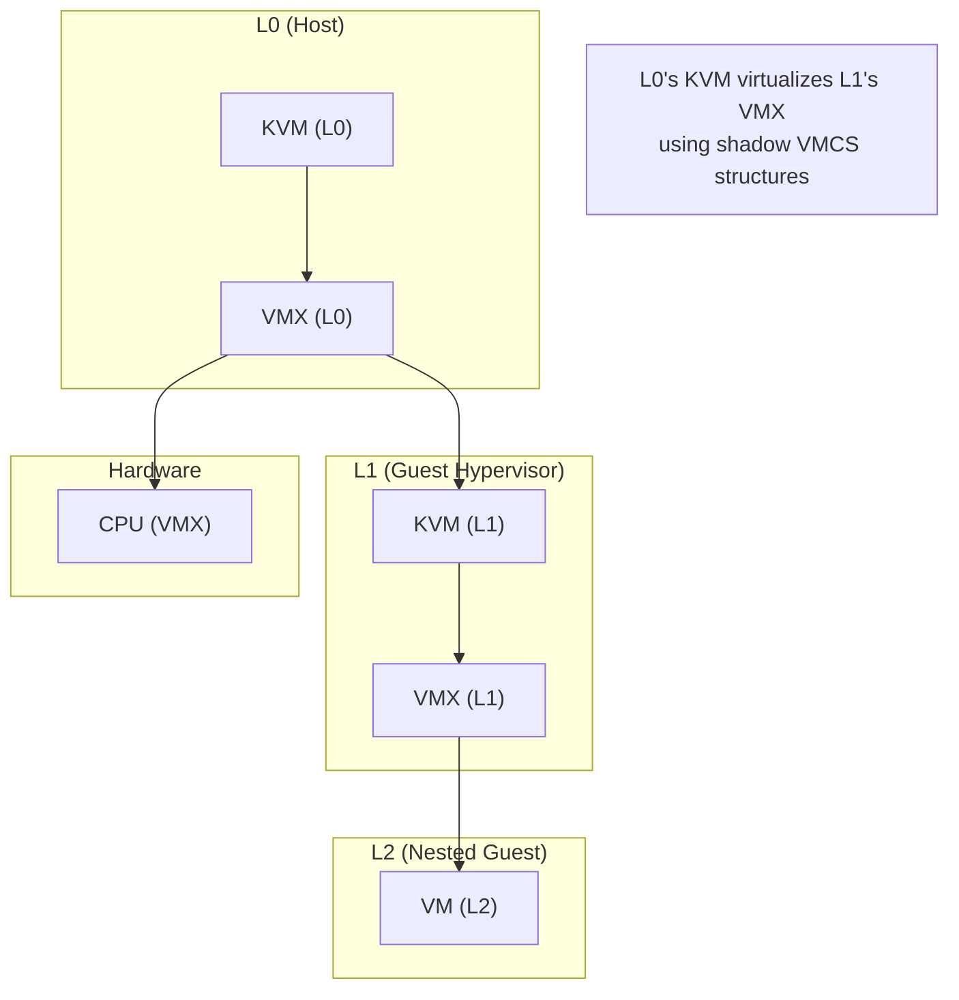
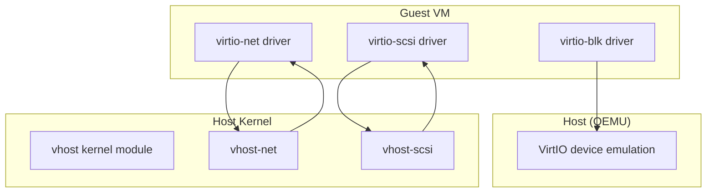

# Chapter 261: usr/ and virt/ — initramfs Generation and Virtualization: KVM Source, Hypervisor

## 1. Introduction and Intuition

The `usr/` and `virt/` directories handle two distinct but important kernel responsibilities. `usr/` manages the initramfs — the initial root filesystem that's embedded in the kernel image and used during early boot. `virt/` implements the kernel's virtualization infrastructure, primarily KVM (Kernel-based Virtual Machine), which turns the Linux kernel itself into a hypervisor.

### 1.1 The Connection Between Them

These directories share a conceptual link: both deal with the kernel managing "virtual" environments. The initramfs provides a virtual filesystem in memory during boot, while KVM provides virtual machines that run on top of the kernel. Both are about the kernel creating and managing contained environments.

---

## 2. Directory Layout

### 2.1 usr/

```
usr/
├── Makefile                    # initramfs build rules
├── Kconfig                     # initramfs configuration
├── initramfs_data.cpio.S       # Assembler wrapper for embedded initramfs
├── gen_init_cpio.c             # Generate initramfs cpio archive
├── gen_initramfs.sh            # Initramfs generation script
└── default_cpio_list           # Default initramfs contents
```

### 2.2 virt/

```
virt/
├── Makefile
├── Kconfig
│
├── kvm/                        # *** KVM core ***
│   ├── kvm_main.c              # KVM core: VM creation, vCPU management
│   ├── kvm_irq.c               # IRQ routing
│   ├── kvm_irq_comm.c          # IRQ communication
│   ├── eventfd.c               # Eventfd-based signaling (irqfd, ioeventfd)
│   ├── vfio.c                  # VFIO integration (device passthrough)
│   ├── coalesced_mmio.c        # Coalesced MMIO
│   ├── dirty_ring.c            # Dirty page tracking (ring buffer)
│   ├── mmu/                    # *** MMU virtualization ***
│   │   ├── mmu.c               # Shadow page tables, TDP
│   │   ├── page_track.c        # Page tracking (dirty logging)
│   │   ├── slot_track.c        # Slot tracking
│   │   └── ...
│   ├── x86/                    # *** x86 KVM ***
│   │   ├── x86.c               # x86 KVM core
│   │   ├── emulate.c           # Instruction emulation
│   │   ├── irq.c               # x86 IRQ handling
│   │   ├── lapic.c             # Virtual LAPIC
│   │   ├── i8254.c             # Virtual PIT (Programmable Interval Timer)
│   │   ├── i8259.c             # Virtual PIC (Programmable Interrupt Controller)
│   │   ├── ioapic.c            # Virtual I/O APIC
│   │   ├── cpuid.c             # CPUID handling
│   │   ├── msr.c               # MSR (Model Specific Register) handling
│   │   ├── pmu.c               # Performance Monitoring Unit
│   │   ├── hyperv.c            # Hyper-V emulation
│   │   ├── nested.c            # Nested virtualization
│   │   ├── mmu.c               # x86 MMU (shadow/TDP/EPT)
│   │   ├── tdp.c               # Two-Dimensional Paging (EPT/NPT)
│   │   ├── vmx/                # *** Intel VMX ***
│   │   │   ├── vmx.c           # VMX operations
│   │   │   ├── vmcs.c          # VMCS management
│   │   │   ├── vmx_ops.h       # VMX assembly operations
│   │   │   ├── nested.c        # VMX nested virtualization
│   │   │   └── ...
│   │   ├── svm.c               # *** AMD SVM ***
│   │   │   ├── svm.c           # SVM operations
│   │   │   ├── svm.h           # SVM definitions
│   │   │   └── ...
│   │   └── ...
│   ├── arm64/                  # *** ARM64 KVM ***
│   │   ├── arm.c               # ARM KVM core
│   │   ├── handle_exit.c       # Exception handling
│   │   ├── mmu.c               # ARM MMU virtualization
│   │   ├── pmu.c               # ARM PMU
│   │   ├── vgic/               # Virtual GIC (Generic Interrupt Controller)
│   │   │   ├── vgic-init.c     # VGIC initialization
│   │   │   ├── vgic-v2.c       # GICv2 emulation
│   │   │   ├── vgic-v3.c       # GICv3 emulation
│   │   │   ├── vgic-its.c      # GICv3 ITS emulation
│   │   │   ├── vgic-mmio.c     # MMIO handling
│   │   │   └── ...
│   │   ├── arch_timer.c        # Virtual arch timer
│   │   ├── hyp/                # EL2 (hypervisor) code
│   │   │   ├── entry.S         # EL2 entry point
│   │   │   ├── switch.c        # Guest/host switch
│   │   │   ├── vgic-v3-sr.c    # GICv3 save/restore
│   │   │   └── ...
│   │   └── ...
│   ├── riscv/                  # *** RISC-V KVM ***
│   │   ├── main.c              # RISC-V KVM core
│   │   ├── vcpu.c              # vCPU operations
│   │   ├── vcpu_exit.c         # Exception handling
│   │   ├── timer.c             # Virtual timer
│   │   └── ...
│   └── ...
│
├── lib/                        # *** Virtualization libraries ***
│   ├── irqbypass.c             # IRQ bypass manager
│   ├── vfio.c                  # VFIO library
│   └── ...
│
└── coco/                       # *** Confidential Computing ***
    ├── guest/                  # Guest-side confidential computing
    ├── core.c                  # CoCo core
    └── ...
```

---

## 3. initramfs (usr/)

### 3.1 What is initramfs?

The initramfs (initial RAM filesystem) is a compressed cpio archive that's embedded in the kernel image or loaded alongside it. It provides a temporary root filesystem during early boot, before the real root filesystem is mounted.

### 3.2 initramfs Generation

#### 3.2.1 gen_init_cpio.c

This tool generates a cpio archive from a file list:

```c
// usr/gen_init_cpio.c
int main(int argc, char *argv[])
{
    FILE *cpio_list;
    
    /* Read the cpio list file */
    cpio_list = fopen(argv[1], "r");
    
    /* Generate cpio archive */
    while (fgets(line, sizeof(line), cpio_list)) {
        /* Parse each line */
        if (strncmp(line, "file ", 5) == 0) {
            /* Add file to archive */
            cpio_add_file(name, location, mode, uid, gid);
        } else if (strncmp(line, "dir ", 4) == 0) {
            /* Add directory */
            cpio_add_dir(name, mode, uid, gid);
        } else if (strncmp(line, "nod ", 4) == 0) {
            /* Add device node */
            cpio_add_nod(name, mode, uid, gid, dev);
        } else if (strncmp(line, "slink ", 6) == 0) {
            /* Add symlink */
            cpio_add_slink(name, target, mode, uid, gid);
        } else if (strncmp(line, "pipe ", 5) == 0) {
            /* Add pipe */
            cpio_add_pipe(name, mode, uid, gid);
        }
    }
    
    /* Write trailer */
    cpio_trailer();
    
    return 0;
}
```

#### 3.2.2 CPIO List Format

```
# Default cpio list
dir /dev 0755 0 0
nod /dev/console 0600 0 0 c 5 1
dir /root 0700 0 0
dir /sbin 0755 0 0
dir /bin 0755 0 0
dir /proc 0755 0 0
dir /sys 0755 0 0
dir /mnt 0755 0 0
file /init /path/to/init 0755 0 0
file /sbin/init /path/to/init 0755 0 0
```

#### 3.2.3 Configuration Options

```kconfig
# usr/Kconfig

config INITRAMFS_SOURCE
    string "Source directory for initramfs"
    default ""
    help
      This can be either a directory containing the initramfs,
      a cpio archive, or a gzip'd cpio archive.
      
      If blank, the kernel will not build an initramfs.

config INITRAMFS_COMPRESSION_NONE
    bool "Do not compress"
    
config INITRAMFS_COMPRESSION_GZIP
    bool "Gzip"
    
config INITRAMFS_COMPRESSION_BZIP2
    bool "Bzip2"
    
config INITRAMFS_COMPRESSION_LZMA
    bool "LZMA"
    
config INITRAMFS_COMPRESSION_XZ
    bool "XZ"
    
config INITRAMFS_COMPRESSION_LZO
    bool "LZO"
    
config INITRAMFS_COMPRESSION_LZ4
    bool "LZ4"
    
config INITRAMFS_COMPRESSION_ZSTD
    bool "ZSTD"
```

### 3.3 initramfs Unpacking

The kernel unpacks the initramfs during boot:

```c
// init/initramfs.c
static int __init populate_rootfs(void)
{
    /* Check if we have an initramfs */
    if (initrd_start) {
        /* Unpack initramfs (cpio archive) */
        err = unpack_to_rootfs((char *)initrd_start,
                               initrd_end - initrd_start);
        if (err)
            printk(KERN_ERR "Initramfs unpacking failed: %s\n", err);
    }
    
    /* If no initramfs, create minimal filesystem */
    /* ... */
    
    return 0;
}
rootfs_initcall(populate_rootfs);
```

### 3.4 initramfs Boot Flow

```mermaid
sequenceDiagram
    BOOT as Bootloader
    KERN as Kernel
    INITRAMFS as initramfs
    INIT as /init (in initramfs)
    ROOT as Real root filesystem
    SYSTEM as System
    
    BOOT->>KERN: Load kernel + initramfs
    KERN->>KERN: Boot, initialize hardware
    KERN->>INITRAMFS: Unpack cpio to tmpfs
    KERN->>INIT: exec("/init")
    
    INIT->>INIT: Load kernel modules
    INIT->>INIT: Set up device nodes (devtmpfs)
    INIT->>INIT: Mount real root filesystem
    INIT->>INIT: pivot_root() to real root
    INIT->>SYSTEM: exec("/sbin/init")
    
    SYSTEM->>SYSTEM: System is running
```

---

## 4. KVM — Kernel-based Virtual Machine (virt/kvm/)

### 4.1 KVM Architecture

KVM turns the Linux kernel into a type-1 hypervisor:



### 4.2 KVM Core Data Structures

```c
// virt/kvm/kvm_main.c
struct kvm {
    spinlock_t mmu_lock;
    struct mutex slots_lock;
    struct mutex slots_arch_lock;
    struct mmu_notifier mmu_notifier;
    unsigned long nr_mmu_pages;
    unsigned long mmu_valid_gen;
    
    /* Memory slots */
    struct kvm_memslots __rcu *memslots[KVM_ADDRESS_SPACE_NUM];
    struct kvm_memslots __rcu *memslots[0];
    
    /* vCPUs */
    struct kvm_vcpu *vcpus[KVM_MAX_VCPUS];
    atomic_t online_vcpus;
    int created_vcpus;
    int last_boosted_vcpu;
    
    /* IRQs */
    struct kvm_irq_routing *irq_routing;
    spinlock_t irqfds_lock;
    struct list_head irqfds;
    struct list_head ioeventfds;
    
    /* MM */
    struct mm_struct *mm;       /* User process mm */
    struct kvm_io_bus *buses[KVM_NR_BUSES];
    
    /* VM file descriptor */
    struct file *filp;
    
    /* Architecture-specific */
    struct kvm_arch arch;
    
    /* ... */
};

struct kvm_vcpu {
    struct kvm *kvm;
    int cpu;                    /* Host CPU running this vCPU */
    int vcpu_id;                /* vCPU ID */
    
    /* Guest state */
    struct kvm_run *run;        /* Shared with user space */
    
    /* Architecture-specific */
    struct kvm_vcpu_arch arch;
    
    /* Requests */
    unsigned long requests;
    
    /* MMU */
    struct kvm_mmu *mmu;
    
    /* Preemption timer */
    struct hrtimer preempt_timer;
    
    /* ... */
};
```

### 4.3 VM Creation and vCPU Lifecycle

```mermaid
sequenceDiagram
    USER as User Space (QEMU)
    KVM as KVM Core
    VMX as VMX/SVM Module
    HW as CPU Hardware
    
    USER->>KVM: /dev/kvm ioctl(KVM_CREATE_VM)
    KVM->>KVM: Allocate struct kvm
    KVM-->>USER: VM fd
    
    USER->>KVM: ioctl(VM_fd, KVM_CREATE_VCPU, 0)
    KVM->>KVM: Allocate struct kvm_vcpu
    KVM->>VMX: vmx_vcpu_create()
    VMX->>VMX: Allocate VMCS
    KVM-->>USER: vCPU fd
    
    USER->>KVM: ioctl(vcpu_fd, KVM_SET_REGS, regs)
    USER->>KVM: ioctl(vcpu_fd, KVM_SET_SREGS, sregs)
    USER->>KVM: ioctl(vcpu_fd, KVM_SET_CPUID2, cpuid)
    
    loop Run loop
        USER->>KVM: ioctl(vcpu_fd, KVM_RUN)
        KVM->>VMX: vcpu_run()
        VMX->>HW: VMXLAUNCH/VMLAUNCH
        HW->>HW: Execute guest code
        HW->>VMX: VM exit
        VMX->>KVM: Handle exit
        alt I/O exit
            KVM-->>USER: KVM_EXIT_IO
            USER->>USER: Emulate I/O
        else MMIO exit
            KVM-->>USER: KVM_EXIT_MMIO
            USER->>USER: Emulate MMIO
        else HLT exit
            KVM-->>USER: KVM_EXIT_HLT
        else External interrupt
            KVM->>KVM: Inject IRQ
            KVM->>VMX: Resume guest
        end
    end
```

### 4.4 Intel VMX (Virtual Machine Extensions)

```c
// arch/x86/kvm/vmx/vmx.c
static int vmx_vcpu_create(struct kvm_vcpu *vcpu)
{
    struct vcpu_vmx *vmx;
    
    /* Allocate VMCS */
    vmx->vmcs = alloc_vmcs();
    
    /* Initialize VMCS fields */
    vmcs_write32(VIRTUAL_PROCESSOR_ID, vcpu->vcpu_id);
    vmcs_write32(PIN_BASED_VM_EXEC_CONTROL, vmx_pin_based_exec_ctrl(vmx));
    vmcs_write32(CPU_BASED_VM_EXEC_CONTROL, vmx_exec_ctrl(vmx));
    
    /* Set up exit controls */
    vmcs_write32(VM_EXIT_CONTROLS, vmx_exit_controls(vmx));
    
    /* Set up entry controls */
    vmcs_write32(VM_ENTRY_CONTROLS, vmx_entry_controls(vmx));
    
    /* Initialize EPT (Extended Page Tables) */
    vmx->ept_root = construct_eptp();
    
    return 0;
}

static int vmx_vcpu_run(struct kvm_vcpu *vcpu)
{
    struct vcpu_vmx *vmx = to_vmx(vcpu);
    
    /* Save host state */
    vmx_prepare_switch_to_host(vmx);
    
    /* Load guest state into VMCS */
    vmcs_writel(GUEST_RIP, kvm_rip_read(vcpu));
    vmcs_writel(GUEST_RSP, kvm_rsp_read(vcpu));
    
    /* Execute guest */
    asm volatile(
        "vmxlaunched:"
        "vmlaunch\n"
        "vmexit:"
        /* ... */
    );
    
    /* VM exit occurred */
    vmx->exit_reason = vmcs_read32(VM_EXIT_REASON);
    
    /* Handle exit */
    return vmx_handle_exit(vcpu);
}
```

### 4.5 AMD SVM (Secure Virtual Machine)

```c
// arch/x86/kvm/svm.c
static int svm_vcpu_create(struct kvm_vcpu *vcpu)
{
    struct vcpu_svm *svm;
    
    /* Allocate VMCB (Virtual Machine Control Block) */
    svm->vmcb = alloc_page(GFP_KERNEL);
    
    /* Initialize VMCB fields */
    svm->vmcb->control.intercept_exceptions = 0xffffffff;
    svm->vmcb->control.intercept_misc = ...;
    
    /* Set up NPT (Nested Page Tables) */
    svm->vmcb->control.npt_cr3 = __sme_set(svm->npt_cr3);
    
    return 0;
}

static int svm_vcpu_run(struct kvm_vcpu *vcpu)
{
    struct vcpu_svm *svm = to_svm(vcpu);
    
    /* Save host state */
    svm_prepare_switch_to_guest(svm);
    
    /* Execute guest using VMRUN */
    asm volatile(
        "vmrun\n"
        /* ... */
    );
    
    /* SVM exit occurred */
    svm->vmcb->control.exit_code = ...;
    
    return svm_handle_exit(vcpu);
}
```

### 4.6 Two-Dimensional Paging (EPT/NPT)



---

## 5. Virtual GIC (ARM64)

### 5.1 VGIC Architecture

```c
// arch/arm64/kvm/vgic/vgic-init.c
struct vgic_irq {
    spinlock_t irq_lock;
    
    u32 intid;                  /* Interrupt ID */
    bool enabled;
    bool pending;
    bool active;
    bool line_level;
    bool config;
    u8 source;                  /* CPU source */
    u8 active_source;
    u32 priority;
    u32 group;
    
    struct kvm_vcpu *target_vcpu;
    struct list_head ap_list;
    
    /* ... */
};
```

---

## 6. Confidential Computing (virt/coco/)

The Confidential Computing framework supports hardware-based VM isolation:

```c
// virt/coco/core.c
struct cc_platform_ops {
    bool (*mem_enc_enabled)(void);
    bool (*enc_status_change_finish)(unsigned long vaddr, int npages, bool enc);
    bool (*enc_status_change_prepare)(unsigned long vaddr, int npages, bool enc);
};
```

---

## 7. Diagrams

### 7.1 KVM ioctl Interface



### 7.2 VM Exit Handling



### 7.3 Nested Virtualization



---

## 8. Relationships with Other Subsystems

### 8.1 virt/ ↔ arch/

- KVM uses architecture-specific code in `arch/x86/kvm/` and `arch/arm64/kvm/`
- The hypervisor switch code is deeply architecture-specific
- CPU feature detection determines available virtualization extensions

### 8.2 virt/ ↔ mm/

- KVM manages guest physical memory through EPT/NPT
- Memory regions are mapped from user space to guest
- Dirty page tracking uses the MMU notifier framework

### 8.3 virt/ ↔ drivers/

- VFIO (`drivers/vfio/`) provides device passthrough to VMs
- VirtIO (`drivers/virtio/`) provides paravirtualized devices
- IOMMU (`drivers/iommu/`) isolates device DMA

### 8.4 usr/ ↔ init/

- The initramfs is unpacked by `init/initramfs.c`
- The init process inside initramfs mounts the real root
- `init/do_mounts.c` handles the transition from initramfs to real root

### 8.5 usr/ ↔ scripts/

- Build scripts handle initramfs generation
- `scripts/gen_initramfs.sh` creates the cpio list
- The Makefile includes the initramfs in the kernel image

---

## 9. Advanced Topics

### 9.1 VirtIO Integration

KVM works with VirtIO for paravirtualized I/O:



### 9.2 Device Passthrough with VFIO

```mermaid
sequenceDiagram
    USER as User Space (QEMU)
    VFIO as VFIO subsystem
    IOMMU as IOMMU driver
    HW as Hardware Device
    
    USER->>VFIO: VFIO_GET_DEVICE_FD
    VFIO->>IOMMU: Create IOMMU domain
    IOMMU->>HW: Program IOMMU mappings
    
    USER->>VFIO: VFIO_DEVICE_GET_REGION_INFO
    VFIO-->>USER: MMIO region info
    
    USER->>IOMMU: Map guest physical → host physical
    IOMMU->>HW: IOMMU page table update
    
    Note over HW: Device DMA goes through IOMMU\nGuest sees device directly
```

### 9.3 KVM Performance Optimizations

```c
/* Posted interrupts (Intel) */
/* Hardware delivers interrupts directly to guest without VM exit */
vmcs_write64(POSTED_INTR_DESC, virt_to_phys(&vmx->pi_desc));

/* Virtual APIC page */
/* Hardware accesses virtual LAPIC directly */
vmcs_write64(VIRTUAL_APIC_PAGE_ADDR, virt_to_phys(vcpu->arch.apic->regs));

/* VMFUNC */
/* Guest can call functions without VM exit */
vmcs_write32(VM_FUNCTION_CONTROL, ...);
```

---

## 10. References

1. **Linux Kernel Source**: `usr/`, `virt/` directories
2. **Documentation**: `Documentation/virt/kvm/`
3. **"KVM Virtualization in Linux"** — LWN.net series
4. **Intel VT-x specification**: Intel Software Developer Manual, Volume 3
5. **AMD-V specification**: AMD Architecture Programmer's Manual
6. **ARM Virtualization**: ARM Architecture Reference Manual
7. **KVM API documentation**: `Documentation/virt/kvm/api.rst`
8. **initramfs documentation**: `Documentation/filesystems/ramfs-rootfs-initramfs.rst`
9. **LWN.net**: Various KVM and virtualization articles
10. **QEMU documentation**: qemu-project.org
