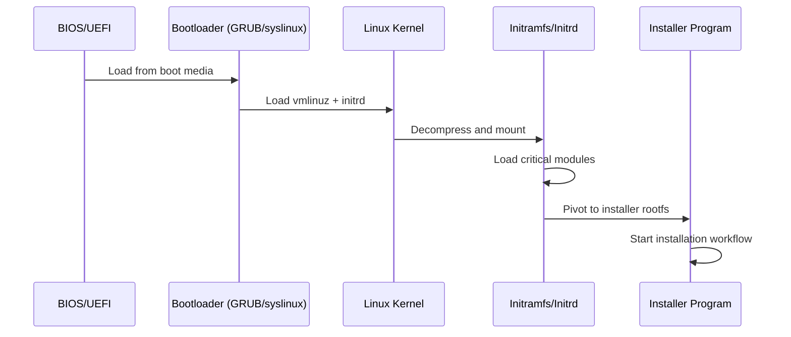
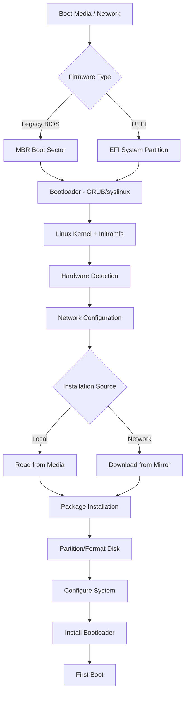

# Chapter 11: Installation Fundamentals

## 11.1 Introduction

Installing a Linux operating system is the foundational act that transforms bare hardware into a functioning computing environment. Unlike consumer operating systems that ship pre-installed, Linux offers a spectrum of installation experiences—from single-click cloud deployments to meticulously crafted source-based distributions. Understanding installation fundamentals equips you to handle any scenario: provisioning servers in a data center, setting up a development workstation, deploying containers, or rescuing a broken system.

This chapter covers the boot process from installation media, the types of installers available, network versus local installation strategies, and the practical considerations that separate a smooth installation from a frustrating ordeal.

## 11.2 Intuition: What Happens During Installation?

At its core, a Linux installation performs these operations:

1. **Boots a minimal environment** from removable media or the network
2. **Detects hardware** and loads appropriate kernel modules
3. **Partitions and formats** storage devices
4. **Copies a root filesystem** (packages or pre-built image) to disk
5. **Configures the bootloader** so the system can start independently
6. **Sets system identity** (hostname, timezone, locale, users)
7. **Optionally installs additional software** and applies updates

Think of it as transplanting a brain (the operating system) into a body (the hardware), then teaching it how to wake up on its own.

## 11.3 Internal Architecture of the Installation Process

### 11.3.1 The Installation Environment

Every installer runs within a temporary operating system called the **installation environment** or **live environment**. This environment contains:

- A Linux kernel with broad hardware support
- An initramfs or root filesystem with installer utilities
- Package managers or image extraction tools
- Hardware detection libraries (e.g., `hwinfo`, `lshw`)
- Network configuration tools

The installation environment loads entirely into RAM (or partially from the boot media), allowing the installer to modify the target disk freely.

### 11.3.2 Installer Taxonomy

```
┌─────────────────────────────────────────────────────────┐
│                   Installer Types                        │
├──────────────┬──────────────┬──────────────┬────────────┤
│  Text-based  │   Graphical  │   Automated  │  Image-    │
│  (ncurses)   │   (X/Wayland)│   (unattended│  based     │
│              │              │    /kickstart)│            │
├──────────────┼──────────────┼──────────────┼────────────┤
│ Debian       │ Ubuntu       │ Kickstart    │ cloud images│
│ text mode    │ Installer    │ (RHEL/Fedora)│ (AMI, qcow2│
│ Arch         │ openSUSE     │ Preseed      │  VHD)      │
│ (manual)     │ YaST         │ (Debian/     │ Docker     │
│ Void Linux   │ Calamares    │  Ubuntu)     │ images     │
│ Slackware    │ Anaconda     │ AutoYAST     │ Flatpak/   │
│              │ (graphical)  │ (openSUSE)   │ Snap       │
│              │              │ FAI          │ snapshots  │
└──────────────┴──────────────┴──────────────┴────────────┘
```

### 11.3.3 Boot Media Formats

**Optical Media (CD/DVD):**
- ISO 9660 / UDF filesystem
- Legacy but still supported
- Limited to ~4.7 GB (DVD) or ~700 MB (CD)

**USB Flash Drives:**
- Most common modern method
- Written with `dd`, Ventoy, Rufus, Etcher, or `cp`
- Can use ISO hybrid mode or direct filesystem copy

**PXE (Network) Boot:**
- DHCP provides TFTP server address
- PXE firmware downloads bootloader (pxelinux, GRUB, iPXE)
- Installer kernel and initrd loaded over HTTP/NFS/iSCSI

**SD/eMMC Cards:**
- Common for ARM/embedded devices
- Direct image flashing with `dd` or specialized tools

### 11.3.4 The Boot Chain for Installation Media



## 11.4 Historical Evolution

### 11.4.1 The Early Days (1990s)

Early Linux distributions used **boot floppies**—often two or three 1.44 MB disks. The first disk contained the kernel; the second held the root filesystem with the installer. Slackware (1993) and Debian (1993) pioneered this approach. Installation required answering questions about your hardware manually—IRQ settings, I/O addresses, disk geometry.

### 11.4.2 The CD-ROM Era (Late 1990s–2000s)

Red Hat introduced **Anaconda** in 2000, a graphical installer that could run in both text and GUI modes. The CD-ROM brought package collections to users without internet access. Debian's `dselect` and later `apt` during installation represented the package-centric approach.

### 11.4.3 The Network Age (2000s–2010s)

Netinstall images became popular—small ISOs (~50–200 MB) that downloaded packages from mirrors during installation. This reduced download sizes and ensured up-to-date packages. Kickstart (Red Hat), Preseed (Debian), and AutoYAST (openSUSE) enabled fully automated installations.

### 11.4.4 The Cloud and Container Era (2010s–Present)

Cloud images, cloud-init, and infrastructure-as-code tools like Terraform and Packer transformed installation into an automated, reproducible process. Immutable distributions (Fedora CoreOS, NixOS, Flatcar) treat installation as image deployment rather than package-by-package assembly.

## 11.5 Design Rationale

### Why So Many Installer Types?

Different use cases demand different trade-offs:

- **Interactive installers** (Anaconda, Ubiquity): prioritize discoverability and ease for new users
- **Manual installers** (Arch, Gentoo): prioritize control and education
- **Automated installers** (Kickstart, Preseed): prioritize repeatability at scale
- **Image-based**: prioritize speed and idempotency

### Why Not Just Clone Disks?

Disk cloning (e.g., Clonezilla, `dd`) works but has limitations:
- Requires identical or larger target hardware
- Carries unnecessary configuration from the source
- Fails with different storage controllers or partition layouts
- Doesn't scale to heterogeneous environments

Package-based or declarative installations generate hardware-appropriate configurations fresh each time.

## 11.6 Creating Boot Media

### 11.6.1 Writing ISO Images to USB

**Using `dd` (Linux/macOS):**

```bash
# Identify the USB device
lsblk
# or
sudo fdisk -l

# Write the ISO (CAUTION: verify /dev/sdX is correct!)
sudo dd if=linux-mint-21.3-cinnamon-64bit.iso of=/dev/sdb bs=4M status=progress conv=fsync

# Ensure all data is written
sync
```

**Using Ventoy (multi-boot USB):**

```bash
# Install Ventoy to USB drive
sudo ./Ventoy2Disk.sh -i /dev/sdb

# Simply copy ISO files to the Ventoy partition
cp ubuntu-24.04-desktop-amd64.iso /media/user/Ventoy/
cp fedora-workstation-40.iso /media/user/Ventoy/

# Boot menu shows all ISOs automatically
```

**Using Rufus (Windows):**

Rufus offers two modes:
- **ISO mode**: Writes the ISO directly (like `dd`)
- **DD mode**: Raw byte copy, necessary for hybrid ISOs

### 11.6.2 Verifying Boot Media Integrity

```bash
# Verify SHA256 checksum
sha256sum -c SHA256SUMS --ignore-missing

# Verify GPG signature of checksum file
gpg --verify SHA256SUMS.gpg SHA256SUMS

# Verify after writing to USB (compare first N bytes)
sudo cmp --bytes=1048576 linux.iso /dev/sdb
```

### 11.6.3 PXE Boot Server Setup

A minimal PXE boot environment requires DHCP, TFTP, and optionally HTTP/NFS servers:

```bash
# Install required packages (Debian/Ubuntu)
sudo apt install dnsmasq syslinux-common pxelinux

# Configure dnsmasq for DHCP + TFTP
cat > /etc/dnsmasq.d/pxe.conf << 'EOF'
# DHCP range
dhcp-range=192.168.1.100,192.168.1.200,12h

# PXE boot settings
dhcp-boot=pxelinux.0
enable-tftp
tftp-root=/srv/tftp

# UEFI boot (alternative)
# dhcp-boot=grub/x86_64-efi/core.efi
EOF

# Set up TFTP directory structure
sudo mkdir -p /srv/tftp/pxelinux.cfg
sudo cp /usr/lib/PXELINUX/pxelinux.0 /srv/tftp/
sudo cp /usr/lib/syslinux/modules/bios/{ldlinux.c32,menu.c32,libutil.c32,libcom32.c32} /srv/tftp/

# Create default boot menu
cat > /srv/tftp/pxelinux.cfg/default << 'EOF'
DEFAULT menu.c32
MENU TITLE PXE Boot Menu
TIMEOUT 300

LABEL ubuntu
  MENU LABEL Ubuntu 24.04 Installer
  KERNEL ubuntu-installer/amd64/linux
  APPEND initrd=ubuntu-installer/amd64/initrd.gz auto=true url=http://192.168.1.1/preseed.cfg

LABEL rescue
  MENU LABEL System Rescue
  KERNEL rescue/initramfs
  APPEND ...
EOF

# Copy installer kernel and initrd
sudo mkdir -p /srv/tftp/ubuntu-installer/amd64
# Extract from netinstall ISO or download from mirror
```

For UEFI PXE boot, replace `pxelinux.0` with a GRUB EFI binary:

```bash
# Build GRUB EFI binary for network boot
grub-mknetdir --net-directory=/srv/tftp --subdir=grub

# Or copy from a package
sudo mkdir -p /srv/tftp/grub/x86_64-efi
sudo cp /usr/lib/grub/x86_64-efi/core.efi /srv/tftp/grub/x86_64-efi/
```

## 11.7 Network vs. Local Installation

### 11.7.1 Local Installation

**Advantages:**
- No network dependency
- Faster for large package sets
- Works in isolated/secure environments
- Predictable timing

**Disadvantages:**
- Media may be outdated at install time
- Requires physical media preparation
- Limited by media capacity

### 11.7.2 Network Installation

**Advantages:**
- Always fetches latest packages
- Small initial download (netinstall ISO)
- Centralized mirror management
- Scales to many machines simultaneously

**Disadvantages:**
- Requires network connectivity during install
- Dependent on mirror availability
- Slower on constrained connections
- May require proxy configuration

### 11.7.3 Hybrid Approaches

Most modern installers support both:

```bash
# Debian: minimal netinstall ISO + full DVD set
# The installer falls back to network if local media is incomplete

# RHEL: Boot ISO (~700 MB) downloads packages from AppStream/BaseOS repos
# Full DVD ISO (~10 GB) contains all packages locally

# Arch: Bootstrap image + pacman pulls from mirrors
```

## 11.8 Automated Installation

### 11.8.1 Kickstart (RHEL/Fedora/CentOS)

```bash
# kickstart.cfg
# System language
lang en_US.UTF-8
keyboard us
timezone America/New_York --utc

# Network
network --bootproto=dhcp --device=ens192 --activate
network --hostname=server01.example.com

# Installation source
url --url="https://mirror.example.com/rocky/9/BaseOS/x86_64/os/"

# Disk partitioning
clearpart --all --initlabel --drives=sda
autopart --type=lvm

# Root password (encrypted)
rootpw --iscrypted $6$rounds=656000$salt$hash

# Packages
%packages
@^minimal-environment
@standard
vim-enhanced
tmux
%end

# Post-installation script
%post
#!/bin/bash
systemctl enable sshd
echo "Installation complete" > /root/install.log
%end

# Reboot after installation
reboot
```

Using Kickstart:

```bash
# Boot with kickstart parameter
# At GRUB menu, edit kernel line:
# inst.ks=https://server.example.com/kickstart.cfg

# Or embed in boot ISO
mkisofs -o custom.iso -b isolinux/isolinux.bin -c isolinux/boot.cat \
  --no-emul-boot --boot-load-size 4 --boot-info-table \
  -J -R -V "CUSTOM" /path/to/iso/contents/
```

### 11.8.2 Preseed (Debian/Ubuntu)

```bash
# preseed.cfg
# Locale and language
d-i debian-installer/locale string en_US.UTF-8
d-i keyboard-configuration/xkb-keymap select us

# Network
d-i netcfg/choose_interface select auto
d-i netcfg/get_hostname string server01
d-i netcfg/get_domain string example.com

# Mirror
d-i mirror/country string US
d-i mirror/http/hostname string deb.debian.org
d-i mirror/http/directory string /debian

# Partitioning
d-i partman-auto/method string lvm
d-i partman-auto-lvm/guided_size string max
d-i partman-auto/choose_recipe select atomic
d-i partman-partitioning/confirm_write_new_label boolean true
d-i partman/choose_partition select finish
d-i partman/confirm boolean true
d-i partman/confirm_nooverwrite boolean true

# Root and user
d-i passwd/root-login boolean true
d-i passwd/root-password password insecure-password
d-i passwd/root-password-again password insecure-password
d-i passwd/user-fullname string Admin User
d-i passwd/username string admin
d-i passwd/user-password password insecure-password

# Package selection
tasksel tasksel/first multiselect standard, ssh-server
d-i pkgsel/include string vim tmux htop

# Bootloader
d-i grub-installer/only_debian boolean true
d-i grub-installer/bootdev string /dev/sda

# Post-install
d-i preseed/late_command string \
    in-target systemctl enable sshd; \
    in-target echo "Defaults:admin NOPASSWD: ALL" >> /etc/sudoers.d/admin
```

### 11.8.3 Cloud-init

```yaml
#cloud-config
hostname: web-server-01
fqdn: web-server-01.example.com
manage_etc_hosts: true

users:
  - name: deploy
    groups: sudo
    shell: /bin/bash
    sudo: ['ALL=(ALL) NOPASSWD:ALL']
    ssh_authorized_keys:
      - ssh-ed25519 AAAAC3Nza... user@host

packages:
  - nginx
  - certbot
  - python3-certbot-nginx

runcmd:
  - systemctl enable --now nginx
  - ufw allow 80/tcp
  - ufw allow 443/tcp
  - echo "Setup complete" > /var/log/cloud-init-custom.log
```

## 11.9 Installation Architecture Diagram



## 11.10 Common Pitfalls

### 11.10.1 Wrong Target Device

The most destructive mistake: writing to the wrong disk.

```bash
# ALWAYS verify before destructive operations
lsblk -f          # Show filesystems and labels
blkid             # Show UUIDs and filesystem types
findmnt           # Show current mount points

# Double-check the device
echo "I am about to destroy /dev/sda - this contains:"
sudo fdisk -l /dev/sda
```

### 11.10.2 UEFI vs. BIOS Confusion

Installing in BIOS mode on a UEFI system (or vice versa) leads to an unbootable system.

```bash
# Check if booted in UEFI mode
ls /sys/firmware/efi
# If directory exists: UEFI mode
# If not: BIOS/CSM mode

# The installer MUST match the firmware mode
```

### 11.10.3 Secure Boot Compatibility

Some installers fail or produce unbootable systems when Secure Boot is enabled but the distribution lacks signed bootloaders.

### 11.10.4 Missing Firmware

Proprietary firmware (Wi-Fi, GPU) may not be included in free-only installers.

```bash
# Debian: use unofficial ISOs with firmware
# https://cdimage.debian.org/cdimage/unofficial/non-free/cd-including-firmware/

# Or add firmware to USB during install
mkdir -p /media/usb/firmware
cp *.deb /media/usb/firmware/
```

### 11.10.5 Clock Synchronization Issues

Dual-boot systems often have clock discrepancies because Windows defaults to local time while Linux uses UTC.

```bash
# Fix: Tell Linux to use local time
timedatectl set-local-rtc 1

# Or better: Tell Windows to use UTC (registry edit)
# HKLM\SYSTEM\CurrentControlSet\Control\TimeZoneInformation
# Create DWORD: RealTimeIsUniversal = 1
```

## 11.11 Best Practices

### 11.11.1 Pre-Installation Checklist

1. **Verify hardware compatibility** — Check HCL (Hardware Compatibility List)
2. **Backup existing data** — Before any partitioning
3. **Download correct ISO** — Match architecture (x86_64, arm64) and firmware type (UEFI/BIOS)
4. **Verify checksums** — Always verify SHA256 and GPG signatures
5. **Test in VM first** — Validate installation procedure before touching bare metal
6. **Document partition layout** — Plan before acting
7. **Prepare network info** — Static IPs, DNS, proxy settings if needed

### 11.11.2 Post-Installation Checklist

```bash
# 1. Update immediately
sudo apt update && sudo apt upgrade -y    # Debian/Ubuntu
sudo dnf update -y                         # Fedora/RHEL

# 2. Enable firewall
sudo ufw enable                            # Ubuntu
sudo systemctl enable --now firewalld      # RHEL/Fedora

# 3. Configure SSH securely
sudo sed -i 's/#PermitRootLogin yes/PermitRootLogin no/' /etc/ssh/sshd_config
sudo systemctl restart sshd

# 4. Set up automatic security updates
sudo apt install unattended-upgrades       # Debian/Ubuntu
sudo dnf install dnf-automatic             # Fedora/RHEL

# 5. Create a non-root user (if not done during install)
sudo useradd -m -s /bin/bash -G sudo deploy

# 6. Verify bootloader installation
sudo grub-install --recheck /dev/sda
sudo update-grub

# 7. Check disk space and partition layout
df -h
lsblk -f
```

### 11.11.3 Installation for Different Scenarios

**Server (headless):**
- Use netinstall or automated (Kickstart/Preseed)
- Minimal package set (no GUI)
- LVM for flexible storage
- Separate /var, /tmp, /home partitions

**Desktop (workstation):**
- Full desktop ISO for offline convenience
- Btrfs or ext4 with snapshots
- GUI installer (Calamares, Anaconda GUI)
- Proprietary drivers if needed

**Embedded/IoT:**
- Pre-built images for specific boards
- Read-only root filesystem
- Minimal footprint
- OTA update mechanism

## 11.12 Exercises

### Exercise 1: Create a Bootable USB
Using a Linux system, create a bootable USB drive from an Ubuntu ISO. Verify the integrity of both the ISO and the written USB.

### Exercise 2: Set Up PXE Boot
Configure a PXE boot server using dnsmasq on a local network. Boot a VM using network boot and complete an installation.

### Exercise 3: Automated Installation
Write a Kickstart or Preseed file that performs a fully unattended installation with LVM partitioning, a specific package set, and post-install configuration. Test it in a VM.

### Exercise 4: Compare Installation Methods
Install the same distribution using three methods: graphical installer, text-mode installer, and automated (Kickstart/Preseed). Document the differences in time, packages installed, and configuration.

### Exercise 5: Rescue Installation
Boot from a live USB, mount an existing Linux installation's partitions, and perform a bootloader repair using `chroot`.

## 11.13 References

- [Debian Installation Guide](https://www.debian.org/releases/stable/installmanual)
- [Red Hat Kickstart Documentation](https://docs.redhat.com/en/documentation/red_hat_enterprise_linux/9/html/performing_an_advanced_rhel_installation/)
- [Ubuntu Installer Documentation](https://ubuntu.com/server/docs/installation)
- [Arch Linux Installation Guide](https://wiki.archlinux.org/title/Installation_guide)
- [PXE Specification](https://www.pix.net/software/pxeboot/)
- [cloud-init Documentation](https://cloudinit.readthedocs.io/)
- [Ventoy Project](https://www.ventoy.net/)
- [syslinux Documentation](https://wiki.syslinux.org/)
