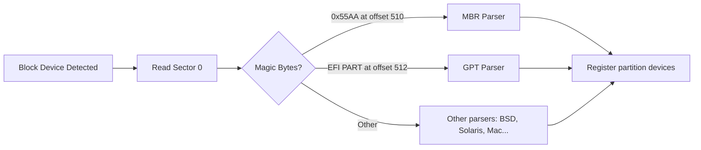

# Chapter 12: Partitioning

## 12.1 Introduction

Partitioning is the act of dividing a physical storage device into logical sections, each of which can be independently formatted, mounted, and managed. It is one of the earliest and most consequential decisions made during a Linux installation. A well-planned partition scheme improves security, simplifies backups, enables multi-boot configurations, and prevents runaway processes from consuming all disk space. A poorly planned one leads to midnight emergencies when `/var/log` fills the entire root filesystem.

This chapter covers the partition table formats (MBR and GPT), partition types and flags, alignment for performance, the tools available for partitioning, and best practices for different use cases.

## 12.2 Intuition: Why Partition?

Imagine a filing cabinet. You could dump everything into one drawer, or you could organize files into separate drawers: financial records, personnel files, project documents. Partitioning works the same way—logical separation on a single physical device.

**Practical benefits:**
- **Isolation**: A runaway log-filling process in `/var` won't crash the system by filling `/`
- **Security**: Mount `/tmp` with `noexec,nosuid` to prevent execution of uploaded binaries
- **Different filesystems**: Use XFS for databases, ext4 for general use, swap for memory management
- **Backup flexibility**: Image individual partitions independently
- **Multi-boot**: Separate OS installations share the same disk
- **Performance tuning**: Place frequently accessed data on faster parts of spinning disks

## 12.3 Internal Architecture

### 12.3.1 How the Kernel Sees Partitions

The Linux kernel represents partitions as sub-devices of the parent block device:

```
/dev/sda      → Entire disk
/dev/sda1     → First partition
/dev/sda2     → Second partition
/dev/nvme0n1  → NVMe disk
/dev/nvme0n1p1 → First NVMe partition
/dev/mmcblk0  → SD/eMMC card
/dev/mmcblk0p1 → First partition on SD card
```

The kernel's partition detection is handled by partition table parsers registered in `block/partitions/`. When a block device is detected, the kernel reads the first sector (and potentially the last for GPT backup header) and tries each parser:



### 12.3.2 MBR (Master Boot Record)

MBR is the legacy partitioning scheme dating to 1983 (IBM PC DOS 2.0).

**Structure:**

```
Offset  Size    Content
0x000   440 bytes  Bootstrap code (bootloader stage 1)
0x1B8   4 bytes    Disk signature (optional, Windows)
0x1BC   2 bytes    Usually 0x0000
0x1BE   16 bytes   Partition entry 1
0x1CE   16 bytes   Partition entry 2
0x1DE   16 bytes   Partition entry 3
0x1EE   16 bytes   Partition entry 4
0x1FE   2 bytes    Boot signature (0x55AA)
```

Each 16-byte partition entry contains:

```
Offset  Size  Content
0x00    1     Boot indicator (0x80 = active, 0x00 = inactive)
0x01    3     CHS address of first sector
0x04    1     Partition type (see below)
0x05    3     CHS address of last sector
0x08    4     LBA of first sector
0x0C    4     Number of sectors
```

**MBR Limitations:**
- Maximum 4 primary partitions (or 3 primary + 1 extended)
- Extended partitions contain linked-list logical partitions
- Maximum partition size: 2 TiB (with 512-byte sectors)
- No redundancy—single point of failure at sector 0
- No partition names or GUIDs

**Common MBR Type Codes:**

```
Code  Type
0x83  Linux
0x82  Linux swap
0x8e  Linux LVM
0x07  NTFS/exFAT/HPFS
0x0b  FAT32 (CHS)
0x0c  FAT32 (LBA)
0xef  EFI System Partition (on MBR—unusual)
0xfd  Linux RAID autodetect
```

### 12.3.3 GPT (GUID Partition Table)

GPT is part of the UEFI specification and is the modern standard.

**Structure:**

```
Sector 0:       Protective MBR (prevents legacy tools from seeing disk as empty)
Sector 1:       GPT Header
Sectors 2–33:   Partition Entry Array (128 entries × 128 bytes by default)
...
Last 33 sectors: Backup partition entries
Last sector:     Backup GPT Header
```

**GPT Header contains:**
- Disk GUID (unique identifier)
- Location of partition entries
- Number of partition entries
- CRC32 checksums (self-healing detection)

**Each GPT Partition Entry (128 bytes):**
- Partition Type GUID (identifies the purpose)
- Unique Partition GUID
- Starting and ending LBA
- Attributes (64-bit bitmask)
- Partition name (up to 36 UTF-16LE characters)

**Key GPT Type GUIDs:**

```
GUID                                    Type
C12A7328-F81F-11D2-BA4B-00A0C93EC93B   EFI System Partition
0FC63DAF-8483-4772-8E79-3D69D8477DE4   Linux filesystem
0657FD6D-A4AB-43C4-84E5-0933C84B4F4F   Linux swap
E6D6D379-F507-44C2-A23C-238F2A3DF928   Linux LVM
933AC7E1-2EB4-4F13-B844-0E14E2AEF915   Linux home
4F68BCE3-E8CD-4DB1-96E7-FBCAF984B709   Linux root (x86-64)
EBD0A0A2-B9E5-4433-87C0-68B6B72699C7   Microsoft basic data
DE94BBA4-06D1-4D40-A16A-BFD50179D6AC   Windows recovery
```

**GPT Advantages over MBR:**
- Up to 128 partitions by default (expandable)
- Supports disks larger than 2 TiB
- Redundant header (backup at end of disk)
- CRC32 checksums for integrity
- Named partitions
- No distinction between primary and extended partitions

### 12.3.4 MBR vs. GPT Comparison

```mermaid
graph TD
    subgraph MBR["MBR Partition Table"]
        M1["Bootstrap Code (440B)"]
        M2["4 Partition Entries (64B)"]
        M3["Boot Signature (2B)"]
        M4["...Unallocated Space..."]
        M1 --> M2 --> M3 --> M4
    end

    subgraph GPT["GPT Partition Table"]
        G1["Protective MBR"]
        G2["Primary GPT Header"]
        G3["128 Partition Entries (16KB)"]
        G4["...Partitions..."]
        G5["Backup Partition Entries"]
        G6["Backup GPT Header"]
        G1 --> G2 --> G3 --> G4 --> G5 --> G6
    end
```



| Feature | MBR | GPT |
|---------|-----|-----|
| Max partitions | 4 primary (or 3+1 extended) | 128 (default) |
| Max disk size | 2 TiB (512B sectors) | 8 ZiB |
| Redundancy | None | Backup header at disk end |
| Integrity | None | CRC32 checksums |
| Boot support | BIOS only | UEFI (and BIOS via protective MBR) |
| Partition names | No | Yes (36 UTF-16LE chars) |
| Partition IDs | 1-byte type code | 128-bit GUID |

## 12.4 Historical Evolution

### 12.4.1 The MBR Era (1983–2000s)

MBR was designed when 10 MB hard drives were large. The 2 TiB limit was unimaginable. The 4-partition limit reflected simple use cases: one OS, one data partition. Extended partitions were a hack to work around the limit, creating a linked list of logical partitions within a container partition.

### 12.4.2 The Transition Period (2000s–2010s)

As drives exceeded 2 TiB, MBR became obsolete. Intel developed GPT as part of the EFI specification (originally for Itanium). The protective MBR ensures that legacy MBR tools see the disk as one large partition rather than empty space, preventing accidental overwrites.

### 12.4.3 Modern GPT (2010s–Present)

GPT is now standard on all modern systems. Even BIOS-only systems can use GPT through the BIOS Boot Partition (a small partition for GRUB's second stage). The `gdisk` and `sgdisk` tools handle both creation and conversion.

## 12.5 Partition Types and Flags

### 12.5.1 Linux-Specific Partition Roles

**Root (`/`):**
The base filesystem containing the kernel, boot files, system configuration, and package-managed software.

**Swap:**
Used as virtual memory—when physical RAM is exhausted, the kernel moves inactive pages to swap. Can be a partition or a file.

```bash
# Create swap partition
sudo mkswap /dev/sda2
sudo swapon /dev/sda2

# Create swap file (alternative)
sudo fallocate -l 4G /swapfile
sudo chmod 600 /swapfile
sudo mkswap /swapfile
sudo swapon /swapfile
```

**EFI System Partition (ESP):**
Required for UEFI boot. Contains bootloader EFI binaries. Must be FAT32, typically 100–512 MB.

**BIOS Boot Partition:**
Required when using GPT with BIOS firmware. GRUB stores its second-stage code here. Typically 1 MB, no filesystem.

**Home (`/home`):**
User data and configuration. Separating from root allows OS reinstallation without data loss.

**`/boot`:**
Contains kernel and initramfs. On BIOS systems, this must be accessible to the bootloader. On UEFI systems with ESP, a separate `/boot` is optional.

### 12.5.2 Partition Flags in GPT

```
Flag                    Bit    Effect
Required/legacy BIOS    0      Marks partition as required for boot
No block I/O            1      Partition not exposed as block device
Hidden                  4      Not assigned a drive letter (Windows)
Do not automount        63     Prevent automounting
```

Linux-specific flags are typically managed through partition type GUIDs rather than attribute bits.

## 12.6 Partition Alignment

### 12.6.1 Why Alignment Matters

Modern storage devices have physical sector sizes that differ from the logical sector size presented to the OS:

- **HDDs**: Often 4096-byte physical sectors, 512-byte logical (512e)
- **SSDs**: Typically 4096-byte or larger erase blocks
- **NVMe**: 4096-byte or larger physical sectors
- **RAID**: Stripe sizes typically 64 KiB, 128 KiB, or larger

Misalignment causes a single logical I/O to span two physical sectors, doubling the I/O operations:

```
Misaligned (bad):
Physical sector:  [  Sector 1  ][  Sector 2  ][  Sector 3  ]
Logical I/O:           [=======DATA=======]
                       ↑ spans two physical sectors = 2 I/Os

Aligned (good):
Physical sector:  [  Sector 1  ][  Sector 2  ][  Sector 3  ]
Logical I/O:                [=======DATA=======]
                            ↑ fits in one physical sector = 1 I/O
```

### 12.6.2 Modern Alignment Standards

The modern standard is **1 MiB alignment** (sector 2048 for 512-byte sectors). This aligns with:
- All common physical sector sizes (512, 4096, 8192)
- Common RAID stripe sizes (multiples of 64 KiB)
- SSD erase block sizes (multiples of 4 KiB)

```bash
# Verify alignment of existing partitions
sudo parted /dev/sda align-check optimal 1
# 1 aligned

# Check with fdisk
sudo fdisk -l /dev/sda
# Start sectors should be multiples of 2048 (for 512B sectors)
# or multiples of 256 (for 4K native sectors)
```

### 12.6.3 Alignment in Practice

Modern partitioning tools default to 1 MiB alignment:

```bash
# fdisk defaults to 2048-sector alignment (1 MiB)
sudo fdisk /dev/sda

# parted: set unit to ensure alignment
sudo parted /dev/sda
(parted) mkpart primary ext4 1MiB 100%

# sgdisk: automatic alignment
sudo sgdisk -n 1:0:+10G /dev/sda
```

## 12.7 Partitioning Tools

### 12.7.1 fdisk (MBR and GPT)

```bash
# Interactive mode
sudo fdisk /dev/sda

# Common commands within fdisk:
# m - help
# p - print partition table
# n - new partition
# d - delete partition
# t - change partition type
# w - write changes
# q - quit without saving

# Scripted partitioning
echo -e "g\nn\n1\n\n+512M\nn\n2\n\n+50G\nn\n3\n\n\nt\n1\n1\nt\n2\n19\nw" | sudo fdisk /dev/sda
```

### 12.7.2 sgdisk (GPT, scriptable)

```bash
# Create partitions
sudo sgdisk -n 1:0:+512M -t 1:ef00 -c 1:"EFI" /dev/sda
sudo sgdisk -n 2:0:+50G -t 2:8300 -c 2:"root" /dev/sda
sudo sgdisk -n 3:0:+8G -t 3:8200 -c 3:"swap" /dev/sda
sudo sgdisk -n 4:0:0 -t 4:8300 -c 4:"home" /dev/sda

# Print partition table
sudo sgdisk -p /dev/sda

# Delete all partitions
sudo sgdisk -Z /dev/sda

# Copy partition table from one disk to another
sudo sgdisk -R /dev/sdb /dev/sda
sudo sgdisk -G /dev/sdb  # Randomize disk GUID
```

### 12.7.3 parted (MBR and GPT)

```bash
# Interactive mode
sudo parted /dev/sda

# Scripted
sudo parted -s /dev/sda \
    mklabel gpt \
    mkpart primary fat32 1MiB 513MiB \
    set 1 esp on \
    mkpart primary ext4 513MiB 50GiB \
    mkpart primary linux-swap 50GiB 58GiB \
    mkpart primary ext4 58GiB 100%

# Check alignment
sudo parted /dev/sda align-check optimal 1
```

### 12.7.4 gdisk (GPT expert)

```bash
# Interactive mode with expert options
sudo gdisk /dev/sda

# Key commands:
# o - create new GPT
# n - new partition
# t - change type
# x - expert mode (recovery, alignment fixes)
# w - write and exit
```

### 12.7.5 Comparison of Tools

```
┌──────────┬─────┬─────┬────────────┬────────────┐
│  Tool    │ MBR │ GPT │ Scriptable │ Recovery   │
├──────────┼─────┼─────┼────────────┼────────────┤
│ fdisk    │  ✓  │  ✓  │   Limited  │   Basic    │
│ sgdisk   │  ✗  │  ✓  │   Excellent│   Good     │
│ parted   │  ✓  │  ✓  │   Good     │   Basic    │
│ gdisk    │  ✗  │  ✓  │   Limited  │   Excellent│
│ cfdisk   │  ✓  │  ✓  │   No       │   Basic    │
│ cgdisk   │  ✗  │  ✓  │   No       │   Good     │
└──────────┴─────┴─────┴────────────┴────────────┘
```

## 12.8 Partition Scheme Recommendations

### 12.8.1 Desktop (Simple)

```
Partition  Type          Size       Mount
1          EFI System    512 MiB    /boot/efi
2          Linux root    Rest       /
```

Or with swap file instead of partition:

```bash
# Create swap file after installation
sudo fallocate -l 8G /swapfile
sudo chmod 600 /swapfile
sudo mkswap /swapfile
echo '/swapfile none swap sw 0 0' | sudo tee -a /etc/fstab
```

### 12.8.2 Server (Recommended)

```
Partition  Type          Size       Mount      Notes
1          EFI System    512 MiB    /boot/efi  UEFI boot
2          BIOS Boot     1 MiB      (none)     GRUB on GPT+BIOS
3          Linux boot    1 GiB      /boot      Kernels, initramfs
4          Linux LVM     Rest       (PV)       Flexible volumes
  ├─ LV    ext4          30 GiB    /           Root filesystem
  ├─ LV    ext4          20 GiB    /var        Logs, packages, databases
  ├─ LV    ext4          10 GiB    /home       User data (if needed)
  ├─ LV    ext4          5 GiB     /tmp        Temporary files
  └─ LV    swap          RAM-sized  [swap]     Virtual memory
```

### 12.8.3 High-Security Server

```
Partition  Type          Size       Mount      Options
1          EFI System    512 MiB    /boot/efi  
2          Linux boot    1 GiB      /boot      Unencrypted, verified
3          LUKS          Rest       (PV)       Encrypted LVM
  ├─ LV    ext4          30 GiB    /           Encrypted
  ├─ LV    ext4          20 GiB    /var        Encrypted
  └─ LV    swap          RAM-sized  [swap]     Encrypted swap
```

### 12.8.4 Multi-boot (Windows + Linux)

```
Partition  Type                    Size       Notes
1          EFI System              512 MiB    Shared ESP
2          Microsoft Reserved      16 MiB     Windows
3          Microsoft Basic Data    100+ GiB   Windows C:
4          Microsoft Recovery      ~500 MiB   Windows recovery
5          Linux boot              1 GiB      Linux kernels
6          Linux LVM or root       50+ GiB    Linux root
7          Linux swap              8 GiB      Swap
8          Shared Data             Rest       exFAT or NTFS
```

## 12.9 Advanced Partitioning Topics

### 12.9.1 Partition Table Conversion (MBR to GPT)

```bash
# Convert MBR to GPT non-destructively using gdisk
sudo gdisk /dev/sda
# Command: w (write) — gdisk auto-converts

# Or using sgdisk
sudo sgdisk --gpttombr /dev/sda  # MBR to GPT (not this way around)

# Backup first!
sudo sgdisk --backup=/tmp/sda-backup.bin /dev/sda
```

### 12.9.2 Partition Resizing

```bash
# Resize partition with parted
sudo parted /dev/sda
(parted) resizepart 4 100%

# Resize filesystem on the partition
sudo resize2fs /dev/sda4          # ext4
sudo xfs_growfs /mountpoint       # XFS (grow only)

# For shrinking: shrink filesystem first, then partition
sudo resize2fs /dev/sda4 50G     # Shrink ext4 to 50G
sudo parted /dev/sda
(parted) resizepart 4 51G         # Resize partition slightly larger
```

### 12.9.3 Disk Cloning with Partition Awareness

```bash
# Clone partition table only
sudo sgdisk --backup=pt.bin /dev/sda
sudo sgdisk --load-backup=pt.bin /dev/sdb
sudo sgdisk -G /dev/sdb  # New random GUIDs

# Clone entire disk (including partition table)
sudo dd if=/dev/sda of=/dev/sdb bs=4M status=progress

# Clone specific partition
sudo dd if=/dev/sda1 of=/dev/sdb1 bs=4M status=progress
```

## 12.10 Common Pitfalls

### 12.10.1 Out-of-Space on `/boot`

Kernels accumulate in `/boot` over time. A small `/boot` partition fills up, preventing kernel updates.

```bash
# Check /boot usage
df -h /boot
ls -la /boot/vmlinuz-*

# Remove old kernels (Debian/Ubuntu)
sudo apt autoremove --purge

# Remove old kernels (RHEL/Fedora)
sudo dnf remove $(dnf repoquery --installonly --latest-limit=-2)
```

### 12.10.2 Forgetting the ESP

UEFI systems require an EFI System Partition. Forgetting it means the system won't boot.

### 12.10.3 Wrong Partition Type GUID

Using the wrong type GUID causes the bootloader or OS to misidentify partitions:

```bash
# Set correct type for ESP
sudo sgdisk -t 1:ef00 /dev/sda

# Set correct type for Linux root
sudo sgdisk -t 2:8300 /dev/sda

# Set correct type for swap
sudo sgdisk -t 3:8200 /dev/sda
```

### 12.10.4 Partition Numbering Changes

When partitions are deleted, remaining partitions may renumber. Use UUIDs in `/etc/fstab` rather than device names:

```bash
# Good: UUID-based
UUID=abcd-1234  /  ext4  errors=remount-ro  0  1

# Bad: Device-based (may change)
/dev/sda2  /  ext4  errors=remount-ro  0  1
```

### 12.10.5 Running Out of Primary Partitions (MBR)

MBR allows only 4 primary partitions. The 4th must be an extended partition if you need more than 4 total.

## 12.11 Best Practices

1. **Always use GPT** unless supporting legacy BIOS on old hardware
2. **1 MiB alignment** for all partitions (default in modern tools)
3. **Use LVM** for flexible storage management on servers
4. **Separate `/home`** on desktop systems for data preservation during OS reinstalls
5. **Separate `/var`** on servers to prevent log/package growth from filling root
6. **Use UUIDs** in fstab, not device names
7. **Document your partition layout** — save `sgdisk -p` output and `lsblk -f`
8. **Leave unallocated space** for future needs (10-20% on LVM)
9. **Size `/boot` generously** — 1 GiB prevents kernel accumulation issues
10. **Test partition changes in a VM** before applying to production

## 12.12 Exercises

### Exercise 1: GPT Partitioning
Using `sgdisk` or `gdisk`, create a GPT partition table on a new disk with: a 512 MiB ESP, a 1 GiB boot partition, a 50 GiB root partition, and the rest as an LVM partition. Verify alignment.

### Exercise 2: MBR vs. GPT Comparison
Create both MBR and GPT partition tables on two separate virtual disks. Compare the output of `fdisk -l`, `gdisk -l`, and `parted print` for each.

### Exercise 3: Partition Table Recovery
Intentionally corrupt the backup GPT header on a test disk using `dd`. Then use `gdisk` to recover it. Document the recovery process.

### Exercise 4: Alignment Verification
Write a script that checks all partitions on all block devices for proper alignment and reports any misaligned partitions.

### Exercise 5: Migration Planning
Given a 500 GB disk with MBR partitioning and 3 primary partitions (Windows, Linux root, Linux swap), plan the migration to GPT with additional partitions for `/home` and `/var`. Document the steps including backup strategy.

## 12.13 References

- [GNU Parted Manual](https://www.gnu.org/software/parted/manual/)
- [GPT fdisk (sgdisk/gdisk) Documentation](https://www.rodsbooks.com/gdisk/)
- [Wikipedia: GUID Partition Table](https://en.wikipedia.org/wiki/GUID_Partition_Table)
- [Wikipedia: Master Boot Record](https://en.wikipedia.org/wiki/Master_boot_record)
- [UEFI Specification](https://uefi.org/specifications)
- [Linux Kernel Partition Handling](https://www.kernel.org/doc/html/latest/block/)
- [Storage Administration Guide (Red Hat)](https://docs.redhat.com/en/documentation/red_hat_enterprise_linux/9/html/managing_file_systems/)
