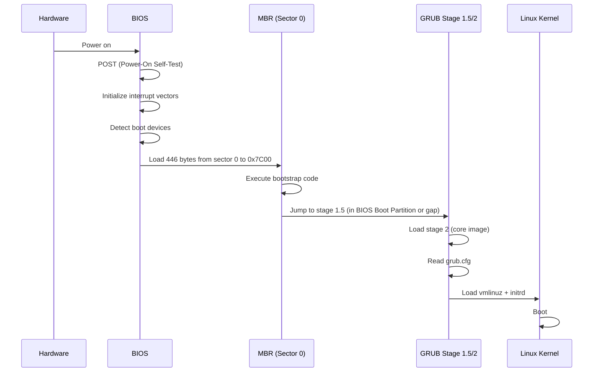
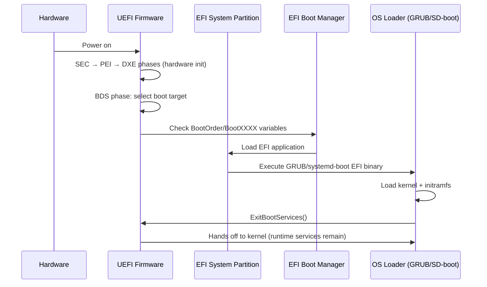

# Chapter 13: UEFI and BIOS

## 13.1 Introduction

The firmware interface—the software that runs before the operating system—determines how hardware initializes, how the bootloader executes, and what security features are available. For decades, the IBM PC-compatible BIOS (Basic Input/Output System) was the universal standard. The Unified Extensible Firmware Interface (UEFI) replaced it, bringing a modern architecture with larger disk support, faster boot times, network capabilities, and a security framework.

Understanding both firmware types is essential for Linux administrators. You will encounter both in the field, and misconfiguring firmware settings is a common source of unbootable systems.

## 13.2 Intuition: Firmware as the Hardware-OS Contract

Think of firmware as the contract between hardware and software. When you press the power button:

1. **Firmware initializes hardware** — CPU, RAM, storage controllers, display
2. **Firmware runs self-tests** — POST (Power-On Self-Test)
3. **Firmware selects a boot device** — Based on boot order
4. **Firmware loads and executes the bootloader** — From disk or network
5. **The bootloader loads the OS kernel** — And hands off control

BIOS and UEFI differ in how they perform each of these steps, with UEFI offering a more sophisticated, extensible, and secure approach.

## 13.3 BIOS (Basic Input/Output System)

### 13.3.1 Architecture

BIOS is a 16-bit real-mode firmware. Its architecture reflects the original IBM PC from 1981:

```
┌──────────────────────────────────────────────┐
│                BIOS Firmware                   │
│  ┌─────────────┐  ┌──────────────────────┐   │
│  │  POST        │  │  Interrupt Handlers  │   │
│  │  (hardware   │  │  (INT 13h disk,      │   │
│  │   init)      │  │   INT 10h video,     │   │
│  │              │  │   INT 16h keyboard)  │   │
│  └──────┬───────┘  └──────────┬───────────┘   │
│         │                     │               │
│  ┌──────▼─────────────────────▼───────────┐   │
│  │  CMOS/RTC Settings (NVRAM)             │   │
│  │  - Boot order, date/time, hardware cfg │   │
│  └────────────────────────────────────────┘   │
└──────────────────────────────────────────────┘
           │
           ▼
┌──────────────────────────────────┐
│  MBR Boot Sector (512 bytes)     │
│  - Bootstrap code                 │
│  - Partition table                │
│  - Boot signature (0x55AA)       │
└──────────────────────────────────┘
```

### 13.3.2 BIOS Boot Process



### 13.3.3 BIOS Interrupts

BIOS provides hardware access through software interrupts:

```
INT 13h — Disk Services
  AH=02h  Read sectors
  AH=03h  Write sectors
  AH=08h  Get drive parameters
  AH=41h  Extensions check
  AH=42h  Extended read (LBA)
  AH=43h  Extended write (LBA)

INT 10h — Video Services
  AH=00h  Set video mode
  AH=02h  Set cursor position
  AH=0Eh  Teletype output

INT 16h — Keyboard Services
  AH=00h  Read keystroke
  AH=01h  Check for keystroke
```

### 13.3.4 BIOS Limitations

- **16-bit real mode**: Limited to 1 MiB address space (with A20 gate workaround)
- **MBR only**: 2 TiB disk limit, 4 primary partitions
- **No standard runtime services**: OS cannot call back into firmware
- **No security framework**: No verified boot chain
- **Sequential initialization**: Slower boot
- **No network stack**: Cannot boot from network natively (requires PXE ROM)

## 13.4 UEFI (Unified Extensible Firmware Interface)

### 13.4.1 Architecture

UEFI is a modern, modular firmware specification:

```
┌──────────────────────────────────────────────────────────┐
│                    UEFI Firmware                           │
│  ┌──────────────┐  ┌──────────────────────────────────┐  │
│  │  SEC Phase   │  │  UEFI Drivers                    │  │
│  │  (Security)  │  │  - Storage (NVMe, AHCI, SCSI)   │  │
│  └──────┬───────┘  │  - Network (PXE, HTTP)           │  │
│  ┌──────▼───────┐  │  - Filesystem (FAT, NTFS)        │  │
│  │  PEI Phase   │  │  - USB, Graphics, Console        │  │
│  │  (Pre-EFI    │  └──────────────────────────────────┘  │
│  │   Init)      │                                        │
│  └──────┬───────┘  ┌──────────────────────────────────┐  │
│  ┌──────▼───────┐  │  UEFI Applications               │  │
│  │  DXE Phase   │  │  - Boot Manager                  │  │
│  │  (Driver     │  │  - Shell (UEFI Shell)            │  │
│  │   Execution) │  │  - OS Loaders (GRUB, systemd-boot)│ │
│  └──────┬───────┘  └──────────────────────────────────┘  │
│  ┌──────▼───────┐  ┌──────────────────────────────────┐  │
│  │  BDS Phase   │  │  UEFI Runtime Services           │  │
│  │  (Boot Device│  │  - Variable services              │  │
│  │   Selection) │  │  - Time services                  │  │
│  └──────────────┘  │  - Virtual memory services        │  │
│                    │  - Reset services                  │  │
│                    └──────────────────────────────────┘  │
│  ┌────────────────────────────────────────────────────┐  │
│  │  UEFI Configuration (Setup/Settings UI)            │  │
│  └────────────────────────────────────────────────────┘  │
└──────────────────────────────────────────────────────────┘
           │
           ▼
┌──────────────────────────────────┐
│  EFI System Partition (ESP)      │
│  FAT32 filesystem                │
│  /EFI/BOOT/BOOTX64.EFI          │
│  /EFI/ubuntu/grubx64.efi        │
│  /EFI/fedora/grubx64.efi        │
└──────────────────────────────────┘
```

### 13.4.2 UEFI Boot Process



### 13.4.3 UEFI Boot Variables

UEFI stores boot configuration in NVRAM variables:

```bash
# View all UEFI boot variables
efibootmgr -v

# Output example:
# Boot0000* ubuntu	HD(1,GPT,...)/File(\EFI\ubuntu\grubx64.efi)
# Boot0001* Windows Boot Manager	HD(1,GPT,...)/File(\EFI\Microsoft\Boot\bootmgfw.efi)
# BootOrder: 0000,0001

# Change boot order
sudo efibootmgr -o 0000,0001

# Create new boot entry
sudo efibootmgr -c -d /dev/sda -p 1 -L "My Linux" -l '\EFI\mylinux\grubx64.efi'

# Delete boot entry
sudo efibootmgr -b 0002 -B

# Set boot next (one-time)
sudo efibootmgr -n 0001
```

### 13.4.4 EFI System Partition (ESP)

The ESP is a FAT32 partition that contains EFI bootloaders:

```bash
# Typical ESP layout
/boot/efi/
├── EFI/
│   ├── BOOT/
│   │   └── BOOTX64.EFI          # Fallback bootloader
│   ├── ubuntu/
│   │   ├── grubx64.efi           # GRUB EFI binary
│   │   ├── shimx64.efi           # Secure Boot shim
│   │   └── grub.cfg              # GRUB configuration
│   ├── fedora/
│   │   ├── grubx64.efi
│   │   ├── shimx64.efi
│   │   └── fonts/
│   ├── Microsoft/
│   │   └── Boot/
│   │       ├── bootmgfw.efi      # Windows bootloader
│   │       └── BCD               # Windows boot config
│   └── tools/
│       └── memtest86.efi         # Memory test tool
└── System Volume Information/    # Windows system restore
```

**ESP Requirements:**
- Filesystem: FAT32 (FAT16 acceptable, exFAT not supported by most firmware)
- Size: 100–512 MiB (512 MiB recommended for multiple OSes)
- Mount point: `/boot/efi` (conventional)
- Partition type: EFI System (GUID: C12A7328-F81F-11D2-BA4B-00A0C93EC93B)

```bash
# Create ESP
sudo mkfs.fat -F32 /dev/sda1

# Mount ESP
sudo mkdir -p /boot/efi
sudo mount /dev/sda1 /boot/efi

# Add to fstab (use UUID)
UUID=ABCD-1234  /boot/efi  vfat  umask=0077  0  1
```

### 13.4.5 UEFI Shell

The UEFI Shell provides an interactive command-line environment:

```
Shell> help                      # List commands
Shell> map                       # List mapped devices
Shell> ls fs0:\EFI\              # List EFI directory
Shell> fs0:\EFI\ubuntu\grubx64.efi   # Launch GRUB
Shell> dmpstore                  # Dump UEFI variables
Shell> bcfg boot dump            # Show boot configuration
Shell> edit fs0:\EFI\ubuntu\grub.cfg  # Edit config file
```

### 13.4.6 UEFI Runtime Services

Unlike BIOS, UEFI provides runtime services available to the OS after boot:

```bash
# Access UEFI variables from Linux
ls /sys/firmware/efi/efivars/

# Read a specific variable
cat /sys/firmware/efi/efivars/BootOrder-8be4df61-93ca-11d2-aa0d-00e098032b8c | hexdump -C

# efivarfs filesystem
mount -t efivarfs efivarfs /sys/firmware/efi/efivars

# Linux efivar library
efivar -l                           # List all variables
efivar -n BootOrder                 # Read BootOrder
```

## 13.5 CSM (Compatibility Support Module)

### 13.5.1 What is CSM?

The CSM is a UEFI module that provides BIOS compatibility. It allows UEFI firmware to boot legacy BIOS-mode operating systems:

```
┌──────────────────────────────────┐
│         UEFI Firmware            │
│  ┌────────────────────────────┐  │
│  │  Native UEFI Boot Path    │  │
│  │  (GPT + EFI binaries)     │  │
│  └────────────────────────────┘  │
│  ┌────────────────────────────┐  │
│  │  CSM (Legacy BIOS mode)   │  │
│  │  - Emulates INT 13h etc.  │  │
│  │  - Reads MBR boot sector  │  │
│  │  - 16-bit real mode       │  │
│  └────────────────────────────┘  │
└──────────────────────────────────┘
```

### 13.5.2 CSM Implications

When CSM is enabled:
- The system can boot in either UEFI or BIOS mode
- Boot mode depends on the boot device's partition table
- GPT disk with ESP → UEFI boot
- MBR disk with boot sector → BIOS boot

**Common problem:** Installing Linux in BIOS mode on a system with Windows installed in UEFI mode (or vice versa). The GRUB installed for one mode cannot chainload the other OS.

### 13.5.3 Disabling CSM

For modern systems, disabling CSM is recommended:
- Ensures consistent UEFI boot
- Required for Secure Boot on most systems
- Prevents accidental BIOS-mode installations
- Faster boot (no CSM initialization)

## 13.6 UEFI Variables Deep Dive

### 13.6.1 Variable Structure

Each UEFI variable has:
- **Name**: Unicode string
- **GUID**: Vendor identifier
- **Attributes**: Read/write, boot service access, runtime access, non-volatile
- **Data**: Binary blob

### 13.6.2 Key UEFI Variables

```bash
# Boot configuration
BootOrder    # Ordered list of BootXXXX entries
BootXXXX     # Individual boot entry (device path + description)
BootNext     # One-time boot entry for next boot
BootCurrent  # Currently active boot entry

# Security
SecureBoot   # Secure Boot state (0=disabled, 1=enabled)
PK           # Platform Key
KEK          # Key Exchange Key
db           # Allowed Signatures Database
dbx          # Forbidden Signatures Database (revocation list)

# Platform
PlatformLang # System language
Timeout      # Boot menu timeout
ConIn        # Console input device
ConOut       # Console output device
ErrOut       # Error output device
```

### 13.6.3 Managing UEFI Variables from Linux

```bash
# List all variables
ls /sys/firmware/efi/efivars/

# Use efibootmgr for boot variables
sudo efibootmgr -v

# Use efivar for arbitrary variables
sudo efivar -l
sudo efivar -n SecureBoot

# Direct manipulation (dangerous!)
echo -ne "\x07\x00\x00\x00" > /sys/firmware/efi/efivars/TestVar-12345678-1234-1234-1234-123456789abc

# Protected variables (immutable bit set) cannot be written from Linux
sudo chattr -i /sys/firmware/efi/efivars/SecureBoot-8be4df61-93ca-11d2-aa0d-00e098032b8c
```

## 13.7 Firmware Settings for Linux

### 13.7.1 Essential UEFI Settings

```
Setting                    Recommended    Notes
Secure Boot                Enabled        See Chapter 15
CSM/Legacy Support         Disabled       Use UEFI-only
Fast Boot                  Disabled       May skip USB initialization
Wake-on-LAN                As needed      For remote servers
TPM                        Enabled        For disk encryption
Virtualization (VT-x/AMD-V) Enabled      For KVM support
Intel VT-d / AMD-Vi        Enabled        For IOMMU/PCI passthrough
AHCI Mode                  Enabled        For SATA (vs IDE/RAID)
Above 4G Decoding          Enabled        For large PCI BARs
Resizable BAR              Enabled        For GPU memory mapping
```

### 13.7.2 Accessing UEFI Settings from Linux

```bash
# Access UEFI settings via fwupd
sudo fwupdmgr get-bios-settings

# Change UEFI settings (if supported)
sudo fwupdmgr set-bios-setting SettingName Value

# Access via sysfs (read-only, vendor-specific)
ls /sys/firmware/acpi/
cat /sys/firmware/acpi/tables/DSDT > dsdt.dat  # Dump DSDT
```

### 13.7.3 BIOS Settings Access

BIOS settings can only be changed through the setup utility (accessed by pressing Del, F2, F12, etc. during POST). There is no standard Linux interface for BIOS settings.

Some vendor-specific tools exist:

```bash
# HP BIOS configuration
sudo hp-bios-config --get
sudo hp-bios-config --set "Virtualization Technology" "Enable"

# Dell BIOS configuration
sudo cctk --virtualization=enabled
```

## 13.8 Historical Evolution

### 13.8.1 Timeline

```
1975: CP/M BIOS concept
1981: IBM PC BIOS (original)
1983: MBR partition scheme
1990s: Plug and Play BIOS
1996: ACPI (Advanced Configuration and Power Interface)
2000: Intel EFI specification (for Itanium)
2005: EFI 1.10 specification
2006: Apple adopts EFI for Intel Macs
2007: UEFI Forum releases UEFI 2.0
2010: UEFI 2.3 (Secure Boot added)
2012: Windows 8 requires UEFI
2015: UEFI 2.5
2019: UEFI 2.8
2021: UEFI 2.9
2023: UEFI 2.10
```

### 13.8.2 Why UEFI Won

The transition from BIOS to UEFI was driven by:

1. **Disk size limits**: MBR's 2 TiB limit was becoming a real constraint
2. **Boot speed**: UEFI's parallel initialization is faster than BIOS's sequential POST
3. **Security**: Secure Boot addresses bootkit threats
4. **Extensibility**: UEFI applications and drivers can be loaded from any filesystem
5. **Networking**: Built-in network stack for remote management
6. **Standardization**: UEFI Forum includes Intel, AMD, ARM, Microsoft, Linux vendors

## 13.9 Design Rationale

### Why Keep BIOS Compatibility?

Despite UEFI's advantages, BIOS compatibility persists because:
- Legacy operating systems and tools expect BIOS
- Embedded systems and industrial controllers use BIOS
- Some bootable rescue tools are BIOS-only
- Virtual machines may default to BIOS for compatibility
- The CSM provides this compatibility at minimal cost

### Why Secure Boot in UEFI?

Secure Boot addresses a real threat: bootkits that modify the bootloader or kernel before the OS loads. By establishing a chain of trust from firmware to OS, Secure Boot ensures that only signed code executes during the boot process.

### Why FAT32 for ESP?

FAT32 was chosen because:
- Every operating system can read/write FAT32
- Simple implementation (firmware doesn't need complex filesystem drivers)
- Well-understood and stable specification
- Long filename support
- Adequate for bootloader binaries (typically < 10 MB)

## 13.10 Diagnosing Firmware Issues

### 13.10.1 System Won't Boot After Installation

```bash
# From live USB, check:
# 1. Is ESP present and formatted?
sudo fdisk -l /dev/sda
sudo blkid /dev/sda1

# 2. Are EFI binaries present?
sudo mount /dev/sda1 /mnt/boot/efi
ls -la /mnt/boot/efi/EFI/

# 3. Is firmware set to correct mode?
ls /sys/firmware/efi   # Should exist for UEFI

# 4. Is there a boot entry?
sudo efibootmgr -v

# 5. Check if GRUB is properly installed
sudo mount /dev/sda2 /mnt
sudo mount /dev/sda1 /mnt/boot/efi
for dir in dev proc sys run; do sudo mount --bind /$dir /mnt/$dir; done
sudo chroot /mnt
grub-install --target=x86_64-efi --efi-directory=/boot/efi
update-grub
exit
```

### 13.10.2 Firmware Doesn't Recognize Boot Device

```bash
# If efibootmgr shows no entries for your OS:
sudo efibootmgr -c -d /dev/sda -p 1 -L "Ubuntu" -l '\EFI\ubuntu\shimx64.efi'

# If the ESP is not FAT32:
sudo mkfs.fat -F32 /dev/sda1
sudo mount /dev/sda1 /mnt/boot/efi
sudo grub-install --target=x86_64-efi --efi-directory=/boot/efi

# Fallback: copy bootloader to default path
sudo mkdir -p /mnt/boot/efi/EFI/BOOT
sudo cp /mnt/boot/efi/EFI/ubuntu/shimx64.efi /mnt/boot/efi/EFI/BOOT/BOOTX64.EFI
```

### 13.10.3 Checking Firmware Type from Linux

```bash
# Check if booted in UEFI mode
[ -d /sys/firmware/efi ] && echo "UEFI" || echo "BIOS"

# Detailed firmware info
sudo dmidecode -t bios
# or
sudo cat /sys/class/dmi/id/bios_vendor
sudo cat /sys/class/dmi/id/bios_version

# Check boot mode
[ -f /sys/firmware/efi/fw_platform_size ] && cat /sys/firmware/efi/fw_platform_size
# 64 = 64-bit UEFI, 32 = 32-bit UEFI
```

## 13.11 Best Practices

1. **Always use UEFI** on modern hardware — disable CSM
2. **Disable Fast Boot** during installation — it may skip USB initialization
3. **Size ESP at 512 MiB** — accommodates multiple OSes and tools
4. **Use `efibootmgr`** to verify boot entries after installation
5. **Keep firmware updated** — security fixes and hardware compatibility
6. **Document firmware settings** — especially for server fleets
7. **Back up UEFI variables** — `efivar -l` and NVRAM dump
8. **Use fallback bootloader path** — `\EFI\BOOT\BOOTX64.EFI` for portability
9. **Test with Secure Boot enabled** — don't disable it as a workaround
10. **Use `fwupdmgr`** for firmware updates when supported

## 13.12 Exercises

### Exercise 1: Firmware Identification
Write a script that determines whether a system is booted in UEFI or BIOS mode, reports the firmware vendor and version, and lists all boot entries.

### Exercise 2: ESP Management
Create an EFI System Partition, format it as FAT32, install GRUB for UEFI, and create a custom boot entry using `efibootmgr`. Verify the entry survives a reboot (in a VM).

### Exercise 3: UEFI Variable Manipulation
Using `efibootmgr` and `efivar`, examine the UEFI boot configuration on a system. Change the boot order, set a one-time boot entry, and verify the changes.

### Exercise 4: Boot Chain Diagram
For a UEFI system with GRUB and Secure Boot, draw the complete boot chain from power-on to kernel execution, showing where each verification step occurs.

### Exercise 5: Firmware Recovery
A system has lost its UEFI boot entries (e.g., after a BIOS reset). Using a live USB, restore the boot configuration for a Linux installation on `/dev/sda` with ESP on `/dev/sda1`.

## 13.13 References

- [UEFI Specification](https://uefi.org/specifications)
- [UEFI Forum](https://uefi.org/)
- [efibootmgr Documentation](https://linux.die.net/man/8/efibootmgr)
- [Rod Smith's EFI Boot Loaders for Linux](https://www.rodsbooks.com/efi-bootloaders/)
- [Arch Linux: UEFI](https://wiki.archlinux.org/title/Unified_Extensible_Firmware_Interface)
- [Intel EFI Development Kit](https://github.com/tianocore/edk2)
- [Wikipedia: UEFI](https://en.wikipedia.org/wiki/Unified_Extensible_Firmware_Interface)
- [Linux Kernel EFI Documentation](https://www.kernel.org/doc/html/latest/admin-guide/efi-stub.html)
