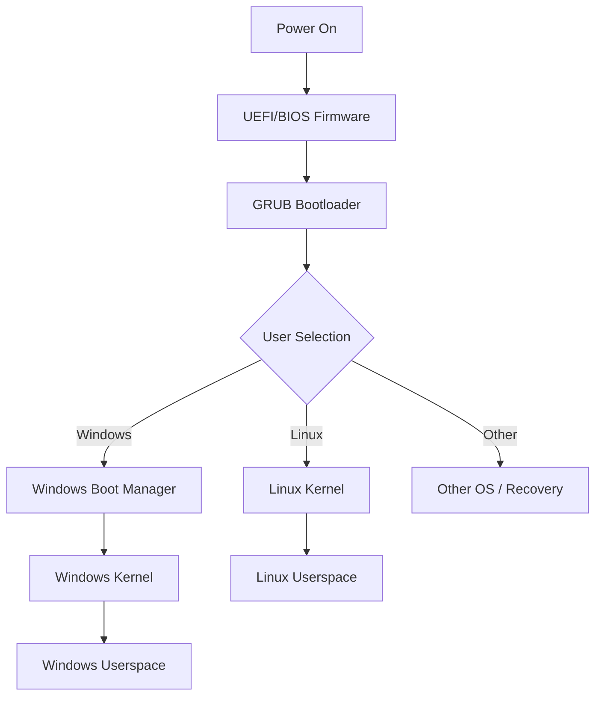
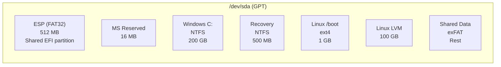

# Chapter 14: Dual Boot

## 14.1 Introduction

Dual booting—the practice of installing multiple operating systems on a single computer and selecting which to run at startup—remains a common requirement. Developers need Linux for development and Windows for testing. Engineers run specialized software that only exists on one platform. Students learn multiple operating systems without multiple machines.

While virtual machines and containers have reduced the need for dual booting, certain workloads (gaming, GPU-intensive applications, hardware-specific software, performance benchmarking) still benefit from bare-metal access to hardware. This chapter covers the mechanics of multi-boot configurations, with a focus on Windows/Linux coexistence.

## 14.2 Intuition: How Multi-Boot Works

At its core, multi-boot is simple: multiple operating systems share a computer, but only one runs at a time. The bootloader presents a menu at startup, and the user selects which OS to launch.

The complexity lies in:
- **Shared hardware**: Both OSes must agree on partition layout, firmware mode, and clock settings
- **Bootloader conflicts**: Each OS wants its bootloader to be the default
- **Firmware mode**: Both must use the same firmware mode (UEFI or BIOS)
- **Filesystem access**: Reading the other OS's partitions safely
- **Updates**: OS updates can overwrite the bootloader



## 14.3 Internal Architecture

### 14.3.1 Bootloader Chainloading

Chainloading is the technique where one bootloader hands off to another. In a Windows/Linux dual boot:

```
UEFI → GRUB → Windows Boot Manager → Windows kernel
UEFI → GRUB → Linux kernel
```

GRUB doesn't directly load Windows. Instead, it loads the Windows EFI bootloader, which then loads the Windows kernel. This is chainloading.

### 14.3.2 EFI Boot Entries

In UEFI mode, each OS registers its own boot entry in NVRAM:

```bash
# View boot entries
efibootmgr -v

# Boot0000* ubuntu	HD(1,GPT{uuid},0x800,0x100000)/File(\EFI\ubuntu\shimx64.efi)
# Boot0001* Windows Boot Manager	HD(1,GPT{uuid},0x800,0x100000)/File(\EFI\Microsoft\Boot\bootmgfw.efi)
# BootOrder: 0000,0001
```

GRUB (set as BootOrder first) presents its menu. If Windows is selected, GRUB chainloads `\EFI\Microsoft\Boot\bootmgfw.efi`.

### 14.3.3 Partition Layout for Dual Boot



## 14.4 Historical Evolution

### 14.4.1 The BIOS Era (1990s–2000s)

Early dual booting used LILO or GRUB Legacy with MBR. The MBR bootloader chain was:

```
BIOS → MBR boot code → GRUB stage 1.5 → GRUB stage 2 → OS kernel
```

Windows used `NTLDR` (NT/2000/XP) or `BOOTMGR` (Vista+), loaded via chainloading. The `boot.ini` file (NT/XP) or BCD store (Vista+) configured Windows boot options.

**Common problem:** Windows overwrote the MBR during installation or updates, removing GRUB. Linux users had to reinstall GRUB after every Windows installation.

### 14.4.2 The UEFI Era (2010s–Present)

UEFI simplified dual booting significantly:
- Each OS installs its bootloader to the shared ESP
- OS updates don't overwrite each other's bootloaders (they're in separate directories)
- The UEFI boot menu (firmware-level) can select between OSes independently of GRUB
- No more MBR conflicts

However, new challenges emerged:
- Windows Fast Startup can lock NTFS partitions
- Secure Boot compatibility varies
- Windows updates can change UEFI boot order

## 14.5 Setting Up Dual Boot

### 14.5.1 Recommended Installation Order

**Install Windows first, then Linux.**

Why? Windows installer:
- Doesn't detect or respect other OSes
- Overwrites the MBR/bootloader
- Creates its own partition layout
- Enables Fast Startup by default

Linux installer:
- Detects existing OSes
- Adds them to GRUB menu
- Respects existing partitions
- Offers to install alongside Windows

### 14.5.2 Step-by-Step: Windows + Linux (UEFI)

**Step 1: Install Windows**

```powershell
# During Windows installation:
# 1. Boot in UEFI mode (not CSM/Legacy)
# 2. Select "Custom: Install Windows only"
# 3. Create partitions manually or let Windows auto-partition
#    - Leave unallocated space for Linux
# 4. Complete installation
```

**Step 2: Prepare for Linux**

```powershell
# In Windows, disable Fast Startup:
# Control Panel → Power Options → Choose what the power buttons do
# → Change settings currently unavailable
# → Uncheck "Turn on fast startup"

# Or via command line:
powercfg /h off

# Shrink Windows partition if needed:
# Disk Management → Right-click C: → Shrink Volume
# Or via PowerShell:
Resize-Partition -DriveLetter C -Size (200GB)
```

**Step 3: Install Linux**

```bash
# Boot Linux installer in UEFI mode
# Select "Install alongside Windows" or manual partitioning

# For manual partitioning:
# 1. Use existing ESP (do NOT create a new one)
# 2. Create Linux partitions in unallocated space
#    - /boot: 1 GB ext4
#    - / (root): 50+ GB ext4/Btrfs
#    - swap: 8 GB
#    - /home: remaining space
# 3. Install GRUB to ESP

# After installation, GRUB should detect Windows automatically
sudo os-prober
sudo update-grub
```

**Step 4: Verify and Configure**

```bash
# Check GRUB menu includes Windows
grep -i windows /boot/grub/grub.cfg

# Check UEFI boot order
efibootmgr -v

# If Windows not in GRUB, enable os-prober
echo 'GRUB_DISABLE_OS_PROBER=false' | sudo tee -a /etc/default/grub
sudo update-grub
```

### 14.5.3 Manual GRUB Entry for Windows

If automatic detection fails, add Windows manually:

```bash
# /etc/grub.d/40_custom
cat << 'EOF' | sudo tee -a /etc/grub.d/40_custom
menuentry "Windows 11" {
    insmod part_gpt
    insmod fat
    insmod chain
    search --no-floppy --fs-uuid --set=root ABCD-1234
    chainloader /EFI/Microsoft/Boot/bootmgfw.efi
}
EOF

# Find the ESP UUID
sudo blkid /dev/sda1
# /dev/sda1: LABEL="ESP" UUID="ABCD-1234" TYPE="vfat"

sudo update-grub
```

## 14.6 Windows-Specific Issues

### 14.6.1 Fast Startup

Windows 8+ introduced Fast Startup, which hibernates the kernel instead of fully shutting down. This leaves NTFS partitions in an inconsistent state, making them unsafe to mount from Linux.

```bash
# Check if Fast Startup is active (from Linux)
sudo ntfsinfo -m /dev/sda3 | grep "Volume Flags"
# Look for "hibernation" flag

# Disable from Windows:
# powercfg /h off
# Or: Control Panel → Power Options → Turn off fast startup

# Mount NTFS safely from Linux (read-only if Fast Startup is active)
sudo ntfs-3g -o ro /dev/sda3 /mnt/windows
```

### 14.6.2 Windows Updates Overwriting GRUB

Windows updates occasionally change the UEFI boot order:

```bash
# After Windows update, if GRUB is gone:
# 1. Boot from Linux live USB
# 2. Mount partitions
sudo mount /dev/sda2 /mnt
sudo mount /dev/sda1 /mnt/boot/efi

# 3. Chroot and reinstall GRUB
for dir in dev proc sys run; do sudo mount --bind /$dir /mnt/$dir; done
sudo chroot /mnt
grub-install --target=x86_64-efi --efi-directory=/boot/efi
update-grub
exit

# 4. Fix UEFI boot order
sudo efibootmgr -o 0000,0001  # Ubuntu first, Windows second
```

### 14.6.3 BitLocker and Dual Boot

BitLocker-encrypted Windows partitions require careful handling:

```bash
# Do NOT mount BitLocker-encrypted partitions from Linux without dislocker
sudo apt install dislocker

# Mount BitLocker partition
sudo mkdir -p /mnt/bitlocker
sudo dislocker -V /dev/sda3 -u -- /mnt/bitlocker
sudo mount -o loop,ro /mnt/bitlocker/dislocker-file /mnt/windows
```

### 14.6.4 Windows Time vs. Linux Time

Windows defaults to local time (UTC offset applied); Linux defaults to UTC.

```bash
# Option A: Tell Linux to use local time
timedatectl set-local-rtc 1

# Option B (recommended): Tell Windows to use UTC
# Windows Registry:
# HKLM\SYSTEM\CurrentControlSet\Control\TimeZoneInformation
# Create DWORD: RealTimeIsUniversal = 1

# Or PowerShell:
Set-ItemProperty -Path 'HKLM:\SYSTEM\CurrentControlSet\Control\TimeZoneInformation' -Name 'RealTimeIsUniversal' -Value 1 -Type DWord
```

## 14.7 Linux + Linux Dual Boot

### 14.7.1 Multiple Linux Distributions

```bash
# Partition layout for Fedora + Ubuntu:
# ESP:     /dev/sda1  512 MB  (shared)
# Fedora:  /dev/sda2  50 GB   /
# Ubuntu:  /dev/sda3  50 GB   /
# Shared:  /dev/sda4  100 GB  /data (ext4 or Btrfs)
# Swap:    /dev/sda5  8 GB    (shared)

# The last-installed distro's GRUB becomes the primary bootloader
# Run os-prober to detect other distros:
sudo os-prober
sudo update-grub
```

### 14.7.2 Shared Swap Partition

Multiple Linux installations can share a single swap partition:

```bash
# Add to each distro's /etc/fstab:
UUID=<swap-uuid>  none  swap  sw  0  0
```

**Caveat:** Hibernation uses swap to store RAM contents. Sharing swap between distros that hibernate can cause data corruption.

### 14.7.3 Shared `/home` Partition

```bash
# Pros: Shared files, browser profiles, dotfiles
# Cons: Config conflicts between distros (different versions of KDE, GNOME, etc.)

# Better approach: Shared data partition + separate homes
# /data for documents, projects
# /home per distro for configuration

# /etc/fstab for shared data:
UUID=<data-uuid>  /data  ext4  defaults,noauto  0  2

# Symlink from each distro's home:
ln -s /data/Documents ~/Documents
ln -s /data/Projects ~/Projects
```

## 14.8 Bootloader Chainloading Details

### 14.8.1 GRUB Chainloading Windows

```bash
# In grub.cfg or /etc/grub.d/40_custom:
menuentry "Windows 11" --class windows --class os {
    insmod part_gpt
    insmod fat
    insmod chain
    insmod ntfs
    
    # Method 1: By UUID (recommended)
    search --no-floppy --fs-uuid --set=root $ESP_UUID
    chainloader /EFI/Microsoft/Boot/bootmgfw.efi
    
    # Method 2: By partition
    set root='hd0,gpt1'
    chainloader /EFI/Microsoft/Boot/bootmgfw.efi
}
```

### 14.8.2 Windows Boot Manager Chainloading Linux

Windows Boot Manager cannot directly chainload Linux. Workarounds:

```powershell
# Method 1: Use UEFI firmware boot menu (F12/ESC during boot)
# This bypasses both bootloaders entirely

# Method 2: Add Linux to Windows BCD (not recommended, fragile)
bcdedit /create /d "Linux" /application bootsector
bcdedit /set {id} device partition=C:
bcdedit /set {id} path \EFI\ubuntu\shimx64.efi
bcdedit /displayorder {id} /addlast
```

### 14.8.3 Using rEFInd as Universal Boot Manager

rEFInd is a UEFI boot manager that auto-detects all installed operating systems:

```bash
# Install rEFInd from Linux
sudo apt install refind
# Or manually:
sudo refind-install

# rEFInd automatically detects:
# - Linux kernels (via EFI stub)
# - Windows Boot Manager
# - macOS (on Apple hardware)
# - Other EFI applications

# Configuration: /boot/efi/EFI/refind/refind.conf
# Customize timeout, theme, default selection
```

## 14.9 Common Pitfalls

### 14.9.1 Mismatched Firmware Modes

Installing Windows in UEFI mode and Linux in BIOS mode (or vice versa) creates an unbootable configuration. The BIOS-installed OS cannot be chainloaded from a UEFI bootloader.

**Solution:** Ensure both installations use the same firmware mode. Check with:
```bash
# In Linux:
[ -d /sys/firmware/efi ] && echo "UEFI" || echo "BIOS"

# In Windows:
msinfo32 → BIOS Mode
```

### 14.9.2 Windows Resets Boot Order

Windows updates or reinstallation may change the UEFI boot order, making Windows the default.

```bash
# Fix: Reset boot order from Linux
sudo efibootmgr -o XXXX,YYYY  # Linux first, Windows second

# Or set GRUB as default using bcdedit from Windows
# (if shim/GRUB is registered in BCD)
```

### 14.9.3 NTFS Partitions Locked by Fast Startup

```bash
# Symptoms: NTFS partition mounts read-only or shows errors
# Fix from Windows: powercfg /h off
# Fix from Linux: mount read-only
sudo ntfs-3g -o ro /dev/sda3 /mnt/windows
```

### 14.9.4 Secure Boot Conflicts

If Linux bootloader isn't signed for Secure Boot, it won't load on systems with Secure Boot enabled.

**Solution:** Use a distribution with Secure Boot support (Ubuntu, Fedora, openSUSE) or sign the bootloader with a custom MOK (see Chapter 15).

### 14.9.5 Shared ESP Too Small

The ESP must hold bootloaders for all installed operating systems. 100 MB is tight; 512 MB is recommended.

```bash
# Check ESP usage
df -h /boot/efi
du -sh /boot/efi/EFI/*
```

## 14.10 Best Practices

1. **Install Windows first** — Linux installers handle multi-boot gracefully; Windows doesn't
2. **Use UEFI for both** — Consistent firmware mode prevents boot issues
3. **Disable Windows Fast Startup** — Prevents NTFS lock issues
4. **Size ESP at 512 MiB** — Room for multiple OS bootloaders
5. **Use UUIDs in fstab** — Device names change when partitions are added/removed
6. **Separate data from OS** — Shared NTFS/exFAT partition for cross-OS data
7. **Keep a live USB handy** — For bootloader recovery
8. **Back up ESP regularly** — It's small and critical
9. **Document your layout** — Partition table, boot entries, firmware settings
10. **Consider rEFInd** — Better multi-OS experience than GRUB menus

## 14.11 Exercises

### Exercise 1: Dual Boot Setup
Install Windows and Linux in a dual-boot configuration on a VM. Verify that GRUB shows both operating systems and that both boot correctly.

### Exercise 2: Bootloader Recovery
Intentionally corrupt the GRUB configuration in a dual-boot system. Recover using a live USB without reinstalling either OS.

### Exercise 3: Custom GRUB Entry
Create a custom GRUB menu entry for a Windows installation. Test it by temporarily disabling os-prober.

### Exercise 4: rEFInd Installation
Install rEFInd as the boot manager on a UEFI system with multiple operating systems. Configure it with a custom theme and timeout.

### Exercise 5: Shared Data Partition
Create a shared data partition accessible from both Windows and Linux. Configure auto-mounting in both operating systems and test file access.

## 14.12 References

- [Arch Linux: Dual Boot with Windows](https://wiki.archlinux.org/title/Dual_boot_with_Windows)
- [Ubuntu: Windows Dual Boot](https://help.ubuntu.com/community/WindowsDualBoot)
- [rEFInd Boot Manager](https://www.rodsbooks.com/refind/)
- [GRUB Manual: Chainloading](https://www.gnu.org/software/grub/manual/grub/html_node/Chain_002dloading.html)
- [Microsoft: BCD Reference](https://docs.microsoft.com/en-us/windows-hardware/drivers/devtest/bcdedit--enum)
- [Rod Smith: Managing EFI Boot Loaders](https://www.rodsbooks.com/efi-bootloaders/)
