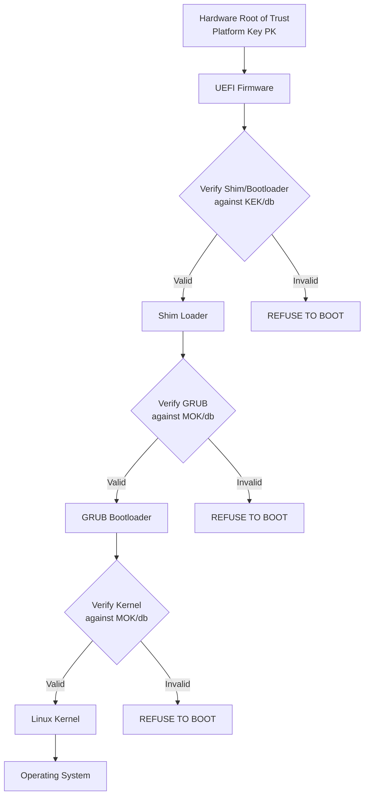
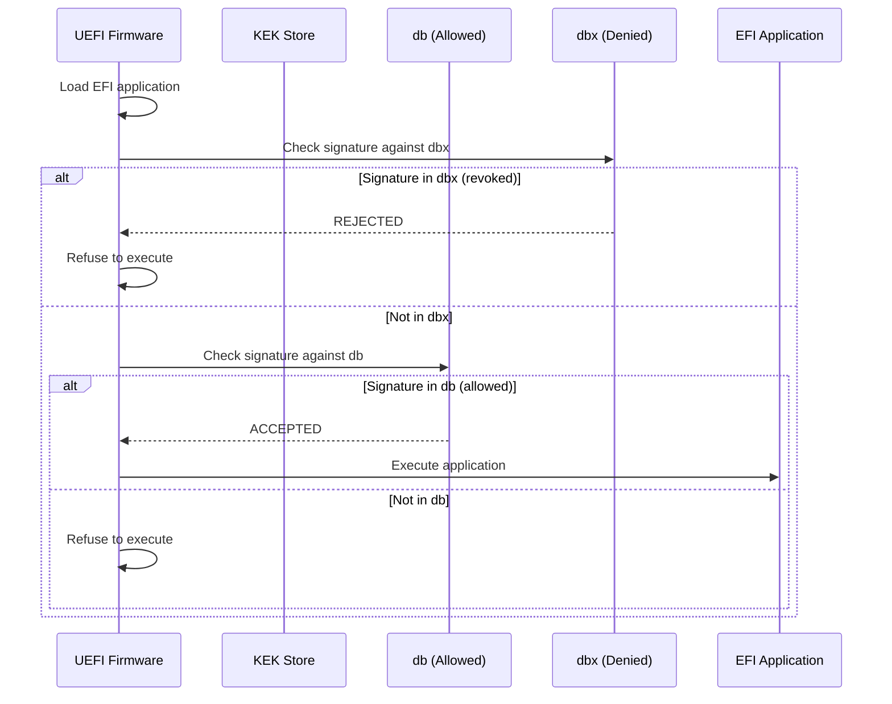

# Chapter 15: Secure Boot

## 15.1 Introduction

Secure Boot is a security feature defined in the UEFI specification that ensures only trusted, digitally signed software executes during the boot process. It establishes a chain of trust from the firmware through the bootloader to the operating system kernel, preventing bootkits, rootkits, and other pre-boot malware from compromising the system before the OS even loads.

For Linux users, Secure Boot has a complex reputation. Initially seen as a mechanism to lock out alternative operating systems, it has evolved into a genuine security feature that major Linux distributions fully support. Understanding how Secure Boot works, how Linux integrates with it, and how to manage signing keys is essential for modern system administration.

## 15.2 Intuition: The Chain of Trust

Imagine a chain where each link verifies the next before allowing it to connect. If any link is forged, the chain breaks and the system refuses to continue.



Each component in the chain is digitally signed. The firmware checks the signature of the bootloader, the bootloader checks the signature of the kernel, and so on. If any signature is missing or invalid, the boot process halts.

## 15.3 Internal Architecture

### 15.3.1 Key Hierarchy

Secure Boot uses a three-tier key hierarchy:

```
┌─────────────────────────────────────────────────────────┐
│                    Platform Key (PK)                      │
│         Root of trust. Controls Secure Boot policy.      │
│         Usually owned by hardware manufacturer.          │
│         Can be replaced by end user.                     │
├─────────────────────────────────────────────────────────┤
│              Key Exchange Key (KEK)                      │
│         Allowed to update the signature database (db).   │
│         Microsoft KEK signs db/dbx updates.              │
│         OS vendors can add their own KEK.                │
├─────────────────────────────────────────────────────────┤
│         Signature Database (db) / Forbidden (dbx)        │
│         db: Allowed signing certificates/hashes.         │
│         dbx: Revoked signing certificates/hashes.        │
│         Microsoft's UEFI CA signs most OS bootloaders.   │
└─────────────────────────────────────────────────────────┘
```

**Platform Key (PK):**
- Top-level authority
- Controls Secure Boot enable/disable
- Typically owned by the hardware/OEM manufacturer
- Can be enrolled by the user (custom PK)

**Key Exchange Key (KEK):**
- Authorized to update the `db` and `dbx` databases
- Microsoft's KEK is enrolled by default on most systems
- OS vendors can add their KEK to sign updates

**Signature Database (db):**
- Contains certificates and hashes of allowed boot software
- Bootloaders signed by a certificate in `db` are allowed to execute
- Microsoft's UEFI CA certificate is in `db` by default

**Forbidden Signatures Database (dbx):**
- Contains revoked certificates and hashes
- Software signed by entries in `dbx` is blocked
- Updated via dbx update packages (security patches)

### 15.3.2 Signature Verification Process



### 15.3.3 The Shim Loader

Microsoft's signing policy requires that UEFI-signed bootloaders be either:
1. Signed directly by Microsoft (expensive, requires WHQL), or
2. Signed by a "shim" that Microsoft pre-signs, which then verifies the next component

The **shim** is the bridge between Microsoft's trust and the Linux distribution's trust:

```
UEFI Firmware → Shim (Microsoft-signed) → GRUB (distro-signed) → Kernel (distro-signed)
```

The shim contains:
- A Microsoft signature (so UEFI firmware trusts it)
- A copy of the distribution's certificate (for verifying GRUB)
- A hash list of known-good bootloaders (fallback)
- MOK (Machine Owner Key) management functionality

### 15.3.4 MOK (Machine Owner Key)

MOK allows end users to enroll their own signing keys without modifying the firmware's `db`:

```bash
# MOK lifecycle:
# 1. Generate a key pair
# 2. Enroll the public key via MokManager (at boot)
# 3. Sign custom kernels/modules with the private key
# 4. Shim verifies signatures against MOK

# MOK storage:
# - MokList: Enrolled keys (persistent across reboots)
# - MokListNew: Pending enrollment (waiting for MokManager)
# - MokSBState: Secure Boot state override
```

## 15.4 Historical Evolution

### 15.4.1 Pre-Secure Boot (Before 2012)

Before Secure Boot, any software with access to the boot process could modify it. Bootkits like TDL4, Mebroot, and Rovnix infected the MBR or bootloader, loading before the OS and antivirus software, making them nearly impossible to detect and remove.

### 15.4.2 Windows 8 and the Controversy (2012)

Microsoft required Secure Boot for Windows 8 certification. This sparked controversy:
- Critics argued it would lock out Linux on consumer hardware
- Microsoft required OEMs to include a Secure Boot disable option on x86 systems
- ARM systems (Windows RT) were required to have Secure Boot permanently enabled
- Linux distributions scrambled to implement Secure Boot support

### 15.4.3 Linux Adoption (2012–2016)

- **Fedora** (2012): First major distribution to implement Secure Boot using a signed shim from a Microsoft-authorized signing service
- **Ubuntu** (2012): Implemented their own signed shim
- **SUSE**: Developed their own Secure Boot implementation
- **The shim project**: Became the standard mechanism for Linux Secure Boot

### 15.4.4 Modern Secure Boot (2016–Present)

- Most major distributions support Secure Boot out of the box
- The shim and MOK system is mature and well-understood
- Custom kernel/module signing is well-documented
- dbx updates address known vulnerabilities (e.g., BootHole)

## 15.5 Secure Boot on Linux

### 15.5.1 Checking Secure Boot Status

```bash
# Method 1: mokutil
mokutil --sb-state
# SecureBoot enabled

# Method 2: Check from UEFI variables
od -An -t u1 -j 4 -N 1 /sys/firmware/efi/efivars/SecureBoot-8be4df61-93ca-11d2-aa0d-00e098032b8c
# 1 = enabled, 0 = disabled

# Method 3: bootctl (systemd)
bootctl status | grep "Secure Boot"

# Method 4: dmesg
dmesg | grep -i secure
```

### 15.5.2 Distribution Support Matrix

```
Distribution    Secure Boot Support    Shim Signed    MOK Support
Ubuntu          Yes                    Yes            Yes
Fedora          Yes                    Yes            Yes
RHEL/CentOS     Yes                    Yes            Yes
Debian          Yes (since 10)         Yes            Yes
openSUSE        Yes                    Yes            Yes
Arch            Manual                 Community      Manual
Gentoo          Manual                 Community      Manual
Linux Mint      Yes (via Ubuntu shim)  Yes            Yes
```

### 15.5.3 How Distributions Boot with Secure Boot

```
┌──────────────────────────────────────────────────────────┐
│  UEFI Firmware (Secure Boot enabled)                      │
│  ↓                                                        │
│  Shim (signed by Microsoft via SUSE's signing key)        │
│  - Verified by firmware's db                              │
│  - Contains distro certificate                            │
│  ↓                                                        │
│  GRUB (signed by distribution)                            │
│  - Verified by shim against distro cert or MOK            │
│  ↓                                                        │
│  Linux Kernel (signed by distribution)                    │
│  - Verified by GRUB or shim                               │
│  ↓                                                        │
│  Kernel loads modules                                     │
│  - Modules must be signed (or in allowlist)               │
│  - Unsigned modules trigger "tainted kernel"              │
└──────────────────────────────────────────────────────────┘
```

## 15.6 Working with MOK

### 15.6.1 Enrolling a Custom Key

When you need to sign custom kernels or out-of-tree kernel modules:

```bash
# Step 1: Generate a MOK key pair
sudo mkdir -p /var/lib/shim-signed/mok
cd /var/lib/shim-signed/mok

# Generate private key and certificate
openssl req -new -x509 -newkey rsa:2048 -keyout MOK.priv \
    -outform DER -out MOK.der -days 36500 -subj \
    "/CN=My Machine Owner Key/" \
    -nodes

# Secure the private key
sudo chmod 600 MOK.priv

# Step 2: Enroll the key
sudo mokutil --import MOK.der
# Enter a one-time password (used during MokManager at boot)
# Confirm the password

# Step 3: Reboot
sudo reboot

# Step 4: MokManager appears at boot
# - Select "Enroll MOK"
# - Select "Continue"
# - Enter the one-time password
# - Confirm enrollment
# - Reboot

# Step 5: Verify enrollment
mokutil --list-enrolled | grep "My Machine Owner Key"
```

### 15.6.2 Signing a Kernel

```bash
# Sign a kernel image
sudo sbsign --key /var/lib/shim-signed/mok/MOK.priv \
    --cert /var/lib/shim-signed/mok/MOK.der \
    --output /boot/vmlinuz-6.8.0-signed \
    /boot/vmlinuz-6.8.0

# Verify signature
sbverify --cert /var/lib/shim-signed/mok/MOK.der \
    /boot/vmlinuz-6.8.0-signed

# Sign the GRUB bootloader
sudo sbsign --key /var/lib/shim-signed/mok/MOK.priv \
    --cert /var/lib/shim-signed/mok/MOK.der \
    --output /boot/efi/EFI/ubuntu/grubx64.efi.signed \
    /boot/efi/EFI/ubuntu/grubx64.efi
```

### 15.6.3 Signing Kernel Modules

```bash
# Create a signing script
cat > /usr/local/bin/sign-module << 'EOF'
#!/bin/bash
KEY="/var/lib/shim-signed/mok/MOK.priv"
CERT="/var/lib/shim-signed/mok/MOK.der"

for module in "$@"; do
    /usr/src/linux-headers-$(uname -r)/scripts/sign-file \
        sha256 "$KEY" "$CERT" "$module"
    echo "Signed: $module"
done
EOF
sudo chmod +x /usr/local/bin/sign-module

# Sign a single module
sudo sign-module /lib/modules/$(uname -r)/extra/mydriver.ko

# Sign all out-of-tree modules
find /lib/modules/$(uname -r)/extra -name "*.ko" -exec sudo sign-module {} +

# Auto-sign modules on install (DKMS integration)
# /etc/dkms/framework.conf:
# sign_tool="/etc/dkms/sign_helper.sh"
```

### 15.6.4 DKMS Auto-Signing

```bash
# Create DKMS signing helper
cat > /etc/dkms/sign_helper.sh << 'EOF'
#!/bin/bash
/usr/src/linux-headers-${kernelver}/scripts/sign-file \
    sha256 /var/lib/shim-signed/mok/MOK.priv \
    /var/lib/shim-signed/mok/MOK.der "$2"
EOF
sudo chmod +x /etc/dkms/sign_helper.sh

# Configure DKMS to use it
# /etc/dkms/framework.conf:
# sign_tool="/etc/dkms/sign_helper.sh"
```

### 15.6.5 Managing MOK State

```bash
# List enrolled keys
mokutil --list-enrolled

# List pending enrollments
mokutil --list-new

# List rejected keys
mokutil --list-delete

# Delete a key (requires reboot and MokManager)
sudo mokutil --delete MOK.der

# Disable Secure Boot validation (one-time)
sudo mokutil --disable-validation
# Enter password, reboot, confirm in MokManager

# Re-enable Secure Boot validation
sudo mokutil --enable-validation
```

## 15.7 Custom Secure Boot Setup

### 15.7.1 Full Custom Key Replacement

For maximum control, replace all Secure Boot keys:

```bash
# WARNING: This may brick some systems. Test in VM first.

# Generate your own PK, KEK, and db keys
# PK (Platform Key)
openssl req -new -x509 -newkey rsa:2048 -keyout PK.key -out PK.crt -days 3650 -subj "/CN=My PK/"
openssl x509 -in PK.crt -out PK.der -outform DER

# KEK (Key Exchange Key)
openssl req -new -x509 -newkey rsa:2048 -keyout KEK.key -out KEK.crt -days 3650 -subj "/CN=My KEK/"
openssl x509 -in KEK.crt -out KEK.der -outform DER

# db (Signature Database)
openssl req -new -x509 -newkey rsa:2048 -keyout db.key -out db.crt -days 3650 -subj "/CN=My DB/"
openssl x509 -in db.crt -out db.der -outform DER

# Sign your bootloader with db key
sbsign --key db.key --cert db.crt --output grubx64.efi.signed grubx64.efi

# Enroll keys using efi-updatevar (DANGEROUS)
# Only do this if you understand the consequences
sudo efi-updatevar -f PK.der PK
sudo efi-updatevar -f KEK.der KEK
sudo efi-updatevar -f db.der db
```

### 15.7.2 Signing a Custom Kernel for Direct EFI Boot

```bash
# Build kernel with EFI stub support
# CONFIG_EFI_STUB=y in kernel config

# Sign the kernel
sbsign --key db.key --cert db.crt --output bzImage.signed arch/x86/boot/bzImage

# Create EFI boot entry
sudo efibootmgr -c -d /dev/sda -p 1 -L "Custom Kernel" \
    -l '\EFI\custom\bzImage.signed' -u "root=/dev/sda2 rw"

# Copy signed kernel to ESP
sudo cp bzImage.signed /boot/efi/EFI/custom/
```

## 15.8 Common Pitfalls

### 15.8.1 Unsigned NVIDIA/AMD Drivers

Proprietary GPU drivers often include unsigned kernel modules.

```bash
# Check if modules are signed
modinfo nvidia | grep -i sign

# If unsigned, sign them
sudo sign-module /lib/modules/$(uname -r)/updates/dkms/nvidia*.ko

# Or use DKMS with auto-signing configured
```

### 15.8.2 VirtualBox/VMware Modules

```bash
# VirtualBox modules need signing
sudo /sbin/vboxconfig  # This may fail with Secure Boot

# Manual signing:
for mod in /lib/modules/$(uname -r)/misc/vbox*.ko; do
    sudo sign-module "$mod"
done
sudo modprobe vboxdrv
```

### 15.8.3 Kernel Updates Break Signatures

When the kernel is updated, new modules may be unsigned.

```bash
# Solution: Hook into kernel installation
cat > /etc/kernel/postinst.d/sign-modules << 'EOF'
#!/bin/bash
kernel_version="$1"
key="/var/lib/shim-signed/mok/MOK.priv"
cert="/var/lib/shim-signed/mok/MOK.der"

if [ -f "$key" ] && [ -f "$cert" ]; then
    for mod in /lib/modules/${kernel_version}/updates/*.ko; do
        [ -f "$mod" ] || continue
        /usr/src/linux-headers-${kernel_version}/scripts/sign-file \
            sha256 "$key" "$cert" "$mod"
    done
fi
EOF
sudo chmod +x /etc/kernel/postinst.d/sign-modules
```

### 15.8.4 BootHole and dbx Updates

The BootHole vulnerability (CVE-2020-10713) affected GRUB, requiring dbx updates to revoke vulnerable versions.

```bash
# Check current dbx
mokutil --dbx

# Apply dbx update (usually via fwupdmgr)
sudo fwupdmgr refresh
sudo fwupdmgr update

# If dbx update prevents booting old GRUB:
# Re-sign GRUB with a key not in dbx
```

### 15.8.5 Forgetting MOK Password

If you forget the one-time MOK enrollment password:
- The enrollment request is discarded
- Re-run `mokutil --import` with a new password
- Complete enrollment at next reboot

## 15.9 Best Practices

1. **Don't disable Secure Boot** — It's a real security feature, not just DRM
2. **Use distribution-signed kernels when possible** — Less maintenance
3. **Set up DKMS auto-signing** — Prevents module signing issues after kernel updates
4. **Protect MOK private key** — `chmod 600`, store securely
5. **Document your key enrollment** — Track which keys are enrolled and why
6. **Test Secure Boot in VMs** — Before deploying to production
7. **Keep firmware updated** — dbx updates address known vulnerabilities
8. **Use `mokutil` for key management** — Don't modify `db`/`dbx` directly
9. **Have a recovery plan** — Know how to disable Secure Boot if something goes wrong
10. **Monitor for BootHole-class vulnerabilities** — Subscribe to security advisories

## 15.10 Exercises

### Exercise 1: Secure Boot Status
Write a script that checks Secure Boot status, lists enrolled MOK keys, and reports the shim version on a Linux system.

### Exercise 2: Custom Key Enrollment
Generate a MOK key pair, enroll it on a system with Secure Boot enabled, and sign a custom kernel module. Verify the module loads without disabling Secure Boot.

### Exercise 3: Kernel Signing
Compile a custom kernel with EFI stub support, sign it with a MOK key, and configure the system to boot it with Secure Boot enabled.

### Exercise 4: DKMS Auto-Signing
Configure DKMS to automatically sign modules with your MOK key. Test by installing a DKMS package (e.g., VirtualBox modules) and verify it works with Secure Boot.

### Exercise 5: Secure Boot Audit
Audit a system's Secure Boot configuration: verify shim, GRUB, and kernel signatures. Check for any unsigned modules loaded into the kernel. Generate a security report.

## 15.11 References

- [UEFI Secure Boot Specification](https://uefi.org/specifications)
- [Shim Loader Project](https://github.com/rhboot/shim)
- [mokutil Documentation](https://github.com/lcp/mokutil)
- [Arch Linux: Secure Boot](https://wiki.archlinux.org/title/Unified_Extensible_Firmware_Interface/Secure_Boot)
- [Ubuntu: SecureBoot](https://ubuntu.com/server/docs/secure-boot)
- [Fedora: Secure Boot](https://docs.fedoraproject.org/en-US/fedora/latest/system-administrators-guide/kernel-module-driver-works/Working_with_Kernel_Modules/)
- [Rod Smith: Secure Boot](https://www.rodsbooks.com/efi-bootloaders/secureboot.html)
- [Microsoft: Secure Boot](https://docs.microsoft.com/en-us/windows-hardware/design/device-experiences/oem-secure-boot)
- [CVE-2020-10713 (BootHole)](https://eclypsium.com/2020/07/29/theres-a-hole-in-the-boot/)
