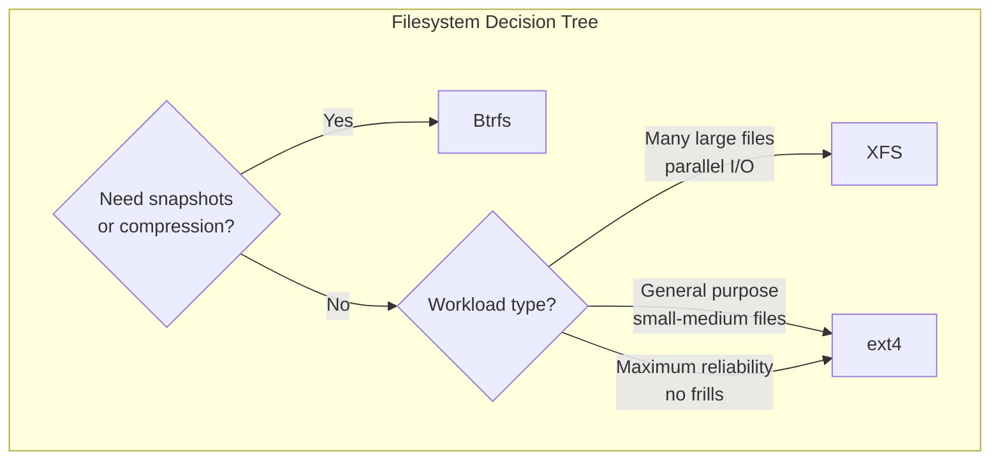

# Chapter 16: Filesystem Choices

## 16.1 Introduction

The filesystem is the organizational structure that determines how data is stored, indexed, and retrieved on a storage device. Choosing the right filesystem is one of the most impactful decisions in Linux system design. The choice affects performance characteristics, data integrity guarantees, snapshot capabilities, and operational complexity.

Linux offers a rich ecosystem of filesystems, each designed with different priorities. This chapter focuses on the three most commonly deployed filesystems for general-purpose use—ext4, XFS, and Btrfs—while covering others for specific use cases.

## 16.2 Intuition: What Does a Filesystem Do?

A filesystem answers five fundamental questions:
1. **Where is the data?** — Mapping filenames to disk blocks
2. **How is it organized?** — Directory structure and metadata
3. **Is it safe?** — Journaling, checksums, redundancy
4. **How fast is it?** — Read/write performance characteristics
5. **Can it grow?** — Resizing, snapshots, subvolumes

Think of a filesystem as a librarian for your data. A fast librarian (XFS) handles large archives efficiently. A careful librarian (Btrfs) keeps checksums and can rewind time. A reliable, general-purpose librarian (ext4) handles everything reasonably well.

## 16.3 Internal Architecture

### 16.3.1 Common Filesystem Concepts

All Linux filesystems share fundamental concepts:

**Inodes:**
Metadata structures that store file attributes (permissions, ownership, timestamps, size) and pointers to data blocks. The filename is stored in the directory, not the inode.

```
Directory Entry          Inode               Data Blocks
┌──────────────┐    ┌──────────────┐    ┌──────────────────┐
│ name: "file1"│───→│ mode, uid,gid│───→│ Block 1000-1007  │
│ inode: 1234  │    │ size, time   │    │ (8 blocks = 32KB)│
└──────────────┘    │ block ptrs   │    └──────────────────┘
                    └──────────────┘
```

**Superblock:**
The master metadata structure describing the filesystem: size, block count, free space, filesystem state, mount count, and feature flags. Most filesystems keep backup copies.

**Block Allocation:**
Data is allocated in fixed-size blocks (typically 4 KiB). Free space is tracked via bitmaps (ext4) or B-trees (XFS, Btrfs).

**Journaling:**
A write-ahead log that records metadata (and optionally data) changes before they're committed. If the system crashes, the journal replays to ensure consistency.

### 16.3.2 ext4 Internal Architecture

```
┌──────────────────────────────────────────────────────────┐
│ ext4 Filesystem Layout                                    │
├──────────┬──────────┬──────────┬──────────┬──────────────┤
│ Boot     │ Super    │ Block    │ Block    │ Data         │
│ Block    │ Block    │ Group 0  │ Group 1  │ Block Groups │
│ (1 KB)   │ (1 KB)   │          │          │ ...          │
└──────────┴──────────┴──────────┴──────────┴──────────────┘

Each Block Group:
┌──────────────────────────────────────────────────────────┐
│ Super  │ Group    │ Block    │ Inode    │ Inode   │ Data  │
│ Block  │ Descriptor│ Bitmap  │ Bitmap   │ Table   │ Blocks│
│ (copy) │          │         │          │         │       │
└──────────────────────────────────────────────────────────┘
```

**Key ext4 features:**
- **Extents**: Instead of listing every block, ext4 uses extents (start block + length) for contiguous allocation. Dramatically reduces metadata for large files.
- **Delayed allocation**: Delays block allocation until flush time, allowing better allocation decisions.
- **Journal**: Supports journaling of metadata (default) or metadata+data.
- **Flex block groups**: Allows bitmaps and inode tables to span multiple block groups.
- **Online resize**: Grow mounted filesystems.

**ext4 limits:**
- Max filesystem size: 1 EiB
- Max file size: 16 TiB
- Max filename length: 255 bytes
- Max links per directory: ~65,000

### 16.3.3 XFS Internal Architecture

```
┌──────────────────────────────────────────────────────────┐
│ XFS Filesystem Layout                                     │
├──────────┬──────────┬──────────┬──────────────────────────┤
│ AG 0     │ AG 1     │ AG 2     │ AG 3 ...                │
│ ┌──────┐ │ ┌──────┐ │ ┌──────┐ │                         │
│ │Super │ │ │Super │ │ │Super │ │                         │
│ │Block │ │ │Block │ │ │Block │ │                         │
│ ├──────┤ │ ├──────┤ │ ├──────┤ │                         │
│ │AG    │ │ │AG    │ │ │AG    │ │                         │
│ │Free  │ │ │Free  │ │ │Free  │ │                         │
│ │Space │ │ │Space │ │ │Space │ │                         │
│ ├──────┤ │ ├──────┤ │ ├──────┤ │                         │
│ │Inode │ │ │Inode │ │ │Inode │ │                         │
│ │B+Tree│ │ │B+Tree│ │ │B+Tree│ │                         │
│ ├──────┤ │ ├──────┤ │ ├──────┤ │                         │
│ │Data  │ │ │Data  │ │ │Data  │ │                         │
│ │B+Tree│ │ │B+Tree│ │ │B+Tree│ │                         │
│ └──────┘ │ └──────┘ │ └──────┘ │                         │
└──────────┴──────────┴──────────┴──────────────────────────┘
```

**Key XFS features:**
- **Allocation Groups (AGs)**: The disk is divided into independently managed AGs, enabling parallel allocation and reducing lock contention.
- **B+ trees**: All metadata (inodes, free space, directories) uses B+ trees for O(log n) lookups.
- **Delayed logging**: Metadata changes are batched in memory before writing to the log.
- **Realtime device**: Optional separate device for file data (useful for streaming workloads).
- **Online grow**: Grow mounted filesystems (no shrink).
- **DMAPI**: Data Management API for hierarchical storage management.

**XFS limits:**
- Max filesystem size: 8 EiB
- Max file size: 8 EiB
- Max filename length: 255 bytes
- No online shrink

### 16.3.4 Btrfs Internal Architecture

```
┌──────────────────────────────────────────────────────────┐
│ Btrfs Filesystem Layout                                   │
├──────────────────────────────────────────────────────────┤
│ Chunk Tree (physical → logical mapping)                   │
│ ├─ Device Tree (physical device info)                     │
│ ├─ FS Tree (root of all subvolumes)                       │
│ │  ├─ Subvolume "root" (/)                                │
│ │  ├─ Subvolume "home" (/home)                            │
│ │  └─ Snapshot "backup-2024-01" (read-only copy)          │
│ ├─ Checksum Tree (data integrity)                         │
│ ├─ Extent Tree (block allocation)                         │
│ └─ Log Tree (journal for fsync)                           │
└──────────────────────────────────────────────────────────┘
```

**Key Btrfs features:**
- **Copy-on-Write (CoW)**: Never overwrite data in place. Writes go to new locations, old data remains accessible (enabling snapshots).
- **Subvolumes**: Independent filesystem trees within a single pool. Can be mounted independently.
- **Snapshots**: Instant, space-efficient copies of subvolumes (only changed blocks consume space).
- **Built-in RAID**: RAID 0, 1, 10, 5 (unstable), 6 (unstable) without mdadm.
- **Data checksums**: CRC32C checksums on all data and metadata (detects silent corruption).
- **Compression**: Transparent zlib, lzo, or zstd compression.
- **Send/receive**: Incremental backup by comparing snapshots.
- **Online balance**: Redistribute data across devices.
- **Self-healing**: With redundant profiles (RAID 1/10), automatically repairs corrupted data from good copies.

**Btrfs limits:**
- Max filesystem size: 16 EiB
- Max file size: 16 EiB
- RAID 5/6: Known issues, not recommended for production

## 16.4 Comparison Matrix



```
Feature              ext4         XFS          Btrfs
──────────────────────────────────────────────────────
Journaling           Yes          Yes          CoW (no journal)
Checksums (data)     No           No           Yes (CRC32C)
Checksums (metadata) No           No           Yes
Snapshots            No           No           Yes
Subvolumes           No           No           Yes
Compression          No           No           Yes (zlib/lzo/zstd)
Online grow          Yes          Yes          Yes
Online shrink        Yes          No           Yes (balance)
RAID built-in        No           No           Yes
Send/receive         No           No           Yes
Quotas               Yes          Yes          Yes (qgroups)
Max file size        16 TiB       8 EiB        16 EiB
Max fs size          1 EiB        8 EiB        16 EiB
Defragmentation      Yes          Yes          Yes (breaks CoW)
Repair tool          e2fsck       xfs_repair   btrfs check
Maturity             15+ years    30+ years    15+ years
Default in           Ubuntu,      RHEL,        Fedora, openSUSE,
                     Debian       CentOS       SUSE
```

## 16.5 Performance Characteristics

### 16.5.1 ext4 Performance

```bash
# Benchmark ext4
sudo mkfs.ext4 /dev/sdb1
sudo mount /dev/sdb1 /mnt/test

# Sequential write
dd if=/dev/zero of=/mnt/test/testfile bs=1M count=1024 oflag=direct

# Random I/O with fio
fio --name=random-write --ioengine=libaio --rw=randwrite \
    --bs=4k --numjobs=4 --size=1G --runtime=60 \
    --filename=/mnt/test/fio-test --direct=1
```

**ext4 strengths:**
- Excellent for small to medium files
- Low metadata overhead
- Fast fsck times
- Good all-around performance

**ext4 weaknesses:**
- Degrades with very large directories (>100K files)
- No parallel allocation
- Extent fragmentation over time

### 16.5.2 XFS Performance

**XFS strengths:**
- Excellent parallel I/O performance (AGs)
- Superior large-file sequential I/O
- Scales well with many CPUs and high-concurrency workloads
- Efficient allocation for large files

**XFS weaknesses:**
- Higher memory usage for metadata
- Cannot shrink (resize must grow only)
- Metadata-intensive operations can be slower than ext4
- Random write performance can degrade with fragmentation

### 16.5.3 Btrfs Performance

**Btrfs strengths:**
- Excellent for read-heavy workloads
- Fast snapshot creation and deletion
- Compression can improve both speed and space (especially zstd)

**Btrfs weaknesses:**
- CoW overhead for random writes (databases, VMs)
- Fragmentation under heavy random write loads
- RAID 5/6 write hole (unreliable)
- Higher CPU usage with compression
- Balance operations can be slow

### 16.5.4 Database Workloads

Databases perform many small random writes. CoW filesystems (Btrfs) can cause fragmentation and performance issues.

```bash
# For Btrfs, disable CoW on database directories
chattr +C /var/lib/postgresql
# Must be set on empty directory before creating files

# Or use nodatacow mount option (applies to new files)
# mount -o nodatacow /dev/sdb1 /var/lib/postgresql

# ext4 and XFS are generally better for databases
# PostgreSQL recommends ext4 or XFS
```

## 16.6 Filesystem Operations

### 16.6.1 Creating Filesystems

```bash
# ext4
sudo mkfs.ext4 -L "rootfs" -m 1 /dev/sda2
# -m 1: reserve 1% for root (default 5% is often excessive)
# -L: volume label

# XFS
sudo mkfs.xfs -L "data" -f /dev/sda3
# -f: force overwrite existing filesystem

# Btrfs
sudo mkfs.btrfs -L "storage" -d raid1 -m raid1 /dev/sdb1 /dev/sdc1
# -d: data profile, -m: metadata profile
# Multiple devices create a multi-device filesystem
```

### 16.6.2 Mounting with Performance Options

```bash
# ext4 performance mount options
mount -o defaults,noatime,commit=60 /dev/sda2 /mnt
# noatime: don't update access times (reduces writes)
# commit=60: journal commit interval (default 5s)

# XFS performance mount options
mount -o defaults,noatime,logbufs=8,logbsize=256k /dev/sda3 /mnt
# logbufs: number of log buffers (default 8)
# logbsize: log buffer size

# Btrfs performance mount options
mount -o defaults,noatime,compress=zstd:3,ssd,discard=async /dev/sdb1 /mnt
# compress=zstd:3: transparent compression (level 3)
# ssd: SSD optimizations (no spinning disk heuristics)
# discard=async: async TRIM (better than continuous discard)
```

### 16.6.3 Tuning ext4

```bash
# Adjust reserved space (default 5% is too much for large drives)
sudo tune2fs -m 1 /dev/sda2

# Enable/disable features
sudo tune2fs -O extents,uninit_bg,dir_index /dev/sda2

# Set journal size
sudo tune2fs -J size=256 /dev/sda2

# Check filesystem
sudo e2fsck -f /dev/sda2

# Defragment
sudo e4defrag /dev/sda2

# View filesystem info
sudo tune2fs -l /dev/sda2
```

### 16.6.4 Tuning XFS

```bash
# View XFS info
sudo xfs_info /dev/sda3

# Repair
sudo xfs_repair /dev/sda3

# Defragment
sudo xfs_fsr /dev/sda3

# Grow (mounted)
sudo xfs_growfs /mnt/data

# Manage quotas
sudo xfs_quota -x -c 'limit bsoft=5g bhard=6g user1' /mnt/data

# Backup
sudo xfsdump -L "backup" -M "media" -f /backup/dump.xfs /mnt/data
```

### 16.6.5 Btrfs Operations

```bash
# Subvolumes
sudo btrfs subvolume create /mnt/@home
sudo btrfs subvolume create /mnt/@snapshots
sudo btrfs subvolume list /mnt

# Snapshots
sudo btrfs subvolume snapshot /mnt/@ /mnt/@snapshots/backup-$(date +%Y%m%d)
sudo btrfs subvolume snapshot -r /mnt/@ /mnt/@snapshots/readonly-$(date +%Y%m%d)
# -r: read-only snapshot (required for send/receive)

# Send/receive (incremental backup)
sudo btrfs send -p /mnt/@snapshots/old /mnt/@snapshots/new | sudo btrfs receive /backup/

# Compression
sudo btrfs filesystem defragment -r -czstd /mnt

# Balance (redistribute data)
sudo btrfs balance start -dusage=50 /mnt
sudo btrfs balance status /mnt

# Scrub (verify checksums)
sudo btrfs scrub start /mnt
sudo btrfs scrub status /mnt

# Device management
sudo btrfs device add /dev/sdc1 /mnt
sudo btrfs device remove /dev/sdb1 /mnt

# Quota groups
sudo btrfs quota enable /mnt
sudo btrfs qgroup limit 50G /mnt/@home

# Check and repair
sudo btrfs check /dev/sdb1
sudo btrfs check --repair /dev/sdb1  # DANGEROUS, use with caution
```

## 16.7 Filesystem Recommendations by Use Case

### 16.7.1 Desktop/Workstation

```
Partition   Filesystem   Rationale
/           ext4         Reliable, fast fsck, well-tested
/home       Btrfs        Snapshots for user data, compression
```

**Or:**
```
/           Btrfs        Subvolumes for @, @home, @snapshots
                          Enables easy rollback with Timeshift/Snapper
```

### 16.7.2 Server (General Purpose)

```
Partition   Filesystem   Rationale
/           ext4         Predictable, low overhead, fast recovery
/var        ext4         Database and log friendly
/home       XFS          Large file handling
/tmp        tmpfs        RAM-backed, no persistence needed
```

### 16.7.3 Database Server

```
Partition   Filesystem   Options              Rationale
/           ext4         defaults             Root filesystem
/var/lib/   XFS          noatime,nobarrier    Database data files
                        (with battery-backed
                         write cache)
/var/log    ext4         defaults             Log files
```

### 16.7.4 NAS/File Server

```
Partition   Filesystem   Options              Rationale
/data       Btrfs        compress=zstd:3      Snapshots, compression
                                             Send/receive for backups
                                             Self-healing with RAID
```

### 16.7.5 Container Host

```
Partition   Filesystem   Options              Rationale
/           ext4         defaults             Root filesystem
/var/lib/   XFS          defaults             Docker/containerd storage
                                             (overlay2 works well on XFS)
```

## 16.8 Common Pitfalls

### 16.8.1 Btrfs and Databases

CoW causes fragmentation and performance issues for databases.

```bash
# Disable CoW before creating database files
chattr +C /var/lib/mysql
# OR mount with nodatacow
```

### 16.8.2 Btrfs and VM Images

Virtual machine disk images on Btrfs suffer from CoW fragmentation.

```bash
# Disable CoW for VM images directory
chattr +C /var/lib/libvirt/images

# Or use raw images with nocow attribute
qemu-img create -f raw /var/lib/libvirt/images/vm.qcow2 100G
chattr +C /var/lib/libvirt/images/vm.qcow2
```

### 16.8.3 XFS Cannot Shrink

XFS can only grow, never shrink. Plan partition sizes accordingly or use LVM.

### 16.8.4 ext4 Reserved Space

The default 5% reserved space is excessive on large drives (50 GB reserved on a 1 TB drive). Reduce it:

```bash
sudo tune2fs -m 1 /dev/sda2  # Reserve 1% instead
```

### 16.8.5 Btrfs RAID 5/6 Issues

Btrfs RAID 5/6 has a known write hole and is not recommended for production. Use RAID 1/10 instead.

### 16.8.6 Btrfs Filling Up

Btrfs can behave strangely when nearly full (ENOSPC errors even with apparent free space).

```bash
# Monitor metadata usage
sudo btrfs filesystem usage /mnt

# Balance metadata if needed
sudo btrfs balance start -musage=50 /mnt

# Add more space before it's critical
sudo btrfs device add /dev/sdc1 /mnt
sudo btrfs balance start /mnt
```

## 16.9 Best Practices

1. **Use ext4 as default** when unsure—it's the safest choice
2. **Use XFS for large-file, high-concurrency** workloads (databases, VMs, media)
3. **Use Btrfs when you need snapshots** (desktop rollbacks, backup, NAS)
4. **Disable CoW for databases and VM images** on Btrfs
5. **Set `noatime`** on all filesystems unless access time auditing is required
6. **Reduce reserved space** on large ext4 partitions
7. **Use `discard=async`** for SSDs on Btrfs (not continuous `discard`)
8. **Monitor Btrfs metadata usage** regularly
9. **Never use Btrfs RAID 5/6** in production
10. **Run `btrfs scrub`** periodically for data integrity verification
11. **Match filesystem to workload** — there's no universal best filesystem
12. **Test performance** with your actual workload before committing

## 16.10 Exercises

### Exercise 1: Filesystem Comparison
Create ext4, XFS, and Btrfs filesystems on three separate virtual disks. Run identical benchmarks (sequential read/write, random I/O, metadata operations) and compare results.

### Exercise 2: Btrfs Snapshots
Set up a Btrfs filesystem with subvolumes for `/`, `/home`, and `/snapshots`. Create a script that takes periodic snapshots and rotates them (keep daily for 7 days, weekly for 4 weeks).

### Exercise 3: Compression Testing
Test Btrfs compression with zlib, lzo, and zstd at different levels. Measure both space savings and performance impact on a mixed workload.

### Exercise 4: ext4 Tuning
Analyze and tune an ext4 filesystem for a web server workload. Adjust reserved space, journal settings, and mount options. Benchmark before and after.

### Exercise 5: Data Integrity
Set up a Btrfs filesystem with RAID 1 metadata. Simulate silent data corruption (write garbage to a data block) and demonstrate Btrfs's checksum verification catching the error during a scrub.

## 16.11 References

- [ext4 Wiki](https://ext4.wiki.kernel.org/)
- [XFS Documentation](https://xfs.org/index.php/Documentation)
- [Btrfs Wiki](https://btrfs.wiki.kernel.org/)
- [Arch Linux: File Systems](https://wiki.archlinux.org/title/File_systems)
- [RHEL: File System Guide](https://docs.redhat.com/en/documentation/red_hat_enterprise_linux/9/html/managing_file_systems/)
- [Btrfs Sysadmin Guide](https://btrfs.readthedocs.io/en/latest/)
- [Phoronix Filesystem Benchmarks](https://www.phoronix.com/)
- [Linux Kernel Documentation: Filesystems](https://www.kernel.org/doc/html/latest/filesystems/)
