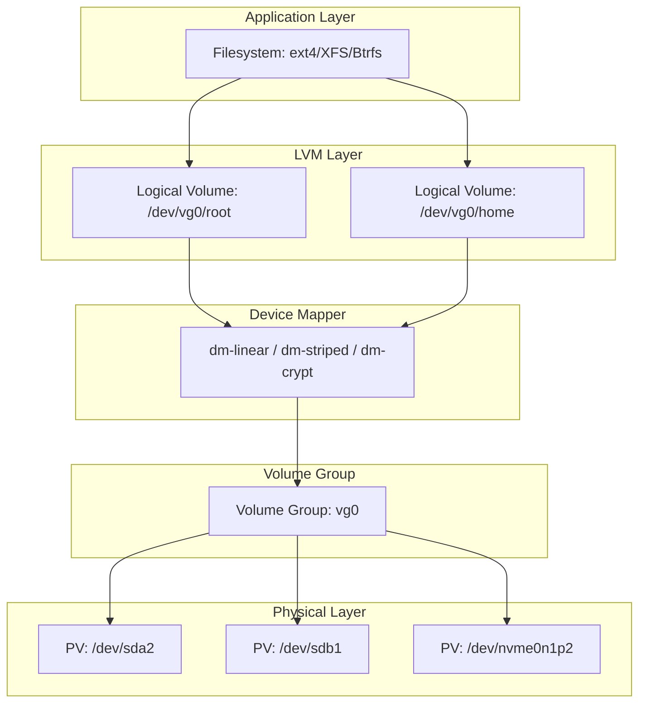
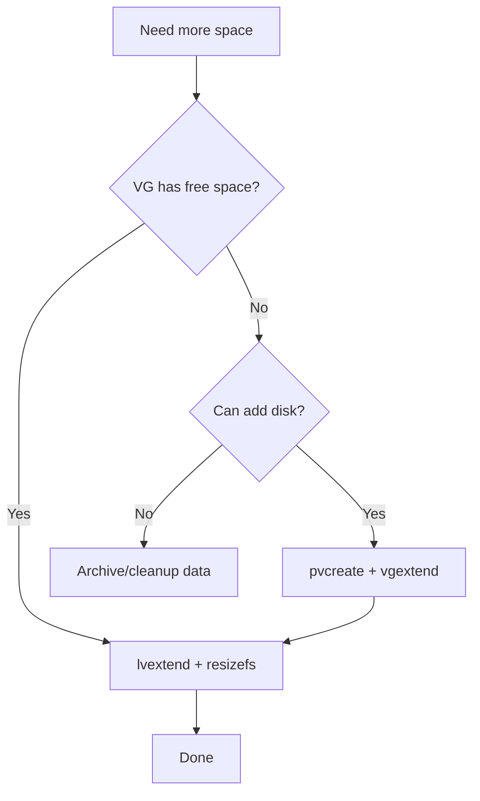
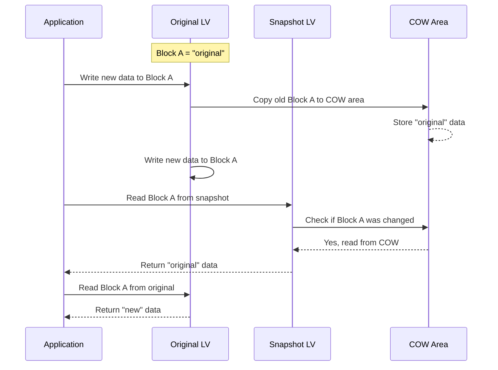

# Chapter 17: LVM (Logical Volume Manager)

## 17.1 Introduction

LVM (Logical Volume Manager) is a device mapper framework that provides a layer of abstraction between physical storage devices and the filesystem. Instead of creating filesystems directly on partitions, LVM allows you to create logical volumes that can span multiple physical disks, be resized dynamically, snapshotted, and moved between physical devices—all while the system is running.

LVM transforms rigid physical disk layouts into flexible, manageable storage pools. It is the standard storage management layer for enterprise Linux systems and is used extensively in servers, cloud instances, and increasingly on desktops.

## 17.2 Intuition: Storage Abstraction

Think of LVM as a three-layer abstraction:

```
Physical Disks          Volume Group            Logical Volumes
┌──────────┐          ┌──────────────┐          ┌──────────┐
│ /dev/sda │─────────→│              │─────────→│ /dev/vg0/│ root (30GB)
│ /dev/sdb │─────────→│    vg0       │─────────→│ /dev/vg0/│ home (100GB)
│ /dev/sdc │─────────→│   (250GB)    │─────────→│ /dev/vg0/│ swap (8GB)
└──────────┘          └──────────────┘          └──────────┘
  Physical              Flexible pool             Virtual
  Disks                 of storage                Partitions
```

- **Physical Volumes (PVs)**: Actual disks or partitions that LVM manages
- **Volume Groups (VGs)**: Pools of storage created from one or more PVs
- **Logical Volumes (LVs)**: Virtual partitions carved from VGs, used like regular partitions

This layering means you can add a new disk to a VG and immediately extend any LV on it—no repartitioning, no data migration.

## 17.3 Internal Architecture

### 17.3.1 LVM Stack



### 17.3.2 Physical Volumes (PVs)

A Physical Volume is a block device (partition or whole disk) initialized for LVM:

```bash
# Create PV on a partition
sudo pvcreate /dev/sda2

# Create PV on a whole disk (not recommended—confuses partition tools)
sudo pvcreate /dev/sdb

# PV metadata is stored at the start of the device
# Contains: PV UUID, VG membership, PE size, device size

# Display PV info
sudo pvdisplay /dev/sda2
sudo pvs  # Summary view
```

**PV Metadata:**
- Stored in the first few sectors of the device
- Contains: PV UUID, VG name, PE (Physical Extent) size
- Backup copies stored in `/etc/lvm/backup/` and `/etc/lvm/archive/`

### 17.3.3 Volume Groups (VGs)

A Volume Group aggregates one or more PVs into a storage pool:

```bash
# Create VG from one PV
sudo vgcreate vg0 /dev/sda2

# Create VG from multiple PVs
sudo vgcreate vg0 /dev/sda2 /dev/sdb1 /dev/sdc1

# Add PV to existing VG
sudo vgextend vg0 /dev/sdd1

# Remove PV from VG (must move extents first)
sudo pvmove /dev/sdb1        # Move data off the PV
sudo vgreduce vg0 /dev/sdb1  # Remove PV from VG

# Display VG info
sudo vgdisplay vg0
sudo vgs  # Summary view
```

**Physical Extents (PE):**
The VG is divided into fixed-size Physical Extents (default 4 MiB). PEs are the allocation unit—every LV is composed of a set of PEs.

```bash
# Change PE size (only at VG creation)
sudo vgcreate -s 16M vg0 /dev/sda2  # 16 MiB PEs

# Default 4 MiB PE allows LVs up to 256 TiB on 64-bit systems
```

### 17.3.4 Logical Volumes (LVs)

Logical Volumes are the virtual partitions that hold filesystems:

```bash
# Create LV with size in GB
sudo lvcreate -n root -L 30G vg0

# Create LV using percentage of VG
sudo lvcreate -n home -l 80%VG vg0

# Create LV with specific number of extents
sudo lvcreate -n swap -l 2048 vg0  # 2048 × 4 MiB = 8 GiB

# Display LV info
sudo lvdisplay /dev/vg0/root
sudo lvs  # Summary view

# Format and mount
sudo mkfs.ext4 /dev/vg0/root
sudo mount /dev/vg0/root /mnt
```

### 17.3.5 Device Mapper

LVM is built on the Linux Device Mapper (dm), a kernel framework that maps block devices:

```bash
# Device Mapper targets used by LVM:
# linear    — Concatenation of ranges (basic LVs)
# striped   — RAID 0 striping
# mirror    — RAID 1 mirroring (legacy, use dm-integrity + mdraid)
# snapshot  — Copy-on-Write snapshots
# crypt     — LUKS encryption (dm-crypt)
# thin-pool — Thin provisioning
# cache     — SSD caching (dm-cache)
# raid      — Kernel RAID (raid1, raid5, raid6)

# View device mapper table
sudo dmsetup table vg0-root
# vg0-root: 0 62914560 linear 8:2 2048

# View all DM devices
sudo dmsetup ls
```

## 17.4 Resizing Logical Volumes

### 17.4.1 Growing a Volume

```bash
# Step 1: Extend the LV
sudo lvextend -L +10G /dev/vg0/root

# Step 2: Resize the filesystem
# For ext4:
sudo resize2fs /dev/vg0/root

# For XFS (must be mounted):
sudo xfs_growfs /

# Combined (lvextend can resize filesystem automatically):
sudo lvextend -L +10G --resizefs /dev/vg0/root
# or
sudo lvextend -l +100%FREE --resizefs /dev/vg0/root
```

### 17.4.2 Shrinking a Volume

```bash
# WARNING: Shrinking is risky. Always back up first.

# Step 1: Unmount
sudo umount /dev/vg0/home

# Step 2: Check filesystem
sudo e2fsck -f /dev/vg0/home

# Step 3: Shrink filesystem FIRST (must be smaller than target LV size)
sudo resize2fs /dev/vg0/home 20G

# Step 4: Shrink LV
sudo lvreduce -L 22G /dev/vg0/home  # Slightly larger than filesystem

# Step 5: Remount
sudo mount /dev/vg0/home /home

# XFS cannot be shrunk
```

### 17.4.3 Resize Diagram



## 17.5 LVM Snapshots

### 17.5.1 Traditional Snapshots (Copy-on-Write)

```bash
# Create a snapshot (must be on same VG)
sudo lvcreate -n root-snap -L 5G -s /dev/vg0/root
# -s: snapshot mode
# -L 5G: space for changed blocks (COW area)

# Snapshot fills up as original volume changes
# Monitor usage:
sudo lvs
# LV         VG   Attr       LSize  Origin Data%
# root       vg0  owi-aos--- 30.00g
# root-snap  vg0  swi-aos---  5.00g root    12.34%

# If snapshot reaches 100%, it becomes invalid
# Extend snapshot if needed:
sudo lvextend -L +5G /dev/vg0/root-snap

# Mount snapshot (read-only view of original at snapshot time)
sudo mount -o ro /dev/vg0/root-snap /mnt/snapshot

# Use snapshot for consistent backup
sudo dd if=/dev/vg0/root-snap of=/backup/root.img bs=4M

# Merge snapshot back (revert to snapshot state)
sudo lvconvert --merge /dev/vg0/root-snap
# Takes effect on next activation (reboot or lvchange -an/-ay)

# Remove snapshot
sudo lvremove /dev/vg0/root-snap
```

### 17.5.2 Snapshot Behavior Diagram



### 17.5.3 Thin Provisioned Snapshots

LVM thin provisioning provides more efficient snapshots:

```bash
# Create thin pool
sudo lvcreate -L 100G --thinpool thin_pool vg0

# Create thin volume
sudo lvcreate -V 50G --thin -n root vg0/thin_pool

# Create thin snapshot (instant, uses no space initially)
sudo lvcreate -s --name root-snap /dev/vg0/root

# Thin snapshots share the thin pool—no fixed COW size
# They grow dynamically as needed

# Monitor thin pool usage
sudo lvs -o+data_percent,metadata_percent vg0/thin_pool
```

## 17.6 Thin Provisioning

### 17.6.1 Concept

Thin provisioning allocates storage on demand rather than upfront. A thin LV can be larger than the underlying thin pool—it's "overcommitted."

```bash
# Create thin pool (100 GB physical space)
sudo lvcreate -L 100G --thinpool thin_pool vg0

# Create thin volumes that overcommit the pool
sudo lvcreate -V 200G --thin -n lv1 vg0/thin_pool
sudo lvcreate -V 200G --thin -n lv2 vg0/thin_pool
# Total virtual: 400 GB on 100 GB physical

# Monitor actual usage
sudo lvs -o lv_name,lv_size,data_percent,metadata_percent vg0
```

### 17.6.2 Thin Pool Management

```bash
# Extend thin pool
sudo lvextend -L +50G vg0/thin_pool

# Set autoextend threshold
# /etc/lvm/lvm.conf:
# thin_pool_autoextend_threshold = 80
# thin_pool_autoextend_percent = 20

# Monitor with dmeventd (auto-extends when threshold reached)
sudo lvchange --monitor y vg0/thin_pool

# Discard unused blocks (TRIM)
sudo fstrim /mountpoint  # For mounted thin volumes
```

## 17.7 LVM RAID

### 17.7.1 RAID Levels

```bash
# RAID 1 (mirroring)
sudo lvcreate -n mirror_lv -L 50G --type raid1 -m 1 vg0
# -m 1: one mirror copy (2 copies total)

# RAID 5
sudo lvcreate -n raid5_lv -L 100G --type raid5 -i 3 vg0
# -i 3: three data stripes (minimum for RAID 5)

# RAID 6
sudo lvcreate -n raid6_lv -L 100G --type raid6 -i 4 vg0

# RAID 10
sudo lvcreate -n raid10_lv -L 100G --type raid10 -m 1 -i 2 vg0
```

### 17.7.2 RAID Status and Recovery

```bash
# Check RAID status
sudo lvs -o lv_name,raid_sync_action,copy_percent vg0/mirror_lv

# Repair a failed leg
sudo lvchange --rebuild vg0/mirror_lv /dev/sdb1

# Replace a failed PV in a RAID LV
sudo pvmove /dev/failed_pv
sudo vgreduce vg0 /dev/failed_pv
sudo pvremove /dev/failed_pv
```

## 17.8 LVM Caching (dm-cache)

### 17.8.1 SSD Caching

Use a fast SSD to cache a slower HDD:

```bash
# Create cache pool from SSD
sudo lvcreate -L 50G -n cache_data vg0 /dev/nvme0n1p2
sudo lvcreate -L 1G -n cache_meta vg0 /dev/nvme0n1p2

# Combine into cache pool
sudo lvconvert --type cache-pool --poolmetadata vg0/cache_meta vg0/cache_data

# Attach cache to HDD LV
sudo lvconvert --type cache --cachepool vg0/cache_data vg0/hdd_lv

# Monitor cache hit rates
sudo lvs -o lv_name,cache_read_hits,cache_read_misses vg0

# Remove cache
sudo lvconvert --uncache vg0/hdd_lv
```

## 17.9 LVM Snapshots for Backup

### 17.9.1 Consistent Backup Workflow

```bash
#!/bin/bash
# lvm-backup.sh — Consistent backup using LVM snapshots

VG="vg0"
LV="root"
SNAP_NAME="${LV}-backup-$(date +%Y%m%d)"
SNAP_SIZE="10G"
BACKUP_DIR="/backup"

# Create snapshot
lvcreate -n "$SNAP_NAME" -L "$SNAP_SIZE" -s "/dev/$VG/$LV"

# Mount snapshot
mkdir -p /mnt/snap
mount -o ro "/dev/$VG/$SNAP_NAME" /mnt/snap

# Backup (using tar, rsync, or dump)
tar czf "$BACKUP_DIR/$SNAP_NAME.tar.gz" -C /mnt/snap .

# Cleanup
umount /mnt/snap
lvremove -f "/dev/$VG/$SNAP_NAME"
```

### 17.9.2 Database Consistent Backup

```bash
#!/bin/bash
# Flush tables, snapshot, release
mysql -e "FLUSH TABLES WITH READ LOCK;"
lvcreate -n db-snap -L 5G -s /dev/vg0/mysql
mysql -e "UNLOCK TABLES;"

# Mount and backup
mount -o ro /dev/vg0/db-snap /mnt/snap
xtrabackup --backup --target-dir=/backup/mysql

# Cleanup
umount /mnt/snap
lvremove -f /dev/vg0/db-snap
```

## 17.10 LVM Configuration

### 17.10.1 Key `/etc/lvm/lvm.conf` Settings

```bash
# Filter: which devices LVM should scan
# Default: scan everything
filter = [ "a|.*|" ]               # Accept all
filter = [ "a|/dev/sda|", "a|/dev/sdb|", "r|.*|" ]  # Only sda, sdb

# Autoextend thin pools
thin_pool_autoextend_threshold = 80  # Extend at 80% full
thin_pool_autoextend_percent = 20    # Extend by 20%

# Autoextend snapshots
snapshot_autoextend_threshold = 80
snapshot_autoextend_percent = 20

# Use lvmetad for faster device scanning
use_lvmetad = 1  # Deprecated in newer versions; udev-based instead

# Backup configuration
backup = 1
backup_dir = "/etc/lvm/backup"
archive = 1
archive_dir = "/etc/lvm/archive"
```

### 17.10.2 LVM Backup and Recovery

```bash
# Metadata is automatically backed up to /etc/lvm/backup/
ls /etc/lvm/backup/vg0

# Manual metadata backup
sudo vgcfgbackup vg0
sudo vgcfgbackup -f /backup/vg0-metadata-backup vg0

# Restore metadata (DANGEROUS)
sudo vgcfgrestore vg0
sudo vgcfgrestore -f /backup/vg0-metadata-backup vg0

# Recover from deleted PV
sudo pvcreate --uuid "original-uuid" --restorefile /etc/lvm/backup/vg0 /dev/sda2
sudo vgcfgrestore vg0
sudo vgchange -ay vg0
```

## 17.11 Common Pitfalls

### 17.11.1 Snapshot Overflow

A traditional snapshot that fills up becomes invalid and is dropped.

```bash
# Monitor snapshot usage
sudo lvs -o lv_name,origin,snap_percent

# Extend before it fills
sudo lvextend -L +5G /dev/vg0/root-snap

# Or use thin provisioning (no fixed snapshot size)
```

### 17.11.2 Running Out of VG Space

```bash
# Check VG free space
sudo vgs

# If no space: add a disk
sudo pvcreate /dev/sdd1
sudo vgextend vg0 /dev/sdd1

# Or move extents to consolidate free space
sudo pvmove /dev/sdb1 /dev/sda2  # Move from sdb1 to sda2
```

### 17.11.3 LVM and `/etc/fstab`

Always use LV device paths or UUIDs in fstab:

```bash
# Good:
/dev/vg0/root  /  ext4  defaults  0  1
# Or:
UUID=xxxx-xxxx  /  ext4  defaults  0  1

# Also good (symlink):
/dev/mapper/vg0-root  /  ext4  defaults  0  1
```

### 17.11.4 PV Removal Without pvmove

Removing a PV that still has extents allocated causes data loss.

```bash
# Always move extents first
sudo pvmove /dev/sdb1
sudo vgreduce vg0 /dev/sdb1
sudo pvremove /dev/sdb1
```

### 17.11.5 LVM and initramfs

After LVM changes, the initramfs may need updating:

```bash
# Debian/Ubuntu
sudo update-initramfs -u

# RHEL/Fedora
sudo dracut --force
```

## 17.12 Best Practices

1. **Use LVM on all servers** — Flexibility is worth the minimal overhead
2. **Name VGs and LVs descriptively** — `vg0`, `vg_data` not `VolGroup00`
3. **Leave free space in VGs** — 10-20% headroom for growth
4. **Use thin provisioning** for snapshot-heavy workloads
5. **Monitor snapshot usage** — Prevent overflow
6. **Back up LVM metadata** — `/etc/lvm/backup/` and `/etc/lvm/archive/`
7. **Use `--resizefs` with `lvextend`** — Don't forget to resize the filesystem
8. **Filter LVM scans** — On systems with many disks, filter unnecessary devices
9. **Document VG/LV layout** — Include in system documentation
10. **Test recovery procedures** — Practice restoring LVM metadata and snapshots

## 17.13 Exercises

### Exercise 1: Basic LVM Setup
Create a VG with two PVs, create three LVs (root, home, swap), format and mount them. Practice extending and shrinking the home LV.

### Exercise 2: LVM Snapshots
Create a snapshot of the root LV, modify some files, then restore the snapshot. Verify the files are reverted.

### Exercise 3: Thin Provisioning
Set up a thin pool and create thin volumes that overcommit the physical storage. Monitor usage and test snapshot creation.

### Exercise 4: LVM RAID
Create a RAID 1 mirrored LV across two PVs. Simulate a disk failure by zeroing one PV. Rebuild the mirror and verify data integrity.

### Exercise 5: LVM Backup Script
Write a script that takes consistent LVM snapshots of multiple LVs, performs backups, and rotates snapshots. Include error handling and logging.

## 17.14 References

- [LVM2 Source and Documentation](https://sourceware.org/lvm2/)
- [Red Hat: LVM Administration](https://docs.redhat.com/en/documentation/red_hat_enterprise_linux/9/html/configuring_and_managing_logical_volumes/)
- [Arch Linux: LVM](https://wiki.archlinux.org/title/LVM)
- [man lvm(8)](https://man7.org/linux/man-pages/man8/lvm.8.html)
- [man lvm.conf(5)](https://man7.org/linux/man-pages/man5/lvm.conf.5.html)
- [Linux Device Mapper Documentation](https://www.kernel.org/doc/html/latest/admin-guide/device-mapper/)
