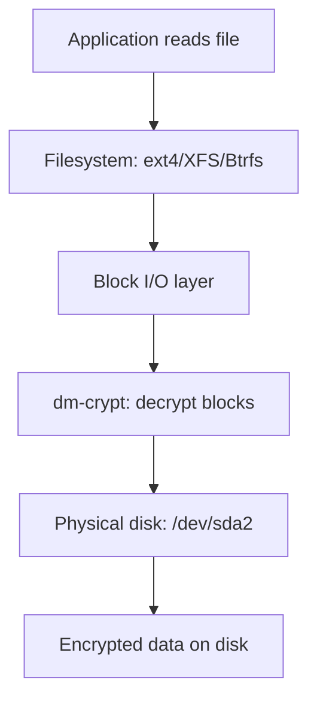
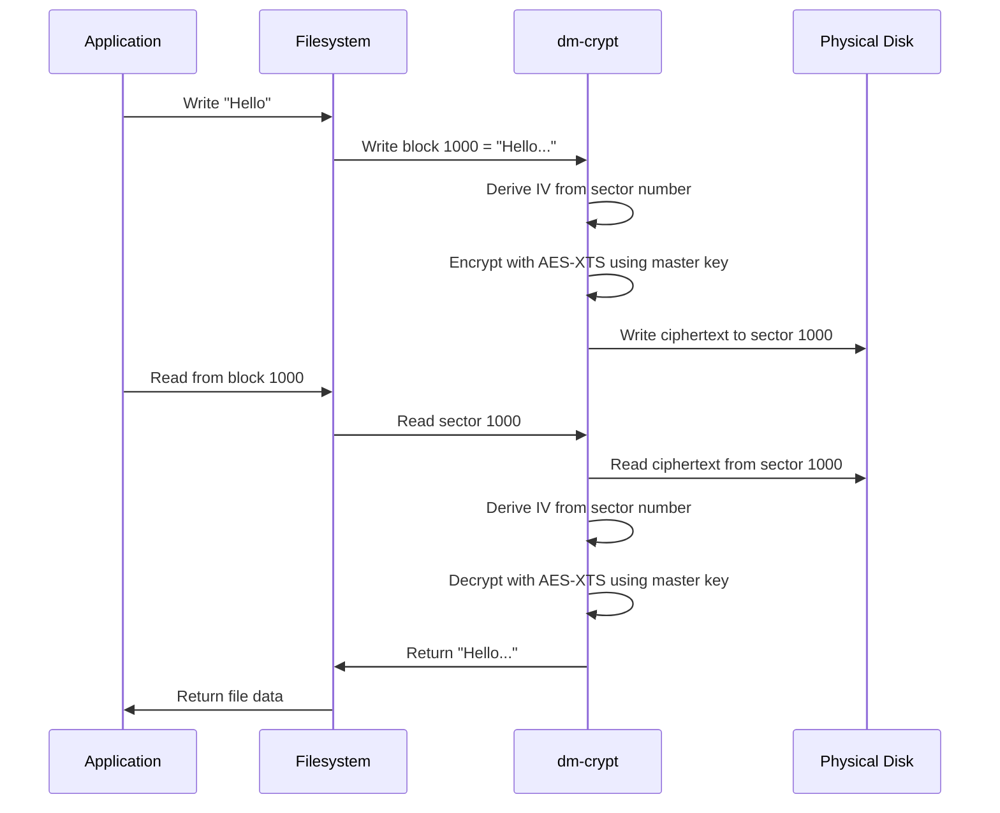
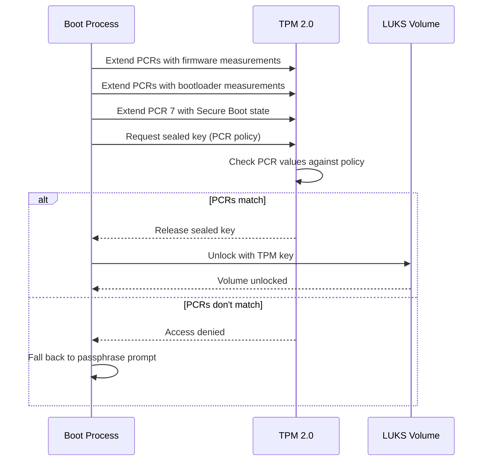

# Chapter 18: Disk Encryption

## 18.1 Introduction

Disk encryption protects data at rest by rendering it unreadable without the correct decryption key. In a world of lost laptops, decommissioned drives, and physical access attacks, encryption is not optional for sensitive data. Linux provides a mature, integrated encryption stack built on dm-crypt (the kernel's device-mapper encryption target) and LUKS (the standard key management format).

This chapter covers the architecture of Linux disk encryption, LUKS1 and LUKS2 formats, key management strategies, TPM integration for transparent unlocking, and best practices for production deployments.

## 18.2 Intuition: How Disk Encryption Works

Without encryption, reading a raw block device reveals all data:

```
/dev/sda2 (unencrypted):
  Offset 0x0000: 48 65 6C 6C 6F 20 57 6F 72 6C 64  ...  "Hello World"
```

With encryption, the same device contains ciphertext:

```
/dev/sda2 (encrypted with dm-crypt):
  Offset 0x0000: A3 F2 91 7B 4E 8C D5 02 6F 3A B7 1C  ...  (unreadable)
```

The encryption layer sits between the filesystem and the physical device:



Every read from disk is decrypted in memory; every write to disk is encrypted before reaching the physical media. The encryption is transparent to applications and filesystems.

## 18.3 Internal Architecture

### 18.3.1 dm-crypt

dm-crypt is a kernel device-mapper target that provides transparent encryption:

```
┌──────────────────────────────────────────────────────────┐
│ User Space                                                │
│  cryptsetup → open /dev/sda2 → /dev/mapper/cryptroot     │
├──────────────────────────────────────────────────────────┤
│ Kernel                                                    │
│  ┌─────────────────────────────────────────────────────┐ │
│  │ Device Mapper                                       │ │
│  │  ┌───────────────────────────────────────────────┐  │ │
│  │  │ dm-crypt target                               │  │ │
│  │  │  Cipher: aes-xts-plain64                      │  │ │
│  │  │  Key: 256-bit / 512-bit                       │  │ │
│  │  │  IV: per-sector (plain64)                     │  │ │
│  │  └───────────────────────────────────────────────┘  │ │
│  └─────────────────────────────────────────────────────┘ │
│  ┌─────────────────────────────────────────────────────┐ │
│  │ Block Device Layer                                  │ │
│  │  /dev/sda2 (encrypted physical device)              │ │
│  └─────────────────────────────────────────────────────┘ │
└──────────────────────────────────────────────────────────┘
```

**Encryption flow:**



### 18.3.2 Encryption Algorithms

**Cipher suites used in dm-crypt:**

```
Format: cipher-chainmode-ivmode

aes-xts-plain64   — Standard for disk encryption
  AES:             Block cipher (128-bit block)
  XTS:             Mode of operation (IEEE 1619, designed for storage)
  plain64:         IV derived from sector number (64-bit)
  Key size:        256-bit (128-bit AES key × 2 for XTS)
                   or 512-bit (256-bit AES key × 2 for XTS)

Other options:
  aes-cbc-plain64  — Legacy, vulnerable to watermarking attacks
  aes-xts-random   — Random IV (requires journaling, slower)
  adiantum         — For CPUs without AES acceleration
  aegis128         — AEAD cipher (newer, authenticated encryption)
```

**Performance comparison:**

```bash
# Benchmark encryption speed
sudo cryptsetup benchmark
# Output:
#     aes-xts   256b   1234.5 MiB/s   1189.2 MiB/s
#     aes-xts   512b   1567.8 MiB/s   1498.3 MiB/s
#     aes-cbc   128b    876.5 MiB/s    234.5 MiB/s
#     adiantum   256b   2345.6 MiB/s   2234.5 MiB/s
```

### 18.3.3 LUKS (Linux Unified Key Setup)

LUKS provides a standard format for encrypted volumes with key management:

```
┌──────────────────────────────────────────────────────────┐
│ LUKS2 Header                                             │
├──────────────────────────────────────────────────────────┤
│ Binary JSON header                                       │
│  ├─ Keyslots (up to 32)                                  │
│  │  ├─ Keyslot 0: passphrase-encrypted master key        │
│  │  ├─ Keyslot 1: keyfile-encrypted master key           │
│  │  └─ Keyslot 2: TPM-sealed master key                  │
│  ├─ Segments (encrypted regions)                         │
│  │  └─ Segment 0: offset, size, cipher, key size         │
│  ├─ Digests (key verification)                           │
│  └─ Tokens (optional: TPM2, FIDO2, PKCS#11)             │
├──────────────────────────────────────────────────────────┤
│ Encrypted Data                                           │
│  (master key decrypts this)                              │
└──────────────────────────────────────────────────────────┘
```

**LUKS1 vs. LUKS2:**

```
Feature              LUKS1              LUKS2
──────────────────────────────────────────────────────
Header format        Binary             Binary JSON
Max keyslots         8                  32 (expandable)
Key derivation       PBKDF2             Argon2id / PBKDF2
Tokens               No                 Yes (TPM, FIDO2)
Metadata area        Fixed              Flexible
Online reencrypt     No                 Yes
Integrity            No                 dm-integrity
Argon2id             No                 Yes (memory-hard KDF)
Backup/restore       Limited            Full header backup
```

## 18.4 LUKS Operations

### 18.4.1 Creating an Encrypted Volume

```bash
# Basic LUKS2 volume creation
sudo cryptsetup luksFormat /dev/sda2
# Prompts for passphrase
# Uses defaults: AES-256-XTS, Argon2id key derivation

# Custom options
sudo cryptsetup luksFormat \
    --type luks2 \
    --cipher aes-xts-plain64 \
    --key-size 512 \
    --hash sha256 \
    --pbkdf argon2id \
    --pbkdf-memory 1048576 \  # 1 GB RAM for key derivation
    --pbkdf-parallel 4 \      # 4 threads
    --iter-time 5000 \        # 5 seconds key derivation time
    --label encrypted-root \
    /dev/sda2

# Open (decrypt) the volume
sudo cryptsetup luksOpen /dev/sda2 cryptroot
# Enter passphrase
# Creates /dev/mapper/cryptroot

# Create filesystem
sudo mkfs.ext4 /dev/mapper/cryptroot

# Mount
sudo mount /dev/mapper/cryptroot /mnt

# Close (encrypt) the volume
sudo umount /mnt
sudo cryptsetup luksClose cryptroot
```

### 18.4.2 Key Management

```bash
# Add a second passphrase (keyslot)
sudo cryptsetup luksAddKey /dev/sda2
# Enter existing passphrase, then new passphrase

# Add a keyfile
sudo dd if=/dev/urandom of=/root/keyfile bs=4096 count=1
sudo chmod 400 /root/keyfile
sudo cryptsetup luksAddKey /dev/sda2 /root/keyfile

# Remove a passphrase
sudo cryptsetup luksRemoveKey /dev/sda2
# Enter passphrase to remove

# Remove a specific keyslot
sudo cryptsetup luksKillSlot /dev/sda2 1  # Remove keyslot 1

# Change passphrase
sudo cryptsetup luksChangeKey /dev/sda2

# Dump header info
sudo cryptsetup luksDump /dev/sda2

# Backup LUKS header (CRITICAL for recovery)
sudo cryptsetup luksHeaderBackup /dev/sda2 --header-backup-file /backup/luks-header.img

# Restore LUKS header
sudo cryptsetup luksHeaderRestore /dev/sda2 --header-backup-file /backup/luks-header.img
```

### 18.4.3 Keyfile-Based Unlocking

```bash
# Generate keyfile
sudo dd if=/dev/urandom of=/etc/luks-keys/root.key bs=4096 count=1
sudo chmod 400 /etc/luks-keys/root.key
sudo chmod 700 /etc/luks-keys

# Add keyfile to LUKS volume
sudo cryptsetup luksAddKey /dev/sda2 /etc/luks-keys/root.key

# /etc/crypttab (for automatic unlocking at boot):
# cryptroot  /dev/sda2  /etc/luks-keys/root.key  luks

# Regenerate initramfs (keyfile must be included)
sudo update-initramfs -u  # Debian/Ubuntu
sudo dracut --force        # RHEL/Fedora
```

## 18.5 Full Disk Encryption Setup

### 18.5.1 FDE with LVM on LUKS

```
Partition layout:
/dev/sda1  →  ESP (unencrypted, FAT32, 512 MB)
/dev/sda2  →  /boot (unencrypted, ext4, 1 GB)
/dev/sda3  →  LUKS encrypted container
              └─ LVM (vg0)
                 ├─ root (ext4, 30 GB)
                 ├─ home (ext4, 100 GB)
                 └─ swap (8 GB)
```

```bash
# Setup during installation or manually:

# 1. Create partitions
sudo sgdisk -n 1:0:+512M -t 1:ef00 /dev/sda
sudo sgdisk -n 2:0:+1G -t 2:8300 /dev/sda
sudo sgdisk -n 3:0:0 -t 3:8309 /dev/sda

# 2. Format ESP and boot
sudo mkfs.fat -F32 /dev/sda1
sudo mkfs.ext4 /dev/sda2

# 3. Encrypt root partition
sudo cryptsetup luksFormat /dev/sda3
sudo cryptsetup luksOpen /dev/sda3 cryptlvm

# 4. Setup LVM on encrypted volume
sudo pvcreate /dev/mapper/cryptlvm
sudo vgcreate vg0 /dev/mapper/cryptlvm
sudo lvcreate -n root -L 30G vg0
sudo lvcreate -n home -l 80%FREE vg0
sudo lvcreate -n swap -L 8G vg0

# 5. Format logical volumes
sudo mkfs.ext4 /dev/vg0/root
sudo mkfs.ext4 /dev/vg0/home
sudo mkswap /dev/vg0/swap

# 6. Mount
sudo mount /dev/vg0/root /mnt
sudo mkdir -p /mnt/home /mnt/boot /mnt/boot/efi
sudo mount /dev/vg0/home /mnt/home
sudo mount /dev/sda2 /mnt/boot
sudo mount /dev/sda1 /mnt/boot/efi
swapon /dev/vg0/swap
```

### 18.5.2 /etc/crypttab Configuration

```bash
# /etc/crypttab
# Format: name  device  keyfile  options

# With passphrase prompt
cryptroot  /dev/sda3  none  luks

# With keyfile
cryptroot  /dev/sda3  /etc/luks-keys/root.key  luks

# With keyscript (for complex unlock scenarios)
cryptroot  /dev/sda3  /etc/luks-keys/root.key  luks,keyscript=decrypt_derived

# With TPM (see section 18.7)
cryptroot  /dev/sda3  none  luks,tpm2-device=auto
```

### 18.5.3 Initramfs Integration

The initramfs must contain the tools and keys to unlock encrypted volumes at boot:

```bash
# Debian/Ubuntu: update-initramfs
sudo update-initramfs -u -k all

# RHEL/Fedora: dracut
sudo dracut --force --add "crypt"

# Verify initramfs contents (Debian)
lsinitramfs /boot/initrd.img-$(uname -r) | grep -E "crypt|luks"

# Verify initramfs contents (RHEL)
lsinitrd /boot/initramfs-$(uname -r).img | grep -E "crypt|luks"
```

## 18.6 Swap Encryption

### 18.6.1 Random Key on Boot

Swap doesn't need persistent encryption keys—data doesn't survive reboot:

```bash
# /etc/crypttab
cryptswap  /dev/sda4  /dev/urandom  swap,cipher=aes-xts-plain64,size=256

# /etc/fstab
/dev/mapper/cryptswap  none  swap  sw  0  0
```

### 18.6.2 Swap File on Encrypted Root

If root is encrypted, a swap file inherits encryption:

```bash
# Create swap file on encrypted root
sudo fallocate -l 8G /swapfile
sudo chmod 600 /swapfile
sudo mkswap /swapfile
echo '/swapfile none swap sw 0 0' | sudo tee -a /etc/fstab
sudo swapon /swapfile
```

### 18.6.3 Hibernation and Encryption

Hibernation stores RAM contents to swap. With encrypted swap, the hibernation image is encrypted on disk:

```bash
# For hibernation to work with LUKS:
# 1. Swap must be on the encrypted volume
# 2. Resume offset must be specified in kernel parameters
# 3. initramfs must unlock the volume before resume

# Kernel parameters for hibernation resume:
# resume=/dev/vg0/swap resume_offset=<offset>
```

## 18.7 TPM Integration

### 18.7.1 What is a TPM?

A Trusted Platform Module (TPM) is a hardware security chip that:
- Stores cryptographic keys in tamper-resistant hardware
- Performs key sealing (keys released only when system state matches)
- Provides random number generation
- Supports remote attestation

### 18.7.2 TPM-Based LUKS Unlock

```bash
# Check TPM availability
cat /sys/class/tpm/tpm0/device/description
tpm2_getcap properties-fixed

# Install tools
sudo apt install tpm2-tools  # Debian/Ubuntu
sudo dnf install tpm2-tools  # Fedora/RHEL

# Method 1: systemd-cryptenroll (systemd 248+)
# Enroll TPM as LUKS keyslot
sudo systemd-cryptenroll --tpm2-device=auto /dev/sda3
# Creates a TPM2-sealed key in a new keyslot

# Method 2: clevis (more flexible)
sudo apt install clevis clevis-luks clevis-tpm2

# Bind LUKS volume to TPM
sudo clevis luks bind -d /dev/sda3 tpm2 '{}'

# Test
sudo clevis luks unlock -d /dev/sda3 -n cryptroot

# /etc/crypttab for automatic unlock:
# cryptroot  /dev/sda3  none  luks
# (systemd automatically uses clevis or systemd-cryptenroll)
```

### 18.7.3 TPM2 + PCRs (Platform Configuration Registers)

PCRs measure boot state. TPM releases the key only if PCR values match enrollment:

```bash
# Common PCRs for disk encryption:
# PCR 0: UEFI firmware
# PCR 1: UEFI firmware configuration
# PCR 2: Option ROMs
# PCR 4: Boot manager
# PCR 7: Secure Boot state
# PCR 8: Kernel command line

# Enroll with specific PCRs (more secure, but sensitive to changes)
sudo systemd-cryptenroll --tpm2-device=auto --tpm2-pcrs=0+4+7 /dev/sda3

# clevis with PCRs
sudo clevis luks bind -d /dev/sda3 tpm2 '{"pcr_bank":"sha256","pcr_ids":"0,4,7"}'
```

**PCR sensitivity:** If you update firmware or change Secure Boot configuration, PCR values change and the TPM won't release the key. Always keep a passphrase fallback.

### 18.7.4 TPM Unlock Flow



## 18.8 LUKS Header Management

### 18.8.1 Header Backup (Critical!)

The LUKS header contains the master key (encrypted). If the header is corrupted, data is **permanently lost**.

```bash
# ALWAYS back up the LUKS header immediately after creation
sudo cryptsetup luksHeaderBackup /dev/sda3 \
    --header-backup-file /backup/luks-header-$(date +%Y%m%d).img

# Store backups in multiple secure locations
# - Encrypted USB drive
# - Secure offline storage
# - Encrypted cloud storage

# Restore header
sudo cryptsetup luksHeaderRestore /dev/sda3 \
    --header-backup-file /backup/luks-header-20240101.img
```

### 18.8.2 Header Detached Storage

Store the LUKS header separately from the encrypted data:

```bash
# Create with detached header
sudo cryptsetup luksFormat --header /dev/sda1 --header-size 16384 /dev/sda2

# Open with detached header
sudo cryptsetup luksOpen --header /dev/sda1 cryptroot /dev/sda2
```

### 18.8.3 Online Reencryption (LUKS2)

```bash
# Reencrypt LUKS2 volume online (change cipher, key size, etc.)
sudo cryptsetup reencrypt /dev/sda3

# With specific options
sudo cryptsetup reencrypt \
    --cipher aes-xts-plain64 \
    --key-size 512 \
    --pbkdf argon2id \
    --batch-mode \
    /dev/sda3
```

## 18.9 Common Pitfalls

### 18.9.1 Lost Passphrase

```bash
# If you have a keyfile backup:
sudo cryptsetup luksOpen /dev/sda3 cryptroot --key-file /backup/keyfile

# If you have a second keyslot:
sudo cryptsetup luksOpen /dev/sda3 cryptroot  # Try other passphrases

# If no recovery method: data is LOST
# This is by design—encryption means no backdoor
```

### 18.9.2 Corrupted LUKS Header

```bash
# If you have a header backup:
sudo cryptsetup luksHeaderRestore /dev/sda3 --header-backup-file /backup/header.img

# If no backup: data is likely LOST
# Prevention: ALWAYS back up headers
```

### 18.9.3 Performance Impact

Encryption adds CPU overhead. On modern CPUs with AES-NI, impact is minimal:

```bash
# Check for AES-NI support
grep -o aes /proc/cpuinfo | head -1
# If "aes" appears: hardware acceleration available

# Benchmark
sudo cryptsetup benchmark
# aes-xts with AES-NI: typically 1-3 GB/s (minimal impact on SSDs)

# For CPUs without AES-NI (e.g., some ARM):
# Use adiantum cipher (optimized for software implementation)
sudo cryptsetup luksFormat --cipher xchacha12,aes-adiantum-plain64 /dev/sda2
```

### 18.9.4 TPM Changes After Firmware Update

Firmware updates change PCR values, preventing TPM-based unlock:

```bash
# Before firmware update:
# 1. Ensure you know the LUKS passphrase (not just TPM)
# 2. After update, re-enroll TPM:
sudo systemd-cryptenroll --wipe-slot=tpm2 /dev/sda3
sudo systemd-cryptenroll --tpm2-device=auto /dev/sda3
```

### 18.9.5 Suspend/Resume with Encrypted Swap

Suspend-to-RAM (sleep) doesn't write to disk, so encryption isn't an issue. Suspend-to-disk (hibernation) writes RAM to swap—if swap is encrypted with a random key, resume fails.

```bash
# For hibernation with encrypted swap:
# Use persistent key for swap (not random)
# Or: swap file on encrypted root partition
```

## 18.10 Best Practices

1. **Always back up LUKS headers** — This is the #1 rule. Lost header = lost data.
2. **Use LUKS2** — Better key derivation (Argon2id), more keyslots, online reencrypt
3. **Use AES-XTS-256 or 512** — Standard, well-vetted cipher
4. **Set strong Argon2id parameters** — Memory-hard KDF resists brute-force
5. **Keep passphrase fallback** — Even with TPM/keyfile, maintain a passphrase
6. **Encrypt swap** — Prevents sensitive data persistence
7. **Use AES-NI** — Ensure hardware acceleration is available
8. **Separate `/boot`** — `/boot` must be unencrypted for bootloader access (or use GRUB's LUKS support)
9. **Document key slots** — Track which keyslots hold which credentials
10. **Test recovery** — Practice header restore and passphrase recovery before emergencies

## 18.11 Exercises

### Exercise 1: LUKS Setup
Create a LUKS2 encrypted volume with Argon2id key derivation. Add two passphrases and a keyfile. Verify all three can unlock the volume.

### Exercise 2: Full Disk Encryption
Set up a system with LVM-on-LUKS: ESP and `/boot` unencrypted, everything else encrypted. Configure automatic unlocking with a keyfile from initramfs.

### Exercise 3: TPM Integration
Configure TPM-based automatic unlock for a LUKS volume using systemd-cryptenroll. Verify it works, then simulate a firmware change and demonstrate recovery.

### Exercise 4: LUKS Header Recovery
Back up a LUKS header, intentionally corrupt it, restore from backup, and verify data access is restored.

### Exercise 5: Performance Benchmarking
Benchmark encryption performance with different ciphers and key sizes. Compare AES-XTS with and without AES-NI (if possible, test in a VM with AES-NI disabled).

## 18.12 References

- [cryptsetup Documentation](https://gitlab.com/cryptsetup/cryptsetup/-/wikis/home)
- [LUKS2 Format Specification](https://gitlab.com/cryptsetup/cryptsetup/-/wikis/LUKS2-text-format)
- [Arch Linux: Data-at-rest Encryption](https://wiki.archlinux.org/title/Dm-crypt/Encrypting_an_entire_system)
- [tpm2-tools Documentation](https://github.com/tpm2-software/tpm2-tools)
- [systemd-cryptenroll(1)](https://www.freedesktop.org/software/systemd/man/latest/systemd-cryptenroll.html)
- [Clevis Framework](https://github.com/latchset/clevis)
- [NIST: AES-XTS (IEEE 1619)](https://csrc.nist.gov/publications/detail/sp/800-38e/final)
- [Argon2 Specification](https://github.com/P-H-C/phc-winner-argon2)
