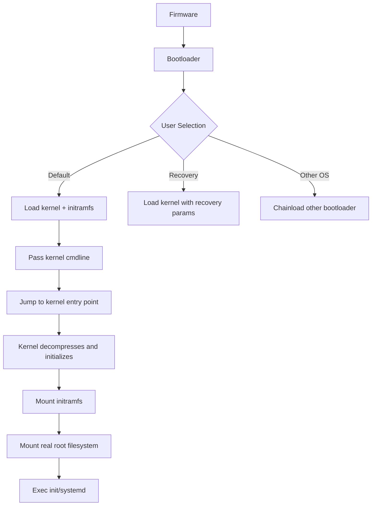

# Chapter 19: Bootloaders

## 19.1 Introduction

The bootloader is the first software that runs after the firmware finishes hardware initialization. Its job is simple in concept but complex in practice: load the operating system kernel into memory and transfer control to it. In Linux, the bootloader also presents a boot menu, passes kernel parameters, and optionally chainloads other operating systems.

This chapter covers GRUB2 (the dominant Linux bootloader), systemd-boot (a modern lightweight alternative), rEFInd (a graphical UEFI boot manager), and U-Boot (the standard bootloader for embedded and ARM systems).

## 19.2 Intuition: What Does a Bootloader Do?

The bootloader bridges the gap between firmware and operating system:

```
Firmware (UEFI/BIOS) → Bootloader → Kernel → initramfs → init/systemd
```

Specifically, the bootloader:
1. **Presents a menu** — Letting the user choose which kernel or OS to boot
2. **Loads the kernel** — Reads the kernel image from disk into memory
3. **Loads initramfs** — The initial RAM filesystem with drivers and scripts
4. **Passes parameters** — Kernel command-line arguments (root device, console, etc.)
5. **Transfers control** — Jumps to the kernel entry point



## 19.3 GRUB2

### 19.3.1 Architecture

GRUB2 (GRand Unified Bootloader version 2) is the most widely used Linux bootloader. Its architecture is modular and scriptable:

```
┌──────────────────────────────────────────────────────────┐
│ GRUB2 Architecture                                        │
├──────────────────────────────────────────────────────────┤
│ Stage 1 (boot.img / EFI binary)                          │
│  - Loaded by firmware                                    │
│  - Minimal: just enough to load Stage 2                  │
│  - MBR: 446 bytes (boot.img)                             │
│  - UEFI: grubx64.efi (includes core.img)                │
├──────────────────────────────────────────────────────────┤
│ Stage 1.5 (core.img)                                     │
│  - Contains filesystem drivers                           │
│  - Locates and loads Stage 2                             │
│  - Embedded in BIOS Boot Partition or MBR gap            │
├──────────────────────────────────────────────────────────┤
│ Stage 2 (/boot/grub/)                                    │
│  - grub.cfg: Main configuration                          │
│  - Modules: filesystem, video, crypto drivers            │
│  - Scripts: /etc/grub.d/ scripts generate grub.cfg       │
│  - Themes: fonts, backgrounds                            │
└──────────────────────────────────────────────────────────┘
```

### 19.3.2 GRUB2 Configuration

**Main config file: `/boot/grub/grub.cfg`** (auto-generated, don't edit directly)

```bash
# /boot/grub/grub.cfg (auto-generated by grub-mkconfig)
set default=0
set timeout=5
set menu_color_normal=white/black
set menu_color_highlight=black/light-gray

menuentry 'Ubuntu' --class ubuntu --class gnu-linux --class gnu --class os {
    recordfail
    load_video
    gfxmode $linux_gfx_mode
    insmod gzio
    insmod part_gpt
    insmod ext2
    search --no-floppy --fs-uuid --set=root abc123-def456
    linux /vmlinuz-6.8.0-generic root=UUID=xyz789 ro quiet splash
    initrd /initrd.img-6.8.0-generic
}

menuentry 'Ubuntu (recovery mode)' --class ubuntu {
    insmod part_gpt
    insmod ext2
    search --no-floppy --fs-uuid --set=root abc123-def456
    linux /vmlinuz-6.8.0-generic root=UUID=xyz789 ro recovery nomodeset
    initrd /initrd.img-6.8.0-generic
}
```

**User config: `/etc/default/grub`**

```bash
# /etc/default/grub
GRUB_DEFAULT=0                    # Default menu entry (0-indexed)
GRUB_TIMEOUT=5                    # Menu timeout in seconds
GRUB_TIMEOUT_STYLE=menu           # "menu" or "hidden"
GRUB_DISTRIBUTOR="Ubuntu"         # Distribution name
GRUB_CMDLINE_LINUX_DEFAULT="quiet splash"  # Default kernel parameters
GRUB_CMDLINE_LINUX=""              # Additional kernel parameters
GRUB_TERMINAL="console"           # Terminal type (console/gfxterm)
GRUB_GFXMODE=1920x1080            # Graphics mode for menu
GRUB_DISABLE_OS_PROBER=false      # Enable os-prober for other OSes
GRUB_ENABLE_CRYPTODISK=y          # Enable encrypted disk support
```

**Generator scripts: `/etc/grub.d/`**

```
/etc/grub.d/
├── 00_header        — Load settings from /etc/default/grub
├── 05_debian_theme  — Colors and background
├── 10_linux         — Linux kernel entries (auto-detected)
├── 20_linux_xen     — Xen hypervisor entries
├── 30_os-prober     — Other OS entries (Windows, etc.)
├── 30_uefi-firmware — UEFI firmware setup entry
├── 40_custom        — Custom entries (user-editable)
└── 41_custom        — Additional custom entries
```

### 19.3.3 GRUB2 Commands

```bash
# Regenerate grub.cfg
sudo update-grub                    # Debian/Ubuntu
sudo grub2-mkconfig -o /boot/grub2/grub.cfg  # RHEL/Fedora

# Install GRUB
# BIOS:
sudo grub-install /dev/sda
# UEFI:
sudo grub-install --target=x86_64-efi --efi-directory=/boot/efi

# Set default kernel
sudo grub-set-default 0            # By menu position
sudo grub-set-default "Ubuntu, with Linux 6.8.0-generic"  # By name

# Edit kernel parameters at boot (temporary)
# At GRUB menu, press 'e' to edit
# Modify the 'linux' line
# Press Ctrl+X or F10 to boot
```

### 19.3.4 GRUB2 Rescue Mode

```bash
# GRUB rescue prompt (when grub.cfg is missing or broken)
grub> ls                          # List devices
grub> ls (hd0,gpt2)/             # List files on partition
grub> set root=(hd0,gpt2)        # Set root partition
grub> linux /vmlinuz-6.8.0 root=/dev/sda2 ro
grub> initrd /initrd.img-6.8.0
grub> boot

# Or from a live USB:
sudo mount /dev/sda2 /mnt
sudo mount /dev/sda1 /mnt/boot/efi
for d in dev proc sys run; do sudo mount --bind /$d /mnt/$d; done
sudo chroot /mnt
grub-install /dev/sda
update-grub
exit
```

### 19.3.5 Custom GRUB Entries

```bash
# /etc/grub.d/40_custom
#!/bin/sh
exec tail -n +3 $0

menuentry "Custom Kernel 6.9.0-rc1" {
    insmod part_gpt
    insmod ext2
    search --no-floppy --fs-uuid --set=root abc123
    linux /vmlinuz-6.9.0-rc1 root=UUID=xyz789 ro quiet
    initrd /initrd.img-6.9.0-rc1
}

menuentry "Memory Test (memtest86+)" {
    insmod part_gpt
    insmod fat
    search --no-floppy --fs-uuid --set=root ABCD-1234
    chainloader /EFI/tools/memtest86.efi
}
```

### 19.3.6 GRUB2 Modules

```bash
# Common GRUB modules:
# Filesystem: ext2, xfs, btrfs, ntfs, fat, iso9660
# Partition: part_gpt, part_msdos
# Crypto: luks, luks2, cryptodisk
# Video: all_video, gfxterm, video_bochs, video_cirrus
# Compression: gzio, xzio, lzopio
# Other: normal, configfile, chain, loopback

# List available modules
ls /usr/lib/grub/x86_64-efi/

# Load module at grub prompt
grub> insmod luks
grub> insmod btrfs
```

## 19.4 systemd-boot

### 19.4.1 Overview

systemd-boot (formerly gummiboot) is a simple UEFI boot manager. It's part of the systemd project and is designed to be minimal, fast, and easy to configure.

```
┌──────────────────────────────────────────────────────────┐
│ systemd-boot                                              │
│  - Single EFI binary (~100 KB)                           │
│  - Reads simple text config files from ESP               │
│  - No scripting language                                  │
│  - Auto-detects Windows and other EFI applications        │
│  - Supports Secure Boot (when properly signed)           │
└──────────────────────────────────────────────────────────┘
```

### 19.4.2 Installation

```bash
# Install systemd-boot
sudo bootctl install

# This installs the systemd-boot EFI binary to the ESP
# and registers it as a UEFI boot entry
```

### 19.4.3 Configuration

**Loader config: `/boot/efi/loader/loader.conf`**

```ini
# /boot/efi/loader/loader.conf
default      @saved
timeout      3
console-mode auto
editor       no          # Disable editor for security (prevents kernel param changes at boot)
```

**Boot entries: `/boot/efi/loader/entries/`**

```ini
# /boot/efi/loader/entries/ubuntu-6.8.0.conf
title      Ubuntu
version    6.8.0-generic
machine-id abc123def456
options    root=UUID=xyz789 ro quiet splash
linux      /vmlinuz-6.8.0-generic
initrd     /initrd.img-6.8.0-generic

# /boot/efi/loader/entries/ubuntu-6.8.0-recovery.conf
title      Ubuntu (Recovery)
version    6.8.0-generic
machine-id abc123def456
options    root=UUID=xyz789 ro recovery nomodeset
linux      /vmlinuz-6.8.0-generic
initrd     /initrd.img-6.8.0-generic
```

### 19.4.4 systemd-boot vs. GRUB2

```
Feature              GRUB2              systemd-boot
──────────────────────────────────────────────────────
Configuration        Complex (scripts)  Simple (text files)
BIOS support         Yes                No (UEFI only)
Encryption           Yes                No (needs separate /boot)
Filesystem drivers   Many (ext2, xfs,   None (relies on UEFI)
                     btrfs, ntfs...)
Scripting            Yes (grub.cfg)     No
Chainloading         Yes                Yes
Secure Boot          Yes                Yes (via shim)
Size                 ~1 MB              ~100 KB
Boot speed           Slower             Faster
Complexity           High               Low
```

### 19.4.5 Automatic Entry Generation

```bash
# Debian/Ubuntu: kernel-install hooks
# Entries are automatically created when kernels are installed

# Manual entry creation
sudo bootctl status

# For Arch Linux, use mkinitcpio hooks
# /etc/pacman.d/hooks/100-systemd-boot.hook
```

## 19.5 rEFInd

### 19.5.1 Overview

rEFInd is a UEFI boot manager that provides a graphical interface with auto-detection of operating systems:

```bash
# Install rEFInd
sudo apt install refind
# Or manually:
sudo refind-install

# rEFInd auto-detects:
# - Linux kernels (EFI stub loader)
# - Windows Boot Manager
# - macOS (on Apple hardware)
# - Other EFI applications
# - BIOS/CSM boot entries
```

### 19.5.2 Configuration

```bash
# /boot/efi/EFI/refind/refind.conf

# Menu timeout
timeout 20

# Default selection
default_selection 1

# Graphics resolution
resolution 1920 1080

# Theme
include themes/rEFInd-minimal/theme.conf

# Auto-detect kernels
scan_all_linux_kernels true

# Manual boot entry
menuentry "Custom Ubuntu" {
    icon EFI/refind/icons/os_ubuntu.png
    volume abc123-def456
    loader vmlinuz-6.8.0-generic
    initrd initrd.img-6.8.0-generic
    options "root=UUID=xyz789 ro quiet splash"
}
```

### 19.5.3 rEFInd Features

- **Auto-detection**: Finds OSes without manual configuration
- **Graphical UI**: Icons, themes, mouse support
- **EFI stub loading**: Can load Linux kernels directly without GRUB
- **Driver support**: ext2, ext4, HFS+, NTFS, ISO 9660, Btrfs
- **Secure Boot**: Works with shim or direct signing
- **BIOS support**: Can chainload BIOS-mode bootloaders

## 19.6 U-Boot (Embedded/ARM)

### 19.6.1 Overview

U-Boot (Das U-Boot) is the de facto standard bootloader for embedded Linux systems, ARM boards, and many RISC-V platforms:

```
┌──────────────────────────────────────────────────────────┐
│ U-Boot Boot Flow (typical ARM board)                      │
├──────────────────────────────────────────────────────────┤
│ ROM Boot Code → SPL (Secondary Program Loader) → U-Boot  │
│ → Load kernel + DTB → Boot Linux                         │
├──────────────────────────────────────────────────────────┤
│ Storage: eMMC, SD card, SPI flash, USB, network (TFTP)   │
│ Formats: FIT image, raw kernel + DTB, boot scripts       │
└──────────────────────────────────────────────────────────┘
```

### 19.6.2 U-Boot Environment

```bash
# U-Boot has its own shell and scripting language
# Access via serial console during boot (press any key)

# Common U-Boot commands:
=> help                          # List all commands
=> printenv                      # Print environment variables
=> setenv bootargs "root=/dev/mmcblk0p2 console=ttyS0"
=> saveenv                       # Save to persistent storage
=> boot                          # Boot the system

=> ls mmc 0:1 /                  # List files on SD card partition 1
=> load mmc 0:1 0x80000000 boot/zImage  # Load kernel to memory
=> load mmc 0:1 0x83000000 boot/dtbs/am335x-boneblack.dtb  # Load DTB
=> bootz 0x80000000 - 0x83000000  # Boot kernel
```

### 19.6.3 Boot Script

```bash
# boot.scr — U-Boot boot script (compiled with mkimage)
# Source file (boot.cmd):

setenv bootargs "root=/dev/mmcblk0p2 rootwait console=ttyS0,115200"
load mmc 0:1 ${kernel_addr_r} boot/zImage
load mmc 0:1 ${fdt_addr_r} boot/dtbs/${fdtfile}
load mmc 0:1 ${ramdisk_addr_r} boot/initramfs.img
bootz ${kernel_addr_r} ${ramdisk_addr_r} ${fdt_addr_r}

# Compile boot script
mkimage -A arm -O linux -T script -C none -a 0 -e 0 -n "Boot Script" \
    -d boot.cmd boot.scr
```

### 19.6.4 FIT Image

Flattened Image Tree (FIT) bundles kernel, DTB, and initramfs into a single signed image:

```bash
# Create FIT image from its source description (its)
mkimage -f fit-image.its fit-image.itb

# fit-image.its:
/ {
    description = "Linux kernel FIT image";
    images {
        kernel {
            description = "Linux kernel";
            data = /incbin/("zImage");
            type = "kernel";
            arch = "arm";
            os = "linux";
            compression = "none";
            load = <0x80000000>;
            entry = <0x80000000>;
        };
        fdt {
            description = "Device tree";
            data = /incbin/("device.dtb");
            type = "flat_dt";
            arch = "arm";
            compression = "none";
        };
    };
    configurations {
        default = "conf";
        conf {
            description = "Boot configuration";
            kernel = "kernel";
            fdt = "fdt";
        };
    };
};
```

## 19.7 Bootloader Installation

### 19.7.1 GRUB2 Installation (BIOS)

```bash
# Install to MBR
sudo grub-install /dev/sda

# Install to partition (not recommended—fragile)
sudo grub-install /dev/sda1

# For RAID arrays
sudo grub-install /dev/sda
sudo grub-install /dev/sdb  # Install to both disks for redundancy
```

### 19.7.2 GRUB2 Installation (UEFI)

```bash
# Standard installation
sudo grub-install --target=x86_64-efi \
    --efi-directory=/boot/efi \
    --bootloader-id=ubuntu \
    --recheck

# With removable flag (for recovery or portable drives)
sudo grub-install --target=x86_64-efi \
    --efi-directory=/boot/efi \
    --removable

# This creates /boot/efi/EFI/BOOT/BOOTX64.EFI (fallback path)
```

### 19.7.3 systemd-boot Installation

```bash
# Install
sudo bootctl install

# Update
sudo bootctl update

# Verify
bootctl status
```

## 19.8 Kernel Parameters

### 19.8.1 Common Kernel Parameters

```bash
# Root filesystem
root=UUID=xxxx-xxxx-xxxx           # Root device by UUID
root=/dev/sda2                      # Root device by name (less reliable)
ro                                   # Mount root read-only initially
rw                                   # Mount root read-write

# Console
console=ttyS0,115200                # Serial console
console=tty0                        # VGA console

# Display
nomodeset                            # Disable kernel mode setting (for GPU issues)
video=1920x1080                     # Set resolution
quiet                                # Suppress boot messages
splash                               # Show splash screen

# Debug
systemd.log_level=debug             # Verbose systemd logging
break=premount                      # Drop to shell before root mount
init=/bin/bash                      # Skip init (emergency shell)

# Performance
elevator=deadline                    # I/O scheduler (deprecated in newer kernels)
transparent_hugepage=always          # THP policy
numa=off                             # Disable NUMA

# Security
enforcing=0                          # Disable SELinux enforcement
apparmor=0                           # Disable AppArmor
```

### 19.8.2 Editing Parameters at Boot (GRUB)

```
1. At GRUB menu, press 'e' to edit
2. Find the 'linux' line
3. Add/modify parameters at the end
4. Press Ctrl+X or F10 to boot (temporary change)
```

### 19.8.3 Persistent Parameter Changes

```bash
# Edit /etc/default/grub
GRUB_CMDLINE_LINUX_DEFAULT="quiet splash"
GRUB_CMDLINE_LINUX="apparmor=1 security=apparmor"

# Regenerate config
sudo update-grub
```

## 19.9 Common Pitfalls

### 19.9.1 GRUB Not Installed on Correct Disk

```bash
# Symptoms: "No bootable device" after installation
# Fix: Reinstall GRUB to the correct disk
sudo grub-install /dev/sda  # Not /dev/sda1!
sudo update-grub
```

### 19.9.2 Missing initramfs

```bash
# Symptoms: Kernel panic - unable to mount root fs
# Fix: Regenerate initramfs
sudo update-initramfs -u -k all   # Debian/Ubuntu
sudo dracut --force                # RHEL/Fedora
```

### 19.9.3 Wrong Root Device

```bash
# Symptoms: "Waiting for root device" timeout
# Fix: Verify root= parameter
# Use UUID (recommended):
blkid /dev/sda2
# Update GRUB_CMDLINE_LINUX with correct UUID
```

### 19.9.4 Windows Update Overwrites GRUB

```bash
# Fix: Boot from live USB and reinstall
sudo mount /dev/sda2 /mnt
sudo mount /dev/sda1 /mnt/boot/efi
for d in dev proc sys run; do sudo mount --bind /$d /mnt/$d; done
sudo chroot /mnt
grub-install --target=x86_64-efi --efi-directory=/boot/efi
update-grub
exit
```

### 19.9.5 GRUB Rescue After Kernel Removal

```bash
# If you accidentally remove all kernels:
# Boot from live USB
# Mount root partition
# Reinstall kernel package
sudo chroot /mnt
apt install linux-image-generic  # Debian/Ubuntu
dnf install kernel               # RHEL/Fedora
update-grub
```

## 19.10 Best Practices

1. **Use UUIDs** for root device in bootloader configuration
2. **Keep multiple kernel versions** — At least one known-good kernel
3. **Disable GRUB editor** on production servers (security)
4. **Set a GRUB password** for servers
5. **Back up `/boot`** — Kernel and initramfs are critical
6. **Use systemd-boot** for simple UEFI-only setups
7. **Use GRUB** for complex setups (BIOS, LUKS, multi-OS)
8. **Use rEFInd** for multi-OS desktops with graphical preference
9. **Use U-Boot** for embedded/ARM systems
10. **Test bootloader changes in VMs** before applying to production

## 19.11 Exercises

### Exercise 1: GRUB Configuration
Install GRUB2 on a UEFI system. Create custom menu entries, set a default kernel, and configure a 10-second timeout. Test recovery from a broken grub.cfg.

### Exercise 2: systemd-boot Setup
Install and configure systemd-boot on a UEFI system. Create boot entries for two kernel versions and a recovery mode.

### Exercise 3: Bootloader Recovery
Simulate bootloader failure (delete grub.cfg and kernel) on a VM. Recover using a live USB without reinstalling the OS.

### Exercise 4: rEFInd Installation
Install rEFInd on a multi-boot system. Configure it with a custom theme and verify it auto-detects all installed operating systems.

### Exercise 5: U-Boot Scripting
Write a U-Boot boot script for an ARM board that loads a kernel and DTB from an SD card, with fallback to a recovery partition.

## 19.12 References

- [GRUB2 Manual](https://www.gnu.org/software/grub/manual/grub/)
- [systemd-boot Documentation](https://www.freedesktop.org/software/systemd/man/latest/systemd-boot.html)
- [rEFInd Documentation](https://www.rodsbooks.com/refind/)
- [U-Boot Documentation](https://docs.u-boot.org/)
- [Arch Linux: GRUB](https://wiki.archlinux.org/title/GRUB)
- [Arch Linux: systemd-boot](https://wiki.archlinux.org/title/systemd-boot)
- [Rod Smith: Managing EFI Boot Loaders](https://www.rodsbooks.com/efi-bootloaders/)
