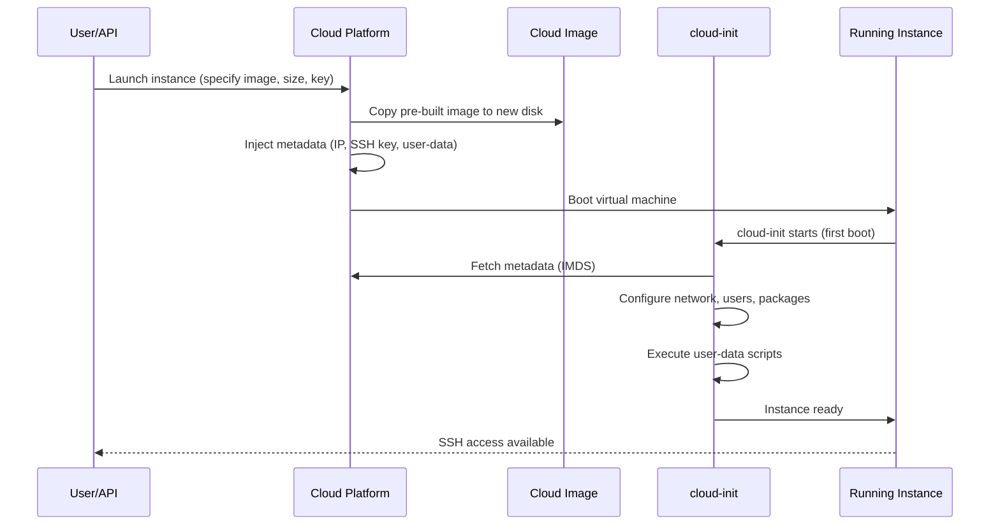
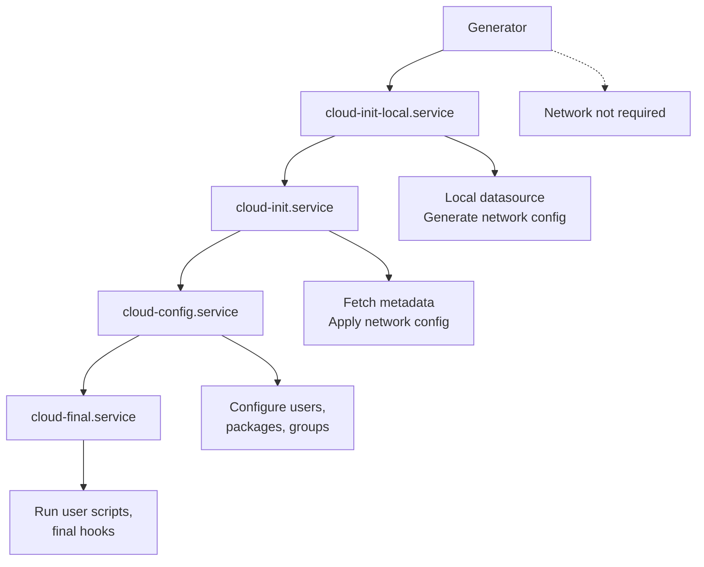
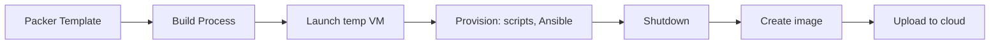
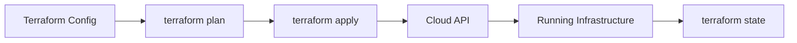

# Chapter 21: Cloud Installation

## 21.1 Introduction

Cloud installation represents a fundamental shift from traditional bare-metal provisioning. Instead of booting from physical media and answering interactive prompts, cloud instances are launched from pre-built images that configure themselves automatically on first boot. Infrastructure-as-Code (IaC) tools like Terraform and Packer enable reproducible, version-controlled infrastructure deployment at scale.

This chapter covers cloud-init (the standard cloud instance initialization tool), cloud image formats, Packer for image building, and Terraform for infrastructure provisioning.

## 21.2 Intuition: How Cloud Instances Boot

When you launch a cloud instance:

1. **The cloud platform copies a pre-built disk image** to a new virtual disk
2. **The instance boots from this image** (kernel, initramfs, rootfs are already installed)
3. **cloud-init runs on first boot** — configures networking, users, packages, and custom scripts
4. **The instance is ready** — typically in seconds to minutes



## 21.3 Cloud-Init

### 21.3.1 Architecture

cloud-init runs in stages during boot:



**Stages:**
1. **Generator**: Determines if cloud-init should run
2. **cloud-init-local**: Runs before networking; processes local data sources
3. **cloud-init**: Fetches metadata from cloud platform (requires network); applies network configuration
4. **cloud-config**: Processes cloud-config modules (users, packages, groups)
5. **cloud-final**: Runs user scripts and final modules

### 21.3.2 Data Sources

cloud-init discovers the cloud platform through data sources:

```bash
# Common data sources:
# AWS:        Ec2 (IMDS at 169.254.169.254)
# Azure:      Azure (IMDS at 169.254.169.254)
# GCP:        GCE (metadata at metadata.google.internal)
# OpenStack:  OpenStack (config drive or metadata service)
# VMware:     VMware (GuestInfo or OVF environment)
# NoCloud:    NoCloud (local seed, for testing)
# LXD:        LXD (for LXD containers)

# Check current data source
cloud-id
# aws

# Query cloud-init metadata
cloud-init query
cloud-init query ds.meta_data
cloud-init query ds.user_data
```

### 21.3.3 User-Data Formats

cloud-init accepts several input formats:

```yaml
# Format 1: cloud-config (YAML) — most common
#cloud-config
hostname: web-server
users:
  - name: deploy
    ssh_authorized_keys:
      - ssh-ed25519 AAAAC3...
packages:
  - nginx
  - certbot
runcmd:
  - systemctl enable --now nginx
```

```bash
#!/bin/bash
# Format 2: Shell script (executed as root)
apt update && apt install -y nginx
systemctl enable --now nginx
```

```
Content-Type: multipart/mixed; boundary="==BOUNDARY=="
--==BOUNDARY==
Content-Type: text/cloud-config; charset="utf-8"
#cloud-config
hostname: web-server
--==BOUNDARY==
Content-Type: text/x-shellscript; charset="utf-8"
#!/bin/bash
echo "Hello from cloud-init"
--==BOUNDARY==--
```

```bash
# Format 4: Include (pull config from URLs)
#include
https://example.com/cloud-config.yaml
https://example.com/setup.sh
```

### 21.3.4 Cloud-Config Reference

```yaml
#cloud-config

# System configuration
hostname: web-server-01
fqdn: web-server-01.example.com
manage_etc_hosts: true
timezone: America/New_York
locale: en_US.UTF-8

# Users and groups
groups:
  - deploy
users:
  - name: deploy
    primary_group: deploy
    groups: sudo
    shell: /bin/bash
    sudo: ['ALL=(ALL) NOPASSWD:ALL']
    lock_passwd: true
    ssh_authorized_keys:
      - ssh-ed25519 AAAAC3NzaC1lZDI1NTE5AAAAI... deploy@workstation
  - name: admin
    shell: /bin/bash
    passwd: $6$rounds=656000$salt$hash
    lock_passwd: false

# Package management
package_update: true
package_upgrade: true
packages:
  - nginx
  - certbot
  - python3-certbot-nginx
  - htop
  - tmux
  - git

# Network configuration (v2)
network:
  version: 2
  ethernets:
    ens3:
      dhcp4: true
      dhcp6: false

# Disk setup
disk_setup:
  /dev/sdb:
    table_type: gpt
    layout: true
    overwrite: false
fs_setup:
  - label: data
    filesystem: ext4
    device: /dev/sdb1
mounts:
  - [/dev/sdb1, /data, ext4, "defaults,noatime", "0", "2"]

# Files
write_files:
  - path: /etc/nginx/conf.d/custom.conf
    content: |
      server {
          listen 80;
          server_name example.com;
          root /var/www/html;
      }
    permissions: '0644'
    owner: root:root

  - path: /etc/motd
    content: |
      Welcome to the cloud instance!
      Configured by cloud-init.
    permissions: '0644'

# Commands
runcmd:
  - [mkdir, -p, /var/www/html]
  - [systemctl, enable, --now, nginx]
  - [ufw, allow, "80/tcp"]
  - [ufw, allow, "443/tcp"]
  - [ufw, --force, enable]
  - |
    echo "Setup complete at $(date)" >> /var/log/setup.log

# Power state
power_state:
  delay: "now"
  mode: reboot
  message: "Rebooting after cloud-init configuration"
  timeout: 30
  condition: true

# Final message
final_message: "Cloud-init finished after $UPTIME seconds"
```

### 21.3.5 NoCloud Data Source (Local Testing)

```bash
# Create seed data for local VM testing
mkdir -p /tmp/nocloud

# meta-data
cat > /tmp/nocloud/meta-data << 'EOF'
instance-id: test-001
local-hostname: test-vm
EOF

# user-data
cat > /tmp/nocloud/user-data << 'EOF'
#cloud-config
users:
  - name: test
    ssh_authorized_keys:
      - ssh-ed25519 AAAAC3...
    sudo: ALL=(ALL) NOPASSWD:ALL
packages:
  - nginx
runcmd:
  - systemctl enable --now nginx
EOF

# Create seed ISO
genisoimage -output nocloud.iso -volid cidata -joliet -rock \
    /tmp/nocloud/user-data /tmp/nocloud/meta-data

# Boot VM with seed ISO attached
qemu-system-x86_64 -m 2048 -drive file=ubuntu.img,format=qcow2 \
    -cdrom nocloud.iso -net nic -net user
```

## 21.4 Cloud Images

### 21.4.1 Image Formats

```
Format      Platform       Description
──────────────────────────────────────────────────
qcow2       OpenStack/QEMU Copy-on-write, supports snapshots
vmdk        VMware         Virtual Machine Disk
vhd/vhdx    Azure/Hyper-V  Virtual Hard Disk
ami         AWS            Amazon Machine Image
raw         Generic        Raw disk image
iso         Generic        Optical disk image
tar.gz      Container      Compressed filesystem archive
```

### 21.4.2 Downloading Cloud Images

```bash
# Ubuntu
wget https://cloud-images.ubuntu.com/noble/current/noble-server-cloudimg-amd64.img

# Debian
wget https://cloud.debian.org/images/cloud/bookworm/latest/debian-12-generic-amd64.qcow2

# Fedora
wget https://download.fedoraproject.org/pub/fedora/linux/releases/40/Cloud/x86_64/images/Fedora-Cloud-Base-Generic-40-1.14.x86_64.qcow2

# Rocky Linux
wget https://dl.rockylinux.org/pub/rocky/9/images/x86_64/Rocky-9-GenericCloud.latest.x86_64.qcow2
```

### 21.4.3 Customizing Cloud Images

```bash
# Method 1: virt-customize (libguestfs)
sudo virt-customize -a ubuntu-cloud.img \
    --install nginx,certbot \
    --hostname web-server \
    --ssh-inject deploy:file:~/.ssh/id_ed25519.pub \
    --timezone UTC \
    --selinux-relabel

# Method 2: virt-sysprep (prepare for cloning)
sudo virt-sysprep -a ubuntu-cloud.img \
    --operations machine-id,ssh-hostkeys,logfiles,tmp-files

# Method 3: guestfish (interactive)
sudo guestfish -a ubuntu-cloud.img
><fs> run
><fs> mount /dev/sda1 /
><fs> write /etc/hostname "custom-server"
><fs> exit
```

## 21.5 Packer

### 21.5.1 Overview

Packer by HashiCorp automates machine image creation. It launches a temporary instance, configures it (via shell scripts, Ansible, etc.), and produces a reusable image.



### 21.5.2 Packer Template (HCL2)

```hcl
# ubuntu-cloud.pkr.hcl

packer {
  required_plugins {
    qemu = {
      version = ">= 1.0.0"
      source  = "github.com/hashicorp/qemu"
    }
    amazon = {
      version = ">= 1.0.0"
      source  = "github.com/hashicorp/amazon"
    }
  }
}

variable "ubuntu_version" {
  type    = string
  default = "24.04"
}

source "qemu" "ubuntu" {
  iso_url          = "https://cloud-images.ubuntu.com/noble/current/noble-server-cloudimg-amd64.img"
  iso_checksum     = "file:https://cloud-images.ubuntu.com/noble/current/SHA256SUMS"
  output_directory = "output-ubuntu"
  vm_name          = "ubuntu-${var.ubuntu_version}.qcow2"
  disk_size        = "20G"
  format           = "qcow2"
  headless         = true
  
  cpus             = 2
  memory           = 2048
  
  communicator     = "ssh"
  ssh_username     = "ubuntu"
  ssh_password     = "ubuntu"
  ssh_timeout      = "20m"
  
  boot_wait        = "5s"
  boot_command     = [
    "<enter><wait>",
    "sudo passwd ubuntu<enter><wait>",
    "ubuntu<enter><wait>",
    "ubuntu<enter>"
  ]
}

source "amazon-ebs" "ubuntu" {
  region        = "us-east-1"
  instance_type = "t3.micro"
  source_ami_filter {
    filters = {
      name                = "ubuntu/images/hvm-ssd-gp3/ubuntu-noble-24.04-amd64-server-*"
      root-device-type    = "ebs"
      virtualization-type = "hvm"
    }
    owners      = ["099720109477"]  # Canonical
    most_recent = true
  }
  ami_name        = "custom-ubuntu-${var.ubuntu_version}-{{timestamp}}"
  ssh_username    = "ubuntu"
}

build {
  sources = [
    "source.qemu.ubuntu",
    "source.amazon-ebs.ubuntu"
  ]

  provisioner "shell" {
    inline = [
      "sudo apt-get update",
      "sudo apt-get upgrade -y",
      "sudo apt-get install -y nginx certbot python3-certbot-nginx",
      "sudo systemctl enable nginx"
    ]
  }

  provisioner "file" {
    source      = "configs/nginx.conf"
    destination = "/tmp/nginx.conf"
  }

  provisioner "shell" {
    inline = [
      "sudo mv /tmp/nginx.conf /etc/nginx/nginx.conf",
      "sudo nginx -t"
    ]
  }

  provisioner "ansible" {
    playbook_file = "ansible/playbook.yml"
    extra_arguments = [
      "--extra-vars", "env=production"
    ]
  }

  post-processor "manifest" {
    output     = "manifest.json"
    strip_path = true
  }
}
```

### 21.5.3 Building Images

```bash
# Initialize Packer (download plugins)
packer init ubuntu-cloud.pkr.hcl

# Validate template
packer validate ubuntu-cloud.pkr.hcl

# Build for QEMU (local)
packer build -only=qemu.ubuntu ubuntu-cloud.pkr.hcl

# Build for AWS
packer build -only=amazon-ebs.ubuntu ubuntu-cloud.pkr.hcl

# Build with variables
packer build -var "ubuntu_version=22.04" ubuntu-cloud.pkr.hcl
```

## 21.6 Terraform

### 21.6.1 Overview

Terraform is an Infrastructure-as-Code tool that provisions and manages cloud resources declaratively.



### 21.6.2 Terraform Configuration

```hcl
# main.tf

terraform {
  required_version = ">= 1.0"
  
  required_providers {
    aws = {
      source  = "hashicorp/aws"
      version = "~> 5.0"
    }
  }
  
  # Remote state storage
  backend "s3" {
    bucket = "my-terraform-state"
    key    = "prod/terraform.tfstate"
    region = "us-east-1"
  }
}

provider "aws" {
  region = var.aws_region
}

variable "aws_region" {
  type    = string
  default = "us-east-1"
}

variable "instance_count" {
  type    = number
  default = 2
}

# Data source: find latest Ubuntu AMI
data "aws_ami" "ubuntu" {
  most_recent = true
  owners      = ["099720109477"]  # Canonical

  filter {
    name   = "name"
    values = ["ubuntu/images/hvm-ssd-gp3/ubuntu-noble-24.04-amd64-server-*"]
  }
}

# Security group
resource "aws_security_group" "web" {
  name        = "web-server-sg"
  description = "Allow HTTP and SSH"

  ingress {
    from_port   = 22
    to_port     = 22
    protocol    = "tcp"
    cidr_blocks = ["0.0.0.0/0"]
  }

  ingress {
    from_port   = 80
    to_port     = 80
    protocol    = "tcp"
    cidr_blocks = ["0.0.0.0/0"]
  }

  egress {
    from_port   = 0
    to_port     = 0
    protocol    = "-1"
    cidr_blocks = ["0.0.0.0/0"]
  }
}

# EC2 instances
resource "aws_instance" "web" {
  count         = var.instance_count
  ami           = data.aws_ami.ubuntu.id
  instance_type = "t3.micro"
  key_name      = "my-key"

  vpc_security_group_ids = [aws_security_group.web.id]

  user_data = templatefile("${path.module}/cloud-init.yaml", {
    hostname = "web-${count.index + 1}"
    index    = count.index
  })

  root_block_device {
    volume_size = 20
    volume_type = "gp3"
    encrypted   = true
  }

  tags = {
    Name        = "web-server-${count.index + 1}"
    Environment = "production"
    ManagedBy   = "terraform"
  }
}

# Outputs
output "public_ips" {
  value = aws_instance.web[*].public_ip
}

output "public_dns" {
  value = aws_instance.web[*].public_dns
}
```

### 21.6.3 Terraform Workflow

```bash
# Initialize (download providers)
terraform init

# Plan (preview changes)
terraform plan

# Apply (create/modify resources)
terraform apply

# Show current state
terraform show

# List resources
terraform state list

# Destroy (remove all resources)
terraform destroy

# Format configuration files
terraform fmt -recursive

# Validate configuration
terraform validate

# Import existing resource
terraform import aws_instance.web i-1234567890abcdef0
```

### 21.6.4 cloud-init Integration

```yaml
# cloud-init.yaml (Terraform template)
#cloud-config
hostname: ${hostname}
users:
  - name: deploy
    ssh_authorized_keys:
      - ${ssh_key}
    sudo: ALL=(ALL) NOPASSWD:ALL
packages:
  - nginx
  - certbot
runcmd:
  - systemctl enable --now nginx
  - echo "Instance ${index} configured" > /var/log/setup.log
```

## 21.7 Multi-Cloud Considerations

### 21.7.1 Provider Differences

```
Feature         AWS              Azure            GCP
──────────────────────────────────────────────────────────────
Metadata        169.254.169.254  169.254.169.254  metadata.google.internal
User-data       user-data        custom-data      user-data
SSH keys        Key pairs        SSH keys         SSH keys
Images          AMIs             Managed Images   Custom Images
Cloud-init      Full support     Full support     Full support
```

### 21.7.2 Portable Cloud-Init

```yaml
#cloud-config
# Works on AWS, Azure, GCP, OpenStack, and local VMs

# Use cloud-init's abstraction layer
manage_etc_hosts: true
users:
  - name: deploy
    ssh_authorized_keys:
      - ssh-ed25519 AAAAC3...
    sudo: ALL=(ALL) NOPASSWD:ALL

# Platform-specific sections
datasource_list:
  - Ec2
  - Azure
  - GCE
  - OpenStack
  - NoCloud
```

## 21.8 Common Pitfalls

### 21.8.1 cloud-init Running Twice

```bash
# Check if cloud-init already ran
cloud-init status
# status: done

# Re-run cloud-init (for testing)
sudo cloud-init clean    # Remove state files
sudo cloud-init init     # Re-run

# Or re-run specific modules
sudo cloud-init single --name users_groups
```

### 21.8.2 User-Data Not Executed

```bash
# Check cloud-init logs
cat /var/log/cloud-init.log
cat /var/log/cloud-init-output.log

# Verify user-data was received
cloud-init query user_data

# Common issues:
# - Missing #cloud-config header
# - YAML syntax errors
# - User-data too large (>16 KB for some platforms)
```

### 21.8.3 Network Configuration Conflicts

```bash
# cloud-init may conflict with NetworkManager or systemd-networkd
# Check which renderer cloud-init uses
cat /etc/cloud/cloud.cfg.d/99-disable-network-config.cfg
# network: {config: disabled}

# Or let cloud-init manage networking
# Remove conflicting config:
sudo rm /etc/NetworkManager/conf.d/*
sudo systemctl restart NetworkManager
```

### 21.8.4 Image Size Bloat

```bash
# Clean up before creating images
sudo cloud-init clean --logs
sudo apt-get clean
sudo rm -rf /var/lib/apt/lists/*
sudo truncate -s 0 /var/log/*.log

# For Packer, use system prep
# (handled by provisioners)
```

## 21.9 Best Practices

1. **Use cloud-init for all cloud instances** — Consistent configuration across platforms
2. **Keep user-data small** — Use includes or scripts for complex setups
3. **Test cloud-init locally** — Use NoCloud data source with QEMU
4. **Use Packer for golden images** — Pre-bake common software, use cloud-init for instance-specific config
5. **Store Terraform state remotely** — S3, GCS, or Azure Blob with state locking
6. **Use Terraform modules** — Reusable, versioned infrastructure components
7. **Tag everything** — Cost tracking, ownership, environment
8. **Use variables and templates** — Avoid hardcoding values
9. **Version control all IaC** — Git for Packer templates, Terraform configs, cloud-init files
10. **Destroy test resources** — `terraform destroy` after testing to avoid costs

## 21.10 Exercises

### Exercise 1: cloud-init Configuration
Write a cloud-init configuration that creates a web server with Nginx, configures SSL with Let's Encrypt, creates a deploy user with SSH key authentication, and hardens SSH.

### Exercise 2: Local cloud-init Testing
Set up a local QEMU VM with NoCloud data source. Test a cloud-init configuration without any cloud platform.

### Exercise 3: Packer Image
Create a Packer template that builds a custom Ubuntu cloud image with pre-installed software, security hardening, and cloud-init. Build it for both QEMU and a cloud provider.

### Exercise 4: Terraform Deployment
Write a Terraform configuration that deploys a web server on AWS with proper security groups, user-data (cloud-init), and outputs. Test with `terraform plan`.

### Exercise 5: Multi-Cloud cloud-init
Create a cloud-init configuration that works correctly on AWS, Azure, and GCP. Handle platform-specific differences in metadata and networking.

## 21.11 References

- [cloud-init Documentation](https://cloudinit.readthedocs.io/)
- [cloud-init Examples](https://cloudinit.readthedocs.io/en/latest/reference/examples.html)
- [Packer Documentation](https://developer.hashicorp.com/packer/docs)
- [Terraform Documentation](https://developer.hashicorp.com/terraform/docs)
- [Ubuntu Cloud Images](https://cloud-images.ubuntu.com/)
- [AWS EC2 User Data](https://docs.aws.amazon.com/AWSEC2/latest/UserGuide/user-data.html)
- [Azure Custom Data](https://learn.microsoft.com/en-us/azure/virtual-machines/custom-data)
- [GCP Metadata](https://cloud.google.com/compute/docs/metadata/overview)
