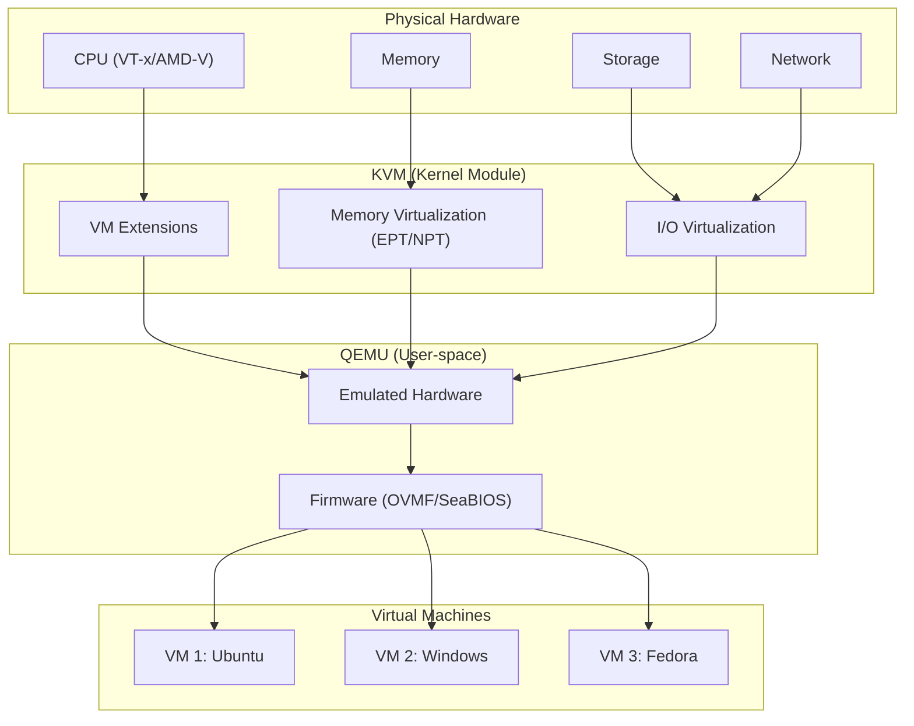

# Chapter 22: Virtual Machines

## 22.1 Introduction

Virtualization allows running multiple isolated operating systems on a single physical machine. Linux provides a mature, high-performance virtualization stack built on KVM (Kernel-based Virtual Machine), QEMU (hardware emulator), and libvirt (management API). Combined with tools like virt-manager (GUI) and virsh (CLI), Linux virtualization rivals commercial hypervisors in performance and exceeds them in flexibility.

This chapter covers the Linux virtualization architecture, KVM/QEMU setup, libvirt management, guest agents, and practical virtual machine administration.

## 22.2 Intuition: How Virtualization Works

A virtual machine is a software emulation of a physical computer. The hypervisor (in Linux's case, KVM) creates isolated environments that each believe they're running on dedicated hardware.



## 22.3 Internal Architecture

### 22.3.1 KVM (Kernel-based Virtual Machine)

KVM is a Linux kernel module that turns the kernel into a type-1 hypervisor:

```bash
# Check KVM support
grep -E 'vmx|svm' /proc/cpuinfo
# vmx = Intel VT-x
# svm = AMD-V

# Load KVM module
sudo modprobe kvm
sudo modprobe kvm_intel  # Intel
sudo modprobe kvm_amd    # AMD

# Verify
lsmod | grep kvm
ls -la /dev/kvm
```

**KVM provides:**
- **CPU virtualization**: Uses hardware VT-x/AMD-V extensions
- **Memory virtualization**: Uses EPT/NPT for address translation
- **Interrupt handling**: Virtual APIC, posted interrupts
- **Device assignment**: VFIO for direct PCI passthrough

### 22.3.2 QEMU

QEMU is a user-space machine emulator. Combined with KVM, it provides near-native performance:

```bash
# QEMU roles:
# 1. Hardware emulation: Emulates CPU, chipset, devices
# 2. KVM acceleration: Uses /dev/kvm for hardware-assisted virtualization
# 3. Device models: Emulates network cards, storage controllers, GPUs
# 4. Management: Monitors, QMP protocol, migration

# QEMU process for a VM:
ps aux | grep qemu
# qemu-system-x86_64 -name vm1 -enable-kvm -m 4096 ...
```

### 22.3.3 libvirt

libvirt is a management API and toolkit that provides a unified interface to virtualization technologies:

```
┌──────────────────────────────────────────────────────────┐
│ Management Tools                                          │
│  virsh (CLI) │ virt-manager (GUI) │ virt-install │ API   │
├──────────────────────────────────────────────────────────┤
│ libvirtd (daemon)                                         │
│  ├─ QEMU driver                                           │
│  ├─ LXC driver                                            │
│  ├─ Storage driver                                        │
│  └─ Network driver                                        │
├──────────────────────────────────────────────────────────┤
│ Hypervisors                                               │
│  KVM/QEMU │ Xen │ VirtualBox │ VMware │ Hyper-V          │
└──────────────────────────────────────────────────────────┘
```

### 22.3.4 Virtualization Types

```
Type          Description                    Examples
──────────────────────────────────────────────────────────
Full          Emulates complete hardware     QEMU without KVM
              Slowest, most compatible       Bochs
Hardware-     Uses CPU extensions for        KVM, VMware ESXi
assisted      near-native performance        Hyper-V, Xen HVM
Paravirt      Guest-aware, uses host         Xen PV, KVM with
              drivers for I/O               virtio drivers
Container     Shares host kernel             LXC, Docker, Podman
              Lightest, least isolated
```

## 22.4 Installation and Setup

### 22.4.1 Installing KVM/QEMU/libvirt

```bash
# Debian/Ubuntu
sudo apt install qemu-kvm libvirt-daemon-system libvirt-clients \
    bridge-utils virtinst virt-manager ovmf

# RHEL/Fedora
sudo dnf install qemu-kvm libvirt virt-install virt-manager \
    edk2-ovmf bridge-utils

# Add user to libvirt group
sudo usermod -aG libvirt $USER
sudo usermod -aG kvm $USER

# Start and enable libvirt
sudo systemctl enable --now libvirtd

# Verify
virsh list --all
sudo virsh capabilities | head -20
```

### 22.4.2 Network Configuration

```bash
# Default NAT network (libvirt creates this automatically)
virsh net-list --all
virsh net-info default

# Default network: 192.168.122.0/24, NAT, DHCP
# VMs get IPs via libvirt's built-in DHCP server

# Bridged network (VMs get IPs on host's network)
# /etc/netplan/01-bridge.yaml (Ubuntu)
network:
  version: 2
  ethernets:
    enp0s3:
      dhcp4: false
  bridges:
    br0:
      interfaces: [enp0s3]
      dhcp4: true
      parameters:
        stp: false
```

### 22.4.3 Storage Pools

```bash
# List storage pools
virsh pool-list --all

# Create directory pool
virsh pool-define-as vm-storage dir - - - - /var/lib/libvirt/images
virsh pool-build vm-storage
virsh pool-start vm-storage
virsh pool-autostart vm-storage

# Create LVM pool
virsh pool-define-as vm-lvm logical - - - - /dev/vg0
virsh pool-build vm-lvm
virsh pool-start vm-lvm

# List volumes in pool
virsh vol-list vm-storage
```

## 22.5 Creating Virtual Machines

### 22.5.1 virt-install (CLI)

```bash
# Basic Ubuntu VM
virt-install \
    --name ubuntu-vm \
    --ram 4096 \
    --vcpus 2 \
    --disk path=/var/lib/libvirt/images/ubuntu-vm.qcow2,size=40 \
    --os-variant ubuntu24.04 \
    --network network=default \
    --graphics vnc,listen=0.0.0.0 \
    --cdrom /var/lib/libvirt/images/ubuntu-24.04-live-server-amd64.iso \
    --boot uefi

# VM from cloud image
virt-install \
    --name cloud-vm \
    --ram 2048 \
    --vcpus 2 \
    --disk /var/lib/libvirt/images/ubuntu-cloud.qcow2,device=disk \
    --os-variant ubuntu24.04 \
    --network network=default \
    --cloud-init user-data=/tmp/user-data.yaml \
    --import

# Headless server (serial console)
virt-install \
    --name headless-vm \
    --ram 2048 \
    --vcpus 2 \
    --disk size=20 \
    --os-variant ubuntu24.04 \
    --network network=default \
    --graphics none \
    --console pty,target_type=serial \
    --location 'http://archive.ubuntu.com/ubuntu/dists/noble/main/installer-amd64/' \
    --extra-args 'console=ttyS0,115200n8 serial'
```

### 22.5.2 virt-manager (GUI)

```bash
# Launch virt-manager
virt-manager

# Features:
# - Create, start, stop, delete VMs
# - Console access (VNC/SPICE)
# - Resource monitoring
# - Snapshot management
# - Hardware configuration
# - Migration support
```

### 22.5.3 virsh (CLI Management)

```bash
# List VMs
virsh list --all

# Start/stop
virsh start ubuntu-vm
virsh shutdown ubuntu-vm      # Graceful
virsh destroy ubuntu-vm       # Force kill

# Console access
virsh console ubuntu-vm       # Serial console
virt-viewer ubuntu-vm         # VNC/SPICE viewer

# Edit VM configuration
virsh edit ubuntu-vm

# Suspend/resume
virsh suspend ubuntu-vm
virsh resume ubuntu-vm

# Clone
virt-clone --original ubuntu-vm --name ubuntu-vm-clone \
    --auto-clone

# Delete
virsh undefine ubuntu-vm --remove-all-storage
```

## 22.6 VM Hardware Configuration

### 22.6.1 CPU Configuration

```bash
# Set CPU count
virsh setvcpus ubuntu-vm 4 --config

# CPU pinning (bind vCPUs to physical CPUs)
virsh vcpupin ubuntu-vm 0 0    # vCPU 0 → pCPU 0
virsh vcpupin ubuntu-vm 1 1    # vCPU 1 → pCPU 1

# CPU model/passthrough
virsh edit ubuntu-vm
# <cpu mode='host-passthrough'/>  # Pass through host CPU features
# <cpu mode='custom'>
#   <model fallback='allow'>Skylake-Client</model>
# </cpu>
```

### 22.6.2 Memory Configuration

```bash
# Set memory (MB)
virsh setmem ubuntu-vm 8192 --config

# Memory balloon (dynamic memory)
# <memballoon model='virtio'/>
virsh setmem ubuntu-vm 4096 --live  # Shrink balloon

# Huge pages for VM
# <memoryBacking>
#   <hugepages/>
# </memoryBacking>
```

### 22.6.3 Disk Configuration

```bash
# Add disk
qemu-img create -f qcow2 /var/lib/libvirt/images/data.qcow2 100G
virsh attach-disk ubuntu-vm /var/lib/libvirt/images/data.qcow2 vdb --persistent

# Disk types:
# virtio: Best performance (requires guest drivers)
# scsi: Good compatibility
# ide: Legacy (slow)

# Cache modes:
# none: Direct I/O, safest for data integrity
# writethrough: Write to host cache and disk
# writeback: Write to host cache only (faster, risk of data loss)

# <disk type='file' device='disk'>
#   <driver name='qemu' type='qcow2' cache='none' io='native'/>
#   <source file='/var/lib/libvirt/images/vm.qcow2'/>
#   <target dev='vda' bus='virtio'/>
# </disk>
```

### 22.6.4 Network Configuration

```bash
# Attach network interface
virsh attach-interface ubuntu-vm network default --persistent

# Network types:
# network: libvirt managed (NAT, bridge, etc.)
# bridge: Direct bridge attachment
# direct: Macvtap (direct physical device access)

# <interface type='network'>
#   <mac address='52:54:00:xx:xx:xx'/>
#   <source network='default'/>
#   <model type='virtio'/>
# </interface>
```

## 22.7 Virtio Drivers

### 22.7.1 What is Virtio?

Virtio is a paravirtualized I/O framework. Instead of emulating real hardware (which is slow), virtio provides a simplified interface that both guest and host understand:

```
Traditional (full emulation):
Guest → Emulated e1000 NIC → QEMU → Host NIC
  (Slow: guest thinks it's talking to real hardware)

Virtio (paravirtualization):
Guest → virtio-net driver → Shared memory → Host NIC
  (Fast: optimized communication path)
```

### 22.7.2 Virtio Devices

```
Device      Type           Description
──────────────────────────────────────────────────
virtio-net  Network        High-performance NIC
virtio-blk  Block          Block device (disk)
virtio-scsi SCSI           SCSI controller
virtio-9p   Filesystem     Host-guest file sharing
virtio-fs   Filesystem     Modern file sharing (FUSE)
virtio-gpu  Graphics       GPU (virgl 3D acceleration)
virtio-rng  Entropy        Random number generator
virtio-serial Serial       Serial port (guest agent)
vsock       Socket         Host-guest communication
```

### 22.7.3 Installing Virtio Drivers

```bash
# Linux: Usually included in kernel
lsmod | grep virtio
# virtio_net, virtio_blk, virtio_pci, virtio_ring...

# Windows: Download from Fedora
# https://fedorapeople.org/groups/virt/virtio-win/direct-downloads/
# Install via Device Manager or virtio-win-guest-tools.exe

# macOS: Not natively supported (use OpenCore/VirtIO patches)
```

## 22.8 Guest Agents

### 22.8.1 QEMU Guest Agent

The QEMU Guest Agent (qemu-ga) runs inside the VM and provides host-guest communication:

```bash
# Install in guest
sudo apt install qemu-guest-agent    # Debian/Ubuntu
sudo dnf install qemu-guest-agent    # RHEL/Fedora

# Start in guest
sudo systemctl enable --now qemu-guest-agent

# Use from host
virsh qemu-agent-command ubuntu-vm '{"execute":"guest-ping"}'
virsh qemu-agent-command ubuntu-vm '{"execute":"guest-info"}'

# Freeze/thaw filesystems (for consistent snapshots)
virsh domfsfreeze ubuntu-vm
virsh domfsthaw ubuntu-vm

# Shutdown (graceful)
virsh shutdown ubuntu-vm --mode agent
```

### 22.8.2 SPICE Agent

SPICE agent provides better display performance and clipboard sharing:

```bash
# Install in guest
sudo apt install spice-vdagent    # Linux
# Install spice-guest-tools.exe for Windows

# Enables:
# - Automatic resolution adjustment
# - Clipboard sharing
# - Drag and drop
# - Better mouse integration
```

### 22.8.3 cloud-init Integration

```bash
# cloud-init in VMs
# Use --cloud-init with virt-install
virt-install --cloud-init user-data=cloud-init.yaml ...

# Or attach cloud-init seed disk
# Creates a NoCloud seed ISO with meta-data and user-data
```

## 22.9 Snapshots

### 22.9.1 External Snapshots

```bash
# Create snapshot
virsh snapshot-create-as ubuntu-vm snap1 "Before upgrade"

# List snapshots
virsh snapshot-list ubuntu-vm

# Revert to snapshot
virsh snapshot-revert ubuntu-vm snap1

# Delete snapshot
virsh snapshot-delete ubuntu-vm snap1
```

### 22.9.2 Live Snapshots

```bash
# Live snapshot (VM running)
virsh snapshot-create-as --domain ubuntu-vm --live \
    --memspec /tmp/memsnap --diskspec vda,snapshot=external

# This creates:
# 1. Memory state snapshot
# 2. Disk snapshot (new qcow2 overlay)
```

## 22.10 PCI Passthrough (VFIO)

### 22.10.1 GPU Passthrough

```bash
# Enable IOMMU in kernel parameters
# Intel: intel_iommu=on
# AMD: amd_iommu=on

# Find GPU IOMMU group
for d in /sys/kernel/iommu_groups/*/devices/*; do
    n=${d#*/iommu_groups/}; n=${n%%/*}
    printf "IOMMU Group %s: " "$n"
    lspci -nns "${d##*/}"
done

# Bind GPU to vfio-pci
echo "vfio-pci" > /sys/bus/pci/devices/0000:01:00.0/driver_override
echo "0000:01:00.0" > /sys/bus/pci/devices/0000:01:00.0/driver/unbind
echo "0000:01:00.0" > /sys/bus/pci/drivers/vfio-pci/bind

# Or via modprobe config
echo 'options vfio-pci ids=10de:1b80,10de:10f0' > /etc/modprobe.d/vfio.conf

# Add to VM config
virsh edit ubuntu-vm
# <hostdev mode='subsystem' type='pci' managed='yes'>
#   <source>
#     <address domain='0x0000' bus='0x01' slot='0x00' function='0x0'/>
#   </source>
# </hostdev>
```

## 22.11 Migration

### 22.11.1 Live Migration

```bash
# Live migration (shared storage)
virsh migrate --live ubuntu-vm qemu+ssh://destination/system

# Migration with storage
virsh migrate --live --copy-storage-all ubuntu-vm \
    qemu+ssh://destination/system

# Tunnel migration (encrypted)
virsh migrate --live --tunnelled ubuntu-vm \
    qemu+ssh://destination/system
```

## 22.12 Common Pitfalls

### 22.12.1 Nested Virtualization

```bash
# Enable nested virtualization
# Intel:
echo 'options kvm_intel nested=1' | sudo tee /etc/modprobe.d/kvm.conf
sudo modprobe -r kvm_intel
sudo modprobe kvm_intel

# AMD:
echo 'options kvm_amd nested=1' | sudo tee /etc/modprobe.d/kvm.conf

# Verify
cat /sys/module/kvm_intel/parameters/nested
# Y
```

### 22.12.2 Performance Issues

```bash
# Use virtio for all devices
# Use host-passthrough CPU model
# Enable huge pages
# Pin vCPUs to physical CPUs
# Use cache='none' for disk I/O
# Use virtio-net for networking
```

### 22.12.3 Permission Denied on /dev/kvm

```bash
# Add user to kvm group
sudo usermod -aG kvm $USER
# Logout and login

# Check permissions
ls -la /dev/kvm
# crw-rw---- 1 root kvm 10, 232 ...
```

## 22.13 Best Practices

1. **Use virtio drivers** for all I/O devices
2. **Use host-passthrough CPU** for maximum performance
3. **Enable the guest agent** for management operations
4. **Use qcow2 format** for flexibility (snapshots, compression)
5. **Separate VM storage** from host OS
6. **Use LVM for VM storage** on production servers (snapshots, resize)
7. **Back up VMs** using snapshots or export
8. **Monitor resource usage** — CPU, memory, disk I/O, network
9. **Use libvirt's network/storage management** — Don't manage manually
10. **Document VM configurations** — Keep templates and cloud-init files version-controlled

## 22.14 Exercises

### Exercise 1: KVM Setup
Install KVM/QEMU/libvirt on a Linux system. Create a VM using virt-install, install Ubuntu, and verify virtio drivers are loaded.

### Exercise 2: virsh Management
Use virsh to manage a VM lifecycle: start, stop, pause, resume, snapshot, and revert. Practice editing VM configuration.

### Exercise 3: cloud-init VM
Create a VM using a cloud image with cloud-init. Configure users, packages, and SSH keys automatically.

### Exercise 4: PCI Passthrough
Configure GPU passthrough using VFIO on a system with an additional GPU. Verify the GPU is available inside the VM.

### Exercise 5: Automated Provisioning
Write a shell script or Ansible playbook that creates VMs from templates, configures them with cloud-init, and manages their lifecycle.

## 22.15 References

- [KVM Documentation](https://www.linux-kvm.org/page/Main_Page)
- [QEMU Documentation](https://www.qemu.org/docs/master/)
- [libvirt Documentation](https://libvirt.org/)
- [virt-install Documentation](https://virt-manager.org/)
- [Arch Linux: KVM](https://wiki.archlinux.org/title/KVM)
- [Virtio Specification](https://docs.oasis-open.org/virtio/virtio/v1.2/virtio-v1.2.html)
- [VFIO Documentation](https://docs.kernel.org/driver-api/vfio.html)
- [Red Hat: Virtualization](https://docs.redhat.com/en/documentation/red_hat_enterprise_linux/9/html/configuring_and_managing_virtualization/)
