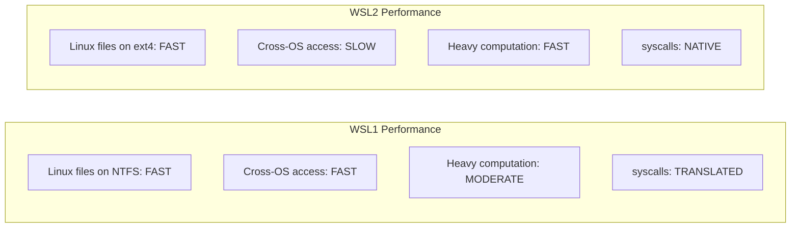
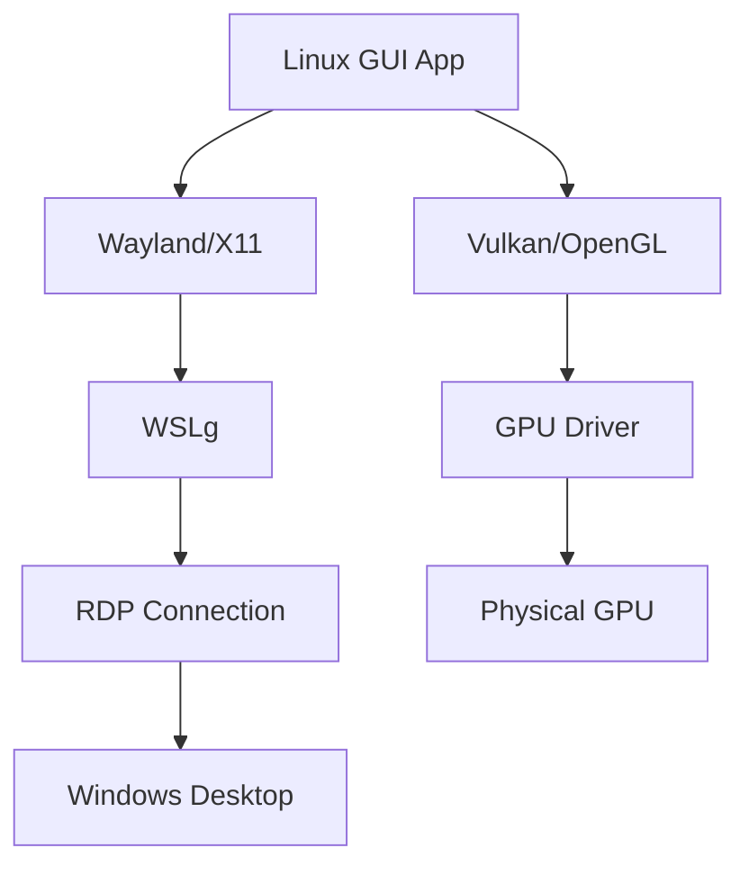

# Chapter 23: WSL (Windows Subsystem for Linux)

## 23.1 Introduction

Windows Subsystem for Linux (WSL) allows running a genuine Linux environment directly on Windows without the overhead of a traditional virtual machine. It bridges the gap between the Windows and Linux ecosystems, enabling developers to use Linux tools, run Linux-native applications, and develop for Linux targets—all while keeping Windows as their primary operating system.

WSL has evolved from a compatibility layer (WSL1) to a lightweight virtual machine (WSL2), with each architecture offering distinct trade-offs. Understanding these differences is crucial for choosing the right configuration for your workflow.

## 23.2 Intuition: Two Approaches to Linux on Windows

**WSL1** translates Linux system calls into Windows system calls. Think of it as a translator sitting between a Linux application and the Windows kernel.

**WSL2** runs a real Linux kernel inside a lightweight virtual machine. Think of it as a tiny, optimized VM that starts in seconds and shares resources with Windows.


## 23.3 Internal Architecture

### 23.3.1 WSL1 Architecture

WSL1 uses a translation layer (lxcore.sys, lxss.sys) that converts Linux system calls to Windows NT system calls:

```
┌──────────────────────────────────────────────────────────┐
│ Linux Binary (ELF)                                        │
├──────────────────────────────────────────────────────────┤
│ WSL1 Translation Layer (lxcore.sys)                       │
│  ├─ System call translation (Linux → NT)                  │
│  ├─ ELF binary loader                                     │
│  ├─ /proc, /sys emulation                                │
│  ├─ /dev/null, /dev/urandom emulation                    │
│  ├─ P9 filesystem protocol (Plan 9)                      │
│  └─ Signal handling translation                           │
├──────────────────────────────────────────────────────────┤
│ Windows NT Kernel                                         │
│  ├─ NTFS (Linux files stored as NTFS with metadata)       │
│  ├─ Windows networking (NAT)                              │
│  └─ Windows process management                            │
└──────────────────────────────────────────────────────────┘
```

**WSL1 Limitations:**
- No Linux kernel modules (no iptables, no FUSE)
- No Docker (uses Linux kernel namespaces)
- Limited system call coverage (~70% of Linux syscalls)
- No GPU compute (no CUDA, no OpenCL)
- Performance differences for I/O-heavy workloads

### 23.3.2 WSL2 Architecture

WSL2 runs a genuine Linux kernel inside a lightweight Hyper-V virtual machine:

```
┌──────────────────────────────────────────────────────────┐
│ Linux Binary (ELF)                                        │
├──────────────────────────────────────────────────────────┤
│ Real Linux Kernel (custom Microsoft build)                │
│  ├─ Full system call support                              │
│  ├─ Kernel modules (including for containers)             │
│  ├─ /proc, /sys, /dev (real)                             │
│  ├─ cgroups, namespaces                                   │
│  └─ ext4 filesystem (in VHD)                             │
├──────────────────────────────────────────────────────────┤
│ Lightweight Utility VM                                    │
│  ├─ Memory: Dynamic (auto-balanced with Windows)          │
│  ├─ VHD: ext4 filesystem (vhdx file)                     │
│  ├─ Networking: virtio-net (NAT or bridged)              │
│  └─ 9P file sharing (Windows ↔ Linux)                    │
├──────────────────────────────────────────────────────────┤
│ Windows Hypervisor Platform (Hyper-V)                     │
│  ├─ Virtualization-based security (VBS)                   │
│  ├─ Dynamic memory management                             │
│  └─ Plan 9 file server                                    │
├──────────────────────────────────────────────────────────┤
│ Windows NT Kernel                                         │
└──────────────────────────────────────────────────────────┘
```

### 23.3.3 Architecture Comparison

```
Feature                WSL1                    WSL2
──────────────────────────────────────────────────────────
Kernel                 Translation layer       Real Linux kernel
System calls           Translated to NT        Native Linux
Filesystem performance Windows (fast)          Linux (fast)
Cross-OS file I/O      Fast (same FS)          Slow (9P protocol)
Docker                 No                      Yes
Linux kernel modules   No                      Yes
GPU compute            No                      Yes (WSLg)
Systemd                No                      Yes (with config)
VM overhead            None                    Minimal (~100MB RAM)
Startup time           ~1 second               ~1-2 seconds
```

### 23.3.4 Performance Characteristics



**Key performance insight:**
- WSL1 is faster when working with Windows files from Linux
- WSL2 is faster for native Linux operations (compilation, Docker, databases)
- Keep files in the Linux filesystem for best WSL2 performance

## 23.4 Installation and Setup

### 23.4.1 Installing WSL

```powershell
# Windows 10 (2004+) and Windows 11
wsl --install

# Install specific distribution
wsl --install -d Ubuntu-24.04

# Install WSL2 explicitly
wsl --install --web-download

# Set WSL2 as default
wsl --set-default-version 2

# Convert existing WSL1 to WSL2
wsl --set-version Ubuntu-24.04 2
```

### 23.4.2 Managing Distributions

```powershell
# List installed distributions
wsl --list --verbose
#   NAME            STATE           VERSION
# * Ubuntu-24.04    Running         2
#   Debian          Stopped         2

# List available distributions
wsl --list --online

# Set default distribution
wsl --set-default Ubuntu-24.04

# Terminate a distribution
wsl --terminate Ubuntu-24.04

# Shutdown all WSL instances
wsl --shutdown

# Unregister (delete) a distribution
wsl --unregister Ubuntu-24.04

# Export/Import distributions
wsl --export Ubuntu-24.04 ubuntu-backup.tar
wsl --import Ubuntu-Custom C:\WSL\Ubuntu-Custom ubuntu-backup.tar
```

### 23.4.3 WSL Configuration

```ini
# %UserProfile%/.wslconfig (global WSL settings)
[wsl2]
memory=8GB                    # Limit memory
processors=4                  # Limit CPUs
swap=4GB                      # Swap size
localhostForwarding=true       # Forward localhost ports
nestedVirtualization=true      # Enable nested VMs (for KVM)
guiApplications=true           # Enable WSLg (GUI apps)

[experimental]
autoMemoryReclaim=gradual      # Auto-reclaim memory
sparseVhd=true                 # Sparse VHD (save disk space)
```

```ini
# /etc/wsl.conf (per-distribution settings)
[boot]
systemd=true                   # Enable systemd

[automount]
enabled=true                   # Auto-mount Windows drives
options="metadata,umask=22,fmask=11"

[network]
generateResolvConf=true        # Auto-generate /etc/resolv.conf
hostname=wsl-ubuntu            # Set hostname

[interop]
enabled=true                   # Run Windows executables
appendWindowsPath=true         # Add Windows PATH to Linux PATH

[user]
default=ubuntu                 # Default user
```

## 23.5 systemd in WSL

### 23.5.1 Enabling systemd

WSL2 supports systemd starting from Windows 11 22H2 (and later Windows 10 builds):

```bash
# Edit /etc/wsl.conf
sudo tee -a /etc/wsl.conf << 'EOF'
[boot]
systemd=true
EOF

# Restart WSL
# From PowerShell:
wsl --shutdown

# Verify systemd is running
systemctl list-unit-files --state=enabled
ps -p 1
# PID 1 should be /sbin/init (systemd)
```

### 23.5.2 systemd Services in WSL

```bash
# With systemd enabled, you can use:
systemctl start nginx
systemctl enable docker
journalctl -u sshd

# Common services that work in WSL:
# - sshd
# - docker
# - podman
# - systemd-resolved
# - systemd-networkd

# Services that may NOT work:
# - systemd-boot (no real boot process)
# - systemd-homed (limited)
# - udev (limited device access)
```

### 23.5.3 Without systemd

```bash
# Use wsl.exe as init (default without systemd)
# Windows processes, Linux processes, and Plan 9 file server start automatically

# Manual service management
sudo service ssh start
sudo /etc/init.d/nginx start
```

## 23.6 GPU Passthrough (WSLg & GPU Compute)

### 23.6.1 WSLg (GUI Applications)

WSLg enables running Linux GUI applications on Windows:

```bash
# WSLg is built-in on Windows 11
# No installation needed

# Test GUI application
sudo apt install x11-apps
xclock
xeyes

# Or install a full application
sudo apt install firefox
firefox
```

**WSLg Architecture:**



### 23.6.2 GPU Compute (CUDA, OpenCL)

```bash
# Install NVIDIA CUDA in WSL2
# 1. Install NVIDIA GPU driver on Windows (NOT in WSL)
# 2. Install CUDA toolkit in WSL

wget https://developer.download.nvidia.com/compute/cuda/repos/wsl-ubuntu/x86_64/cuda-keyring_1.1-1_all.deb
sudo dpkg -i cuda-keyring_1.1-1_all.deb
sudo apt update
sudo apt install cuda-toolkit-12-4

# Verify
nvidia-smi
# Should show GPU info from Windows driver

# Test CUDA
nvcc --version
# Compile and run CUDA sample
```

### 23.6.3 AMD and Intel GPU Support

```bash
# AMD: ROCm support in WSL2
# Install AMD GPU driver on Windows
# Install ROCm in WSL2

# Intel: oneAPI support
# Install Intel GPU driver on Windows
# Install oneAPI toolkit in WSL2
```

## 23.7 Networking in WSL

### 23.7.1 NAT Mode (Default)

```bash
# WSL2 uses NAT by default
# Linux gets an IP in 172.x.x.x range
# Windows forwards ports automatically (localhostForwarding)

# Check WSL IP
ip addr show eth0
# inet 172.25.143.55/20

# Access WSL from Windows
# Use localhost:port (forwarded)
# Or use the WSL IP directly

# Access Windows from WSL
# Use the Windows host IP
cat /etc/resolv.conf
# nameserver 172.25.0.1  (Windows IP from WSL perspective)
```

### 23.7.2 Bridged Networking

```ini
# %UserProfile%/.wslconfig
[wsl2]
networkingMode=bridged
vmSwitch=WSLBridge          # Name of Hyper-V virtual switch
# DHCP or static IP
dhcp=true
```

### 23.7.3 DNS Configuration

```bash
# WSL auto-generates /etc/resolv.conf from Windows DNS

# Prevent auto-generation
# /etc/wsl.conf:
# [network]
# generateResolvConf=false

# Custom DNS
sudo rm /etc/resolv.conf
echo "nameserver 8.8.8.8" | sudo tee /etc/resolv.conf
sudo chattr +i /etc/resolv.conf  # Prevent overwrite
```

## 23.8 Filesystem Interop

### 23.8.1 Accessing Windows Files from Linux

```bash
# Windows drives are mounted at /mnt/
ls /mnt/c/Users/
ls /mnt/d/

# Access Windows files directly
cat /mnt/c/Users/username/file.txt

# Performance tip: Copy files to Linux filesystem for better performance
cp /mnt/c/project.tar.gz ~/
tar xzf ~/project.tar.gz
```

### 23.8.2 Accessing Linux Files from Windows

```powershell
# Access via \\wsl$\ or \\wsl.localhost\
explorer.exe \\wsl$\Ubuntu-24.04\home\user

# Or from within WSL
explorer.exe .
```

### 23.8.3 File Performance

```bash
# WSL2 filesystem performance comparison:
# Linux ext4 filesystem: ~native SSD speed
# /mnt/c (Windows via 9P): ~10-50x slower for metadata-heavy operations

# Best practice: Keep project files in Linux filesystem
# Use /mnt only for occasional file transfers

# Create symlinks for convenience
ln -s /mnt/c/Users/user/Documents ~/WinDocuments
```

## 23.9 Docker in WSL2

### 23.9.1 Docker Desktop Integration

```bash
# Docker Desktop for Windows integrates with WSL2
# Install Docker Desktop, enable WSL2 backend

# Docker runs in a dedicated WSL2 distribution: docker-desktop
# Other distributions access Docker via Docker Desktop's socket

# Verify
docker run hello-world
```

### 23.9.2 Native Docker in WSL2

```bash
# Install Docker Engine directly in WSL2 (without Docker Desktop)
sudo apt update
sudo apt install docker.io
sudo systemctl enable --now docker
sudo usermod -aG docker $USER

# Restart WSL
# From PowerShell: wsl --shutdown
```

## 23.10 Common Pitfalls

### 23.10.1 WSL2 Memory Usage

WSL2 can consume significant memory:

```bash
# Limit memory in %UserProfile%/.wslconfig
# [wsl2]
# memory=4GB

# Reclaim memory
echo 3 | sudo tee /proc/sys/vm/drop_caches

# Or enable auto-reclaim (experimental)
# [experimental]
# autoMemoryReclaim=gradual
```

### 23.10.2 Slow Cross-OS File Access

```bash
# Don't work on files in /mnt/c from WSL2
# Instead, work in Linux filesystem and copy when needed

# Bad: cd /mnt/c/projects && npm install
# Good: cd ~/projects && npm install
```

### 23.10.3 systemd Not Working

```bash
# Check if systemd is enabled
ps -p 1
# If PID 1 is not systemd, edit /etc/wsl.conf

# Common issue: systemd-nspawn or other init is running
# Restart WSL after changing wsl.conf
wsl --shutdown  # From PowerShell
```

### 23.10.4 VPN Conflicts

```bash
# Corporate VPNs may break WSL2 networking
# Workaround: use mirrored networking mode

# %UserProfile%/.wslconfig
# [wsl2]
# networkingMode=mirrored
```

### 23.10.5 Clock Skew

```bash
# After Windows sleep/hibernation, WSL clock may be wrong
# Fix: Install ntpdate
sudo apt install ntpdate
sudo ntpdate time.windows.com

# Or use systemd-timesyncd (with systemd)
sudo timedatectl set-ntp true
```

## 23.11 Best Practices

1. **Use WSL2** unless you specifically need WSL1's cross-OS file performance
2. **Keep project files in Linux filesystem** (`~/` not `/mnt/c/`)
3. **Enable systemd** for full service management
4. **Limit memory** in `.wslconfig` to prevent Windows slowdown
5. **Use WSLg** for occasional GUI apps, not heavy desktop work
6. **Install GPU drivers on Windows**, not in WSL
7. **Use Docker Desktop** with WSL2 backend for container workflows
8. **Back up WSL distributions** with `wsl --export`
9. **Use `wsl.conf`** for per-distribution settings
10. **Keep Windows and WSL updated** — Features improve rapidly

## 23.12 Exercises

### Exercise 1: WSL2 Setup
Install WSL2 with Ubuntu. Configure systemd, verify it's running, and install a web server.

### Exercise 2: Performance Comparison
Benchmark file I/O performance in WSL2 Linux filesystem vs. /mnt/c. Use `fio` or `dd` to measure the difference.

### Exercise 3: GPU Compute
Install CUDA toolkit in WSL2 and run a simple CUDA program. Verify GPU access from Linux.

### Exercise 4: Docker in WSL2
Set up Docker (either via Docker Desktop or native) in WSL2. Run a multi-container application.

### Exercise 5: Custom WSL Distribution
Export a configured WSL distribution, customize it with additional packages, and import it as a new distribution.

## 23.13 References

- [Microsoft WSL Documentation](https://learn.microsoft.com/en-us/windows/wsl/)
- [WSL2 Architecture](https://learn.microsoft.com/en-us/windows/wsl/compare-versions)
- [WSLg Project](https://github.com/microsoft/wslg)
- [systemd in WSL](https://devblogs.microsoft.com/commandline/systemd-support-is-now-available-in-wsl/)
- [NVIDIA CUDA on WSL](https://docs.nvidia.com/cuda/wsl-user-guide/)
- [WSL GitHub Issues](https://github.com/microsoft/WSL/issues)
- [Arch Linux: WSL](https://wiki.archlinux.org/title/Windows_Subsystem_for_Linux)
