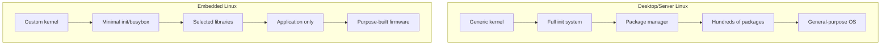
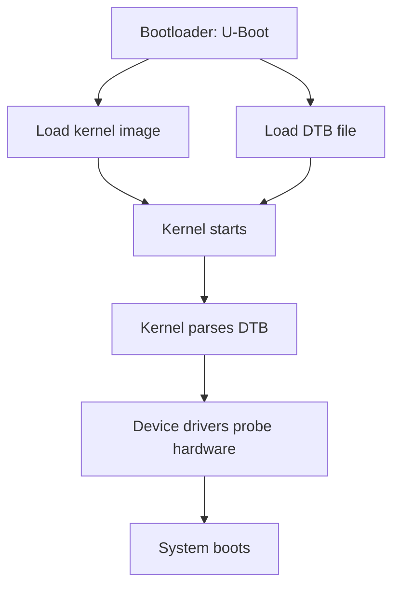

# Chapter 24: Embedded Linux

## 24.1 Introduction

Embedded Linux is the practice of running Linux on resource-constrained, purpose-built hardware—from IoT sensors and network routers to industrial controllers, automotive systems, and consumer electronics. Unlike desktop or server Linux, embedded Linux requires careful customization: every megabyte of storage, every millisecond of boot time, and every component in the system must be deliberately chosen.

The embedded Linux ecosystem provides two dominant build systems—Yocto and Buildroot—that automate the process of cross-compiling a complete Linux system from source code. Understanding these tools, along with cross-compilation toolchains and device trees, is essential for anyone working with embedded systems.

## 24.2 Intuition: Embedded vs. Desktop/Server Linux

Desktop/server Linux is a general-purpose system: you install a distribution, add packages as needed, and run diverse workloads. Embedded Linux is a special-purpose system: you select exactly the components needed for your device, cross-compile them for your target hardware, and produce a minimal, optimized image.



**Key differences:**

```
Aspect              Desktop/Server         Embedded
──────────────────────────────────────────────────────
Storage             10+ GB                 4 MB – 2 GB
RAM                 2+ GB                  16 MB – 1 GB
Boot time           10-60 seconds          1-5 seconds
Kernel              Generic                Custom/stripped
Init system         systemd                busybox/init or systemd
Package manager     apt/dnf/pacman         None (image-based)
Updates             Online packages        OTA image replacement
Build               Distribution packages  Cross-compiled from source
Hardware            x86_64/ARM64           ARM, MIPS, RISC-V, x86
```

## 24.3 Cross-Compilation Toolchains

### 24.3.1 What is Cross-Compilation?

Cross-compilation means compiling code on one architecture (the **host**, typically x86_64) to run on a different architecture (the **target**, typically ARM, MIPS, or RISC-V).

```
┌──────────────────────────────────────────────────────────┐
│ Host Machine (x86_64)                                     │
│  ┌─────────────────────────────────────────────────────┐ │
│  │ Cross-Compiler (arm-linux-gnueabihf-gcc)            │ │
│  │  Source code (.c) → ARM binary (ELF)                │ │
│  └─────────────────────────────────────────────────────┘ │
│  ┌─────────────────────────────────────────────────────┐ │
│  │ Cross-compiled binary → Transfer to target          │ │
│  └─────────────────────────────────────────────────────┘ │
├──────────────────────────────────────────────────────────┤
│ Target Device (ARM Cortex-A, MIPS, RISC-V)              │
│  ┌─────────────────────────────────────────────────────┐ │
│  │ Execute binary natively on target hardware          │ │
│  └─────────────────────────────────────────────────────┘ │
└──────────────────────────────────────────────────────────┘
```

### 24.3.2 Toolchain Components

A cross-compilation toolchain consists of:

```
Component              Description
──────────────────────────────────────────────────────
binutils               Assembler (as), linker (ld), objdump
gcc / clang            C/C++ compiler
glibc / musl / uclibc  C library (target's libc)
linux-kernel-headers   Kernel header files for the target
gdb                    Debugger (cross-aware)
```

### 24.3.3 Pre-built Toolchains

```bash
# Debian/Ubuntu: Install pre-built cross-compilers
sudo apt install gcc-arm-linux-gnueabihf      # ARM 32-bit hard-float
sudo apt install gcc-aarch64-linux-gnu         # ARM 64-bit (AArch64)
sudo apt install gcc-mips-linux-gnu            # MIPS
sudo apt install gcc-riscv64-linux-gnu         # RISC-V 64-bit

# Verify
arm-linux-gnueabihf-gcc --version
aarch64-linux-gnu-gcc --version

# Cross-compile a simple program
cat > hello.c << 'EOF'
#include <stdio.h>
int main() { printf("Hello, ARM!\n"); return 0; }
EOF

arm-linux-gnueabihf-gcc -o hello-arm hello.c
file hello-arm
# hello-arm: ELF 32-bit LSB executable, ARM, EABI5 version 1, dynamically linked...
```

### 24.3.4 Building a Custom Toolchain with crosstool-NG

```bash
# Install crosstool-NG
git clone https://github.com/crosstool-ng/crosstool-ng.git
cd crosstool-ng
./bootstrap && ./configure --prefix=$HOME/ct-ng && make && make install

# Configure toolchain
mkdir ~/arm-toolchain && cd ~/arm-toolchain
ct-ng arm-cortex_a8-linux-gnueabihf  # Select sample configuration

# Customize
ct-ng menuconfig
# Options: GCC version, glibc version, kernel headers, etc.

# Build (takes 30-60 minutes)
ct-ng build

# Toolchain installed to ~/x-tools/arm-cortex_a8-linux-gnueabihf/
export PATH=~/x-tools/arm-cortex_a8-linux-gnueabihf/bin:$PATH
arm-cortex_a8-linux-gnueabihf-gcc --version
```

### 24.3.5 musl vs. glibc vs. uclibc

```
Library    Size      Compatibility    Use Case
──────────────────────────────────────────────────────
glibc      ~2 MB     Full POSIX       General purpose, desktop/server
musl       ~600 KB   Mostly POSIX     Static linking, containers, embedded
uClibc     ~300 KB   Partial POSIX    Very constrained embedded systems
uClibc-ng  ~400 KB   Partial POSIX    Maintained fork of uClibc
dietlibc   ~100 KB   Minimal          Extreme size constraints
```

```bash
# Cross-compile with musl (static linking)
arm-linux-gnueabihf-gcc -static -o hello-arm-static hello.c
# Result: ~600 KB static binary, no runtime dependencies

# Cross-compile with glibc (dynamic linking)
arm-linux-gnueabihf-gcc -o hello-arm-dynamic hello.c
# Result: ~10 KB binary + shared libraries needed on target
```

## 24.4 Device Trees

### 24.4.1 What is a Device Tree?

A device tree is a data structure that describes the hardware layout of a system. Instead of hardcoding hardware information in the kernel (as was done in early ARM Linux), the bootloader passes a device tree blob (DTB) to the kernel, which uses it to discover and configure hardware.



### 24.4.2 Device Tree Structure

```dts
// Device tree source (.dts) for a hypothetical ARM board

/dts-v1/;
/ {
    model = "My Custom Board";
    compatible = "vendor,myboard";
    
    chosen {
        bootargs = "console=ttyS0,115200 root=/dev/mmcblk0p2";
    };
    
    memory@80000000 {
        device_type = "memory";
        reg = <0x80000000 0x20000000>;  // 512 MB at 0x80000000
    };
    
    cpus {
        #address-cells = <1>;
        #size-cells = <0>;
        
        cpu@0 {
            device_type = "cpu";
            compatible = "arm,cortex-a9";
            reg = <0>;
            clocks = <&clk_cpu>;
        };
    };
    
    soc {
        #address-cells = <1>;
        #size-cells = <1>;
        compatible = "simple-bus";
        ranges;
        
        uart0: serial@101f1000 {
            compatible = "arm,pl011";
            reg = <0x101f1000 0x1000>;
            interrupts = <1 4>;
            clocks = <&clk_uart0>;
            status = "okay";
        };
        
        timer@101e2000 {
            compatible = "arm,sp804";
            reg = <0x101e2000 0x1000>;
            interrupts = <2 2>;
        };
        
        gpio@101e4000 {
            compatible = "arm,pl061";
            reg = <0x101e4000 0x1000>;
            interrupts = <3 0>;
            gpio-controller;
            #gpio-cells = <2>;
        };
        
        ethernet@10020000 {
            compatible = "vendor,myboard-eth";
            reg = <0x10020000 0x2000>;
            interrupts = <4 0>;
            phy-mode = "rgmii";
            phy-handle = <&phy0>;
        };
    };
};
```

### 24.4.3 Device Tree Overlays

Overlays modify the base device tree without editing the original source:

```dts
// Overlay to enable an I2C device
/dts-v1/;
/plugin/;

&i2c1 {
    status = "okay";
    
    sensor@48 {
        compatible = "vendor,temperature-sensor";
        reg = <0x48>;
    };
};
```

```bash
# Compile overlay
dtc -@ -I dts -O dtb -o sensor.dtbo sensor-overlay.dts

# Apply overlay at boot (in U-Boot)
fdt apply sensor.dtbo

# Or in config.txt (Raspberry Pi)
dtoverlay=sensor
```

### 24.4.4 Device Tree Tools

```bash
# Compile device tree
dtc -I dts -O dtb -o board.dtb board.dts

# Decompile device tree
dtc -I dtb -O dts -o board.dts board.dtb

# Validate device tree
dtc -I dts -O dtb -o /dev/null board.dts 2>&1 | grep -i error

# View device tree from running system
ls /sys/firmware/devicetree/base/
cat /sys/firmware/devicetree/base/model
cat /sys/firmware/devicetree/base/compatible

# Debug: kernel device tree debug
ls /sys/firmware/fdt  # Raw DTB
dtc -I dtb -O dts /sys/firmware/fdt > running.dts
```

## 24.5 Buildroot

### 24.5.1 Overview

Buildroot is a simple, fast embedded Linux build system. It generates a complete root filesystem image, kernel image, bootloader, and toolchain from source.

```mermaid
graph TD
    A[Buildroot Configuration] --> B[.config file]
    B --> C[Build Process]
    C --> D[Cross-compiler toolchain]
    C --> E[Kernel image]
    C --> F[Bootloader (U-Boot)]
    C --> G[Root filesystem]
    G --> H[ext4 image]
    G --> I[initramfs]
    G --> J[SquashFS]
    G --> K[SD card image]
```

### 24.5.2 Getting Started

```bash
# Download Buildroot
git clone https://gitlab.com/buildroot/buildroot.git
cd buildroot

# Select a default configuration (e.g., for BeagleBone Black)
make beaglebone_defconfig

# Customize
make menuconfig
# Options:
# - Target architecture (ARM, MIPS, x86, RISC-V)
# - Toolchain (buildroot, external, custom)
# - Kernel version and configuration
# - Packages to include
# - Filesystem format (ext4, SquashFS, initramfs)
# - Bootloader (U-Boot, Barebox, GRUB)

# Build (takes 30-120 minutes for first build)
make

# Output in output/images/
ls output/images/
# Image.gz  rootfs.ext4  rootfs.tar  u-boot.img  uEnv.txt  sdcard.img
```

### 24.5.3 Buildroot Configuration

```bash
# Key menuconfig sections:
# Target options: Architecture, ABI, FPU
# Build options: Download dir, parallel jobs
# Toolchain: Compiler, C library, kernel headers
# Kernel: Version, config, patches
# Target packages: Libraries, applications, system tools
# Filesystem images: Format, compression, size
# Bootloaders: U-Boot, Barebox

# Build a single package
make busybox

# Rebuild after config change
make clean && make

# Add custom packages
# package/myapp/myapp.mk
# package/myapp/Config.in
```

### 24.5.4 Buildroot Package Example

```makefile
# package/myapp/myapp.mk

MYAPP_VERSION = 1.0.0
MYAPP_SITE = https://github.com/user/myapp/releases/download/v$(MYAPP_VERSION)
MYAPP_LICENSE = MIT
MYAPP_DEPENDENCIES = libcurl openssl

define MYAPP_BUILD_CMDS
    $(MAKE) CC="$(TARGET_CC)" CFLAGS="$(TARGET_CFLAGS)" \
        LDFLAGS="$(TARGET_LDFLAGS)" -C $(@D)
endef

define MYAPP_INSTALL_TARGET_CMDS
    $(INSTALL) -D -m 0755 $(@D)/myapp $(TARGET_DIR)/usr/bin/myapp
endef

define MYAPP_INSTALL_INIT_SYSV
    $(INSTALL) -D -m 0755 $(BR2_EXTERNAL_MYAPP_PATH)/package/myapp/S99myapp \
        $(TARGET_DIR)/etc/init.d/S99myapp
endef

$(eval $(generic-package))
```

## 24.6 Yocto Project

### 24.6.1 Overview

Yocto is a more complex, flexible embedded Linux build framework. It uses a layer-based architecture with BitBake as its task scheduler.

```mermaid
graph TD
    subgraph Yocto["Yocto Project Architecture"]
        A[Poky Reference Distribution]
        B[BitBake Build Engine]
        C[Metadata (Recipes)]
        D[Layers]
    end
    
    subgraph Layers["Layer Stack"]
        L1[poky (base layer)]
        L2[meta-openembedded (extra packages)]
        L3[meta-raspberrypi (BSP)]
        L4[meta-myproduct (custom)]
    end
    
    subgraph Output["Build Output"]
        O1[Kernel image]
        O2[Root filesystem]
        O3[SDK]
        O4[Package feeds]
    end
    
    A --> B
    B --> C
    C --> D
    D --> L1
    L1 --> L2
    L2 --> L3
    L3 --> L4
    B --> O1
    B --> O2
    B --> O3
    B --> O4
```

### 24.6.2 Getting Started

```bash
# Install dependencies (Ubuntu)
sudo apt install gawk wget git diffstat unzip texinfo gcc build-essential \
    chrpath socat cpio python3 python3-pip python3-pexpect \
    debianutils iputils-ping python3-git python3-jinja2 \
    libegl1-mesa libsdl1.2-dev pylint3 xterm

# Clone Poky
git clone -b scarthgap https://git.yoctoproject.org/poky.git
cd poky

# Initialize build environment
source oe-init-build-env build

# Configure
conf/local.conf
# MACHINE ?= "qemux86-64"          # Target machine
# DISTRO ?= "poky"                  # Distribution
# PACKAGE_CLASSES = "package_rpm"   # Package format
# BB_NUMBER_THREADS = "8"           # Parallel builds
# PARALLEL_MAKE = "-j 8"            # Parallel make

# Build minimal image
bitbake core-image-minimal

# Build SDK
bitbake core-image-minimal -c populate_sdk

# Output in tmp/deploy/images/
ls tmp/deploy/images/qemux86-64/
# bzImage  core-image-minimal-qemux86-64.ext4  ...
```

### 24.6.3 Yocto Recipes

```python
# meta-myproduct/recipes-app/myapp/myapp_1.0.bb

SUMMARY = "My custom application"
DESCRIPTION = "A custom application for the product"
LICENSE = "MIT"
LIC_FILES_CHKSUM = "file://LICENSE;md5=abc123"

SRC_URI = "git://github.com/user/myapp.git;protocol=https;branch=main"
SRCREV = "a1b2c3d4e5f6"

S = "${WORKDIR}/git"

DEPENDS = "libcurl openssl"

inherit cmake

EXTRA_OECMAKE = "-DCMAKE_INSTALL_PREFIX=/usr"

FILES:${PN} += "${bindir}/myapp ${sysconfdir}/myapp.conf"

# Custom install
do_install:append() {
    install -d ${D}${sysconfdir}
    install -m 0644 ${S}/config/myapp.conf ${D}${sysconfdir}/
}
```

### 24.6.4 Yocto vs. Buildroot

```
Feature              Buildroot            Yocto
──────────────────────────────────────────────────────
Complexity           Simple               Complex
Build time           Fast                 Slow
Package format       tar/rpm/deb/opkg     rpm/deb/ipk
SDK                  Basic                Full-featured
Layers               No                   Yes
Community packages   ~3000                ~thousands
License compliance   Basic                Comprehensive
Learn curve          Hours                Days-weeks
Best for             Simple products      Complex products
Production use       Yes                  Yes
```

## 24.7 Embedded Kernel Configuration

### 24.7.1 Minimal Kernel Config

```bash
# Use defconfig as starting point
make ARCH=arm CROSS_COMPILE=arm-linux-gnueabihf- multi_v7_defconfig

# Customize
make ARCH=arm CROSS_COMPILE=arm-linux-gnueabihf- menuconfig

# Key options to disable for minimal size:
# CONFIG_DEBUG_INFO=n            # No debug symbols
# CONFIG_SOUND=n                 # No audio
# CONFIG_USB_GADGET=n            # No USB gadget
# CONFIG_WIRELESS=n              # No WiFi (if not needed)
# CONFIG_BLUETOOTH=n             # No Bluetooth
# CONFIG_GRAPHICS=n              # No graphics (headless)

# Key options to enable:
# CONFIG_DEVTMPFS_MOUNT=y        # Auto-mount /dev
# CONFIG_CGROUPS=y               # For systemd or containers
# CONFIG_NET=y                   # Networking
# CONFIG_EXT4_FS=y               # Root filesystem

# Build kernel
make ARCH=arm CROSS_COMPILE=arm-linux-gnueabihf- -j$(nproc) zImage dtbs modules

# Install modules to rootfs
make ARCH=arm CROSS_COMPILE=arm-linux-gnueabihf- \
    INSTALL_MOD_PATH=/path/to/rootfs modules_install
```

### 24.7.2 Kernel Size Optimization

```bash
# Measure kernel size
ls -lh arch/arm/boot/zImage

# Size reduction techniques:
# 1. Disable unnecessary drivers
# 2. Use compressed kernel (zImage for ARM)
# 3. Build drivers as modules (only load what's needed)
# 4. Disable debug options
# 5. Use U-Boot FIT image with compression

# Kernel compression options:
# gzip: Standard, good compression
# xz: Better compression, slower decompression
# lzo: Fast decompression, larger size
# lz4: Fastest decompression, larger size
# zstd: Good balance (newer kernels)
```

## 24.8 Embedded System Init

### 24.8.1 BusyBox init

```bash
# BusyBox provides a minimal init, shell, and ~300 utilities
# Total size: ~1-2 MB

# /etc/inittab (BusyBox init)
::sysinit:/etc/init.d/rcS
::respawn:-/bin/sh
::ctrlaltdel:/sbin/reboot
::shutdown:/bin/umount -a -r

# /etc/init.d/rcS
#!/bin/sh
mount -t proc proc /proc
mount -t sysfs sysfs /sys
mount -t devtmpfs devtmpfs /dev
echo "System starting..."
```

### 24.8.2 systemd in Embedded

```bash
# For more complex embedded systems
# Enables: service management, logging, network management
# Overhead: ~10-20 MB RAM, longer boot time

# Select in Buildroot: BR2_INIT_SYSTEMD=y
# Select in Yocto: DISTRO_FEATURES:append = " systemd"
```

## 24.9 OTA Updates

### 24.9.1 Update Strategies

```
Strategy          Description                    Complexity
──────────────────────────────────────────────────────────
Full image        Replace entire rootfs          Low
Dual A/B          Two rootfs partitions,         Medium
                  switch between them
File-based        Update individual files        High
Package-based     Update packages (apt, opkg)    Medium
```

### 24.9.2 SWUpdate / RAUC / Mender

```bash
# SWUpdate: Image-based OTA update framework
# Supports: A/B partition scheme, raw images, archive updates
# Buildroot: BR2_PACKAGE_SWUPDATE=y

# RAUC: Robust Auto-Update Controller
# Supports: A/B partition scheme, verity verification
# Yocto: meta-rauc layer

# Mender: Open-source OTA platform
# Supports: A/B partition scheme, remote management
# Yocto: meta-mender layer
```

## 24.10 Common Pitfalls

### 24.10.1 Cross-Compilation Errors

```bash
# Wrong toolchain for target
# ARM hard-float vs soft-float:
arm-linux-gnueabihf-gcc  # Hard-float (uses FPU)
arm-linux-gnueabi-gcc    # Soft-float (emulates FPU)

# Mismatched C library
# Linking against host glibc instead of target:
# Use --sysroot to point to target's rootfs
arm-linux-gnueabihf-gcc --sysroot=/path/to/rootfs -o app app.c
```

### 24.10.2 Device Tree Mismatches

```bash
# Using wrong DTB for hardware
# Boot with wrong DTB → kernel can't find hardware
# Solution: Verify DTB matches actual hardware

# DTB not loaded by bootloader
# U-Boot: set fdtfile variable
setenv fdtfile myboard.dtb
saveenv
```

### 24.10.3 Build System Disk Space

```bash
# Yocto builds consume 50-100+ GB
# Buildroot builds consume 10-20+ GB

# Monitor disk space
du -sh tmp/  # Yocto
du -sh output/  # Buildroot

# Clean up
bitbake -c cleansstate <recipe>  # Yocto
make clean  # Buildroot
```

### 24.10.4 Boot Failure Debugging

```bash
# Enable early console
# In bootloader:
setenv bootargs "console=ttyS0,115200 earlyprintk debug"
saveenv

# Check kernel messages
# Connect serial console, observe boot log

# Common issues:
# - Wrong root= parameter
# - Missing kernel modules for storage controller
# - Incorrect DTB
# - Filesystem not created correctly
```

## 24.11 Best Practices

1. **Start with a known-working defconfig** — Don't configure from scratch
2. **Use version control** for all configurations, recipes, and patches
3. **Minimize kernel and rootfs size** — Every MB costs money at scale
4. **Use read-only rootfs** — Prevents corruption from power loss
5. **Implement A/B update scheme** — Safe, atomic updates with rollback
6. **Test on real hardware early** — Emulators don't catch all issues
7. **Secure the boot chain** — Signed bootloader, kernel, and rootfs
8. **Document hardware dependencies** — DTB versions, firmware files
9. **Use external toolchains** for reproducibility — Don't rebuild toolchain each time
10. **Monitor community security advisories** — Embedded systems often run for years

## 24.12 Exercises

### Exercise 1: Cross-Compilation
Set up an ARM cross-compilation toolchain. Compile a "Hello World" program and run it on a QEMU ARM emulation.

### Exercise 2: Buildroot Image
Build a minimal Linux system for QEMU ARM using Buildroot. Customize the configuration to include a web server.

### Exercise 3: Device Tree
Write a device tree source for a simple ARM board with UART, GPIO, and Ethernet. Compile it and verify it loads correctly.

### Exercise 4: Yocto Build
Set up a Yocto build environment and build a minimal image for QEMU. Add a custom recipe for a simple application.

### Exercise 5: Boot Time Optimization
Measure and optimize the boot time of an embedded Linux system. Target under 5 seconds to a working application.

## 24.13 References

- [Yocto Project Documentation](https://docs.yoctoproject.org/)
- [Buildroot Manual](https://buildroot.org/downloads/manual/manual.html)
- [Linux Kernel Documentation: Device Trees](https://www.kernel.org/doc/html/latest/devicetree/)
- [Device Tree Specification](https://devicetree.org/specifications/)
- [Embedded Linux Wiki](https://elinux.org/)
- [Bootlin Training Materials](https://bootlin.com/docs/)
- [crosstool-NG](https://github.com/crosstool-ng/crosstool-ng)
- [musl libc](https://musl.libc.org/)
- [SWUpdate](https://sbabic.github.io/swupdate/)
- [RAUC Update Framework](https://rauc.io/)
- [Mender OTA](https://mender.io/)
- [Mastering Embedded Linux Programming (Book)](https://www.packtpub.com/product/mastering-embedded-linux-programming-third-edition/9781789530261)
