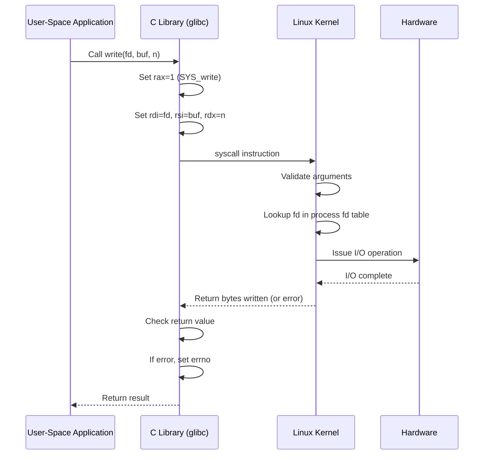
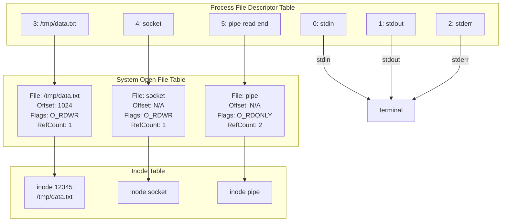
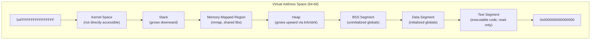

# Chapter 262: System Programming Fundamentals

## 1. Introduction

System programming is the art of writing software that interacts directly with the operating system kernel through well-defined system call interfaces. Unlike application-level programming that relies on high-level abstractions, system programming demands a deep understanding of how the kernel manages resources — files, processes, memory, and I/O devices. This chapter establishes the foundational knowledge required for all subsequent chapters in this handbook.

Every Linux program, from the simplest "Hello, World!" to the most complex distributed system, ultimately relies on system calls to accomplish anything meaningful. When you write to a file, create a process, or allocate memory, your code crosses the boundary between user space and kernel space through a precisely defined interface. Understanding this interface is what separates a programmer who writes code that happens to work from one who writes code that works reliably, efficiently, and portably.

## 2. Intuition: The User-Kernel Boundary

### 2.1 Why System Calls Exist

Modern operating systems enforce a fundamental separation between user space (where applications run) and kernel space (where the operating system kernel executes). This separation exists for three critical reasons:

1. **Protection**: No application should be able to corrupt another application's memory or the kernel itself.
2. **Abstraction**: Applications should not need to know the details of hardware devices.
3. **Controlled access**: The kernel mediates access to shared resources (files, network, devices).

System calls are the only legitimate mechanism for a user-space program to request kernel services. When your program calls `write()`, it doesn't directly write to disk — it asks the kernel to do so on its behalf.

### 2.2 The System Call Mechanism

On x86-64 Linux, a system call follows this path:

1. The application places the system call number in the `rax` register.
2. Arguments go in `rdi`, `rsi`, `rdx`, `r10`, `r8`, `r9` (in that order).
3. The `syscall` instruction is executed, which triggers a transition to kernel mode.
4. The kernel dispatches to the appropriate handler via the system call table.
5. The result is returned in `rax`.
6. Control returns to user space.



### 2.3 The Cost of System Calls

System calls are expensive compared to function calls. A typical system call takes 100-1000 nanoseconds, compared to a few nanoseconds for a function call. The overhead comes from:

- CPU mode transition (user → kernel → user)
- Pipeline flush
- TLB flush (on some architectures)
- Kernel stack setup
- Argument validation

This is why buffering is essential — glibc's `stdio` library batches many small `fwrite()` calls into fewer `write()` system calls.

## 3. Error Handling: The errno Convention

### 3.1 How errno Works

Almost every system call and many library functions signal failure by returning a special value (typically `-1` for functions returning integers, or `NULL` for pointers) and setting the global variable `errno` to a positive integer indicating the specific error.

```c
#include <stdio.h>
#include <errno.h>
#include <string.h>
#include <fcntl.h>
#include <unistd.h>

int main(void)
{
    int fd = open("/nonexistent/file", O_RDONLY);
    if (fd == -1) {
        printf("open() failed\n");
        printf("errno = %d\n", errno);
        printf("meaning: %s\n", strerror(errno));
        perror("open");  // Prints "open: <error message>"
        return 1;
    }
    close(fd);
    return 0;
}
```

### 3.2 errno Thread Safety

In multithreaded programs, `errno` is not actually a global variable. It's implemented as a thread-local variable:

```c
// Simplified glibc implementation
// In reality, it's a macro that expands to (*__errno_location())
#define errno (*__errno_location())

int *__errno_location(void)
{
    // Returns a pointer to the thread-specific errno
    return &THREAD_SELF->errno;
}
```

This means each thread has its own `errno`, and there's no race condition between threads checking or setting it.

### 3.3 errno Preservation Rules

A critical rule that many programmers violate:

**You must check `errno` immediately after the failed call. Any intervening function call may overwrite it.**

```c
// WRONG: printf() may change errno
if (write(fd, buf, n) == -1) {
    printf("Error occurred\n");  // This might change errno!
    perror("write");             // May report wrong error
}

// CORRECT: Save errno before doing anything else
if (write(fd, buf, n) == -1) {
    int saved_errno = errno;     // Save immediately
    printf("Error occurred\n");
    errno = saved_errno;         // Restore before perror
    perror("write");
}
```

Functions that are guaranteed NOT to modify `errno` on success:
- `read()`, `write()` (on success)
- `malloc()` (on success)
- Functions returning `void`

Functions that MAY modify `errno` even on success:
- `printf()`, `fprintf()` (implementation-dependent)
- `pthread_*` functions
- Any function that makes system calls internally

### 3.4 Common errno Values

| Value | Name | Meaning | Typical Cause |
|-------|------|---------|---------------|
| 1 | `EPERM` | Operation not permitted | Privilege violation |
| 2 | `ENOENT` | No such file or directory | Path doesn't exist |
| 5 | `EIO` | I/O error | Hardware/driver failure |
| 9 | `EBADF` | Bad file descriptor | Using closed/invalid fd |
| 11 | `EAGAIN` | Resource temporarily unavailable | Non-blocking I/O would block |
| 12 | `ENOMEM` | Out of memory | malloc() failure |
| 13 | `EACCES` | Permission denied | Insufficient permissions |
| 16 | `EBUSY` | Device or resource busy | Lock contention |
| 17 | `EEXIST` | File exists | Exclusive create failed |
| 22 | `EINVAL` | Invalid argument | Bad parameter value |
| 32 | `EPIPE` | Broken pipe | Writing to closed pipe |
| 35 | `EDEADLK` | Resource deadlock avoided | Lock ordering violation |

### 3.5 The err.h Family

BSD-derived systems provide convenient error-reporting functions:

```c
#include <err.h>

// err() - Print error message and exit
void process_file(const char *path)
{
    FILE *fp = fopen(path, "r");
    if (fp == NULL)
        err(1, "fopen: %s", path);  // Exits with code 1

    // warn() - Print error message but don't exit
    if (fseek(fp, 0, SEEK_END) == -1)
        warn("fseek: %s", path);

    // errx() / warnx() - Like err/warn but without errno
    if (some_check_fails)
        errx(1, "invalid format in %s", path);

    fclose(fp);
}
```

## 4. File I/O: The Universal I/O Model

### 4.1 Everything is a File

Linux follows the Unix philosophy: everything is a file. This includes:

- Regular files
- Directories
- Symbolic links
- Pipes and FIFOs
- Sockets
- Device files (character and block)
- Process information (`/proc`)

All are accessed through the same set of system calls: `open()`, `read()`, `write()`, `close()`, `lseek()`, and `ioctl()`.

### 4.2 File Descriptors

A file descriptor (fd) is a small non-negative integer that the kernel uses to index the process's file descriptor table. Each process has its own table, and the kernel maintains a system-wide open file table.



The first three file descriptors are traditionally:
- **0**: Standard input (`STDIN_FILENO`)
- **1**: Standard output (`STDOUT_FILENO`)
- **2**: Standard error (`STDERR_FILENO`)

### 4.3 The open() System Call

```c
#include <fcntl.h>
#include <sys/stat.h>

// Basic form
int open(const char *pathname, int flags, ... /* mode_t mode */);

// Extended form (avoids race conditions with O_CREAT)
int openat(int dirfd, const char *pathname, int flags, ... /* mode_t mode */);
```

**Flags** control how the file is opened:

| Flag | Value | Description |
|------|-------|-------------|
| `O_RDONLY` | 0 | Read only |
| `O_WRONLY` | 1 | Write only |
| `O_RDWR` | 2 | Read and write |
| `O_CREAT` | 0x40 | Create if doesn't exist |
| `O_EXCL` | 0x80 | Fail if file exists (with O_CREAT) |
| `O_TRUNC` | 0x200 | Truncate to zero length |
| `O_APPEND` | 0x400 | Append to end |
| `O_NONBLOCK` | 0x800 | Non-blocking mode |
| `O_CLOEXEC` | 0x80000 | Close on exec |
| `O_NOFOLLOW` | 0x20000 | Don't follow symlinks |
| `O_DIRECTORY` | 0x10000 | Must be a directory |
| `O_TMPFILE` | 0x410000 | Create unnamed temporary file |

**Mode** (when `O_CREAT` is used) is modified by `umask`:

```c
// The actual permissions = mode & ~umask
int fd = open("myfile", O_CREAT | O_WRONLY | O_TRUNC, 0644);
// If umask is 022, actual permissions = 0644 & ~022 = 0644
// If umask is 027, actual permissions = 0644 & ~027 = 0640
```

### 4.4 The openat() Family

The `*at()` family of system calls was introduced to address race conditions and to support relative path lookups:

```c
// Race condition with open():
// Thread 1: chdir("/safe");     // Thread 2 changes cwd here
// Thread 2: open("file", ...);  // Opens file in wrong directory!

// Solution with openat():
int dirfd = open("/safe", O_DIRECTORY | O_CLOEXEC);
int fd = openat(dirfd, "file", O_RDONLY);
// "file" is always relative to /safe, regardless of cwd changes
```

### 4.5 read() and write()

```c
#include <unistd.h>

ssize_t read(int fd, void *buf, size_t count);
ssize_t write(int fd, const void *buf, size_t count);
```

Key behaviors:

- **Short reads/writes are possible**: `read()` may return fewer bytes than requested (e.g., at end of file, or when a signal interrupts). `write()` may write fewer bytes than requested (e.g., to a pipe or socket).
- **Return value of 0**: For `read()`, this means EOF. For `write()`, this shouldn't happen (but check anyway).
- **Return value of -1**: Error occurred; check `errno`.

**Correct read loop:**

```c
ssize_t read_all(int fd, void *buf, size_t count)
{
    size_t total = 0;
    char *p = buf;

    while (total < count) {
        ssize_t n = read(fd, p + total, count - total);
        if (n == -1) {
            if (errno == EINTR)
                continue;  // Interrupted by signal, retry
            return -1;     // Real error
        }
        if (n == 0)
            break;  // EOF
        total += n;
    }
    return total;
}

ssize_t write_all(int fd, const void *buf, size_t count)
{
    size_t total = 0;
    const char *p = buf;

    while (total < count) {
        ssize_t n = write(fd, p + total, count - total);
        if (n == -1) {
            if (errno == EINTR)
                continue;
            return -1;
        }
        total += n;
    }
    return total;
}
```

### 4.6 lseek() — File Offset Manipulation

```c
#include <unistd.h>

off_t lseek(int fd, off_t offset, int whence);
```

Whence values:
- `SEEK_SET`: Set offset to `offset` bytes from beginning
- `SEEK_CUR`: Set offset to current position + `offset`
- `SEEK_END`: Set offset to file size + `offset`

```c
// Get current file size
off_t size = lseek(fd, 0, SEEK_END);

// Get current position
off_t pos = lseek(fd, 0, SEEK_CUR);

// Check if fd supports seeking (pipes/sockets don't)
off_t result = lseek(fd, 0, SEEK_CUR);
if (result == (off_t)-1 && errno == ESPIPE) {
    // fd is a pipe, socket, or FIFO — not seekable
}
```

### 4.7 Atomicity and Race Conditions

The kernel guarantees atomicity for certain operations:

```c
// ATOMIC: O_CREAT | O_EXCL — create-or-fail is atomic
int fd = open(path, O_CREAT | O_EXCL | O_WRONLY, 0644);
if (fd == -1 && errno == EEXIST) {
    // File already existed — no race condition possible
}

// ATOMIC: O_APPEND — seek+write is atomic
int fd = open(path, O_WRONLY | O_APPEND);
write(fd, buf, n);  // Always appends, even with concurrent writers

// NON-ATOMIC: Manual check-then-act
if (access(path, F_OK) == -1) {  // Check
    // Another process could create the file HERE
    int fd = open(path, O_CREAT | O_WRONLY, 0644);  // Act
    // Race condition!
}
```

## 5. Process Control

### 5.1 Process Creation with fork()

```c
#include <unistd.h>

pid_t fork(void);
```

`fork()` creates a new process by duplicating the calling process. The new process (child) is an almost exact copy of the parent:

- Separate address space (copy-on-write)
- Same file descriptors (shared file offset)
- Same signal handling disposition
- Different PID, PPID

```c
#include <stdio.h>
#include <stdlib.h>
#include <unistd.h>
#include <sys/wait.h>

int main(void)
{
    pid_t pid = fork();

    if (pid == -1) {
        perror("fork");
        exit(1);
    }

    if (pid == 0) {
        // Child process
        printf("Child: PID=%d, PPID=%d\n", getpid(), getppid());
        _exit(0);  // Use _exit(), not exit(), in child after fork
    } else {
        // Parent process
        printf("Parent: child PID=%d\n", pid);

        int status;
        pid_t w = waitpid(pid, &status, 0);
        if (w == -1) {
            perror("waitpid");
            exit(1);
        }

        if (WIFEXITED(status)) {
            printf("Child exited with status %d\n", WEXITSTATUS(status));
        } else if (WIFSIGNALED(status)) {
            printf("Child killed by signal %d\n", WTERMSIG(status));
        }
    }
    return 0;
}
```

### 5.2 The exec Family

After `fork()`, the child often wants to run a different program:

```c
#include <unistd.h>

// Recommended: execvp (searches PATH, takes argv array)
int execlp(const char *file, const char *arg, ... /* (char *)NULL */);
int execvp(const char *file, char *const argv[]);
int execvpe(const char *file, char *const argv[], char *const envp[]);

// Full path variants
int execv(const char *pathname, char *const argv[]);
int execve(const char *pathname, char *const argv[], char *const envp[]);
int execl(const char *pathname, const char *arg, ... /* (char *)NULL */);

// execve is the only true system call; others are library wrappers
```

Naming convention:
- `l` — arguments passed as a list (variadic)
- `v` — arguments passed as an array (vector)
- `p` — uses PATH to find the executable
- `e` — custom environment

```c
// Typical fork-exec pattern
pid_t pid = fork();
if (pid == 0) {
    // Child
    char *args[] = {"ls", "-la", "/tmp", NULL};
    execvp("ls", args);
    // execvp only returns on error
    perror("execvp");
    _exit(127);
}
```

### 5.3 wait() and waitpid()

```c
#include <sys/wait.h>

pid_t wait(int *status);
pid_t waitpid(pid_t pid, int *status, int options);
int waitid(idtype_t idtype, id_t id, siginfo_t *info, int options);
```

**waitpid() pid values:**
- `> 0`: Wait for specific child
- `-1`: Wait for any child
- `0`: Wait for any child in same process group
- `< -1`: Wait for any child in process group `abs(pid)`

**Options:**
- `WNOHANG`: Return immediately if no child has exited
- `WUNTRACED`: Report stopped children
- `WCONTINUED`: Report continued children

**Status macros:**
```c
WIFEXITED(status)      // True if child exited normally
WEXITSTATUS(status)    // Exit status (only if WIFEXITED)
WIFSIGNALED(status)    // True if killed by signal
WTERMSIG(status)       // Signal number (only if WIFSIGNALED)
WCOREDUMP(status)      // True if core dump was produced
WIFSTOPPED(status)     // True if child is stopped
WSTOPSIG(status)       // Signal that stopped the child
WIFCONTINUED(status)   // True if child was continued
```

### 5.4 Process Termination

Five ways a process can terminate:

1. **Normal exit** via `exit()` or return from `main()`
2. **`_exit()` / `_Exit()`** — immediate termination, no cleanup
3. **Signal** — killed by a signal (SIGKILL, SIGSEGV, etc.)
4. **Last thread exits**
5. **Main thread calls `pthread_exit()`**

The difference between `exit()` and `_exit()`:

```c
// exit() — performs cleanup:
// 1. Calls atexit() handlers (in reverse order)
// 2. Flushes and closes stdio streams
// 3. Calls _exit()

// _exit() — immediate termination:
// 1. Flushes nothing
// 2. Calls no atexit handlers
// 3. Goes directly to kernel
```

**Rule**: After `fork()`, the child should call `_exit()` (not `exit()`) if it's going to exec, to avoid running the parent's `atexit` handlers and flushing the parent's buffered I/O.

### 5.5 The atexit() and on_exit() Mechanisms

```c
#include <stdlib.h>

int atexit(void (*function)(void));
int on_exit(void (*function)(int status, void *arg), void *arg);

// Example
static void cleanup(void)
{
    printf("Cleaning up...\n");
    remove("/tmp/lockfile");
}

int main(void)
{
    atexit(cleanup);
    // ... program logic ...
    return 0;  // cleanup() will be called
}
```

### 5.6 Environment Variables

```c
#include <stdlib.h>

char *getenv(const char *name);
int setenv(const char *name, const char *value, int overwrite);
int putenv(char *string);  // Be careful: takes ownership of string
int unsetenv(const char *name);

// Example
char *home = getenv("HOME");
if (home == NULL) {
    fprintf(stderr, "HOME not set\n");
    return 1;
}

setenv("MY_VAR", "my_value", 1);  // Overwrite if exists
```

### 5.7 Process Credentials

```c
#include <unistd.h>

uid_t getuid(void);    // Real user ID
uid_t geteuid(void);   // Effective user ID
gid_t getgid(void);    // Real group ID
gid_t getegid(void);   // Effective group ID

int setuid(uid_t uid);
int seteuid(uid_t euid);
int setreuid(uid_t ruid, uid_t euid);
int setresuid(uid_t ruid, uid_t euid, uid_t suid);

// Get supplementary groups
int getgroups(int size, gid_t list[]);
```

## 6. Memory Management at the System Level

### 6.1 The Process Address Space



### 6.2 brk() and sbrk()

These are the traditional system calls for adjusting the heap size:

```c
#include <unistd.h>

int brk(void *addr);
void *sbrk(intptr_t increment);
```

`sbrk(0)` returns the current program break (top of heap). `sbrk(n)` extends the heap by `n` bytes. These are rarely used directly — `malloc()` uses them internally (or more commonly, `mmap()` now).

### 6.3 mmap() and munmap()

```c
#include <sys/mman.h>

void *mmap(void *addr, size_t length, int prot, int flags, int fd, off_t offset);
int munmap(void *addr, size_t length);
int mprotect(void *addr, size_t length, int prot);
```

```c
// Allocate anonymous memory (no file backing)
void *p = mmap(NULL, 4096, PROT_READ | PROT_WRITE,
               MAP_PRIVATE | MAP_ANONYMOUS, -1, 0);
if (p == MAP_FAILED) {
    perror("mmap");
    return -1;
}

// Use the memory
*(int *)p = 42;

// Release it
munmap(p, 4096);
```

## 7. Complete Example: A Robust File Copy Program

```c
#include <stdio.h>
#include <stdlib.h>
#include <string.h>
#include <errno.h>
#include <fcntl.h>
#include <unistd.h>
#include <sys/stat.h>
#include <getopt.h>

#define BUF_SIZE 65536

static void usage(const char *prog)
{
    fprintf(stderr, "Usage: %s [-f] <source> <destination>\n", prog);
    fprintf(stderr, "  -f  Force overwrite if destination exists\n");
}

static int copy_file(const char *src, const char *dst, int force)
{
    int src_fd = -1, dst_fd = -1;
    ssize_t nread, nwritten;
    char *buf = NULL;
    struct stat src_stat;
    int ret = -1;

    buf = malloc(BUF_SIZE);
    if (buf == NULL) {
        fprintf(stderr, "malloc: %s\n", strerror(errno));
        goto out;
    }

    src_fd = open(src, O_RDONLY);
    if (src_fd == -1) {
        fprintf(stderr, "open(%s): %s\n", src, strerror(errno));
        goto out;
    }

    if (fstat(src_fd, &src_stat) == -1) {
        fprintf(stderr, "fstat(%s): %s\n", src, strerror(errno));
        goto out;
    }

    int flags = O_WRONLY | O_CREAT | O_TRUNC;
    if (!force)
        flags |= O_EXCL;

    dst_fd = open(dst, flags, src_stat.st_mode & 0777);
    if (dst_fd == -1) {
        fprintf(stderr, "open(%s): %s\n", dst, strerror(errno));
        goto out;
    }

    while ((nread = read(src_fd, buf, BUF_SIZE)) > 0) {
        char *p = buf;
        size_t remaining = nread;

        while (remaining > 0) {
            nwritten = write(dst_fd, p, remaining);
            if (nwritten == -1) {
                if (errno == EINTR)
                    continue;
                fprintf(stderr, "write(%s): %s\n", dst, strerror(errno));
                goto out;
            }
            p += nwritten;
            remaining -= nwritten;
        }
    }

    if (nread == -1) {
        fprintf(stderr, "read(%s): %s\n", src, strerror(errno));
        goto out;
    }

    ret = 0;

out:
    free(buf);
    if (src_fd != -1)
        close(src_fd);
    if (dst_fd != -1)
        close(dst_fd);
    return ret;
}

int main(int argc, char *argv[])
{
    int force = 0;
    int opt;

    while ((opt = getopt(argc, argv, "fh")) != -1) {
        switch (opt) {
        case 'f':
            force = 1;
            break;
        default:
            usage(argv[0]);
            return 1;
        }
    }

    if (argc - optind != 2) {
        usage(argv[0]);
        return 1;
    }

    return copy_file(argv[optind], argv[optind + 1], force) ? 1 : 0;
}
```

## 8. Common Pitfalls

### 8.1 Forgetting to Check Return Values
Every system call can fail. Not checking return values is the most common source of bugs.

### 8.2 Using exit() After fork()
Use `_exit()` in the child if you haven't called `exec()`, to avoid flushing stdio buffers twice.

### 8.3 Ignoring EINTR
Signals can interrupt blocking system calls. Always check for `EINTR` and retry:

```c
ssize_t robust_read(int fd, void *buf, size_t count)
{
    ssize_t n;
    do {
        n = read(fd, buf, count);
    } while (n == -1 && errno == EINTR);
    return n;
}
```

### 8.4 TOCTOU Races
Time-of-check-to-time-of-use races occur when you check a condition and then act on it, with the condition changing in between. Use `O_EXCL`, `openat()`, `fstat()` instead of `stat()` + `open()`.

### 8.5 Buffer Overflow in read()
Always ensure your buffer is large enough, and never trust the return value of `read()` to be exactly what you requested.

## 9. Advanced File I/O Techniques

### 9.1 Scatter-Gather I/O (readv/writev)

Scatter-gather I/O allows you to read into or write from multiple buffers in a single system call, avoiding the overhead of multiple read/write calls:

```c
#include <sys/uio.h>

ssize_t readv(int fd, const struct iovec *iov, int iovcnt);
ssize_t writev(int fd, const struct iovec *iov, int iovcnt);

// Example: Write a header and body in one call
struct iovec iov[2];
iov[0].iov_base = header;
iov[0].iov_len = header_len;
iov[1].iov_base = body;
iov[1].iov_len = body_len;

ssize_t n = writev(fd, iov, 2);
// Writes header + body atomically (no interleaving from other writers)
```

This is particularly useful for network protocols where you need to send a header followed by a payload without copying them into a single buffer first.

### 9.2 pread/pwrite — Positioned I/O

`pread()` and `pwrite()` combine `lseek()` and `read()`/`write()` into a single atomic operation:

```c
ssize_t pread(int fd, void *buf, size_t count, off_t offset);
ssize_t pwrite(int fd, const void *buf, size_t count, off_t offset);

// Advantages over lseek + read:
// 1. Atomic — no race condition between seek and read
// 2. Doesn't change the file offset — safe for concurrent access
// 3. One system call instead of two
```

### 9.3 File I/O Hints with posix_fadvise

You can hint the kernel about your access patterns to improve I/O performance:

```c
#include <fcntl.h>

int posix_fadvise(int fd, off_t offset, off_t len, int advice);

// Advice values:
// POSIX_FADV_NORMAL    — Default behavior
// POSIX_FADV_SEQUENTIAL — Expect sequential access (increase readahead)
// POSIX_FADV_RANDOM    — Expect random access (disable readahead)
// POSIX_FADV_WILLNEED  — Will need this data soon (start reading now)
// POSIX_FADV_DONTNEED  — Won't need this data (drop from page cache)
// POSIX_FADV_NOREUSE   — Will use once (may be dropped after use)

// Example: Sequential scan of a large file
posix_fadvise(fd, 0, 0, POSIX_FADV_SEQUENTIAL);

// Example: Drop data from cache after processing
posix_fadvise(fd, 0, processed_bytes, POSIX_FADV_DONTNEED);
```

### 9.4 Synchronized I/O

POSIX defines several levels of I/O synchronization:

```c
// fdatasync — sync data only (may skip metadata)
fdatasync(fd);  // Faster than fsync for data-only updates

// fsync — sync data and metadata
fsync(fd);      // Ensures everything is on disk

// syncfs — sync all filesystem operations on the device
syncfs(fd);     // Sync entire filesystem

// sync — sync all filesystems (global)
sync();         // Expensive — syncs everything
```

### 9.5 File Locking

POSIX provides advisory file locking through `fcntl()`:

```c
#include <fcntl.h>

// Record locking
struct flock lock = {
    .l_type = F_WRLCK,     // F_RDLCK (read), F_WRLCK (write), F_UNLCK (unlock)
    .l_whence = SEEK_SET,
    .l_start = 0,          // Lock start offset
    .l_len = 0             // 0 = lock entire file
};

// Block until lock is available
fcntl(fd, F_SETLKW, &lock);

// Try to acquire (non-blocking)
if (fcntl(fd, F_SETLK, &lock) == -1) {
    if (errno == EAGAIN || errno == EACCES)
        printf("File is locked by another process\n");
}

// Release lock
lock.l_type = F_UNLCK;
fcntl(fd, F_SETLK, &lock);
```

## 10. Best Practices

1. **Always check return values** — every system call, every time.
2. **Use `_exit()` in children** after `fork()` when not calling `exec()`.
3. **Handle `EINTR`** in all blocking calls.
4. **Use `O_CLOEXEC`** when opening files to prevent fd leaks to child processes.
5. **Use `openat()`** instead of `open()` for relative path operations.
6. **Buffer I/O** — don't make one system call per byte.
7. **Use `posix_fadvise()`** to hint the kernel about access patterns.
8. **Set `umask` explicitly** if you need predictable file permissions.
9. **Use `strerror_r()`** (thread-safe) instead of `strerror()` in multithreaded programs.
10. **Document your error handling strategy** and follow it consistently.
11. **Use `pread`/`pwrite`** for concurrent file access to avoid seek races.
12. **Use `writev()`** to combine header and body writes without copying.
13. **Use `fdatasync()`** instead of `fsync()` when metadata updates aren't needed.

## 10. Exercises

### Exercise 1: Implement a Recursive Directory Copy
Write a program that copies a directory tree recursively using `openat()`, `mkdirat()`, and `fstatat()`.

### Exercise 2: Atomic File Update
Write a function that atomically updates a file by writing to a temporary file and renaming it.

### Exercise 3: Process Tree
Write a program that creates a tree of processes (binary tree of depth N) and prints the tree structure from each process.

### Exercise 4: Signal-Safe Error Handler
Implement an error reporting function that is async-signal-safe and can be called from signal handlers.

## 11. References

- **The Linux Programming Interface** by Michael Kerrisk — The definitive reference for Linux system programming.
- **Advanced Programming in the UNIX Environment** by W. Richard Stevens and Stephen Rago — Classic APUE text.
- **man pages**: `man 2 open`, `man 2 read`, `man 2 fork`, `man 2 execve`, `man 2 wait`, `man 3 errno`
- **The Linux kernel source**: `fs/open.c`, `fs/read_write.c`, `kernel/fork.c`
- **POSIX.1-2017 specification**: https://pubs.opengroup.org/onlinepubs/9699919799/
