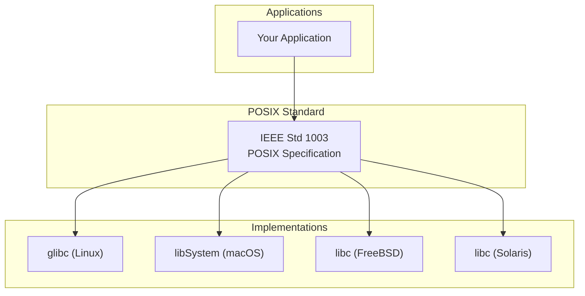
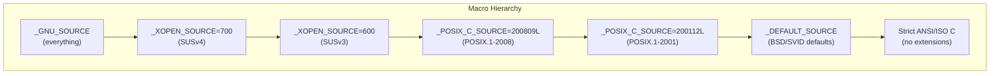
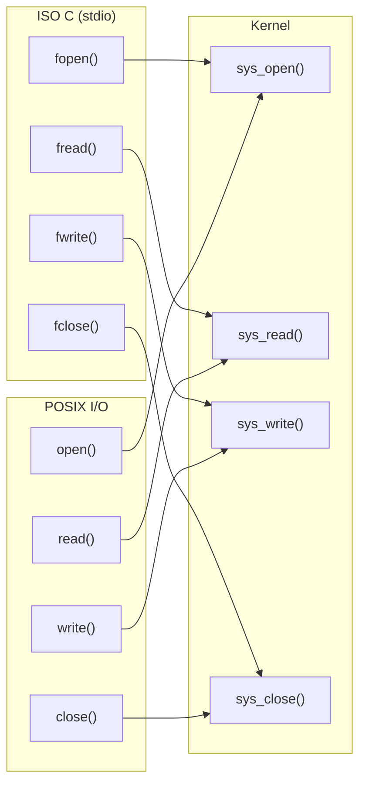

# Chapter 263: POSIX APIs

## 1. Introduction

POSIX (Portable Operating System Interface) is a family of standards specified by the IEEE (Institute of Electrical and Electronics Engineers) that defines the interface between applications and the operating system. The name itself — Portable Operating System Interface — reveals its core purpose: enabling software portability across different UNIX-like systems.

When you write a program that uses POSIX APIs correctly, you gain the ability to compile and run that program on Linux, macOS, FreeBSD, Solaris, and other conforming systems with minimal or no changes. This chapter dives deep into POSIX compliance, the mechanisms that control API availability (feature test macros), and the practical strategies for writing portable code.

## 2. Intuition: Why POSIX Exists

### 2.1 The Problem: UNIX Fragmentation

In the early days of UNIX, each vendor (AT&T, BSD, Sun, HP, IBM, DEC) shipped their own variant with incompatible system calls, library functions, and behaviors. A program written for one UNIX system often wouldn't compile or run on another. This fragmentation was expensive for everyone:

- **Developers** had to maintain separate code bases or complex `#ifdef` labyrinths.
- **System administrators** couldn't easily port tools between systems.
- **Customers** were locked into specific vendors.

### 2.2 The Solution: A Common Standard

POSIX was created to define a minimum set of interfaces that all conforming systems must provide. The key insight was to standardize the **behavior**, not the implementation. Two systems can implement `pthread_mutex_lock()` in completely different ways internally, but as long as the observable behavior matches the specification, they're both POSIX-compliant.



### 2.3 POSIX Standard Layers

The POSIX family of standards is organized into several parts:

| Standard | Name | Description |
|----------|------|-------------|
| POSIX.1 | System Interface | Core C API (syscalls, libc) |
| POSIX.1b | Realtime Extensions | Realtime signals, timers, IPC, threads |
| POSIX.1c | Threads Extension | pthreads |
| POSIX.2 | Shell & Utilities | Shell command language, utilities |
| POSIX.1-2001 | Single UNIX Spec v3 | Combined (SUSv3) |
| POSIX.1-2008 | Single UNIX Spec v4 | Combined (SUSv4) |
| POSIX.1-2017 | Current | Latest revision |

## 3. Feature Test Macros: Controlling API Visibility

### 3.1 What Are Feature Test Macros?

Feature test macros are preprocessor symbols you define before including any header to control which APIs are visible in the headers. They solve a fundamental problem: the same header file on the same system can expose different sets of functions depending on which macros are defined.

When you `#include <unistd.h>`, the header doesn't just blindly declare every function. It checks which feature test macros are defined and selectively enables declarations based on the requested conformance level.

### 3.2 The `_POSIX_C_SOURCE` Macro

This is the primary POSIX conformance macro. Define it to a value corresponding to the POSIX version you want:

```c
// Request POSIX.1-2001 conformance
#define _POSIX_C_SOURCE 200112L

// Request POSIX.1-2008 conformance
#define _POSIX_C_SOURCE 200809L

// Request POSIX.1-2017 conformance
#define _POSIX_C_SOURCE 201711L

#include <unistd.h>
#include <stdio.h>
// Now only POSIX-defined functions are visible
```

**What this does:**
- Hides non-POSIX functions (e.g., BSD extensions, GNU extensions)
- Hides non-POSIX macro definitions
- Ensures function prototypes match POSIX specifications

### 3.3 The `_XOPEN_SOURCE` Macro

This macro controls visibility of interfaces defined in the X/Open Portability Guide (XPG) and the Single UNIX Specification (SUS):

```c
// XPG4v2 / SUSv2
#define _XOPEN_SOURCE 500

// SUSv3 (POSIX.1-2001 + XSI extensions)
#define _XOPEN_SOURCE 600

// SUSv4 (POSIX.1-2008 + XSI extensions)
#define _XOPEN_SOURCE 700

#include <unistd.h>
```

Setting `_XOPEN_SOURCE` also implicitly enables the corresponding `_POSIX_C_SOURCE` level.

### 3.4 The `_GNU_SOURCE` Macro

This is the Linux-specific "give me everything" macro:

```c
#define _GNU_SOURCE

#include <unistd.h>
#include <string.h>
// Now you get:
// - All POSIX functions
// - All GNU extensions
// - All BSD extensions
// - Linux-specific functions
```

**What `_GNU_SOURCE` enables beyond POSIX:**

- `strdupa()`, `strndupa()` — stack-allocating string duplicates
- `memmem()` — search for substring in memory
- `asprintf()` — allocate-and-print
- `get_current_dir_name()` — get cwd with malloc'd string
- `pipe2()`, `accept4()` — with flags parameter
- `qsort_r()` — reentrant quicksort
- `sched_setaffinity()` — CPU affinity
- `epoll_create1()`, `signalfd()`, `timerfd_create()` — Linux-specific I/O

### 3.5 The `_DEFAULT_SOURCE` Macro

Since glibc 2.19, defining `_DEFAULT_SOURCE` (or the older `_BSD_SOURCE` and `_SVID_SOURCE`) enables default definitions including BSD and System V extensions, without enabling the full GNU extensions:

```c
#define _DEFAULT_SOURCE

#include <unistd.h>
// Enables BSD/SVID functions but not GNU-specific ones
```

### 3.6 The Interaction Model



### 3.7 Compiler Flags vs. Feature Test Macros

GCC and Clang provide flags that implicitly define feature test macros:

| Flag | Effect |
|------|--------|
| `-std=c99` | Defines `__STRICT_ANSI__`, hides all extensions |
| `-std=gnu99` | Default; enables GNU extensions (like `_GNU_SOURCE`) |
| `-ansi` | Same as `-std=c89` |
| `-posix` | Defines `_POSIX_C_SOURCE=200809L` |
| `-D_XOPEN_SOURCE=700` | Passed to preprocessor |

**Important**: If you compile with `-std=c99`, you get strict ISO C mode, and POSIX functions may not be visible even if you include the right headers. Use `-std=gnu99` or define the appropriate feature test macros.

### 3.8 Correct Placement of Feature Test Macros

Feature test macros **must** be defined before **any** includes:

```c
// CORRECT: defined before all includes
#define _GNU_SOURCE
#include <stdio.h>
#include <unistd.h>
#include <string.h>

// WRONG: defined after includes (too late, headers already processed)
#include <stdio.h>
#define _GNU_SOURCE  // Has no effect!
#include <unistd.h>
```

**Best practice**: Put the feature test macro definition in your `Makefile` or `CMakeLists.txt`:

```makefile
CFLAGS += -D_GNU_SOURCE
# or
CFLAGS += -D_POSIX_C_SOURCE=200809L
```

This ensures it's always defined before any source file's includes.

## 4. POSIX Conformance Levels

### 4.1 Confstr: Querying Runtime Configuration

```c
#include <unistd.h>

size_t confstr(int name, char *buf, size_t len);
```

```c
#include <stdio.h>
#include <unistd.h>

int main(void)
{
    char buf[256];

    // Get PATH for POSIX-conforming utilities
    confstr(_CS_PATH, buf, sizeof(buf));
    printf("Default PATH: %s\n", buf);

    // Get POSIX version
    printf("POSIX version: %ld\n", sysconf(_SC_VERSION));

    // Get POSIX threads version
    printf("POSIX threads version: %ld\n", sysconf(_SC_THREADS));

    return 0;
}
```

### 4.2 sysconf: Runtime Feature Detection

```c
#include <unistd.h>

long sysconf(int name);
long pathconf(const char *path, int name);
long fpathconf(int fd, int name);
```

These functions let you query system limits and capabilities at runtime, which is essential for portable code:

```c
#include <stdio.h>
#include <unistd.h>
#include <limits.h>

int main(void)
{
    long val;

    // Maximum number of open files per process
    val = sysconf(_SC_OPEN_MAX);
    printf("OPEN_MAX: %ld\n", val);

    // Maximum path length
    val = pathconf("/", _PC_PATH_MAX);
    printf("PATH_MAX: %ld\n", val);

    // Page size
    val = sysconf(_SC_PAGESIZE);
    printf("Page size: %ld\n", val);

    // Number of processors online
    val = sysconf(_SC_NPROCESSORS_ONLN);
    printf("Online CPUs: %ld\n", val);

    // Maximum number of threads per process
    val = sysconf(_SC_THREAD_THREADS_MAX);
    printf("THREAD_THREADS_MAX: %ld\n", val);

    return 0;
}
```

### 4.3 Compile-Time vs. Runtime Feature Detection

```c
#include <stdio.h>
#include <unistd.h>

int main(void)
{
#ifdef _POSIX_REALTIME_SIGNALS
    printf("Compile-time: POSIX realtime signals supported\n");
#else
    printf("Compile-time: POSIX realtime signals NOT supported\n");
#endif

    // Runtime check (more reliable)
    long val = sysconf(_SC_REALTIME_SIGNALS);
    if (val > 0)
        printf("Runtime: POSIX realtime signals supported\n");
    else
        printf("Runtime: POSIX realtime signals NOT supported\n");

    return 0;
}
```

## 5. Portable File I/O

### 5.1 POSIX File Operations

POSIX defines a minimal set of file operations that all conforming systems support:

```c
#include <fcntl.h>
#include <unistd.h>
#include <sys/stat.h>

// Open/create
int open(const char *path, int oflag, ...);
int openat(int dirfd, const char *path, int oflag, ...);
int creat(const char *path, mode_t mode);  // Obsolete: use open(path, O_WRONLY|O_CREAT|O_TRUNC, mode)

// Read/write
ssize_t read(int fd, void *buf, size_t nbyte);
ssize_t write(int fd, const void *buf, size_t nbyte);
ssize_t pread(int fd, void *buf, size_t nbyte, off_t offset);
ssize_t pwrite(int fd, const void *buf, size_t nbyte, off_t offset);

// Position
off_t lseek(int fd, off_t offset, int whence);

// Close
int close(int fd);

// Metadata
int fstat(int fd, struct stat *buf);
int fstatat(int dirfd, const char *path, struct stat *buf, int flags);
int fchmod(int fd, mode_t mode);
int fchown(int fd, uid_t owner, gid_t group);

// Truncate
int ftruncate(int fd, off_t length);

// Sync
int fsync(int fd);
int fdatasync(int fd);  // May skip metadata update (faster)

// File descriptor manipulation
int dup(int fd);
int dup2(int fd, int fd2);
int dup3(int fd, int fd2, int flags);  // Linux extension
int fcntl(int fd, int cmd, ...);
```

### 5.2 POSIX I/O vs. ISO C I/O



| Feature | POSIX I/O | ISO C I/O |
|---------|-----------|-----------|
| Buffering | None (raw) | User-space buffering |
| Granularity | Byte-level | Block-level (fread/fwrite) |
| File positioning | lseek() | fseek()/ftell() |
| Thread safety | Manual | Per-stream locking (flockfile) |
| Performance (small) | Slower (many syscalls) | Faster (buffered) |
| Performance (large) | Comparable | Comparable with setvbuf |
| Metadata access | fstat() | Limited (fileno + fstat) |
| Portability | POSIX systems | Everywhere (ISO C) |

### 5.3 Mixing POSIX and ISO C I/O

You can convert between the two using `fileno()` and `fdopen()`:

```c
#include <stdio.h>
#include <unistd.h>
#include <fcntl.h>

int main(void)
{
    // Get fd from FILE*
    FILE *fp = fopen("test.txt", "w");
    int fd = fileno(fp);

    // Use POSIX operations on the fd
    fcntl(fd, F_SETFD, FD_CLOEXEC);

    // Get FILE* from fd
    int fd2 = open("data.txt", O_RDONLY);
    FILE *fp2 = fdopen(fd2, "r");

    // Now use stdio on fd2
    char line[256];
    while (fgets(line, sizeof(line), fp2))
        printf("%s", line);

    // IMPORTANT: Only close once — either fclose() or close(), not both
    fclose(fp2);   // This also closes fd2
    fclose(fp);    // This also closes fd
    return 0;
}
```

## 6. Portable Process Control

### 6.1 POSIX Process Creation

```c
#include <unistd.h>
#include <sys/wait.h>

pid_t fork(void);
int execve(const char *pathname, char *const argv[], char *const envp[]);
pid_t wait(int *status);
pid_t waitpid(pid_t pid, int *status, int options);

// POSIX.1-2001 additions
int posix_spawn(pid_t *pid, const char *path,
                const posix_spawn_file_actions_t *file_actions,
                const posix_spawnattr_t *attrp,
                char *const argv[], char *const envp[]);
```

`posix_spawn()` is the POSIX-recommended way to create a new process running a specific program, especially useful on systems where `fork()` is expensive (e.g., systems without copy-on-write):

```c
#include <spawn.h>
#include <sys/wait.h>
#include <stdio.h>

extern char **environ;

int main(void)
{
    pid_t pid;
    char *argv[] = {"ls", "-la", NULL};

    int ret = posix_spawn(&pid, "/bin/ls", NULL, NULL, argv, environ);
    if (ret != 0) {
        fprintf(stderr, "posix_spawn: %s\n", strerror(ret));
        return 1;
    }

    int status;
    waitpid(pid, &status, 0);
    return WEXITSTATUS(status);
}
```

### 6.2 The _POSIX_VERSION and _XOPEN_VERSION Macros

```c
#include <stdio.h>
#include <unistd.h>

int main(void)
{
#ifdef _POSIX_VERSION
    printf("System claims POSIX version: %ld\n", (long)_POSIX_VERSION);
#else
    printf("System does not define _POSIX_VERSION\n");
#endif

#ifdef _XOPEN_VERSION
    printf("System claims XOPEN version: %d\n", _XOPEN_VERSION);
#endif

    // Runtime check is more reliable
    printf("Runtime POSIX version: %ld\n", sysconf(_SC_VERSION));

    return 0;
}
```

## 7. Portable Signal Handling

### 7.1 POSIX Signal Functions

```c
#include <signal.h>

// Signal sets
int sigemptyset(sigset_t *set);
int sigfillset(sigset_t *set);
int sigaddset(sigset_t *set, int signum);
int sigdelset(sigset_t *set, int signum);
int sigismember(const sigset_t *set, int signum);

// Signal handling
int sigaction(int signum, const struct sigaction *act, struct sigaction *oldact);

// Signal masking
int sigprocmask(int how, const sigset_t *set, sigset_t *oldset);
int sigpending(sigset_t *set);
int sigsuspend(const sigset_t *mask);

// Waiting for signals
int sigwait(const sigset_t *set, int *sig);
int sigtimedwait(const sigset_t *set, siginfo_t *info, const struct timespec *timeout);
int sigwaitinfo(const sigset_t *set, siginfo_t *info);
```

**Portability warning**: The behavior of `signal()` varies between systems. Always use `sigaction()` for portable code.

```c
// NON-PORTABLE: signal() behavior varies
signal(SIGINT, handler);  // May reset handler after delivery (System V)
                          // May restart interrupted calls (BSD)

// PORTABLE: sigaction() behavior is well-defined
struct sigaction sa;
sa.sa_handler = handler;
sigemptyset(&sa.sa_mask);
sa.sa_flags = 0;  // Or SA_RESTART if you want automatic restart
sigaction(SIGINT, &sa, NULL);
```

## 8. Portable Threading

### 8.1 POSIX Threads (pthreads)

```c
#include <pthread.h>

// Thread management
int pthread_create(pthread_t *thread, const pthread_attr_t *attr,
                   void *(*start_routine)(void *), void *arg);
int pthread_join(pthread_t thread, void **retval);
int pthread_detach(pthread_t thread);
int pthread_cancel(pthread_t thread);
void pthread_exit(void *retval);
pthread_t pthread_self(void);

// Thread attributes
int pthread_attr_init(pthread_attr_t *attr);
int pthread_attr_destroy(pthread_attr_t *attr);
int pthread_attr_setdetachstate(pthread_attr_t *attr, int detachstate);
int pthread_attr_setstacksize(pthread_attr_t *attr, size_t stacksize);
int pthread_attr_setguardsize(pthread_attr_t *attr, size_t guardsize);
```

### 8.2 Compile-Time Threading Feature Test

```c
#define _POSIX_C_SOURCE 200809L
#include <stdio.h>
#include <unistd.h>

int main(void)
{
#ifdef _POSIX_THREADS
    printf("POSIX threads supported\n");
    printf("Thread-safe functions: %ld\n", sysconf(_SC_THREAD_SAFE_FUNCTIONS));
#else
    printf("POSIX threads NOT supported\n");
#endif

#ifdef _POSIX_READER_WRITER_LOCKS
    printf("Reader-writer locks supported\n");
#endif

#ifdef _POSIX_BARRIERS
    printf("Barriers supported\n");
#endif

#ifdef _POSIX_SPIN_LOCKS
    printf("Spin locks supported\n");
#endif

    return 0;
}
```

## 9. Portable IPC

### 9.1 POSIX IPC Overview

POSIX defines three IPC mechanisms that are more portable than their System V counterparts:

| Mechanism | Create/Open | Operations |
|-----------|-------------|------------|
| Message Queues | `mq_open()` | `mq_send()`, `mq_receive()` |
| Semaphores | `sem_open()` | `sem_wait()`, `sem_post()` |
| Shared Memory | `shm_open()` | `mmap()`, `munmap()` |

```c
#include <mqueue.h>
#include <semaphore.h>
#include <sys/mman.h>
#include <fcntl.h>
#include <sys/stat.h>

// POSIX message queue
mqd_t mq = mq_open("/myqueue", O_CREAT | O_WRONLY, 0644, NULL);
mq_send(mq, "hello", 5, 0);
mq_close(mq);

// POSIX semaphore
sem_t *sem = sem_open("/mysem", O_CREAT, 0644, 1);
sem_wait(sem);   // P operation
// ... critical section ...
sem_post(sem);   // V operation
sem_close(sem);

// POSIX shared memory
int shm_fd = shm_open("/myshm", O_CREAT | O_RDWR, 0644);
ftruncate(shm_fd, 4096);
void *addr = mmap(NULL, 4096, PROT_READ | PROT_WRITE, MAP_SHARED, shm_fd, 0);
// ... use shared memory ...
munmap(addr, 4096);
shm_unlink("/myshm");
```

## 10. Portable String and Memory Functions

### 10.1 POSIX String Functions

POSIX standardizes many string functions that programmers rely on daily. Understanding which are guaranteed by POSIX versus which are extensions is crucial:

```c
#include <string.h>
#include <strings.h>

// POSIX guarantees these in <string.h>:
size_t strlen(const char *s);
char *strcpy(char *dst, const char *src);
char *strncpy(char *dst, const char *src, size_t n);
char *strcat(char *dst, const char *src);
char *strncat(char *dst, const char *src, size_t n);
int strcmp(const char *s1, const char *s2);
int strncmp(const char *s1, const char *s2, size_t n);
char *strchr(const char *s, int c);
char *strrchr(const char *s, int c);
char *strstr(const char *haystack, const char *needle);
size_t strspn(const char *s, const char *accept);
size_t strcspn(const char *s, const char *reject);
char *strpbrk(const char *s, const char *accept);
char *strtok(char *str, const char *delim);
void *memcpy(void *dst, const void *src, size_t n);
void *memmove(void *dst, const void *src, size_t n);
void *memset(void *s, int c, size_t n);
int memcmp(const void *s1, const void *s2, size_t n);
void *memchr(const void *s, int c, size_t n);

// POSIX.1-2008 added these:
char *strdup(const char *s);       // Heap-allocated duplicate
char *strndup(const char *s, size_t n);  // Duplicate with length limit

// In <strings.h> (BSD-origin, POSIX-optional):
int strcasecmp(const char *s1, const char *s2);  // Case-insensitive compare
int strncasecmp(const char *s1, const char *s2, size_t n);
```

### 10.2 The strdup() Story

`strdup()` is interesting from a portability perspective. It was not in the original POSIX specification but was so widely used that POSIX.1-2008 finally standardized it. Before that, it was available on virtually every UNIX system but technically non-standard. This illustrates how POSIX evolves to codify existing practice.

```c
// Before POSIX.1-2008, if you needed strict POSIX compliance:
char *my_strdup(const char *s)
{
    size_t len = strlen(s) + 1;
    char *dup = malloc(len);
    if (dup)
        memcpy(dup, s, len);
    return dup;
}

// POSIX.1-2008 and later:
char *dup = strdup(s);
```

### 10.3 The strtok() Problem

`strtok()` is POSIX-specified but has a fundamental design flaw: it uses internal static state, making it non-reentrant. In multithreaded programs, use `strtok_r()` instead:

```c
// Non-reentrant (POSIX, but problematic)
char *token = strtok(str, "delim");
while (token) {
    printf("%s\n", token);
    token = strtok(NULL, "delim");
}

// Reentrant (POSIX.1-2001)
char *saveptr;
char *token = strtok_r(str, "delim", &saveptr);
while (token) {
    printf("%s\n", token);
    token = strtok_r(NULL, "delim", &saveptr);
}
```

## 11. Common Pitfalls

The most common portability mistake is using GNU-specific functions without realizing they won't work on other POSIX systems:

```c
// GNU-specific (won't compile on macOS/FreeBSD)
char *str = strndupa(source, len);  // Stack-allocated, GNU only
char *dup = strdupa(source);        // Stack-allocated, GNU only

// Portable alternatives
char *str = strndup(source, len);   // Heap-allocated, POSIX.1-2008
char *dup = strdup(source);         // Heap-allocated, POSIX.1-2008 (technically not POSIX, but widely available)
```

### 10.2 Assuming Linux-Specific Defaults

```c
// Linux: write() to a closed fd returns EBADF
// POSIX: behavior is undefined
// Some systems may deliver SIGPIPE

// Always handle errors:
if (write(fd, buf, n) == -1) {
    if (errno == EPIPE) {
        // Handle broken pipe (POSIX-portable)
    }
}
```

### 10.3 Using glibc-Only Functions

```c
// glibc-specific (not available on musl, macOS, etc.)
char *program_invocation_name;   // GNU extension
char *program_invocation_short_name;

// Portable alternative
const char *progname = argv[0];
// Or extract basename manually
```

### 10.4 Feature Test Macro Ordering

```c
// WRONG: Feature test macro after includes
#include <stdio.h>
#define _GNU_SOURCE      // Too late!
#include <string.h>

// CORRECT: Feature test macro before all includes
#define _GNU_SOURCE
#include <stdio.h>
#include <string.h>
```

## 11. Best Practices

1. **Define feature test macros in your build system** — `-D_POSIX_C_SOURCE=200809L` in your Makefile ensures it's always first.
2. **Use `sysconf()` for runtime limits** — don't hardcode `OPEN_MAX` or `PATH_MAX`.
3. **Prefer POSIX functions over BSD/GNU extensions** when a POSIX alternative exists.
4. **Use `sigaction()` instead of `signal()`** — the behavior of `signal()` is unspecified in POSIX.
5. **Check for `_POSIX_*` macros** when using optional POSIX features (realtime, threads, barriers).
6. **Test on multiple platforms** if portability matters — compile on Linux, macOS, and FreeBSD.
7. **Use `posix_spawn()` instead of `fork()+exec()`** when creating child processes that immediately exec.
8. **Document your POSIX requirements** — state which POSIX version your code requires.
9. **Use `pthreads` for threading** — it's the only portable POSIX threading API.
10. **Avoid `#ifdef linux`** — use feature-based checks instead of platform-based checks.

## 12. Exercises

### Exercise 1: Portable Path Operations
Write a program that uses `pathconf()` to determine the maximum path length at runtime and dynamically allocates buffers for path operations.

### Exercise 2: Feature Detection Library
Write a header file that detects available POSIX features at compile time and provides fallback implementations for missing functions.

### Exercise 3: Cross-Platform Build
Write a Makefile that automatically detects the platform and sets appropriate feature test macros and compiler flags.

### Exercise 4: POSIX-Compliant getopt
Implement a command-line argument parser using only POSIX-specified `getopt()` that works on Linux, macOS, and FreeBSD.

## 13. References

- **IEEE Std 1003.1-2017 (POSIX.1-2017)**: https://pubs.opengroup.org/onlinepubs/9699919799/
- **The Linux Programming Interface** by Michael Kerrisk — Chapter 2: "Fundamental Concepts"
- **Advanced Programming in the UNIX Environment** by W. Richard Stevens — Chapter 2: "UNIX Standardization and Implementations"
- **glibc manual**: https://www.gnu.org/software/libc/manual/
- **man pages**: `man 7 feature_test_macros`, `man 7 posixoptions`, `man 3 sysconf`
- **Open Group Base Specifications**: https://pubs.opengroup.org/onlinepubs/9699919799/
