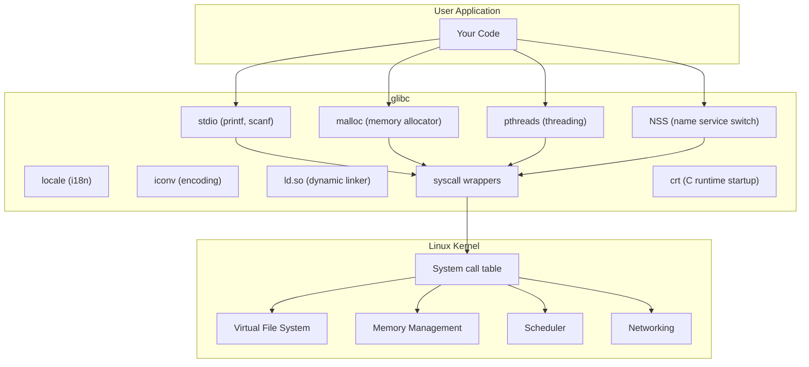
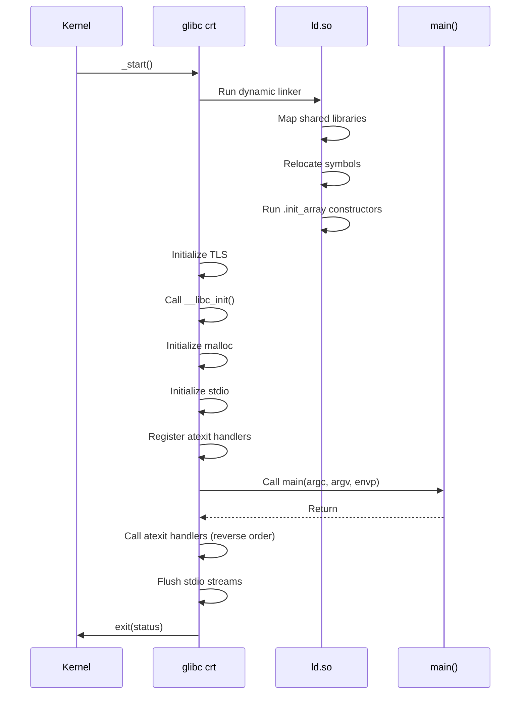
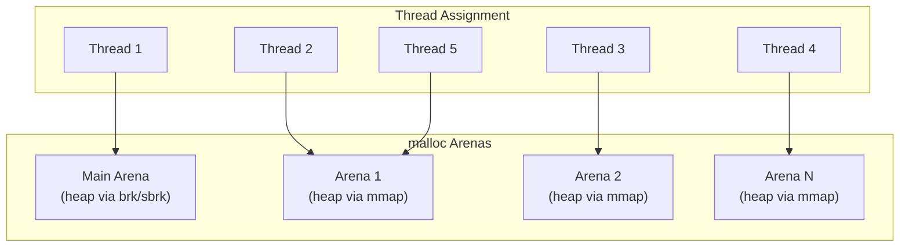
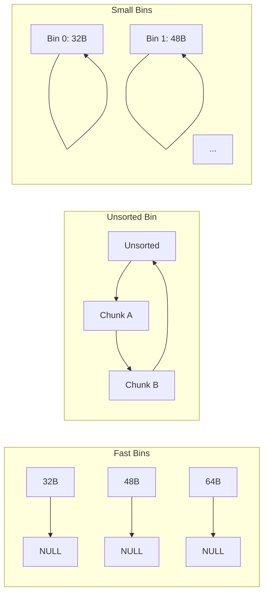
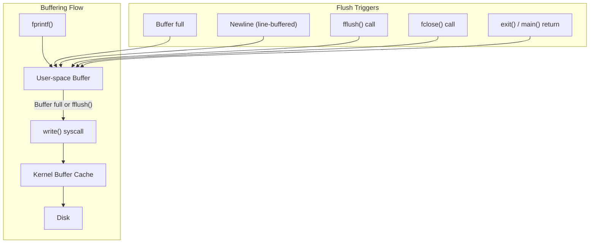

# Chapter 264: glibc — The GNU C Library

## 1. Introduction

The GNU C Library (glibc) is the C standard library implementation used by most Linux systems. It is far more than a simple wrapper around system calls — glibc is a sophisticated runtime environment that provides the C standard library, POSIX APIs, threading support, dynamic linking, locale management, name resolution, and much more. Understanding glibc internals is essential for any serious Linux systems programmer.

glibc was originally written by Roland McGrath and Ulrich Drepper, and has been maintained by the GNU Project since the late 1980s. It serves as the bridge between your application code and the Linux kernel, providing a stable ABI (Application Binary Interface) that allows programs compiled years ago to run on modern kernels.

## 2. Intuition: What glibc Actually Does

### 2.1 The Layered Architecture

Your application doesn't interact with the kernel directly in most cases. glibc sits in between, providing:

1. **C standard library functions** (`printf`, `malloc`, `memcpy`, etc.)
2. **POSIX functions** (`pthread_create`, `sem_wait`, `sigaction`, etc.)
3. **GNU extensions** (`strdupa`, `asprintf`, `qsort_r`, etc.)
4. **System call wrappers** (`read`, `write`, `fork`, `mmap`, etc.)
5. **Dynamic linking** (`ld.so` — the dynamic linker)
6. **Thread-local storage** (TLS)
7. **Name resolution** (NSS)
8. **Iconv** (character encoding conversion)
9. **Internationalization** (locale, gettext)



### 2.2 The C Runtime Startup

When your program starts, glibc's C runtime (crt) code runs before `main()`:



The actual startup sequence (simplified):

```
_start  (architecture-specific assembly)
    → __libc_start_main()
        → __pthread_initialize_minimal()  (if linked with pthreads)
        → __cxa_atexit()  (register __libc_csu_fini)
        → __libc_csu_init()  (runs .init_array)
        → main(argc, argv, envp)
        → exit()
```

## 3. The malloc Implementation

### 3.1 Historical: dlmalloc and ptmalloc

glibc's malloc has evolved significantly:

- **dlmalloc** (Doug Lea's malloc): The original implementation, simple but not thread-efficient.
- **ptmalloc2** (per-thread malloc): Based on dlmalloc, added per-thread arenas for better concurrency. Adopted by glibc 2.3+.
- **ptmalloc3/4**: Further improvements, though glibc continues with its own evolution of ptmalloc.

### 3.2 The Arena Architecture

glibc's malloc uses a multi-arena design to reduce lock contention in multithreaded programs:



Key characteristics:
- The **main arena** grows via `brk()`/`sbrk()`
- **Non-main arenas** grow via `mmap()`
- Each arena has its own lock
- Threads are assigned to arenas in a round-robin fashion
- The number of arenas defaults to 8 × number of CPU cores (capped at a configurable limit)

### 3.3 Chunk Organization

malloc manages memory in "chunks":

```
+------------------+------------------+
|       size       |      flags      |  ← Chunk header (8 or 16 bytes)
+------------------+- - - - - - - - -+
|                                      |
|            User data area            |
|                                      |
+------------------+- - - - - - - - -+
|       prev_size  |  (if prev chunk  |
|                  |   is free)       |
+------------------+------------------+
```

Flags (in the lowest 3 bits of size):
- **PREV_INUSE (P)**: Previous chunk is in use
- **IS_MMAPPED (M)**: Chunk was allocated via mmap
- **NON_MAIN_ARENA (A)**: Chunk belongs to a non-main arena

### 3.4 Free Lists and Binning

Free chunks are organized into bins:

| Bin Type | Size Range | Structure | Count |
|----------|------------|-----------|-------|
| Fast bins | 16-80 bytes (32-bit), 32-160 bytes (64-bit) | Singly-linked LIFO | 10 |
| Unsorted bin | Any freed size | Doubly-linked FIFO | 1 |
| Small bins | ≤ 512 bytes | Doubly-linked FIFO | 62 |
| Large bins | > 512 bytes | Doubly-linked, sorted | 63 |



### 3.5 Memory Allocation Strategies

When `malloc()` is called:

1. **Check fast bins** for an exact-size match
2. **Check small bins** for an exact-size match
3. **Consolidate fast bins** and check unsorted bin
4. **Search unsorted bin** for best-fit (may split)
5. **Search small/large bins** for best-fit
6. **Use top chunk** (remainder of arena's heap)
7. **Extend heap** via `brk()` (main arena) or `mmap()` (non-main arena)

When `free()` is called:

1. If chunk is mmap'd, call `munmap()` directly
2. **Consolidate** with adjacent free chunks (backward and forward)
3. Place in **fast bin** (if small enough and no consolidation occurred)
4. Otherwise place in **unsorted bin**

### 3.6 Tuning malloc Behavior

```c
#include <malloc.h>

// Change the behavior of malloc
int mallopt(int param, int value);

// M_ARENA_MAX: Maximum number of arenas
mallopt(M_ARENA_MAX, 1);  // Use only 1 arena (less memory, more contention)

// M_MMAP_THRESHOLD: Threshold for mmap vs brk (default: 128KB)
mallopt(M_MMAP_THRESHOLD, 65536);  // Use mmap for allocations >= 64KB

// M_TRIM_THRESHOLD: Threshold for returning memory to OS
mallopt(M_TRIM_THRESHOLD, 128 * 1024);

// M_TOP_PAD: Padding for heap extension
mallopt(M_TOP_PAD, 0);

// Get memory allocation statistics
struct mallinfo2 mi = mallinfo2();
printf("Total allocated: %zu bytes\n", mi.uordblks);
printf("Total free: %zu bytes\n", mi.fordblks);
printf("Arena count: %d\n", mi.ordblks);

// Heap consistency check
int result = malloc_info(0, stdout);  // Print XML heap info to stdout
```

### 3.7 Debugging Memory Issues

glibc provides built-in memory debugging:

```c
// Check for heap corruption
#include <malloc.h>

// Set a malloc hook (deprecated but still functional)
// Better: use MALLOC_CHECK_ environment variable

// MALLOC_CHECK_ values:
// 0: Ignore errors (silent)
// 1: Print error to stderr, continue
// 2: Abort immediately on error
// 3: Print error to stderr + abort
```

```bash
# Run with memory checking
MALLOC_CHECK_=3 ./my_program

# Use AddressSanitizer instead (modern approach)
gcc -fsanitize=address -g my_program.c -o my_program
```

## 4. Threading in glibc

### 4.1 The NPTL Implementation

glibc uses the Native POSIX Threads Library (NPTL) for its pthread implementation. NPTL was designed by Ingo Molnár and Ulrich Drepper to replace the older LinuxThreads implementation.

Key design decisions:
- 1:1 threading model (each pthread maps to a kernel thread)
- Uses `clone()` system call with appropriate flags
- Efficient synchronization via futex
- Thread-local storage (TLS) via `__thread` keyword

### 4.2 Thread Creation

```c
#include <pthread.h>

int pthread_create(pthread_t *thread, const pthread_attr_t *attr,
                   void *(*start_routine)(void *), void *arg);
```

What happens internally:

1. Allocate a new thread stack (default 2MB, configurable)
2. Set up TLS (Thread-Local Storage)
3. Call `clone()` with flags: `CLONE_VM | CLONE_FS | CLONE_FILES | CLONE_SIGHAND | CLONE_THREAD | CLONE_SYSVSEM | CLONE_SETTLS | CLONE_PARENT_SETTID | CLONE_CHILD_CLEARTID`
4. The new thread starts at `start_routine(arg)`

### 4.3 Thread-Local Storage

```c
// Thread-local variable (C11 / glibc extension)
__thread int thread_local_var = 0;

// C11 _Thread_local (equivalent)
_Thread_local int tls_var = 0;

// Access is per-thread
void *thread_func(void *arg)
{
    thread_local_var = *(int *)arg;
    printf("Thread %lu: thread_local_var = %d\n",
           (unsigned long)pthread_self(), thread_local_var);
    return NULL;
}
```

glibc implements TLS using the `%fs` segment register on x86-64, providing O(1) access:

```c
// Simplified internal implementation
static __inline int *__errno_location(void)
{
    return (int *)__readgsqword(offsetof(struct pthread, errno));
}
```

## 5. The Name Service Switch (NSS)

### 5.1 What is NSS?

NSS (Name Service Switch) is glibc's framework for resolving system databases:

- **passwd** — User accounts (`getpwnam()`, `getpwuid()`)
- **group** — Groups (`getgrnam()`, `getgrgid()`)
- **hosts** — Hostnames and IP addresses (`gethostbyname()`, `getaddrinfo()`)
- **services** — Network services (`getservbyname()`)
- **shadow** — Shadow passwords (`getspnam()`)
- **networks** — Network names (`getnetbyname()`)
- **protocols** — Network protocols (`getprotobyname()`)
- **rpc** — RPC program numbers
- **ethers** — Ethernet addresses

### 5.2 /etc/nsswitch.conf

The configuration file `/etc/nsswitch.conf` controls which sources are queried for each database:

```bash
# /etc/nsswitch.conf
passwd:         files systemd
group:          files systemd
shadow:         files systemd
hosts:          files dns myhostname
services:       files
networks:       files
protocols:      files
rpc:            files
ethers:         files
```

The source keywords map to NSS modules:
- `files` → `/lib/libnss_files.so` (reads `/etc/` files)
- `dns` → `/lib/libnss_dns.so` (queries DNS)
- `systemd` → `/lib/libnss_systemd.so` (queries systemd-resolved)
- `myhostname` → `/lib/libnss_myhostname.so` (local hostname resolution)

### 5.3 NSS Module Interface

Each NSS module exports a set of functions following a naming convention:

```c
// For the "hosts" database, a module exports:
enum nss_status _nss_FILES_gethostbyname2_r(
    const char *name,
    int af,
    struct hostent *result,
    char *buffer,
    size_t buflen,
    int *errnop,
    int *h_errnop
);

enum nss_status {
    NSS_STATUS_TRYAGAIN,  // Temporary failure, try again
    NSS_STATUS_UNAVAIL,   // Service unavailable
    NSS_STATUS_NOTFOUND,  // Entry not found
    NSS_STATUS_SUCCESS,   // Entry found
    NSS_STATUS_RETURN     // Stop looking (internal)
};
```

## 6. Dynamic Linking with ld.so

### 6.1 The Dynamic Linker

When you compile a program with shared libraries, the resulting ELF binary contains a `PT_INTERP` segment specifying the dynamic linker:

```bash
$ readelf -l /bin/ls | grep interpreter
      [Requesting program interpreter: /lib64/ld-linux-x86-64.so.2]
```

The kernel loads the dynamic linker, which then:

1. Maps the program and all shared libraries into the process address space
2. Performs relocations (fixing up function addresses)
3. Runs initialization functions (`.init`, `.init_array`)
4. Transfers control to the program's `_start`

### 6.2 Symbol Resolution

glibc supports two symbol binding modes:

```c
// Lazy binding (default): resolve symbols on first use
// Faster startup, slower first function call

// Eager binding: resolve all symbols at load time
// Slower startup, consistent performance
gcc -Wl,-z,now my_program.c  // Eager binding
```

### 6.3 Interposition

glibc allows function interposition — replacing library functions with your own:

```c
// my_malloc.c - Replace malloc with a custom version
#include <stdio.h>
#include <dlfcn.h>

static void *(*real_malloc)(size_t) = NULL;

static void init(void)
{
    real_malloc = dlsym(RTLD_NEXT, "malloc");
}

void *malloc(size_t size)
{
    if (!real_malloc)
        init();

    void *p = real_malloc(size);
    fprintf(stderr, "malloc(%zu) = %p\n", size, p);
    return p;
}
```

```bash
# Compile and use:
gcc -shared -fPIC -o my_malloc.so my_malloc.c -ldl
LD_PRELOAD=./my_malloc.so ./my_program
```

## 7. The stdio Implementation

### 7.1 FILE Structure

The `FILE` structure in glibc is complex:

```c
// Simplified version of struct _IO_FILE
struct _IO_FILE {
    int _flags;                    /* High-word of flags */
    char *_IO_read_ptr;           /* Current read pointer */
    char *_IO_read_end;           /* End of get area */
    char *_IO_read_base;          /* Start of putback+get area */
    char *_IO_write_base;         /* Start of put area */
    char *_IO_write_ptr;          /* Current write pointer */
    char *_IO_write_end;          /* End of put area */
    char *_IO_buf_base;           /* Start of reserve area */
    char *_IO_buf_end;            /* End of reserve area */
    char *_IO_save_base;          /* Pointer to start of non-current writing area */
    char *_IO_backup_base;        /* Pointer to first valid character of backup area */
    char *_IO_save_end;           /* Pointer to end of non-current area */
    struct _IO_marker *_markers;
    struct _IO_FILE *_chain;      /* Linked list of FILE objects */
    int _fileno;                  /* File descriptor */
    int _flags2;
    __off_t _old_offset;          /* Old offset (0 == not used) */
    unsigned short _cur_column;
    signed char _vtable_offset;
    char _shortbuf[1];
    _IO_lock_t *_lock;            /* Thread-safety lock */
};

// The actual FILE is wrapped in _IO_FILE_plus with a vtable
struct _IO_FILE_plus {
    struct _IO_FILE file;
    const struct _IO_jump_t *vtable;  /* Virtual method table */
};
```

### 7.2 Buffering Modes

```c
#include <stdio.h>

// Set buffering mode
int setvbuf(FILE *stream, char *buf, int mode, size_t size);

// Modes:
// _IONBF - No buffering (immediate I/O)
// _IOLBF - Line buffered (flush on newline)
// _IOFBF - Fully buffered (flush when buffer full)
```



## 8. Locale and Internationalization

### 8.1 The Locale System

```c
#include <locale.h>

// Set locale based on environment variables
char *setlocale(int category, const char *locale);

// Categories:
// LC_ALL      - Set everything
// LC_COLLATE  - String comparison order
// LC_CTYPE    - Character classification
// LC_MESSAGES - Language for messages
// LC_MONETARY - Currency formatting
// LC_NUMERIC  - Number formatting
// LC_TIME     - Date/time formatting

// Example
setlocale(LC_ALL, "");  // Use environment variables
printf("%'.2f\n", 1234567.89);  // Prints: 1,234,567.89 (locale-dependent)
```

### 8.2 Wide Characters and Multibyte Strings

For proper internationalization, glibc provides wide character support:

```c
#include <wchar.h>
#include <locale.h>

setlocale(LC_ALL, "");

// Wide character functions
wchar_t wstr[] = L"Hello, 世界!";
printf("%ls\n", wstr);

// Conversion between multibyte and wide characters
char mbstr[100];
wcstombs(mbstr, wstr, sizeof(mbstr));

wchar_t wbuf[100];
mbstowcs(wbuf, mbstr, sizeof(wbuf)/sizeof(wchar_t));

// Character classification
if (iswalpha(wc)) printf("alphabetic\n");
if (iswdigit(wc)) printf("digit\n");
if (iswspace(wc)) printf("whitespace\n");
```

### 8.3 iconv — Character Encoding Conversion

The iconv interface converts between different character encodings:

```c
#include <iconv.h>

iconv_t cd = iconv_open("UTF-8", "ISO-8859-1");
if (cd == (iconv_t)-1) {
    perror("iconv_open");
    return 1;
}

char inbuf[1024];
char outbuf[1024];
char *inptr = inbuf;
char *outptr = outbuf;
size_t inbytes = sizeof(inbuf);
size_t outbytes = sizeof(outbuf);

size_t result = iconv(cd, &inptr, &inbytes, &outptr, &outbytes);
if (result == (size_t)-1) {
    perror("iconv");
}

iconv_close(cd);
```

## 10. Advanced glibc Features

### 10.1 The glibc Version

Knowing which version of glibc you're running is important for compatibility:

```c
#include <stdio.h>
#include <gnu/libc-version.h>

// Get glibc version at runtime
printf("glibc version: %s\n", gnu_get_libc_version());
printf("glibc release: %s\n", gnu_get_libc_release());

// Compile-time version check
#if __GLIBC__ >= 2 && __GLIBC_MINOR__ >= 17
    // glibc 2.17+ features available
#endif
```

```bash
# Check glibc version from command line
ldd --version
/lib/x86_64-linux-gnu/libc.so.6
```

### 10.2 Backtraces

glibc provides functions for generating stack backtraces, useful for debugging and error reporting:

```c
#include <execinfo.h>

// Get backtrace as array of addresses
void *buffer[100];
int nptrs = backtrace(buffer, 100);

// Convert to symbols
char **strings = backtrace_symbols(buffer, nptrs);
if (strings) {
    for (int i = 0; i < nptrs; i++)
        printf("%s\n", strings[i]);
    free(strings);
}

// Backtrace to file descriptor (signal-safe)
backtrace_fd(buffer, nptrs, STDERR_FILENO);
```

### 10.3 Stack Protection

glibc provides stack protection mechanisms:

```c
// Stack smashing protection (compile with -fstack-protector)
// glibc provides __stack_chk_fail which is called on detection

// Stack clash protection (compile with -fstack-clash-protection)
// Ensures stack allocations touch each page
```

### 10.4 The Auxiliary Vector

The kernel passes information to user space via the auxiliary vector, accessible through glibc:

```c
#include <sys/auxv.h>

// Get page size
unsigned long page_size = getauxval(AT_PAGESZ);

// Get program header address
unsigned long phdr = getauxval(AT_PHDR);

// Get entry point
unsigned long entry = getauxval(AT_ENTRY);

// Get platform name
const char *platform = (const char *)getauxval(AT_PLATFORM);

// Get CPU features (HWCAP)
unsigned long hwcap = getauxval(AT_HWCAP);
if (hwcap & HWCAP_SSE2) printf("SSE2 supported\n");
if (hwcap & HWCAP_AVX2) printf("AVX2 supported\n");
```

## 11. Common Pitfalls

### 9.1 ABI Compatibility

glibc maintains strict ABI compatibility. You can run old binaries on new glibc, but not always the reverse. Never mix glibc versions in the same process.

### 9.2 malloc Fragmentation

Long-running programs can suffer from memory fragmentation:

```c
// Bad: Allocate and free in patterns that fragment the heap
for (int i = 0; i < 1000000; i++) {
    void *p = malloc(1024);
    // ... use p ...
    free(p);
}

// Better: Use a custom allocator or memory pool for frequent allocations
```

### 9.3 Thread-Safety of stdio

All stdio functions are thread-safe (they use internal locks), but this means they can be slow under contention:

```c
// Slow: Each fprintf acquires and releases a lock
for (int i = 0; i < 1000000; i++) {
    fprintf(fp, "%d\n", i);
}

// Faster: Use flockfile to hold the lock
flockfile(fp);
for (int i = 0; i < 1000000; i++) {
    fprintf(fp, "%d\n", i);
}
funlockfile(fp);
```

### 9.4 NSS Blocking

NSS lookups can block for network operations:

```c
// BAD: This might block for DNS in a critical path
void handle_request(void)
{
    struct hostent *he = gethostbyname("example.com");  // Can block!
    // ...
}

// BETTER: Use async DNS or cache results
// Or use getaddrinfo() with AI_NUMERICHOST for numeric-only lookups
```

## 10. Best Practices

1. **Don't override malloc** unless you have a very good reason — use LD_PRELOAD for debugging, but production code should use the system allocator.
2. **Use `mallopt(M_ARENA_MAX, 1)`** in memory-constrained environments.
3. **Check `mallinfo2()`** periodically in long-running servers to detect fragmentation.
4. **Use `pthread_atfork()`** to register handlers that maintain consistency across fork.
5. **Prefer `getaddrinfo()` over `gethostbyname()`** — the former is reentrant.
6. **Use `_FORTIFY_SOURCE=2`** for compile-time and runtime buffer overflow detection.
7. **Profile malloc usage** with `malloc_stats()` or external tools like `heaptrack`.
8. **Understand that glibc functions may set errno** even on success — only check errno after functions that return error indicators.
9. **Use `__attribute__((constructor))`** sparingly — they run before main and can cause subtle initialization order issues.
10. **Keep glibc updated** — it contains important security fixes.

## 11. Exercises

### Exercise 1: Custom malloc Wrapper
Write a malloc wrapper that logs all allocations and frees, tracks total memory usage, and reports leaks at program exit.

### Exercise 2: NSS Module
Write a custom NSS module that resolves hostnames from a custom database (e.g., a SQLite database).

### Exercise 3: Memory Fragmentation Analysis
Write a program that demonstrates memory fragmentation and uses `mallinfo2()` to measure it.

### Exercise 4: Function Interposition
Use LD_PRELOAD to intercept all `open()` calls and log the filename, flags, and return value.

## 12. References

- **glibc source code**: https://sourceware.org/git/?p=glibc.git
- **glibc manual**: https://www.gnu.org/software/libc/manual/
- **"Understanding and Using C Pointers"** by Richard Reese — Covers malloc internals
- **"The GNU C Library Reference Manual"** by Sandra Loosemore et al.
- **man pages**: `man 3 malloc`, `man 3 mallopt`, `man 5 nsswitch.conf`, `man 8 ld.so`
- **glibc wiki**: https://sourceware.org/glibc/wiki
- **Ulrich Drepper's papers** on NPTL and glibc internals
