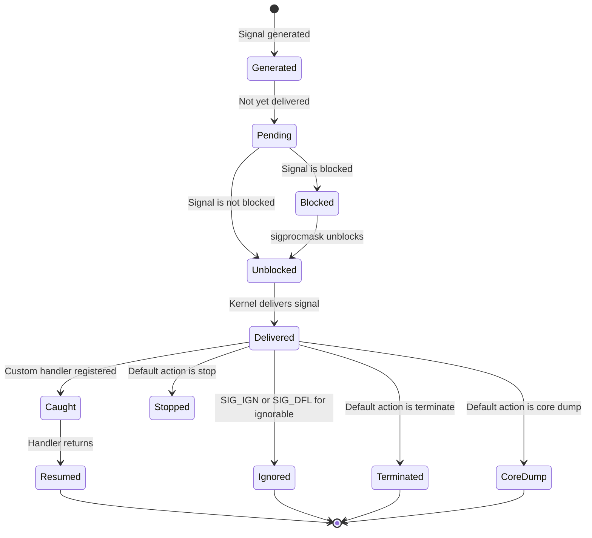

# Chapter 265: Signal Handling

## 1. Introduction

Signals are one of the oldest and most fundamental interprocess communication mechanisms in UNIX and Linux. They provide a way for the kernel and other processes to notify a process that an event has occurred — from the simple Ctrl+C (SIGINT) to complex scenarios like memory access violations (SIGSEGV) and timer expirations (SIGALRM).

Signal handling is deceptively simple on the surface but contains numerous subtleties that can lead to race conditions, undefined behavior, and security vulnerabilities. This chapter covers the complete signal handling mechanism, including the critical concept of async-signal-safety, the modern `signalfd` interface, and best practices for robust signal handling.

## 2. Intuition: Signals as Software Interrupts

### 2.1 What Are Signals?

A signal is a notification delivered to a process (or thread) that an event has occurred. Think of it as a software analog to a hardware interrupt:

- **Hardware interrupt**: A device signals the CPU that it needs attention.
- **Signal**: The kernel (or another process) signals a process that something happened.

Like hardware interrupts, signals interrupt the normal flow of execution. When a signal is delivered, the process's current instruction is paused, a signal handler runs, and then execution resumes (usually).

### 2.2 Signal Lifecycle



### 2.3 Signal Generation and Delivery

Signals can be generated by:

1. **The kernel** — When a process violates memory access (SIGSEGV), divides by zero (SIGFPE), or uses an illegal instruction (SIGILL).
2. **Another process** — Via `kill()`, `killpg()`, or `tgkill()`.
3. **The process itself** — Via `raise()`, `kill(getpid(), sig)`, or `abort()`.
4. **The kernel on behalf of a process** — Terminal-generated signals (SIGINT from Ctrl+C, SIGQUIT from Ctrl+\, SIGTSTP from Ctrl+Z).
5. **Timers** — `alarm()`, `setitimer()`, `timer_create()`.
6. **Asynchronous I/O** — When an AIO operation completes.
7. **Child process events** — SIGCHLD when a child exits.
8. **Job control** — SIGCONT, SIGSTOP, SIGTTOU, SIGTTIN.

## 3. Standard Signals

### 3.1 Signal List

| Signal | Default Action | Description |
|--------|---------------|-------------|
| `SIGHUP` (1) | Terminate | Hangup (terminal closed) |
| `SIGINT` (2) | Terminate | Interrupt (Ctrl+C) |
| `SIGQUIT` (3) | Core dump | Quit (Ctrl+\) |
| `SIGILL` (4) | Core dump | Illegal instruction |
| `SIGTRAP` (5) | Core dump | Trace/breakpoint trap |
| `SIGABRT` (6) | Core dump | Abort (`abort()`) |
| `SIGBUS` (7) | Core dump | Bus error (alignment) |
| `SIGFPE` (8) | Core dump | Floating-point exception |
| `SIGKILL` (9) | Terminate | **Cannot be caught or ignored** |
| `SIGUSR1` (10) | Terminate | User-defined signal 1 |
| `SIGSEGV` (11) | Core dump | Segmentation fault |
| `SIGUSR2` (12) | Terminate | User-defined signal 2 |
| `SIGPIPE` (13) | Terminate | Broken pipe |
| `SIGALRM` (14) | Terminate | Timer expired |
| `SIGTERM` (15) | Terminate | Termination request |
| `SIGCHLD` (17) | Ignore | Child status changed |
| `SIGCONT` (18) | Continue | Continue if stopped |
| `SIGSTOP` (19) | Stop | **Cannot be caught or ignored** |
| `SIGTSTP` (20) | Stop | Terminal stop (Ctrl+Z) |
| `SIGTTIN` (21) | Stop | Background read from terminal |
| `SIGTTOU` (22) | Stop | Background write to terminal |

### 3.2 Default Actions

Each signal has a default action when it's delivered and the process hasn't registered a handler:

- **Term** — Terminate the process
- **Ign** — Ignore the signal
- **Core** — Terminate and produce a core dump
- **Stop** — Stop (suspend) the process
- **Cont** — Continue (resume) a stopped process

## 4. Signal Handling with sigaction()

### 4.1 The sigaction() System Call

`sigaction()` is the POSIX-recommended way to establish signal handlers:

```c
#include <signal.h>

int sigaction(int signum, const struct sigaction *act, struct sigaction *oldact);

struct sigaction {
    void     (*sa_handler)(int);          // SIG_DFL, SIG_IGN, or handler
    void     (*sa_sigaction)(int, siginfo_t *, void *);  // Extended handler
    sigset_t   sa_mask;                   // Signals to block during handler
    int        sa_flags;                  // Flags
    void     (*sa_restorer)(void);        // Internal use (not portable)
};
```

### 4.2 Basic Signal Handling

```c
#include <stdio.h>
#include <stdlib.h>
#include <signal.h>
#include <unistd.h>

static volatile sig_atomic_t got_signal = 0;

static void handler(int sig)
{
    // This function runs in signal context!
    // Only async-signal-safe operations allowed here
    got_signal = sig;
}

int main(void)
{
    struct sigaction sa;
    sa.sa_handler = handler;
    sigemptyset(&sa.sa_mask);
    sa.sa_flags = 0;

    if (sigaction(SIGINT, &sa, NULL) == -1) {
        perror("sigaction");
        return 1;
    }

    while (!got_signal) {
        pause();  // Sleep until a signal is delivered
    }

    printf("Caught signal %d\n", got_signal);
    return 0;
}
```

### 4.3 The siginfo_t Structure

For more information about a signal, use `SA_SIGINFO` and the `sa_sigaction` handler:

```c
#include <stdio.h>
#include <signal.h>
#include <unistd.h>

static void handler(int sig, siginfo_t *info, void *ucontext)
{
    // info contains detailed signal information
    printf("Signal %d received\n", sig);
    printf("  Sender PID: %d\n", info->si_pid);
    printf("  Sender UID: %d\n", info->si_uid);
    printf("  Signal code: %d\n", info->si_code);

    // For SIGSEGV/SIGBUS/SIGFPE:
    if (sig == SIGSEGV) {
        printf("  Fault address: %p\n", info->si_addr);
    }

    // For SIGCHLD:
    if (sig == SIGCHLD) {
        printf("  Child PID: %d\n", info->si_pid);
        printf("  Child status: %d\n", info->si_status);
        printf("  Child utime: %ld\n", info->si_utime);
    }
}

int main(void)
{
    struct sigaction sa;
    sa.sa_sigaction = handler;
    sigemptyset(&sa.sa_mask);
    sa.sa_flags = SA_SIGINFO;

    sigaction(SIGSEGV, &sa, NULL);
    sigaction(SIGCHLD, &sa, NULL);

    // Trigger SIGSEGV for demonstration
    volatile int *p = NULL;
    *p = 42;  // BOOM

    return 0;
}
```

### 4.4 sa_flags

| Flag | Description |
|------|-------------|
| `SA_RESTART` | Automatically restart interrupted system calls |
| `SA_SIGINFO` | Use `sa_sigaction` instead of `sa_handler` |
| `SA_NOCLDSTOP` | Don't generate SIGCHLD when children stop |
| `SA_NOCLDWAIT` | Don't create zombies (auto-reap children) |
| `SA_NODEFER` | Don't block the signal during handler execution |
| `SA_ONSTACK` | Use alternate signal stack |
| `SA_RESETHAND` | Reset handler to SIG_DFL after delivery |

```c
// SA_RESTART: Automatically restart interrupted calls
struct sigaction sa;
sa.sa_handler = handler;
sigemptyset(&sa.sa_mask);
sa.sa_flags = SA_RESTART;  // read/write/pause will restart
sigaction(SIGALRM, &sa, NULL);

// Without SA_RESTART:
// read() may return -1 with errno == EINTR
// With SA_RESTART:
// read() automatically restarts after signal handler returns
```

## 5. Signal Masking

### 5.1 Blocking Signals

```c
#include <signal.h>

int sigprocmask(int how, const sigset_t *set, sigset_t *oldset);
// Thread-safe version:
int pthread_sigmask(int how, const sigset_t *set, sigset_t *oldset);

// how values:
// SIG_BLOCK    - Add signals to blocked set
// SIG_UNBLOCK  - Remove signals from blocked set
// SIG_SETMASK  - Set blocked set to exactly 'set'
```

### 5.2 Signal Set Operations

```c
sigset_t set;

// Initialize
sigemptyset(&set);      // Empty set (no signals)
sigfillset(&set);       // Full set (all signals)

// Add/remove individual signals
sigaddset(&set, SIGINT);
sigaddset(&set, SIGTERM);
sigdelset(&set, SIGINT);

// Test membership
if (sigismember(&set, SIGINT))
    printf("SIGINT is in the set\n");
```

### 5.3 Waiting for Signals

```c
#include <signal.h>

// Suspend until any unblocked signal is delivered
int sigsuspend(const sigset_t *mask);

// Atomically: set mask to 'mask', suspend, restore old mask on return
```

```c
// Wait specifically for SIGINT
sigset_t wait_set;
sigemptyset(&wait_set);
sigaddset(&wait_set, SIGINT);

// Block SIGINT first
sigset_t old_set;
sigprocmask(SIG_BLOCK, &wait_set, &old_set);

// Wait for SIGINT (temporarily unblocks it)
sigsuspend(&old_set);

// SIGINT was delivered here
printf("SIGINT received\n");
```

### 5.4 sigwait() — Synchronous Signal Handling

Instead of using asynchronous handlers, you can wait for signals synchronously:

```c
#include <signal.h>

int sigwait(const sigset_t *set, int *sig);

// Thread that handles signals synchronously
void *signal_thread(void *arg)
{
    sigset_t *set = arg;
    int sig;

    while (1) {
        int ret = sigwait(set, &sig);
        if (ret != 0) {
            fprintf(stderr, "sigwait: %s\n", strerror(ret));
            continue;
        }

        switch (sig) {
        case SIGINT:
            printf("SIGINT received — shutting down\n");
            // Set shutdown flag
            break;
        case SIGTERM:
            printf("SIGTERM received — shutting down\n");
            break;
        case SIGHUP:
            printf("SIGHUP received — reloading config\n");
            break;
        default:
            printf("Signal %d received\n", sig);
        }
    }
    return NULL;
}

int main(void)
{
    // Block signals in ALL threads
    sigset_t set;
    sigemptyset(&set);
    sigaddset(&set, SIGINT);
    sigaddset(&set, SIGTERM);
    sigaddset(&set, SIGHUP);
    pthread_sigmask(SIG_BLOCK, &set, NULL);

    // Create a dedicated signal-handling thread
    pthread_t tid;
    pthread_create(&tid, NULL, signal_thread, &set);

    // Main thread continues working, never interrupted by signals
    while (1) {
        // ... normal work ...
    }
    return 0;
}
```

## 6. Async-Signal-Safety

### 6.1 The Problem

A signal handler can interrupt your program at any point — in the middle of `malloc()`, `printf()`, or any other function. If the signal handler itself calls a function that the interrupted code was already executing, the result can be catastrophic:

```c
// DANGEROUS: printf() and malloc() are NOT async-signal-safe
static void handler(int sig)
{
    printf("Caught signal %d\n", sig);  // NOT SAFE
    char *p = malloc(100);              // NOT SAFE
    free(p);                             // NOT SAFE
}
```

Consider this scenario:
1. The main thread calls `malloc()`, which acquires the malloc lock.
2. A signal arrives.
3. The signal handler calls `malloc()`, which tries to acquire the same lock.
4. **Deadlock** — the lock is already held by the same thread.

### 6.2 Async-Signal-Safe Functions

POSIX defines a list of functions that are safe to call from signal handlers. These are guaranteed not to deadlock or corrupt data:

| Function | Purpose |
|----------|---------|
| `write()` | Write to file descriptor |
| `read()` | Read from file descriptor |
| `_exit()` | Terminate process |
| `abort()` | Abort process |
| `kill()` | Send signal |
| `raise()` | Send signal to self |
| `sigaction()` | Set signal handler |
| `signal()` | Set signal handler |
| `sigprocmask()` | Block/unblock signals |
| `sigpending()` | Check pending signals |
| `sigsuspend()` | Wait for signal |
| `alarm()` | Set alarm timer |
| `dup()`, `dup2()` | Duplicate file descriptors |
| `fcntl()` | File control |
| `fstat()` | Get file status |
| `getpid()` | Get process ID |
| `getuid()` | Get user ID |
| `setuid()` | Set user ID |
| `nanosleep()` | High-resolution sleep |
| `clock_gettime()` | Get time |
| `pthread_self()` | Get thread ID |
| `pthread_kill()` | Send signal to thread |

### 6.3 The write() Pattern

The standard pattern for safe signal handler output:

```c
#include <signal.h>
#include <unistd.h>
#include <string.h>

static void handler(int sig)
{
    // write() is async-signal-safe
    const char *msg = "Signal caught\n";
    write(STDERR_FILENO, msg, strlen(msg));  // Safe!

    // DON'T use:
    // printf("Signal caught\n");     // NOT safe
    // fprintf(stderr, "...");         // NOT safe
    // syslog(LOG_INFO, "...");        // NOT safe
}
```

### 6.4 The Self-Pipe Trick

A common pattern for safely handling signals in event loops:

```c
#include <signal.h>
#include <unistd.h>
#include <poll.h>

static int signal_pipe[2];

static void handler(int sig)
{
    // write() is async-signal-safe
    unsigned char byte = sig;
    write(signal_pipe[1], &byte, 1);
}

int main(void)
{
    // Create pipe
    if (pipe(signal_pipe) == -1) {
        perror("pipe");
        return 1;
    }

    // Set up signal handler
    struct sigaction sa;
    sa.sa_handler = handler;
    sigemptyset(&sa.sa_mask);
    sa.sa_flags = SA_RESTART;
    sigaction(SIGINT, &sa, NULL);
    sigaction(SIGTERM, &sa, NULL);

    // In the event loop, poll the pipe alongside other fds
    struct pollfd fds[2];
    fds[0].fd = signal_pipe[0];  // Signal pipe
    fds[0].events = POLLIN;
    fds[1].fd = some_other_fd;   // Network socket
    fds[1].events = POLLIN;

    while (1) {
        int ret = poll(fds, 2, -1);
        if (ret == -1) {
            if (errno == EINTR)
                continue;
            break;
        }

        if (fds[0].revents & POLLIN) {
            // Signal arrived — safe to process now
            unsigned char sig;
            read(signal_pipe[0], &sig, 1);
            printf("Signal %d received (safe context)\n", sig);
            if (sig == SIGINT || sig == SIGTERM)
                break;
        }

        if (fds[1].revents & POLLIN) {
            // Handle network data
        }
    }

    close(signal_pipe[0]);
    close(signal_pipe[1]);
    return 0;
}
```

## 7. signalfd — File Descriptor Based Signal Handling

### 7.1 What is signalfd?

`signalfd()` creates a file descriptor from which you can read signal information. This allows you to handle signals as part of your regular I/O event loop, avoiding the complexities of signal handlers entirely.

```c
#include <sys/signalfd.h>

int signalfd(int fd, const sigset_t *mask, int flags);
```

### 7.2 signalfd Example

```c
#include <stdio.h>
#include <signal.h>
#include <sys/signalfd.h>
#include <unistd.h>
#include <stdlib.h>

int main(void)
{
    sigset_t mask;
    sigemptyset(&mask);
    sigaddset(&mask, SIGINT);
    sigaddset(&mask, SIGTERM);
    sigaddset(&mask, SIGCHLD);

    // Block signals so they don't invoke default handlers
    sigprocmask(SIG_BLOCK, &mask, NULL);

    // Create signalfd
    int sfd = signalfd(-1, &mask, SFD_NONBLOCK | SFD_CLOEXEC);
    if (sfd == -1) {
        perror("signalfd");
        return 1;
    }

    printf("Waiting for signals on fd %d\n", sfd);

    while (1) {
        struct signalfd_siginfo si;
        ssize_t n = read(sfd, &si, sizeof(si));
        if (n == -1) {
            if (errno == EAGAIN) {
                // No signals pending
                continue;
            }
            perror("read");
            break;
        }
        if (n != sizeof(si)) {
            fprintf(stderr, "short read from signalfd\n");
            break;
        }

        printf("Signal %d from pid %d uid %d\n",
               si.ssi_signo, si.ssi_pid, si.ssi_uid);

        if (si.ssi_signo == SIGINT || si.ssi_signo == SIGTERM)
            break;
    }

    close(sfd);
    return 0;
}
```

### 7.3 signalfd + epoll

signalfd integrates perfectly with epoll:

```c
#include <sys/epoll.h>
#include <sys/signalfd.h>
#include <signal.h>

int main(void)
{
    // Set up signal mask
    sigset_t mask;
    sigemptyset(&mask);
    sigaddset(&mask, SIGINT);
    sigaddset(&mask, SIGTERM);
    sigprocmask(SIG_BLOCK, &mask, NULL);

    // Create signalfd
    int sfd = signalfd(-1, &mask, SFD_CLOEXEC);

    // Create epoll
    int epfd = epoll_create1(EPOLL_CLOEXEC);

    struct epoll_event ev;
    ev.events = EPOLLIN;
    ev.data.fd = sfd;
    epoll_ctl(epfd, EPOLL_CTL_ADD, sfd, &ev);

    // Add other fds (sockets, etc.)
    // ev.data.fd = listen_fd;
    // epoll_ctl(epfd, EPOLL_CTL_ADD, listen_fd, &ev);

    struct epoll_event events[10];
    while (1) {
        int nfds = epoll_wait(epfd, events, 10, -1);
        for (int i = 0; i < nfds; i++) {
            if (events[i].data.fd == sfd) {
                struct signalfd_siginfo si;
                read(sfd, &si, sizeof(si));
                if (si.ssi_signo == SIGTERM) {
                    // Graceful shutdown
                    goto done;
                }
            } else {
                // Handle regular fd
            }
        }
    }

done:
    close(sfd);
    close(epfd);
    return 0;
}
```

## 8. Realtime Signals

### 8.1 Standard vs. Realtime Signals

Standard signals (1-31) have two significant limitations:
1. **No queuing**: If multiple instances of the same signal are pending, only one is delivered.
2. **No payload**: You can only know which signal was delivered, not any associated data.

Realtime signals (SIGRTMIN to SIGRTMAX, typically 34-64) solve both problems:

```c
#include <signal.h>

int sigqueue(pid_t pid, int sig, const union sigval value);

union sigval {
    int    sival_int;    // Integer value
    void  *sival_ptr;    // Pointer value
};
```

### 8.2 Realtime Signal Example

```c
#include <stdio.h>
#include <signal.h>
#include <unistd.h>
#include <stdlib.h>

static void handler(int sig, siginfo_t *info, void *ucontext)
{
    printf("Received RT signal %d, value = %d, from pid %d\n",
           sig, info->si_value.sival_int, info->si_pid);
}

int main(void)
{
    int sig = SIGRTMIN;  // Use the first realtime signal

    struct sigaction sa;
    sa.sa_sigaction = handler;
    sigemptyset(&sa.sa_mask);
    sa.sa_flags = SA_SIGINFO;
    sigaction(sig, &sa, NULL);

    // Send multiple queued realtime signals
    for (int i = 0; i < 5; i++) {
        union sigval val;
        val.sival_int = i;
        sigqueue(getpid(), sig, val);
    }

    // All 5 signals should be delivered (queued)
    sleep(1);
    return 0;
}
```

## 8. Signal Handling Best Practices in Detail

### 8.1 The Signal-Safe Pattern

The most reliable pattern for signal handling in production code is to minimize work in the signal handler:

```c
#include <signal.h>
#include <unistd.h>
#include <stdatomic.h>

static volatile atomic_int shutdown_flag = 0;
static volatile atomic_int reload_flag = 0;
static int signal_pipe[2];

static void signal_handler(int sig)
{
    unsigned char byte = sig;
    write(signal_pipe[1], &byte, 1);  // Async-signal-safe
}

int main(void)
{
    pipe(signal_pipe);

    struct sigaction sa = {
        .sa_handler = signal_handler,
        .sa_flags = SA_RESTART
    };
    sigemptyset(&sa.sa_mask);
    sigaction(SIGTERM, &sa, NULL);
    sigaction(SIGINT, &sa, NULL);
    sigaction(SIGHUP, &sa, NULL);

    // In event loop: poll the signal pipe alongside other fds
    // This avoids all signal-handler complexity
}
```

### 8.2 Signal Handling in Multi-Threaded Programs

In multi-threaded programs, signals are delivered to any thread that hasn't blocked them. The recommended approach is:

1. Block all signals in all threads at program startup.
2. Create a dedicated signal-handling thread that calls `sigwait()`.
3. The signal thread dispatches events to the appropriate worker thread.

This approach avoids the complexities of signal handlers running in arbitrary thread contexts and ensures that signals are handled in a controlled, sequential manner.

### 8.3 Signal Safety and errno

Signal handlers must be careful with errno. If a signal handler modifies errno, the interrupted code may see the wrong error code:

```c
static void handler(int sig)
{
    int saved_errno = errno;  // Save
    // ... do work ...
    errno = saved_errno;      // Restore
}
```

### 8.4 Using signalfd with epoll for Production Servers

For production servers, integrating signals into the event loop via signalfd is the gold standard. This eliminates all the complexities of signal handlers and allows uniform event processing:

```c
// Block signals
sigset_t mask;
sigemptyset(&mask);
sigaddset(&mask, SIGTERM);
sigaddset(&mask, SIGINT);
sigaddset(&mask, SIGHUP);
sigaddset(&mask, SIGUSR1);
sigprocmask(SIG_BLOCK, &mask, NULL);

// Create signalfd
int sfd = signalfd(-1, &mask, SFD_CLOEXEC);

// Add to epoll alongside network fds
struct epoll_event ev = {.events = EPOLLIN, .data.fd = sfd};
epoll_ctl(epfd, EPOLL_CTL_ADD, sfd, &ev);

// In event loop:
if (events[i].data.fd == sfd) {
    struct signalfd_siginfo si;
    read(sfd, &si, sizeof(si));
    switch (si.ssi_signo) {
    case SIGTERM:
    case SIGINT:
        running = 0;
        break;
    case SIGHUP:
        reload_config = 1;
        break;
    case SIGUSR1:
        reopen_logs = 1;
        break;
    }
}
```

## 9. Common Pitfalls

### 9.1 Using printf() in Signal Handlers
Never use `printf()`, `malloc()`, or any non-async-signal-safe function in a signal handler.

### 9.2 Forgetting to Block Signals Before sigwait()
Signals must be blocked with `sigprocmask()` before calling `sigwait()`, otherwise the default action will occur.

### 9.3 Race Conditions with sig_atomic_t
```c
// WRONG: Not atomic on all architectures
static int flag = 0;

// CORRECT: Use volatile sig_atomic_t
static volatile sig_atomic_t flag = 0;
```

### 9.4 Using signal() Instead of sigaction()
`signal()` has different behavior across systems (System V vs BSD semantics). Always use `sigaction()`.

### 9.5 Unblocking Signals in Handlers
If `SA_NODEFER` is not set, the signal being handled is blocked during handler execution. Don't forget this when using `sigsuspend()` or `sigwaitinfo()`.

### 9.6 signalfd Without Blocking
If you create a `signalfd` but don't block the signals with `sigprocmask()`, the default handler will run instead.

## 10. Best Practices

1. **Use `sigaction()` instead of `signal()`** — always.
2. **Use `volatile sig_atomic_t`** for flags shared between signal handlers and main code.
3. **Minimize work in signal handlers** — set a flag, write to a pipe, or do nothing.
4. **Use the self-pipe trick or signalfd** for integrating signals into event loops.
5. **Use `sigwait()`/`signalfd()` instead of signal handlers** when possible — they're simpler and safer.
6. **Block all signals in worker threads** and handle them in a dedicated thread.
7. **Use realtime signals** when you need queued signals with payloads.
8. **Use `SA_RESTART`** to avoid EINTR on system calls, but remember not all calls can be restarted.
9. **Use `abort()` to terminate** from a signal handler (it's async-signal-safe).
10. **Document signal handling behavior** in your program's architecture.

## 11. Exercises

### Exercise 1: Graceful Shutdown Server
Write a TCP server that uses the self-pipe trick to handle SIGINT/SIGTERM for graceful shutdown.

### Exercise 2: Signal-Based Timer
Implement a periodic timer using `timer_create()` and realtime signals.

### Exercise 3: signalfd Event Loop
Write a program that uses `signalfd` + `epoll` to handle signals, network I/O, and timer events in a single event loop.

### Exercise 4: Thread-Safe Signal Dispatch
Write a library that distributes different signals to different threads, using `pthread_sigmask()` and `pthread_kill()`.

## 12. References

- **The Linux Programming Interface** by Michael Kerrisk — Chapters 20-22: Signal fundamentals, signal handlers, signals and I/O
- **Advanced Programming in the UNIX Environment** by W. Richard Stevens — Chapter 10: Signals
- **man pages**: `man 2 sigaction`, `man 2 sigprocmask`, `man 2 signalfd`, `man 7 signal`, `man 7 signal-safety`
- **POSIX.1-2017 specification**: Signal concepts chapter
- **"Secure Programming Cookbook for C and C++"** by John Viega and Matt Messier — Signal handling recipes
