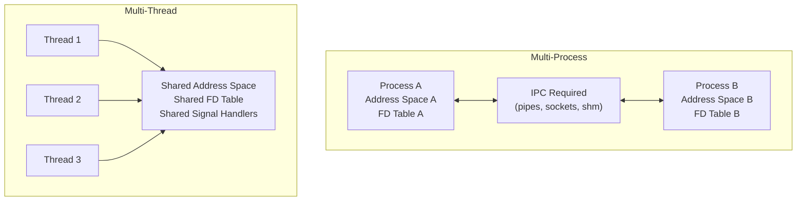
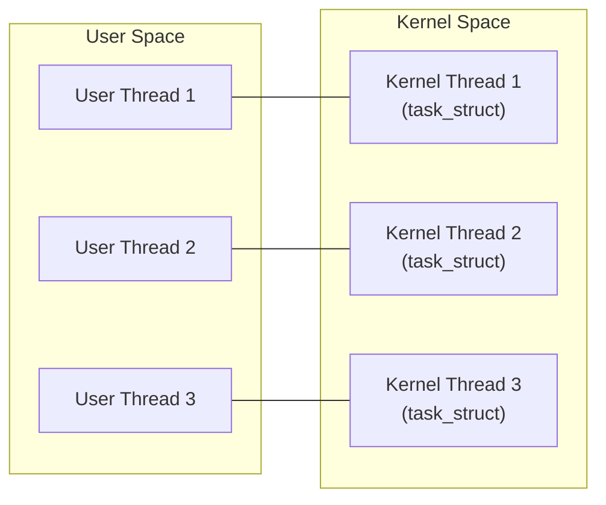
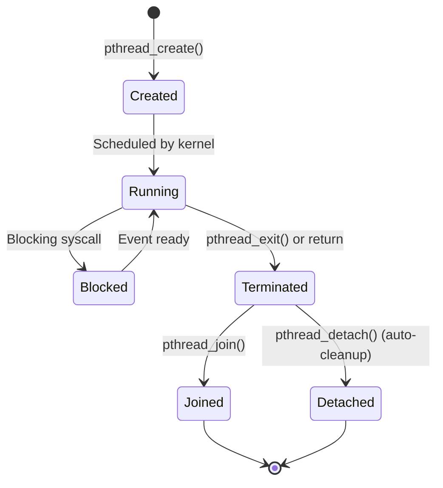

# Chapter 266: Thread Programming

## 1. Introduction

Threads are the fundamental unit of CPU utilization in modern operating systems. Unlike processes, which have separate address spaces, threads within the same process share the same address space, file descriptors, signal handlers, and other process attributes. This shared state makes threads lightweight and efficient for concurrent programming, but also introduces complex synchronization challenges.

The POSIX threads (pthreads) API is the standard threading interface on Linux and other UNIX-like systems. This chapter covers thread creation, lifecycle management, cancellation, barriers, condition variables, and the design patterns that lead to robust multithreaded programs.

## 2. Intuition: Why Threads?

### 2.1 Processes vs. Threads



| Aspect | Processes | Threads |
|--------|-----------|---------|
| Address space | Separate | Shared |
| Memory overhead | High (page tables, etc.) | Low (just stack + TLS) |
| Creation cost | High (fork is expensive) | Low (clone is fast) |
| Context switch | Expensive (TLB flush) | Cheap |
| Communication | IPC (pipes, sockets, shm) | Shared memory (direct) |
| Isolation | Strong | Weak (one thread can corrupt others) |
| Crash impact | One process crashes, others unaffected | One thread crashes, entire process dies |

### 2.2 The 1:1 Threading Model

Linux uses a 1:1 threading model (via NPTL — Native POSIX Threads Library):



Each user thread maps 1:1 to a kernel thread. This means:
- The kernel scheduler handles thread scheduling
- Blocking one thread doesn't block others
- True parallelism on multi-core systems
- No "green thread" overhead (but no M:N benefits either)

## 3. Thread Creation

### 3.1 pthread_create()

```c
#include <pthread.h>

int pthread_create(pthread_t *thread, const pthread_attr_t *attr,
                   void *(*start_routine)(void *), void *arg);
```

**Parameters:**
- `thread` — Output: the thread ID
- `attr` — Thread attributes (NULL for defaults)
- `start_routine` — Function the thread executes
- `arg` — Argument passed to `start_routine`

**Return value:** 0 on success, error number on failure (note: does NOT set errno).

```c
#include <stdio.h>
#include <stdlib.h>
#include <pthread.h>
#include <unistd.h>

struct thread_arg {
    int id;
    char *name;
};

void *thread_func(void *arg)
{
    struct thread_arg *ta = arg;
    printf("Thread %d (%s): started, PID=%d, TID=%lu\n",
           ta->id, ta->name, getpid(), (unsigned long)pthread_self());

    // Simulate work
    sleep(1);

    printf("Thread %d: finished\n", ta->id);

    // Return value (will be available via pthread_join)
    int *result = malloc(sizeof(int));
    *result = ta->id * 10;
    return result;
}

int main(void)
{
    pthread_t threads[4];
    struct thread_arg args[4];

    for (int i = 0; i < 4; i++) {
        args[i].id = i;
        args[i].name = "worker";

        int ret = pthread_create(&threads[i], NULL, thread_func, &args[i]);
        if (ret != 0) {
            fprintf(stderr, "pthread_create: %s\n", strerror(ret));
            return 1;
        }
    }

    // Wait for all threads
    for (int i = 0; i < 4; i++) {
        void *retval;
        pthread_join(threads[i], &retval);
        printf("Thread %d returned %d\n", i, *(int *)retval);
        free(retval);
    }

    return 0;
}
```

### 3.2 Thread Lifecycle



### 3.3 Thread Attributes

```c
#include <pthread.h>

int pthread_attr_init(pthread_attr_t *attr);
int pthread_attr_destroy(pthread_attr_t *attr);

// Detach state
int pthread_attr_setdetachstate(pthread_attr_t *attr, int detachstate);
// PTHREAD_CREATE_JOINABLE (default) — must be joined
// PTHREAD_CREATE_DETACHED — auto-cleanup

// Stack size
int pthread_attr_setstacksize(pthread_attr_t *attr, size_t stacksize);
// Default: typically 2MB (8MB on some systems)
// Minimum: PTHREAD_STACK_MIN (16384 bytes on Linux)

// Stack address (for custom stack allocation)
int pthread_attr_setstack(pthread_attr_t *attr, void *stackaddr, size_t stacksize);

// Guard size
int pthread_attr_setguardsize(pthread_attr_t *attr, size_t guardsize);
// Default: PAGESIZE (4096 bytes)

// Scheduling policy
int pthread_attr_setschedpolicy(pthread_attr_t *attr, int policy);
// SCHED_OTHER, SCHED_FIFO, SCHED_RR

// Scheduling priority
int pthread_attr_setschedparam(pthread_attr_t *attr, const struct sched_param *param);

// Inherit scheduler from parent
int pthread_attr_setinheritsched(pthread_attr_t *attr, int inherit);
// PTHREAD_INHERIT_SCHED (default) or PTHREAD_EXPLICIT_SCHED

// Scope (system-wide or process-local)
int pthread_attr_setscope(pthread_attr_t *attr, int scope);
// PTHREAD_SCOPE_SYSTEM (Linux always uses this)
// PTHREAD_SCOPE_PROCESS (not supported on Linux)
```

```c
// Example: Creating a thread with custom attributes
pthread_t thread;
pthread_attr_t attr;

pthread_attr_init(&attr);
pthread_attr_setdetachstate(&attr, PTHREAD_CREATE_DETACHED);
pthread_attr_setstacksize(&attr, 1024 * 1024);  // 1MB stack

pthread_create(&thread, &attr, thread_func, arg);

pthread_attr_destroy(&attr);
// Thread is detached — don't call pthread_join()
```

## 4. Thread Synchronization

### 4.1 pthread_join()

```c
int pthread_join(pthread_t thread, void **retval);
```

`pthread_join()` waits for a thread to terminate and retrieves its return value. A thread that is joinable (the default) must be joined to release its resources.

```c
void *result;
pthread_join(thread, &result);
// result contains the return value from the thread function
```

**Important rules:**
- Only one thread can join a given thread.
- Joining a thread that another thread is already joining is undefined behavior.
- Joining a detached thread is undefined behavior.
- If a joinable thread terminates without being joined, it becomes a "zombie" thread (resources not released).

### 4.2 pthread_detach()

```c
int pthread_detach(pthread_t thread);
```

Detaching a thread means its resources are automatically released when it terminates. You cannot `pthread_join()` a detached thread.

```c
// Option 1: Detach at creation
pthread_attr_t attr;
pthread_attr_init(&attr);
pthread_attr_setdetachstate(&attr, PTHREAD_CREATE_DETACHED);
pthread_create(&thread, &attr, func, arg);
pthread_attr_destroy(&attr);

// Option 2: Detach after creation
pthread_create(&thread, NULL, func, arg);
pthread_detach(thread);

// Option 3: Thread detaches itself
void *thread_func(void *arg)
{
    pthread_detach(pthread_self());
    // ... work ...
    return NULL;
}
```

### 4.3 pthread_cancel() and Cancellation

```c
int pthread_cancel(pthread_t thread);
int pthread_setcancelstate(int state, int *oldstate);
int pthread_setcanceltype(int type, int *oldtype);
void pthread_testcancel(void);
```

**Cancellation states:**
- `PTHREAD_CANCEL_ENABLE` (default) — Cancellation is enabled
- `PTHREAD_CANCEL_DISABLE` — Cancellation is deferred

**Cancellation types:**
- `PTHREAD_CANCEL_DEFERRED` (default) — Cancellation is checked at cancellation points
- `PTHREAD_CANCEL_ASYNCHRONOUS` — Cancellation can happen at any time

**Cancellation points** are specific POSIX functions where the thread checks for pending cancellation: `read()`, `write()`, `open()`, `close()`, `sleep()`, `pthread_cond_wait()`, `sem_wait()`, `select()`, `poll()`, etc.

```c
#include <stdio.h>
#include <pthread.h>
#include <unistd.h>

void cleanup_handler(void *arg)
{
    printf("Cleanup: %s\n", (char *)arg);
}

void *worker(void *arg)
{
    pthread_cleanup_push(cleanup_handler, "freeing resources");
    pthread_cleanup_push(cleanup_handler, "closing files");

    while (1) {
        printf("Working...\n");
        sleep(1);  // Cancellation point
        // If cancelled during sleep(), cleanup handlers run
    }

    pthread_cleanup_pop(0);  // 0 = don't execute handler
    pthread_cleanup_pop(0);
    return NULL;
}

int main(void)
{
    pthread_t thread;
    pthread_create(&thread, NULL, worker, NULL);

    sleep(3);
    pthread_cancel(thread);

    void *retval;
    pthread_join(thread, &retval);
    if (retval == PTHREAD_CANCELED)
        printf("Thread was cancelled\n");

    return 0;
}
```

### 4.4 pthread_cleanup_push/pop

These macros register cleanup handlers that are called when the thread is cancelled:

```c
void pthread_cleanup_push(void (*routine)(void *), void *arg);
void pthread_cleanup_pop(int execute);

// execute = 0: Don't execute the handler (normal exit)
// execute = 1: Execute the handler (even on normal exit)
```

**Warning**: `pthread_cleanup_push` and `pthread_cleanup_pop` must be paired within the same scope (they may be implemented as macros that open/close a block).

## 7. Complete Example: A Production-Ready Thread Pool

### 7.1 Thread Pool Design

A thread pool is one of the most common concurrency patterns. Instead of creating a new thread for each task, a fixed pool of threads processes tasks from a queue. This avoids the overhead of thread creation and destruction and limits the number of concurrent threads.

The design consists of:
- A task queue (protected by a mutex)
- A condition variable to signal when tasks are available
- A fixed number of worker threads that pull tasks from the queue
- A shutdown flag to signal workers to exit

### 7.2 Implementation

```c
#include <stdio.h>
#include <stdlib.h>
#include <pthread.h>

#define MAX_THREADS 8
#define MAX_QUEUE 256

typedef void (*task_func_t)(void *arg);

struct task {
    task_func_t func;
    void *arg;
};

struct thread_pool {
    pthread_t threads[MAX_THREADS];
    struct task queue[MAX_QUEUE];
    int queue_head;
    int queue_tail;
    int queue_count;
    int shutdown;
    pthread_mutex_t mutex;
    pthread_cond_t not_empty;
    pthread_cond_t not_full;
};

void *worker(void *arg)
{
    struct thread_pool *pool = arg;

    while (1) {
        pthread_mutex_lock(&pool->mutex);

        while (pool->queue_count == 0 && !pool->shutdown)
            pthread_cond_wait(&pool->not_empty, &pool->mutex);

        if (pool->shutdown && pool->queue_count == 0) {
            pthread_mutex_unlock(&pool->mutex);
            break;
        }

        struct task t = pool->queue[pool->queue_head];
        pool->queue_head = (pool->queue_head + 1) % MAX_QUEUE;
        pool->queue_count--;

        pthread_cond_signal(&pool->not_full);
        pthread_mutex_unlock(&pool->mutex);

        t.func(t.arg);
    }
    return NULL;
}

int pool_submit(struct thread_pool *pool, task_func_t func, void *arg)
{
    pthread_mutex_lock(&pool->mutex);

    while (pool->queue_count == MAX_QUEUE && !pool->shutdown)
        pthread_cond_wait(&pool->not_full, &pool->mutex);

    if (pool->shutdown) {
        pthread_mutex_unlock(&pool->mutex);
        return -1;
    }

    pool->queue[pool->queue_tail] = (struct task){func, arg};
    pool->queue_tail = (pool->queue_tail + 1) % MAX_QUEUE;
    pool->queue_count++;

    pthread_cond_signal(&pool->not_empty);
    pthread_mutex_unlock(&pool->mutex);
    return 0;
}
```

This pattern is used extensively in production systems — web servers, database engines, and background task processors all benefit from the controlled concurrency that thread pools provide.

## 8. Condition Variables

### 8.1 The Concept

A condition variable allows threads to wait for a specific condition to become true. It solves the "busy waiting" problem:

```c
// BAD: Busy waiting (wastes CPU)
while (!data_ready) {
    // Spin...
}

// GOOD: Condition variable (efficient waiting)
pthread_mutex_lock(&mutex);
while (!data_ready) {
    pthread_cond_wait(&cond, &mutex);  // Sleep until signaled
}
// Process data
pthread_mutex_unlock(&mutex);
```

### 5.2 API

```c
#include <pthread.h>

int pthread_cond_init(pthread_cond_t *cond, const pthread_condattr_t *attr);
int pthread_cond_destroy(pthread_cond_t *cond);
int pthread_cond_wait(pthread_cond_t *cond, pthread_mutex_t *mutex);
int pthread_cond_timedwait(pthread_cond_t *cond, pthread_mutex_t *mutex,
                           const struct timespec *abstime);
int pthread_cond_signal(pthread_cond_t *cond);
int pthread_cond_broadcast(pthread_cond_t *cond);

// Static initialization
pthread_cond_t cond = PTHREAD_COND_INITIALIZER;
```

### 5.3 Producer-Consumer Example

```c
#include <stdio.h>
#include <stdlib.h>
#include <pthread.h>
#include <unistd.h>

#define QUEUE_SIZE 10

static int queue[QUEUE_SIZE];
static int queue_head = 0;
static int queue_tail = 0;
static int queue_count = 0;

static pthread_mutex_t mutex = PTHREAD_MUTEX_INITIALIZER;
static pthread_cond_t not_empty = PTHREAD_COND_INITIALIZER;
static pthread_cond_t not_full = PTHREAD_COND_INITIALIZER;
static int done = 0;

void enqueue(int item)
{
    queue[queue_tail] = item;
    queue_tail = (queue_tail + 1) % QUEUE_SIZE;
    queue_count++;
}

int dequeue(void)
{
    int item = queue[queue_head];
    queue_head = (queue_head + 1) % QUEUE_SIZE;
    queue_count--;
    return item;
}

void *producer(void *arg)
{
    int id = *(int *)arg;

    for (int i = 0; i < 20; i++) {
        int item = id * 100 + i;

        pthread_mutex_lock(&mutex);
        while (queue_count == QUEUE_SIZE && !done)
            pthread_cond_wait(&not_full, &mutex);

        if (done) {
            pthread_mutex_unlock(&mutex);
            break;
        }

        enqueue(item);
        printf("Producer %d: enqueued %d (count=%d)\n", id, item, queue_count);

        pthread_cond_signal(&not_empty);
        pthread_mutex_unlock(&mutex);

        usleep(rand() % 100000);
    }

    return NULL;
}

void *consumer(void *arg)
{
    while (1) {
        pthread_mutex_lock(&mutex);
        while (queue_count == 0 && !done)
            pthread_cond_wait(&not_empty, &mutex);

        if (queue_count == 0 && done) {
            pthread_mutex_unlock(&mutex);
            break;
        }

        int item = dequeue();
        printf("Consumer: dequeued %d (count=%d)\n", item, queue_count);

        pthread_cond_signal(&not_full);
        pthread_mutex_unlock(&mutex);

        usleep(rand() % 200000);
    }

    return NULL;
}

int main(void)
{
    pthread_t producers[3], consumers[2];
    int ids[] = {0, 1, 2};

    for (int i = 0; i < 3; i++)
        pthread_create(&producers[i], NULL, producer, &ids[i]);
    for (int i = 0; i < 2; i++)
        pthread_create(&consumers[i], NULL, consumer, NULL);

    for (int i = 0; i < 3; i++)
        pthread_join(producers[i], NULL);

    pthread_mutex_lock(&mutex);
    done = 1;
    pthread_cond_broadcast(&not_empty);
    pthread_cond_broadcast(&not_full);
    pthread_mutex_unlock(&mutex);

    for (int i = 0; i < 2; i++)
        pthread_join(consumers[i], NULL);

    return 0;
}
```

### 5.4 Spurious Wakeups

Always use `while` (not `if`) with condition variables:

```c
// WRONG: May proceed when condition is not actually true
if (!data_ready)
    pthread_cond_wait(&cond, &mutex);

// CORRECT: Re-check condition after wakeup
while (!data_ready)
    pthread_cond_wait(&cond, &mutex);
```

Spurious wakeups can occur because:
1. The kernel may wake a thread without a signal (implementation optimization).
2. Multiple threads may be woken by `pthread_cond_broadcast()`.
3. A signal may interrupt `pthread_cond_wait()`.

## 6. Barriers

### 6.1 pthread_barrier

A barrier synchronizes a group of threads — all threads must reach the barrier before any can proceed.

```c
#include <pthread.h>

int pthread_barrier_init(pthread_barrier_t *barrier,
                         const pthread_barrierattr_t *attr,
                         unsigned count);
int pthread_barrier_destroy(pthread_barrier_t *barrier);
int pthread_barrier_wait(pthread_barrier_t *barrier);
```

```c
#include <stdio.h>
#include <pthread.h>
#include <unistd.h>

#define NUM_THREADS 4

static pthread_barrier_t barrier;

void *worker(void *arg)
{
    int id = *(int *)arg;

    printf("Thread %d: phase 1\n", id);
    usleep(rand() % 500000);  // Simulate varying work

    // Wait for all threads to complete phase 1
    int ret = pthread_barrier_wait(&barrier);
    if (ret == PTHREAD_BARRIER_SERIAL_THREAD) {
        // One thread gets this return value
        printf("--- All threads completed phase 1 ---\n");
    }

    printf("Thread %d: phase 2\n", id);
    usleep(rand() % 500000);

    // Wait for all threads to complete phase 2
    pthread_barrier_wait(&barrier);

    printf("Thread %d: phase 3\n", id);
    return NULL;
}

int main(void)
{
    pthread_t threads[NUM_THREADS];
    int ids[NUM_THREADS];

    pthread_barrier_init(&barrier, NULL, NUM_THREADS);

    for (int i = 0; i < NUM_THREADS; i++) {
        ids[i] = i;
        pthread_create(&threads[i], NULL, worker, &ids[i]);
    }

    for (int i = 0; i < NUM_THREADS; i++)
        pthread_join(threads[i], NULL);

    pthread_barrier_destroy(&barrier);
    return 0;
}
```

## 7. Thread-Specific Data (TSD)

### 7.1 pthread_key_t

Thread-specific data (also called thread-local storage via the pthreads API) allows each thread to have its own copy of data. This is useful for libraries that need per-thread state without requiring callers to pass context pointers:

```c
#include <pthread.h>

int pthread_key_create(pthread_key_t *key, void (*destructor)(void *));
int pthread_key_delete(pthread_key_t key);
void *pthread_getspecific(pthread_key_t key);
int pthread_setspecific(pthread_key_t key, const void *value);
```

```c
#include <stdio.h>
#include <stdlib.h>
#include <pthread.h>

static pthread_key_t tsd_key;

static void tsd_destructor(void *value)
{
    printf("Thread %lu: TSD destructor called for %p\n",
           (unsigned long)pthread_self(), value);
    free(value);
}

void *thread_func(void *arg)
{
    int id = *(int *)arg;

    // Allocate thread-specific data
    int *data = malloc(sizeof(int));
    *data = id * 100;
    pthread_setspecific(tsd_key, data);

    // Access thread-specific data
    int *my_data = pthread_getspecific(tsd_key);
    printf("Thread %d: TSD value = %d\n", id, *my_data);

    return NULL;
}

int main(void)
{
    pthread_key_create(&tsd_key, tsd_destructor);

    pthread_t threads[3];
    int ids[] = {1, 2, 3};

    for (int i = 0; i < 3; i++)
        pthread_create(&threads[i], NULL, thread_func, &ids[i]);

    for (int i = 0; i < 3; i++)
        pthread_join(threads[i], NULL);

    pthread_key_delete(tsd_key);
    return 0;
}
```

**Note**: In modern C (C11), prefer `_Thread_local` or `__thread` over `pthread_key_t` — they're faster (uses hardware TLS) and simpler.

### 7.2 Thread Attributes in Detail

Understanding thread attributes is important for tuning thread behavior:

```c
// Stack size control
pthread_attr_t attr;
pthread_attr_init(&attr);
pthread_attr_setstacksize(&attr, 4 * 1024 * 1024);  // 4MB stack

// Guard size — memory region at the end of the stack that causes
// a segmentation fault on overflow (prevents silent corruption)
pthread_attr_setguardsize(&attr, 4096);  // 4KB guard page

// Scheduling policy for real-time threads
struct sched_param param;
param.sched_priority = 50;
pthread_attr_setschedpolicy(&attr, SCHED_FIFO);
pthread_attr_setschedparam(&attr, &param);
pthread_attr_setinheritsched(&attr, PTHREAD_EXPLICIT_SCHED);

pthread_create(&thread, &attr, real_time_func, NULL);
pthread_attr_destroy(&attr);
```

## 8. Once Initialization

### 8.1 pthread_once

```c
#include <pthread.h>

int pthread_once(pthread_once_t *once_control, void (*init_routine)(void));

pthread_once_t once_control = PTHREAD_ONCE_INIT;
```

```c
#include <stdio.h>
#include <pthread.h>

static pthread_once_t init_once = PTHREAD_ONCE_INIT;
static int initialized_resource;

static void init_resource(void)
{
    printf("Initializing resource (only once)\n");
    initialized_resource = 42;
}

void *worker(void *arg)
{
    pthread_once(&init_once, init_resource);
    printf("Thread: resource = %d\n", initialized_resource);
    return NULL;
}
```

## 9. Common Pitfalls

### 9.1 Not Checking pthread_create() Return Value
Unlike most functions, pthreads functions return error codes directly (not via errno).

### 9.2 Joining Detached Threads
Undefined behavior. A thread is either joinable or detached, never both.

### 9.3 Forgetting to Unlock Mutex Before Return
```c
// BAD: Mutex leaked if error occurs
void bad_function(void)
{
    pthread_mutex_lock(&mutex);
    if (error_condition)
        return;  // BUG: mutex still locked!
    // ...
    pthread_mutex_unlock(&mutex);
}

// GOOD: Use goto cleanup or pthread_cleanup_push
void good_function(void)
{
    pthread_mutex_lock(&mutex);
    if (error_condition)
        goto unlock;
    // ...
unlock:
    pthread_mutex_unlock(&mutex);
}
```

### 9.4 Passing Stack Variables to Threads
```c
// BAD: arg may be overwritten before thread reads it
for (int i = 0; i < N; i++) {
    pthread_create(&threads[i], NULL, func, &i);  // RACE CONDITION
}

// GOOD: Pass heap-allocated or separate storage
for (int i = 0; i < N; i++) {
    int *arg = malloc(sizeof(int));
    *arg = i;
    pthread_create(&threads[i], NULL, func, arg);
}
```

### 9.5 Using PTHREAD_MUTEX_INITIALIZER with Non-Static Mutexes
The static initializer only works for statically allocated mutexes. For dynamically allocated mutexes, use `pthread_mutex_init()`.

## 10. Thread Safety and Reentrancy

### 10.1 Thread-Safe vs. Reentrant

A function is **thread-safe** if it can be called from multiple threads simultaneously without corruption. A function is **reentrant** if it can be interrupted and called again (from a signal handler) without corruption.

Thread-safe functions use mutexes or thread-local storage. Reentrant functions use neither — they only use local variables and parameters.

```c
// Thread-safe but NOT reentrant (uses mutex)
static pthread_mutex_t mtx = PTHREAD_MUTEX_INITIALIZER;
static int shared_state;

int thread_safe_func(void)
{
    pthread_mutex_lock(&mtx);
    int result = shared_state++;
    pthread_mutex_unlock(&mtx);
    return result;
}

// Reentrant AND thread-safe (uses only parameters and locals)
int reentrant_func(int *state)
{
    return (*state)++;
}
```

### 10.2 Thread-Safe Library Design

When designing libraries for multi-threaded use:

1. **Avoid global state** — use thread-local storage or context parameters.
2. **Make initialization thread-safe** — use `pthread_once()`.
3. **Document thread-safety guarantees** — which functions are safe, which require external synchronization.
4. **Provide `_r` variants** — like `strtok_r()` for reentrant versions of non-reentrant functions.

### 10.3 Thread Naming

Naming threads helps with debugging:

```c
#include <pthread.h>

// Set thread name (visible in gdb, top, /proc)
pthread_setname_np(thread, "worker-1");

// Get current thread name
char name[16];
pthread_getname_np(pthread_self(), name, sizeof(name));
```

## 11. Best Practices

1. **Always check return values** from pthread functions (they return error codes, not set errno).
2. **Use `while` loops** with condition variables (never `if`).
3. **Minimize critical sections** — lock only when accessing shared data.
4. **Use `pthread_detach()` or `pthread_join()`** for every thread — don't leave threads zombie.
5. **Prefer `_Thread_local` / `__thread`** over `pthread_key_t` for thread-local data.
6. **Use `pthread_barrier`** for phased computation.
7. **Set thread stack sizes explicitly** if you know the requirements.
8. **Avoid `pthread_cancel()`** when possible — use a flag-based cooperative cancellation instead.
9. **Use `pthread_setname_np()`** for debugging — thread names appear in `gdb`, `top`, and `/proc`.
10. **Document thread safety guarantees** in your API.

## 11. Exercises

### Exercise 1: Thread Pool
Implement a fixed-size thread pool with a work queue.

### Exercise 2: Reader-Writer Problem
Implement a solution using condition variables where multiple readers can read concurrently but writers get exclusive access.

### Exercise 3: Parallel Map
Implement a `parallel_map()` function that applies a function to each element of an array using a configurable number of threads.

### Exercise 4: Thread-Safe Logger
Implement a multi-threaded logging system that uses condition variables to batch log writes.

## 12. References

- **The Linux Programming Interface** by Michael Kerrisk — Chapters 29-32: Threads
- **POSIX Threads Programming** (LLNL tutorial): https://hpc-tutorials.llnl.gov/posix/
- **man pages**: `man 3 pthread_create`, `man 3 pthread_join`, `man 3 pthread_cond_wait`, `man 7 pthreads`
- **"Programming with POSIX Threads"** by David R. Butenhof — The definitive pthreads reference
- **glibc NPTL source**: https://sourceware.org/git/?p=glibc.git
