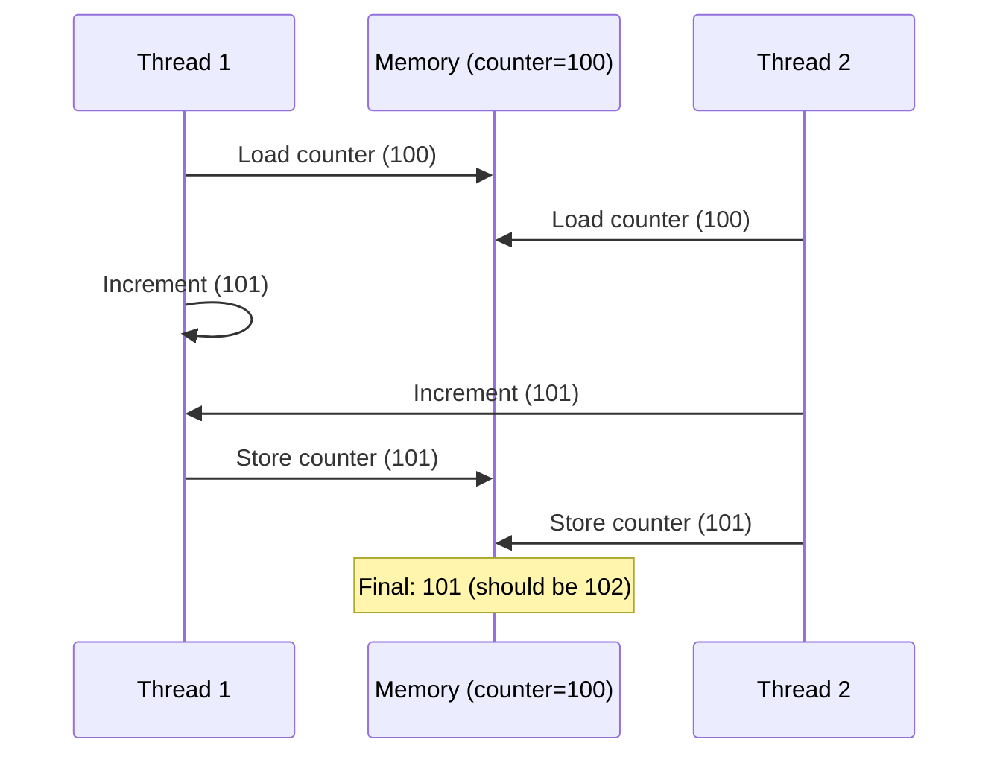
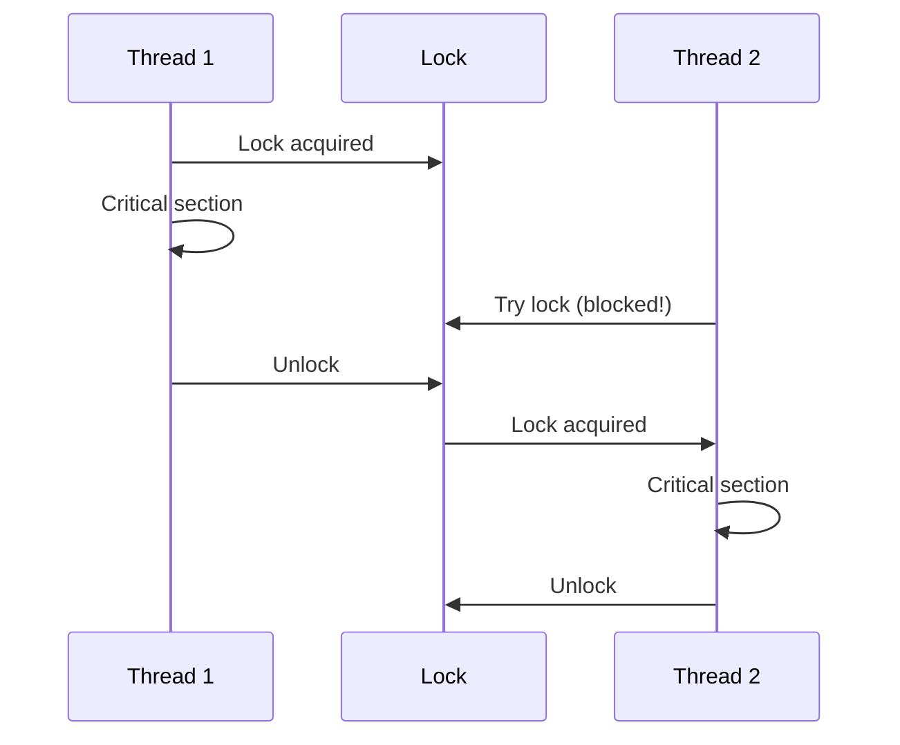
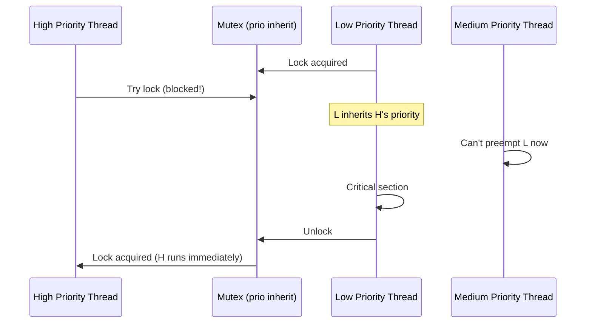
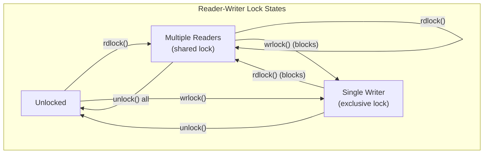
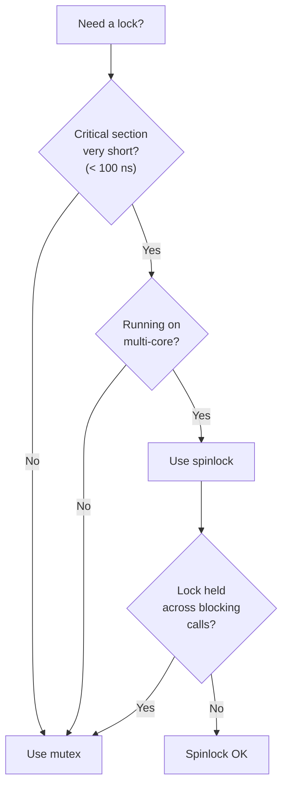
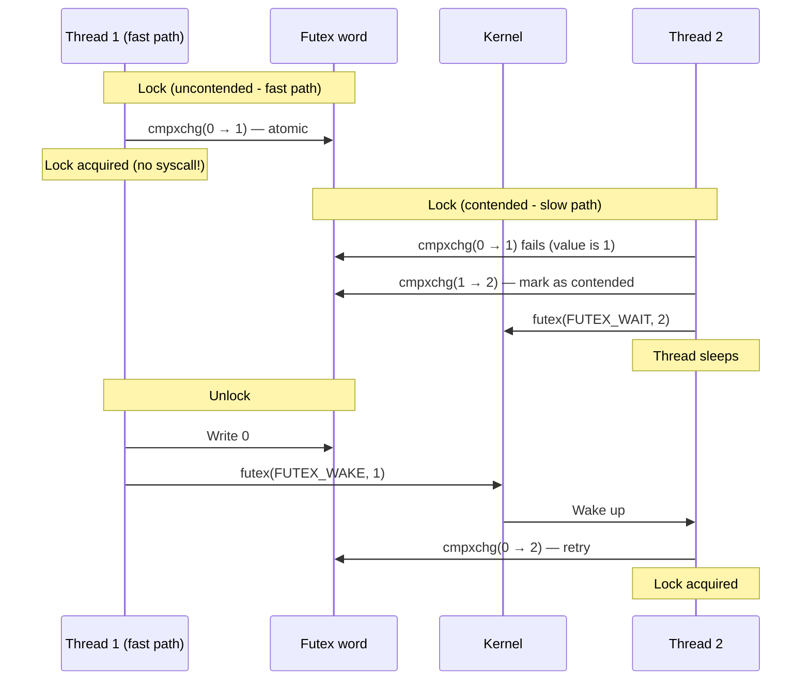
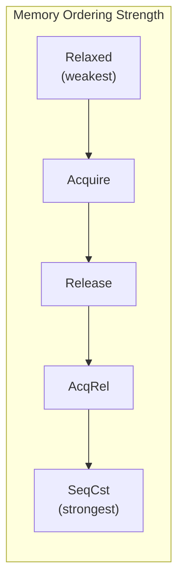

# Chapter 267: Synchronization Primitives

## 1. Introduction

When multiple threads access shared data simultaneously, the result is a race condition — a bug that is timing-dependent, hard to reproduce, and catastrophic in production. Synchronization primitives are the tools that prevent race conditions by controlling the order in which threads access shared resources.

This chapter covers the complete spectrum of synchronization mechanisms available on Linux: mutexes, read-write locks, spinlocks, barriers, condition variables, futex-based synchronization, and atomic operations. Understanding when to use each primitive — and when not to — is essential for writing high-performance concurrent code.

## 2. Intuition: The Critical Section Problem

### 2.1 What is a Race Condition?

```c
// Shared variable
static int counter = 0;

// Two threads execute this concurrently
void *increment(void *arg)
{
    for (int i = 0; i < 1000000; i++) {
        counter++;  // NOT ATOMIC!
    }
    return NULL;
}

// Expected result: counter == 2000000
// Actual result: counter == ??? (likely less than 2000000)
```

The `counter++` operation is actually three instructions:
1. Load `counter` from memory into a register
2. Increment the register
3. Store the register back to memory

If two threads execute these steps concurrently, they can interleave:



### 2.2 Mutual Exclusion

The solution is mutual exclusion — ensuring that only one thread at a time can execute the critical section:



## 3. Mutexes

### 3.1 pthread_mutex_t

A mutex (mutual exclusion) is the most basic synchronization primitive. Only one thread can hold a mutex at a time.

```c
#include <pthread.h>

// Initialization
int pthread_mutex_init(pthread_mutex_t *mutex, const pthread_mutexattr_t *attr);
pthread_mutex_t mutex = PTHREAD_MUTEX_INITIALIZER;  // Static init

// Operations
int pthread_mutex_lock(pthread_mutex_t *mutex);
int pthread_mutex_trylock(pthread_mutex_t *mutex);
int pthread_mutex_unlock(pthread_mutex_t *mutex);
int pthread_mutex_destroy(pthread_mutex_t *mutex);
```

### 3.2 Mutex Types

```c
pthread_mutexattr_t attr;
pthread_mutexattr_init(&attr);

// Set mutex type
pthread_mutexattr_settype(&attr, type);
```

| Type | Behavior | Use Case |
|------|----------|----------|
| `PTHREAD_MUTEX_NORMAL` | No error checking. Deadlock if re-locked by same thread. | Default, high performance |
| `PTHREAD_MUTEX_ERRORCHECK` | Returns `EDEADLK` on re-lock. Returns `EPERM` on unlock by non-owner. | Debugging |
| `PTHREAD_MUTEX_RECURSIVE` | Allows re-locking by same thread. Must be unlocked same number of times. | Recursive algorithms |
| `PTHREAD_MUTEX_DEFAULT` | Implementation-defined (usually NORMAL on Linux) | Default |

```c
// Recursive mutex example
pthread_mutex_t rmutex;
pthread_mutexattr_t attr;

pthread_mutexattr_init(&attr);
pthread_mutexattr_settype(&attr, PTHREAD_MUTEX_RECURSIVE);
pthread_mutex_init(&rmutex, &attr);
pthread_mutexattr_destroy(&attr);

// Can lock multiple times from same thread
pthread_mutex_lock(&rmutex);
pthread_mutex_lock(&rmutex);   // OK — recursive
pthread_mutex_unlock(&rmutex);
pthread_mutex_unlock(&rmutex); // Must unlock twice
```

### 3.3 Priority Inheritance Mutex

For real-time systems, priority inversion can be a serious problem:

```c
// Priority inheritance: if a high-priority thread blocks on a mutex
// held by a low-priority thread, the low-priority thread temporarily
// inherits the high priority.

pthread_mutexattr_t attr;
pthread_mutexattr_init(&attr);
pthread_mutexattr_setprotocol(&attr, PTHREAD_PRIO_INHERIT);
pthread_mutex_init(&mutex, &attr);
```



## 4. Read-Write Locks

### 4.1 pthread_rwlock_t

Read-write locks allow multiple concurrent readers OR a single writer:

```c
#include <pthread.h>

int pthread_rwlock_init(pthread_rwlock_t *rwlock, const pthread_rwlockattr_t *attr);
int pthread_rwlock_destroy(pthread_rwlock_t *rwlock);

// Read lock (shared)
int pthread_rwlock_rdlock(pthread_rwlock_t *rwlock);
int pthread_rwlock_tryrdlock(pthread_rwlock_t *rwlock);

// Write lock (exclusive)
int pthread_rwlock_wrlock(pthread_rwlock_t *rwlock);
int pthread_rwlock_trywrlock(pthread_rwlock_t *rwlock);

// Unlock (for both read and write)
int pthread_rwlock_unlock(pthread_rwlock_t *rwlock);

// Timed versions
int pthread_rwlock_timedrdlock(pthread_rwlock_t *rwlock, const struct timespec *abstime);
int pthread_rwlock_timedwrlock(pthread_rwlock_t *rwlock, const struct timespec *abstime);
```

### 4.2 Read-Write Lock Behavior



### 4.3 Example: Thread-Safe Cache

```c
#include <stdio.h>
#include <stdlib.h>
#include <string.h>
#include <pthread.h>

#define CACHE_SIZE 256

struct cache_entry {
    char *key;
    void *value;
    size_t size;
    int valid;
};

static struct cache_entry cache[CACHE_SIZE];
static pthread_rwlock_t cache_lock = PTHREAD_RWLOCK_INITIALIZER;

// Lookup (readers can be concurrent)
void *cache_get(const char *key, size_t *size)
{
    pthread_rwlock_rdlock(&cache_lock);

    for (int i = 0; i < CACHE_SIZE; i++) {
        if (cache[i].valid && strcmp(cache[i].key, key) == 0) {
            *size = cache[i].size;
            void *result = cache[i].value;
            pthread_rwlock_unlock(&cache_lock);
            return result;
        }
    }

    pthread_rwlock_unlock(&cache_lock);
    return NULL;
}

// Insert (writer needs exclusive access)
int cache_put(const char *key, void *value, size_t size)
{
    pthread_rwlock_wrlock(&cache_lock);

    // Find empty slot or evict
    int slot = -1;
    for (int i = 0; i < CACHE_SIZE; i++) {
        if (!cache[i].valid) {
            slot = i;
            break;
        }
    }

    if (slot == -1)
        slot = 0;  // Simple eviction: overwrite first entry

    free(cache[slot].key);
    free(cache[slot].value);

    cache[slot].key = strdup(key);
    cache[slot].value = malloc(size);
    memcpy(cache[slot].value, value, size);
    cache[slot].size = size;
    cache[slot].valid = 1;

    pthread_rwlock_unlock(&cache_lock);
    return 0;
}
```

## 5. Spinlocks

### 5.1 pthread_spinlock_t

A spinlock busy-waits instead of sleeping when the lock is unavailable. This avoids the overhead of context switching but wastes CPU cycles.

```c
#include <pthread.h>

int pthread_spin_init(pthread_spinlock_t *lock, int pshared);
int pthread_spin_destroy(pthread_spinlock_t *lock);
int pthread_spin_lock(pthread_spinlock_t *lock);
int pthread_spin_trylock(pthread_spinlock_t *lock);
int pthread_spin_unlock(pthread_spinlock_t *lock);

// pshared:
// PTHREAD_PROCESS_PRIVATE — Only threads within the same process
// PTHREAD_PROCESS_SHARED — Can be shared between processes (in shared memory)
```

### 5.2 When to Use Spinlocks



**Use spinlocks when:**
- Critical section is very short (a few instructions)
- Running on a multi-core system
- Lock is not held across blocking operations
- Latency is more important than CPU usage

**Use mutexes when:**
- Critical section may take a long time
- Lock may be held across blocking calls
- CPU usage matters more than latency
- Uniprocessor system (spinlocks waste the only CPU)

## 6. Futex: The Foundation

### 6.1 What is a Futex?

A futex (Fast Userspace muTEX) is the low-level primitive that Linux uses to implement mutexes, condition variables, and semaphores. It's the bridge between user-space fast paths and kernel-based blocking.

```c
#include <linux/futex.h>
#include <sys/syscall.h>
#include <unistd.h>

int futex(int *uaddr, int futex_op, int val,
          const struct timespec *timeout, int *uaddr2, int val3);
```

### 6.2 How a Mutex Works with Futex



### 6.3 Custom Futex-Based Lock

```c
#include <linux/futex.h>
#include <sys/syscall.h>
#include <unistd.h>
#include <stdatomic.h>

static int futex_op(int *uaddr, int op, int val)
{
    return syscall(SYS_futex, uaddr, op, val, NULL, NULL, 0);
}

// Futex-based mutex
// States: 0 = unlocked, 1 = locked (no waiters), 2 = locked (with waiters)
typedef atomic_int futex_mutex_t;

#define FUTEX_MUTEX_INIT ATOMIC_VAR_INIT(0)

void futex_mutex_lock(futex_mutex_t *mutex)
{
    int expected = 0;
    // Fast path: try to acquire uncontended
    if (atomic_compare_exchange_strong(mutex, &expected, 1))
        return;  // Acquired!

    // Slow path: contention
    do {
        // Mark that there are waiters
        expected = 1;
        atomic_compare_exchange_strong(mutex, &expected, 2);

        // Wait in the kernel
        futex_op((int *)mutex, FUTEX_WAIT, 2);

        // Woken up — try again
        expected = 0;
    } while (!atomic_compare_exchange_strong(mutex, &expected, 2));
}

void futex_mutex_unlock(futex_mutex_t *mutex)
{
    // Fast path: no waiters
    if (atomic_exchange(mutex, 0) == 1)
        return;  // No waiters, done

    // Slow path: wake one waiter
    futex_op((int *)mutex, FUTEX_WAKE, 1);
}
```

## 7. Atomic Operations

### 7.1 C11 Atomics

C11 introduced a standard atomic operations library:

```c
#include <stdatomic.h>

// Atomic types
atomic_int counter = ATOMIC_VAR_INIT(0);
atomic_flag flag = ATOMIC_FLAG_INIT;

// Load and store
int val = atomic_load(&counter);
atomic_store(&counter, 42);

// Atomic read-modify-write
atomic_fetch_add(&counter, 1);      // counter++
atomic_fetch_sub(&counter, 1);      // counter--
atomic_fetch_or(&counter, 0x01);    // counter |= 0x01
atomic_fetch_and(&counter, ~0x01);  // counter &= ~0x01
atomic_fetch_xor(&counter, 0x01);   // counter ^= 0x01

// Compare and swap
int expected = 0;
bool success = atomic_compare_exchange_strong(&counter, &expected, 1);
// If counter == 0, set to 1 and return true
// If counter != 0, set expected = counter and return false

// Atomic flag (lock-free guaranteed)
atomic_flag_test_and_set(&flag);   // Set flag, return old value
atomic_flag_clear(&flag);          // Clear flag
```

### 7.2 Memory Ordering

```c
// Memory ordering controls how atomic operations synchronize with other memory operations

// Relaxed ordering — no synchronization guarantees
atomic_fetch_add_explicit(&counter, 1, memory_order_relaxed);

// Acquire ordering — ensures subsequent reads see writes before the release
atomic_load_explicit(&flag, memory_order_acquire);

// Release ordering — ensures prior writes are visible after the acquire
atomic_store_explicit(&flag, 1, memory_order_release);

// AcqRel — both acquire and release (for read-modify-write)
atomic_fetch_add_explicit(&counter, 1, memory_order_acq_rel);

// SeqCst — sequential consistency (strongest, default)
atomic_store_explicit(&flag, 1, memory_order_seq_cst);
```



### 7.3 Spinlock Using Atomics

```c
#include <stdatomic.h>

typedef atomic_flag spinlock_t;

#define SPINLOCK_INIT ATOMIC_FLAG_INIT

void spinlock_lock(spinlock_t *lock)
{
    while (atomic_flag_test_and_set_explicit(lock, memory_order_acquire))
        ;  // Spin
}

void spinlock_unlock(spinlock_t *lock)
{
    atomic_flag_clear_explicit(lock, memory_order_release);
}

int spinlock_trylock(spinlock_t *lock)
{
    return !atomic_flag_test_and_set_explicit(lock, memory_order_acquire);
}
```

## 8. Barriers (Memory Barriers)

### 8.1 Hardware Memory Barriers

On modern CPUs, memory operations can be reordered for performance. Memory barriers prevent this reordering:

```c
// Full memory barrier
__sync_synchronize();  // GCC built-in
__atomic_thread_fence(__ATOMIC_SEQ_CST);  // C11

// Compiler barrier (prevents compiler reordering, not CPU)
asm volatile("" ::: "memory");
```

### 8.2 Data Dependency Barriers

```c
// Read barrier: all reads before the barrier complete before reads after
__atomic_thread_fence(__ATOMIC_ACQUIRE);

// Write barrier: all writes before the barrier complete before writes after
__atomic_thread_fence(__ATOMIC_RELEASE);
```

## 9. Advanced Synchronization Techniques

### 9.1 Lock-Free Programming

Lock-free programming avoids traditional locks entirely, using atomic operations to ensure correctness. While powerful, it is significantly more complex and error-prone than lock-based programming.

The key primitive is compare-and-swap (CAS), which atomically compares a memory location with an expected value and, if they match, stores a new value:

```c
#include <stdatomic.h>

// Lock-free increment
void lock_free_increment(atomic_int *counter)
{
    int old_val = atomic_load(counter);
    while (!atomic_compare_exchange_weak(counter, &old_val, old_val + 1)) {
        // old_val is updated automatically on failure
    }
}
```

Lock-free data structures are useful in scenarios where blocking is unacceptable (real-time systems, interrupt handlers) or where the overhead of lock contention is too high.

### 9.2 Memory Ordering in Practice

Understanding memory ordering is essential for correct concurrent programming:

```c
// Producer-consumer with acquire-release ordering
atomic_int data;
atomic_int ready = ATOMIC_VAR_INIT(0);

// Producer:
data.store(42, memory_order_relaxed);
ready.store(1, memory_order_release);  // Release: all prior writes visible

// Consumer:
if (ready.load(memory_order_acquire)) {  // Acquire: see all prior writes
    int val = data.load(memory_order_relaxed);  // Guaranteed to see 42
}
```

### 9.3 SeqLock — Read-Optimized Locking

A SeqLock allows readers to never block, at the cost of potentially having to retry if a write occurs during their read:

```c
#include <stdatomic.h>

typedef struct {
    atomic_uint sequence;
    pthread_mutex_t writer_lock;
} seqlock_t;

void seqlock_read_begin(seqlock_t *sl, unsigned *seq)
{
    do {
        *seq = atomic_load_explicit(&sl->sequence, memory_order_acquire);
    } while (*seq & 1);  // Odd means writer is active
}

int seqlock_read_validate(seqlock_t *sl, unsigned seq)
{
    atomic_thread_fence(memory_order_acquire);
    return atomic_load_explicit(&sl->sequence, memory_order_relaxed) == seq;
}

void seqlock_write_begin(seqlock_t *sl)
{
    pthread_mutex_lock(&sl->writer_lock);
    atomic_fetch_add_explicit(&sl->sequence, 1, memory_order_release);
    atomic_thread_fence(memory_order_release);
}

void seqlock_write_end(seqlock_t *sl)
{
    atomic_fetch_add_explicit(&sl->sequence, 1, memory_order_release);
    pthread_mutex_unlock(&sl->writer_lock);
}
```

SeqLocks are used in the Linux kernel for data that is read very frequently but written rarely (e.g., jiffies, xtime).

## 10. Semaphore (POSIX)

### 10.1 Named and Unnamed Semaphores

```c
#include <semaphore.h>

// Unnamed (memory-based)
sem_t sem;
sem_init(&sem, 0, 1);  // pshared=0, value=1
sem_wait(&sem);         // P (decrement, block if 0)
sem_post(&sem);         // V (increment)
sem_trywait(&sem);      // Non-blocking P
sem_timedwait(&sem, &timeout);  // Timed P
sem_destroy(&sem);

// Named (file-system visible)
sem_t *sem = sem_open("/mysem", O_CREAT, 0644, 1);
sem_wait(sem);
sem_post(sem);
sem_close(sem);
sem_unlink("/mysem");
```

### 9.2 Binary Semaphore vs. Mutex

A binary semaphore (value 0 or 1) looks like a mutex but has a key difference: **a mutex has ownership** (only the locking thread can unlock), while a semaphore does not.

```c
// Mutex: Thread A locks, Thread A must unlock
pthread_mutex_lock(&mutex);
// ... critical section ...
pthread_mutex_unlock(&mutex);  // Must be same thread

// Semaphore: Thread A waits, Thread B can post
// Thread A:
sem_wait(&sem);
// ... use resource ...

// Thread B:
sem_post(&sem);  // Can be different thread!
```

### 9.3 Counting Semaphores

A counting semaphore initialized to N allows up to N concurrent accesses. This is useful for resource pools:

```c
#include <semaphore.h>

#define MAX_CONNECTIONS 10

static sem_t connection_pool;

void init_pool(void)
{
    sem_init(&connection_pool, 0, MAX_CONNECTIONS);
}

void *handle_request(void *arg)
{
    // Acquire a connection (blocks if pool is empty)
    sem_wait(&connection_pool);

    // Use the connection
    process_request(arg);

    // Release the connection
    sem_post(&connection_pool);
    return NULL;
}
```

### 9.4 Semaphore Performance Considerations

POSIX unnamed semaphores using `sem_init()` with `pshared=0` are implemented using futexes on Linux, making them very fast for intra-process synchronization. Named semaphores (`sem_open()`) are slower because they involve filesystem operations.

For thread-only synchronization, prefer mutexes or condition variables. Use semaphores when you need cross-process signaling.

## 10. Common Pitfalls

### 10.1 Deadlock

```c
// DEADLOCK: Two threads acquire locks in opposite order
// Thread A:
pthread_mutex_lock(&mutex1);
pthread_mutex_lock(&mutex2);  // Waits for Thread B

// Thread B:
pthread_mutex_lock(&mutex2);
pthread_mutex_lock(&mutex1);  // Waits for Thread A

// SOLUTION: Always acquire locks in the same order
// Both threads:
pthread_mutex_lock(&mutex1);
pthread_mutex_lock(&mutex2);
// ... work ...
pthread_mutex_unlock(&mutex2);
pthread_mutex_unlock(&mutex1);
```

### 10.2 Priority Inversion

Without priority inheritance, a medium-priority thread can preempt the low-priority holder of a lock needed by a high-priority thread, indirectly blocking the high-priority thread.

### 10.3 Lock Contention

Too many threads fighting for the same lock:

```c
// BAD: Single global lock
pthread_mutex_lock(&global_lock);
// ... access any shared data ...
pthread_mutex_unlock(&global_lock);

// BETTER: Fine-grained locking
pthread_mutex_lock(&data[i].lock);
// ... access data[i] only ...
pthread_mutex_unlock(&data[i].lock);
```

### 10.4 Using Spinlocks for Long Operations

```c
// BAD: Spinlock held during I/O
pthread_spin_lock(&lock);
read(fd, buf, size);  // May block for milliseconds!
pthread_spin_unlock(&lock);

// GOOD: Use mutex for potentially blocking operations
pthread_mutex_lock(&mutex);
read(fd, buf, size);
pthread_mutex_unlock(&mutex);
```

## 11. Best Practices

1. **Use the coarsest lock that provides acceptable performance** — fine-grained locking is error-prone.
2. **Always use `while` (not `if`) with condition variables** — handle spurious wakeups.
3. **Document lock ordering** to prevent deadlocks.
4. **Use `trylock` for optional locking** — avoid blocking when the lock is contended.
5. **Prefer mutexes over spinlocks** unless you have measured that spinlocks are faster.
6. **Use atomic operations for simple counters and flags** — no lock needed.
7. **Use `memory_order_relaxed` when ordering doesn't matter** — e.g., statistics counters.
8. **Use `memory_order_acquire`/`memory_order_release`** for producer-consumer patterns.
9. **Test with ThreadSanitizer** (`-fsanitize=thread`) to find data races.
10. **Use higher-level abstractions** (lock-free queues, concurrent hash maps) when available.

## 12. Exercises

### Exercise 1: Lock-Free Stack
Implement a lock-free stack using CAS (compare-and-swap) operations.

### Exercise 2: Read-Write Lock with Writer Priority
Implement a read-write lock that gives priority to writers (no writer starvation).

### Exercise 3: Semaphore-Based Barrier
Implement a barrier using only semaphores.

### Exercise 4: Dining Philosophers
Solve the dining philosophers problem using mutexes with deadlock prevention.

## 13. References

- **The Linux Programming Interface** by Michael Kerrisk — Chapters 30, 53: Threads synchronization, POSIX semaphores
- **"Is Parallel Programming Hard, And, If So, What Can You Do About It?"** by Paul E. McKenney — Free book on synchronization
- **man pages**: `man 3 pthread_mutex_lock`, `man 3 pthread_rwlock_rdlock`, `man 3 pthread_spin_lock`, `man 2 futex`, `man 7 futex`
- **C11 Standard** — `<stdatomic.h>` specification
- **Linux kernel source**: `kernel/futex/` — Futex implementation
