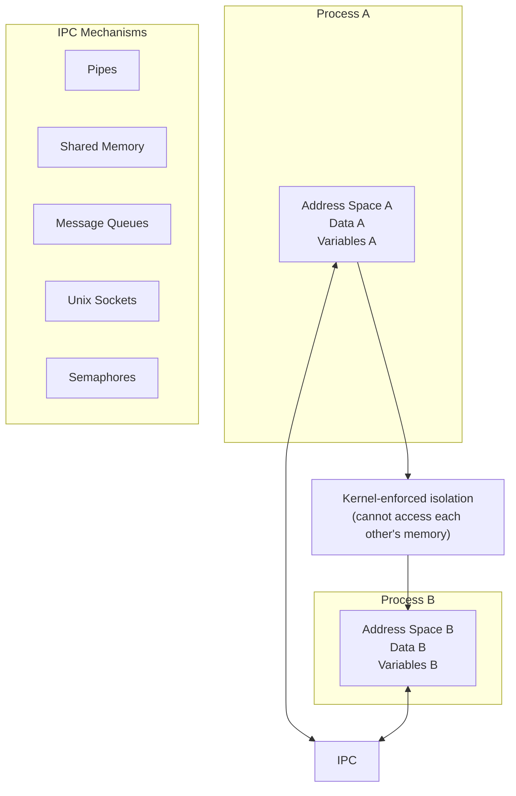
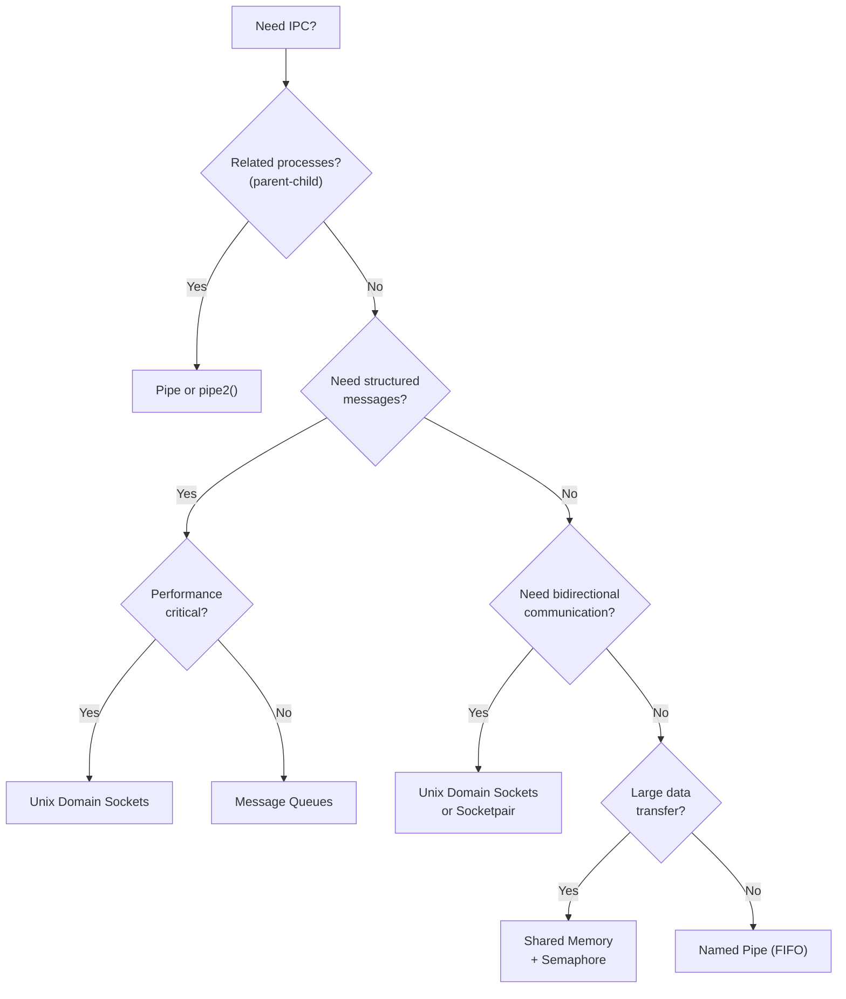

# Chapter 268: IPC — Inter-Process Communication

## 1. Introduction

Inter-Process Communication (IPC) refers to the mechanisms that allow processes to exchange data and synchronize their actions. Since each process has its own address space, they cannot directly access each other's memory. IPC mechanisms provide the bridge.

Linux offers a rich set of IPC mechanisms, from the simple pipes inherited from UNIX to the more sophisticated POSIX IPC interfaces. This chapter covers all major IPC mechanisms: pipes, FIFOs, System V IPC (message queues, semaphores, shared memory), POSIX IPC, and Unix domain sockets.

## 2. Intuition: Why IPC Matters

### 2.1 The Process Isolation Problem



### 2.2 Choosing an IPC Mechanism



| Mechanism | Direction | Related? | Structured? | Speed | Persistence |
|-----------|-----------|----------|-------------|-------|-------------|
| Pipe | Unidirectional | Yes | Byte stream | Fast | None |
| FIFO | Unidirectional | No | Byte stream | Fast | Filesystem |
| Unix Socket | Bidirectional | No | Byte/datagram | Fast | Filesystem |
| Socketpair | Bidirectional | Yes | Byte stream | Fast | None |
| SysV Message Queue | Bidirectional | No | Messages | Medium | Kernel |
| POSIX Message Queue | Bidirectional | No | Messages | Medium | Kernel |
| Shared Memory | Shared | No | Raw bytes | Fastest | Kernel |
| SysV Semaphore | N/A | No | Counter | Fast | Kernel |

## 3. Pipes

### 3.1 Anonymous Pipes

A pipe is the simplest IPC mechanism — a unidirectional byte stream with two file descriptors: one for reading, one for writing.

```c
#include <unistd.h>

int pipe(int pipefd[2]);
int pipe2(int pipefd[2], int flags);  // Linux-specific
```

```c
#include <stdio.h>
#include <stdlib.h>
#include <string.h>
#include <unistd.h>
#include <sys/wait.h>

int main(void)
{
    int pipefd[2];
    pid_t pid;

    if (pipe(pipefd) == -1) {
        perror("pipe");
        return 1;
    }

    pid = fork();
    if (pid == -1) {
        perror("fork");
        return 1;
    }

    if (pid == 0) {
        // Child: read from pipe
        close(pipefd[1]);  // Close write end

        char buf[256];
        ssize_t n;
        while ((n = read(pipefd[0], buf, sizeof(buf) - 1)) > 0) {
            buf[n] = '\0';
            printf("Child received: %s", buf);
        }
        close(pipefd[0]);
        _exit(0);
    } else {
        // Parent: write to pipe
        close(pipefd[0]);  // Close read end

        const char *msg = "Hello from parent!\n";
        write(pipefd[1], msg, strlen(msg));
        close(pipefd[1]);  // Send EOF to child

        waitpid(pid, NULL, 0);
    }

    return 0;
}
```

### 3.2 Pipe Capacity and Blocking

On Linux, a pipe has a default capacity of 65536 bytes (16 pages). When the pipe is full, `write()` blocks. When the pipe is empty, `read()` blocks.

```c
// Get pipe capacity (Linux-specific)
long capacity = fcntl(pipefd[0], F_GETPIPE_SZ);
printf("Pipe capacity: %ld bytes\n", capacity);

// Set pipe capacity (must be between 4096 and 1048576)
fcntl(pipefd[0], F_SETPIPE_SZ, 131072);
```

### 3.3 pipe2() Flags

```c
// Non-blocking I/O
pipe2(pipefd, O_NONBLOCK);
// Both read and write ends are non-blocking

// Close-on-exec
pipe2(pipefd, O_CLOEXEC);
// Pipe fds are closed when exec() is called
```

### 3.4 Using Pipes for Redirection

```c
#include <unistd.h>
#include <sys/wait.h>

// Capture output of a child process
int main(void)
{
    int pipefd[2];
    pipe(pipefd);

    pid_t pid = fork();
    if (pid == 0) {
        // Child
        close(pipefd[0]);
        dup2(pipefd[1], STDOUT_FILENO);  // Redirect stdout to pipe
        close(pipefd[1]);
        execlp("ls", "ls", "-la", NULL);
        _exit(127);
    }

    // Parent
    close(pipefd[1]);
    char buf[4096];
    ssize_t n;
    while ((n = read(pipefd[0], buf, sizeof(buf))) > 0) {
        write(STDOUT_FILENO, buf, n);
    }
    close(pipefd[0]);
    waitpid(pid, NULL, 0);
    return 0;
}
```

## 4. FIFOs (Named Pipes)

### 4.1 Creating FIFOs

A FIFO (First In, First Out) is like a pipe but has a name in the filesystem, allowing unrelated processes to communicate.

```c
#include <sys/stat.h>

int mkfifo(const char *pathname, mode_t mode);
int mkfifoat(int dirfd, const char *pathname, mode_t mode);
```

```c
// Writer process
#include <stdio.h>
#include <fcntl.h>
#include <unistd.h>

int main(void)
{
    mkfifo("/tmp/myfifo", 0666);

    int fd = open("/tmp/myfifo", O_WRONLY);
    write(fd, "Hello via FIFO\n", 15);
    close(fd);
    return 0;
}
```

```c
// Reader process
#include <stdio.h>
#include <fcntl.h>
#include <unistd.h>

int main(void)
{
    int fd = open("/tmp/myfifo", O_RDONLY);
    char buf[256];
    ssize_t n = read(fd, buf, sizeof(buf) - 1);
    if (n > 0) {
        buf[n] = '\0';
        printf("Received: %s", buf);
    }
    close(fd);
    return 0;
}
```

### 4.2 FIFO Semantics

- `open()` for reading blocks until a writer opens the FIFO (and vice versa).
- When all writers close the FIFO, readers get EOF.
- When all readers close the FIFO, writers get `SIGPIPE` (or `EPIPE`).
- Use `O_NONBLOCK` for `open()` to avoid blocking:
  - `open(fifo, O_RDONLY | O_NONBLOCK)` returns immediately, even without a writer.
  - `open(fifo, O_WRONLY | O_NONBLOCK)` fails with `ENXIO` if no reader.

## 5. System V IPC

### 5.1 Overview

System V IPC (introduced in AT&T UNIX System V, 1983) includes three mechanisms:

1. **Message Queues** — Send/receive messages
2. **Semaphore Sets** — Synchronize processes
3. **Shared Memory Segments** — Share memory between processes

All three use a common identifier scheme (keys) and a common control mechanism (`shmctl`, `msgctl`, `semctl`).

### 5.2 IPC Keys

```c
#include <sys/ipc.h>

// Generate a key from a file path and project ID
key_t ftok(const char *pathname, int proj_id);

// Or use IPC_PRIVATE for private (non-shared) IPC
key_t key = IPC_PRIVATE;
```

### 5.3 System V Shared Memory

```c
#include <sys/shm.h>

// Create or get a shared memory segment
int shmget(key_t key, size_t size, int shmflg);

// Attach shared memory to process address space
void *shmat(int shmid, const void *shmaddr, int shmflg);

// Detach shared memory
int shmdt(const void *shmaddr);

// Control operations
int shmctl(int shmid, int cmd, struct shmid_ds *buf);
```

```c
#include <stdio.h>
#include <stdlib.h>
#include <string.h>
#include <sys/ipm.h>
#include <sys/shm.h>
#include <sys/wait.h>
#include <unistd.h>

#define SHM_SIZE 4096

int main(void)
{
    // Create shared memory segment
    key_t key = ftok("/tmp", 'R');
    int shmid = shmget(key, SHM_SIZE, IPC_CREAT | 0666);
    if (shmid == -1) {
        perror("shmget");
        return 1;
    }

    pid_t pid = fork();
    if (pid == 0) {
        // Child: attach and read
        char *shm = shmat(shmid, NULL, 0);
        if (shm == (void *)-1) {
            perror("shmat");
            _exit(1);
        }

        // Wait for parent to write (simple synchronization)
        while (shm[0] == 0)
            usleep(1000);

        printf("Child read: %s\n", shm);
        shmdt(shm);
        _exit(0);
    }

    // Parent: attach and write
    char *shm = shmat(shmid, NULL, 0);
    if (shm == (void *)-1) {
        perror("shmat");
        return 1;
    }

    memset(shm, 0, SHM_SIZE);
    strcpy(shm, "Hello from parent!");

    waitpid(pid, NULL, 0);

    // Cleanup
    shmdt(shm);
    shmctl(shmid, IPC_RMID, NULL);

    return 0;
}
```

### 5.4 System V Message Queues

```c
#include <sys/msg.h>

// Create or get a message queue
int msgget(key_t key, int msgflg);

// Send a message
int msgsnd(int msqid, const void *msgp, size_t msgsz, int msgflg);

// Receive a message
ssize_t msgrcv(int msqid, void *msgp, size_t msgsz, long msgtyp, int msgflg);

// Control operations
int msgctl(int msqid, int cmd, struct msqid_ds *buf);
```

```c
#include <stdio.h>
#include <stdlib.h>
#include <string.h>
#include <sys/ipc.h>
#include <sys/msg.h>
#include <sys/wait.h>
#include <unistd.h>

struct message {
    long mtype;       // Message type (must be > 0)
    char mtext[256];  // Message data
};

int main(void)
{
    key_t key = ftok("/tmp", 'M');
    int msqid = msgget(key, IPC_CREAT | 0666);

    pid_t pid = fork();
    if (pid == 0) {
        // Child: receive messages
        struct message msg;
        for (int i = 0; i < 3; i++) {
            msgrcv(msqid, &msg, sizeof(msg.mtext), 0, 0);
            printf("Child received (type %ld): %s\n", msg.mtype, msg.mtext);
        }
        _exit(0);
    }

    // Parent: send messages
    struct message msg;
    msg.mtype = 1;
    strcpy(msg.mtext, "Message type 1");
    msgsnd(msqid, &msg, strlen(msg.mtext) + 1, 0);

    msg.mtype = 2;
    strcpy(msg.mtext, "Message type 2");
    msgsnd(msqid, &msg, strlen(msg.mtext) + 1, 0);

    msg.mtype = 1;
    strcpy(msg.mtext, "Another type 1");
    msgsnd(msqid, &msg, strlen(msg.mtext) + 1, 0);

    waitpid(pid, NULL, 0);
    msgctl(msqid, IPC_RMID, NULL);

    return 0;
}
```

### 5.5 System V Semaphores

```c
#include <sys/sem.h>

// Create or get a semaphore set
int semget(key_t key, int nsems, int semflg);

// Semaphore operations
int semop(int semid, struct sembuf *sops, size_t nsops);

// Control operations
int semctl(int semid, int semnum, int cmd, ...);
```

```c
#include <stdio.h>
#include <sys/ipc.h>
#include <sys/sem.h>
#include <sys/wait.h>
#include <unistd.h>

// Semaphore operation helpers
static void sem_lock(int semid)
{
    struct sembuf op = {0, -1, 0};  // Decrement (P operation)
    semop(semid, &op, 1);
}

static void sem_unlock(int semid)
{
    struct sembuf op = {0, 1, 0};   // Increment (V operation)
    semop(semid, &op, 1);
}

int main(void)
{
    key_t key = ftok("/tmp", 'S');
    int semid = semget(key, 1, IPC_CREAT | 0666);
    semctl(semid, 0, SETVAL, 1);  // Initialize to 1 (binary semaphore)

    pid_t pid = fork();
    if (pid == 0) {
        sem_lock(semid);
        printf("Child: in critical section\n");
        sleep(1);
        printf("Child: leaving critical section\n");
        sem_unlock(semid);
        _exit(0);
    }

    sem_lock(semid);
    printf("Parent: in critical section\n");
    sleep(1);
    printf("Parent: leaving critical section\n");
    sem_unlock(semid);

    waitpid(pid, NULL, 0);
    semctl(semid, 0, IPC_RMID);

    return 0;
}
```

## 6. POSIX IPC

### 6.1 POSIX vs. System V

POSIX IPC provides a cleaner, more modern API:

| Feature | System V | POSIX |
|---------|----------|-------|
| Naming | Integer keys (ftok) | String names (`/myqueue`) |
| Permissions | `shmctl`/`msgctl` | `fchmod`/`fchown` |
| Close/Unlink | `shmctl(IPC_RMID)` | `shm_unlink()` |
| Polling | `msgrcv` with `IPC_NOWAIT` | `mq_timedreceive` |
| Notification | None | `mq_notify` with signals |

### 6.2 POSIX Shared Memory

```c
#include <sys/mman.h>
#include <sys/stat.h>
#include <fcntl.h>

// Create/open shared memory object
int shm_open(const char *name, int oflag, mode_t mode);

// Remove shared memory object
int shm_unlink(const char *name);

// Set size (like ftruncate)
int ftruncate(int fd, off_t length);
```

```c
#include <stdio.h>
#include <stdlib.h>
#include <string.h>
#include <fcntl.h>
#include <sys/mman.h>
#include <sys/stat.h>
#include <unistd.h>
#include <sys/wait.h>

#define SHM_NAME "/my_shm"
#define SHM_SIZE 4096

int main(void)
{
    // Create shared memory object
    int shm_fd = shm_open(SHM_NAME, O_CREAT | O_RDWR, 0666);
    if (shm_fd == -1) {
        perror("shm_open");
        return 1;
    }

    ftruncate(shm_fd, SHM_SIZE);

    // Map into address space
    void *addr = mmap(NULL, SHM_SIZE, PROT_READ | PROT_WRITE,
                       MAP_SHARED, shm_fd, 0);
    if (addr == MAP_FAILED) {
        perror("mmap");
        return 1;
    }

    pid_t pid = fork();
    if (pid == 0) {
        // Child: read from shared memory
        volatile char *shm = addr;
        while (shm[0] == 0)
            usleep(1000);
        printf("Child read: %s\n", shm);
        munmap(addr, SHM_SIZE);
        _exit(0);
    }

    // Parent: write to shared memory
    strcpy((char *)addr, "Hello from parent via POSIX shm!");
    waitpid(pid, NULL, 0);

    // Cleanup
    munmap(addr, SHM_SIZE);
    close(shm_fd);
    shm_unlink(SHM_NAME);

    return 0;
}
```

## 7. Unix Domain Sockets

### 7.1 What Are Unix Domain Sockets?

Unix domain sockets provide bidirectional IPC using the socket API but without network overhead. They support both stream (`SOCK_STREAM`) and datagram (`SOCK_DGRAM`) modes.

```c
#include <sys/socket.h>
#include <sys/un.h>

// Create a Unix domain socket
int fd = socket(AF_UNIX, SOCK_STREAM, 0);

// Bind to a path
struct sockaddr_un addr;
addr.sun_family = AF_UNIX;
strcpy(addr.sun_path, "/tmp/mysocket");
bind(fd, (struct sockaddr *)&addr, sizeof(addr));
```

### 7.2 Socketpair — Bidirectional Pipe

```c
#include <sys/socket.h>

int socketpair(int domain, int type, int protocol, int sv[2]);
```

```c
#include <stdio.h>
#include <string.h>
#include <unistd.h>
#include <sys/socket.h>
#include <sys/wait.h>

int main(void)
{
    int sv[2];
    if (socketpair(AF_UNIX, SOCK_STREAM, 0, sv) == -1) {
        perror("socketpair");
        return 1;
    }

    pid_t pid = fork();
    if (pid == 0) {
        close(sv[0]);
        char buf[256];
        ssize_t n = read(sv[1], buf, sizeof(buf));
        buf[n] = '\0';
        printf("Child received: %s\n", buf);
        write(sv[1], "Pong!", 5);
        close(sv[1]);
        _exit(0);
    }

    close(sv[1]);
    write(sv[0], "Ping!", 5);
    char buf[256];
    ssize_t n = read(sv[0], buf, sizeof(buf));
    buf[n] = '\0';
    printf("Parent received: %s\n", buf);
    close(sv[0]);

    waitpid(pid, NULL, 0);
    return 0;
}
```

### 7.3 Unix Socket Server

```c
#include <stdio.h>
#include <stdlib.h>
#include <string.h>
#include <unistd.h>
#include <sys/socket.h>
#include <sys/un.h>

#define SOCKET_PATH "/tmp/unix_socket_example"

int main(void)
{
    int server_fd = socket(AF_UNIX, SOCK_STREAM, 0);
    if (server_fd == -1) {
        perror("socket");
        return 1;
    }

    struct sockaddr_un addr;
    memset(&addr, 0, sizeof(addr));
    addr.sun_family = AF_UNIX;
    strncpy(addr.sun_path, SOCKET_PATH, sizeof(addr.sun_path) - 1);

    unlink(SOCKET_PATH);  // Remove stale socket

    if (bind(server_fd, (struct sockaddr *)&addr, sizeof(addr)) == -1) {
        perror("bind");
        return 1;
    }

    if (listen(server_fd, 5) == -1) {
        perror("listen");
        return 1;
    }

    printf("Server listening on %s\n", SOCKET_PATH);

    while (1) {
        int client_fd = accept(server_fd, NULL, NULL);
        if (client_fd == -1) {
            perror("accept");
            continue;
        }

        char buf[256];
        ssize_t n = read(client_fd, buf, sizeof(buf));
        if (n > 0) {
            buf[n] = '\0';
            printf("Received: %s\n", buf);
            write(client_fd, "ACK", 3);
        }

        close(client_fd);
    }

    close(server_fd);
    unlink(SOCKET_PATH);
    return 0;
}
```

## 7. Advanced IPC Patterns

### 7.1 File Descriptor Passing

Unix domain sockets support passing file descriptors between processes using `sendmsg()` and `recvmsg()`. This allows one process to open a file and pass the fd to another process:

```c
#include <sys/socket.h>
#include <sys/un.h>

void send_fd(int socket, int fd_to_send)
{
    struct msghdr msg = {0};
    struct cmsghdr *cmsg;
    char buf[CMSG_SPACE(sizeof(int))];
    struct iovec io = {.iov_base = "x", .iov_len = 1};

    msg.msg_iov = &io;
    msg.msg_iovlen = 1;
    msg.msg_control = buf;
    msg.msg_controllen = sizeof(buf);

    cmsg = CMSG_FIRSTHDR(&msg);
    cmsg->cmsg_level = SOL_SOCKET;
    cmsg->cmsg_type = SCM_RIGHTS;
    cmsg->cmsg_len = CMSG_LEN(sizeof(int));
    *(int *)CMSG_DATA(cmsg) = fd_to_send;

    sendmsg(socket, &msg, 0);
}

int recv_fd(int socket)
{
    struct msghdr msg = {0};
    struct cmsghdr *cmsg;
    char buf[CMSG_SPACE(sizeof(int))];
    char dummy;
    struct iovec io = {.iov_base = &dummy, .iov_len = 1};

    msg.msg_iov = &io;
    msg.msg_iovlen = 1;
    msg.msg_control = buf;
    msg.msg_controllen = sizeof(buf);

    recvmsg(socket, &msg, 0);

    cmsg = CMSG_FIRSTHDR(&msg);
    if (cmsg && cmsg->cmsg_level == SOL_SOCKET && cmsg->cmsg_type == SCM_RIGHTS)
        return *(int *)CMSG_DATA(cmsg);

    return -1;
}
```

### 7.2 Pipe-Based Process Pipelines

Building UNIX-style pipelines with pipes:

```c
#include <unistd.h>
#include <sys/wait.h>

// ls | grep foo | wc -l
int main(void)
{
    int pipe1[2], pipe2[2];
    pipe(pipe1);
    pipe(pipe2);

    if (fork() == 0) {
        dup2(pipe1[1], STDOUT_FILENO);
        close(pipe1[0]); close(pipe1[1]);
        close(pipe2[0]); close(pipe2[1]);
        execlp("ls", "ls", NULL);
    }

    if (fork() == 0) {
        dup2(pipe1[0], STDIN_FILENO);
        dup2(pipe2[1], STDOUT_FILENO);
        close(pipe1[0]); close(pipe1[1]);
        close(pipe2[0]); close(pipe2[1]);
        execlp("grep", "grep", "foo", NULL);
    }

    if (fork() == 0) {
        dup2(pipe2[0], STDIN_FILENO);
        close(pipe1[0]); close(pipe1[1]);
        close(pipe2[0]); close(pipe2[1]);
        execlp("wc", "wc", "-l", NULL);
    }

    close(pipe1[0]); close(pipe1[1]);
    close(pipe2[0]); close(pipe2[1]);
    for (int i = 0; i < 3; i++) wait(NULL);
    return 0;
}
```

## 8. System V IPC Limits

```bash
# View IPC limits
ipcs -l

# View current IPC usage
ipcs -a

# Remove IPC resources
ipcrm -m <shmid>   # Remove shared memory
ipcrm -q <msqid>   # Remove message queue
ipcrm -s <semid>   # Remove semaphore
```

```c
// Programmatic limits query
#include <sys/shm.h>
#include <sys/msg.h>
#include <sys/sem.h>

// Shared memory limits
struct shminfo si;
shmctl(0, IPC_INFO, (struct shmid_ds *)&si);
printf("Max shared memory segments: %ld\n", si.shmmin);
printf("Max shared memory size: %ld\n", si.shmmax);

// Message queue limits
struct msginfo mi;
msgctl(0, IPC_INFO, (struct msqid_ds *)&mi);
```

## 9. Common Pitfalls

### 9.1 Forgetting to Remove IPC Resources
System V IPC resources persist until explicitly removed or the system reboots. Always clean up with `shmctl(IPC_RMID)`, `msgctl(IPC_RMID)`, `semctl(IPC_RMID)`.

### 9.2 Pipe Deadlock
If both ends of a pipe are full and both processes try to write, they'll deadlock. Use `select()`/`poll()` to manage multiple pipes.

### 9.3 Zombie Processes with IPC
Always `wait()` for child processes, or use `SIGCHLD` with `SA_NOCLDWAIT`.

### 9.4 Race Conditions with FIFOs
Opening a FIFO for reading blocks until a writer opens it (and vice versa). Use `O_NONBLOCK` and handle `ENXIO`.

### 9.5 Message Queue Type 0
In System V message queues, `mtype` must be > 0. Type 0 is not valid for `msgrcv()`.

## 10. Best Practices

1. **Use `pipe2()` with `O_CLOEXEC`** to prevent fd leaks to child processes.
2. **Use POSIX IPC** over System V IPC for new code — cleaner API, better integration.
3. **Use Unix domain sockets** for complex IPC — they support `sendmsg`/`recvmsg` with fd passing.
4. **Set pipe buffer sizes** appropriately for your workload.
5. **Use `O_NONBLOCK`** for non-blocking pipe/socket operations.
6. **Clean up IPC resources** — use `atexit()` handlers or signal handlers.
7. **Use `ftok()` carefully** — different files with the same inode can produce the same key.
8. **Consider using D-Bus** for desktop IPC or custom protocols for specific needs.
9. **Use `sendmsg`/`recvmsg`** for passing file descriptors between processes.
10. **Test IPC under load** — race conditions appear under high concurrency.

## 11. Exercises

### Exercise 1: Pipe-Based Shell
Implement a simple shell that supports pipe chains (`ls | grep foo | wc -l`).

### Exercise 2: Shared Memory Chat
Build a chat application using POSIX shared memory and semaphores.

### Exercise 3: IPC Benchmark
Write a benchmark that compares the throughput of pipes, FIFOs, Unix sockets, and shared memory.

### Exercise 4: File Descriptor Passing
Write a program that passes an open file descriptor from a parent to a child via Unix domain sockets.

## 12. References

- **The Linux Programming Interface** by Michael Kerrisk — Chapters 43-54: IPC
- **Advanced Programming in the UNIX Environment** by W. Richard Stevens — Chapters 15-17: IPC
- **man pages**: `man 2 pipe`, `man 3 mkfifo`, `man 2 shmget`, `man 3 shm_open`, `man 2 socketpair`, `man 7 unix`
- **Beej's Guide to Unix IPC**: https://beej.us/guide/bgipc/
